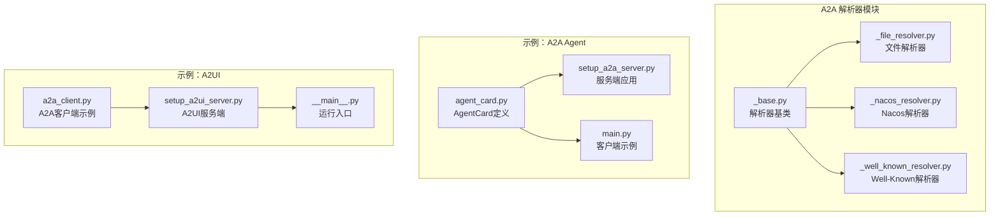
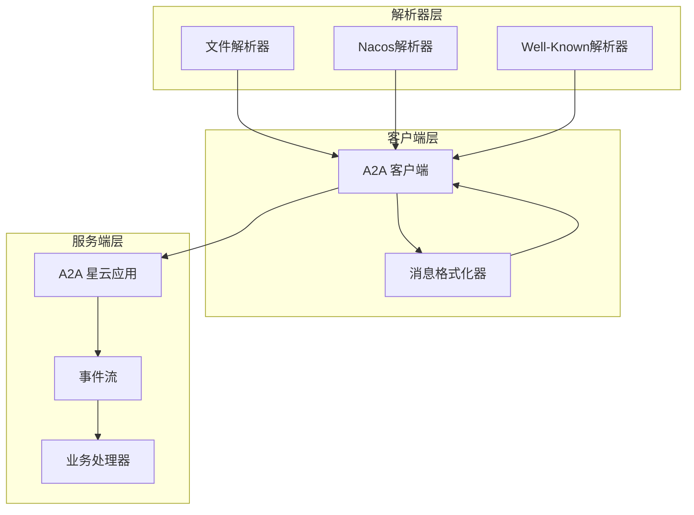
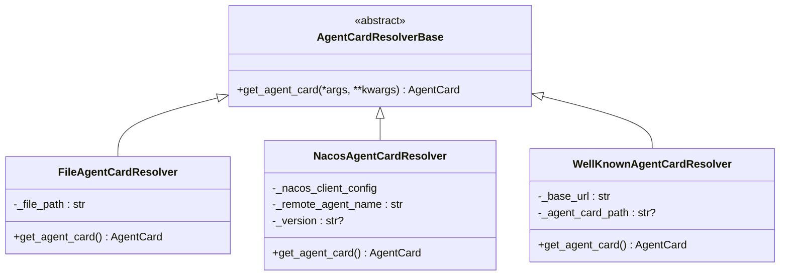
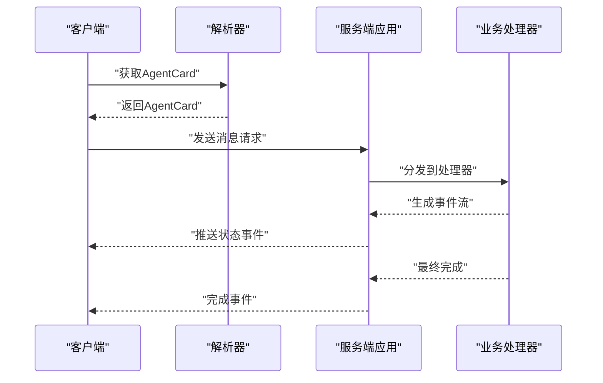
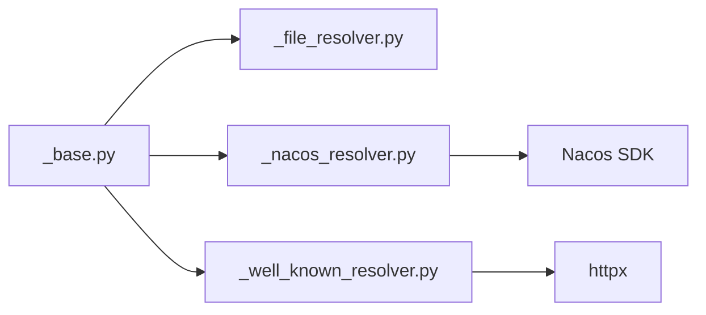

# A2A协议

<cite>
**本文引用的文件**
- [src/agentscope/a2a/__init__.py](file://src/agentscope/a2a/__init__.py)
- [src/agentscope/a2a/_base.py](file://src/agentscope/a2a/_base.py)
- [src/agentscope/a2a/_file_resolver.py](file://src/agentscope/a2a/_file_resolver.py)
- [src/agentscope/a2a/_nacos_resolver.py](file://src/agentscope/a2a/_nacos_resolver.py)
- [src/agentscope/a2a/_well_known_resolver.py](file://src/agentscope/a2a/_well_known_resolver.py)
- [examples/agent/a2a_agent/main.py](file://examples/agent/a2a_agent/main.py)
- [examples/agent/a2a_agent/setup_a2a_server.py](file://examples/agent/a2a_agent/setup_a2a_server.py)
- [examples/agent/a2a_agent/agent_card.py](file://examples/agent/a2a_agent/agent_card.py)
- [examples/agent/a2ui_agent/samples/client/a2a_client.py](file://examples/agent/a2ui_agent/samples/client/a2a_client.py)
- [examples/agent/a2ui_agent/samples/general_agent/__main__.py](file://examples/agent/a2ui_agent/samples/general_agent/__main__.py)
- [examples/agent/a2ui_agent/samples/general_agent/setup_a2ui_server.py](file://examples/agent/a2ui_agent/samples/general_agent/setup_a2ui_server.py)
</cite>

## 目录
1. [简介](#简介)
2. [项目结构](#项目结构)
3. [核心组件](#核心组件)
4. [架构总览](#架构总览)
5. [详细组件分析](#详细组件分析)
6. [依赖分析](#依赖分析)
7. [性能考虑](#性能考虑)
8. [故障排除指南](#故障排除指南)
9. [结论](#结论)
10. [附录](#附录)

## 简介
本技术文档围绕 AgentScope 的 A2A（Agent-to-Agent）协议体系，系统性阐述其基础架构、协议规范、消息格式、连接管理、解析器系统、服务发现机制、安全与访问控制、配置选项、集成示例、协议实现指南以及部署建议。A2A 协议通过统一的 AgentCard 描述远程代理的能力与接口，结合多种解析器完成发现与加载，并以标准化的消息模型与事件流实现跨代理通信。

## 项目结构
A2A 相关代码主要位于 src/agentscope/a2a 目录，包含解析器基类与三种解析器实现：文件解析器、Nacos 解析器、Well-Known 解析器；同时在 examples 中提供了 A2A Agent 的服务端与客户端示例，以及 A2UI 场景下的客户端与服务端示例。

图表来源
- [src/agentscope/a2a/_base.py:12-26](file://src/agentscope/a2a/_base.py#L12-L26)
- [src/agentscope/a2a/_file_resolver.py:15-79](file://src/agentscope/a2a/_file_resolver.py#L15-L79)
- [src/agentscope/a2a/_nacos_resolver.py:17-99](file://src/agentscope/a2a/_nacos_resolver.py#L17-L99)
- [src/agentscope/a2a/_well_known_resolver.py:15-91](file://src/agentscope/a2a/_well_known_resolver.py#L15-L91)
- [examples/agent/a2a_agent/agent_card.py:5-37](file://examples/agent/a2a_agent/agent_card.py#L5-L37)
- [examples/agent/a2a_agent/setup_a2a_server.py:125-131](file://examples/agent/a2a_agent/setup_a2a_server.py#L125-L131)
- [examples/agent/a2a_agent/main.py:10-27](file://examples/agent/a2a_agent/main.py#L10-L27)
- [examples/agent/a2ui_agent/samples/client/a2a_client.py:22-156](file://examples/agent/a2ui_agent/samples/client/a2a_client.py#L22-L156)
- [examples/agent/a2ui_agent/samples/general_agent/setup_a2ui_server.py:286-291](file://examples/agent/a2ui_agent/samples/general_agent/setup_a2ui_server.py#L286-L291)
- [examples/agent/a2ui_agent/samples/general_agent/__main__.py:29-35](file://examples/agent/a2ui_agent/samples/general_agent/__main__.py#L29-L35)

章节来源
- [src/agentscope/a2a/__init__.py:1-15](file://src/agentscope/a2a/__init__.py#L1-L15)
- [src/agentscope/a2a/_base.py:12-26](file://src/agentscope/a2a/_base.py#L12-L26)
- [src/agentscope/a2a/_file_resolver.py:15-79](file://src/agentscope/a2a/_file_resolver.py#L15-L79)
- [src/agentscope/a2a/_nacos_resolver.py:17-99](file://src/agentscope/a2a/_nacos_resolver.py#L17-L99)
- [src/agentscope/a2a/_well_known_resolver.py:15-91](file://src/agentscope/a2a/_well_known_resolver.py#L15-L91)
- [examples/agent/a2a_agent/agent_card.py:5-37](file://examples/agent/a2a_agent/agent_card.py#L5-L37)
- [examples/agent/a2a_agent/setup_a2a_server.py:125-131](file://examples/agent/a2a_agent/setup_a2a_server.py#L125-L131)
- [examples/agent/a2a_agent/main.py:10-27](file://examples/agent/a2a_agent/main.py#L10-L27)
- [examples/agent/a2ui_agent/samples/client/a2a_client.py:22-156](file://examples/agent/a2ui_agent/samples/client/a2a_client.py#L22-L156)
- [examples/agent/a2ui_agent/samples/general_agent/setup_a2ui_server.py:286-291](file://examples/agent/a2ui_agent/samples/general_agent/setup_a2ui_server.py#L286-L291)
- [examples/agent/a2ui_agent/samples/general_agent/__main__.py:29-35](file://examples/agent/a2ui_agent/samples/general_agent/__main__.py#L29-L35)

## 核心组件
- 解析器基类：定义统一的异步获取 AgentCard 接口，确保不同来源的解析器具备一致的行为契约。
- 文件解析器：从本地 JSON 文件加载 AgentCard，适用于静态配置或开发测试场景。
- Nacos 解析器：基于 Nacos 动态服务发现平台，支持订阅与拉取 AgentCard，适合生产环境的动态服务治理。
- Well-Known 解析器：遵循 Well-Known URL 规范，从标准路径解析 AgentCard，便于浏览器或前端直接发现。

章节来源
- [src/agentscope/a2a/_base.py:12-26](file://src/agentscope/a2a/_base.py#L12-L26)
- [src/agentscope/a2a/_file_resolver.py:15-79](file://src/agentscope/a2a/_file_resolver.py#L15-L79)
- [src/agentscope/a2a/_nacos_resolver.py:17-99](file://src/agentscope/a2a/_nacos_resolver.py#L17-L99)
- [src/agentscope/a2a/_well_known_resolver.py:15-91](file://src/agentscope/a2a/_well_known_resolver.py#L15-L91)

## 架构总览
A2A 协议的运行时架构由“解析器层”“客户端层”“服务端层”三部分组成。解析器负责根据配置从文件、Nacos 或 Well-Known URL 获取 AgentCard；客户端依据 AgentCard 建立连接并发送消息；服务端接收请求，执行业务逻辑并通过事件流返回状态与结果。

图表来源
- [src/agentscope/a2a/_file_resolver.py:58-79](file://src/agentscope/a2a/_file_resolver.py#L58-L79)
- [src/agentscope/a2a/_nacos_resolver.py:59-99](file://src/agentscope/a2a/_nacos_resolver.py#L59-L99)
- [src/agentscope/a2a/_well_known_resolver.py:35-91](file://src/agentscope/a2a/_well_known_resolver.py#L35-L91)
- [examples/agent/a2a_agent/setup_a2a_server.py:125-131](file://examples/agent/a2a_agent/setup_a2a_server.py#L125-L131)
- [examples/agent/a2ui_agent/samples/client/a2a_client.py:125-156](file://examples/agent/a2ui_agent/samples/client/a2a_client.py#L125-L156)

## 详细组件分析

### 解析器系统
- 解析器基类：定义抽象方法 get_agent_card，要求所有具体解析器实现异步获取 AgentCard 的能力。
- 文件解析器：校验文件存在性与类型，读取 JSON 并通过模型校验生成 AgentCard。
- Nacos 解析器：初始化 Nacos AI 服务，启动客户端后按名称与版本查询 AgentCard，并在完成后关闭客户端。
- Well-Known 解析器：解析基础 URL，拼接 Well-Known 路径，使用 A2ACardResolver 获取 AgentCard，内置错误日志与异常抛出。

图表来源
- [src/agentscope/a2a/_base.py:12-26](file://src/agentscope/a2a/_base.py#L12-L26)
- [src/agentscope/a2a/_file_resolver.py:15-79](file://src/agentscope/a2a/_file_resolver.py#L15-L79)
- [src/agentscope/a2a/_nacos_resolver.py:17-99](file://src/agentscope/a2a/_nacos_resolver.py#L17-L99)
- [src/agentscope/a2a/_well_known_resolver.py:15-91](file://src/agentscope/a2a/_well_known_resolver.py#L15-L91)

章节来源
- [src/agentscope/a2a/_base.py:12-26](file://src/agentscope/a2a/_base.py#L12-L26)
- [src/agentscope/a2a/_file_resolver.py:15-79](file://src/agentscope/a2a/_file_resolver.py#L15-L79)
- [src/agentscope/a2a/_nacos_resolver.py:17-99](file://src/agentscope/a2a/_nacos_resolver.py#L17-L99)
- [src/agentscope/a2a/_well_known_resolver.py:15-91](file://src/agentscope/a2a/_well_known_resolver.py#L15-L91)

### 服务发现与动态注册
- Nacos 解析器通过 Nacos AI 服务进行动态服务发现，支持指定 agent 名称与版本，自动订阅更新并在生命周期结束后释放资源。
- Well-Known 解析器遵循标准 Well-Known URL，便于浏览器或前端直接访问，简化跨域与发现流程。
- 文件解析器适用于静态配置，适合开发与测试阶段快速验证。

章节来源
- [src/agentscope/a2a/_nacos_resolver.py:17-99](file://src/agentscope/a2a/_nacos_resolver.py#L17-L99)
- [src/agentscope/a2a/_well_known_resolver.py:15-91](file://src/agentscope/a2a/_well_known_resolver.py#L15-L91)
- [src/agentscope/a2a/_file_resolver.py:15-79](file://src/agentscope/a2a/_file_resolver.py#L15-L79)

### 连接管理与消息流
- 客户端侧：A2A 客户端根据 AgentCard 建立连接，将消息格式化为 A2A Message 后发送，异步接收事件流并转换回可消费的消息对象。
- 服务端侧：A2A 星云应用封装请求处理，通过事件流推送任务状态更新，最终标记完成并保存会话状态。
- 流式输出：服务端在关键节点产生工作中的状态事件，仅在最终聚合时输出完整消息，保证流式语义的一致性。

图表来源
- [examples/agent/a2a_agent/setup_a2a_server.py:34-123](file://examples/agent/a2a_agent/setup_a2a_server.py#L34-L123)
- [examples/agent/a2a_agent/main.py:10-27](file://examples/agent/a2a_agent/main.py#L10-L27)
- [examples/agent/a2ui_agent/samples/client/a2a_client.py:125-156](file://examples/agent/a2ui_agent/samples/client/a2a_client.py#L125-L156)

章节来源
- [examples/agent/a2a_agent/setup_a2a_server.py:34-123](file://examples/agent/a2a_agent/setup_a2a_server.py#L34-L123)
- [examples/agent/a2a_agent/main.py:10-27](file://examples/agent/a2a_agent/main.py#L10-L27)
- [examples/agent/a2ui_agent/samples/client/a2a_client.py:125-156](file://examples/agent/a2ui_agent/samples/client/a2a_client.py#L125-L156)

### 配置选项与集成示例
- 文件解析器：通过文件路径加载 AgentCard，适合本地开发与测试。
- Nacos 解析器：需提供 Nacos 客户端配置与远程代理名称，可选指定版本。
- Well-Known 解析器：提供基础 URL 与可选的卡片路径，默认使用 Well-Known 标准路径。
- 客户端示例：展示如何使用 A2ACardResolver 与 A2AClient 获取 AgentCard 并发送消息。
- 服务端示例：演示如何构建 A2A 星云应用，处理消息发送请求并以事件流反馈状态。

章节来源
- [src/agentscope/a2a/_file_resolver.py:46-79](file://src/agentscope/a2a/_file_resolver.py#L46-L79)
- [src/agentscope/a2a/_nacos_resolver.py:25-58](file://src/agentscope/a2a/_nacos_resolver.py#L25-L58)
- [src/agentscope/a2a/_well_known_resolver.py:18-34](file://src/agentscope/a2a/_well_known_resolver.py#L18-L34)
- [examples/agent/a2ui_agent/samples/client/a2a_client.py:22-156](file://examples/agent/a2ui_agent/samples/client/a2a_client.py#L22-L156)
- [examples/agent/a2a_agent/setup_a2a_server.py:125-131](file://examples/agent/a2a_agent/setup_a2a_server.py#L125-L131)

## 依赖分析
- 组件内聚：解析器模块内部高内聚，均继承自同一基类，职责清晰。
- 外部依赖：Nacos 解析器依赖 Nacos SDK；Well-Known 解析器依赖 HTTP 客户端与 A2A 卡片解析器；文件解析器依赖本地文件系统。
- 循环依赖：当前解析器模块未见循环依赖迹象，各解析器独立实现。

图表来源
- [src/agentscope/a2a/_base.py:12-26](file://src/agentscope/a2a/_base.py#L12-L26)
- [src/agentscope/a2a/_file_resolver.py:15-79](file://src/agentscope/a2a/_file_resolver.py#L15-L79)
- [src/agentscope/a2a/_nacos_resolver.py:66-87](file://src/agentscope/a2a/_nacos_resolver.py#L66-L87)
- [src/agentscope/a2a/_well_known_resolver.py:42-79](file://src/agentscope/a2a/_well_known_resolver.py#L42-L79)

章节来源
- [src/agentscope/a2a/_nacos_resolver.py:66-87](file://src/agentscope/a2a/_nacos_resolver.py#L66-L87)
- [src/agentscope/a2a/_well_known_resolver.py:42-79](file://src/agentscope/a2a/_well_known_resolver.py#L42-L79)

## 性能考虑
- 异步 I/O：解析器与客户端均采用异步实现，有利于提升并发与吞吐。
- 资源管理：Nacos 解析器在 finally 分支中确保客户端关闭，避免资源泄漏。
- 超时控制：Well-Known 解析器使用较长超时时间，适配网络波动；客户端示例也提供了可配置的超时设置。
- 事件流优化：服务端仅在最终聚合时输出完整消息，减少中间碎片化事件，降低客户端处理负担。

章节来源
- [src/agentscope/a2a/_nacos_resolver.py:89-99](file://src/agentscope/a2a/_nacos_resolver.py#L89-L99)
- [src/agentscope/a2a/_well_known_resolver.py:69-71](file://src/agentscope/a2a/_well_known_resolver.py#L69-L71)
- [examples/agent/a2ui_agent/samples/client/a2a_client.py:32-42](file://examples/agent/a2ui_agent/samples/client/a2a_client.py#L32-L42)

## 故障排除指南
- Nacos 依赖缺失：若未安装 Nacos SDK，解析器会抛出导入异常提示安装命令。请按提示安装相应版本。
- 文件路径错误：文件解析器会在路径不存在或非文件时抛出异常，请检查文件路径与权限。
- URL 格式错误：Well-Known 解析器对无效 URL 进行日志记录并抛出异常，需确保基础 URL 合法。
- 客户端关闭失败：Nacos 解析器在 finally 分支中尝试关闭客户端，若失败会记录警告日志，不影响整体流程。
- 服务端运行问题：A2UI 示例通过 uvicorn 运行，如遇端口占用或权限问题，请调整端口或以管理员权限运行。

章节来源
- [src/agentscope/a2a/_nacos_resolver.py:69-73](file://src/agentscope/a2a/_nacos_resolver.py#L69-L73)
- [src/agentscope/a2a/_file_resolver.py:68-74](file://src/agentscope/a2a/_file_resolver.py#L68-L74)
- [src/agentscope/a2a/_well_known_resolver.py:48-56](file://src/agentscope/a2a/_well_known_resolver.py#L48-L56)
- [src/agentscope/a2a/_nacos_resolver.py:95-98](file://src/agentscope/a2a/_nacos_resolver.py#L95-L98)
- [examples/agent/a2ui_agent/samples/general_agent/__main__.py:29-35](file://examples/agent/a2ui_agent/samples/general_agent/__main__.py#L29-L35)

## 结论
A2A 协议通过统一的解析器体系与标准化的消息模型，实现了跨代理的高效通信。文件、Nacos 与 Well-Known 三种解析器覆盖了从开发测试到生产部署的多种场景；异步事件流与资源管理保障了系统的稳定性与可扩展性。结合示例工程，开发者可快速完成集成与部署。

## 附录
- 集成步骤建议
  - 选择解析器：开发阶段优先使用文件解析器；生产环境推荐 Nacos 或 Well-Known。
  - 定义 AgentCard：参考示例中的 AgentCard 定义，明确能力、默认输入输出模式与技能列表。
  - 构建客户端：使用 A2ACardResolver 获取 AgentCard，再初始化 A2AClient 发送消息。
  - 构建服务端：使用 A2AStarletteApplication 封装处理器，通过事件流反馈状态。
- 部署建议
  - 使用 Nacos 进行服务注册与发现，配合版本管理与灰度发布。
  - 在前端或浏览器中通过 Well-Known URL 直接发现 AgentCard，降低集成复杂度。
  - 为服务端启用健康检查与限流策略，确保高可用与稳定性。