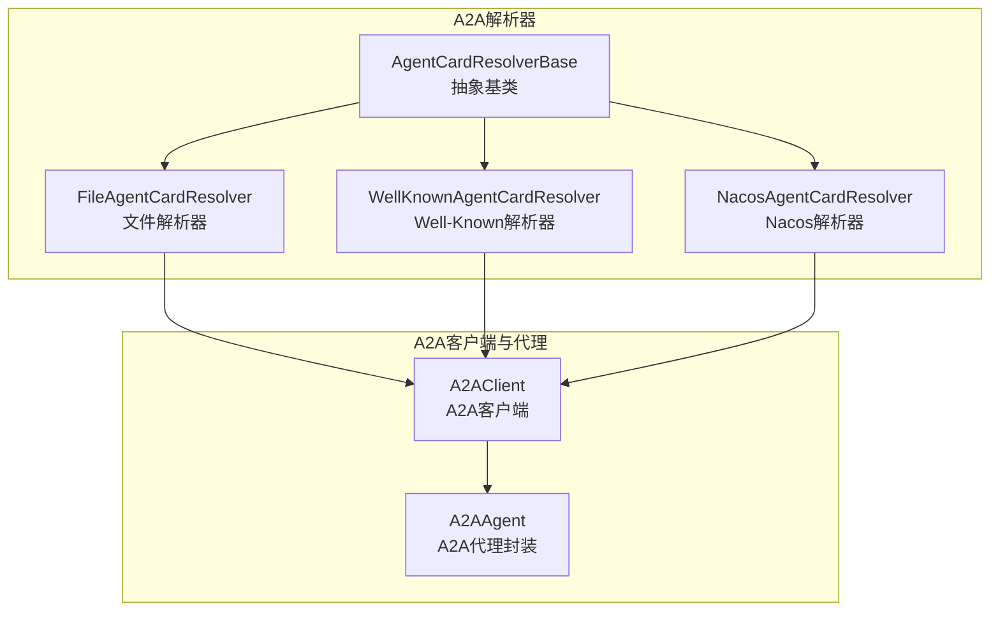
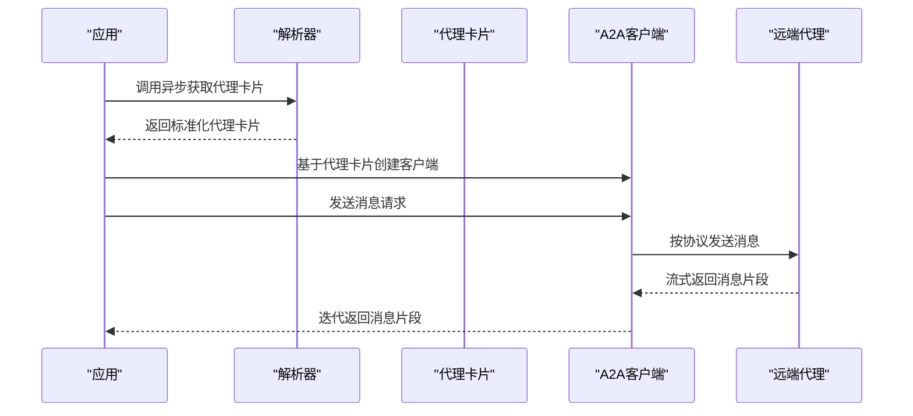
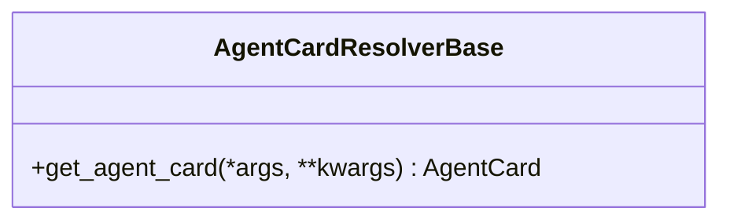
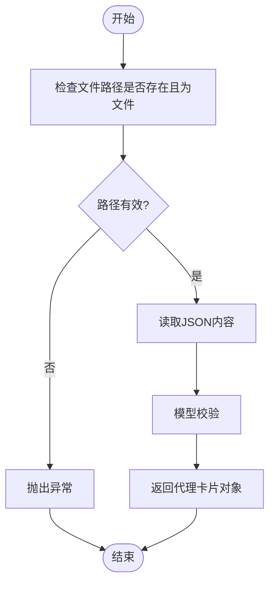
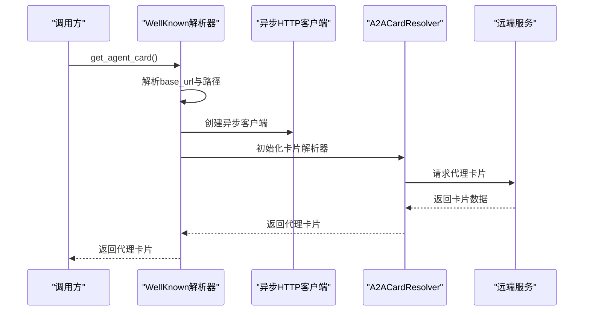
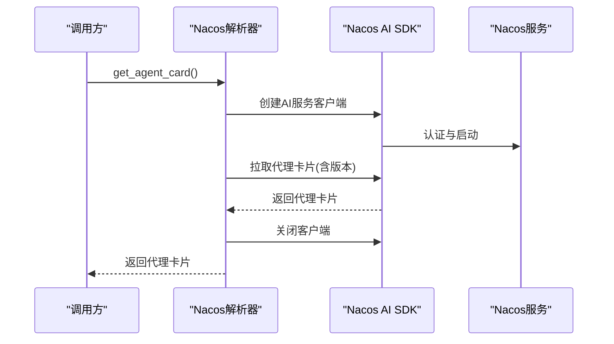
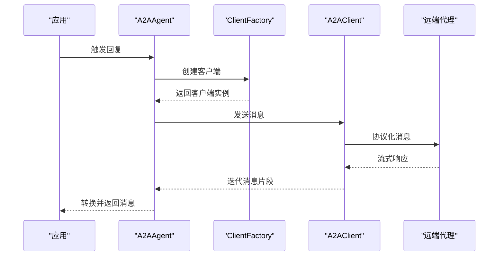
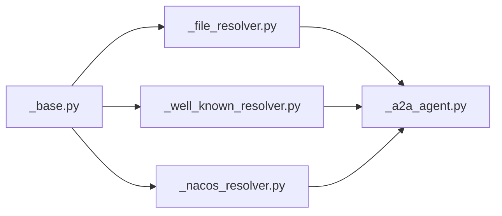

# A2A基础架构

<cite>
**本文引用的文件**
- [a2a/__init__.py](file://src/agentscope/a2a/__init__.py)
- [a2a/_base.py](file://src/agentscope/a2a/_base.py)
- [a2a/_file_resolver.py](file://src/agentscope/a2a/_file_resolver.py)
- [a2a/_well_known_resolver.py](file://src/agentscope/a2a/_well_known_resolver.py)
- [a2a/_nacos_resolver.py](file://src/agentscope/a2a/_nacos_resolver.py)
- [agent/_a2a_agent.py](file://src/agentscope/agent/_a2a_agent.py)
- [examples/agent/a2a_agent/agent_card.py](file://examples/agent/a2a_agent/agent_card.py)
- [examples/agent/a2a_agent/main.py](file://examples/agent/a2a_agent/main.py)
- [examples/agent/a2a_agent/setup_a2a_server.py](file://examples/agent/a2a_agent/setup_a2a_server.py)
- [examples/agent/a2ui_agent/samples/client/a2a_client.py](file://examples/agent/a2ui_agent/samples/client/a2a_client.py)
- [tests/a2a_resolver_test.py](file://tests/a2a_resolver_test.py)
- [tests/a2a_agent_test.py](file://tests/a2a_agent_test.py)
</cite>

## 目录
1. [简介](#简介)
2. [项目结构](#项目结构)
3. [核心组件](#核心组件)
4. [架构总览](#架构总览)
5. [详细组件分析](#详细组件分析)
6. [依赖分析](#依赖分析)
7. [性能考虑](#性能考虑)
8. [故障排查指南](#故障排查指南)
9. [结论](#结论)
10. [附录](#附录)

## 简介
本文件面向A2A（Agent-to-Agent）基础架构，系统性阐述代理卡片解析器的抽象与实现、A2A协议的通信模型与消息传递机制、代理卡片的标准化格式与校验规则，并提供扩展指南与集成模式。读者无需深入源码即可理解整体设计与使用方式。

## 项目结构
A2A基础架构主要由以下模块组成：
- 解析器层：抽象基类与多种具体解析器（文件、Well-Known URL、Nacos）
- 客户端与代理：A2A客户端、A2A代理封装
- 示例与测试：示例应用与解析器/代理功能测试

**图示来源**
- [a2a/__init__.py:1-15](file://src/agentscope/a2a/__init__.py#L1-L15)
- [a2a/_base.py:12-25](file://src/agentscope/a2a/_base.py#L12-L25)
- [a2a/_file_resolver.py:15-79](file://src/agentscope/a2a/_file_resolver.py#L15-L79)
- [a2a/_well_known_resolver.py:15-91](file://src/agentscope/a2a/_well_known_resolver.py#L15-L91)
- [a2a/_nacos_resolver.py:17-99](file://src/agentscope/a2a/_nacos_resolver.py#L17-L99)
- [agent/_a2a_agent.py:66-101](file://src/agentscope/agent/_a2a_agent.py#L66-L101)

**章节来源**
- [a2a/__init__.py:1-15](file://src/agentscope/a2a/__init__.py#L1-L15)

## 核心组件
- 抽象基类：定义统一的异步获取接口，约束实现类必须提供异步获取代理卡片的能力。
- 具体解析器：
  - 文件解析器：从JSON文件加载代理卡片并进行模型校验。
  - Well-Known解析器：通过Well-Known路径解析远程代理卡片。
  - Nacos解析器：从Nacos服务发现平台动态拉取代理卡片并支持订阅更新。
- A2A代理封装：基于代理卡片创建A2A客户端工厂，负责消息发送与事件处理。

**章节来源**
- [a2a/_base.py:12-25](file://src/agentscope/a2a/_base.py#L12-L25)
- [a2a/_file_resolver.py:15-79](file://src/agentscope/a2a/_file_resolver.py#L15-L79)
- [a2a/_well_known_resolver.py:15-91](file://src/agentscope/a2a/_well_known_resolver.py#L15-L91)
- [a2a/_nacos_resolver.py:17-99](file://src/agentscope/a2a/_nacos_resolver.py#L17-L99)
- [agent/_a2a_agent.py:66-101](file://src/agentscope/agent/_a2a_agent.py#L66-L101)

## 架构总览
A2A基础架构采用“解析器—客户端—代理”的分层设计：
- 解析器层：屏蔽不同来源的差异，统一输出标准化的代理卡片对象。
- 客户端层：根据代理卡片提供的能力与端点，构造A2A客户端并发起消息交互。
- 代理层：对上层提供统一的代理接口，内部完成消息格式转换与流式响应处理。

**图示来源**
- [a2a/_base.py:18-25](file://src/agentscope/a2a/_base.py#L18-L25)
- [a2a/_well_known_resolver.py:35-91](file://src/agentscope/a2a/_well_known_resolver.py#L35-L91)
- [a2a/_nacos_resolver.py:59-99](file://src/agentscope/a2a/_nacos_resolver.py#L59-L99)
- [agent/_a2a_agent.py:224-237](file://src/agentscope/agent/_a2a_agent.py#L224-L237)

## 详细组件分析

### 抽象基类：AgentCardResolverBase
- 设计理念：以抽象基类定义统一接口，确保所有解析器实现一致的异步获取行为，便于替换与扩展。
- 核心职责：
  - 统一的异步获取方法签名，返回标准化代理卡片对象。
  - 将具体来源（文件、URL、服务注册中心）的差异隐藏在子类中。
- 接口规范：
  - 方法名：get_agent_card
  - 返回值：代理卡片对象
  - 异步：使用async/await，避免阻塞

**图示来源**
- [a2a/_base.py:12-25](file://src/agentscope/a2a/_base.py#L12-L25)

**章节来源**
- [a2a/_base.py:12-25](file://src/agentscope/a2a/_base.py#L12-L25)

### 文件解析器：FileAgentCardResolver
- 功能概述：从本地JSON文件加载代理卡片，进行存在性与类型校验后返回代理卡片对象。
- 关键流程：
  - 校验文件路径存在且为文件
  - 读取JSON内容并调用模型校验
  - 返回代理卡片对象
- 错误处理：
  - 文件不存在或路径非文件时抛出异常
  - JSON解析失败时交由上层捕获

**图示来源**
- [a2a/_file_resolver.py:58-79](file://src/agentscope/a2a/_file_resolver.py#L58-L79)

**章节来源**
- [a2a/_file_resolver.py:15-79](file://src/agentscope/a2a/_file_resolver.py#L15-L79)

### Well-Known解析器：WellKnownAgentCardResolver
- 功能概述：从Well-Known URL解析代理卡片，支持默认路径与自定义路径组合。
- 关键流程：
  - 解析输入URL，提取协议与主机
  - 组装Well-Known路径与相对路径
  - 使用异步HTTP客户端发起请求并解析响应
- 连接管理：
  - 使用异步上下文管理器确保客户端正确释放
  - 设置超时参数，避免长时间阻塞

**图示来源**
- [a2a/_well_known_resolver.py:35-91](file://src/agentscope/a2a/_well_known_resolver.py#L35-L91)

**章节来源**
- [a2a/_well_known_resolver.py:15-91](file://src/agentscope/a2a/_well_known_resolver.py#L15-L91)

### Nacos解析器：NacosAgentCardResolver
- 功能概述：从Nacos服务发现平台拉取代理卡片，支持版本选择与客户端生命周期管理。
- 关键流程：
  - 校验必要参数（远程代理名称、客户端配置）
  - 创建并启动Nacos AI服务客户端
  - 拉取指定版本的代理卡片
  - 正确关闭客户端资源
- 错误处理：
  - SDK缺失时提示安装依赖
  - 客户端关闭异常时记录警告日志

**图示来源**
- [a2a/_nacos_resolver.py:59-99](file://src/agentscope/a2a/_nacos_resolver.py#L59-L99)

**章节来源**
- [a2a/_nacos_resolver.py:17-99](file://src/agentscope/a2a/_nacos_resolver.py#L17-L99)

### A2A代理封装：A2AAgent
- 功能概述：基于代理卡片创建A2A客户端工厂，负责消息发送与事件处理。
- 关键流程：
  - 校验传入代理卡片类型
  - 初始化客户端工厂（可注入消费者与传输生产者）
  - 在回复流程中创建客户端并发送消息
  - 处理流式响应并转换为上层消息格式

**图示来源**
- [agent/_a2a_agent.py:66-101](file://src/agentscope/agent/_a2a_agent.py#L66-L101)
- [agent/_a2a_agent.py:224-237](file://src/agentscope/agent/_a2a_agent.py#L224-L237)

**章节来源**
- [agent/_a2a_agent.py:66-101](file://src/agentscope/agent/_a2a_agent.py#L66-L101)
- [agent/_a2a_agent.py:201-237](file://src/agentscope/agent/_a2a_agent.py#L201-L237)

## 依赖分析
- 模块内聚与耦合：
  - 解析器均继承自抽象基类，降低上层对具体实现的耦合。
  - A2A代理依赖代理卡片与客户端工厂，形成清晰的依赖边界。
- 外部依赖：
  - Well-Known解析器依赖异步HTTP客户端与A2A卡片解析器。
  - Nacos解析器依赖Nacos AI SDK，需按需安装。
- 可能的循环依赖：
  - 当前结构未见循环导入；若未来扩展，应避免解析器与客户端之间的双向依赖。

**图示来源**
- [a2a/_base.py:12-25](file://src/agentscope/a2a/_base.py#L12-L25)
- [a2a/_file_resolver.py:15-79](file://src/agentscope/a2a/_file_resolver.py#L15-L79)
- [a2a/_well_known_resolver.py:15-91](file://src/agentscope/a2a/_well_known_resolver.py#L15-L91)
- [a2a/_nacos_resolver.py:17-99](file://src/agentscope/a2a/_nacos_resolver.py#L17-L99)
- [agent/_a2a_agent.py:66-101](file://src/agentscope/agent/_a2a_agent.py#L66-L101)

**章节来源**
- [a2a/_base.py:12-25](file://src/agentscope/a2a/_base.py#L12-L25)
- [a2a/_file_resolver.py:15-79](file://src/agentscope/a2a/_file_resolver.py#L15-L79)
- [a2a/_well_known_resolver.py:15-91](file://src/agentscope/a2a/_well_known_resolver.py#L15-L91)
- [a2a/_nacos_resolver.py:17-99](file://src/agentscope/a2a/_nacos_resolver.py#L17-L99)
- [agent/_a2a_agent.py:66-101](file://src/agentscope/agent/_a2a_agent.py#L66-L101)

## 性能考虑
- 异步I/O：解析器普遍采用异步方式，减少阻塞，提升并发能力。
- 资源管理：Nacos解析器与Well-Known解析器均显式管理客户端生命周期，避免资源泄漏。
- 超时控制：解析器与代理侧均设置超时参数，防止长时间等待导致的资源占用。
- 缓存与重试：建议在上层引入缓存与指数退避重试策略，以应对网络抖动与服务不可用场景。

## 故障排查指南
- 文件解析器常见问题：
  - 文件不存在或路径错误：检查文件路径是否正确，确认文件存在且为普通文件。
  - JSON格式错误：检查JSON结构与字段类型是否符合代理卡片模型。
- Well-Known解析器常见问题：
  - URL格式不合法：确保提供有效的协议与主机地址。
  - 网络超时：适当增大超时时间或检查网络连通性。
- Nacos解析器常见问题：
  - SDK未安装：根据提示安装Nacos SDK依赖。
  - 客户端关闭异常：关注日志中的警告信息，确认资源释放流程。
- 代理侧问题：
  - 代理卡片类型不匹配：确保传入的是标准代理卡片对象。
  - 消息发送异常：检查客户端配置与远端代理状态。

**章节来源**
- [a2a/_file_resolver.py:67-78](file://src/agentscope/a2a/_file_resolver.py#L67-L78)
- [a2a/_well_known_resolver.py:46-56](file://src/agentscope/a2a/_well_known_resolver.py#L46-L56)
- [a2a/_nacos_resolver.py:69-73](file://src/agentscope/a2a/_nacos_resolver.py#L69-L73)
- [agent/_a2a_agent.py:79-83](file://src/agentscope/agent/_a2a_agent.py#L79-L83)

## 结论
A2A基础架构通过抽象解析器与标准化代理卡片，实现了多来源、低耦合、高扩展的代理发现与通信能力。结合异步I/O与完善的资源管理策略，能够在复杂网络环境中稳定运行。建议在实际工程中遵循本文的扩展指南与最佳实践，持续完善解析器与客户端的健壮性与性能表现。

## 附录

### 代理卡片标准化格式与校验规则
- 必需字段（文件解析器示例中明确要求）：
  - name：字符串，代理名称
  - url：字符串，代理访问地址
  - version：字符串，代理版本
  - capabilities：字典，代理能力描述
  - default_input_modes：字符串列表，默认输入模式
  - default_output_modes：字符串列表，默认输出模式
  - skills：列表，代理技能清单
- 可选字段：如description等，依据具体实现而定
- 数据验证规则：
  - 字段类型严格校验（如字符串、列表、字典）
  - 路径与URL合法性校验（文件存在性、URL格式）
  - SDK可用性与客户端生命周期管理

**章节来源**
- [a2a/_file_resolver.py:18-44](file://src/agentscope/a2a/_file_resolver.py#L18-L44)
- [a2a/_file_resolver.py:67-78](file://src/agentscope/a2a/_file_resolver.py#L67-L78)

### 扩展指南：自定义解析器实现
- 实现步骤：
  - 继承抽象基类，实现异步获取方法
  - 明确输入参数与返回值类型
  - 处理异常与资源清理
- 接口规范：
  - 方法签名保持一致，返回标准化代理卡片对象
  - 遵循异步编程约定，避免阻塞
- 最佳实践：
  - 明确错误语义，提供清晰的异常信息
  - 合理设置超时与重试策略
  - 在finally或上下文管理器中释放资源

**章节来源**
- [a2a/_base.py:18-25](file://src/agentscope/a2a/_base.py#L18-L25)
- [a2a/_file_resolver.py:58-79](file://src/agentscope/a2a/_file_resolver.py#L58-L79)
- [a2a/_well_known_resolver.py:68-71](file://src/agentscope/a2a/_well_known_resolver.py#L68-L71)
- [a2a/_nacos_resolver.py:89-98](file://src/agentscope/a2a/_nacos_resolver.py#L89-L98)

### 集成模式示例
- 文件解析器集成：
  - 通过文件路径初始化解析器，异步获取代理卡片
  - 将卡片用于创建A2A客户端并发送消息
- Well-Known解析器集成：
  - 提供Well-Known URL，自动拼接路径并获取卡片
  - 支持自定义路径与默认路径的灵活切换
- Nacos解析器集成：
  - 提供Nacos客户端配置与代理名称
  - 指定版本号以获取特定版本的代理卡片
- A2A代理集成：
  - 将代理卡片注入A2A代理封装，触发回复流程
  - 处理流式响应并转换为上层消息格式

**章节来源**
- [examples/agent/a2a_agent/agent_card.py:1-20](file://examples/agent/a2a_agent/agent_card.py#L1-L20)
- [examples/agent/a2a_agent/main.py:1-50](file://examples/agent/a2a_agent/main.py#L1-L50)
- [examples/agent/a2a_agent/setup_a2a_server.py:1-50](file://examples/agent/a2a_agent/setup_a2a_server.py#L1-L50)
- [examples/agent/a2ui_agent/samples/client/a2a_client.py:22-90](file://examples/agent/a2ui_agent/samples/client/a2a_client.py#L22-L90)
- [tests/a2a_resolver_test.py:1-100](file://tests/a2a_resolver_test.py#L1-L100)
- [tests/a2a_agent_test.py:1-100](file://tests/a2a_agent_test.py#L1-L100)