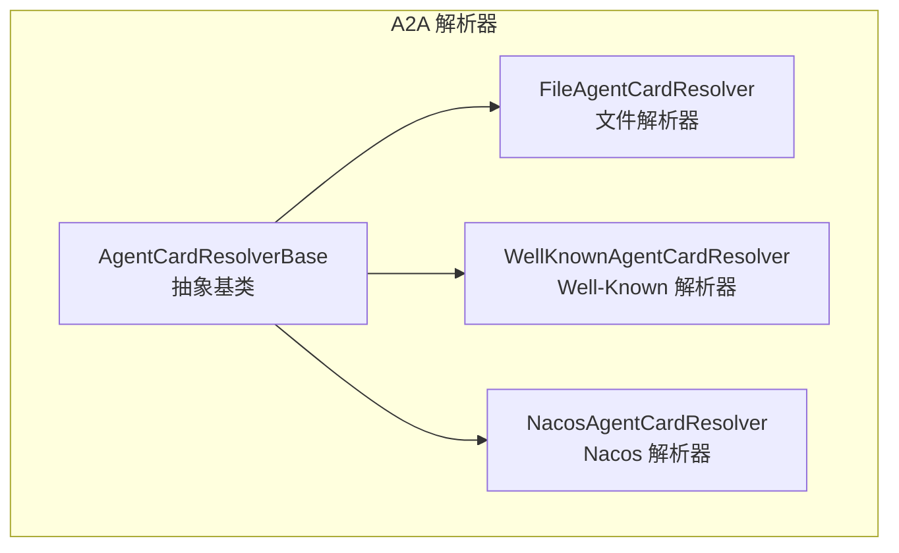
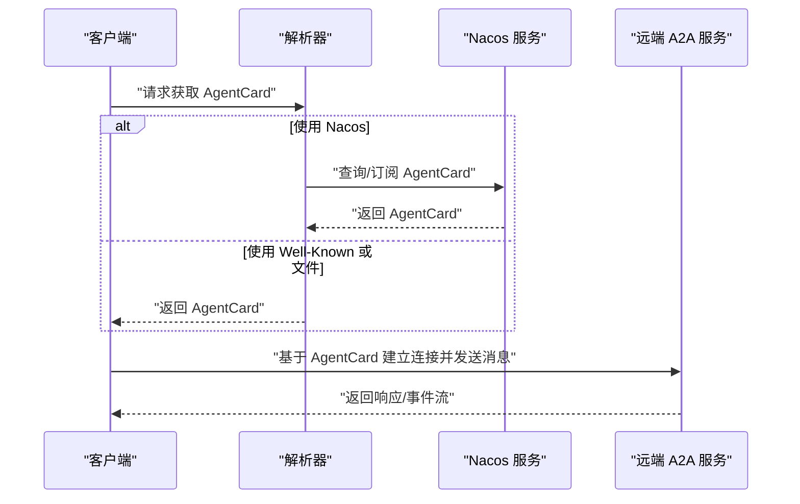
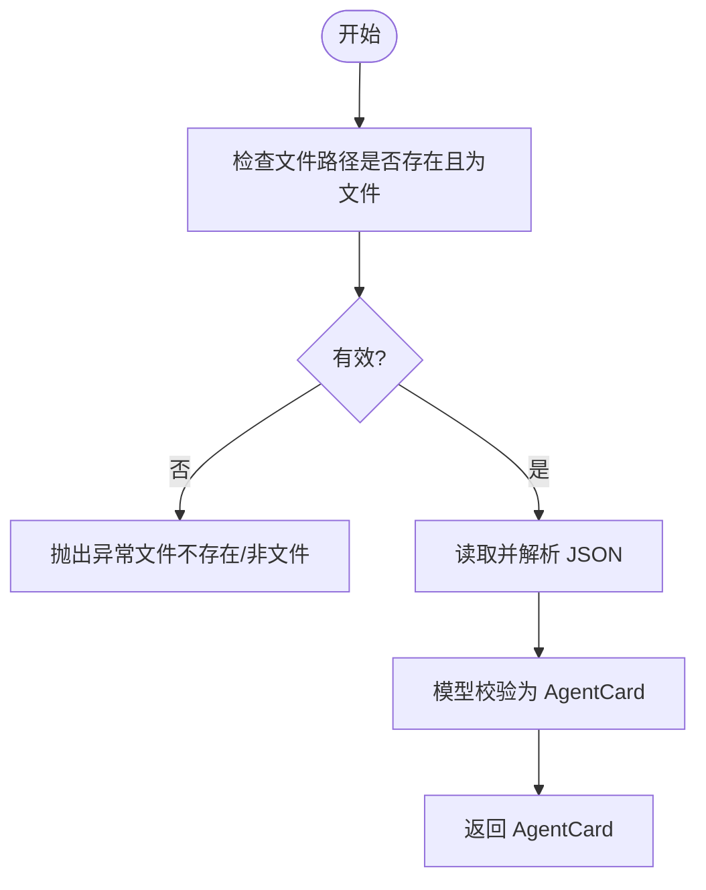
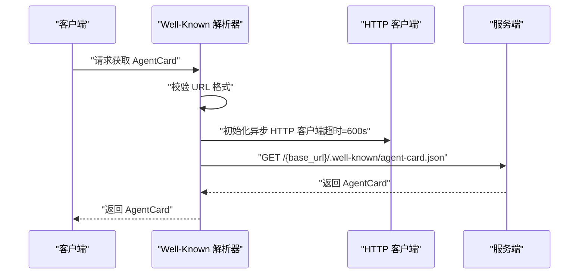
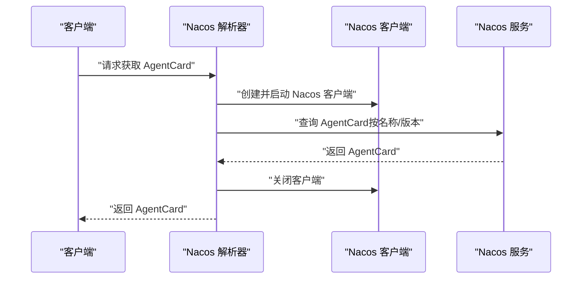
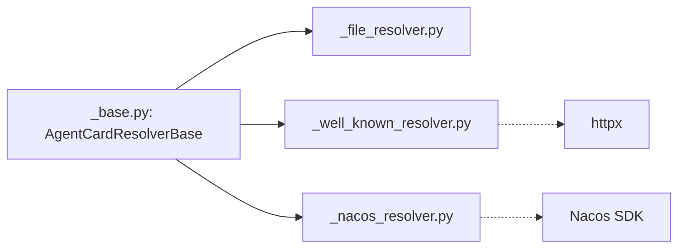

# 服务发现机制

<cite>
**本文引用的文件**
- [src/agentscope/a2a/__init__.py](file://src/agentscope/a2a/__init__.py)
- [src/agentscope/a2a/_base.py](file://src/agentscope/a2a/_base.py)
- [src/agentscope/a2a/_file_resolver.py](file://src/agentscope/a2a/_file_resolver.py)
- [src/agentscope/a2a/_well_known_resolver.py](file://src/agentscope/a2a/_well_known_resolver.py)
- [src/agentscope/a2a/_nacos_resolver.py](file://src/agentscope/a2a/_nacos_resolver.py)
- [examples/agent/a2a_agent/setup_a2a_server.py](file://examples/agent/a2a_agent/setup_a2a_server.py)
- [examples/agent/a2a_agent/main.py](file://examples/agent/a2a_agent/main.py)
- [examples/agent/a2ui_agent/samples/client/a2a_client.py](file://examples/agent/a2ui_agent/samples/client/a2a_client.py)
</cite>

## 目录
1. [简介](#简介)
2. [项目结构](#项目结构)
3. [核心组件](#核心组件)
4. [架构总览](#架构总览)
5. [详细组件分析](#详细组件分析)
6. [依赖分析](#依赖分析)
7. [性能考虑](#性能考虑)
8. [故障排查指南](#故障排查指南)
9. [结论](#结论)
10. [附录](#附录)

## 简介
本文件围绕 AgentScope 中的 A2A（Agent-to-Agent）服务发现机制展开，系统性说明动态服务注册与发现的实现原理，涵盖服务元数据管理、健康检查机制、负载均衡策略；梳理服务实例生命周期（注册、心跳、下线）；阐述缓存策略与更新机制（本地缓存、增量更新、失效处理）；给出配置项（超时、重试、并发）；并提供监控指标、性能调优与故障诊断方法，以及部署与运维建议。

## 项目结构
A2A 服务发现相关代码位于 src/agentscope/a2a 目录，包含抽象基类与多种解析器实现：
- 抽象基类：统一“获取 AgentCard”的接口契约
- 文件解析器：从本地 JSON 文件加载 AgentCard
- Well-Known 解析器：通过标准 well-known URL 获取 AgentCard
- Nacos 解析器：对接 Nacos 动态服务发现平台，订阅 AgentCard 变更

图表来源
- [src/agentscope/a2a/_base.py:12-25](file://src/agentscope/a2a/_base.py#L12-L25)
- [src/agentscope/a2a/_file_resolver.py:15-79](file://src/agentscope/a2a/_file_resolver.py#L15-L79)
- [src/agentscope/a2a/_well_known_resolver.py:15-91](file://src/agentscope/a2a/_well_known_resolver.py#L15-L91)
- [src/agentscope/a2a/_nacos_resolver.py:17-99](file://src/agentscope/a2a/_nacos_resolver.py#L17-L99)

章节来源
- [src/agentscope/a2a/__init__.py:1-15](file://src/agentscope/a2a/__init__.py#L1-L15)
- [src/agentscope/a2a/_base.py:12-25](file://src/agentscope/a2a/_base.py#L12-L25)

## 核心组件
- AgentCardResolverBase：定义异步获取 AgentCard 的抽象接口，作为所有解析器的统一契约
- FileAgentCardResolver：从本地 JSON 文件读取 AgentCard，适合开发与测试场景
- WellKnownAgentCardResolver：通过 well-known URL（如 /.well-known/agent-card.json）拉取 AgentCard，便于标准化发现
- NacosAgentCardResolver：对接 Nacos 平台，支持动态订阅与更新，适用于生产环境的服务编排

章节来源
- [src/agentscope/a2a/_base.py:12-25](file://src/agentscope/a2a/_base.py#L12-L25)
- [src/agentscope/a2a/_file_resolver.py:15-79](file://src/agentscope/a2a/_file_resolver.py#L15-L79)
- [src/agentscope/a2a/_well_known_resolver.py:15-91](file://src/agentscope/a2a/_well_known_resolver.py#L15-L91)
- [src/agentscope/a2a/_nacos_resolver.py:17-99](file://src/agentscope/a2a/_nacos_resolver.py#L17-L99)

## 架构总览
A2A 服务发现的整体流程如下：
- 客户端通过解析器获取 AgentCard
- AgentCard 描述远程 Agent 的能力、URL、版本等元信息
- 客户端基于 AgentCard 与远端服务建立连接并发起消息交互
- 在生产环境中，Nacos 解析器可订阅变更，实现动态更新

图表来源
- [src/agentscope/a2a/_well_known_resolver.py:35-91](file://src/agentscope/a2a/_well_known_resolver.py#L35-L91)
- [src/agentscope/a2a/_nacos_resolver.py:59-99](file://src/agentscope/a2a/_nacos_resolver.py#L59-L99)

## 详细组件分析

### 抽象基类：AgentCardResolverBase
- 角色：定义统一的异步接口，确保不同解析器的一致行为
- 关键点：仅声明 get_agent_card 方法，具体实现由子类完成

图表来源
- [src/agentscope/a2a/_base.py:12-25](file://src/agentscope/a2a/_base.py#L12-L25)

章节来源
- [src/agentscope/a2a/_base.py:12-25](file://src/agentscope/a2a/_base.py#L12-L25)

### 文件解析器：FileAgentCardResolver
- 输入：本地 JSON 文件路径
- 行为：校验文件存在性与类型，解析 JSON 并验证为 AgentCard
- 适用场景：本地开发、离线测试、静态配置分发
- 注意事项：需保证 JSON 字段完整且符合 AgentCard 模型

图表来源
- [src/agentscope/a2a/_file_resolver.py:58-79](file://src/agentscope/a2a/_file_resolver.py#L58-L79)

章节来源
- [src/agentscope/a2a/_file_resolver.py:15-79](file://src/agentscope/a2a/_file_resolver.py#L15-L79)

### Well-Known 解析器：WellKnownAgentCardResolver
- 输入：基础 URL（含 scheme 与 netloc），可选相对路径
- 行为：解析 URL，构造 well-known 路径，使用异步 HTTP 客户端拉取 AgentCard
- 超时：默认 600 秒
- 适用场景：标准化服务发现，便于浏览器或 CLI 工具访问

图表来源
- [src/agentscope/a2a/_well_known_resolver.py:35-91](file://src/agentscope/a2a/_well_known_resolver.py#L35-L91)

章节来源
- [src/agentscope/a2a/_well_known_resolver.py:15-91](file://src/agentscope/a2a/_well_known_resolver.py#L15-L91)

### Nacos 解析器：NacosAgentCardResolver
- 输入：远端 Agent 名称、Nacos 客户端配置、可选版本号
- 行为：懒加载创建 Nacos AI 服务客户端，启动后查询 AgentCard；最后关闭客户端释放资源
- 适用场景：生产级动态服务发现与订阅
- 注意事项：需要安装 Nacos SDK；异常时记录警告并继续清理

图表来源
- [src/agentscope/a2a/_nacos_resolver.py:59-99](file://src/agentscope/a2a/_nacos_resolver.py#L59-L99)

章节来源
- [src/agentscope/a2a/_nacos_resolver.py:17-99](file://src/agentscope/a2a/_nacos_resolver.py#L17-L99)

### 服务实例生命周期管理
- 注册流程：通过解析器获取 AgentCard，完成元数据初始化
- 心跳检测：当前解析器未内置心跳逻辑，通常由上层应用或服务端在会话中维护
- 下线处理：当 AgentCard 不可用或服务端下线时，解析器返回失败，上层应进行降级或重试

章节来源
- [src/agentscope/a2a/_well_known_resolver.py:35-91](file://src/agentscope/a2a/_well_known_resolver.py#L35-L91)
- [src/agentscope/a2a/_nacos_resolver.py:59-99](file://src/agentscope/a2a/_nacos_resolver.py#L59-L99)

### 缓存策略与更新机制
- 本地缓存：解析器本身不内置缓存，可在上层应用中对 AgentCard 进行缓存
- 增量更新：Nacos 解析器支持订阅更新，适合在生产环境实现近实时更新
- 失效处理：解析器在 finally 分支中确保客户端关闭，避免资源泄漏；上层可结合重试与熔断策略

章节来源
- [src/agentscope/a2a/_nacos_resolver.py:89-99](file://src/agentscope/a2a/_nacos_resolver.py#L89-L99)

### 配置选项
- 超时设置
  - Well-Known 解析器：默认 600 秒
  - A2A 客户端示例：默认 300 秒
- 重试策略：解析器未内置重试，建议在上层封装指数退避重试
- 并发控制：解析器为单次请求；若需并发，建议在业务侧使用限流与队列

章节来源
- [src/agentscope/a2a/_well_known_resolver.py:69-71](file://src/agentscope/a2a/_well_known_resolver.py#L69-L71)
- [examples/agent/a2ui_agent/samples/client/a2a_client.py:32-34](file://examples/agent/a2ui_agent/samples/client/a2a_client.py#L32-L34)

## 依赖分析
- 组件内聚与耦合
  - 解析器均继承自抽象基类，保持高内聚低耦合
  - Nacos 解析器依赖外部 SDK，需注意版本兼容性
- 外部依赖
  - Nacos SDK：用于动态服务发现与订阅
  - httpx：用于异步 HTTP 访问
- 潜在循环依赖
  - 当前解析器之间无直接相互依赖，避免循环导入

图表来源
- [src/agentscope/a2a/_base.py:12-25](file://src/agentscope/a2a/_base.py#L12-L25)
- [src/agentscope/a2a/_file_resolver.py:15-79](file://src/agentscope/a2a/_file_resolver.py#L15-L79)
- [src/agentscope/a2a/_well_known_resolver.py:15-91](file://src/agentscope/a2a/_well_known_resolver.py#L15-L91)
- [src/agentscope/a2a/_nacos_resolver.py:17-99](file://src/agentscope/a2a/_nacos_resolver.py#L17-L99)

## 性能考虑
- I/O 密集：解析器主要依赖网络请求，建议使用异步客户端并合理设置超时
- 资源释放：Nacos 解析器在 finally 中关闭客户端，避免连接泄露
- 缓存与批处理：在上层对频繁访问的 AgentCard 进行缓存；批量请求时复用 HTTP 客户端
- 并发与限流：对 Nacos 订阅与 HTTP 请求实施并发限制，防止资源争用

## 故障排查指南
- URL 格式错误
  - 现象：Well-Known 解析器报错并记录日志
  - 排查：确认 base_url 含 scheme 与 netloc
- Nacos SDK 未安装
  - 现象：导入异常并提示安装 SDK
  - 排查：安装指定版本的 Nacos SDK
- 客户端关闭异常
  - 现象：关闭阶段记录警告
  - 排查：检查 Nacos 服务状态与网络连通性
- 代理与网络问题
  - 现象：HTTP 请求超时或失败
  - 排查：调整超时时间、配置代理、检查防火墙

章节来源
- [src/agentscope/a2a/_well_known_resolver.py:48-56](file://src/agentscope/a2a/_well_known_resolver.py#L48-L56)
- [src/agentscope/a2a/_nacos_resolver.py:69-73](file://src/agentscope/a2a/_nacos_resolver.py#L69-L73)
- [src/agentscope/a2a/_nacos_resolver.py:92-98](file://src/agentscope/a2a/_nacos_resolver.py#L92-L98)

## 结论
A2A 服务发现以解析器为核心，提供文件、Well-Known 与 Nacos 三种发现方式。解析器遵循统一抽象接口，具备良好的扩展性。生产环境推荐使用 Nacos 解析器配合订阅机制实现动态更新；同时应在上层实现缓存、重试与限流策略，以提升稳定性与性能。

## 附录

### 部署指南与运维建议
- 开发与测试
  - 使用文件解析器加载本地 AgentCard，便于快速迭代
- 标准化发现
  - 部署服务端提供 well-known 路径，便于客户端自动发现
- 生产环境
  - 使用 Nacos 解析器，开启订阅与增量更新
  - 配置合理的超时与重试策略，结合熔断与隔离
  - 监控解析成功率、延迟与资源占用，定期评估缓存命中率

### 示例参考
- 服务端示例：展示如何构建 A2A 服务端并输出事件流
- 客户端示例：演示如何通过 well-known URL 获取 AgentCard 并发起消息

章节来源
- [examples/agent/a2a_agent/setup_a2a_server.py:125-131](file://examples/agent/a2a_agent/setup_a2a_server.py#L125-L131)
- [examples/agent/a2a_agent/main.py:10-27](file://examples/agent/a2a_agent/main.py#L10-L27)
- [examples/agent/a2ui_agent/samples/client/a2a_client.py:22-48](file://examples/agent/a2ui_agent/samples/client/a2a_client.py#L22-L48)