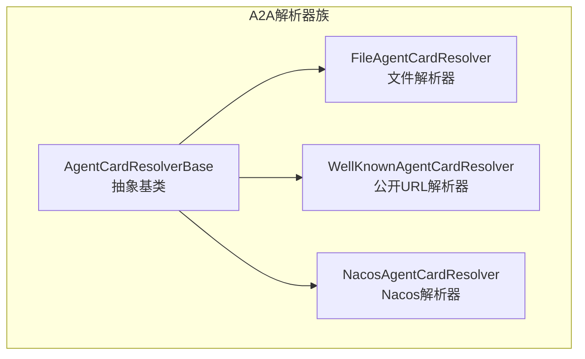
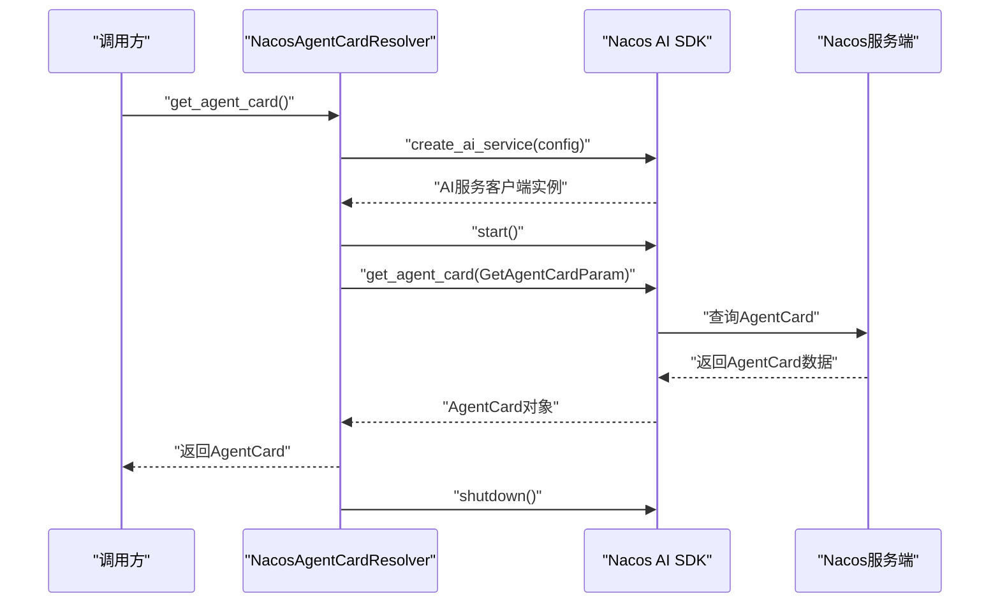
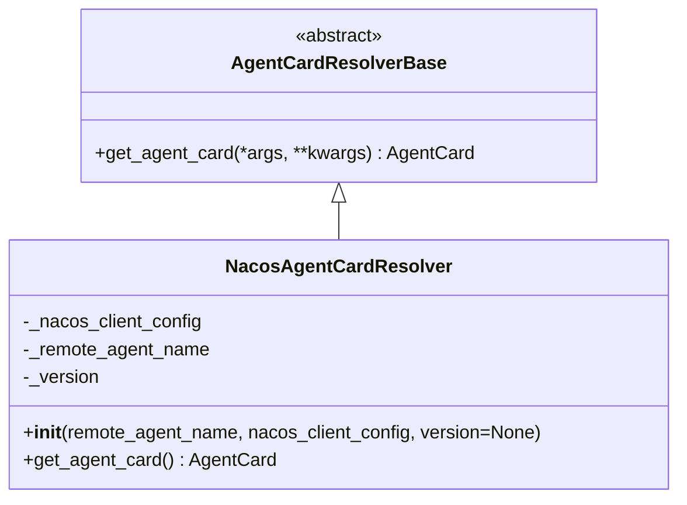
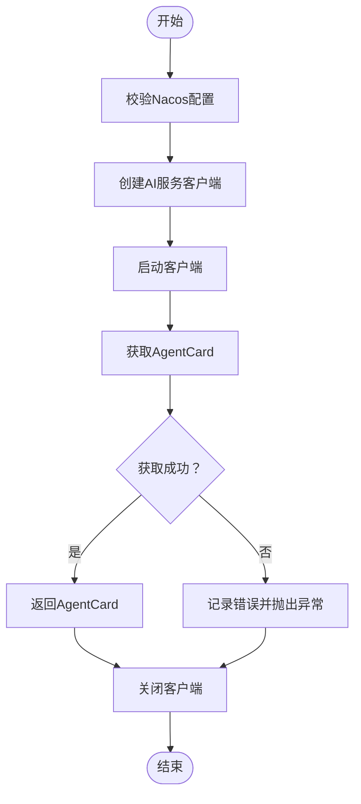
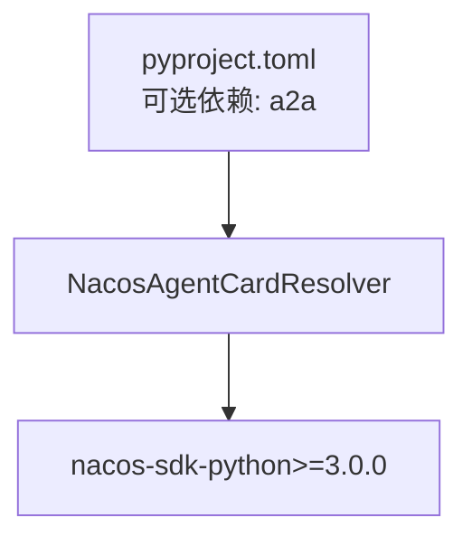

# Nacos解析器

<cite>
**本文引用的文件**
- [Nacos解析器实现](file://src/agentscope/a2a/_nacos_resolver.py)
- [解析器基类](file://src/agentscope/a2a/_base.py)
- [公开URL解析器](file://src/agentscope/a2a/_well_known_resolver.py)
- [文件解析器](file://src/agentscope/a2a/_file_resolver.py)
- [A2A模块导出](file://src/agentscope/a2a/__init__.py)
- [A2A教程示例（中文）](file://docs/tutorial/zh_CN/src/task_a2a.py)
- [A2A教程示例（英文）](file://docs/tutorial/en/src/task_a2a.py)
- [项目依赖配置](file://pyproject.toml)
- [A2A解析器单元测试](file://tests/a2a_resolver_test.py)
</cite>

## 目录
1. [简介](#简介)
2. [项目结构](#项目结构)
3. [核心组件](#核心组件)
4. [架构概览](#架构概览)
5. [详细组件分析](#详细组件分析)
6. [依赖关系分析](#依赖关系分析)
7. [性能考虑](#性能考虑)
8. [故障排查指南](#故障排查指南)
9. [结论](#结论)
10. [附录](#附录)

## 简介
本文档面向Nacos解析器的使用者与维护者，系统性介绍NacosAgentCardResolver类的实现原理与使用方法。重点涵盖：
- Nacos服务发现与配置中心集成方式
- AgentCard的获取流程与动态更新策略
- Nacos连接配置参数（服务器地址、命名空间、组名、数据ID等）
- 服务发现工作流程（注册、订阅、更新、注销）
- 故障处理、重连机制、性能优化与监控策略
- 在Nacos中存储与管理AgentCard的实践示例

## 项目结构
围绕A2A协议的AgentCard解析器，项目采用按功能分层的组织方式：
- a2a包提供解析器族：文件解析器、公开URL解析器、Nacos解析器
- 所有解析器均继承自统一的抽象基类，保证一致的异步接口
- 文档教程提供使用示例与最佳实践

**图表来源**
- [解析器基类:12-26](file://src/agentscope/a2a/_base.py#L12-L26)
- [文件解析器:15-79](file://src/agentscope/a2a/_file_resolver.py#L15-L79)
- [公开URL解析器:15-91](file://src/agentscope/a2a/_well_known_resolver.py#L15-L91)
- [Nacos解析器实现:17-99](file://src/agentscope/a2a/_nacos_resolver.py#L17-L99)

**章节来源**
- [A2A模块导出:3-14](file://src/agentscope/a2a/__init__.py#L3-L14)
- [解析器基类:12-26](file://src/agentscope/a2a/_base.py#L12-L26)

## 核心组件
- NacosAgentCardResolver：基于Nacos的AgentCard解析器，负责从Nacos服务端获取AgentCard并支持动态更新
- AgentCardResolverBase：所有解析器的抽象基类，定义统一的异步获取接口
- FileAgentCardResolver：从本地JSON文件加载AgentCard
- WellKnownAgentCardResolver：从公开URL路径获取AgentCard

关键特性：
- 异步非阻塞：所有解析器均提供异步get_agent_card接口
- 资源管理：Nacos解析器在使用后自动关闭客户端连接
- 参数校验：对必要参数进行运行时校验，避免无效配置

**章节来源**
- [Nacos解析器实现:17-99](file://src/agentscope/a2a/_nacos_resolver.py#L17-L99)
- [解析器基类:12-26](file://src/agentscope/a2a/_base.py#L12-L26)
- [文件解析器:15-79](file://src/agentscope/a2a/_file_resolver.py#L15-L79)
- [公开URL解析器:15-91](file://src/agentscope/a2a/_well_known_resolver.py#L15-L91)

## 架构概览
Nacos解析器通过Nacos AI SDK与Nacos服务端交互，遵循以下流程：
- 初始化：接收Nacos客户端配置与目标Agent名称
- 客户端创建：使用SDK创建AI服务客户端并启动
- 数据获取：构造查询参数并调用SDK接口获取AgentCard
- 资源释放：无论成功与否，最终关闭客户端连接

**图表来源**
- [Nacos解析器实现:59-99](file://src/agentscope/a2a/_nacos_resolver.py#L59-L99)

**章节来源**
- [Nacos解析器实现:59-99](file://src/agentscope/a2a/_nacos_resolver.py#L59-L99)

## 详细组件分析

### NacosAgentCardResolver类分析
职责与行为：
- 接收Nacos客户端配置与目标Agent名称
- 动态初始化Nacos AI SDK客户端
- 获取指定版本的AgentCard
- 统一资源管理与异常处理

实现要点：
- 参数校验：确保remote_agent_name与nacos_client_config有效
- 懒加载：首次使用时才创建SDK客户端
- 资源回收：finally块中确保客户端关闭
- 错误处理：捕获导入异常并提示安装SDK

**图表来源**
- [解析器基类:12-26](file://src/agentscope/a2a/_base.py#L12-L26)
- [Nacos解析器实现:17-58](file://src/agentscope/a2a/_nacos_resolver.py#L17-L58)

**章节来源**
- [Nacos解析器实现:17-99](file://src/agentscope/a2a/_nacos_resolver.py#L17-L99)

### Nacos连接配置详解
NacosAgentCardResolver依赖外部SDK进行连接，主要配置参数说明：
- server_addresses：Nacos服务器地址（必填）
- 命名空间：用于隔离不同环境或租户的数据
- 组名：用于逻辑分组，便于权限控制与管理
- 数据ID：标识具体的AgentCard配置项

注意：
- 当前实现通过传入完整的ClientConfig对象来承载上述参数
- 具体字段名称与默认值取决于所使用的Nacos SDK版本

**章节来源**
- [Nacos解析器实现:25-44](file://src/agentscope/a2a/_nacos_resolver.py#L25-L44)

### 服务发现工作流程
基于Nacos的AgentCard服务发现流程：
- AgentCard注册：在Nacos中以特定数据ID存储AgentCard配置
- 订阅与更新：解析器通过SDK订阅配置变更，实现动态更新
- 注销：解析器生命周期结束时主动关闭客户端连接

**图表来源**
- [Nacos解析器实现:59-99](file://src/agentscope/a2a/_nacos_resolver.py#L59-L99)

**章节来源**
- [Nacos解析器实现:59-99](file://src/agentscope/a2a/_nacos_resolver.py#L59-L99)

### Nacos配置示例与最佳实践
在Nacos中存储AgentCard的建议步骤：
- 登录Nacos控制台，选择目标命名空间与组
- 新增配置，数据ID建议采用"agent-{agentName}-{version}"格式
- 配置内容为AgentCard的JSON结构，包含名称、URL、版本、能力等字段
- 通过NacosAgentCardResolver按名称与版本进行获取

示例参考：
- 教程中提供了从Nacos获取AgentCard的完整示例代码

**章节来源**
- [A2A教程示例（中文）:145-157](file://docs/tutorial/zh_CN/src/task_a2a.py#L145-L157)
- [A2A教程示例（英文）:144-156](file://docs/tutorial/en/src/task_a2a.py#L144-L156)

## 依赖关系分析
模块间依赖关系：
- Nacos解析器依赖SDK提供的ClientConfig与AI服务接口
- 所有解析器共享统一的抽象基类接口
- 项目通过可选依赖的方式集成A2A相关功能

**图表来源**
- [项目依赖配置:47-54](file://pyproject.toml#L47-L54)
- [Nacos解析器实现:67-73](file://src/agentscope/a2a/_nacos_resolver.py#L67-L73)

**章节来源**
- [项目依赖配置:47-54](file://pyproject.toml#L47-L54)
- [Nacos解析器实现:67-73](file://src/agentscope/a2a/_nacos_resolver.py#L67-L73)

## 性能考虑
- 连接复用：在单次请求周期内复用SDK客户端，避免频繁创建销毁
- 超时控制：合理设置网络超时，防止长时间阻塞
- 缓存策略：根据业务需要在应用层缓存AgentCard，减少重复拉取
- 并发管理：在高并发场景下限制并发数量，避免对Nacos造成压力

## 故障排查指南
常见问题与处理：
- SDK未安装：导入失败时会提示安装nacos-sdk-python>=3.0.0
- 配置错误：remote_agent_name为空或nacos_client_config为None会触发参数校验异常
- 网络异常：客户端启动或获取AgentCard过程中可能遇到网络错误，需检查Nacos服务状态与网络连通性
- 资源泄漏：确保finally块中的客户端关闭逻辑被执行

监控建议：
- 记录解析器调用日志，包括成功与失败情况
- 监控SDK客户端的生命周期，确保正常关闭
- 关注AgentCard获取耗时，识别潜在性能瓶颈

**章节来源**
- [Nacos解析器实现:45-53](file://src/agentscope/a2a/_nacos_resolver.py#L45-L53)
- [Nacos解析器实现:95-98](file://src/agentscope/a2a/_nacos_resolver.py#L95-L98)

## 结论
NacosAgentCardResolver通过简洁的接口与完善的资源管理，为A2A智能体的动态发现与配置管理提供了可靠支撑。结合合理的Nacos配置与监控策略，可在生产环境中实现稳定高效的AgentCard获取与更新。

## 附录

### 使用示例路径
- Nacos解析器示例（中文）：[示例代码:145-157](file://docs/tutorial/zh_CN/src/task_a2a.py#L145-L157)
- Nacos解析器示例（英文）：[示例代码:144-156](file://docs/tutorial/en/src/task_a2a.py#L144-L156)

### 相关测试
- 解析器单元测试：[测试文件:12-73](file://tests/a2a_resolver_test.py#L12-L73)