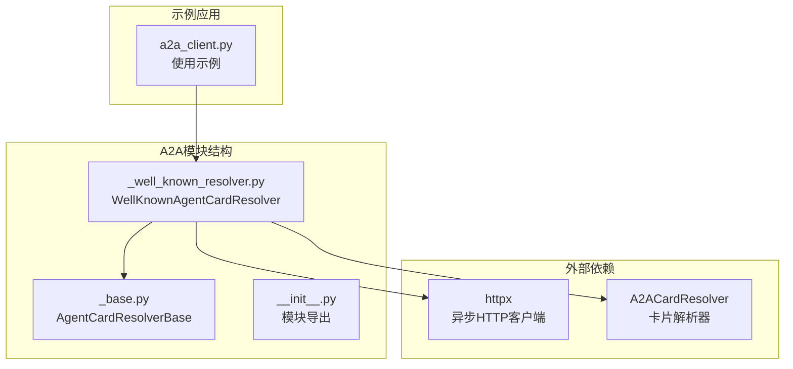
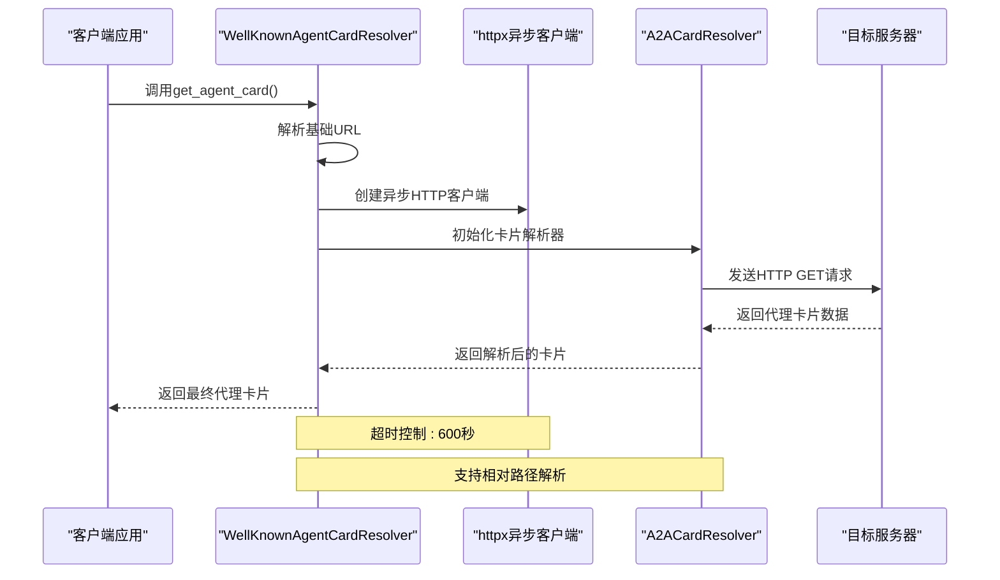
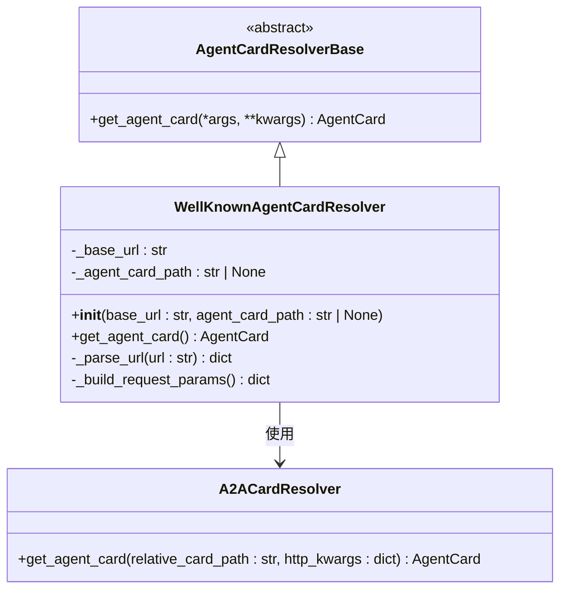
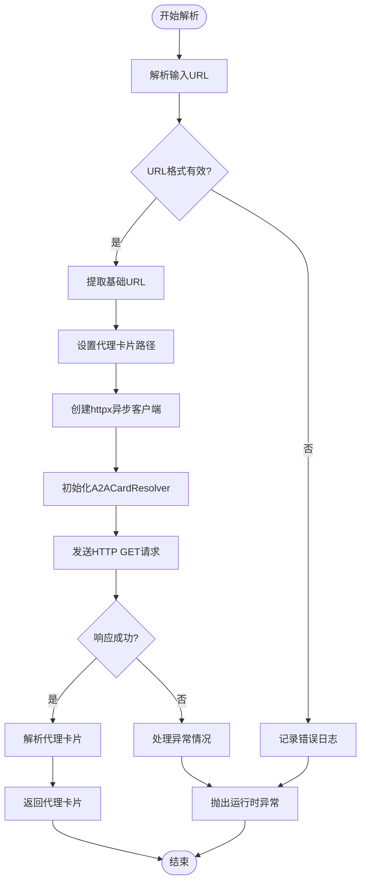
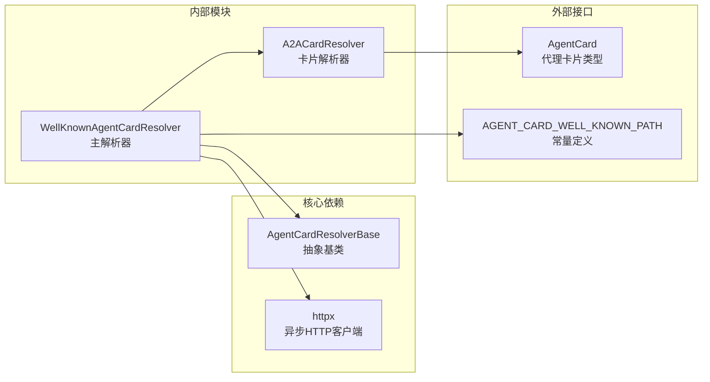

# Well-Known解析器

<cite>
**本文档引用的文件**
- [src/agentscope/a2a/_well_known_resolver.py](file://src/agentscope/a2a/_well_known_resolver.py)
- [src/agentscope/a2a/_base.py](file://src/agentscope/a2a/_base.py)
- [src/agentscope/a2a/__init__.py](file://src/agentscope/a2a/__init__.py)
- [examples/agent/a2ui_agent/samples/client/a2a_client.py](file://examples/agent/a2ui_agent/samples/client/a2a_client.py)
</cite>

## 目录
1. [简介](#简介)
2. [项目结构](#项目结构)
3. [核心组件](#核心组件)
4. [架构概览](#架构概览)
5. [详细组件分析](#详细组件分析)
6. [依赖关系分析](#依赖关系分析)
7. [性能考虑](#性能考虑)
8. [故障排除指南](#故障排除指南)
9. [结论](#结论)

## 简介

Well-Known解析器是AgentScope框架中用于解析标准Well-Known代理卡片的服务组件。该解析器实现了HTTP发现协议，通过标准的URL格式来定位和获取代理卡片配置文件。本文档深入介绍了WellKnownAgentCardResolver类的实现机制，包括标准兼容性、HTTP发现协议、URI解析规则，以及完整的配置示例和最佳实践。

## 项目结构

Well-Known解析器位于AgentScope项目的A2A（Agent-to-Agent）通信模块中，采用模块化设计，与其他解析器共同构成完整的代理卡片解析体系。



**图表来源**
- [src/agentscope/a2a/_well_known_resolver.py:1-91](file://src/agentscope/a2a/_well_known_resolver.py#L1-L91)
- [src/agentscope/a2a/_base.py:1-26](file://src/agentscope/a2a/_base.py#L1-L26)

**章节来源**
- [src/agentscope/a2a/_well_known_resolver.py:1-91](file://src/agentscope/a2a/_well_known_resolver.py#L1-L91)
- [src/agentscope/a2a/_base.py:1-26](file://src/agentscope/a2a/_base.py#L1-L26)
- [src/agentscope/a2a/__init__.py:1-15](file://src/agentscope/a2a/__init__.py#L1-L15)

## 核心组件

Well-Known解析器的核心是WellKnownAgentCardResolver类，它继承自AgentCardResolverBase抽象基类，专门负责从Well-Known URL解析代理卡片。

### 主要特性

- **异步处理**: 基于httpx的异步HTTP客户端，支持非阻塞I/O操作
- **标准兼容**: 遵循RFC标准的URL格式和Well-Known路径规范
- **错误处理**: 完善的异常捕获和日志记录机制
- **超时控制**: 可配置的请求超时时间（默认600秒）

### 关键方法

- `__init__()`: 初始化解析器实例
- `get_agent_card()`: 异步获取代理卡片的核心方法

**章节来源**
- [src/agentscope/a2a/_well_known_resolver.py:15-91](file://src/agentscope/a2a/_well_known_resolver.py#L15-L91)

## 架构概览

Well-Known解析器采用分层架构设计，通过清晰的职责分离实现高内聚、低耦合的系统结构。



**图表来源**
- [src/agentscope/a2a/_well_known_resolver.py:35-79](file://src/agentscope/a2a/_well_known_resolver.py#L35-L79)

## 详细组件分析

### WellKnownAgentCardResolver类分析

#### 类结构图



**图表来源**
- [src/agentscope/a2a/_base.py:12-26](file://src/agentscope/a2a/_base.py#L12-L26)
- [src/agentscope/a2a/_well_known_resolver.py:15-91](file://src/agentscope/a2a/_well_known_resolver.py#L15-L91)

#### 核心实现逻辑

##### URL解析机制

解析器采用标准的URL解析算法，确保对各种URL格式的兼容性：

1. **URL验证**: 检查scheme和netloc字段的有效性
2. **基础URL提取**: 从完整URL中提取协议和主机信息
3. **相对路径处理**: 提取并保留原始URL中的路径部分

##### HTTP请求处理流程



**图表来源**
- [src/agentscope/a2a/_well_known_resolver.py:46-89](file://src/agentscope/a2a/_well_known_resolver.py#L46-L89)

#### 配置参数详解

| 参数名称 | 类型 | 必需 | 默认值 | 描述 |
|---------|------|------|--------|------|
| base_url | str | 是 | 无 | 完整的Well-Known URL地址 |
| agent_card_path | str \| None | 否 | AGENT_CARD_WELL_KNOWN_PATH | 相对于基础URL的代理卡片路径 |

**章节来源**
- [src/agentscope/a2a/_well_known_resolver.py:18-33](file://src/agentscope/a2a/_well_known_resolver.py#L18-L33)

### HTTP发现协议实现

Well-Known解析器严格遵循HTTP发现协议的标准规范：

#### 标准URL格式支持

- **基本格式**: `scheme://netloc/path`
- **支持的协议**: http、https
- **路径处理**: 自动提取并保留原始路径信息
- **查询参数**: 通过相对路径参数传递

#### Well-Known路径规范

根据RFC标准，Well-Known路径具有以下特点：

1. **标准前缀**: 以`/.well-known/`开头
2. **代理卡片路径**: `AGENT_CARD_WELL_KNOWN_PATH`常量定义
3. **扩展卡片路径**: `EXTENDED_AGENT_CARD_PATH`支持认证扩展

**章节来源**
- [src/agentscope/a2a/_well_known_resolver.py:47-59](file://src/agentscope/a2a/_well_known_resolver.py#L47-L59)

### 错误处理策略

解析器实现了多层次的错误处理机制：

#### 异常类型与处理

| 异常类型 | 触发条件 | 处理方式 |
|---------|----------|----------|
| ValueError | URL格式无效 | 记录错误并抛出异常 |
| RuntimeError | 请求失败或解析错误 | 记录详细错误信息并重新抛出 |
| TimeoutError | 请求超时 | 记录超时信息并终止操作 |

#### 日志记录机制

- **错误级别**: 使用logger.error记录严重错误
- **警告级别**: 使用logger.warning记录可恢复问题
- **信息级别**: 使用logger.info记录正常流程

**章节来源**
- [src/agentscope/a2a/_well_known_resolver.py:49-90](file://src/agentscope/a2a/_well_known_resolver.py#L49-L90)

## 依赖关系分析

Well-Known解析器的依赖关系体现了清晰的模块化设计原则。



**图表来源**
- [src/agentscope/a2a/_well_known_resolver.py:6-44](file://src/agentscope/a2a/_well_known_resolver.py#L6-L44)

### 外部依赖管理

| 依赖包 | 版本要求 | 用途 | 重要性 |
|-------|----------|------|--------|
| httpx | >=0.23.0 | 异步HTTP客户端 | 核心依赖 |
| typing | - | 类型提示支持 | 基础依赖 |
| urllib.parse | - | URL解析功能 | 基础依赖 |

**章节来源**
- [src/agentscope/a2a/_well_known_resolver.py:3-7](file://src/agentscope/a2a/_well_known_resolver.py#L3-L7)

## 性能考虑

### 超时控制机制

解析器采用了合理的超时配置来平衡性能和可靠性：

- **默认超时**: 600秒（10分钟）
- **可配置性**: 支持通过构造函数参数调整超时时间
- **资源管理**: 使用异步上下文管理器确保客户端正确释放

### 连接池优化

虽然当前实现直接创建新的HTTP客户端实例，但建议在生产环境中：

1. **复用客户端**: 在应用生命周期内复用httpx.AsyncClient实例
2. **连接池配置**: 配置适当的连接池大小和keep-alive设置
3. **并发控制**: 限制同时进行的解析请求数量

## 故障排除指南

### 常见问题诊断

#### URL格式错误

**症状**: 抛出ValueError异常，日志显示"Invalid URL format"

**解决方案**:
1. 验证URL包含有效的协议（http/https）
2. 确保URL包含有效的网络位置标识符
3. 检查特殊字符是否正确编码

#### 网络连接问题

**症状**: 请求超时或连接失败

**解决方案**:
1. 检查目标服务器可达性
2. 验证防火墙和网络配置
3. 调整超时参数设置

#### 代理卡片格式错误

**症状**: 解析失败或返回空数据

**解决方案**:
1. 验证代理卡片JSON格式有效性
2. 检查必需字段的完整性
3. 确认版本兼容性

### 调试技巧

#### 启用详细日志

```python
import logging
logging.basicConfig(level=logging.DEBUG)
```

#### 错误追踪

使用异常的__cause__属性获取原始错误信息：

```python
try:
    card = await resolver.get_agent_card()
except RuntimeError as e:
    original_error = e.__cause__
    logger.error(f"原始错误: {original_error}")
```

**章节来源**
- [src/agentscope/a2a/_well_known_resolver.py:80-90](file://src/agentscope/a2a/_well_known_resolver.py#L80-L90)

## 结论

Well-Known解析器作为AgentScope框架的重要组成部分，提供了标准兼容、可靠高效的代理卡片解析能力。其设计充分考虑了异步处理、错误处理和性能优化等方面的需求。

### 主要优势

1. **标准兼容**: 严格遵循HTTP发现协议和URL标准
2. **异步支持**: 基于现代异步编程模型，提供高性能I/O操作
3. **错误处理**: 完善的异常处理和日志记录机制
4. **可扩展性**: 清晰的架构设计便于功能扩展和维护

### 最佳实践建议

1. **合理配置超时**: 根据网络环境调整超时参数
2. **错误重试机制**: 在关键业务场景中实现适当的重试逻辑
3. **监控告警**: 建立完善的监控和告警机制
4. **缓存策略**: 考虑实现代理卡片缓存以提高性能

通过遵循本文档提供的指导原则和最佳实践，开发者可以充分利用Well-Known解析器的功能，构建稳定可靠的AgentScope应用。