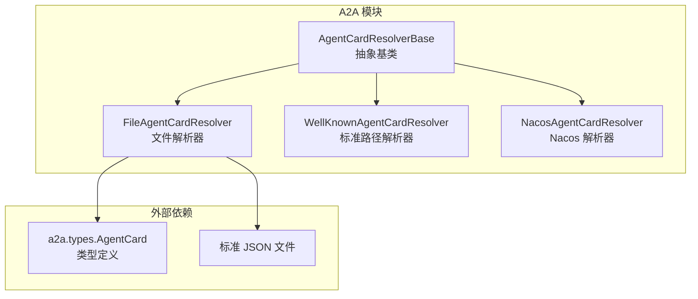
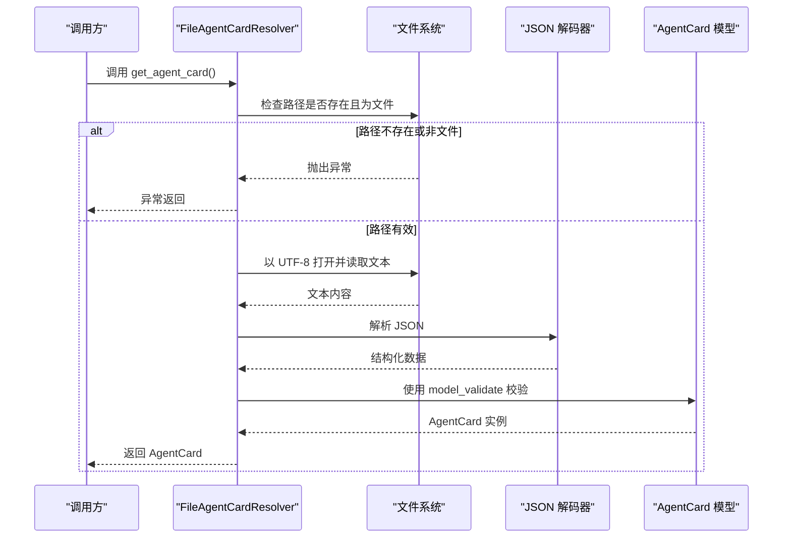
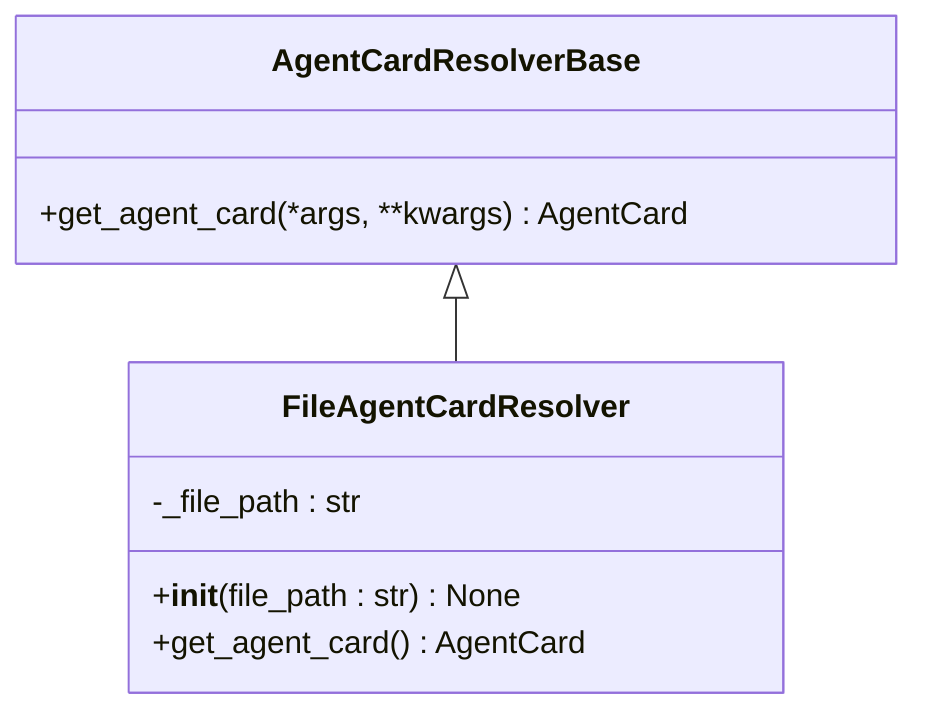
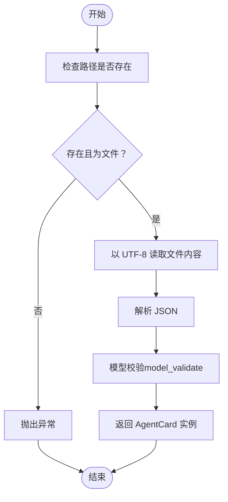
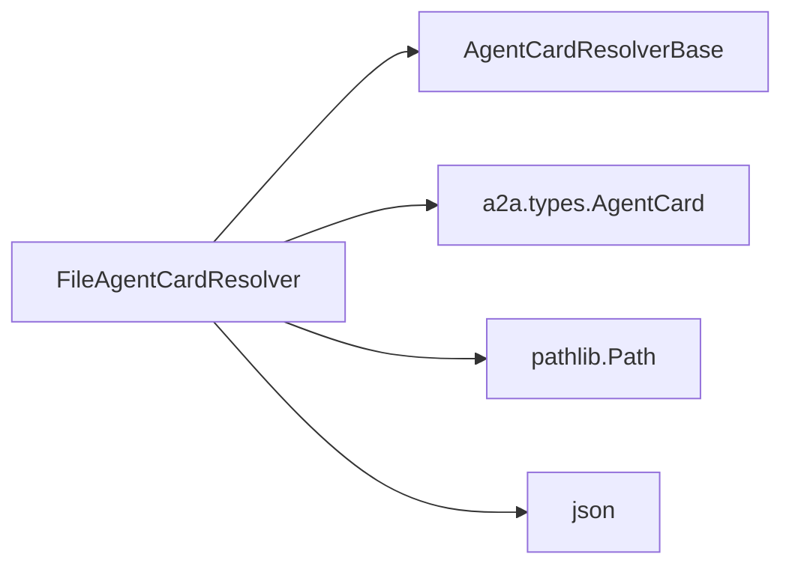

# 文件解析器

<cite>
**本文引用的文件**
- [src/agentscope/a2a/_file_resolver.py](file://src/agentscope/a2a/_file_resolver.py)
- [src/agentscope/a2a/_base.py](file://src/agentscope/a2a/_base.py)
- [src/agentscope/a2a/__init__.py](file://src/agentscope/a2a/__init__.py)
- [tests/a2a_resolver_test.py](file://tests/a2a_resolver_test.py)
- [examples/agent/a2a_agent/agent_card.py](file://examples/agent/a2a_agent/agent_card.py)
- [examples/agent/a2ui_agent/samples/general_agent/agent_card.py](file://examples/agent/a2ui_agent/samples/general_agent/agent_card.py)
- [examples/agent/a2a_agent/main.py](file://examples/agent/a2a_agent/main.py)
- [examples/agent/a2ui_agent/samples/client/a2a_client.py](file://examples/agent/a2ui_agent/samples/client/a2a_client.py)
</cite>

## 目录
1. [简介](#简介)
2. [项目结构](#项目结构)
3. [核心组件](#核心组件)
4. [架构概览](#架构概览)
5. [详细组件分析](#详细组件分析)
6. [依赖分析](#依赖分析)
7. [性能考虑](#性能考虑)
8. [故障排除指南](#故障排除指南)
9. [结论](#结论)
10. [附录](#附录)

## 简介
本文件解析器技术文档聚焦于 FileAgentCardResolver 类的实现与使用，系统性阐述其在 Agent Card（代理卡片）文件解析中的职责、JSON 文件格式规范、字段定义、路径验证与加载流程、错误处理策略、配置参数要求以及最佳实践与性能考量。文档同时提供完整配置示例与故障排除建议，帮助开发者快速、安全地集成本地 JSON 文件驱动的代理卡片加载能力。

## 项目结构
FileAgentCardResolver 属于 A2A（Agent-to-Agent）模块的一部分，位于 src/agentscope/a2a 目录下，并通过统一导出入口暴露给上层调用者。测试与示例分别位于 tests 与 examples 目录中，用于验证解析行为与演示典型用法。

图表来源
- [src/agentscope/a2a/_base.py:12-25](file://src/agentscope/a2a/_base.py#L12-L25)
- [src/agentscope/a2a/_file_resolver.py:15-78](file://src/agentscope/a2a/_file_resolver.py#L15-L78)
- [src/agentscope/a2a/__init__.py:3-14](file://src/agentscope/a2a/__init__.py#L3-L14)

章节来源
- [src/agentscope/a2a/_file_resolver.py:1-79](file://src/agentscope/a2a/_file_resolver.py#L1-L79)
- [src/agentscope/a2a/_base.py:1-26](file://src/agentscope/a2a/_base.py#L1-L26)
- [src/agentscope/a2a/__init__.py:1-15](file://src/agentscope/a2a/__init__.py#L1-L15)

## 核心组件
- FileAgentCardResolver：从本地 JSON 文件加载并校验 AgentCard 的异步解析器，负责路径存在性与类型检查、JSON 解码与 Pydantic 校验。
- AgentCardResolverBase：所有解析器的抽象基类，定义统一的异步接口。
- a2a.types.AgentCard：代理卡片的数据模型，由解析器返回并供上层使用。

章节来源
- [src/agentscope/a2a/_file_resolver.py:15-78](file://src/agentscope/a2a/_file_resolver.py#L15-L78)
- [src/agentscope/a2a/_base.py:12-25](file://src/agentscope/a2a/_base.py#L12-L25)
- [src/agentscope/a2a/__init__.py:3-14](file://src/agentscope/a2a/__init__.py#L3-L14)

## 架构概览
FileAgentCardResolver 继承自 AgentCardResolverBase，通过异步方法 get_agent_card 返回强类型 AgentCard 对象。其工作流包括：路径存在性与文件类型校验、UTF-8 文本读取、JSON 解码、Pydantic 模型校验与实例化。

图表来源
- [src/agentscope/a2a/_file_resolver.py:58-78](file://src/agentscope/a2a/_file_resolver.py#L58-L78)
- [src/agentscope/a2a/_base.py:18-25](file://src/agentscope/a2a/_base.py#L18-L25)

## 详细组件分析

### FileAgentCardResolver 类分析
- 角色与职责
  - 从本地 JSON 文件加载 AgentCard。
  - 在加载前进行路径存在性与文件类型的严格校验。
  - 使用 UTF-8 编码读取文件内容，解析为 JSON 并通过 Pydantic 进行结构与类型校验。
- 关键方法
  - 初始化：接收 file_path 参数，保存为内部状态。
  - 异步获取：执行路径校验、文件读取、JSON 解析与模型校验，最终返回 AgentCard 实例。
- 错误处理
  - 路径不存在：抛出 FileNotFoundError。
  - 路径不是文件：抛出 ValueError。
  - JSON 解析失败：交由 JSON 解码器抛出相应异常。
  - 模型校验失败：交由 Pydantic 的 model_validate 抛出 ValidationError。

图表来源
- [src/agentscope/a2a/_base.py:12-25](file://src/agentscope/a2a/_base.py#L12-L25)
- [src/agentscope/a2a/_file_resolver.py:46-78](file://src/agentscope/a2a/_file_resolver.py#L46-L78)

章节来源
- [src/agentscope/a2a/_file_resolver.py:15-78](file://src/agentscope/a2a/_file_resolver.py#L15-L78)
- [src/agentscope/a2a/_base.py:12-25](file://src/agentscope/a2a/_base.py#L12-L25)

### JSON 文件格式规范与字段定义
- 必需字段
  - name: 字符串，代理名称。
  - url: 字符串，代理服务地址。
  - version: 字符串，代理版本号。
  - capabilities: 对象，代理能力配置。
  - default_input_modes: 字符串数组，代理默认输入模式列表。
  - default_output_modes: 字符串数组，代理默认输出模式列表。
  - skills: 数组，代理技能列表。
- 可选字段
  - description: 字符串，代理描述信息。
- 示例结构
  - 参考示例文件中的 AgentCard 定义，包含 name、url、version、capabilities、default_input_modes、default_output_modes、skills 等字段；部分示例还包含 description 字段。

章节来源
- [src/agentscope/a2a/_file_resolver.py:16-44](file://src/agentscope/a2a/_file_resolver.py#L16-L44)
- [examples/agent/a2a_agent/agent_card.py:5-37](file://examples/agent/a2a_agent/agent_card.py#L5-L37)
- [examples/agent/a2ui_agent/samples/general_agent/agent_card.py:6-39](file://examples/agent/a2ui_agent/samples/general_agent/agent_card.py#L6-L39)

### 配置参数要求与使用方法
- 必填参数
  - file_path: 字符串，指向包含 AgentCard 的 JSON 文件的绝对或相对路径。
- 行为说明
  - 解析器在 get_agent_card 中对 file_path 进行存在性与文件类型校验，随后进行读取与校验。
- 典型用法
  - 通过 FileAgentCardResolver(file_path=...) 创建实例，然后调用异步方法获取 AgentCard。

章节来源
- [src/agentscope/a2a/_file_resolver.py:46-78](file://src/agentscope/a2a/_file_resolver.py#L46-L78)
- [tests/a2a_resolver_test.py:61-63](file://tests/a2a_resolver_test.py#L61-L63)

### 文件路径验证与加载过程
- 路径存在性与类型校验
  - 使用 Path 对象判断文件是否存在且为常规文件。
- 文件读取与编码
  - 以 UTF-8 编码打开文件，避免乱码导致的解析失败。
- JSON 解析与模型校验
  - 将文件内容解析为字典后，通过 AgentCard.model_validate 进行结构与类型校验，确保字段完整性与类型正确性。

图表来源
- [src/agentscope/a2a/_file_resolver.py:67-78](file://src/agentscope/a2a/_file_resolver.py#L67-L78)

章节来源
- [src/agentscope/a2a/_file_resolver.py:58-78](file://src/agentscope/a2a/_file_resolver.py#L58-L78)

### 错误处理机制
- 文件不存在
  - 抛出 FileNotFoundError，提示具体文件路径。
- 路径不是文件
  - 抛出 ValueError，提示路径类型不合法。
- JSON 解析错误
  - 由 JSON 解码器抛出相应异常（如 JSONDecodeError），解析器不额外包装。
- 模型校验失败
  - 由 Pydantic 的 model_validate 抛出 ValidationError，解析器不额外包装。
- 建议
  - 在调用方捕获并记录异常，结合日志定位问题根因。

章节来源
- [src/agentscope/a2a/_file_resolver.py:68-78](file://src/agentscope/a2a/_file_resolver.py#L68-L78)

### 配置示例
- 标准 AgentCard JSON 文件结构
  - 包含 name、url、version、capabilities、default_input_modes、default_output_modes、skills 等字段。
  - 可选字段如 description 可根据需要添加。
- 示例参考
  - a2a_agent 示例中的 agent_card.py。
  - a2ui_agent 示例中的 agent_card.py。

章节来源
- [src/agentscope/a2a/_file_resolver.py:29-42](file://src/agentscope/a2a/_file_resolver.py#L29-L42)
- [examples/agent/a2a_agent/agent_card.py:5-37](file://examples/agent/a2a_agent/agent_card.py#L5-L37)
- [examples/agent/a2ui_agent/samples/general_agent/agent_card.py:6-39](file://examples/agent/a2ui_agent/samples/general_agent/agent_card.py#L6-L39)

### 最佳实践
- 路径管理
  - 使用绝对路径或稳定的相对路径，避免运行时工作目录变化导致的解析失败。
- 编码与权限
  - 确保文件以 UTF-8 编码存储；保证进程对文件具有只读权限。
- 校验与缓存
  - 在应用启动阶段预校验关键文件，必要时对解析结果进行缓存以减少重复 IO。
- 日志与监控
  - 记录解析开始、成功与失败的关键事件，便于问题追踪。
- 失败回退
  - 当本地文件不可用时，考虑降级到其他解析源（如远程标准路径解析器）。

### 性能考虑
- IO 优化
  - 减少频繁重复读取同一文件；对静态配置采用内存缓存。
- 并发与异步
  - 利用异步接口在高并发场景下提升吞吐；避免阻塞主线程。
- 内存占用
  - 控制单个 AgentCard 的大小与嵌套层级，避免过深结构导致的序列化/反序列化开销。
- 校验成本
  - Pydantic 校验在开发环境严格开启，在生产环境可根据需求权衡开启级别。

## 依赖分析
- 组件耦合
  - FileAgentCardResolver 仅依赖 AgentCardResolverBase 接口与 a2a.types.AgentCard 类型。
  - 与文件系统交互通过 pathlib.Path 与内置 open，耦合度低。
- 导入关系
  - 通过 a2a/__init__.py 统一导出，便于上层按命名空间导入。

图表来源
- [src/agentscope/a2a/_file_resolver.py:3-12](file://src/agentscope/a2a/_file_resolver.py#L3-L12)
- [src/agentscope/a2a/_file_resolver.py:65-78](file://src/agentscope/a2a/_file_resolver.py#L65-L78)
- [src/agentscope/a2a/__init__.py:3-14](file://src/agentscope/a2a/__init__.py#L3-L14)

章节来源
- [src/agentscope/a2a/_file_resolver.py:1-79](file://src/agentscope/a2a/_file_resolver.py#L1-L79)
- [src/agentscope/a2a/__init__.py:1-15](file://src/agentscope/a2a/__init__.py#L1-L15)

## 故障排除指南
- 常见问题与排查步骤
  - 文件不存在：确认 file_path 是否正确；检查工作目录与权限。
  - 路径不是文件：确认传入的是文件而非目录。
  - JSON 格式错误：使用在线 JSON 校验工具或编辑器插件检查语法；关注报错位置。
  - 字段缺失或类型不符：对照必需字段清单逐项核对；修正类型或补充字段。
- 测试与验证
  - 使用测试用例思路：先写入临时 JSON 文件，再调用解析器，最后断言输出一致。
  - 参考测试文件中的构造与断言逻辑。

章节来源
- [src/agentscope/a2a/_file_resolver.py:68-78](file://src/agentscope/a2a/_file_resolver.py#L68-L78)
- [tests/a2a_resolver_test.py:53-72](file://tests/a2a_resolver_test.py#L53-L72)

## 结论
FileAgentCardResolver 提供了稳定、清晰的本地 JSON 文件驱动的代理卡片解析能力。通过严格的路径校验、UTF-8 读取与 Pydantic 校验，确保了数据的可靠性与一致性。配合良好的错误处理与最佳实践，可在复杂环境中可靠地加载与使用 AgentCard。建议在实际工程中结合缓存、日志与降级策略，进一步提升可用性与可观测性。

## 附录
- 相关示例与用法
  - a2a_agent 示例展示了如何定义 AgentCard 并通过解析器加载。
  - a2a_client 示例展示了客户端如何组合解析器与消息发送流程。
- 相关文件路径
  - 解析器实现：[src/agentscope/a2a/_file_resolver.py:1-79](file://src/agentscope/a2a/_file_resolver.py#L1-L79)
  - 抽象基类：[src/agentscope/a2a/_base.py:1-26](file://src/agentscope/a2a/_base.py#L1-L26)
  - 统一导出：[src/agentscope/a2a/__init__.py:1-15](file://src/agentscope/a2a/__init__.py#L1-L15)
  - 测试用例：[tests/a2a_resolver_test.py:1-73](file://tests/a2a_resolver_test.py#L1-L73)
  - 示例 AgentCard（a2a_agent）：[examples/agent/a2a_agent/agent_card.py:1-38](file://examples/agent/a2a_agent/agent_card.py#L1-L38)
  - 示例 AgentCard（a2ui_agent）：[examples/agent/a2ui_agent/samples/general_agent/agent_card.py:1-40](file://examples/agent/a2ui_agent/samples/general_agent/agent_card.py#L1-L40)
  - 客户端示例（a2a_client）：[examples/agent/a2a_agent/main.py](file://examples/agent/a2a_agent/main.py)
  - 客户端示例（a2ui_client）：[examples/agent/a2ui_agent/samples/client/a2a_client.py:1-79](file://examples/agent/a2ui_agent/samples/client/a2a_client.py#L1-L79)