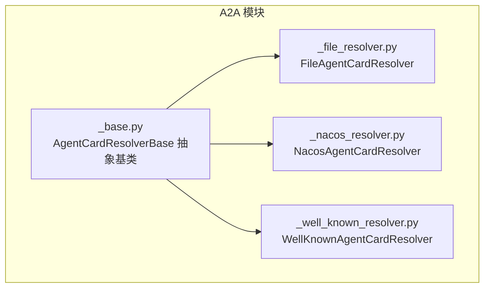
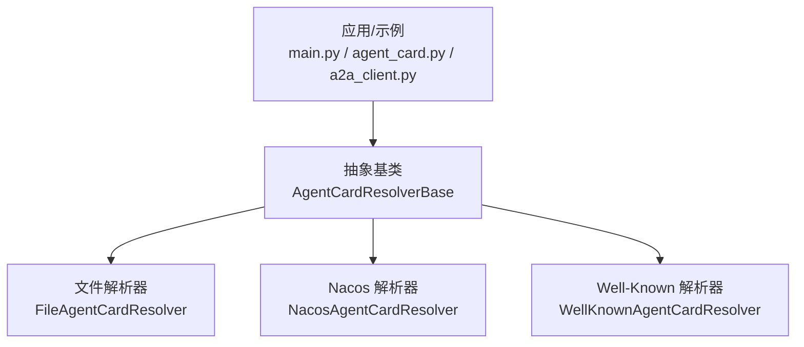
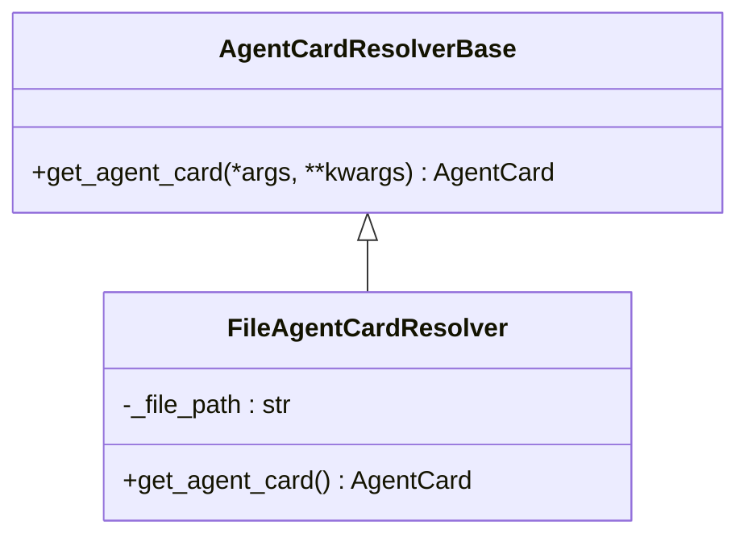
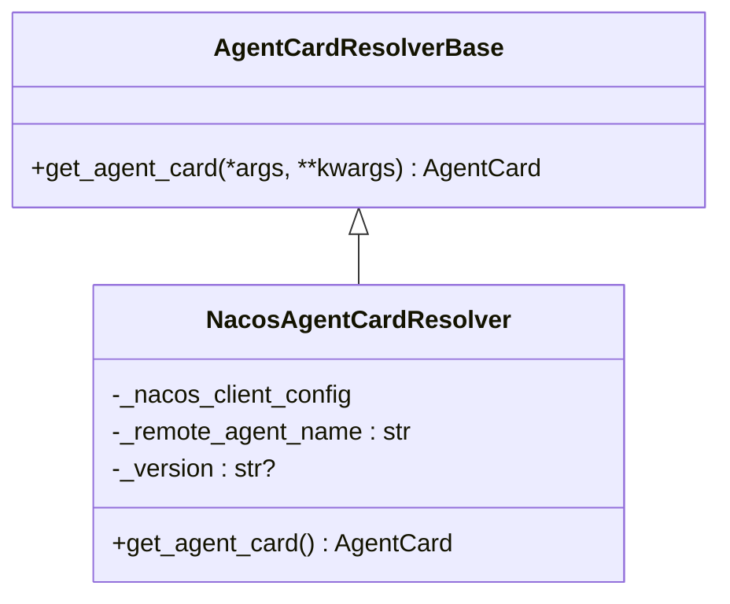
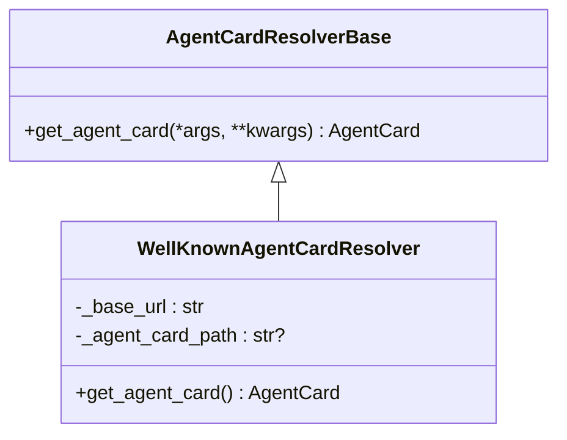
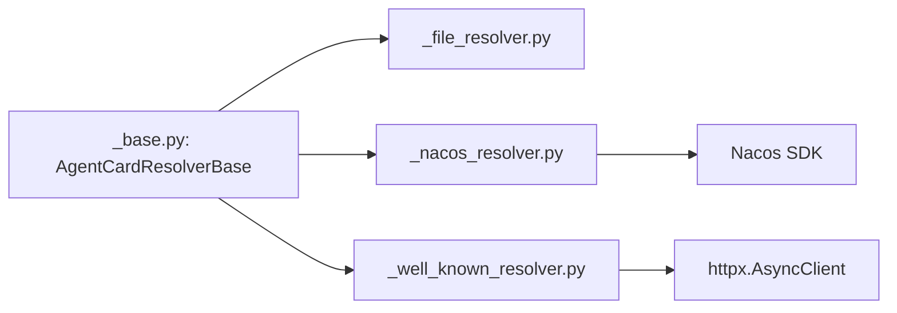

# 解析器系统

<cite>
**本文引用的文件**
- [src/agentscope/a2a/__init__.py](file://src/agentscope/a2a/__init__.py)
- [src/agentscope/a2a/_base.py](file://src/agentscope/a2a/_base.py)
- [src/agentscope/a2a/_file_resolver.py](file://src/agentscope/a2a/_file_resolver.py)
- [src/agentscope/a2a/_nacos_resolver.py](file://src/agentscope/a2a/_nacos_resolver.py)
- [src/agentscope/a2a/_well_known_resolver.py](file://src/agentscope/a2a/_well_known_resolver.py)
- [examples/agent/a2a_agent/main.py](file://examples/agent/a2a_agent/main.py)
- [examples/agent/a2a_agent/agent_card.py](file://examples/agent/a2a_agent/agent_card.py)
- [examples/agent/a2ui_agent/samples/client/a2a_client.py](file://examples/agent/a2ui_agent/samples/client/a2a_client.py)
- [tests/a2a_resolver_test.py](file://tests/a2a_resolver_test.py)
</cite>

## 目录
1. [简介](#简介)
2. [项目结构](#项目结构)
3. [核心组件](#核心组件)
4. [架构总览](#架构总览)
5. [详细组件分析](#详细组件分析)
6. [依赖分析](#依赖分析)
7. [性能考虑](#性能考虑)
8. [故障排除指南](#故障排除指南)
9. [结论](#结论)
10. [附录](#附录)

## 简介
本技术文档围绕 A2A（Agent-to-Agent）解析器系统展开，系统提供三种解析器实现：文件解析器、Nacos 解析器与 Well-Known 解析器。它们分别面向本地配置管理、服务发现集成与标准兼容的远程卡片获取场景。文档将深入解释各解析器的实现机制、配置参数、连接方式、错误处理策略，并给出选择策略、优先级机制、扩展指南与完整配置示例。

## 项目结构
A2A 解析器位于 agentscope 的 a2a 子模块中，采用按职责分层的组织方式：
- 基类：统一抽象接口，约束子类必须实现异步获取代理卡片的方法。
- 文件解析器：从本地 JSON 文件加载代理卡片。
- Nacos 解析器：通过 Nacos 服务动态拉取并订阅代理卡片。
- Well-Known 解析器：遵循标准路径从远程地址解析代理卡片。

图表来源
- [src/agentscope/a2a/_base.py:12-26](file://src/agentscope/a2a/_base.py#L12-L26)
- [src/agentscope/a2a/_file_resolver.py:15-79](file://src/agentscope/a2a/_file_resolver.py#L15-L79)
- [src/agentscope/a2a/_nacos_resolver.py:17-99](file://src/agentscope/a2a/_nacos_resolver.py#L17-L99)
- [src/agentscope/a2a/_well_known_resolver.py:15-91](file://src/agentscope/a2a/_well_known_resolver.py#L15-L91)

章节来源
- [src/agentscope/a2a/__init__.py:1-15](file://src/agentscope/a2a/__init__.py#L1-L15)
- [src/agentscope/a2a/_base.py:12-26](file://src/agentscope/a2a/_base.py#L12-L26)

## 核心组件
- 抽象基类：定义统一的异步获取代理卡片接口，确保所有具体解析器具备一致的调用契约。
- 文件解析器：读取本地 JSON 文件，校验路径存在性与类型，反序列化为代理卡片对象。
- Nacos 解析器：基于 Nacos SDK 创建 AI 服务客户端，启动后按名称与版本获取代理卡片，并在结束时安全关闭客户端。
- Well-Known 解析器：解析基础 URL，拼接标准路径，使用异步 HTTP 客户端调用内部卡片解析器获取卡片。

章节来源
- [src/agentscope/a2a/_base.py:12-26](file://src/agentscope/a2a/_base.py#L12-L26)
- [src/agentscope/a2a/_file_resolver.py:15-79](file://src/agentscope/a2a/_file_resolver.py#L15-L79)
- [src/agentscope/a2a/_nacos_resolver.py:17-99](file://src/agentscope/a2a/_nacos_resolver.py#L17-L99)
- [src/agentscope/a2a/_well_known_resolver.py:15-91](file://src/agentscope/a2a/_well_known_resolver.py#L15-L91)

## 架构总览
下图展示了三种解析器在系统中的角色与交互关系，以及与上层应用的对接方式。

图表来源
- [src/agentscope/a2a/_base.py:12-26](file://src/agentscope/a2a/_base.py#L12-L26)
- [src/agentscope/a2a/_file_resolver.py:15-79](file://src/agentscope/a2a/_file_resolver.py#L15-L79)
- [src/agentscope/a2a/_nacos_resolver.py:17-99](file://src/agentscope/a2a/_nacos_resolver.py#L17-L99)
- [src/agentscope/a2a/_well_known_resolver.py:15-91](file://src/agentscope/a2a/_well_known_resolver.py#L15-L91)
- [examples/agent/a2a_agent/main.py:10-28](file://examples/agent/a2a_agent/main.py#L10-L28)
- [examples/agent/a2a_agent/agent_card.py:1-37](file://examples/agent/a2a_agent/agent_card.py#L1-L37)
- [examples/agent/a2ui_agent/samples/client/a2a_client.py:22-156](file://examples/agent/a2ui_agent/samples/client/a2a_client.py#L22-L156)

## 详细组件分析

### 文件解析器（FileAgentCardResolver）
- 职责：从本地 JSON 文件加载代理卡片，适用于离线或本地开发环境。
- 关键点：
  - 初始化参数：文件路径字符串。
  - 异步方法：读取文件并反序列化为代理卡片对象。
  - 错误处理：文件不存在、路径非文件等场景抛出异常。
- 使用场景：本地调试、CI 测试、离线部署。
- 配置要点：确保 JSON 结构符合代理卡片模型；文件编码为 UTF-8；路径可为相对或绝对路径。

图表来源
- [src/agentscope/a2a/_base.py:12-26](file://src/agentscope/a2a/_base.py#L12-L26)
- [src/agentscope/a2a/_file_resolver.py:15-79](file://src/agentscope/a2a/_file_resolver.py#L15-L79)

章节来源
- [src/agentscope/a2a/_file_resolver.py:15-79](file://src/agentscope/a2a/_file_resolver.py#L15-L79)
- [tests/a2a_resolver_test.py:53-73](file://tests/a2a_resolver_test.py#L53-L73)

### Nacos 解析器（NacosAgentCardResolver）
- 职责：通过 Nacos 动态服务发现获取代理卡片，并支持订阅更新。
- 关键点：
  - 初始化参数：远程代理名称、Nacos 客户端配置（必需包含服务器地址）、版本号（可选，默认最新）。
  - 异步方法：创建并启动 Nacos AI 服务客户端，获取指定名称与版本的代理卡片，最后安全关闭客户端。
  - 错误处理：SDK 缺失时提示安装依赖；客户端关闭异常记录警告日志。
- 使用场景：生产环境的动态配置与卡片发布。
- 配置要点：正确设置 Nacos 服务器地址；若需固定版本，传入版本号；注意网络连通性与权限。

图表来源
- [src/agentscope/a2a/_base.py:12-26](file://src/agentscope/a2a/_base.py#L12-L26)
- [src/agentscope/a2a/_nacos_resolver.py:17-99](file://src/agentscope/a2a/_nacos_resolver.py#L17-L99)

章节来源
- [src/agentscope/a2a/_nacos_resolver.py:17-99](file://src/agentscope/a2a/_nacos_resolver.py#L17-L99)

### Well-Known 解析器（WellKnownAgentCardResolver）
- 职责：遵循标准路径从远程地址解析代理卡片，便于跨平台互操作。
- 关键点：
  - 初始化参数：基础 URL、卡片路径（可选，默认使用标准路径常量）。
  - 异步方法：解析 URL，拼接标准路径，使用异步 HTTP 客户端创建内部卡片解析器并发起请求。
  - 错误处理：URL 格式无效时记录错误并抛出运行时异常；异常统一包装以便上层感知。
- 使用场景：标准兼容的远程卡片获取，如 /.well-known/agent-card.json。
- 配置要点：确保基础 URL 合法且可达；如需自定义路径，显式传入卡片路径。

图表来源
- [src/agentscope/a2a/_base.py:12-26](file://src/agentscope/a2a/_base.py#L12-L26)
- [src/agentscope/a2a/_well_known_resolver.py:15-91](file://src/agentscope/a2a/_well_known_resolver.py#L15-L91)

章节来源
- [src/agentscope/a2a/_well_known_resolver.py:15-91](file://src/agentscope/a2a/_well_known_resolver.py#L15-L91)

### 选择策略与优先级机制
- 选择策略建议：
  - 开发与测试阶段：优先使用文件解析器，便于快速迭代与离线验证。
  - 生产与动态场景：优先使用 Nacos 解析器，结合版本控制与订阅能力提升可用性。
  - 标准兼容与跨平台：使用 Well-Known 解析器，遵循标准路径提升互操作性。
- 优先级机制：
  - 可根据部署环境设定默认解析器顺序，例如“Nacos > Well-Known > 文件”。
  - 支持配置覆盖：当某解析器失败时，自动回退到下一个候选解析器。
  - 故障转移：对每个解析器设置超时与重试策略，避免单点故障影响整体可用性。
- 性能优化：
  - 缓存：对远程解析结果进行短期缓存，减少重复网络请求。
  - 连接复用：使用异步 HTTP 客户端池化，降低握手开销。
  - 并发：在多代理场景下并发触发解析，缩短总体等待时间。

[本节为概念性说明，不直接分析具体文件，故不附“章节来源”]

## 依赖分析
- 组件内聚与耦合：
  - 所有解析器均继承自抽象基类，保持高内聚、低耦合。
  - 文件解析器仅依赖本地文件系统；Nacos 解析器依赖外部 SDK；Well-Known 解析器依赖 HTTP 客户端。
- 外部依赖：
  - Nacos 解析器需要安装对应 SDK；否则初始化时报错引导安装。
  - Well-Known 解析器依赖异步 HTTP 客户端，确保超时与资源释放。
- 接口契约：
  - 统一的异步获取方法签名，便于替换与扩展。

图表来源
- [src/agentscope/a2a/_base.py:12-26](file://src/agentscope/a2a/_base.py#L12-L26)
- [src/agentscope/a2a/_nacos_resolver.py:66-73](file://src/agentscope/a2a/_nacos_resolver.py#L66-L73)
- [src/agentscope/a2a/_well_known_resolver.py:42-71](file://src/agentscope/a2a/_well_known_resolver.py#L42-L71)

章节来源
- [src/agentscope/a2a/_nacos_resolver.py:66-73](file://src/agentscope/a2a/_nacos_resolver.py#L66-L73)
- [src/agentscope/a2a/_well_known_resolver.py:42-71](file://src/agentscope/a2a/_well_known_resolver.py#L42-L71)

## 性能考虑
- 缓存策略：对远程卡片结果进行短期缓存，降低重复请求频率。
- 超时与重试：为网络请求设置合理超时与指数退避重试，提升稳定性。
- 并发与连接池：使用异步客户端池化与并发解析，缩短整体等待时间。
- 资源清理：确保客户端在 finally 中关闭，避免资源泄漏。

[本节为通用性能建议，不直接分析具体文件，故不附“章节来源”]

## 故障排除指南
- 文件解析器常见问题：
  - 文件不存在：检查路径是否正确，确认文件存在且可读。
  - 路径非文件：确认传入的是文件而非目录。
- Nacos 解析器常见问题：
  - SDK 未安装：根据提示安装对应 SDK；确保版本满足要求。
  - 客户端关闭异常：记录警告日志，不影响主要流程，但应关注资源释放。
- Well-Known 解析器常见问题：
  - URL 格式无效：检查基础 URL 是否包含协议与主机名。
  - 网络不可达：检查网络连通性与代理设置。
- 通用排查步骤：
  - 查看日志输出，定位异常发生的具体解析器。
  - 尝试最小化配置复现问题，逐步缩小范围。
  - 在测试环境中验证解析器行为，确保与生产环境一致。

章节来源
- [src/agentscope/a2a/_file_resolver.py:68-74](file://src/agentscope/a2a/_file_resolver.py#L68-L74)
- [src/agentscope/a2a/_nacos_resolver.py:69-73](file://src/agentscope/a2a/_nacos_resolver.py#L69-L73)
- [src/agentscope/a2a/_nacos_resolver.py:92-98](file://src/agentscope/a2a/_nacos_resolver.py#L92-L98)
- [src/agentscope/a2a/_well_known_resolver.py:47-56](file://src/agentscope/a2a/_well_known_resolver.py#L47-L56)
- [src/agentscope/a2a/_well_known_resolver.py:80-90](file://src/agentscope/a2a/_well_known_resolver.py#L80-L90)

## 结论
A2A 解析器系统通过抽象基类统一了不同来源的代理卡片获取方式，文件解析器、Nacos 解析器与 Well-Known 解析器分别覆盖了本地、动态与标准兼容三大场景。通过合理的配置、错误处理与性能优化策略，可在不同环境下稳定高效地完成卡片解析与后续通信。建议在实际部署中结合业务需求选择合适的解析器组合，并建立完善的监控与回退机制。

[本节为总结性内容，不直接分析具体文件，故不附“章节来源”]

## 附录

### 集成步骤与示例
- 文件解析器集成：
  - 准备本地代理卡片 JSON 文件，确保字段完整。
  - 使用文件解析器实例化并调用异步获取方法，得到代理卡片对象。
  - 参考测试用例了解典型流程与断言方式。
- Nacos 解析器集成：
  - 准备 Nacos 客户端配置（至少包含服务器地址），并确保网络可达。
  - 实例化 Nacos 解析器，传入远程代理名称与可选版本号。
  - 获取卡片后进行后续初始化与通信。
- Well-Known 解析器集成：
  - 提供基础 URL，必要时指定卡片路径。
  - 使用异步 HTTP 客户端创建解析器并发起请求。
  - 参考示例客户端脚本了解标准路径与扩展头的使用。

章节来源
- [tests/a2a_resolver_test.py:53-73](file://tests/a2a_resolver_test.py#L53-L73)
- [examples/agent/a2a_agent/main.py:10-28](file://examples/agent/a2a_agent/main.py#L10-L28)
- [examples/agent/a2a_agent/agent_card.py:1-37](file://examples/agent/a2a_agent/agent_card.py#L1-L37)
- [examples/agent/a2ui_agent/samples/client/a2a_client.py:22-156](file://examples/agent/a2ui_agent/samples/client/a2a_client.py#L22-L156)

### 扩展指南：自定义解析器
- 实现步骤：
  - 新建类继承抽象基类，实现异步获取方法。
  - 明确初始化参数与依赖项，确保与现有解析器一致的返回类型。
  - 编写单元测试，覆盖正常路径与异常路径。
  - 在上层应用中注册并按优先级策略启用新解析器。
- 接口契约：
  - 保持异步方法签名一致，便于替换与组合。
- 最佳实践：
  - 明确错误语义与日志记录，便于排障。
  - 考虑缓存与超时策略，提升稳定性与性能。

[本节为通用扩展指导，不直接分析具体文件，故不附“章节来源”]