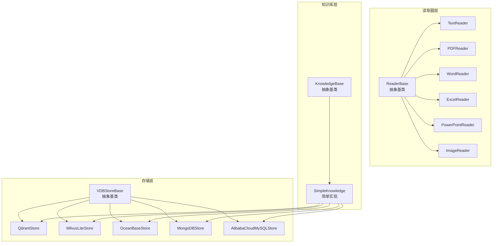
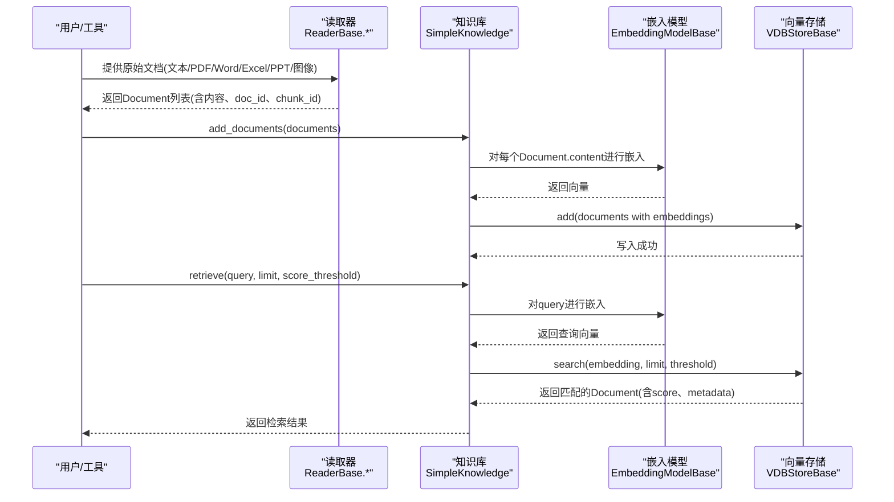
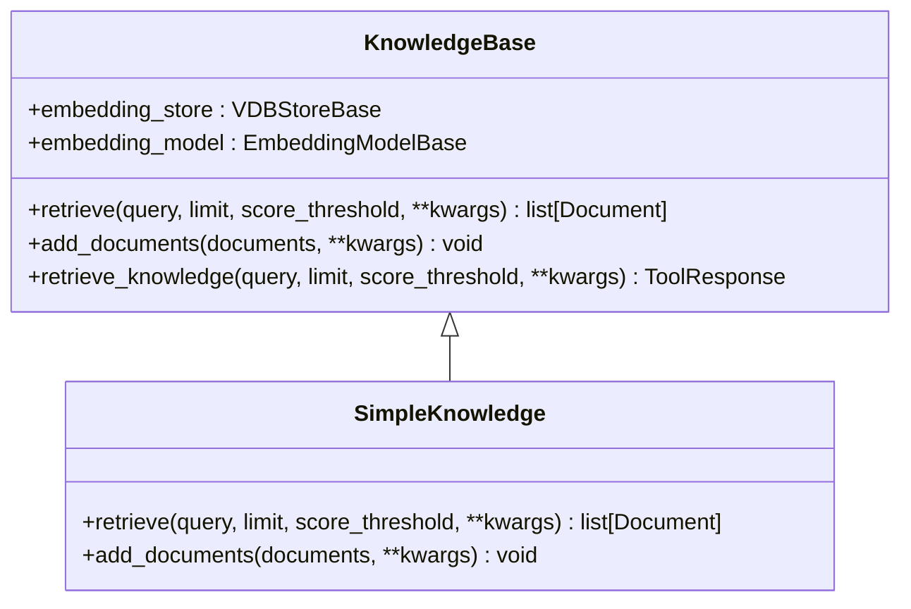
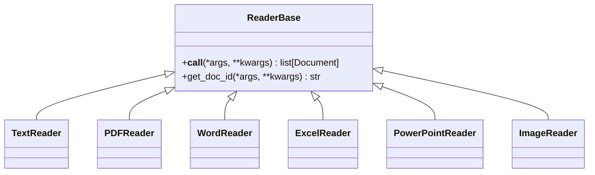
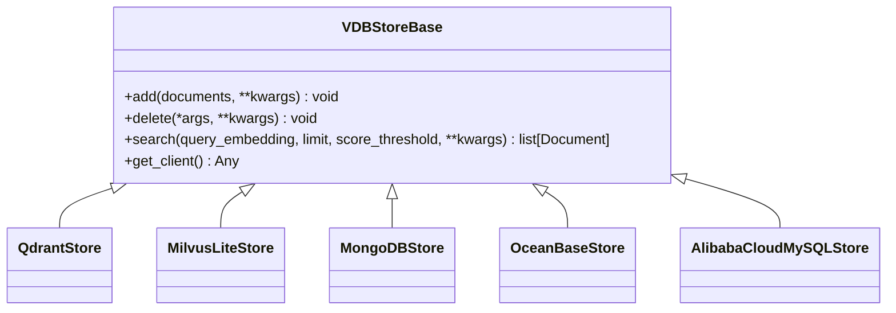
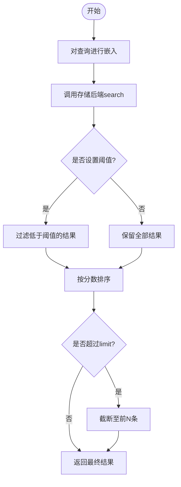
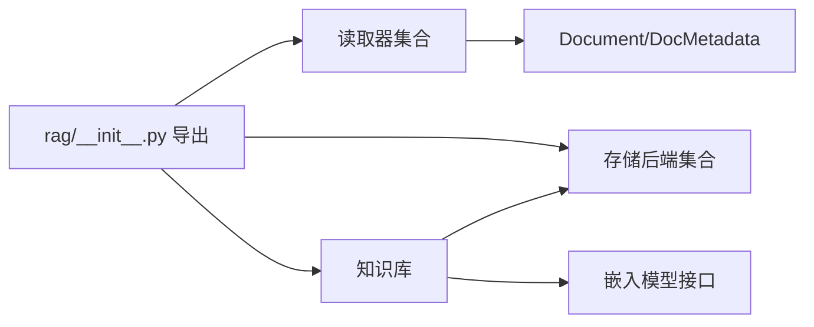

# RAG系统

<cite>
**本文引用的文件**
- [src/agentscope/rag/__init__.py](file://src/agentscope/rag/__init__.py)
- [src/agentscope/rag/_knowledge_base.py](file://src/agentscope/rag/_knowledge_base.py)
- [src/agentscope/rag/_simple_knowledge.py](file://src/agentscope/rag/_simple_knowledge.py)
- [src/agentscope/rag/_reader/_reader_base.py](file://src/agentscope/rag/_reader/_reader_base.py)
- [src/agentscope/rag/_reader/_text_reader.py](file://src/agentscope/rag/_reader/_text_reader.py)
- [src/agentscope/rag/_reader/_pdf_reader.py](file://src/agentscope/rag/_reader/_pdf_reader.py)
- [src/agentscope/rag/_reader/_word_reader.py](file://src/agentscope/rag/_reader/_word_reader.py)
- [src/agentscope/rag/_reader/_excel_reader.py](file://src/agentscope/rag/_reader/_excel_reader.py)
- [src/agentscope/rag/_reader/_ppt_reader.py](file://src/agentscope/rag/_reader/_ppt_reader.py)
- [src/agentscope/rag/_reader/_image_reader.py](file://src/agentscope/rag/_reader/_image_reader.py)
- [src/agentscope/rag/_reader/_utils.py](file://src/agentscope/rag/_reader/_utils.py)
- [src/agentscope/rag/_store/_store_base.py](file://src/agentscope/rag/_store/_store_base.py)
- [src/agentscope/rag/_store/_qdrant_store.py](file://src/agentscope/rag/_store/_qdrant_store.py)
- [src/agentscope/rag/_store/_milvuslite_store.py](file://src/agentscope/rag/_store/_milvuslite_store.py)
- [src/agentscope/rag/_store/_mongodb_store.py](file://src/agentscope/rag/_store/_mongodb_store.py)
- [src/agentscope/rag/_store/_oceanbase_store.py](file://src/agentscope/rag/_store/_oceanbase_store.py)
- [src/agentscope/rag/_store/_alibabacloud_mysql_store.py](file://src/agentscope/rag/_store/_alibabacloud_mysql_store.py)
- [src/agentscope/rag/_document.py](file://src/agentscope/rag/_document.py)
- [examples/functionality/rag/basic_usage.py](file://examples/functionality/rag/basic_usage.py)
- [examples/functionality/rag/multimodal_rag.py](file://examples/functionality/rag/multimodal_rag.py)
- [examples/functionality/rag/react_agent_integration.py](file://examples/functionality/rag/react_agent_integration.py)
- [examples/functionality/rag/agentic_usage.py](file://examples/functionality/rag/agentic_usage.py)
- [tests/rag_reader_test.py](file://tests/rag_reader_test.py)
- [tests/rag_store_test.py](file://tests/rag_store_test.py)
- [tests/rag_knowledge_test.py](file://tests/rag_knowledge_test.py)
- [docs/tutorial/en/src/task_rag.py](file://docs/tutorial/en/src/task_rag.py)
</cite>

## 目录
1. [简介](#简介)
2. [项目结构](#项目结构)
3. [核心组件](#核心组件)
4. [架构总览](#架构总览)
5. [详细组件分析](#详细组件分析)
6. [依赖关系分析](#依赖关系分析)
7. [性能考虑](#性能考虑)
8. [故障排除指南](#故障排除指南)
9. [结论](#结论)
10. [附录：API参考与部署建议](#附录api参考与部署建议)

## 简介
本技术文档面向AgentScope RAG（检索增强生成）系统，系统性阐述从“知识库构建”到“检索增强”的完整流程与实现细节，覆盖以下主题：
- 知识库构建：文档预处理（文本/多模态）、分块策略、向量化、索引建立
- 文档读取器：PDF、Word、Excel、PPT、图像等多格式支持，表格与图片抽取、元数据保留
- 向量存储：Qdrant、Milvus Lite、MongoDB、OceanBase、MySQL（阿里云）等后端适配与配置
- 检索增强：相似度搜索、阈值过滤、结果聚合与上下文融合
- 配置与调优：模型选择、参数调优、性能优化
- 使用示例：基础用法、多模态RAG、ReAct智能体集成
- 效果评估与故障排除：测试用例与常见问题定位
- 完整API参考与部署建议

## 项目结构
AgentScope RAG模块位于src/agentscope/rag目录，采用“读取器-知识库-存储后端”的分层设计：
- 读取器层：负责从不同源读取并切分为Document对象
- 知识库层：封装检索与添加逻辑，统一检索接口
- 存储层：对接多种向量数据库或兼容接口

图表来源
- [src/agentscope/rag/__init__.py:1-48](file://src/agentscope/rag/__init__.py#L1-L48)
- [src/agentscope/rag/_reader/_reader_base.py:1-28](file://src/agentscope/rag/_reader/_reader_base.py#L1-L28)
- [src/agentscope/rag/_knowledge_base.py:1-131](file://src/agentscope/rag/_knowledge_base.py#L1-L131)
- [src/agentscope/rag/_simple_knowledge.py:1-85](file://src/agentscope/rag/_simple_knowledge.py#L1-L85)
- [src/agentscope/rag/_store/_store_base.py:1-50](file://src/agentscope/rag/_store/_store_base.py#L1-L50)

章节来源
- [src/agentscope/rag/__init__.py:1-48](file://src/agentscope/rag/__init__.py#L1-L48)

## 核心组件
- 读取器（ReaderBase及其实现）
  - TextReader：按字符/句子/段落切分文本
  - PDFReader：基于pypdf提取文本并切分
  - WordReader：提取文本、表格（Markdown/JSON）、图片（可选）
  - ExcelReader：提取表格（Markdown/JSON）、图片（可选）、单元格坐标
  - PowerPointReader：提取文本、表格、图片，支持幻灯片前缀/后缀
  - ImageReader：将图像编码为消息块
- 知识库（KnowledgeBase）
  - 抽象定义检索与添加接口；SimpleKnowledge提供默认实现
- 向量存储（VDBStoreBase及其实现）
  - QdrantStore：异步客户端，支持内存/本地/远程
  - MilvusLiteStore：本地/远程Milvus，支持HNSW索引
  - MongoDBStore：MongoDB向量搜索（Atlas Search），自动建索引
  - OceanBaseStore：基于pyobvector的Milvus兼容接口
  - AlibabaCloudMySQLStore：自定义MySQL向量存储（通过距离计算）

章节来源
- [src/agentscope/rag/_reader/_reader_base.py:1-28](file://src/agentscope/rag/_reader/_reader_base.py#L1-L28)
- [src/agentscope/rag/_reader/_text_reader.py](file://src/agentscope/rag/_reader/_text_reader.py)
- [src/agentscope/rag/_reader/_pdf_reader.py:1-87](file://src/agentscope/rag/_reader/_pdf_reader.py#L1-L87)
- [src/agentscope/rag/_reader/_word_reader.py:1-457](file://src/agentscope/rag/_reader/_word_reader.py#L1-L457)
- [src/agentscope/rag/_reader/_excel_reader.py:1-674](file://src/agentscope/rag/_reader/_excel_reader.py#L1-L674)
- [src/agentscope/rag/_reader/_ppt_reader.py:1-633](file://src/agentscope/rag/_reader/_ppt_reader.py#L1-L633)
- [src/agentscope/rag/_reader/_image_reader.py](file://src/agentscope/rag/_reader/_image_reader.py)
- [src/agentscope/rag/_knowledge_base.py:1-131](file://src/agentscope/rag/_knowledge_base.py#L1-L131)
- [src/agentscope/rag/_simple_knowledge.py:1-85](file://src/agentscope/rag/_simple_knowledge.py#L1-L85)
- [src/agentscope/rag/_store/_store_base.py:1-50](file://src/agentscope/rag/_store/_store_base.py#L1-L50)
- [src/agentscope/rag/_store/_qdrant_store.py:1-174](file://src/agentscope/rag/_store/_qdrant_store.py#L1-L174)
- [src/agentscope/rag/_store/_milvuslite_store.py:1-258](file://src/agentscope/rag/_store/_milvuslite_store.py#L1-L258)
- [src/agentscope/rag/_store/_mongodb_store.py:1-393](file://src/agentscope/rag/_store/_mongodb_store.py#L1-L393)
- [src/agentscope/rag/_store/_oceanbase_store.py:1-553](file://src/agentscope/rag/_store/_oceanbase_store.py#L1-L553)
- [src/agentscope/rag/_store/_alibabacloud_mysql_store.py](file://src/agentscope/rag/_store/_alibabacloud_mysql_store.py)

## 架构总览
RAG系统以“读取器-知识库-存储后端”三层协作完成从原始文档到检索结果的闭环。

图表来源
- [src/agentscope/rag/_simple_knowledge.py:13-85](file://src/agentscope/rag/_simple_knowledge.py#L13-L85)
- [src/agentscope/rag/_knowledge_base.py:37-131](file://src/agentscope/rag/_knowledge_base.py#L37-L131)
- [src/agentscope/rag/_store/_store_base.py:14-49](file://src/agentscope/rag/_store/_store_base.py#L14-L49)

## 详细组件分析

### 知识库层：检索与添加
- SimpleKnowledge
  - add_documents：校验嵌入模型支持的模态，批量获取向量并写入存储
  - retrieve：对查询进行嵌入，调用存储后端search，返回带分数与元数据的Document列表
- KnowledgeBase
  - 抽象定义检索与添加接口，并提供retrieve_knowledge工具包装，便于直接注册为Agent工具

图表来源
- [src/agentscope/rag/_knowledge_base.py:13-131](file://src/agentscope/rag/_knowledge_base.py#L13-L131)
- [src/agentscope/rag/_simple_knowledge.py:10-85](file://src/agentscope/rag/_simple_knowledge.py#L10-L85)

章节来源
- [src/agentscope/rag/_knowledge_base.py:13-131](file://src/agentscope/rag/_knowledge_base.py#L13-L131)
- [src/agentscope/rag/_simple_knowledge.py:10-85](file://src/agentscope/rag/_simple_knowledge.py#L10-L85)

### 读取器层：多格式解析与分块
- ReaderBase
  - 统一的异步调用接口与文档ID生成接口
- TextReader
  - 基于nltk（英文）的句子切分，或按字符/段落切分
- PDFReader
  - 使用pypdf提取文本，再委托TextReader切分
- WordReader
  - 提取文本、表格（Markdown/JSON）、图片（可选），支持“表单独块”避免截断
- ExcelReader
  - 提取表格（Markdown/JSON）、图片（可选）、单元格坐标，支持按工作表拆分
- PowerPointReader
  - 提取文本、表格（Markdown/JSON）、图片（可选），支持幻灯片前后缀
- ImageReader
  - 将图像转为消息块（支持base64编码）

图表来源
- [src/agentscope/rag/_reader/_reader_base.py:9-28](file://src/agentscope/rag/_reader/_reader_base.py#L9-L28)
- [src/agentscope/rag/_reader/_text_reader.py](file://src/agentscope/rag/_reader/_text_reader.py)
- [src/agentscope/rag/_reader/_pdf_reader.py:11-87](file://src/agentscope/rag/_reader/_pdf_reader.py#L11-L87)
- [src/agentscope/rag/_reader/_word_reader.py:209-457](file://src/agentscope/rag/_reader/_word_reader.py#L209-L457)
- [src/agentscope/rag/_reader/_excel_reader.py:120-674](file://src/agentscope/rag/_reader/_excel_reader.py#L120-L674)
- [src/agentscope/rag/_reader/_ppt_reader.py:92-633](file://src/agentscope/rag/_reader/_ppt_reader.py#L92-L633)
- [src/agentscope/rag/_reader/_image_reader.py](file://src/agentscope/rag/_reader/_image_reader.py)

章节来源
- [src/agentscope/rag/_reader/_reader_base.py:1-28](file://src/agentscope/rag/_reader/_reader_base.py#L1-L28)
- [src/agentscope/rag/_reader/_pdf_reader.py:1-87](file://src/agentscope/rag/_reader/_pdf_reader.py#L1-L87)
- [src/agentscope/rag/_reader/_word_reader.py:1-457](file://src/agentscope/rag/_reader/_word_reader.py#L1-L457)
- [src/agentscope/rag/_reader/_excel_reader.py:1-674](file://src/agentscope/rag/_reader/_excel_reader.py#L1-L674)
- [src/agentscope/rag/_reader/_ppt_reader.py:1-633](file://src/agentscope/rag/_reader/_ppt_reader.py#L1-L633)
- [src/agentscope/rag/_reader/_image_reader.py](file://src/agentscope/rag/_reader/_image_reader.py)

### 存储层：向量数据库适配
- VDBStoreBase
  - 统一的add/delete/search接口，get_client用于访问底层客户端
- QdrantStore
  - 异步客户端，自动创建集合与向量配置，Upsert写入，query_points检索
- MilvusLiteStore
  - 新版MilvusClient API，支持本地/远程，HNSW索引，支持删除
- MongoDBStore
  - 自动创建数据库/集合/向量搜索索引，$vectorSearch聚合，支持删除与关闭连接
- OceanBaseStore
  - 基于pyobvector的Milvus兼容接口，支持HNSW索引与距离/相似度转换
- AlibabaCloudMySQLStore
  - 自定义MySQL向量存储（通过距离计算相似度），支持插入、删除、关闭

图表来源
- [src/agentscope/rag/_store/_store_base.py:10-50](file://src/agentscope/rag/_store/_store_base.py#L10-L50)
- [src/agentscope/rag/_store/_qdrant_store.py:18-174](file://src/agentscope/rag/_store/_qdrant_store.py#L18-L174)
- [src/agentscope/rag/_store/_milvuslite_store.py:19-258](file://src/agentscope/rag/_store/_milvuslite_store.py#L19-L258)
- [src/agentscope/rag/_store/_mongodb_store.py:24-393](file://src/agentscope/rag/_store/_mongodb_store.py#L24-L393)
- [src/agentscope/rag/_store/_oceanbase_store.py:38-553](file://src/agentscope/rag/_store/_oceanbase_store.py#L38-L553)
- [src/agentscope/rag/_store/_alibabacloud_mysql_store.py](file://src/agentscope/rag/_store/_alibabacloud_mysql_store.py)

章节来源
- [src/agentscope/rag/_store/_store_base.py:1-50](file://src/agentscope/rag/_store/_store_base.py#L1-L50)
- [src/agentscope/rag/_store/_qdrant_store.py:1-174](file://src/agentscope/rag/_store/_qdrant_store.py#L1-L174)
- [src/agentscope/rag/_store/_milvuslite_store.py:1-258](file://src/agentscope/rag/_store/_milvuslite_store.py#L1-L258)
- [src/agentscope/rag/_store/_mongodb_store.py:1-393](file://src/agentscope/rag/_store/_mongodb_store.py#L1-L393)
- [src/agentscope/rag/_store/_oceanbase_store.py:1-553](file://src/agentscope/rag/_store/_oceanbase_store.py#L1-L553)
- [src/agentscope/rag/_store/_alibabacloud_mysql_store.py](file://src/agentscope/rag/_store/_alibabacloud_mysql_store.py)

### 检索增强流程与参数调优
- 相似度搜索
  - 查询向量经嵌入模型生成，调用存储后端search
  - 不同后端使用各自相似度/距离语义（如MongoDB cosine、Milvus L2/IP）
- 重排序与阈值过滤
  - 可设置score_threshold过滤低相关结果
  - 可调整limit控制召回数量
- 上下文融合
  - 检索结果按分数降序排列，结合提示词工程与上下文拼接提升回答质量

图表来源
- [src/agentscope/rag/_simple_knowledge.py:13-52](file://src/agentscope/rag/_simple_knowledge.py#L13-L52)
- [src/agentscope/rag/_store/_store_base.py:23-41](file://src/agentscope/rag/_store/_store_base.py#L23-L41)

章节来源
- [src/agentscope/rag/_simple_knowledge.py:13-52](file://src/agentscope/rag/_simple_knowledge.py#L13-L52)
- [src/agentscope/rag/_store/_store_base.py:1-50](file://src/agentscope/rag/_store/_store_base.py#L1-L50)

## 依赖关系分析
- 模块导出
  - rag/__init__.py集中导出读取器、存储后端、知识库与文档类型，便于上层统一引用
- 组件耦合
  - 知识库依赖嵌入模型与存储后端接口，存储后端与具体数据库解耦
  - 读取器与第三方库（如pypdf、python-docx、openpyxl、python-pptx）存在运行时依赖

图表来源
- [src/agentscope/rag/__init__.py:4-26](file://src/agentscope/rag/__init__.py#L4-L26)
- [src/agentscope/rag/_document.py](file://src/agentscope/rag/_document.py)

章节来源
- [src/agentscope/rag/__init__.py:1-48](file://src/agentscope/rag/__init__.py#L1-L48)

## 性能考虑
- 分块策略
  - 文本切分粒度影响召回与上下文长度，需在“过长导致截断”与“过短导致重复”之间权衡
  - 表格与图片单独分块可减少截断，但会增加向量规模
- 嵌入维度与距离度量
  - 维度越高表达能力越强，但索引与检索成本上升
  - 距离度量（余弦/L2/IP）影响相似度语义，需与模型输出一致
- 存储后端选择
  - Qdrant适合快速原型与内存/本地场景
  - Milvus Lite适合轻量本地部署
  - MongoDB适合已有MongoDB生态
  - OceanBase适合企业级向量检索
  - MySQL适合已有MySQL基础设施
- 并发与批处理
  - 批量add与批量search可显著降低网络/IO开销
- 索引与过滤
  - 合理的索引参数与过滤字段可降低检索延迟

## 故障排除指南
- 运行时依赖缺失
  - PDF/Word/Excel/PPT读取器需要对应第三方库，安装失败会抛出ImportError
- 向量维度不匹配
  - 存储初始化dimensions需与嵌入模型输出一致
- MongoDB索引未就绪
  - 首次使用会自动创建索引，等待索引就绪后再执行查询
- Milvus Lite平台限制
  - 在Windows平台不支持Milvus Lite
- OceanBase环境变量
  - 缺少必要环境变量时使用Mock替代，确保测试可用

章节来源
- [src/agentscope/rag/_reader/_pdf_reader.py:62-67](file://src/agentscope/rag/_reader/_pdf_reader.py#L62-L67)
- [src/agentscope/rag/_reader/_word_reader.py:358-362](file://src/agentscope/rag/_reader/_word_reader.py#L358-L362)
- [src/agentscope/rag/_reader/_excel_reader.py:284-291](file://src/agentscope/rag/_reader/_excel_reader.py#L284-L291)
- [src/agentscope/rag/_reader/_ppt_reader.py:213-216](file://src/agentscope/rag/_reader/_ppt_reader.py#L213-L216)
- [src/agentscope/rag/_store/_mongodb_store.py:164-191](file://src/agentscope/rag/_store/_mongodb_store.py#L164-L191)
- [src/agentscope/rag/_store/_milvuslite_store.py:27-27](file://src/agentscope/rag/_store/_milvuslite_store.py#L27-L27)
- [tests/rag_store_test.py:85-86](file://tests/rag_store_test.py#L85-L86)

## 结论
AgentScope RAG系统通过清晰的分层设计与丰富的读取器、存储后端适配，提供了从多格式文档到向量检索的完整链路。开发者可根据场景灵活选择嵌入模型与存储后端，并通过合理的分块策略与参数调优获得稳定的效果与性能。

## 附录：API参考与部署建议

### API参考（节选）
- 读取器
  - ReaderBase：抽象接口，定义__call__与get_doc_id
  - TextReader：构造参数chunk_size、split_by；__call__接收文本；get_doc_id生成文档ID
  - PDFReader：构造参数chunk_size、split_by；__call__接收PDF路径；get_doc_id生成文档ID
  - WordReader：构造参数chunk_size、split_by、include_image、separate_table、table_format；__call__接收Word路径；get_doc_id生成文档ID
  - ExcelReader：构造参数chunk_size、split_by、include_sheet_names、include_cell_coordinates、include_image、separate_sheet、separate_table、table_format；__call__接收Excel路径；get_doc_id生成文档ID
  - PowerPointReader：构造参数chunk_size、split_by、include_image、separate_slide、separate_table、table_format、slide_prefix、slide_suffix；__call__接收PPT路径；get_doc_id生成文档ID
  - ImageReader：__call__接收图像URL或路径
- 知识库
  - KnowledgeBase：抽象接口，定义retrieve、add_documents、retrieve_knowledge
  - SimpleKnowledge：默认实现，封装嵌入与检索
- 存储后端
  - VDBStoreBase：抽象接口，定义add、delete、search、get_client
  - QdrantStore：构造参数location、collection_name、dimensions、distance、client_kwargs、collection_kwargs；支持add、search、get_client
  - MilvusLiteStore：构造参数uri、collection_name、dimensions、distance、token、client_kwargs、collection_kwargs；支持add、search、delete、get_client
  - MongoDBStore：构造参数host、db_name、collection_name、dimensions、index_name、distance、filter_fields、client_kwargs、db_kwargs、collection_kwargs；支持add、search、delete、delete_collection、delete_database、close、get_client
  - OceanBaseStore：构造参数collection_name、dimensions、uri、user、password、db_name、distance、client_kwargs、collection_kwargs；支持add、search、delete、get_client
  - AlibabaCloudMySQLStore：构造参数host、port、user、password、database、table_name、dimensions、client_kwargs；支持add、search、delete、close

章节来源
- [src/agentscope/rag/_reader/_reader_base.py:9-28](file://src/agentscope/rag/_reader/_reader_base.py#L9-L28)
- [src/agentscope/rag/_reader/_text_reader.py](file://src/agentscope/rag/_reader/_text_reader.py)
- [src/agentscope/rag/_reader/_pdf_reader.py:14-87](file://src/agentscope/rag/_reader/_pdf_reader.py#L14-L87)
- [src/agentscope/rag/_reader/_word_reader.py:218-457](file://src/agentscope/rag/_reader/_word_reader.py#L218-L457)
- [src/agentscope/rag/_reader/_excel_reader.py:162-674](file://src/agentscope/rag/_reader/_excel_reader.py#L162-L674)
- [src/agentscope/rag/_reader/_ppt_reader.py:100-633](file://src/agentscope/rag/_reader/_ppt_reader.py#L100-L633)
- [src/agentscope/rag/_reader/_image_reader.py](file://src/agentscope/rag/_reader/_image_reader.py)
- [src/agentscope/rag/_knowledge_base.py:28-131](file://src/agentscope/rag/_knowledge_base.py#L28-L131)
- [src/agentscope/rag/_simple_knowledge.py:28-85](file://src/agentscope/rag/_simple_knowledge.py#L28-L85)
- [src/agentscope/rag/_store/_store_base.py:14-50](file://src/agentscope/rag/_store/_store_base.py#L14-L50)
- [src/agentscope/rag/_store/_qdrant_store.py:27-174](file://src/agentscope/rag/_store/_qdrant_store.py#L27-L174)
- [src/agentscope/rag/_store/_milvuslite_store.py:31-258](file://src/agentscope/rag/_store/_milvuslite_store.py#L31-L258)
- [src/agentscope/rag/_store/_mongodb_store.py:38-393](file://src/agentscope/rag/_store/_mongodb_store.py#L38-L393)
- [src/agentscope/rag/_store/_oceanbase_store.py:54-553](file://src/agentscope/rag/_store/_oceanbase_store.py#L54-L553)
- [src/agentscope/rag/_store/_alibabacloud_mysql_store.py](file://src/agentscope/rag/_store/_alibabacloud_mysql_store.py)

### 使用示例
- 基础用法
  - 创建TextReader/PDFReader，读取文档，构建SimpleKnowledge，添加文档并检索
- 多模态RAG
  - 使用ImageReader读取图像，配合多模态嵌入模型与QdrantStore
- ReAct智能体集成
  - 将知识库注入ReActAgent，实现检索增强对话

章节来源
- [examples/functionality/rag/basic_usage.py:15-80](file://examples/functionality/rag/basic_usage.py#L15-L80)
- [examples/functionality/rag/multimodal_rag.py:25-73](file://examples/functionality/rag/multimodal_rag.py#L25-L73)
- [examples/functionality/rag/react_agent_integration.py:14-79](file://examples/functionality/rag/react_agent_integration.py#L14-L79)
- [examples/functionality/rag/agentic_usage.py:37-62](file://examples/functionality/rag/agentic_usage.py#L37-L62)

### 效果评估方法
- 人工评估：对检索结果的相关性与完整性进行评分
- 自动化指标：可结合评测工具对召回率、准确率、MRR等指标进行统计
- 回归测试：利用现有测试用例验证读取器与存储后端的行为一致性

章节来源
- [tests/rag_reader_test.py:16-472](file://tests/rag_reader_test.py#L16-L472)
- [tests/rag_store_test.py:22-598](file://tests/rag_store_test.py#L22-L598)
- [tests/rag_knowledge_test.py:51-84](file://tests/rag_knowledge_test.py#L51-L84)

### 部署建议
- 本地开发
  - 使用Qdrant内存模式或Milvus Lite本地文件模式快速启动
- 生产环境
  - MongoDB：确保具备向量搜索能力，合理配置索引与过滤字段
  - OceanBase：准备pyobvector环境，配置URI、账号与数据库
  - MySQL：准备自定义向量存储表结构，确保连接参数正确
- 模型与维度
  - 嵌入模型输出维度需与存储后端初始化维度一致
- 参数调优
  - 依据业务场景调整分块大小、阈值与召回数量，平衡检索质量与性能