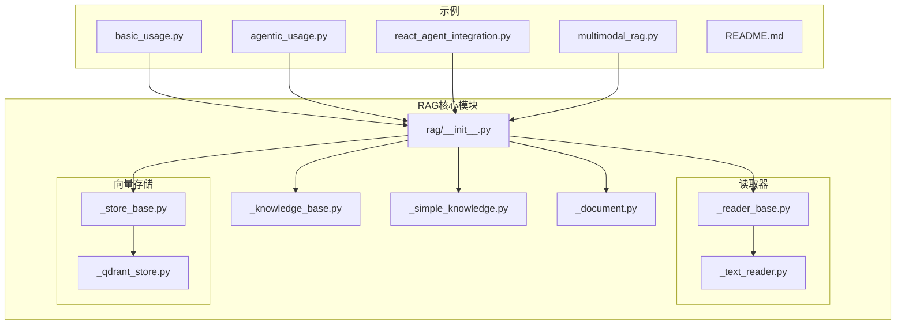
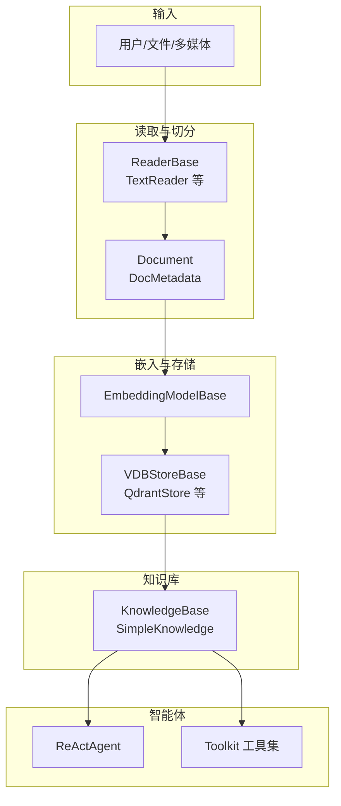
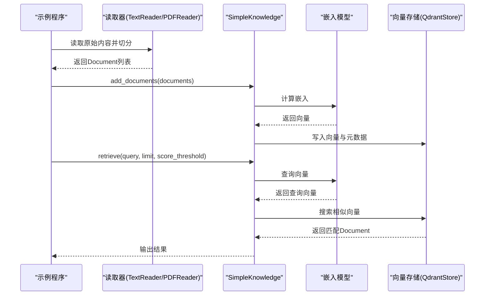
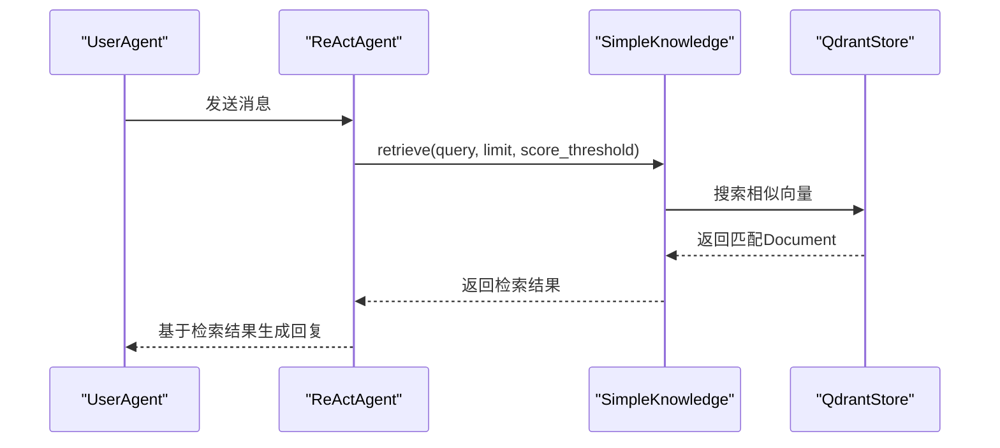
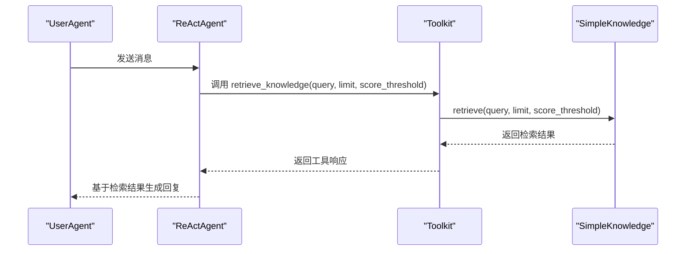
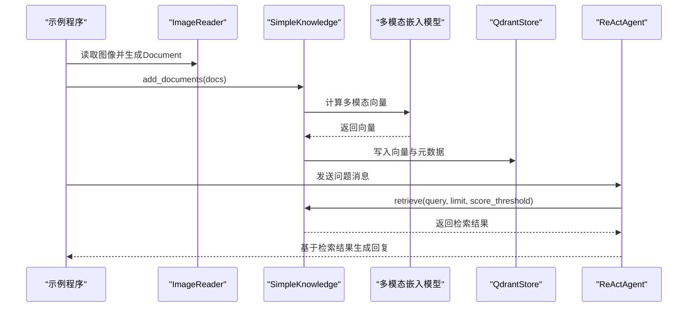
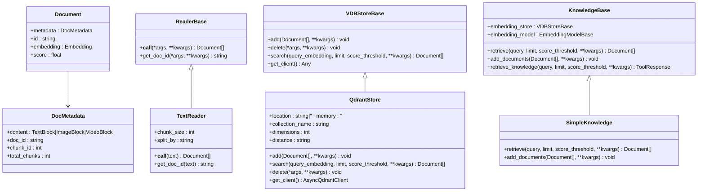
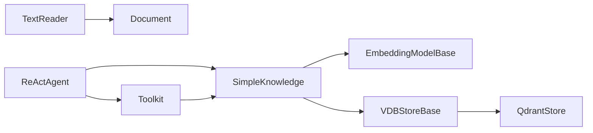

# RAG集成应用

<cite>
**本文引用的文件**
- [README.md](file://examples/functionality/rag/README.md)
- [basic_usage.py](file://examples/functionality/rag/basic_usage.py)
- [agentic_usage.py](file://examples/functionality/rag/agentic_usage.py)
- [react_agent_integration.py](file://examples/functionality/rag/react_agent_integration.py)
- [multimodal_rag.py](file://examples/functionality/rag/multimodal_rag.py)
- [__init__.py](file://src/agentscope/rag/__init__.py)
- [_knowledge_base.py](file://src/agentscope/rag/_knowledge_base.py)
- [_simple_knowledge.py](file://src/agentscope/rag/_simple_knowledge.py)
- [_document.py](file://src/agentscope/rag/_document.py)
- [_reader_base.py](file://src/agentscope/rag/_reader/_reader_base.py)
- [_text_reader.py](file://src/agentscope/rag/_reader/_text_reader.py)
- [_store_base.py](file://src/agentscope/rag/_store/_store_base.py)
- [_qdrant_store.py](file://src/agentscope/rag/_store/_qdrant_store.py)
</cite>

## 目录
1. [简介](#简介)
2. [项目结构](#项目结构)
3. [核心组件](#核心组件)
4. [架构总览](#架构总览)
5. [详细组件分析](#详细组件分析)
6. [依赖关系分析](#依赖关系分析)
7. [性能考虑](#性能考虑)
8. [故障排查指南](#故障排查指南)
9. [结论](#结论)
10. [附录](#附录)

## 简介
本技术文档面向在AgentScope中集成与使用RAG（检索增强生成）的应用场景，覆盖从基础用法到高级集成的完整路径。内容包括：
- 基础使用模式：知识库构建、文档添加、查询检索的端到端流程
- 与React智能体的集成方案：将RAG能力静态或动态地融入智能体推理过程
- 多模态RAG：图文混合检索与多媒体内容理解
- 代理式RAG：通过工具化接口让智能体自主控制检索策略
- 配置参数说明、性能优化建议、效果评估方法、常见问题与调试指南

## 项目结构
RAG相关示例位于examples/functionality/rag目录，核心实现位于src/agentscope/rag子包。下图展示了示例与核心模块的关系。

图表来源
- [README.md](file://examples/functionality/rag/README.md)
- [basic_usage.py](file://examples/functionality/rag/basic_usage.py)
- [agentic_usage.py](file://examples/functionality/rag/agentic_usage.py)
- [react_agent_integration.py](file://examples/functionality/rag/react_agent_integration.py)
- [multimodal_rag.py](file://examples/functionality/rag/multimodal_rag.py)
- [__init__.py](file://src/agentscope/rag/__init__.py)
- [_reader_base.py](file://src/agentscope/rag/_reader/_reader_base.py)
- [_text_reader.py](file://src/agentscope/rag/_reader/_text_reader.py)
- [_store_base.py](file://src/agentscope/rag/_store/_store_base.py)
- [_qdrant_store.py](file://src/agentscope/rag/_store/_qdrant_store.py)

章节来源
- [README.md](file://examples/functionality/rag/README.md)
- [__init__.py](file://src/agentscope/rag/__init__.py)

## 核心组件
- 文档与元数据：用于承载文本/图像/视频等多模态内容及其分块信息
- 读取器：负责将原始内容切分为可嵌入的Document对象
- 向量存储：提供向量数据库的统一抽象与具体实现（如Qdrant）
- 知识库：封装嵌入模型与向量存储，提供检索与入库能力
- 简单知识库：对知识库接口的通用实现，便于快速搭建

章节来源
- [_document.py](file://src/agentscope/rag/_document.py)
- [_reader_base.py](file://src/agentscope/rag/_reader/_reader_base.py)
- [_text_reader.py](file://src/agentscope/rag/_reader/_text_reader.py)
- [_store_base.py](file://src/agentscope/rag/_store/_store_base.py)
- [_qdrant_store.py](file://src/agentscope/rag/_store/_qdrant_store.py)
- [_knowledge_base.py](file://src/agentscope/rag/_knowledge_base.py)
- [_simple_knowledge.py](file://src/agentscope/rag/_simple_knowledge.py)

## 架构总览
下图展示了RAG在AgentScope中的整体架构：读取器将原始内容切分为Document，嵌入模型生成向量，向量存储持久化并支持相似度检索；知识库对外提供统一的检索与入库接口；示例脚本演示了静态集成与动态集成两种方式。

图表来源
- [_reader_base.py](file://src/agentscope/rag/_reader/_reader_base.py)
- [_text_reader.py](file://src/agentscope/rag/_reader/_text_reader.py)
- [_document.py](file://src/agentscope/rag/_document.py)
- [_store_base.py](file://src/agentscope/rag/_store/_store_base.py)
- [_qdrant_store.py](file://src/agentscope/rag/_store/_qdrant_store.py)
- [_knowledge_base.py](file://src/agentscope/rag/_knowledge_base.py)
- [_simple_knowledge.py](file://src/agentscope/rag/_simple_knowledge.py)

## 详细组件分析

### 基础使用模式
- 场景目标：最小成本完成“知识库构建—文档添加—查询检索”的闭环
- 关键步骤
  - 使用读取器（如TextReader、PDFReader）将内容切分为Document
  - 初始化SimpleKnowledge，指定嵌入模型与向量存储（示例中使用QdrantStore与DashScopeTextEmbedding）
  - 将Document列表写入知识库（add_documents），内部自动计算嵌入并入库
  - 通过retrieve(query, limit, score_threshold)执行检索，返回带分数的Document列表
- 示例入口
  - [basic_usage.py](file://examples/functionality/rag/basic_usage.py)

图表来源
- [basic_usage.py](file://examples/functionality/rag/basic_usage.py)
- [_simple_knowledge.py](file://src/agentscope/rag/_simple_knowledge.py)
- [_qdrant_store.py](file://src/agentscope/rag/_store/_qdrant_store.py)

章节来源
- [basic_usage.py](file://examples/functionality/rag/basic_usage.py)
- [_simple_knowledge.py](file://src/agentscope/rag/_simple_knowledge.py)
- [_text_reader.py](file://src/agentscope/rag/_reader/_text_reader.py)
- [_qdrant_store.py](file://src/agentscope/rag/_store/_qdrant_store.py)

### 与React智能体的静态集成
- 方案概述：在ReActAgent初始化时直接注入SimpleKnowledge实例，使对话开始前自动进行检索
- 实现要点
  - 创建知识库（QdrantStore + DashScopeTextEmbedding）
  - 使用TextReader准备文档并入库
  - 在ReActAgent构造函数中传入knowledge参数
  - 运行对话循环，Agent在思考阶段可访问检索到的上下文
- 示例入口
  - [react_agent_integration.py](file://examples/functionality/rag/react_agent_integration.py)

图表来源
- [react_agent_integration.py](file://examples/functionality/rag/react_agent_integration.py)
- [_simple_knowledge.py](file://src/agentscope/rag/_simple_knowledge.py)
- [_qdrant_store.py](file://src/agentscope/rag/_store/_qdrant_store.py)

章节来源
- [react_agent_integration.py](file://examples/functionality/rag/react_agent_integration.py)

### 代理式RAG（动态检索）
- 方案概述：通过Toolkit注册知识库的retrieve_knowledge工具，让智能体在推理过程中自主决定何时检索、如何调整检索参数
- 实现要点
  - 注册retrieve_knowledge工具，并提供清晰的工具描述
  - 在智能体系统提示词中强调调整score_threshold、limit等参数的重要性
  - 通过对话循环触发工具调用，获取检索结果并继续推理
- 示例入口
  - [agentic_usage.py](file://examples/functionality/rag/agentic_usage.py)

图表来源
- [agentic_usage.py](file://examples/functionality/rag/agentic_usage.py)
- [_knowledge_base.py](file://src/agentscope/rag/_knowledge_base.py)
- [_simple_knowledge.py](file://src/agentscope/rag/_simple_knowledge.py)

章节来源
- [agentic_usage.py](file://examples/functionality/rag/agentic_usage.py)
- [_knowledge_base.py](file://src/agentscope/rag/_knowledge_base.py)

### 多模态RAG
- 场景概述：支持图像等非文本内容的嵌入与检索，结合视觉语言模型实现图文问答
- 实现要点
  - 使用ImageReader读取图像并生成Document
  - 选择多模态嵌入模型（如DashScopeMultiModalEmbedding）与对应维度
  - 以ReActAgent作为对话载体，结合检索结果回答问题
  - 可通过Agent的记忆模块查看检索到的文档内容
- 示例入口
  - [multimodal_rag.py](file://examples/functionality/rag/multimodal_rag.py)

图表来源
- [multimodal_rag.py](file://examples/functionality/rag/multimodal_rag.py)
- [_simple_knowledge.py](file://src/agentscope/rag/_simple_knowledge.py)
- [_qdrant_store.py](file://src/agentscope/rag/_store/_qdrant_store.py)

章节来源
- [multimodal_rag.py](file://examples/functionality/rag/multimodal_rag.py)

### 数据结构与类关系
- Document与DocMetadata：承载内容、分块编号、向量与相似度分数
- ReaderBase与TextReader：定义读取接口与文本切分逻辑
- VDBStoreBase与QdrantStore：定义向量存储接口与Qdrant实现
- KnowledgeBase与SimpleKnowledge：定义检索/入库接口与通用实现

图表来源
- [_document.py](file://src/agentscope/rag/_document.py)
- [_reader_base.py](file://src/agentscope/rag/_reader/_reader_base.py)
- [_text_reader.py](file://src/agentscope/rag/_reader/_text_reader.py)
- [_store_base.py](file://src/agentscope/rag/_store/_store_base.py)
- [_qdrant_store.py](file://src/agentscope/rag/_store/_qdrant_store.py)
- [_knowledge_base.py](file://src/agentscope/rag/_knowledge_base.py)
- [_simple_knowledge.py](file://src/agentscope/rag/_simple_knowledge.py)

## 依赖关系分析
- 组件耦合
  - SimpleKnowledge依赖EmbeddingModelBase与VDBStoreBase，体现“知识库”对“嵌入模型+向量存储”的组合依赖
  - ReaderBase与具体读取器（如TextReader）解耦，便于扩展PDF/Word/图像等读取器
  - ReActAgent与知识库通过注入或工具集两种方式耦合，静态集成耦合度更高，动态集成更灵活
- 外部依赖
  - QdrantStore依赖qdrant_client异步客户端
  - TextReader在按句子切分时依赖nltk
- 潜在环路
  - 当前模块间无明显循环导入；知识库仅向下依赖嵌入与存储，未反向依赖智能体

图表来源
- [_simple_knowledge.py](file://src/agentscope/rag/_simple_knowledge.py)
- [_store_base.py](file://src/agentscope/rag/_store/_store_base.py)
- [_qdrant_store.py](file://src/agentscope/rag/_store/_qdrant_store.py)
- [_reader_base.py](file://src/agentscope/rag/_reader/_reader_base.py)
- [_text_reader.py](file://src/agentscope/rag/_reader/_text_reader.py)

章节来源
- [_simple_knowledge.py](file://src/agentscope/rag/_simple_knowledge.py)
- [_store_base.py](file://src/agentscope/rag/_store/_store_base.py)
- [_qdrant_store.py](file://src/agentscope/rag/_store/_qdrant_store.py)
- [_reader_base.py](file://src/agentscope/rag/_reader/_reader_base.py)
- [_text_reader.py](file://src/agentscope/rag/_reader/_text_reader.py)

## 性能考虑
- 嵌入维度与距离度量
  - 选择合适的维度与距离度量（如Cosine）以提升检索质量
- 分块策略
  - 文本切分采用字符/句子/段落三种粒度，需根据语种与任务权衡召回与精度
- 检索参数
  - limit与score_threshold直接影响召回数量与相关性，应结合业务阈值动态调整
- 存储与并发
  - Qdrant支持内存与远程部署，远程实例需关注网络延迟与连接池配置
- 缓存与预热
  - 对高频查询可引入缓存层减少重复嵌入与检索开销
- 多模态嵌入
  - 图像/文本多模态嵌入成本较高，建议批量处理与异步并发

## 故障排查指南
- 缺少外部依赖
  - Qdrant客户端未安装：参考QdrantStore初始化报错提示进行安装
  - nltk未安装：TextReader按句子切分时报错，需安装nltk并下载punkt数据
- 模态不匹配
  - 向量存储要求的内容类型与嵌入模型支持的模态不一致，会抛出异常；请确认内容类型与模型支持范围
- 检索结果为空
  - 调整score_threshold或增加limit；检查知识库是否已正确入库；确认查询语句是否足够具体
- 集成问题
  - 静态集成：确认ReActAgent构造时传入knowledge参数
  - 动态集成：确保Toolkit已注册retrieve_knowledge工具并提供清晰描述

章节来源
- [_qdrant_store.py](file://src/agentscope/rag/_store/_qdrant_store.py)
- [_text_reader.py](file://src/agentscope/rag/_reader/_text_reader.py)
- [_simple_knowledge.py](file://src/agentscope/rag/_simple_knowledge.py)
- [react_agent_integration.py](file://examples/functionality/rag/react_agent_integration.py)
- [agentic_usage.py](file://examples/functionality/rag/agentic_usage.py)

## 结论
AgentScope提供了从基础到高级的RAG集成路径：以SimpleKnowledge为核心，结合多模态嵌入与向量存储，既可实现静态的ReActAgent集成，也可通过工具化接口实现动态的代理式RAG。通过合理的分块策略、检索参数与存储配置，可在不同场景下取得稳定且高效的检索增强效果。

## 附录
- 快速运行示例
  - 基础用法：参考 [basic_usage.py](file://examples/functionality/rag/basic_usage.py)
  - 代理式RAG：参考 [agentic_usage.py](file://examples/functionality/rag/agentic_usage.py)
  - ReAct静态集成：参考 [react_agent_integration.py](file://examples/functionality/rag/react_agent_integration.py)
  - 多模态RAG：参考 [multimodal_rag.py](file://examples/functionality/rag/multimodal_rag.py)
- 模块导出清单
  - 参考 [__init__.py](file://src/agentscope/rag/__init__.py)