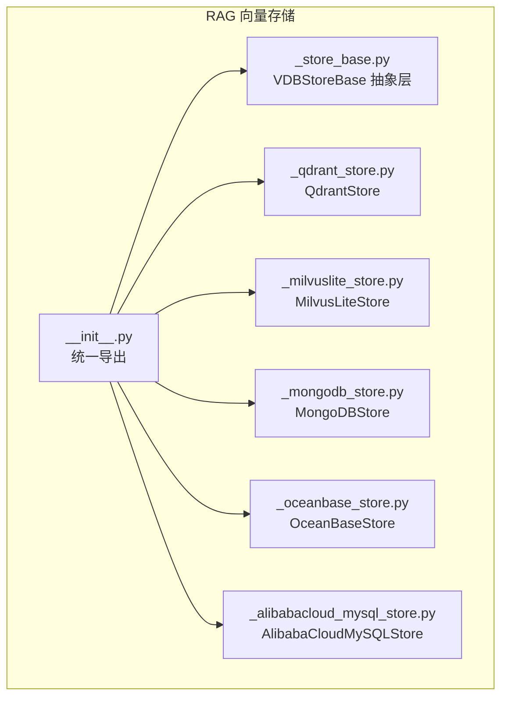
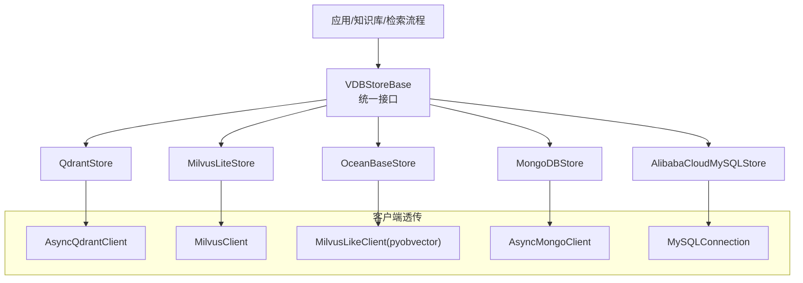
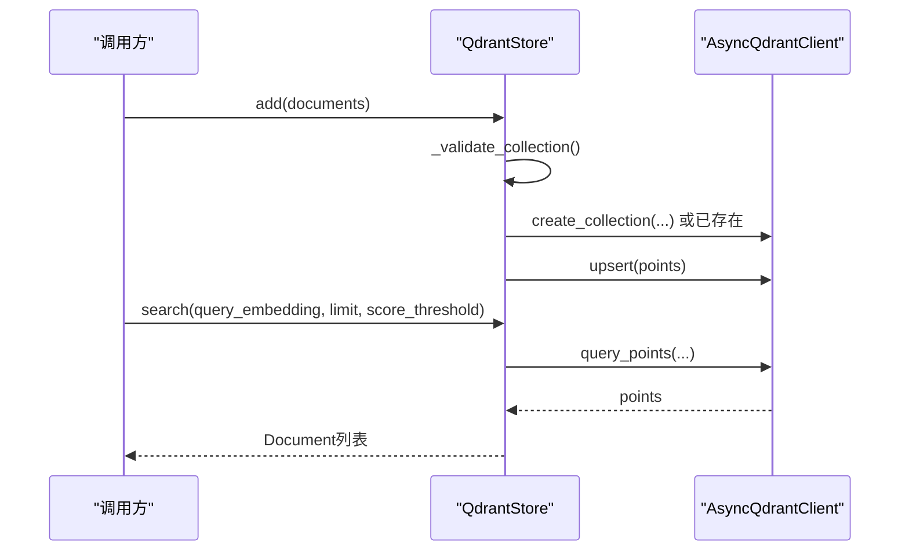
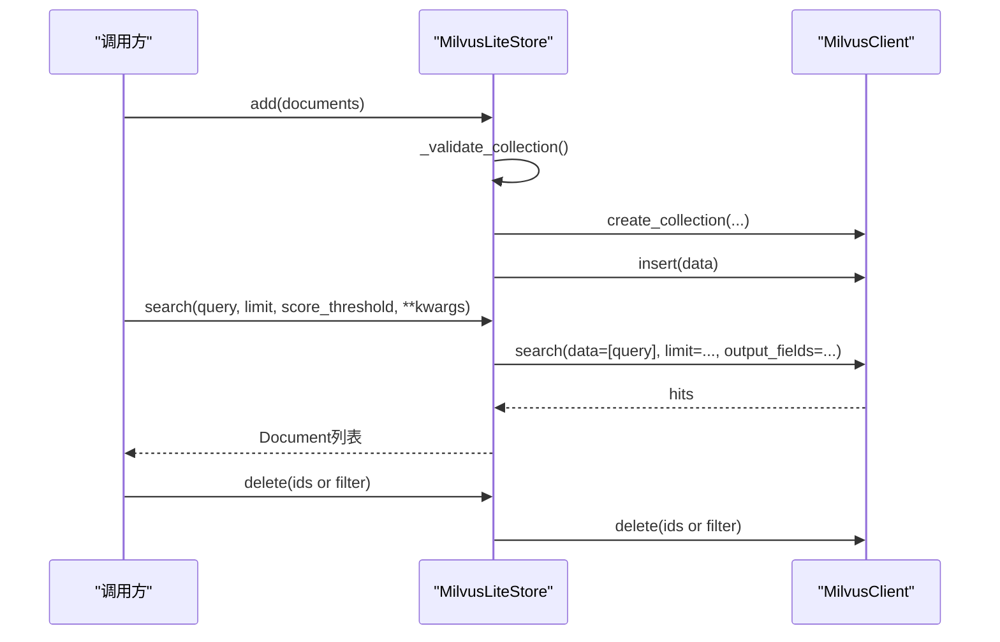
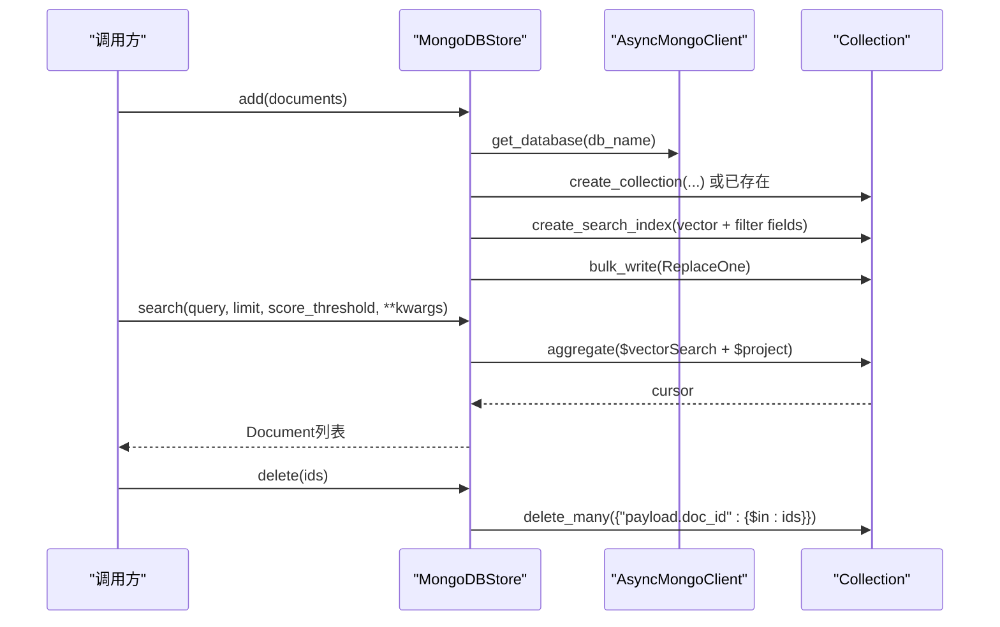
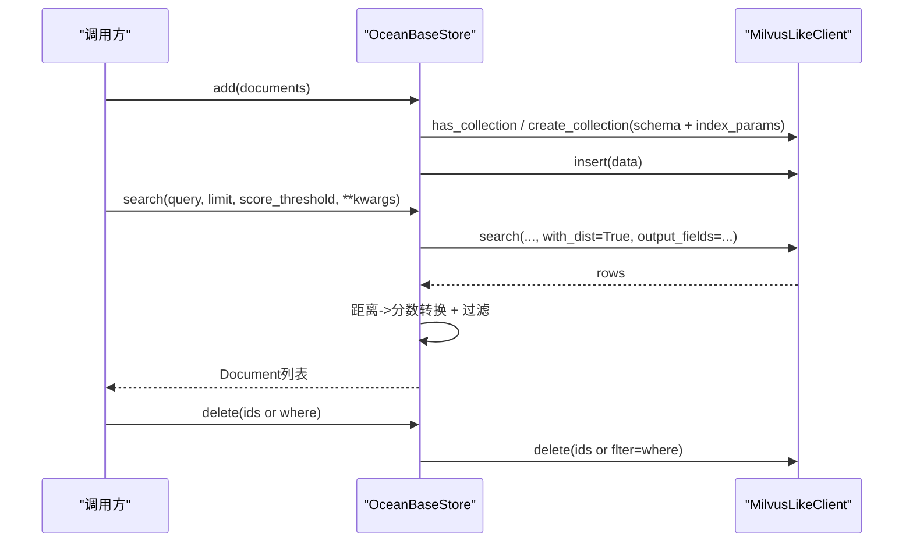
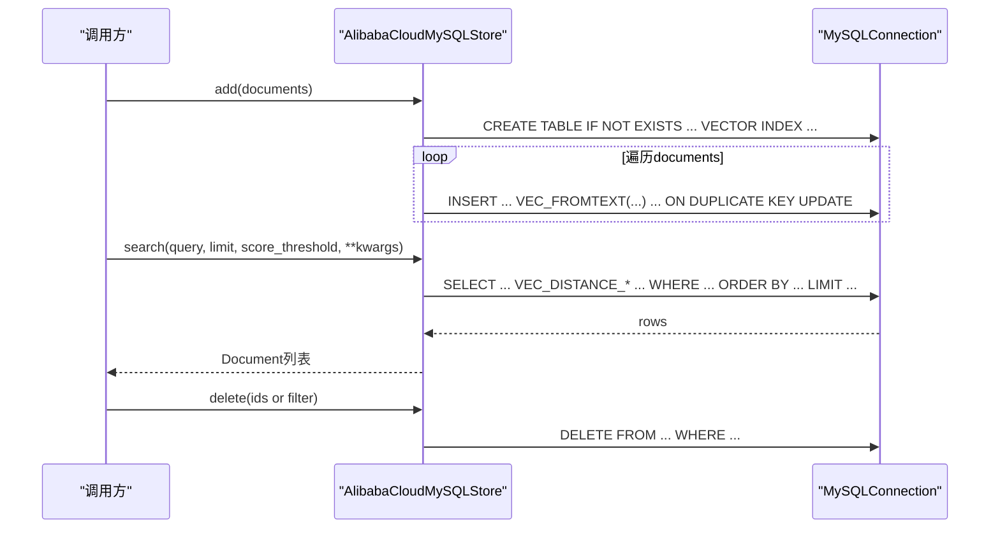

# 向量存储

<cite>
**本文引用的文件**
- [src/agentscope/rag/_store/__init__.py](file://src/agentscope/rag/_store/__init__.py)
- [src/agentscope/rag/_store/_store_base.py](file://src/agentscope/rag/_store/_store_base.py)
- [src/agentscope/rag/_store/_qdrant_store.py](file://src/agentscope/rag/_store/_qdrant_store.py)
- [src/agentscope/rag/_store/_milvuslite_store.py](file://src/agentscope/rag/_store/_milvuslite_store.py)
- [src/agentscope/rag/_store/_mongodb_store.py](file://src/agentscope/rag/_store/_mongodb_store.py)
- [src/agentscope/rag/_store/_oceanbase_store.py](file://src/agentscope/rag/_store/_oceanbase_store.py)
- [src/agentscope/rag/_store/_alibabacloud_mysql_store.py](file://src/agentscope/rag/_store/_alibabacloud_mysql_store.py)
- [examples/functionality/vector_store/mongodb/main.py](file://examples/functionality/vector_store/mongodb/main.py)
- [examples/functionality/vector_store/oceanbase/main.py](file://examples/functionality/vector_store/oceanbase/main.py)
- [examples/functionality/vector_store/alibabacloud_mysql_vector/main.py](file://examples/functionality/vector_store/alibabacloud_mysql_vector/main.py)
- [examples/functionality/vector_store/milvus_lite/main.py](file://examples/functionality/vector_store/milvus_lite/main.py)
</cite>

## 目录
1. [简介](#简介)
2. [项目结构](#项目结构)
3. [核心组件](#核心组件)
4. [架构总览](#架构总览)
5. [详细组件分析](#详细组件分析)
6. [依赖分析](#依赖分析)
7. [性能考虑](#性能考虑)
8. [故障排除指南](#故障排除指南)
9. [结论](#结论)
10. [附录](#附录)

## 简介
本文件面向AgentScope的向量数据库（VDB）存储子系统，系统性梳理VDBStoreBase抽象层的设计理念与统一接口规范，并对各后端实现（Qdrant云原生、Milvus Lite、MongoDB、OceanBase、阿里云MySQL）进行深入解析。内容涵盖索引策略、相似度计算、批量写入、删除与过滤、客户端透传、事务特性说明、最佳实践（连接参数、性能调优、容量规划、备份恢复）、部署与监控、故障排除与迁移建议。

## 项目结构
向量存储位于RAG模块的_store目录下，通过统一入口导出抽象基类与具体实现，便于在知识库与检索流程中按需切换后端。

图表来源
- [src/agentscope/rag/_store/__init__.py:1-21](file://src/agentscope/rag/_store/__init__.py#L1-L21)
- [src/agentscope/rag/_store/_store_base.py:1-50](file://src/agentscope/rag/_store/_store_base.py#L1-L50)
- [src/agentscope/rag/_store/_qdrant_store.py:1-174](file://src/agentscope/rag/_store/_qdrant_store.py#L1-L174)
- [src/agentscope/rag/_store/_milvuslite_store.py:1-258](file://src/agentscope/rag/_store/_milvuslite_store.py#L1-L258)
- [src/agentscope/rag/_store/_mongodb_store.py:1-393](file://src/agentscope/rag/_store/_mongodb_store.py#L1-L393)
- [src/agentscope/rag/_store/_oceanbase_store.py:1-553](file://src/agentscope/rag/_store/_oceanbase_store.py#L1-L553)
- [src/agentscope/rag/_store/_alibabacloud_mysql_store.py:1-403](file://src/agentscope/rag/_store/_alibabacloud_mysql_store.py#L1-L403)

章节来源
- [src/agentscope/rag/_store/__init__.py:1-21](file://src/agentscope/rag/_store/__init__.py#L1-L21)

## 核心组件
- VDBStoreBase：定义异步的add、delete、search三大核心接口，以及可选的get_client方法用于透传底层客户端能力。该抽象屏蔽了不同后端的差异，统一上层调用体验。
- 具体实现：
  - QdrantStore：支持本地内存或远程实例；集合不存在时自动创建；使用payload存储元数据；不支持通用删除接口。
  - MilvusLiteStore：支持本地SQLite式文件或远程服务；集合不存在时自动创建；使用标量字段存储元数据；支持基于filter表达式的删除。
  - MongoDBStore：自动创建数据库/集合/向量搜索索引；支持$vectorSearch聚合；支持过滤字段；提供删除与集合/数据库级清理。
  - OceanBaseStore：兼容Milvus风格客户端；HNSW索引；支持COSINE/L2/IP；距离到相似度转换；支持过滤条件。
  - AlibabaCloudMySQLStore：基于MySQL 8.0+原生向量函数与HNSW索引；支持COSINE/EUCLIDEAN；提供SQL层面的过滤与阈值控制。

章节来源
- [src/agentscope/rag/_store/_store_base.py:10-50](file://src/agentscope/rag/_store/_store_base.py#L10-L50)
- [src/agentscope/rag/_store/_qdrant_store.py:18-174](file://src/agentscope/rag/_store/_qdrant_store.py#L18-L174)
- [src/agentscope/rag/_store/_milvuslite_store.py:19-258](file://src/agentscope/rag/_store/_milvuslite_store.py#L19-L258)
- [src/agentscope/rag/_store/_mongodb_store.py:24-393](file://src/agentscope/rag/_store/_mongodb_store.py#L24-L393)
- [src/agentscope/rag/_store/_oceanbase_store.py:38-553](file://src/agentscope/rag/_store/_oceanbase_store.py#L38-L553)
- [src/agentscope/rag/_store/_alibabacloud_mysql_store.py:19-403](file://src/agentscope/rag/_store/_alibabacloud_mysql_store.py#L19-L403)

## 架构总览
下图展示从应用到各后端的调用关系与职责边界：上层通过VDBStoreBase统一接口发起写入、检索与删除；具体实现负责与各自客户端交互并完成索引管理、过滤与阈值处理。

图表来源
- [src/agentscope/rag/_store/_store_base.py:10-50](file://src/agentscope/rag/_store/_store_base.py#L10-L50)
- [src/agentscope/rag/_store/_qdrant_store.py:18-174](file://src/agentscope/rag/_store/_qdrant_store.py#L18-L174)
- [src/agentscope/rag/_store/_milvuslite_store.py:19-258](file://src/agentscope/rag/_store/_milvuslite_store.py#L19-L258)
- [src/agentscope/rag/_store/_mongodb_store.py:24-393](file://src/agentscope/rag/_store/_mongodb_store.py#L24-L393)
- [src/agentscope/rag/_store/_oceanbase_store.py:38-553](file://src/agentscope/rag/_store/_oceanbase_store.py#L38-L553)
- [src/agentscope/rag/_store/_alibabacloud_mysql_store.py:19-403](file://src/agentscope/rag/_store/_alibabacloud_mysql_store.py#L19-L403)

## 详细组件分析

### VDBStoreBase 抽象层
- 设计要点
  - 统一异步接口：add、delete、search，确保上层一致的调用方式。
  - 可选get_client：允许直接访问底层客户端以获取更丰富的功能。
  - 文档模型：输入输出均围绕Document与DocMetadata，保证元信息与向量的完整传递。
- 错误处理
  - get_client默认未实现，调用会抛出异常，提示使用具体后端的get_client。

章节来源
- [src/agentscope/rag/_store/_store_base.py:10-50](file://src/agentscope/rag/_store/_store_base.py#L10-L50)

### QdrantStore 实现
- 连接与初始化
  - 支持内存模式与远程地址；集合不存在时自动创建，向量维度与距离类型在创建时声明。
- 写入与检索
  - 批量upsert；检索使用query_points，支持score_threshold；返回Document对象。
- 删除
  - 当前未实现通用删除接口，调用将抛出NotImplementedError。
- 客户端透传
  - 返回AsyncQdrantClient，便于高级操作。

图表来源
- [src/agentscope/rag/_store/_qdrant_store.py:74-157](file://src/agentscope/rag/_store/_qdrant_store.py#L74-L157)

章节来源
- [src/agentscope/rag/_store/_qdrant_store.py:18-174](file://src/agentscope/rag/_store/_qdrant_store.py#L18-L174)

### MilvusLiteStore 实现
- 连接与初始化
  - 支持本地文件路径或远程URI；集合不存在时自动创建；支持自定义metric_type。
- 写入
  - 自动生成唯一整型ID（或字符串ID），批量insert；元数据作为标量字段返回。
- 检索
  - 默认返回实体字段（doc_id/chunk_id/content/total_chunks），支持score_threshold；距离越小越相似。
- 删除
  - 支持ids或filter表达式删除；必须二选一。
- 客户端透传
  - 返回MilvusClient。

图表来源
- [src/agentscope/rag/_store/_milvuslite_store.py:86-247](file://src/agentscope/rag/_store/_milvuslite_store.py#L86-L247)

章节来源
- [src/agentscope/rag/_store/_milvuslite_store.py:19-258](file://src/agentscope/rag/_store/_milvuslite_store.py#L19-L258)

### MongoDBStore 实现
- 连接与初始化
  - 自动创建数据库/集合/向量搜索索引；支持cosine/euclidean/dotProduct；可配置filter_fields。
- 写入
  - 使用ReplaceOne批量去重插入；记录id为doc_id_chunk_id拼接。
- 检索
  - 使用$vectorSearch聚合；自动等待索引就绪；支持num_candidates与score_threshold；返回向量与payload。
- 删除
  - 支持按doc_id批量删除；提供集合/数据库删除与连接关闭。
- 客户端透传
  - 返回AsyncMongoClient。

图表来源
- [src/agentscope/rag/_store/_mongodb_store.py:109-392](file://src/agentscope/rag/_store/_mongodb_store.py#L109-L392)

章节来源
- [src/agentscope/rag/_store/_mongodb_store.py:24-393](file://src/agentscope/rag/_store/_mongodb_store.py#L24-L393)

### OceanBaseStore 实现
- 连接与初始化
  - 基于pyobvector的MilvusLikeClient；集合不存在时自动创建；HNSW索引；支持COSINE/L2/IP。
- 写入
  - 生成VARCHAR主键；向量字段为FLOAT_VECTOR；JSON存储content；批量insert。
- 检索
  - 输出字段可定制；距离到相似度转换（COSINE使用1-distance）；支持flter条件。
- 删除
  - 不支持where_document；至少提供ids或where之一。
- 客户端透传
  - 返回MilvusLikeClient。

图表来源
- [src/agentscope/rag/_store/_oceanbase_store.py:130-542](file://src/agentscope/rag/_store/_oceanbase_store.py#L130-L542)

章节来源
- [src/agentscope/rag/_store/_oceanbase_store.py:38-553](file://src/agentscope/rag/_store/_oceanbase_store.py#L38-L553)

### AlibabaCloudMySQLStore 实现
- 连接与初始化
  - 基于mysql-connector-python；表不存在则创建，含VECTOR列与VECTOR INDEX（HNSW）；支持COSINE/EUCLIDEAN。
- 写入
  - 使用VEC_FROMTEXT转换文本向量；ON DUPLICATE KEY UPDATE更新；支持JSON序列化content。
- 检索
  - 使用VEC_DISTANCE_*函数与ORDER BY排序；支持WHERE过滤与score_threshold（转换为距离阈值）。
- 删除
  - 支持ids或filter表达式删除。
- 客户端透传
  - 返回MySQLConnection。

图表来源
- [src/agentscope/rag/_store/_alibabacloud_mysql_store.py:141-378](file://src/agentscope/rag/_store/_alibabacloud_mysql_store.py#L141-L378)

章节来源
- [src/agentscope/rag/_store/_alibabacloud_mysql_store.py:19-403](file://src/agentscope/rag/_store/_alibabacloud_mysql_store.py#L19-L403)

## 依赖分析
- 组件内聚与耦合
  - VDBStoreBase高度内聚于接口契约，与具体实现低耦合，便于替换与扩展。
  - 各后端均通过get_client暴露底层客户端，满足高级运维与调试需求。
- 外部依赖
  - Qdrant：qdrant-client
  - Milvus Lite：pymilvus
  - MongoDB：pymongo
  - OceanBase：pyobvector
  - MySQL：mysql-connector-python

章节来源
- [src/agentscope/rag/_store/_qdrant_store.py:58-64](file://src/agentscope/rag/_store/_qdrant_store.py#L58-L64)
- [src/agentscope/rag/_store/_milvuslite_store.py:64-70](file://src/agentscope/rag/_store/_milvuslite_store.py#L64-L70)
- [src/agentscope/rag/_store/_mongodb_store.py:85-91](file://src/agentscope/rag/_store/_mongodb_store.py#L85-L91)
- [src/agentscope/rag/_store/_oceanbase_store.py:90-96](file://src/agentscope/rag/_store/_oceanbase_store.py#L90-L96)
- [src/agentscope/rag/_store/_alibabacloud_mysql_store.py:83-89](file://src/agentscope/rag/_store/_alibabacloud_mysql_store.py#L83-L89)

## 性能考虑
- 索引与距离度量
  - Qdrant/Milvus/OceanBase：HNSW索引；距离类型影响相似度语义与性能权衡。
  - MongoDB：vectorSearch索引；num_candidates影响召回与吞吐。
  - MySQL：HNSW VECTOR INDEX；COSINE/EUCLIDEAN直接影响距离函数选择。
- 批量写入
  - MongoDB使用bulk_write；Milvus/Qdrant/MySQL均支持批量插入；OceanBase支持批量insert。
- 过滤与阈值
  - 各后端均支持score_threshold或等价阈值；合理设置可减少下游处理开销。
- 并发与I/O
  - 异步接口统一采用async/await；MongoDB与Milvus支持输出字段裁剪，降低网络与反序列化成本。

[本节为通用指导，无需列出具体文件来源]

## 故障排除指南
- 未安装依赖
  - 各后端均有明确的ImportError提示，按提示安装对应包。
- 索引未就绪（MongoDB）
  - 搜索前会等待索引可查询状态；若超时，检查集群状态与权限。
- 删除接口限制
  - QdrantStore：当前不支持通用删除，需使用具体后端能力或迁移至支持删除的后端。
  - Milvus/OceanBase/MySQL：删除需提供ids或filter表达式。
- 距离与相似度
  - OceanBase对COSINE执行距离到相似度转换；MySQL/Cosine检索结果需注意score含义。
- 连接参数
  - MongoDB：host、db_name、collection_name、index_name、distance、filter_fields。
  - Milvus：uri、collection_name、dimensions、distance、token、client_kwargs。
  - OceanBase：uri、user、password、db_name、collection_name、dimensions、distance。
  - MySQL：host、port、user、password、database、table_name、dimensions、distance、hnsw_m。
  - Qdrant：location、collection_name、dimensions、distance、client_kwargs、collection_kwargs。

章节来源
- [src/agentscope/rag/_store/_qdrant_store.py:60-64](file://src/agentscope/rag/_store/_qdrant_store.py#L60-L64)
- [src/agentscope/rag/_store/_milvuslite_store.py:237-247](file://src/agentscope/rag/_store/_milvuslite_store.py#L237-L247)
- [src/agentscope/rag/_store/_mongodb_store.py:164-191](file://src/agentscope/rag/_store/_mongodb_store.py#L164-L191)
- [src/agentscope/rag/_store/_oceanbase_store.py:526-534](file://src/agentscope/rag/_store/_oceanbase_store.py#L526-L534)
- [src/agentscope/rag/_store/_alibabacloud_mysql_store.py:83-89](file://src/agentscope/rag/_store/_alibabacloud_mysql_store.py#L83-L89)

## 结论
AgentScope的向量存储体系通过VDBStoreBase抽象实现了“统一接口、多后端适配”的设计目标。各后端在索引策略、相似度计算、过滤与阈值、批量操作等方面各有侧重，能够覆盖从开发测试到生产环境的不同需求。结合本文提供的最佳实践、部署与监控建议，可帮助用户在不同业务场景下做出合适的选择与优化。

[本节为总结性内容，无需列出具体文件来源]

## 附录

### 存储配置与最佳实践
- 连接参数
  - MongoDB：host、db_name、collection_name、index_name、dimensions、distance、filter_fields、client_kwargs、db_kwargs、collection_kwargs。
  - Milvus：uri、collection_name、dimensions、distance、token、client_kwargs、collection_kwargs。
  - OceanBase：collection_name、dimensions、uri、user、password、db_name、distance、client_kwargs、collection_kwargs。
  - MySQL：host、port、user、password、database、table_name、dimensions、distance、hnsw_m、connection_kwargs。
  - Qdrant：location、collection_name、dimensions、distance、client_kwargs、collection_kwargs。
- 性能调优
  - 索引参数：HNSW的M参数、候选数num_candidates、输出字段裁剪。
  - 距离度量：根据语料特征选择COSINE/L2/IP。
  - 批量写入：尽量合并请求，减少往返。
- 容量规划
  - 评估向量维度、条目数量、索引大小与内存占用。
- 备份与恢复
  - MongoDB：副本集/分片与备份策略；Milvus：快照/备份；OceanBase：集群备份；MySQL：逻辑/物理备份；Qdrant：持久化卷或远程实例备份。
- 监控指标
  - 查询延迟、吞吐、索引命中率、资源占用（CPU/内存/磁盘/网络）。
- 迁移方案
  - 通过统一接口逐步迁移：先读写双写，校验一致性，再切换流量，最后清理旧后端。

[本节为通用指导，无需列出具体文件来源]

### 示例参考
- MongoDBStore：基础CRUD、过滤检索、多分片文档、不同距离度量。
- OceanBaseStore：基础CRUD、过滤检索、多分片文档、不同距离度量。
- AlibabaCloudMySQLStore：基础CRUD、过滤检索、不同距离度量。
- MilvusLiteStore：基础CRUD、过滤检索、多分片文档、不同距离度量。

章节来源
- [examples/functionality/vector_store/mongodb/main.py:14-351](file://examples/functionality/vector_store/mongodb/main.py#L14-L351)
- [examples/functionality/vector_store/oceanbase/main.py:30-350](file://examples/functionality/vector_store/oceanbase/main.py#L30-L350)
- [examples/functionality/vector_store/alibabacloud_mysql_vector/main.py:12-282](file://examples/functionality/vector_store/alibabacloud_mysql_vector/main.py#L12-L282)
- [examples/functionality/vector_store/milvus_lite/main.py:12-327](file://examples/functionality/vector_store/milvus_lite/main.py#L12-L327)