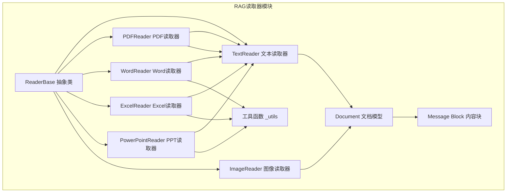
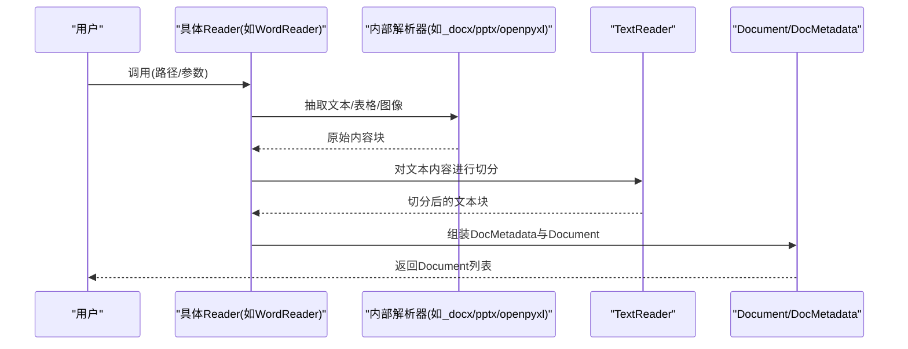
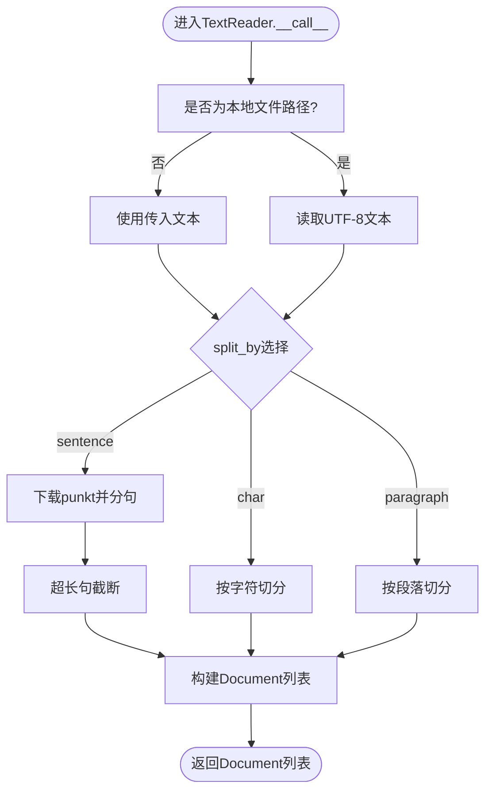
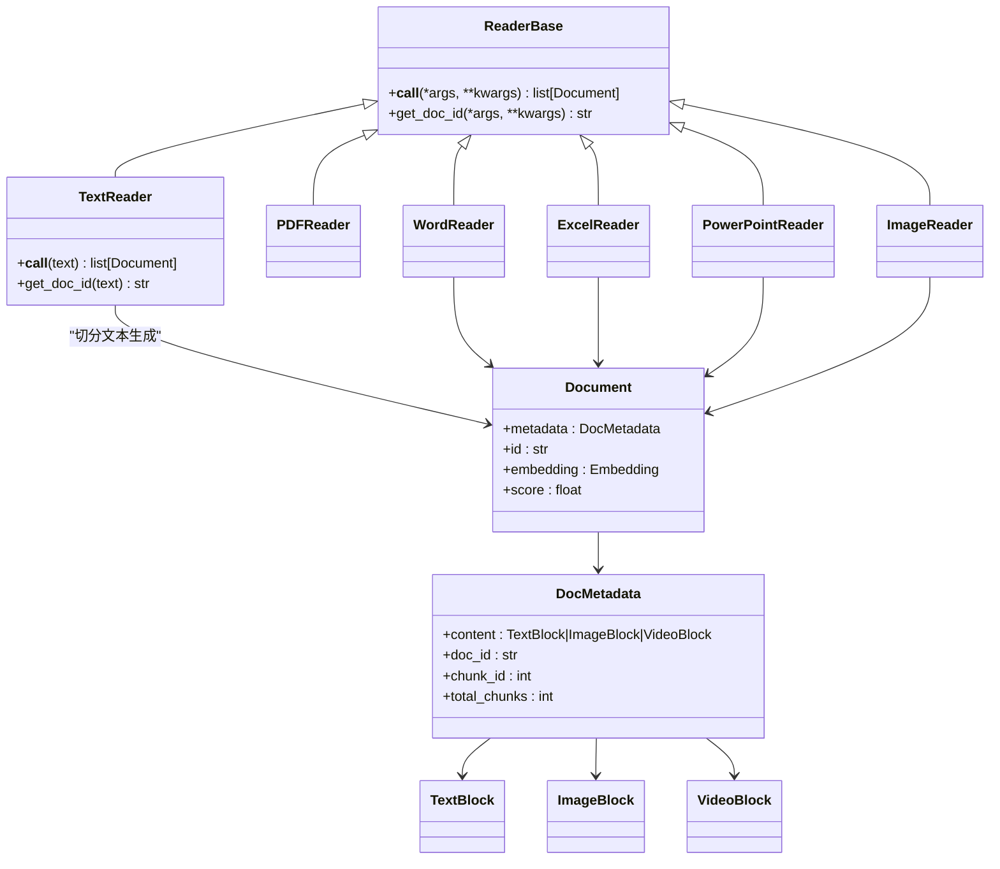

# 文档读取器

<cite>
**本文引用的文件列表**
- [src/agentscope/rag/_reader/_reader_base.py](file://src/agentscope/rag/_reader/_reader_base.py)
- [src/agentscope/rag/_reader/_text_reader.py](file://src/agentscope/rag/_reader/_text_reader.py)
- [src/agentscope/rag/_reader/_pdf_reader.py](file://src/agentscope/rag/_reader/_pdf_reader.py)
- [src/agentscope/rag/_reader/_word_reader.py](file://src/agentscope/rag/_reader/_word_reader.py)
- [src/agentscope/rag/_reader/_excel_reader.py](file://src/agentscope/rag/_reader/_excel_reader.py)
- [src/agentscope/rag/_reader/_ppt_reader.py](file://src/agentscope/rag/_reader/_ppt_reader.py)
- [src/agentscope/rag/_reader/_image_reader.py](file://src/agentscope/rag/_reader/_image_reader.py)
- [src/agentscope/rag/_reader/_utils.py](file://src/agentscope/rag/_reader/_utils.py)
- [src/agentscope/rag/_reader/__init__.py](file://src/agentscope/rag/_reader/__init__.py)
- [src/agentscope/rag/_document.py](file://src/agentscope/rag/_document.py)
- [src/agentscope/message/_message_block.py](file://src/agentscope/message/_message_block.py)
- [tests/rag_reader_test.py](file://tests/rag_reader_test.py)
</cite>

## 目录
1. [简介](#简介)
2. [项目结构](#项目结构)
3. [核心组件](#核心组件)
4. [架构总览](#架构总览)
5. [详细组件分析](#详细组件分析)
6. [依赖关系分析](#依赖关系分析)
7. [性能考量](#性能考量)
8. [故障排查指南](#故障排查指南)
9. [结论](#结论)
10. [附录：使用示例与最佳实践](#附录使用示例与最佳实践)

## 简介
本文件面向AgentScope的文档读取器系统，系统性梳理ReaderBase抽象类的设计与扩展机制，并深入解析各类文档读取器（PDF、Word、Excel、PPT、图像、纯文本）的实现原理与统一的Document对象结构。重点覆盖：
- 文本提取策略：按字符、句子、段落切分
- 多媒体内容：图像OCR（概念性说明）、元数据提取
- 结构化数据：表格抽取、坐标标注、Markdown/JSON格式
- 多工作表/多幻灯片：顺序合并与独立拆分
- 统一的Document与DocumentBlock设计
- 配置选项、性能优化、错误处理策略与使用示例

## 项目结构
读取器模块位于RAG子系统中，采用“抽象基类 + 具体实现”的分层设计，便于扩展新的文件类型与处理策略。

图表来源
- [src/agentscope/rag/_reader/_reader_base.py:9-28](file://src/agentscope/rag/_reader/_reader_base.py#L9-L28)
- [src/agentscope/rag/_reader/_text_reader.py:13-149](file://src/agentscope/rag/_reader/_text_reader.py#L13-L149)
- [src/agentscope/rag/_reader/_pdf_reader.py:11-87](file://src/agentscope/rag/_reader/_pdf_reader.py#L11-L87)
- [src/agentscope/rag/_reader/_word_reader.py:209-457](file://src/agentscope/rag/_reader/_word_reader.py#L209-L457)
- [src/agentscope/rag/_reader/_excel_reader.py:120-674](file://src/agentscope/rag/_reader/_excel_reader.py#L120-L674)
- [src/agentscope/rag/_reader/_ppt_reader.py:92-633](file://src/agentscope/rag/_reader/_ppt_reader.py#L92-L633)
- [src/agentscope/rag/_reader/_image_reader.py:10-68](file://src/agentscope/rag/_reader/_image_reader.py#L10-L68)
- [src/agentscope/rag/_reader/_utils.py:6-95](file://src/agentscope/rag/_reader/_utils.py#L6-L95)
- [src/agentscope/rag/_document.py:17-52](file://src/agentscope/rag/_document.py#L17-L52)
- [src/agentscope/message/_message_block.py:9-129](file://src/agentscope/message/_message_block.py#L9-L129)

章节来源
- [src/agentscope/rag/_reader/__init__.py:1-22](file://src/agentscope/rag/_reader/__init__.py#L1-L22)

## 核心组件
- ReaderBase：定义异步调用接口与文档ID生成规范，所有具体读取器均继承该基类。
- TextReader：通用文本切分器，支持按字符、句子、段落三种粒度，内置nltk英文分句能力。
- Document/DocMetadata：统一的文档块结构，承载内容块、文档ID、分块ID与总数等信息。
- Message Block：TextBlock、ImageBlock、VideoBlock等TypedDict定义，作为DocMetadata.content的数据载体。

章节来源
- [src/agentscope/rag/_reader/_reader_base.py:9-28](file://src/agentscope/rag/_reader/_reader_base.py#L9-L28)
- [src/agentscope/rag/_document.py:17-52](file://src/agentscope/rag/_document.py#L17-L52)
- [src/agentscope/message/_message_block.py:9-129](file://src/agentscope/message/_message_block.py#L9-L129)

## 架构总览
读取器遵循“先抽取内容块，再统一切分为Document”的流程。非文本读取器通过各自解析器提取文本、表格、图像等，最终交由TextReader进行切分，形成统一的Document序列。

图表来源
- [src/agentscope/rag/_reader/_word_reader.py:280-336](file://src/agentscope/rag/_reader/_word_reader.py#L280-L336)
- [src/agentscope/rag/_reader/_excel_reader.py:499-547](file://src/agentscope/rag/_reader/_excel_reader.py#L499-L547)
- [src/agentscope/rag/_reader/_ppt_reader.py:566-620](file://src/agentscope/rag/_reader/_ppt_reader.py#L566-L620)
- [src/agentscope/rag/_reader/_text_reader.py:47-144](file://src/agentscope/rag/_reader/_text_reader.py#L47-L144)

## 详细组件分析

### ReaderBase 抽象类
- 角色：定义统一的异步调用协议与文档ID生成接口，确保各读取器行为一致。
- 关键点：
  - 异步调用签名：返回Document列表
  - 文档ID生成：get_doc_id用于知识库去重与缓存

章节来源
- [src/agentscope/rag/_reader/_reader_base.py:9-28](file://src/agentscope/rag/_reader/_reader_base.py#L9-L28)

### TextReader 文本读取器
- 功能：将输入文本按指定粒度切分为多个Document，支持本地文件路径自动读取。
- 切分策略：
  - 字符：固定长度滑动窗口
  - 句子：nltk分句，超长句子进一步截断
  - 段落：按换行分割并裁剪过长段
- 错误处理：缺失nltk时抛出导入异常；文件不存在时记录日志。
- 文档ID：基于文本内容哈希，便于重复检测。

图表来源
- [src/agentscope/rag/_reader/_text_reader.py:47-144](file://src/agentscope/rag/_reader/_text_reader.py#L47-L144)

章节来源
- [src/agentscope/rag/_reader/_text_reader.py:13-149](file://src/agentscope/rag/_reader/_text_reader.py#L13-L149)

### PDFReader PDF读取器
- 实现要点：
  - 使用pypdf逐页提取文本并拼接
  - 通过TextReader进行切分
  - 文档ID：基于文件路径的SHA256
- 配置项：chunk_size、split_by
- 错误处理：缺少pypdf时提示安装

章节来源
- [src/agentscope/rag/_reader/_pdf_reader.py:11-87](file://src/agentscope/rag/_reader/_pdf_reader.py#L11-L87)

### WordReader Word读取器
- 内容抽取：
  - 文本：从段落中提取，兼容文本框、形状内的文本
  - 表格：支持Markdown或JSON两种格式输出
  - 图像：从drawing/pict元素中提取，转为base64并封装为ImageBlock
- 控制逻辑：
  - include_image：是否包含图像
  - separate_table：表格是否独立成块
  - table_format：markdown/json
- 文档ID：基于文件路径的MD5
- 性能建议：大文档建议开启separate_table避免长文本截断

章节来源
- [src/agentscope/rag/_reader/_word_reader.py:209-457](file://src/agentscope/rag/_reader/_word_reader.py#L209-L457)

### ExcelReader Excel读取器
- 多工作表支持：可选择合并或独立处理每个工作表
- 表格抽取：DataFrame转二维列表，支持Markdown/JSON格式，可选包含单元格坐标
- 图像抽取：借助openpyxl从工作表锚点提取图片，转换为base64
- 配置项：chunk_size、split_by、include_sheet_names、include_cell_coordinates、include_image、separate_sheet、separate_table、table_format
- 错误处理：pandas空数据/解析错误、文件未找到/权限问题；openpyxl不可用时降级关闭图像提取

章节来源
- [src/agentscope/rag/_reader/_excel_reader.py:120-674](file://src/agentscope/rag/_reader/_excel_reader.py#L120-L674)

### PowerPointReader PPT读取器
- 幻灯片解析：按顺序遍历形状，分别处理文本、表格、图片
- 表格抽取：支持Markdown/JSON格式，保留换行与对齐
- 图像抽取：从图片形状提取，转换为base64
- 控制逻辑：separate_slide、separate_table、table_format、slide_prefix/suffix
- 文档ID：基于文件路径的SHA256

章节来源
- [src/agentscope/rag/_reader/_ppt_reader.py:92-633](file://src/agentscope/rag/_reader/_ppt_reader.py#L92-L633)

### ImageReader 图像读取器
- 简单包装：将URL或路径封装为ImageBlock并写入Document
- 文档ID：基于路径的MD5
- 适用场景：多模态RAG中直接注入图像

章节来源
- [src/agentscope/rag/_reader/_image_reader.py:10-68](file://src/agentscope/rag/_reader/_image_reader.py#L10-L68)

### 工具函数与内容块
- 工具函数：
  - _get_media_type_from_data：根据字节签名推断MIME类型
  - _table_to_json/_table_to_markdown：表格格式化
- 内容块：
  - TextBlock/ImageBlock/VideoBlock等，作为DocMetadata.content的载体

章节来源
- [src/agentscope/rag/_reader/_utils.py:6-95](file://src/agentscope/rag/_reader/_utils.py#L6-L95)
- [src/agentscope/message/_message_block.py:9-129](file://src/agentscope/message/_message_block.py#L9-L129)

## 依赖关系分析
- ReaderBase是所有具体读取器的父类，统一了调用与ID生成契约
- TextReader被PDF/Word/Excel/PPT/文本读取器复用，降低重复代码
- 工具函数集中于_readers/_utils.py，提供跨读取器的通用能力
- Document/DocMetadata与Message Block解耦，便于扩展不同内容类型

图表来源
- [src/agentscope/rag/_reader/_reader_base.py:9-28](file://src/agentscope/rag/_reader/_reader_base.py#L9-L28)
- [src/agentscope/rag/_reader/_text_reader.py:13-149](file://src/agentscope/rag/_reader/_text_reader.py#L13-L149)
- [src/agentscope/rag/_reader/_pdf_reader.py:11-87](file://src/agentscope/rag/_reader/_pdf_reader.py#L11-L87)
- [src/agentscope/rag/_reader/_word_reader.py:209-457](file://src/agentscope/rag/_reader/_word_reader.py#L209-L457)
- [src/agentscope/rag/_reader/_excel_reader.py:120-674](file://src/agentscope/rag/_reader/_excel_reader.py#L120-L674)
- [src/agentscope/rag/_reader/_ppt_reader.py:92-633](file://src/agentscope/rag/_reader/_ppt_reader.py#L92-L633)
- [src/agentscope/rag/_reader/_image_reader.py:10-68](file://src/agentscope/rag/_reader/_image_reader.py#L10-L68)
- [src/agentscope/rag/_document.py:17-52](file://src/agentscope/rag/_document.py#L17-L52)
- [src/agentscope/message/_message_block.py:9-129](file://src/agentscope/message/_message_block.py#L9-L129)

## 性能考量
- 文本切分：
  - sentence模式需下载nltk数据，首次运行有网络与磁盘开销；可预热环境
  - 超长句子会触发二次截断，建议适当增大chunk_size或启用separate_table
- 多媒体提取：
  - Word/Excel/PPT的图像提取依赖第三方库，建议在资源充足环境下启用
  - Excel图像提取需要openpyxl，缺失时会降级关闭图像功能
- 文件IO：
  - TextReader支持本地文件路径自动读取，注意大文件内存占用
- 并发与批处理：
  - 所有读取器为同步/异步调用，建议结合上层并发框架批量处理

[本节为通用性能建议，不直接分析特定文件]

## 故障排查指南
- 缺少依赖库
  - pypdf：PDF读取失败时提示安装
  - python-docx：Word读取失败时提示安装
  - pandas/openpyxl：Excel读取失败时提示安装
  - nltk：sentence切分失败时提示安装
- 文件相关错误
  - 空数据/解析错误、文件未找到/权限不足：捕获并抛出明确错误
- 日志与警告
  - 图像提取失败时记录warning，不影响整体流程
- 单元测试参考
  - 测试覆盖了典型场景与边界条件，可对照定位问题

章节来源
- [src/agentscope/rag/_reader/_pdf_reader.py:61-68](file://src/agentscope/rag/_reader/_pdf_reader.py#L61-L68)
- [src/agentscope/rag/_reader/_word_reader.py:358-362](file://src/agentscope/rag/_reader/_word_reader.py#L358-L362)
- [src/agentscope/rag/_reader/_excel_reader.py:270-322](file://src/agentscope/rag/_reader/_excel_reader.py#L270-L322)
- [src/agentscope/rag/_reader/_ppt_reader.py:208-217](file://src/agentscope/rag/_reader/_ppt_reader.py#L208-L217)
- [src/agentscope/rag/_reader/_text_reader.py:87-91](file://src/agentscope/rag/_reader/_text_reader.py#L87-L91)

## 结论
AgentScope文档读取器系统以ReaderBase为核心抽象，通过TextReader实现统一的文本切分策略，配合PDF/Word/Excel/PPT/图像读取器完成多格式文档的结构化抽取。Document/DocMetadata与Message Block的清晰分离，使得系统具备良好的扩展性与一致性。建议在实际部署中结合业务需求选择合适的切分粒度与多媒体提取策略，并关注依赖库的安装与nltk数据的预热。

[本节为总结性内容，不直接分析特定文件]

## 附录：使用示例与最佳实践
- 文本读取器
  - 按字符切分：适合代码片段、短文本
  - 按句子切分：英文文档推荐，需保证nltk可用
  - 按段落切分：适合自然语言文档，保持语义完整性
- Word读取器
  - 启用include_image时需确认嵌入式图片存在
  - separate_table可避免表格被截断，但可能增加分块数量
  - table_format选择Markdown或JSON视下游渲染需求
- Excel读取器
  - include_cell_coordinates可提升溯源能力，但会增加文本长度
  - separate_sheet适合按主题拆分的知识库
  - include_image建议仅在确有需要时启用
- PowerPoint读取器
  - slide_prefix/suffix可增强上下文标识
  - separate_table可将表格与文本隔离，便于检索
- 图像读取器
  - 直接注入图像，适用于多模态RAG场景
- 测试参考
  - 单元测试展示了典型配置与期望输出，可作为快速验证的依据

章节来源
- [tests/rag_reader_test.py:19-472](file://tests/rag_reader_test.py#L19-L472)