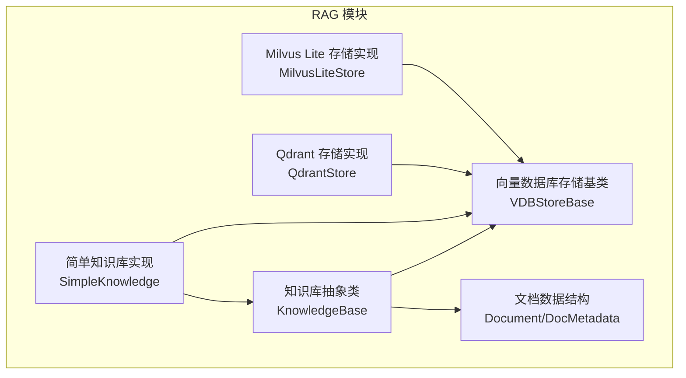
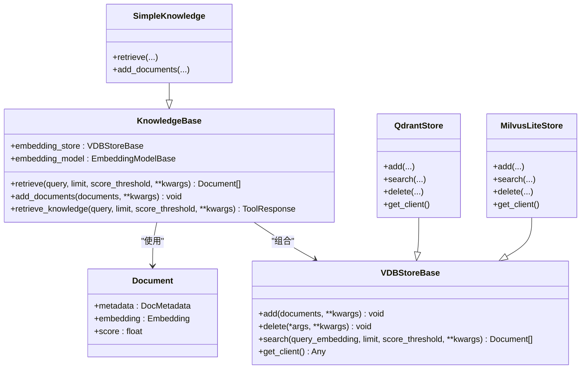
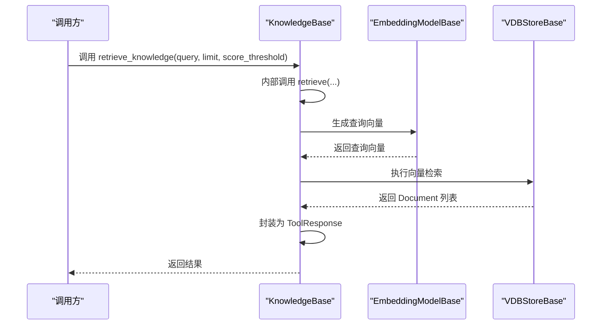
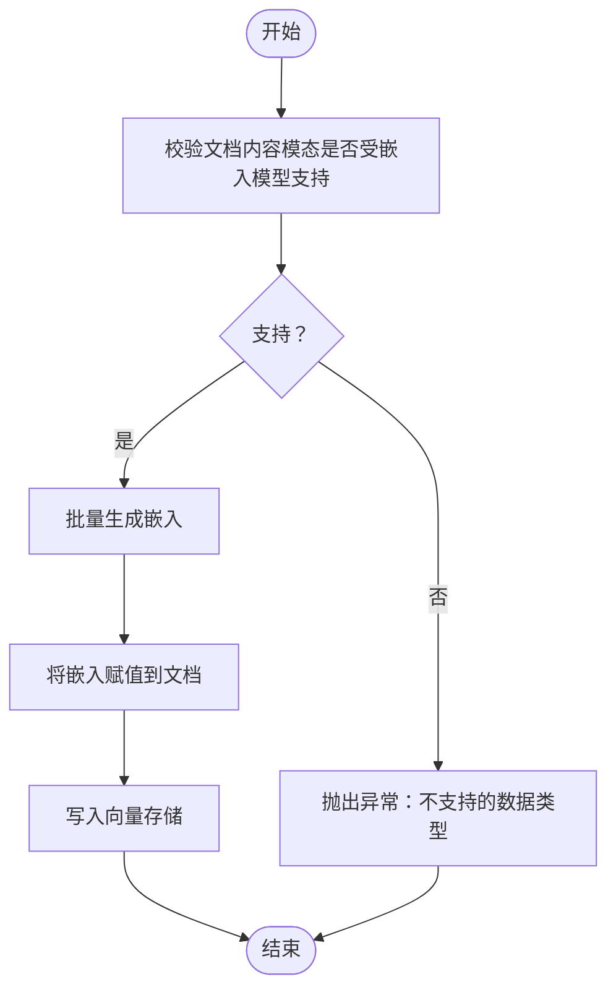
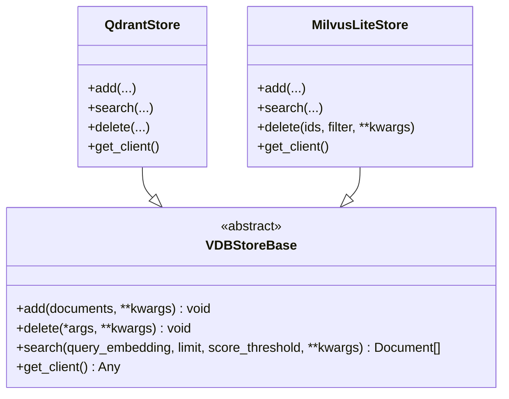
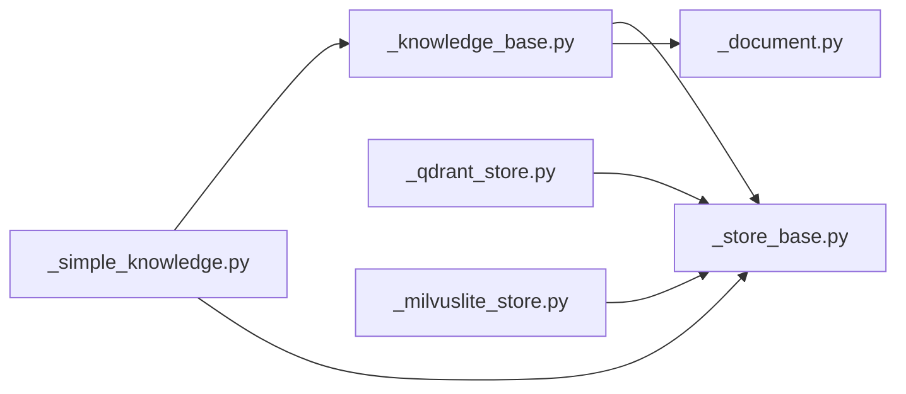

# 知识库核心

<cite>
**本文引用的文件**
- [知识库抽象类（_knowledge_base.py）](file://src/agentscope/rag/_knowledge_base.py)
- [简单知识库实现（_simple_knowledge.py）](file://src/agentscope/rag/_simple_knowledge.py)
- [向量数据库存储基类（_store_base.py）](file://src/agentscope/rag/_store/_store_base.py)
- [Qdrant 存储实现（_qdrant_store.py）](file://src/agentscope/rag/_store/_qdrant_store.py)
- [Milvus Lite 存储实现（_milvuslite_store.py）](file://src/agentscope/rag/_store/_milvuslite_store.py)
- [文档数据结构（_document.py）](file://src/agentscope/rag/_document.py)
- [RAG 模块导出（__init__.py）](file://src/agentscope/rag/__init__.py)
</cite>

## 目录
1. [简介](#简介)
2. [项目结构](#项目结构)
3. [核心组件](#核心组件)
4. [架构总览](#架构总览)
5. [详细组件分析](#详细组件分析)
6. [依赖分析](#依赖分析)
7. [性能考虑](#性能考虑)
8. [故障排查指南](#故障排查指南)
9. [结论](#结论)
10. [附录：API 参考](#附录api-参考)

## 简介
本文件面向 AgentScope 的知识库核心模块，系统性阐述 KnowledgeBase 抽象类的设计理念与架构模式，重点解析嵌入存储与嵌入模型的组合关系；深入说明 retrieve 与 add_documents 两个核心抽象方法的实现要求与使用规范；详解 retrieve_knowledge 便捷方法的工作原理（查询参数优化、阈值设置、结果过滤机制）；并以 SimpleKnowledge 为例给出具体实现示例，覆盖构建基础知识库功能的关键流程。最后提供完整的 API 参考、参数说明、返回值格式与异常处理策略，并附上实际使用案例与最佳实践建议。

## 项目结构
RAG 知识库相关代码位于 src/agentscope/rag 目录下，主要由以下层次构成：
- 抽象层：知识库抽象类与向量数据库存储基类
- 实现层：多种向量数据库存储的具体实现（如 Qdrant、Milvus Lite）
- 数据结构层：文档与元数据的数据类定义
- 工具层：便捷检索方法与模块导出

图表来源
- [知识库抽象类（_knowledge_base.py）:13-131](file://src/agentscope/rag/_knowledge_base.py#L13-L131)
- [简单知识库实现（_simple_knowledge.py）:10-85](file://src/agentscope/rag/_simple_knowledge.py#L10-L85)
- [向量数据库存储基类（_store_base.py）:10-50](file://src/agentscope/rag/_store/_store_base.py#L10-L50)
- [Qdrant 存储实现（_qdrant_store.py）:18-174](file://src/agentscope/rag/_store/_qdrant_store.py#L18-L174)
- [Milvus Lite 存储实现（_milvuslite_store.py）:19-258](file://src/agentscope/rag/_store/_milvuslite_store.py#L19-L258)
- [文档数据结构（_document.py）:17-52](file://src/agentscope/rag/_document.py#L17-L52)

章节来源
- [RAG 模块导出（__init__.py）:1-48](file://src/agentscope/rag/__init__.py#L1-L48)

## 核心组件
- 知识库抽象类 KnowledgeBase：定义检索与新增文档的抽象接口，以及便捷检索工具方法 retrieve_knowledge。其组合了嵌入存储（VDBStoreBase）与嵌入模型（EmbeddingModelBase），形成“检索-存储-嵌入”的闭环。
- 向量数据库存储基类 VDBStoreBase：定义 add/delete/search 等抽象方法，屏蔽具体向量库差异。
- 文档数据结构 Document/DocMetadata：统一承载文本/图像/视频等多模态内容及其元信息、向量与相似度分数。

章节来源
- [知识库抽象类（_knowledge_base.py）:13-131](file://src/agentscope/rag/_knowledge_base.py#L13-L131)
- [向量数据库存储基类（_store_base.py）:10-50](file://src/agentscope/rag/_store/_store_base.py#L10-L50)
- [文档数据结构（_document.py）:17-52](file://src/agentscope/rag/_document.py#L17-L52)

## 架构总览
知识库整体采用“抽象-组合-分层”设计：
- 抽象层：KnowledgeBase 定义检索与新增的契约，约束子类必须实现 retrieve 与 add_documents。
- 组合层：通过构造函数注入嵌入存储与嵌入模型，使检索链路在“嵌入生成 → 向量检索 → 结果封装”之间解耦。
- 分层实现：VDBStoreBase 将具体向量库操作抽象化；SimpleKnowledge 作为默认实现，串联嵌入模型与存储；QdrantStore/MilvusLiteStore 提供具体持久化能力。

图表来源
- [知识库抽象类（_knowledge_base.py）:13-131](file://src/agentscope/rag/_knowledge_base.py#L13-L131)
- [简单知识库实现（_simple_knowledge.py）:10-85](file://src/agentscope/rag/_simple_knowledge.py#L10-L85)
- [向量数据库存储基类（_store_base.py）:10-50](file://src/agentscope/rag/_store/_store_base.py#L10-L50)
- [Qdrant 存储实现（_qdrant_store.py）:18-174](file://src/agentscope/rag/_store/_qdrant_store.py#L18-L174)
- [Milvus Lite 存储实现（_milvuslite_store.py）:19-258](file://src/agentscope/rag/_store/_milvuslite_store.py#L19-L258)
- [文档数据结构（_document.py）:34-52](file://src/agentscope/rag/_document.py#L34-L52)

## 详细组件分析

### KnowledgeBase 抽象类
- 设计理念
  - 通过组合嵌入存储与嵌入模型，将“语义嵌入”与“向量检索”解耦，便于替换与扩展。
  - 对外暴露异步接口，适配高并发与长耗时的嵌入与检索任务。
- 关键字段
  - embedding_store：向量数据库存储实例，负责持久化与检索。
  - embedding_model：嵌入模型实例，负责将文本/多模态内容编码为向量。
- 核心方法
  - retrieve(query, limit, score_threshold, **kwargs)：按查询词检索相关文档，返回 Document 列表。
  - add_documents(documents, **kwargs)：对文档进行嵌入并写入存储。
  - retrieve_knowledge(query, limit, score_threshold, **kwargs)：便捷检索工具，将检索结果封装为 ToolResponse，便于 Agent 使用。

图表来源
- [知识库抽象类（_knowledge_base.py）:74-131](file://src/agentscope/rag/_knowledge_base.py#L74-L131)

章节来源
- [知识库抽象类（_knowledge_base.py）:13-131](file://src/agentscope/rag/_knowledge_base.py#L13-L131)

### SimpleKnowledge 具体实现
- 实现要点
  - retrieve：先用嵌入模型对查询进行编码，再调用存储的 search 接口完成向量检索。
  - add_documents：校验文档内容模态是否被嵌入模型支持，生成嵌入后写入存储。
- 错误处理
  - 当文档内容类型不在嵌入模型支持列表中时抛出异常，提示不支持的数据类型。

图表来源
- [简单知识库实现（_simple_knowledge.py）:54-85](file://src/agentscope/rag/_simple_knowledge.py#L54-L85)

章节来源
- [简单知识库实现（_simple_knowledge.py）:10-85](file://src/agentscope/rag/_simple_knowledge.py#L10-L85)

### 向量数据库存储基类与实现
- VDBStoreBase
  - 抽象方法：add、delete、search；get_client 默认抛出未实现错误，允许子类按需实现。
- QdrantStore
  - 支持本地内存或远程实例；使用 payload 存储元数据；提供 get_client 获取底层客户端。
- MilvusLiteStore
  - 支持本地文件与远程服务；使用标量字段存储元数据；提供 delete 与 get_client。

图表来源
- [向量数据库存储基类（_store_base.py）:10-50](file://src/agentscope/rag/_store/_store_base.py#L10-L50)
- [Qdrant 存储实现（_qdrant_store.py）:18-174](file://src/agentscope/rag/_store/_qdrant_store.py#L18-L174)
- [Milvus Lite 存储实现（_milvuslite_store.py）:19-258](file://src/agentscope/rag/_store/_milvuslite_store.py#L19-L258)

章节来源
- [向量数据库存储基类（_store_base.py）:10-50](file://src/agentscope/rag/_store/_store_base.py#L10-L50)
- [Qdrant 存储实现（_qdrant_store.py）:18-174](file://src/agentscope/rag/_store/_qdrant_store.py#L18-L174)
- [Milvus Lite 存储实现（_milvuslite_store.py）:19-258](file://src/agentscope/rag/_store/_milvuslite_store.py#L19-L258)

### 文档数据结构
- DocMetadata：承载内容（文本/图像/视频）、文档 ID、分片 ID、总分片数等元信息。
- Document：在 DocMetadata 基础上增加 embedding 与 score 字段，用于检索结果的向量表示与相似度评分。

章节来源
- [文档数据结构（_document.py）:17-52](file://src/agentscope/rag/_document.py#L17-L52)

## 依赖分析
- 组件耦合
  - KnowledgeBase 与 VDBStoreBase、EmbeddingModelBase 强耦合但彼此独立，便于替换与测试。
  - SimpleKnowledge 依赖 KnowledgeBase 的抽象契约，同时依赖具体存储实现（如 QdrantStore、MilvusLiteStore）。
- 外部依赖
  - QdrantStore 依赖 qdrant_client；MilvusLiteStore 依赖 pymilvus。
- 潜在循环依赖
  - 代码中未发现循环导入或循环依赖迹象。

图表来源
- [知识库抽象类（_knowledge_base.py）:1-11](file://src/agentscope/rag/_knowledge_base.py#L1-L11)
- [简单知识库实现（_simple_knowledge.py）:1-8](file://src/agentscope/rag/_simple_knowledge.py#L1-L8)
- [向量数据库存储基类（_store_base.py）:1-8](file://src/agentscope/rag/_store/_store_base.py#L1-L8)
- [Qdrant 存储实现（_qdrant_store.py）:1-11](file://src/agentscope/rag/_store/_qdrant_store.py#L1-L11)
- [Milvus Lite 存储实现（_milvuslite_store.py）:1-11](file://src/agentscope/rag/_store/_milvuslite_store.py#L1-L11)
- [文档数据结构（_document.py）:1-14](file://src/agentscope/rag/_document.py#L1-L14)

## 性能考虑
- 嵌入生成批量化：在 add_documents 中对一批文档统一生成嵌入，减少多次往返开销。
- 检索阈值与限制：合理设置 limit 与 score_threshold，避免返回过多低质量结果。
- 存储实现差异：不同向量库的检索性能与索引策略不同，应结合业务规模选择合适实现。
- 异步接口：利用异步检索与嵌入生成，提升吞吐与响应速度。

## 故障排查指南
- 嵌入模型不支持的内容类型
  - 现象：添加文档时报错，提示不支持的数据类型。
  - 处理：确认文档内容类型是否在嵌入模型 supported_modalities 列表中，必要时转换为受支持类型。
- 向量库客户端未安装
  - 现象：初始化 QdrantStore 或 MilvusLiteStore 抛出 ImportError。
  - 处理：根据提示安装对应客户端依赖包。
- 删除操作未实现
  - 现象：调用 QdrantStore.delete 抛出 NotImplementedError。
  - 处理：使用 MilvusLiteStore 的 delete 或通过 get_client 进行原生删除操作。

章节来源
- [简单知识库实现（_simple_knowledge.py）:66-74](file://src/agentscope/rag/_simple_knowledge.py#L66-L74)
- [Qdrant 存储实现（_qdrant_store.py）:159-163](file://src/agentscope/rag/_store/_qdrant_store.py#L159-L163)
- [Milvus Lite 存储实现（_milvuslite_store.py）:221-247](file://src/agentscope/rag/_store/_milvuslite_store.py#L221-L247)

## 结论
KnowledgeBase 通过“嵌入模型 + 向量存储”的组合，提供了可插拔、可扩展的知识库检索能力。SimpleKnowledge 作为默认实现，展示了从查询到结果封装的完整流程；而 VDBStoreBase 及其实现则屏蔽了具体向量库差异。配合合理的参数配置与异常处理策略，可在 Agent 场景中高效、稳定地提供检索增强生成能力。

## 附录：API 参考

### KnowledgeBase
- 构造函数
  - 参数
    - embedding_store: VDBStoreBase，向量数据库存储实例
    - embedding_model: EmbeddingModelBase，嵌入模型实例
- 方法
  - retrieve(query, limit=5, score_threshold=None, **kwargs) -> list[Document]
    - 查询字符串、返回数量上限、相似度阈值、向量库搜索额外参数
  - add_documents(documents, **kwargs) -> None
    - 文档列表，向量库写入额外参数
  - retrieve_knowledge(query, limit=5, score_threshold=None, **kwargs) -> ToolResponse
    - 将检索结果封装为 ToolResponse，便于 Agent 使用

章节来源
- [知识库抽象类（_knowledge_base.py）:28-131](file://src/agentscope/rag/_knowledge_base.py#L28-L131)

### SimpleKnowledge
- 方法
  - retrieve(...)：内部调用嵌入模型生成查询向量，再调用存储 search
  - add_documents(...)：校验内容模态、生成嵌入、写入存储

章节来源
- [简单知识库实现（_simple_knowledge.py）:13-85](file://src/agentscope/rag/_simple_knowledge.py#L13-L85)

### VDBStoreBase
- 方法
  - add(documents, **kwargs) -> None
  - delete(*args, **kwargs) -> None
  - search(query_embedding, limit, score_threshold=None, **kwargs) -> list[Document]
  - get_client() -> Any（默认未实现）

章节来源
- [向量数据库存储基类（_store_base.py）:14-50](file://src/agentscope/rag/_store/_store_base.py#L14-L50)

### QdrantStore
- 初始化参数
  - location: 本地内存或远程地址
  - collection_name: 集合名
  - dimensions: 向量维度
  - distance: 距离度量
  - client_kwargs/collection_kwargs: 客户端与集合配置
- 方法
  - add(documents, **kwargs) -> None
  - search(query_embedding, limit, score_threshold=None, **kwargs) -> list[Document]
  - delete(*args, **kwargs) -> NotImplementedError
  - get_client() -> AsyncQdrantClient

章节来源
- [Qdrant 存储实现（_qdrant_store.py）:27-174](file://src/agentscope/rag/_store/_qdrant_store.py#L27-L174)

### MilvusLiteStore
- 初始化参数
  - uri: 本地文件路径或远程地址
  - collection_name: 集合名
  - dimensions: 向量维度
  - distance: 距离度量
  - token: 认证令牌
  - client_kwargs/collection_kwargs: 客户端与集合配置
- 方法
  - add(documents, **kwargs) -> None
  - search(query_embedding, limit, score_threshold=None, **kwargs) -> list[Document]
  - delete(ids=None, filter=None, **kwargs) -> None
  - get_client() -> MilvusClient

章节来源
- [Milvus Lite 存储实现（_milvuslite_store.py）:31-258](file://src/agentscope/rag/_store/_milvuslite_store.py#L31-L258)

### 文档数据结构
- DocMetadata
  - content: 文本/图像/视频块
  - doc_id: 文档 ID
  - chunk_id: 分片 ID
  - total_chunks: 总分片数
- Document
  - metadata: DocMetadata
  - id: 唯一标识
  - embedding: 向量
  - score: 相似度分数

章节来源
- [文档数据结构（_document.py）:17-52](file://src/agentscope/rag/_document.py#L17-L52)

### 使用示例与最佳实践
- 示例场景
  - 构建知识库：选择合适的 VDBStore 实现（如 QdrantStore 或 MilvusLiteStore），注入嵌入模型，初始化 SimpleKnowledge。
  - 新增文档：调用 add_documents，确保内容类型与嵌入模型兼容。
  - 检索知识：调用 retrieve_knowledge，根据业务调整 limit 与 score_threshold。
- 最佳实践
  - 查询优化：针对同一问题尝试多个查询表达，提升召回质量。
  - 阈值设置：默认阈值可按领域数据分布调整，降低误召回。
  - 批量处理：在 add_documents 中合并小批次，减少网络与磁盘 IO。
  - 异常处理：捕获并记录嵌入模型与存储实现的异常，提供清晰的错误信息。