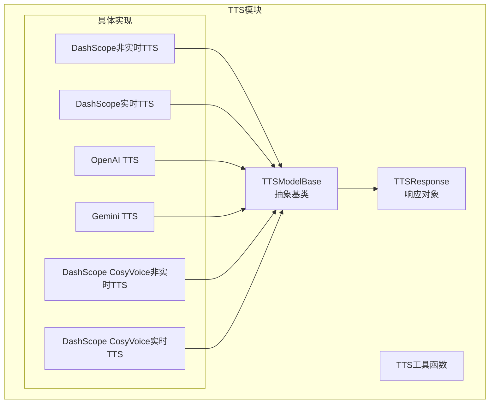
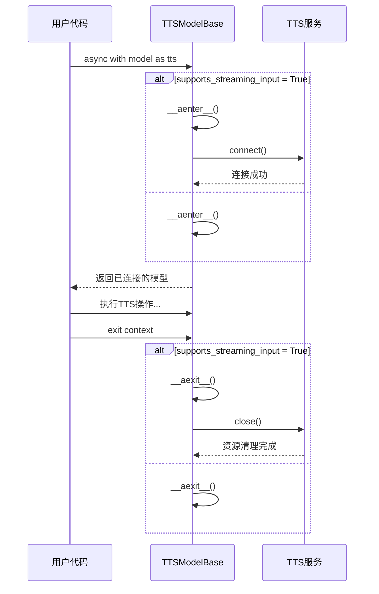
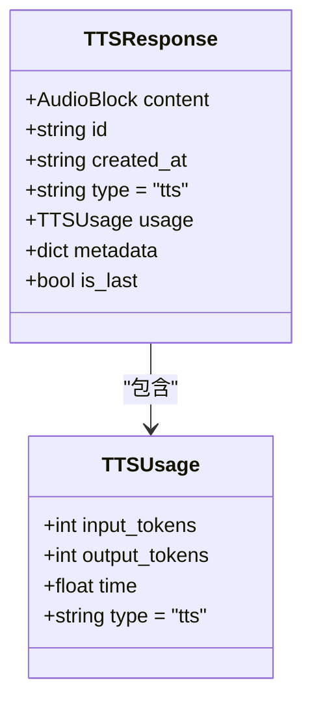
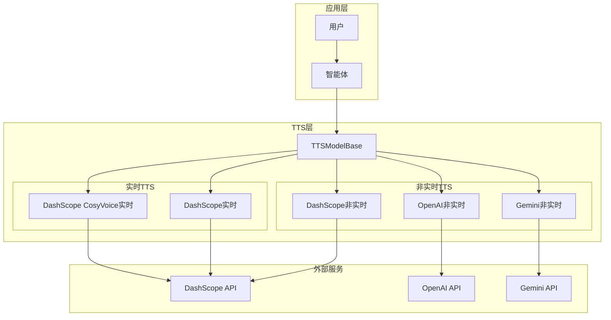
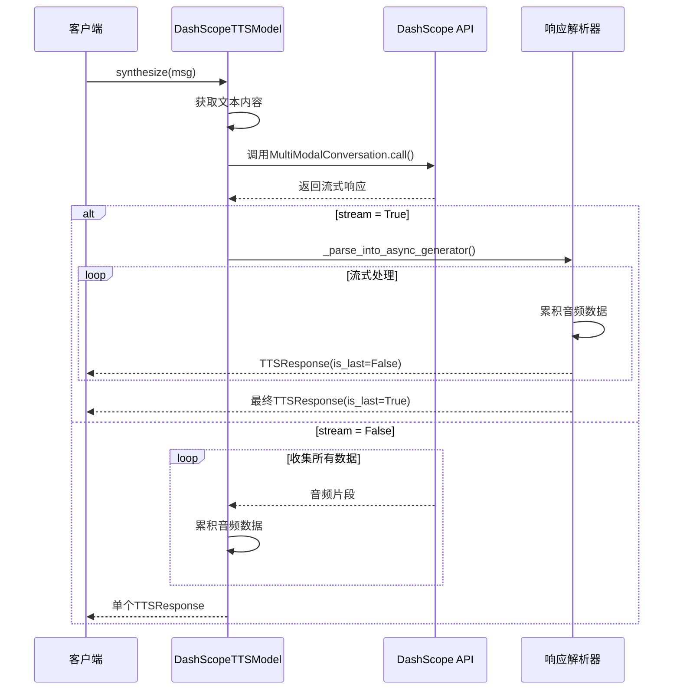
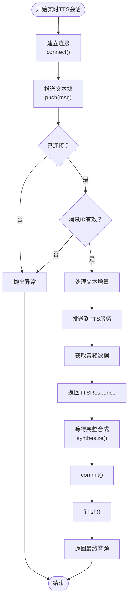
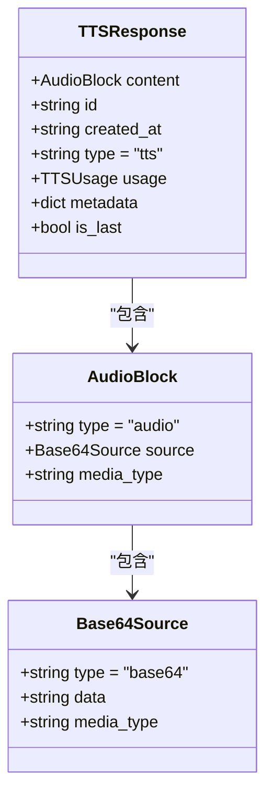
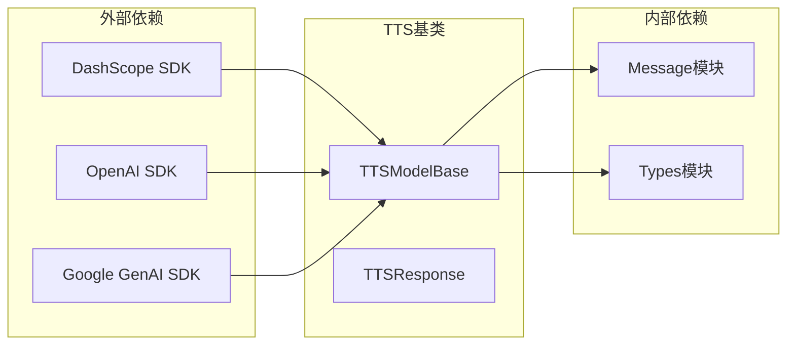
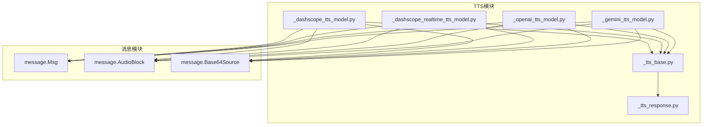

# TTS基类架构

<cite>
**本文档引用的文件**
- [TTS基类](file://src/agentscope/tts/_tts_base.py)
- [TTS响应对象](file://src/agentscope/tts/_tts_response.py)
- [DashScope非实时TTS](file://src/agentscope/tts/_dashscope_tts_model.py)
- [DashScope实时TTS](file://src/agentscope/tts/_dashscope_realtime_tts_model.py)
- [OpenAI TTS](file://src/agentscope/tts/_openai_tts_model.py)
- [Gemini TTS](file://src/agentscope/tts/_gemini_tts_model.py)
- [TTS模块导出](file://src/agentscope/tts/__init__.py)
- [DashScope非实时TTS测试](file://tests/tts_dashscope_test.py)
- [DashScope CosyVoice测试](file://tests/tts_dashscope_cosyvoice_test.py)
- [消息模块](file://src/agentscope/message/__init__.py)
- [功能演示示例](file://examples/functionality/tts/main.py)
- [教程示例](file://docs/tutorial/zh_CN/src/task_tts.py)
</cite>

## 目录
1. [简介](#简介)
2. [项目结构](#项目结构)
3. [核心组件](#核心组件)
4. [架构概览](#架构概览)
5. [详细组件分析](#详细组件分析)
6. [依赖关系分析](#依赖关系分析)
7. [性能考虑](#性能考虑)
8. [故障排除指南](#故障排除指南)
9. [结论](#结论)

## 简介

AgentScope的TTS（文本转语音）基类架构为多种语音服务提供商提供了统一的接口抽象。该架构支持非实时和实时两种TTS模式，通过抽象基类TTSModelBase实现了统一的API设计，使得不同供应商的TTS服务能够在相同的接口下工作。

该架构的核心设计理念是：
- **统一接口设计**：为非实时和实时TTS提供一致的API
- **异步上下文管理**：支持资源的自动管理和清理
- **流式处理**：支持音频数据的增量传输和处理
- **类型安全**：通过数据类确保响应数据的结构化

## 项目结构

AgentScope的TTS相关文件组织结构如下：

**图表来源**
- [TTS基类:12-144](file://src/agentscope/tts/_tts_base.py#L12-L144)
- [TTS模块导出:4-25](file://src/agentscope/tts/__init__.py#L4-L25)

**章节来源**
- [TTS模块导出:1-26](file://src/agentscope/tts/__init__.py#L1-L26)

## 核心组件

### TTSModelBase抽象基类

TTSModelBase是整个TTS架构的核心抽象类，定义了所有TTS实现必须遵循的接口规范。

#### 核心属性

| 属性名 | 类型 | 描述 | 默认值 |
|--------|------|------|--------|
| `supports_streaming_input` | bool | 是否支持流式输入 | False |
| `model_name` | str | 模型名称 | 必需参数 |
| `stream` | bool | 是否使用流式合成 | 必需参数 |

#### 核心方法

1. **`__init__(model_name: str, stream: bool)`** - 初始化方法
2. **`synthesize(msg: Msg | None = None, **kwargs: Any)`** - 合成方法
3. **`push(msg: Msg, **kwargs: Any)`** - 推送方法（实时TTS）
4. **`connect()`** - 连接方法（实时TTS）
5. **`close()`** - 关闭方法（实时TTS）

#### 异步上下文管理

**图表来源**
- [TTS基类:52-69](file://src/agentscope/tts/_tts_base.py#L52-L69)

**章节来源**
- [TTS基类:12-144](file://src/agentscope/tts/_tts_base.py#L12-L144)

### TTSResponse响应对象

TTSResponse是TTS服务的标准响应格式，封装了音频数据和相关信息。

#### 数据结构

**图表来源**
- [TTS响应对象:13-56](file://src/agentscope/tts/_tts_response.py#L13-L56)

**章节来源**
- [TTS响应对象:13-56](file://src/agentscope/tts/_tts_response.py#L13-L56)

## 架构概览

AgentScope的TTS架构采用分层设计，从抽象基类到具体实现，再到统一的响应格式。

**图表来源**
- [TTS基类:12-29](file://src/agentscope/tts/_tts_base.py#L12-L29)
- [DashScope实时TTS:170-186](file://src/agentscope/tts/_dashscope_realtime_tts_model.py#L170-L186)

## 详细组件分析

### 非实时TTS实现

#### DashScope非实时TTS

DashScope非实时TTS实现了完整的文本到语音转换功能，支持流式和非流式输出。

**图表来源**
- [DashScope非实时TTS:78-134](file://src/agentscope/tts/_dashscope_tts_model.py#L78-L134)
- [DashScope非实时TTS:136-178](file://src/agentscope/tts/_dashscope_tts_model.py#L136-L178)

#### OpenAI非实时TTS

OpenAI TTS提供了流式和非流式的音频合成能力。

**章节来源**
- [DashScope非实时TTS:28-178](file://src/agentscope/tts/_dashscope_tts_model.py#L28-L178)
- [OpenAI TTS:17-185](file://src/agentscope/tts/_openai_tts_model.py#L17-L185)

### 实时TTS实现

#### DashScope实时TTS

实时TTS模型支持增量文本输入和音频输出，适用于流式LLM响应场景。

**图表来源**
- [DashScope实时TTS:278-445](file://src/agentscope/tts/_dashscope_realtime_tts_model.py#L278-L445)

#### DashScope CosyVoice实时TTS

CosyVoice实时TTS提供了更丰富的语音合成能力，支持多种语音风格。

**章节来源**
- [DashScope实时TTS:170-446](file://src/agentscope/tts/_dashscope_realtime_tts_model.py#L170-L446)
- [DashScope CosyVoice实时TTS:161-403](file://tests/tts_dashscope_cosyvoice_test.py#L161-L403)

### 统一响应处理

所有TTS实现都遵循统一的响应格式，确保上层应用的一致性。

**图表来源**
- [TTS响应对象:30-56](file://src/agentscope/tts/_tts_response.py#L30-L56)

**章节来源**
- [TTS响应对象:13-56](file://src/agentscope/tts/_tts_response.py#L13-L56)

## 依赖关系分析

### 外部依赖

TTS模块依赖于多个外部服务提供商的SDK：

**图表来源**
- [TTS基类:7-9](file://src/agentscope/tts/_tts_base.py#L7-L9)
- [DashScope实时TTS:7-10](file://src/agentscope/tts/_dashscope_realtime_tts_model.py#L7-L10)

### 内部模块依赖

**图表来源**
- [TTS模块导出:4-13](file://src/agentscope/tts/__init__.py#L4-L13)

**章节来源**
- [TTS模块导出:1-26](file://src/agentscope/tts/__init__.py#L1-L26)

## 性能考虑

### 流式处理优化

1. **内存效率**：实时TTS通过增量音频数据累积，避免一次性加载大量音频
2. **延迟优化**：流式输出允许在合成完成前开始播放音频
3. **并发控制**：实时TTS限制同时进行的会话数量，防止资源竞争

### 错误处理策略

1. **连接管理**：实时TTS模型在上下文中自动管理连接状态
2. **异常传播**：底层API错误会被适配为标准异常类型
3. **资源清理**：确保在异常情况下也能正确清理资源

## 故障排除指南

### 常见问题及解决方案

#### 实时TTS连接问题
- **症状**：调用`push()`或`synthesize()`时报"未连接"错误
- **原因**：未先调用`connect()`方法
- **解决**：使用异步上下文管理器或手动调用`connect()`

#### 文本增量处理问题
- **症状**：实时TTS无法正确处理增量文本
- **原因**：消息ID不匹配或重复推送
- **解决**：确保同一会话使用相同的消息ID

#### 音频数据格式问题
- **症状**：合成的音频无法播放
- **原因**：音频格式不兼容
- **解决**：检查媒体类型和采样率设置

**章节来源**
- [DashScope实时TTS测试:74-200](file://tests/tts_dashscope_test.py#L74-L200)
- [DashScope CosyVoice测试:232-403](file://tests/tts_dashscope_cosyvoice_test.py#L232-L403)

## 结论

AgentScope的TTS基类架构通过抽象化设计，成功地将不同供应商的TTS服务统一到一致的接口下。该架构的主要优势包括：

1. **统一接口**：无论使用哪种TTS服务，API保持一致
2. **灵活实现**：支持非实时和实时两种模式
3. **类型安全**：通过数据类确保响应数据的结构化
4. **资源管理**：自动化的异步上下文管理
5. **扩展性强**：易于添加新的TTS服务提供商

该架构为智能体系统提供了可靠的语音合成能力，支持从简单的文本到流式语音的完整应用场景。