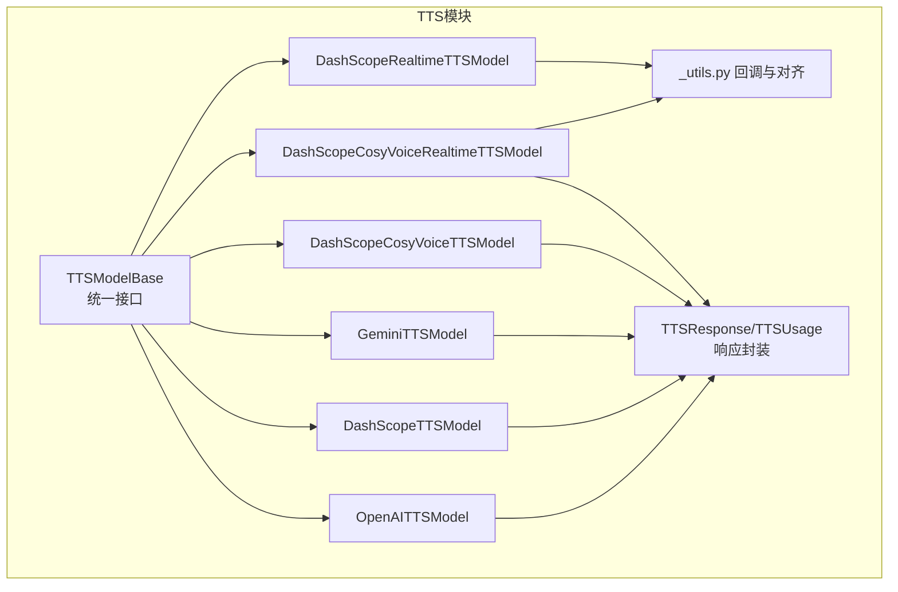
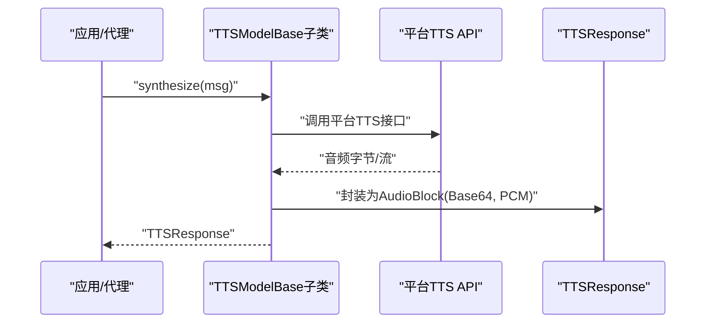
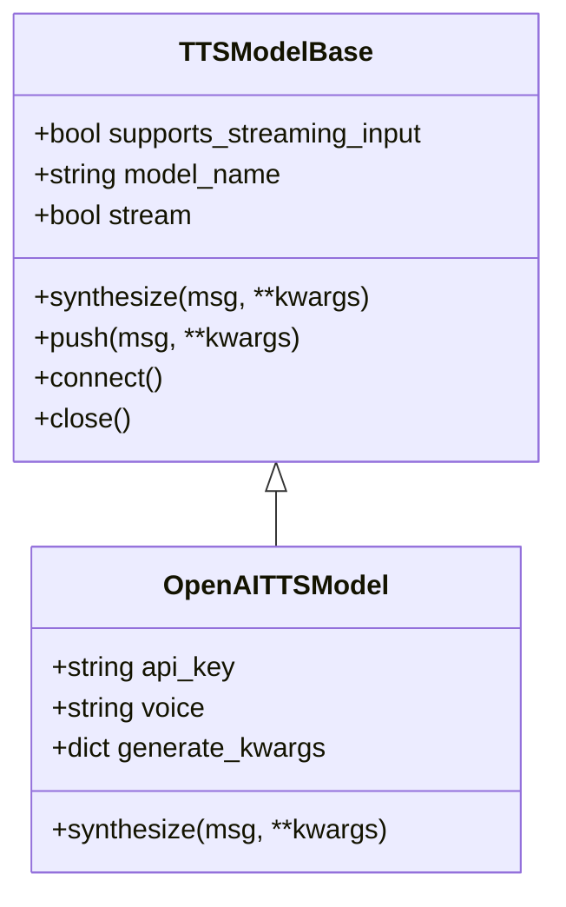
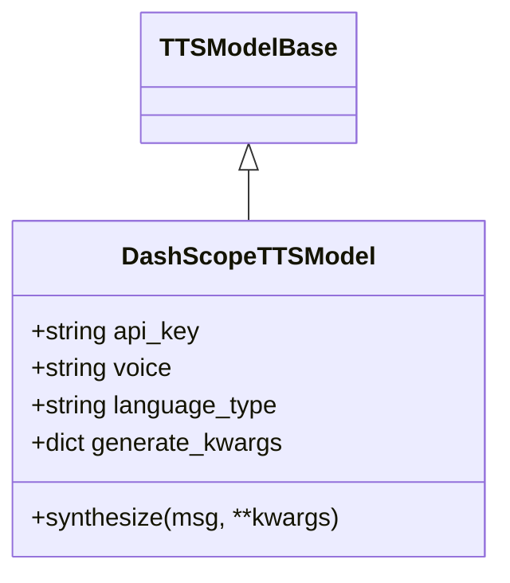
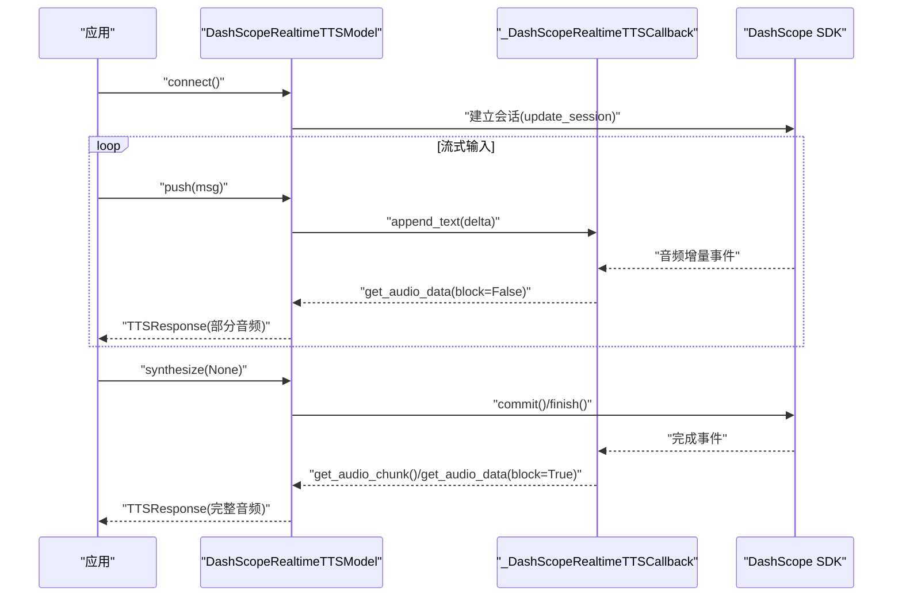
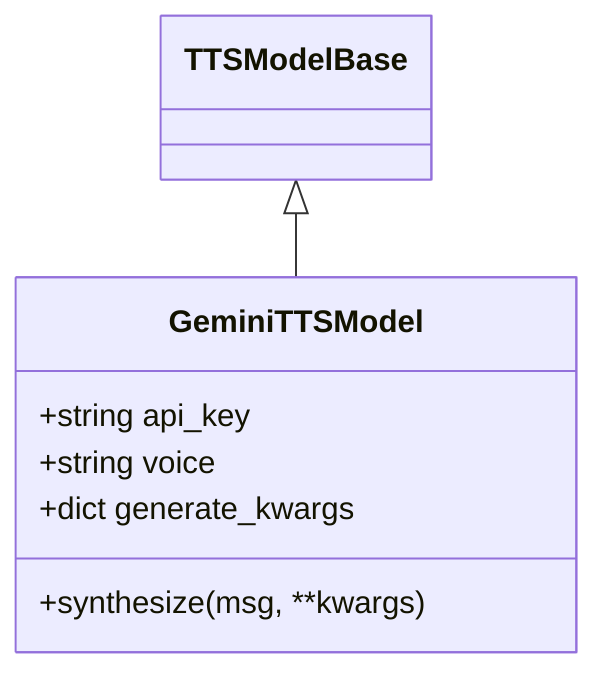
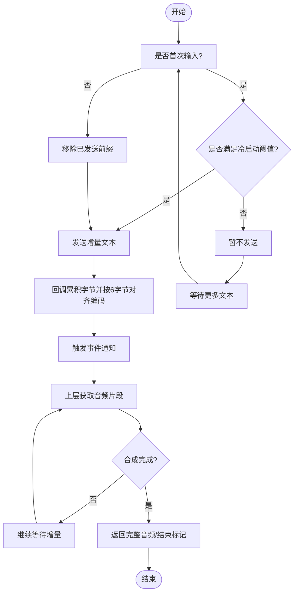
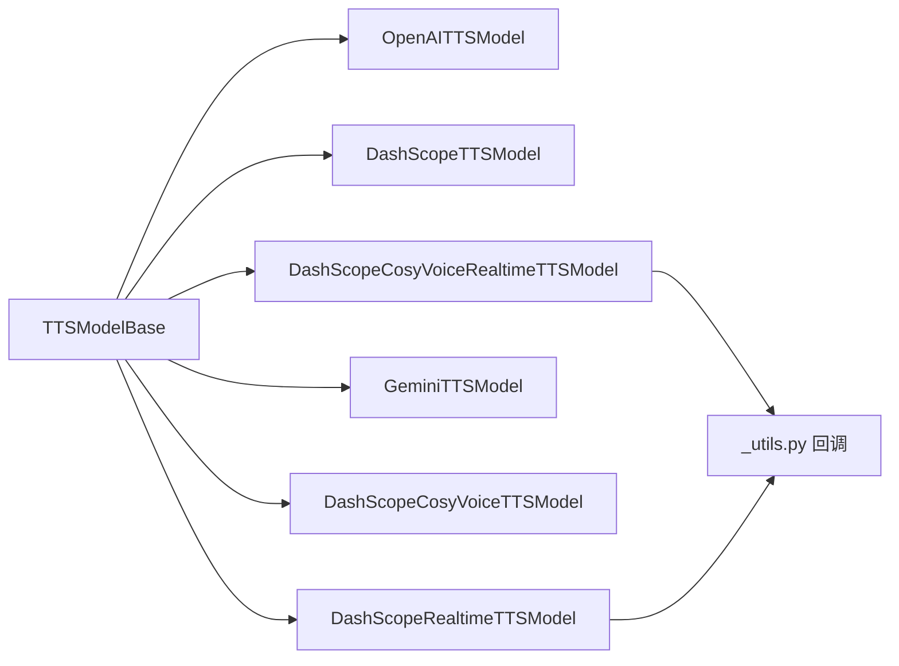

# TTS系统

<cite>
**本文引用的文件**
- [src/agentscope/tts/__init__.py](file://src/agentscope/tts/__init__.py)
- [src/agentscope/tts/_tts_base.py](file://src/agentscope/tts/_tts_base.py)
- [src/agentscope/tts/_tts_response.py](file://src/agentscope/tts/_tts_response.py)
- [src/agentscope/tts/_openai_tts_model.py](file://src/agentscope/tts/_openai_tts_model.py)
- [src/agentscope/tts/_dashscope_tts_model.py](file://src/agentscope/tts/_dashscope_tts_model.py)
- [src/agentscope/tts/_dashscope_realtime_tts_model.py](file://src/agentscope/tts/_dashscope_realtime_tts_model.py)
- [src/agentscope/tts/_gemini_tts_model.py](file://src/agentscope/tts/_gemini_tts_model.py)
- [src/agentscope/tts/_dashscope_cosyvoice_tts_model.py](file://src/agentscope/tts/_dashscope_cosyvoice_tts_model.py)
- [src/agentscope/tts/_dashscope_cosyvoice_realtime_tts_model.py](file://src/agentscope/tts/_dashscope_cosyvoice_realtime_tts_model.py)
- [src/agentscope/tts/_utils.py](file://src/agentscope/tts/_utils.py)
- [examples/functionality/tts/main.py](file://examples/functionality/tts/main.py)
- [examples/functionality/tts/README.md](file://examples/functionality/tts/README.md)
</cite>

## 目录
1. [简介](#简介)
2. [项目结构](#项目结构)
3. [核心组件](#核心组件)
4. [架构总览](#架构总览)
5. [详细组件分析](#详细组件分析)
6. [依赖分析](#依赖分析)
7. [性能考虑](#性能考虑)
8. [故障排查指南](#故障排查指南)
9. [结论](#结论)
10. [附录](#附录)

## 简介
本技术文档面向AgentScope的TTS（文本转语音）系统，系统性阐述TTS基类设计、统一接口与音频格式处理、质量控制策略；详解各平台TTS模型实现：OpenAI TTS的自然语音合成、DashScope TTS的多语言支持、实时TTS的流式处理；说明TTS响应处理机制（音频数据格式、播放控制、错误处理）；解释实时TTS的实现原理（流式传输、缓冲管理、延迟优化）；给出配置选项（音色选择、语速调节、音频质量设置）；并提供使用示例、音频处理技巧与性能优化建议，以及完整的API参考与部署指南。

## 项目结构
TTS模块位于src/agentscope/tts目录，采用“平台适配器+统一基类”的分层设计：
- 基类与响应：TTSModelBase定义统一接口；TTSResponse封装音频块与元信息。
- 平台实现：OpenAI、DashScope、Gemini等分别提供非实时与实时TTS实现。
- 实时工具：DashScope CosyVoice实时回调与通用工具类，保障PCM与Base64边界对齐。
- 示例：examples/functionality/tts展示如何在ReActAgent中集成实时TTS。



**图示来源**
- [src/agentscope/tts/_tts_base.py:12-144](file://src/agentscope/tts/_tts_base.py#L12-L144)
- [src/agentscope/tts/_tts_response.py:13-56](file://src/agentscope/tts/_tts_response.py#L13-L56)
- [src/agentscope/tts/_openai_tts_model.py:17-185](file://src/agentscope/tts/_openai_tts_model.py#L17-L185)
- [src/agentscope/tts/_dashscope_tts_model.py:28-178](file://src/agentscope/tts/_dashscope_tts_model.py#L28-L178)
- [src/agentscope/tts/_dashscope_realtime_tts_model.py:170-446](file://src/agentscope/tts/_dashscope_realtime_tts_model.py#L170-L446)
- [src/agentscope/tts/_gemini_tts_model.py:19-211](file://src/agentscope/tts/_gemini_tts_model.py#L19-L211)
- [src/agentscope/tts/_dashscope_cosyvoice_tts_model.py:14-166](file://src/agentscope/tts/_dashscope_cosyvoice_tts_model.py#L14-L166)
- [src/agentscope/tts/_dashscope_cosyvoice_realtime_tts_model.py:13-280](file://src/agentscope/tts/_dashscope_cosyvoice_realtime_tts_model.py#L13-L280)
- [src/agentscope/tts/_utils.py:18-198](file://src/agentscope/tts/_utils.py#L18-L198)

**章节来源**
- [src/agentscope/tts/__init__.py:1-26](file://src/agentscope/tts/__init__.py#L1-L26)

## 核心组件
- TTSModelBase：抽象出统一接口，区分非实时与实时两类模型生命周期与方法集。非实时模型仅需实现synthesize；实时模型还需实现connect/close/push，并通过异步上下文或显式调用管理资源。
- TTSResponse/TTSUsage：封装音频内容（AudioBlock/Base64Source）、时间戳、类型标识、用量统计与元数据；is_last用于标记流式结束。

关键点
- 统一接口：synthesize支持返回单次完整音频或异步生成器；push用于实时输入增量文本并返回已合成片段。
- 音频格式：统一以Base64编码的PCM音频输出，媒体类型包含采样率等参数，便于上层播放器解码。
- 质量控制：通过模型名、音色、采样率、是否流式等参数控制质量与延迟权衡。

**章节来源**
- [src/agentscope/tts/_tts_base.py:12-144](file://src/agentscope/tts/_tts_base.py#L12-L144)
- [src/agentscope/tts/_tts_response.py:13-56](file://src/agentscope/tts/_tts_response.py#L13-L56)

## 架构总览
下图展示TTS系统整体交互：应用侧通过Msg传递文本，TTS模型调用对应平台API，返回TTSResponse，最终由播放器或上层逻辑消费音频。



**图示来源**
- [src/agentscope/tts/_tts_base.py:124-144](file://src/agentscope/tts/_tts_base.py#L124-L144)
- [src/agentscope/tts/_openai_tts_model.py:76-136](file://src/agentscope/tts/_openai_tts_model.py#L76-L136)
- [src/agentscope/tts/_dashscope_tts_model.py:78-134](file://src/agentscope/tts/_dashscope_tts_model.py#L78-L134)
- [src/agentscope/tts/_gemini_tts_model.py:79-162](file://src/agentscope/tts/_gemini_tts_model.py#L79-L162)
- [src/agentscope/tts/_tts_response.py:30-56](file://src/agentscope/tts/_tts_response.py#L30-L56)

## 详细组件分析

### OpenAI TTS模型
- 特性：非实时模型，支持流式与非流式两种输出；默认使用PCM音频格式；支持音色与生成参数。
- 接口要点：synthesize根据stream决定直接返回音频或异步生成器；内部将二进制音频按块Base64编码后封装为TTSResponse。
- 使用场景：追求自然语音与高音质的对话或播报任务。



**图示来源**
- [src/agentscope/tts/_openai_tts_model.py:17-185](file://src/agentscope/tts/_openai_tts_model.py#L17-L185)
- [src/agentscope/tts/_tts_base.py:12-144](file://src/agentscope/tts/_tts_base.py#L12-L144)

**章节来源**
- [src/agentscope/tts/_openai_tts_model.py:26-136](file://src/agentscope/tts/_openai_tts_model.py#L26-L136)

### DashScope TTS模型
- 特性：基于多模态对话API的TTS实现，支持多语言与多种音色；默认开启流式输出，可聚合音频块。
- 接口要点：synthesize在流式模式下将分片音频拼接为Base64字符串，逐块产出TTSResponse；非流式则一次性返回完整音频。
- 使用场景：多语言、多音色需求，适合跨语言客服或播报。



**图示来源**
- [src/agentscope/tts/_dashscope_tts_model.py:28-178](file://src/agentscope/tts/_dashscope_tts_model.py#L28-L178)
- [src/agentscope/tts/_tts_base.py:12-144](file://src/agentscope/tts/_tts_base.py#L12-L144)

**章节来源**
- [src/agentscope/tts/_dashscope_tts_model.py:37-134](file://src/agentscope/tts/_dashscope_tts_model.py#L37-L134)

### DashScope 实时TTS模型
- 特性：支持流式输入与流式输出，具备冷启动阈值（字符数/词数）避免首段停顿；内部使用回调累积PCM并按Base64边界对齐；支持异步事件驱动获取音频块。
- 生命周期：需先connect建立会话，再push/synthesize发送文本并接收音频；synthesize在非流式模式下阻塞等待完成。
- 关键流程：首次输入可能因阈值未达而暂不发送；后续增量文本移除已发送前缀；回调线程安全地维护音频累积与事件通知。



**图示来源**
- [src/agentscope/tts/_dashscope_realtime_tts_model.py:170-446](file://src/agentscope/tts/_dashscope_realtime_tts_model.py#L170-L446)
- [src/agentscope/tts/_utils.py:18-198](file://src/agentscope/tts/_utils.py#L18-L198)

**章节来源**
- [src/agentscope/tts/_dashscope_realtime_tts_model.py:188-446](file://src/agentscope/tts/_dashscope_realtime_tts_model.py#L188-L446)

### Gemini TTS模型
- 特性：非实时模型，支持流式与非流式；通过GenerateContentConfig指定音频模态与预置音色；流式时逐块拼接Base64音频。
- 使用场景：Google生态集成、多模态内容生成中的语音合成。



**图示来源**
- [src/agentscope/tts/_gemini_tts_model.py:19-211](file://src/agentscope/tts/_gemini_tts_model.py#L19-L211)
- [src/agentscope/tts/_tts_base.py:12-144](file://src/agentscope/tts/_tts_base.py#L12-L144)

**章节来源**
- [src/agentscope/tts/_gemini_tts_model.py:28-162](file://src/agentscope/tts/_gemini_tts_model.py#L28-L162)

### DashScope CosyVoice系列
- 非实时CosyVoice：基于SpeechSynthesizer，支持PCM_24000Hz单声道16位格式；流式输出通过回调累积并按6字节对齐。
- 实时CosyVoice：与DashScope实时类似，但使用CosyVoice专用回调与格式；同样支持冷启动阈值与消息ID一致性校验。

```mermaid
classDiagram
class DashScopeCosyVoiceTTSModel {
+string api_key
+string voice
+bool stream
+synthesize(msg, **kwargs)
+push(msg, **kwargs)
}
class DashScopeCosyVoiceRealtimeTTSModel {
+string api_key
+string voice
+bool stream
+int cold_start_length
+int cold_start_words
+connect()
+push(msg, **kwargs)
+synthesize(msg, **kwargs)
}
TTSModelBase <|-- DashScopeCosyVoiceTTSModel
TTSModelBase <|-- DashScopeCosyVoiceRealtimeTTSModel
DashScopeCosyVoiceRealtimeTTSModel --> "_utils.py 回调"
```

**图示来源**
- [src/agentscope/tts/_dashscope_cosyvoice_tts_model.py:14-166](file://src/agentscope/tts/_dashscope_cosyvoice_tts_model.py#L14-L166)
- [src/agentscope/tts/_dashscope_cosyvoice_realtime_tts_model.py:13-280](file://src/agentscope/tts/_dashscope_cosyvoice_realtime_tts_model.py#L13-L280)
- [src/agentscope/tts/_utils.py:18-198](file://src/agentscope/tts/_utils.py#L18-L198)
- [src/agentscope/tts/_tts_base.py:12-144](file://src/agentscope/tts/_tts_base.py#L12-L144)

**章节来源**
- [src/agentscope/tts/_dashscope_cosyvoice_tts_model.py:84-166](file://src/agentscope/tts/_dashscope_cosyvoice_tts_model.py#L84-L166)
- [src/agentscope/tts/_dashscope_cosyvoice_realtime_tts_model.py:127-280](file://src/agentscope/tts/_dashscope_cosyvoice_realtime_tts_model.py#L127-L280)

### 实时TTS实现原理与优化
- 流式传输：平台回调在收到音频增量时唤醒事件，上层以异步生成器或非阻塞get_audio_data获取音频。
- 缓冲管理：回调内部以字节缓冲累积，按6字节对齐（PCM采样宽度与Base64编码单位的最小公倍数），确保字符串切片不破坏编码边界。
- 冷启动优化：首次输入若未达到字符/词数阈值，则延迟发送，避免首段停顿；后续增量文本移除已发送前缀，减少重复传输。
- 错误处理：回调捕获异常并设置完成事件，防止上层死锁；日志记录错误信息。



**图示来源**
- [src/agentscope/tts/_dashscope_realtime_tts_model.py:344-377](file://src/agentscope/tts/_dashscope_realtime_tts_model.py#L344-L377)
- [src/agentscope/tts/_dashscope_cosyvoice_realtime_tts_model.py:180-213](file://src/agentscope/tts/_dashscope_cosyvoice_realtime_tts_model.py#L180-L213)
- [src/agentscope/tts/_utils.py:49-99](file://src/agentscope/tts/_utils.py#L49-L99)

**章节来源**
- [src/agentscope/tts/_utils.py:18-198](file://src/agentscope/tts/_utils.py#L18-L198)

## 依赖分析
- 模块内聚：各平台模型均继承自TTSModelBase，共享统一接口，降低上层调用复杂度。
- 外部依赖：OpenAI、DashScope、Google GenAI SDK；实时模型依赖平台提供的回调与WebSocket通道。
- 耦合关系：实时模型与回调类强耦合，保证线程安全与边界对齐；非实时模型直接对接SDK同步/异步接口。



**图示来源**
- [src/agentscope/tts/_tts_base.py:12-144](file://src/agentscope/tts/_tts_base.py#L12-L144)
- [src/agentscope/tts/_openai_tts_model.py:17-185](file://src/agentscope/tts/_openai_tts_model.py#L17-L185)
- [src/agentscope/tts/_dashscope_tts_model.py:28-178](file://src/agentscope/tts/_dashscope_tts_model.py#L28-L178)
- [src/agentscope/tts/_dashscope_realtime_tts_model.py:170-446](file://src/agentscope/tts/_dashscope_realtime_tts_model.py#L170-L446)
- [src/agentscope/tts/_gemini_tts_model.py:19-211](file://src/agentscope/tts/_gemini_tts_model.py#L19-L211)
- [src/agentscope/tts/_dashscope_cosyvoice_tts_model.py:14-166](file://src/agentscope/tts/_dashscope_cosyvoice_tts_model.py#L14-L166)
- [src/agentscope/tts/_dashscope_cosyvoice_realtime_tts_model.py:13-280](file://src/agentscope/tts/_dashscope_cosyvoice_realtime_tts_model.py#L13-L280)
- [src/agentscope/tts/_utils.py:18-198](file://src/agentscope/tts/_utils.py#L18-L198)

**章节来源**
- [src/agentscope/tts/__init__.py:1-26](file://src/agentscope/tts/__init__.py#L1-L26)

## 性能考虑
- 延迟优化
  - 冷启动阈值：合理设置冷启动字符/词数阈值，避免短文本首段停顿，同时减少不必要的网络往返。
  - 增量推送：实时模型应尽早发送可确认的文本增量，配合回调事件驱动，缩短端到端延迟。
- 带宽与CPU
  - Base64对齐：按6字节对齐编码可减少字符串切分开销，避免频繁解码/编码。
  - 流式输出：优先使用流式输出，边合成边播放，降低首包延迟与内存峰值。
- 资源管理
  - 连接复用：实时模型连接应长连复用，避免频繁握手；必要时在空闲期释放资源。
  - 异常恢复：回调捕获异常并尽快释放事件，防止阻塞；可引入指数退避重试策略。

[本节为通用指导，无需具体文件引用]

## 故障排查指南
- 实时模型未连接
  - 现象：调用push/synthesize时报错提示未连接。
  - 处理：确保先调用connect建立会话，再进行文本推送与合成。
  - 参考：[connect/synthesize/push错误抛出位置:327-400](file://src/agentscope/tts/_dashscope_realtime_tts_model.py#L327-L400)
- 多请求并发冲突
  - 现象：同一实例同时处理多个消息ID的输入导致异常。
  - 处理：实时模型一次仅处理一个消息ID的流式输入，确保所有分片属于同一消息。
  - 参考：[消息ID一致性检查:332-337](file://src/agentscope/tts/_dashscope_realtime_tts_model.py#L332-L337)
- 首包空白或延迟过长
  - 现象：首次输入未立即发声。
  - 处理：调整冷启动阈值；确认文本长度/词数满足条件；检查网络与平台服务状态。
  - 参考：[冷启动阈值逻辑:346-362](file://src/agentscope/tts/_dashscope_realtime_tts_model.py#L346-L362)
- 音频断续或乱码
  - 现象：播放出现断续或失真。
  - 处理：确认回调对齐逻辑正常；检查Base64边界对齐；确保播放器使用正确的媒体类型与采样率。
  - 参考：[对齐与事件驱动:63-90](file://src/agentscope/tts/_utils.py#L63-L90)
- 日志与错误
  - 处理：关注回调on_error日志；必要时增加重试与降级策略。

**章节来源**
- [src/agentscope/tts/_dashscope_realtime_tts_model.py:327-400](file://src/agentscope/tts/_dashscope_realtime_tts_model.py#L327-L400)
- [src/agentscope/tts/_utils.py:92-98](file://src/agentscope/tts/_utils.py#L92-L98)

## 结论
AgentScope TTS系统通过统一基类抽象与平台适配器实现，既保证了上层一致的调用体验，又充分发挥各平台特性（如DashScope多语言、Gemini多模态、OpenAI自然语音）。实时模型在延迟与稳定性之间提供了可配置的平衡点，结合回调对齐与冷启动策略，能够满足多数对话与播报场景的需求。建议在生产环境中结合业务特征选择合适的模型与参数，并配套完善的监控与重试机制。

[本节为总结，无需具体文件引用]

## 附录

### 配置选项与参数
- 通用参数
  - model_name：模型名称（如qwen3-tts-flash-realtime、gpt-4o-mini-tts等）
  - stream：是否启用流式输出
  - generate_kwargs：平台生成参数（如温度、种子等）
- OpenAI
  - voice：音色（如alloy、ash、ballad、coral等）
  - 参考：[初始化与synthesize:26-136](file://src/agentscope/tts/_openai_tts_model.py#L26-L136)
- DashScope
  - voice：音色（如Cherry、Serena、Ethan、Chelsie等）
  - language_type：语言类型（如Auto）
  - 参考：[初始化与synthesize:37-134](file://src/agentscope/tts/_dashscope_tts_model.py#L37-L134)
- Gemini
  - voice：音色（如Zephyr、Kore、Orus、Autonoe等）
  - 参考：[初始化与synthesize:28-162](file://src/agentscope/tts/_gemini_tts_model.py#L28-L162)
- 实时模型特有
  - cold_start_length/cold_start_words：冷启动阈值（字符/词）
  - 参考：[冷启动与前缀管理:346-377](file://src/agentscope/tts/_dashscope_realtime_tts_model.py#L346-L377)

**章节来源**
- [src/agentscope/tts/_openai_tts_model.py:26-58](file://src/agentscope/tts/_openai_tts_model.py#L26-L58)
- [src/agentscope/tts/_dashscope_tts_model.py:37-70](file://src/agentscope/tts/_dashscope_tts_model.py#L37-L70)
- [src/agentscope/tts/_gemini_tts_model.py:28-64](file://src/agentscope/tts/_gemini_tts_model.py#L28-L64)
- [src/agentscope/tts/_dashscope_realtime_tts_model.py:188-243](file://src/agentscope/tts/_dashscope_realtime_tts_model.py#L188-L243)

### 使用示例
- 在ReActAgent中集成实时TTS
  - 步骤：创建ReActAgent，注册工具与记忆体；构造DashScopeRealtimeTTSModel并注入；循环交互直至退出。
  - 参考：[示例入口与集成:19-57](file://examples/functionality/tts/main.py#L19-L57)
  - 说明：示例使用DashScope实时模型，也可替换为OpenAI/Gemini/CosyVoice等。

**章节来源**
- [examples/functionality/tts/main.py:19-57](file://examples/functionality/tts/main.py#L19-L57)
- [examples/functionality/tts/README.md:1-14](file://examples/functionality/tts/README.md#L1-L14)

### API参考
- TTSModelBase
  - 方法：__init__、__aenter__、__aexit__、connect、close、push、synthesize
  - 属性：supports_streaming_input、model_name、stream
  - 参考：[接口定义:40-144](file://src/agentscope/tts/_tts_base.py#L40-L144)
- TTSResponse/TTSUsage
  - 字段：content、id、created_at、type、usage、metadata、is_last
  - 参考：[响应定义:13-56](file://src/agentscope/tts/_tts_response.py#L13-L56)
- 各平台模型
  - OpenAI：初始化参数、synthesize、流式解析
    - 参考：[OpenAI实现:17-185](file://src/agentscope/tts/_openai_tts_model.py#L17-L185)
  - DashScope：初始化参数、synthesize、流式解析
    - 参考：[DashScope实现:28-178](file://src/agentscope/tts/_dashscope_tts_model.py#L28-L178)
  - DashScope实时：connect、push、synthesize、回调
    - 参考：[DashScope实时实现:170-446](file://src/agentscope/tts/_dashscope_realtime_tts_model.py#L170-L446)
  - Gemini：初始化参数、synthesize、流式解析
    - 参考：[Gemini实现:19-211](file://src/agentscope/tts/_gemini_tts_model.py#L19-L211)
  - CosyVoice：非实时与实时版本
    - 参考：[CosyVoice非实时:14-166](file://src/agentscope/tts/_dashscope_cosyvoice_tts_model.py#L14-L166)、[CosyVoice实时:13-280](file://src/agentscope/tts/_dashscope_cosyvoice_realtime_tts_model.py#L13-L280)
  - 工具类：回调与对齐
    - 参考：[回调与对齐:18-198](file://src/agentscope/tts/_utils.py#L18-L198)

**章节来源**
- [src/agentscope/tts/_tts_base.py:40-144](file://src/agentscope/tts/_tts_base.py#L40-L144)
- [src/agentscope/tts/_tts_response.py:13-56](file://src/agentscope/tts/_tts_response.py#L13-L56)
- [src/agentscope/tts/_openai_tts_model.py:17-185](file://src/agentscope/tts/_openai_tts_model.py#L17-L185)
- [src/agentscope/tts/_dashscope_tts_model.py:28-178](file://src/agentscope/tts/_dashscope_tts_model.py#L28-L178)
- [src/agentscope/tts/_dashscope_realtime_tts_model.py:170-446](file://src/agentscope/tts/_dashscope_realtime_tts_model.py#L170-L446)
- [src/agentscope/tts/_gemini_tts_model.py:19-211](file://src/agentscope/tts/_gemini_tts_model.py#L19-L211)
- [src/agentscope/tts/_dashscope_cosyvoice_tts_model.py:14-166](file://src/agentscope/tts/_dashscope_cosyvoice_tts_model.py#L14-L166)
- [src/agentscope/tts/_dashscope_cosyvoice_realtime_tts_model.py:13-280](file://src/agentscope/tts/_dashscope_cosyvoice_realtime_tts_model.py#L13-L280)
- [src/agentscope/tts/_utils.py:18-198](file://src/agentscope/tts/_utils.py#L18-L198)

### 部署指南
- 环境准备
  - 安装对应平台SDK（OpenAI、DashScope、Google Genai）。
  - 准备API密钥与可用的TTS模型名称。
- 配置建议
  - 非实时模型：适合稳定文本、较长内容；可关闭流式以减少网络波动影响。
  - 实时模型：适合对话、播报；设置合理的冷启动阈值与重试策略。
- 监控与日志
  - 记录TTSUsage（输入/输出token、耗时）；关注回调错误日志与事件超时。
- 安全与限流
  - 控制并发请求数；对敏感文本进行脱敏；遵守平台配额与速率限制。

[本节为通用指导，无需具体文件引用]