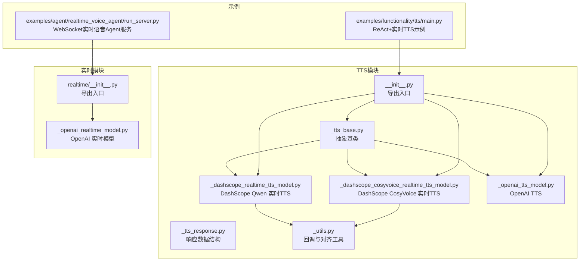
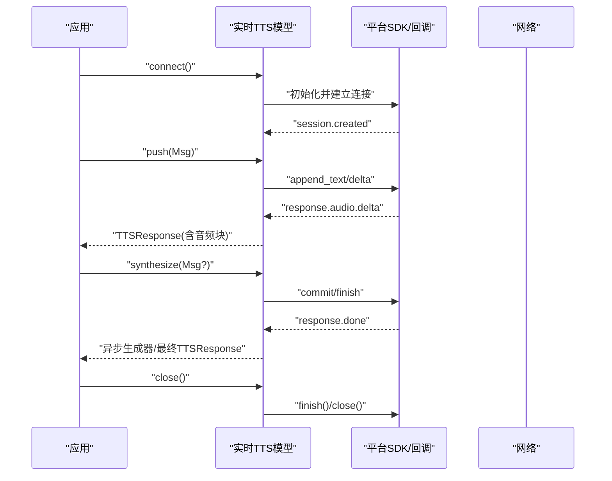
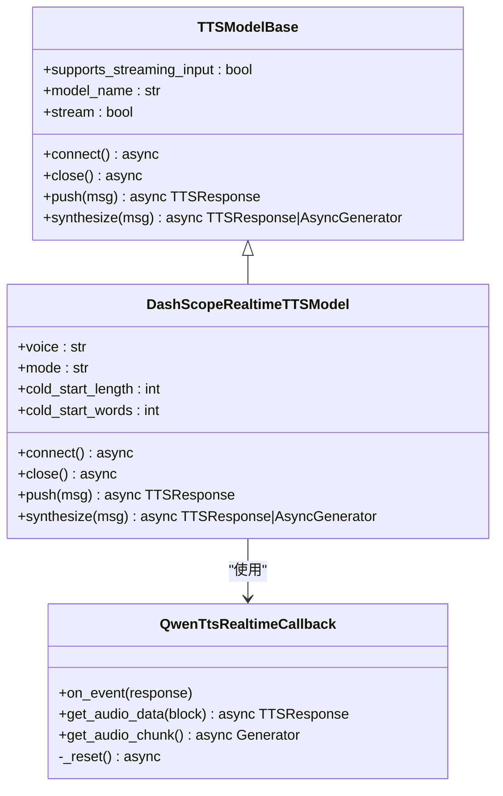
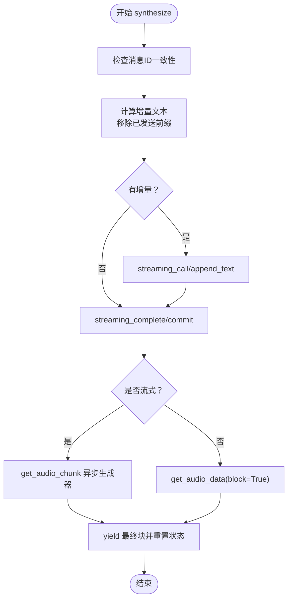
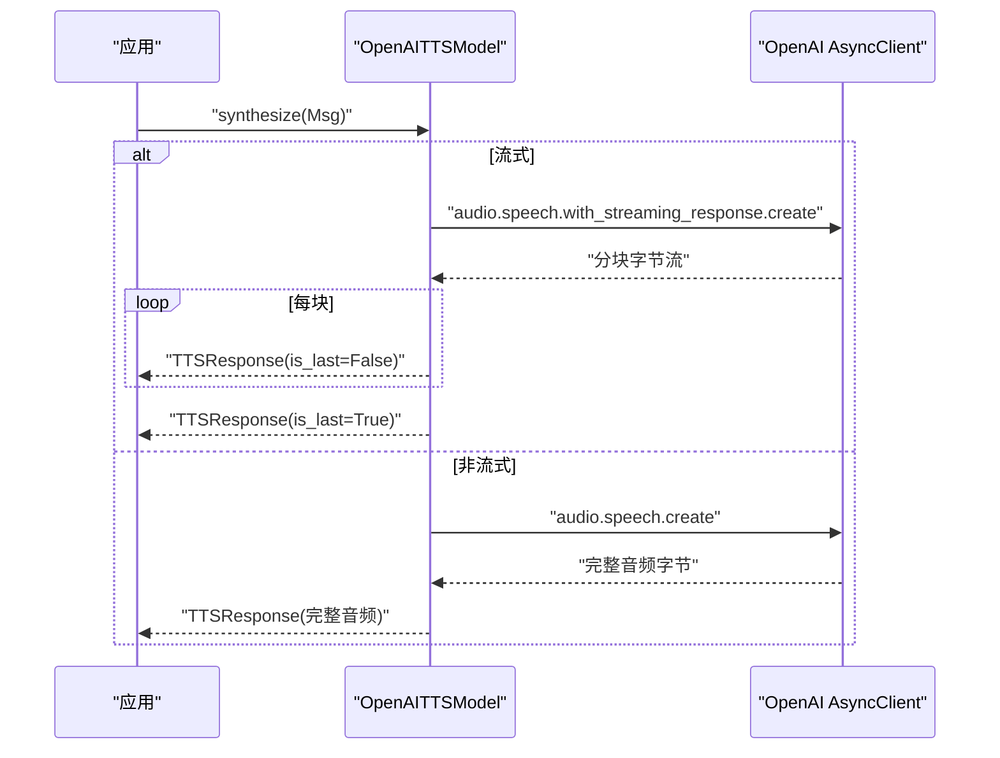
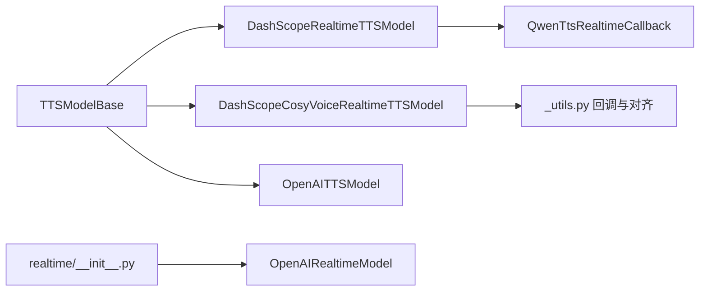

# 实时TTS处理

<cite>
**本文引用的文件**
- [src/agentscope/tts/__init__.py](file://src/agentscope/tts/__init__.py)
- [src/agentscope/tts/_tts_base.py](file://src/agentscope/tts/_tts_base.py)
- [src/agentscope/tts/_tts_response.py](file://src/agentscope/tts/_tts_response.py)
- [src/agentscope/tts/_dashscope_realtime_tts_model.py](file://src/agentscope/tts/_dashscope_realtime_tts_model.py)
- [src/agentscope/tts/_dashscope_cosyvoice_realtime_tts_model.py](file://src/agentscope/tts/_dashscope_cosyvoice_realtime_tts_model.py)
- [src/agentscope/tts/_openai_tts_model.py](file://src/agentscope/tts/_openai_tts_model.py)
- [src/agentscope/tts/_utils.py](file://src/agentscope/tts/_utils.py)
- [src/agentscope/realtime/__init__.py](file://src/agentscope/realtime/__init__.py)
- [src/agentscope/realtime/_openai_realtime_model.py](file://src/agentscope/realtime/_openai_realtime_model.py)
- [examples/functionality/tts/main.py](file://examples/functionality/tts/main.py)
- [examples/agent/realtime_voice_agent/run_server.py](file://examples/agent/realtime_voice_agent/run_server.py)
- [tests/tts_dashscope_test.py](file://tests/tts_dashscope_test.py)
- [tests/tts_openai_test.py](file://tests/tts_openai_test.py)
- [tests/tts_dashscope_cosyvoice_test.py](file://tests/tts_dashscope_cosyvoice_test.py)
</cite>

## 目录
1. [简介](#简介)
2. [项目结构](#项目结构)
3. [核心组件](#核心组件)
4. [架构总览](#架构总览)
5. [详细组件分析](#详细组件分析)
6. [依赖分析](#依赖分析)
7. [性能考虑](#性能考虑)
8. [故障排查指南](#故障排查指南)
9. [结论](#结论)
10. [附录：完整示例与最佳实践](#附录完整示例与最佳实践)

## 简介
本技术文档围绕 AgentScope 的实时文本转语音（TTS）处理系统展开，系统支持多平台实时 TTS 能力，覆盖 DashScope CosyVoice、DashScope Qwen 实时 TTS 以及 OpenAI TTS。文档重点解释以下内容：
- 实时 TTS 的工作原理：流式文本输入、音频数据的实时合成、延迟优化策略
- 实时模型生命周期管理：连接建立、文本推送、音频流输出、资源清理
- 不同平台实时 TTS 的实现差异：DashScope CosyVoice 的语音合成、OpenAI Realtime 的流式处理
- 性能优化技巧：缓冲区管理、音频分片策略、网络传输优化
- 监控与调试方法：音频质量检测、延迟测量、错误恢复机制
- 完整示例与最佳实践

## 项目结构
实时 TTS 模块位于 agentscope/tts 子目录，提供统一的抽象基类与多种具体实现；实时语音交互示例位于 examples/agent/realtime_voice_agent 与 examples/functionality/tts。

图表来源
- [src/agentscope/tts/__init__.py:1-26](file://src/agentscope/tts/__init__.py#L1-L26)
- [src/agentscope/tts/_tts_base.py:1-144](file://src/agentscope/tts/_tts_base.py#L1-L144)
- [src/agentscope/tts/_dashscope_realtime_tts_model.py:1-446](file://src/agentscope/tts/_dashscope_realtime_tts_model.py#L1-L446)
- [src/agentscope/tts/_dashscope_cosyvoice_realtime_tts_model.py:1-280](file://src/agentscope/tts/_dashscope_cosyvoice_realtime_tts_model.py#L1-L280)
- [src/agentscope/tts/_openai_tts_model.py:1-185](file://src/agentscope/tts/_openai_tts_model.py#L1-L185)
- [src/agentscope/tts/_utils.py:1-198](file://src/agentscope/tts/_utils.py#L1-L198)
- [src/agentscope/realtime/__init__.py:1-29](file://src/agentscope/realtime/__init__.py#L1-L29)
- [src/agentscope/realtime/_openai_realtime_model.py:1-485](file://src/agentscope/realtime/_openai_realtime_model.py#L1-L485)
- [examples/functionality/tts/main.py:1-57](file://examples/functionality/tts/main.py#L1-L57)
- [examples/agent/realtime_voice_agent/run_server.py:1-188](file://examples/agent/realtime_voice_agent/run_server.py#L1-L188)

章节来源
- [src/agentscope/tts/__init__.py:1-26](file://src/agentscope/tts/__init__.py#L1-L26)
- [src/agentscope/realtime/__init__.py:1-29](file://src/agentscope/realtime/__init__.py#L1-L29)

## 核心组件
- 抽象基类 TTSModelBase：定义统一接口，支持非实时与实时两种模式；实时模型通过异步上下文管理器或显式 connect/close 生命周期管理
- 具体实现
  - DashScopeRealtimeTTSModel：基于 DashScope Qwen 实时 TTS SDK，支持增量文本推送与异步音频块生成
  - DashScopeCosyVoiceRealtimeTTSModel：基于 DashScope CosyVoice 实时 TTS SDK，支持增量文本推送与按边界对齐的音频分片
  - OpenAITTSModel：OpenAI TTS，支持流式与非流式合成，适用于非实时场景
- 响应与数据结构：TTSResponse、TTSUsage 封装音频块与用量信息
- 工具与回调：_utils 提供 CosyVoice 实时回调，确保 PCM 与 base64 边界对齐，提升拼接稳定性

章节来源
- [src/agentscope/tts/_tts_base.py:1-144](file://src/agentscope/tts/_tts_base.py#L1-L144)
- [src/agentscope/tts/_dashscope_realtime_tts_model.py:1-446](file://src/agentscope/tts/_dashscope_realtime_tts_model.py#L1-L446)
- [src/agentscope/tts/_dashscope_cosyvoice_realtime_tts_model.py:1-280](file://src/agentscope/tts/_dashscope_cosyvoice_realtime_tts_model.py#L1-L280)
- [src/agentscope/tts/_openai_tts_model.py:1-185](file://src/agentscope/tts/_openai_tts_model.py#L1-L185)
- [src/agentscope/tts/_tts_response.py:1-56](file://src/agentscope/tts/_tts_response.py#L1-L56)
- [src/agentscope/tts/_utils.py:1-198](file://src/agentscope/tts/_utils.py#L1-L198)

## 架构总览
实时 TTS 的整体流程分为“连接建立—文本增量推送—音频流输出—资源清理”四个阶段。不同平台在连接方式、事件模型与音频分片策略上存在差异。

图表来源
- [src/agentscope/tts/_dashscope_realtime_tts_model.py:278-446](file://src/agentscope/tts/_dashscope_realtime_tts_model.py#L278-L446)
- [src/agentscope/tts/_dashscope_cosyvoice_realtime_tts_model.py:127-280](file://src/agentscope/tts/_dashscope_cosyvoice_realtime_tts_model.py#L127-L280)
- [src/agentscope/tts/_utils.py:18-198](file://src/agentscope/tts/_utils.py#L18-L198)

## 详细组件分析

### DashScope Qwen 实时 TTS 模型
- 连接与会话
  - 通过 QwenTtsRealtimeCallback 管理事件：音频增量、完成等
  - 支持冷启动阈值（字符/单词），避免首包过短导致停顿
- 文本推送与增量合成
  - push 方法根据消息 ID 与前缀跟踪，仅发送增量文本
  - synthesize 在非流式模式下阻塞等待全部音频，在流式模式下返回异步生成器
- 生命周期
  - connect 建立连接并更新会话参数
  - close 触发 finish/close 清理资源
- 错误与并发
  - 不允许跨消息 ID 并行输入，保证会话一致性

图表来源
- [src/agentscope/tts/_tts_base.py:12-144](file://src/agentscope/tts/_tts_base.py#L12-L144)
- [src/agentscope/tts/_dashscope_realtime_tts_model.py:170-446](file://src/agentscope/tts/_dashscope_realtime_tts_model.py#L170-L446)
- [src/agentscope/tts/_utils.py:18-167](file://src/agentscope/tts/_utils.py#L18-L167)

章节来源
- [src/agentscope/tts/_dashscope_realtime_tts_model.py:1-446](file://src/agentscope/tts/_dashscope_realtime_tts_model.py#L1-L446)
- [tests/tts_dashscope_test.py:1-200](file://tests/tts_dashscope_test.py#L1-L200)

### DashScope CosyVoice 实时 TTS 模型
- 连接与客户端
  - 使用 SpeechSynthesizer 与 ResultCallback，支持 PCM 24kHz 单声道 16bit
  - 内置重试机制（最大次数与指数退避）
- 文本推送与增量合成
  - 与 Qwen 实时类似，但采用 streaming_call/streaming_complete 控制增量与收尾
  - 回调内部按 6 字节对齐（PCM 2 字节样本与 base64 3 字节编码的最小公倍数）进行累积与分片
- 生命周期
  - connect 初始化合成器
  - close 关闭合成器

图表来源
- [src/agentscope/tts/_dashscope_cosyvoice_realtime_tts_model.py:215-280](file://src/agentscope/tts/_dashscope_cosyvoice_realtime_tts_model.py#L215-L280)
- [src/agentscope/tts/_utils.py:185-198](file://src/agentscope/tts/_utils.py#L185-L198)

章节来源
- [src/agentscope/tts/_dashscope_cosyvoice_realtime_tts_model.py:1-280](file://src/agentscope/tts/_dashscope_cosyvoice_realtime_tts_model.py#L1-L280)
- [src/agentscope/tts/_utils.py:1-198](file://src/agentscope/tts/_utils.py#L1-L198)
- [tests/tts_dashscope_cosyvoice_test.py:207-390](file://tests/tts_dashscope_cosyvoice_test.py#L207-L390)

### OpenAI TTS 模型
- 非实时流式合成
  - 支持 with_streaming_response.create 与 create 两种路径
  - 流式模式下逐块编码并产出 TTSResponse，末尾补发 is_last=True 的最终块
- 非流式合成
  - 直接返回完整音频的 TTSResponse

图表来源
- [src/agentscope/tts/_openai_tts_model.py:76-185](file://src/agentscope/tts/_openai_tts_model.py#L76-L185)

章节来源
- [src/agentscope/tts/_openai_tts_model.py:1-185](file://src/agentscope/tts/_openai_tts_model.py#L1-L185)
- [tests/tts_openai_test.py:1-136](file://tests/tts_openai_test.py#L1-L136)

### OpenAI 实时模型（与实时语音交互）
- 输入模态与采样率
  - 支持 audio、text、tool_result 输入；输入/输出均使用 24kHz PCM
- 会话配置
  - 通过 session.update 配置输出模态、VAD、转写模型、工具 Schema
- 事件解析
  - 统一解析 response.*、transcript.*、VAD.*、function_call_arguments.* 等事件
- 数据发送
  - 将 AudioBlock/TextBlock/ToolResultBlock 解析为 WebSocket 消息

章节来源
- [src/agentscope/realtime/_openai_realtime_model.py:1-485](file://src/agentscope/realtime/_openai_realtime_model.py#L1-L485)
- [src/agentscope/realtime/__init__.py:1-29](file://src/agentscope/realtime/__init__.py#L1-L29)

## 依赖分析
- 模块内聚与耦合
  - TTS 抽象层与具体实现解耦，通过统一接口对接不同平台 SDK
  - DashScope 实时模型依赖自定义回调类，负责线程安全与边界对齐
- 外部依赖
  - DashScope SDK（qwen_tts_realtime、tts_v2）
  - OpenAI AsyncClient
  - WebSocket（OpenAI 实时模型）

图表来源
- [src/agentscope/tts/_tts_base.py:12-144](file://src/agentscope/tts/_tts_base.py#L12-L144)
- [src/agentscope/tts/_dashscope_realtime_tts_model.py:1-446](file://src/agentscope/tts/_dashscope_realtime_tts_model.py#L1-L446)
- [src/agentscope/tts/_dashscope_cosyvoice_realtime_tts_model.py:1-280](file://src/agentscope/tts/_dashscope_cosyvoice_realtime_tts_model.py#L1-L280)
- [src/agentscope/tts/_openai_tts_model.py:1-185](file://src/agentscope/tts/_openai_tts_model.py#L1-L185)
- [src/agentscope/tts/_utils.py:1-198](file://src/agentscope/tts/_utils.py#L1-L198)
- [src/agentscope/realtime/__init__.py:1-29](file://src/agentscope/realtime/__init__.py#L1-L29)

## 性能考虑
- 缓冲区管理
  - CosyVoice 回调按 6 字节对齐累积，避免 base64 编码边界问题，减少拼接开销与错误
  - Qwen 实时回调使用事件驱动，避免轮询，降低 CPU 占用
- 音频分片策略
  - 流式合成按块产出，避免一次性加载大段音频
  - 通过 is_last 标记区分中间块与最终块，便于前端及时播放
- 网络传输优化
  - 使用异步生成器与事件等待，减少阻塞
  - OpenAI 实时模型使用 WebSocket，降低握手与协议开销
- 冷启动优化
  - 通过 cold_start_length/cold_start_words 阈值，避免首包过短导致停顿
- 资源清理
  - 显式调用 close/finish/close，释放 SDK 资源，防止句柄泄漏

[本节为通用性能建议，不直接分析具体文件]

## 故障排查指南
- 常见错误与定位
  - 未连接即调用：实时模型在未 connect 时抛出异常，需先建立连接
  - 跨消息 ID 并行输入：实时模型不支持多请求并发，需确保同一消息 ID
  - 回调未就绪：确保回调事件已触发（chunk_event/finish_event），必要时阻塞等待
- 音频质量检测
  - 检查媒体类型与采样率是否符合预期（如 audio/pcm;rate=24000）
  - 对比 is_last 前后音频块长度，确认边界对齐
- 延迟测量
  - 记录首次音频增量到达时间与最终合成完成时间，评估端到端延迟
- 错误恢复机制
  - CosyVoice 实时模型内置最大重试次数与退避策略
  - 回调 on_error 中记录日志并唤醒等待，避免死锁

章节来源
- [src/agentscope/tts/_dashscope_realtime_tts_model.py:397-446](file://src/agentscope/tts/_dashscope_realtime_tts_model.py#L397-L446)
- [src/agentscope/tts/_dashscope_cosyvoice_realtime_tts_model.py:233-280](file://src/agentscope/tts/_dashscope_cosyvoice_realtime_tts_model.py#L233-L280)
- [src/agentscope/tts/_utils.py:92-198](file://src/agentscope/tts/_utils.py#L92-L198)

## 结论
AgentScope 的实时 TTS 系统通过统一抽象与平台适配，实现了跨平台的流式文本到语音转换。其关键优势在于：
- 明确的生命周期管理与严格的并发约束
- 基于事件驱动与边界对齐的音频分片策略
- 可扩展的错误恢复与资源清理机制
结合示例工程，开发者可快速集成实时语音交互能力，并在不同平台间灵活切换。

[本节为总结性内容，不直接分析具体文件]

## 附录：完整示例与最佳实践
- ReAct Agent + DashScope 实时 TTS 示例
  - 展示如何在对话代理中注入实时 TTS 模型，实现边说边播
  - 参考路径：[examples/functionality/tts/main.py:1-57](file://examples/functionality/tts/main.py#L1-L57)
- WebSocket 实时语音 Agent 服务
  - 提供 Web 前端与 WebSocket 交互，支持多模型（DashScope/Gemini/OpenAI）切换
  - 参考路径：[examples/agent/realtime_voice_agent/run_server.py:1-188](file://examples/agent/realtime_voice_agent/run_server.py#L1-L188)
- 最佳实践清单
  - 使用异步上下文管理器或显式 connect/close 管理生命周期
  - 严格控制消息 ID，避免跨请求并发
  - 合理设置冷启动阈值，平衡首包时延与连贯性
  - 使用 is_last 标记与事件驱动，确保低延迟播放
  - 在 CosyVoice 实时模型中启用重试策略，提升鲁棒性

章节来源
- [examples/functionality/tts/main.py:1-57](file://examples/functionality/tts/main.py#L1-L57)
- [examples/agent/realtime_voice_agent/run_server.py:1-188](file://examples/agent/realtime_voice_agent/run_server.py#L1-L188)