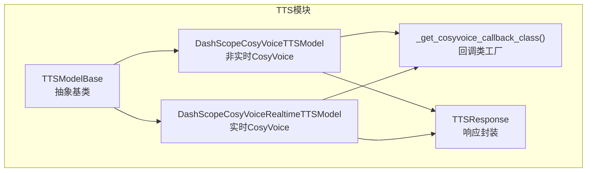
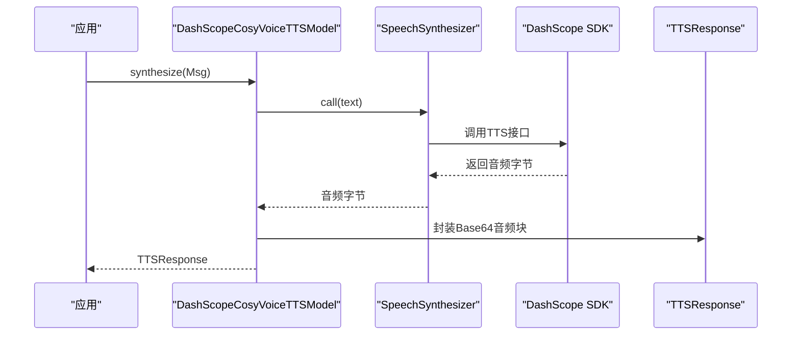
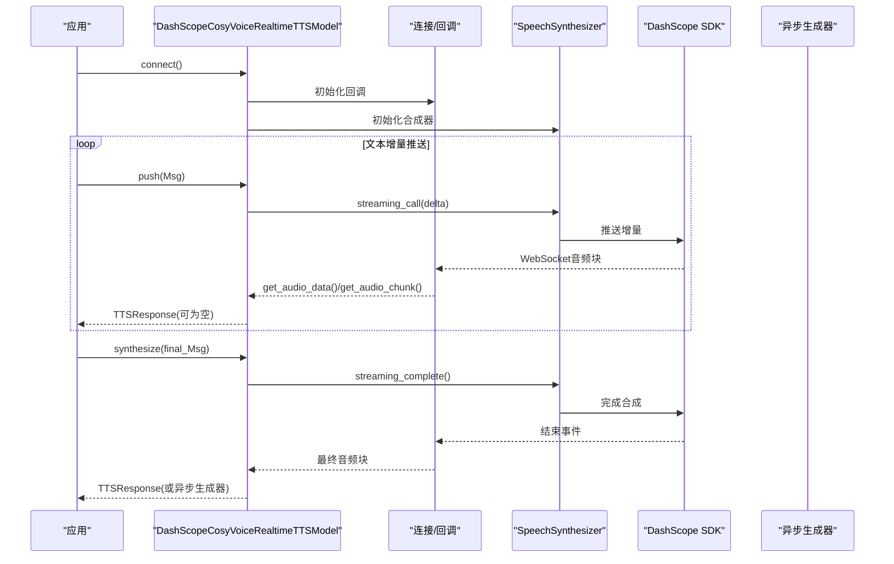
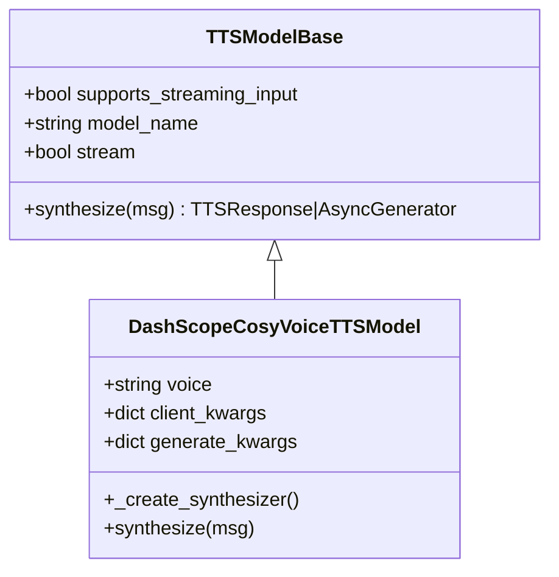
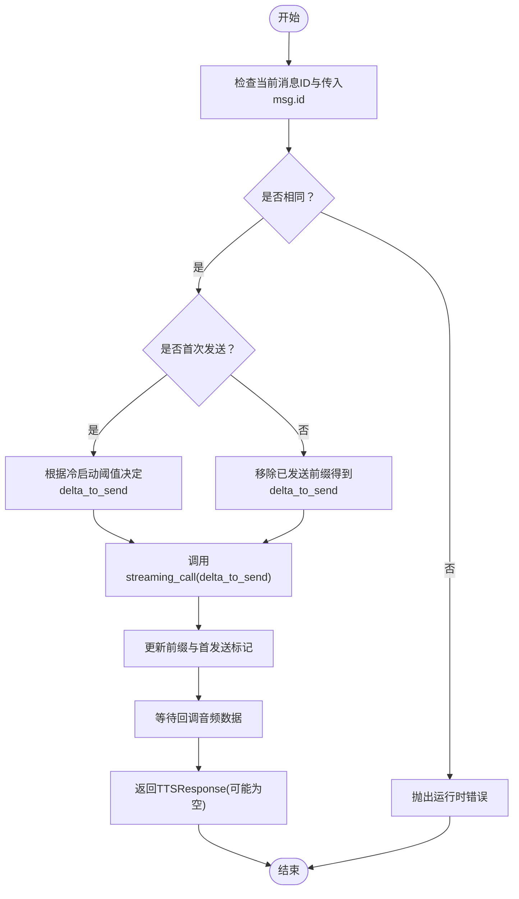
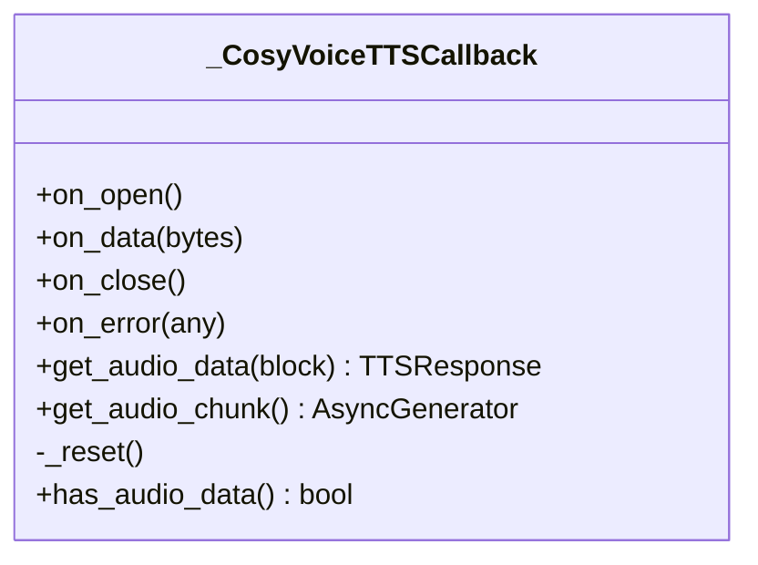
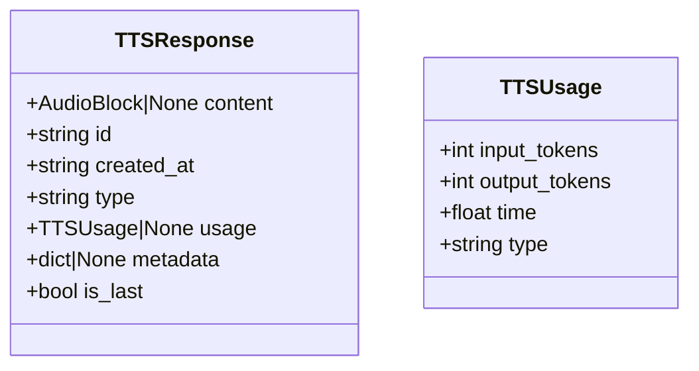
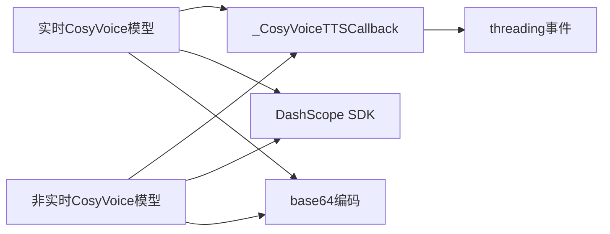

# CosyVoice TTS适配器

<cite>
**本文引用的文件**
- [src/agentscope/tts/_dashscope_cosyvoice_tts_model.py](file://src/agentscope/tts/_dashscope_cosyvoice_tts_model.py)
- [src/agentscope/tts/_dashscope_cosyvoice_realtime_tts_model.py](file://src/agentscope/tts/_dashscope_cosyvoice_realtime_tts_model.py)
- [src/agentscope/tts/_tts_base.py](file://src/agentscope/tts/_tts_base.py)
- [src/agentscope/tts/_tts_response.py](file://src/agentscope/tts/_tts_response.py)
- [src/agentscope/tts/_utils.py](file://src/agentscope/tts/_utils.py)
- [tests/tts_dashscope_cosyvoice_test.py](file://tests/tts_dashscope_cosyvoice_test.py)
- [docs/tutorial/zh_CN/src/task_tts.py](file://docs/tutorial/zh_CN/src/task_tts.py)
- [examples/functionality/tts/main.py](file://examples/functionality/tts/main.py)
</cite>

## 目录
1. [简介](#简介)
2. [项目结构](#项目结构)
3. [核心组件](#核心组件)
4. [架构总览](#架构总览)
5. [详细组件分析](#详细组件分析)
6. [依赖关系分析](#依赖关系分析)
7. [性能考量](#性能考量)
8. [故障排查指南](#故障排查指南)
9. [结论](#结论)
10. [附录](#附录)

## 简介
本技术文档面向在AgentScope中集成DashScope CosyVoice中文语音合成能力的开发者，系统性说明CosyVoice TTS适配器的实现原理、配置参数、功能特性与使用方式，并提供平台约束、配置示例与专业实践建议。文档同时涵盖非实时与实时两种模式的差异、音色选择、说话人身份管理、音频质量参数以及冷启动阈值等关键点。

## 项目结构
CosyVoice相关实现位于TTS模块下，采用“基类抽象 + 具体实现”的分层设计：
- 基类：TTSModelBase，统一非实时与实时TTS的生命周期与接口约定
- 实现类：
  - DashScopeCosyVoiceTTSModel：非实时CosyVoice TTS
  - DashScopeCosyVoiceRealtimeTTSModel：实时CosyVoice TTS
- 工具与回调：_utils中提供CosyVoice专用回调类，负责PCM与Base64对齐、事件驱动的音频块产出
- 响应模型：TTSResponse封装音频块、时间戳、用量信息与元数据

**图表来源**
- [src/agentscope/tts/_tts_base.py:12-144](file://src/agentscope/tts/_tts_base.py#L12-L144)
- [src/agentscope/tts/_dashscope_cosyvoice_tts_model.py:14-166](file://src/agentscope/tts/_dashscope_cosyvoice_tts_model.py#L14-L166)
- [src/agentscope/tts/_dashscope_cosyvoice_realtime_tts_model.py:13-280](file://src/agentscope/tts/_dashscope_cosyvoice_realtime_tts_model.py#L13-L280)
- [src/agentscope/tts/_utils.py:18-198](file://src/agentscope/tts/_utils.py#L18-L198)
- [src/agentscope/tts/_tts_response.py:30-56](file://src/agentscope/tts/_tts_response.py#L30-L56)

**章节来源**
- [src/agentscope/tts/_tts_base.py:12-144](file://src/agentscope/tts/_tts_base.py#L12-L144)
- [src/agentscope/tts/_dashscope_cosyvoice_tts_model.py:14-166](file://src/agentscope/tts/_dashscope_cosyvoice_tts_model.py#L14-L166)
- [src/agentscope/tts/_dashscope_cosyvoice_realtime_tts_model.py:13-280](file://src/agentscope/tts/_dashscope_cosyvoice_realtime_tts_model.py#L13-L280)
- [src/agentscope/tts/_utils.py:18-198](file://src/agentscope/tts/_utils.py#L18-L198)
- [src/agentscope/tts/_tts_response.py:30-56](file://src/agentscope/tts/_tts_response.py#L30-L56)

## 核心组件
- TTSModelBase：定义supports_streaming_input、synthesize、push/connect/close等抽象接口，统一非实时与实时TTS的生命周期管理
- DashScopeCosyVoiceTTSModel：非实时CosyVoice TTS，支持完整文本一次性合成；内部通过SpeechSynthesizer调用，音频格式为PCM_24000Hz_Mono_16bit
- DashScopeCosyVoiceRealtimeTTSModel：实时CosyVoice TTS，支持文本增量推送与流式输出；内部维护当前消息ID、前缀文本、冷启动阈值与重试策略
- _get_cosyvoice_callback_class：返回内部回调类，负责WebSocket事件、PCM与Base64对齐、事件通知与异步块生成
- TTSResponse：封装音频块、时间戳、用量与元数据，is_last标记流式最后一块

**章节来源**
- [src/agentscope/tts/_tts_base.py:12-144](file://src/agentscope/tts/_tts_base.py#L12-L144)
- [src/agentscope/tts/_dashscope_cosyvoice_tts_model.py:14-166](file://src/agentscope/tts/_dashscope_cosyvoice_tts_model.py#L14-L166)
- [src/agentscope/tts/_dashscope_cosyvoice_realtime_tts_model.py:13-280](file://src/agentscope/tts/_dashscope_cosyvoice_realtime_tts_model.py#L13-L280)
- [src/agentscope/tts/_utils.py:18-198](file://src/agentscope/tts/_utils.py#L18-L198)
- [src/agentscope/tts/_tts_response.py:30-56](file://src/agentscope/tts/_tts_response.py#L30-L56)

## 架构总览
CosyVoice TTS适配器遵循“抽象基类 + SDK客户端 + 回调事件”的分层架构。非实时模式直接调用SDK同步接口；实时模式通过回调类与SDK的流式接口配合，实现增量文本推送与音频块的异步产出。

**图表来源**
- [src/agentscope/tts/_dashscope_cosyvoice_tts_model.py:115-166](file://src/agentscope/tts/_dashscope_cosyvoice_tts_model.py#L115-L166)

**图表来源**
- [src/agentscope/tts/_dashscope_cosyvoice_realtime_tts_model.py:127-280](file://src/agentscope/tts/_dashscope_cosyvoice_realtime_tts_model.py#L127-L280)
- [src/agentscope/tts/_utils.py:100-197](file://src/agentscope/tts/_utils.py#L100-L197)

## 详细组件分析

### 非实时CosyVoice TTS模型
- 支持的模型名称：cosyvoice-v3-plus、cosyvoice-v3-flash、sambert等
- 音色选择：longanyang、longanhuan、longhuhu_v3、longyingmu_v3
- 音频格式：PCM_24000Hz_Mono_16bit
- 生命周期：无需连接/关闭，直接synthesize
- 流式输出：可通过stream参数启用，返回异步生成器逐块产出音频

**图表来源**
- [src/agentscope/tts/_tts_base.py:12-144](file://src/agentscope/tts/_tts_base.py#L12-L144)
- [src/agentscope/tts/_dashscope_cosyvoice_tts_model.py:14-166](file://src/agentscope/tts/_dashscope_cosyvoice_tts_model.py#L14-L166)

**章节来源**
- [src/agentscope/tts/_dashscope_cosyvoice_tts_model.py:14-166](file://src/agentscope/tts/_dashscope_cosyvoice_tts_model.py#L14-L166)

### 实时CosyVoice TTS模型
- 支持的模型名称：同上
- 音色选择：同上
- 生命周期：需connect()建立资源，push()增量推送文本，synthesize()收尾并阻塞等待完整音频
- 关键参数：
  - cold_start_length：首次请求最小字符阈值，避免短文本导致停顿
  - cold_start_words：首次请求最小词数阈值（按空格分割）
  - max_retries/retry_delay：失败重试次数与指数退避间隔
- 并发约束：同一时刻仅能处理一个消息ID的流式输入，不同消息ID的混合推送将触发错误

**图表来源**
- [src/agentscope/tts/_dashscope_cosyvoice_realtime_tts_model.py:167-214](file://src/agentscope/tts/_dashscope_cosyvoice_realtime_tts_model.py#L167-L214)

**章节来源**
- [src/agentscope/tts/_dashscope_cosyvoice_realtime_tts_model.py:13-280](file://src/agentscope/tts/_dashscope_cosyvoice_realtime_tts_model.py#L13-L280)

### 回调与音频块对齐
- 回调类负责WebSocket事件、PCM与Base64对齐（以6字节为边界确保编码一致性）、事件通知与异步块生成
- get_audio_data：可阻塞等待合成完成，返回累计的Base64音频
- get_audio_chunk：异步生成器，逐块产出音频，is_last标记最后一块

**图表来源**
- [src/agentscope/tts/_utils.py:31-198](file://src/agentscope/tts/_utils.py#L31-L198)

**章节来源**
- [src/agentscope/tts/_utils.py:18-198](file://src/agentscope/tts/_utils.py#L18-L198)

### 响应模型与数据结构
- TTSResponse：包含AudioBlock、时间戳、类型标识、用量与元数据；is_last用于流式末尾标记
- AudioBlock/Base64Source：封装媒体类型与Base64音频数据

**图表来源**
- [src/agentscope/tts/_tts_response.py:13-56](file://src/agentscope/tts/_tts_response.py#L13-L56)

**章节来源**
- [src/agentscope/tts/_tts_response.py:13-56](file://src/agentscope/tts/_tts_response.py#L13-L56)

## 依赖关系分析
- 组件耦合
  - 实时模型与回调类强耦合：通过回调类实现事件驱动的音频块产出
  - 非实时模型与回调类弱耦合：仅在开启流式输出时创建回调实例
  - 两者均依赖DashScope SDK的SpeechSynthesizer与AudioFormat
- 外部依赖
  - DashScope SDK：音频TTS服务端调用
  - threading：事件同步与线程安全
  - base64：音频字节到Base64编码转换

**图表来源**
- [src/agentscope/tts/_dashscope_cosyvoice_realtime_tts_model.py:100-138](file://src/agentscope/tts/_dashscope_cosyvoice_realtime_tts_model.py#L100-L138)
- [src/agentscope/tts/_dashscope_cosyvoice_tts_model.py:84-98](file://src/agentscope/tts/_dashscope_cosyvoice_tts_model.py#L84-L98)
- [src/agentscope/tts/_utils.py:49-98](file://src/agentscope/tts/_utils.py#L49-L98)

**章节来源**
- [src/agentscope/tts/_dashscope_cosyvoice_realtime_tts_model.py:100-138](file://src/agentscope/tts/_dashscope_cosyvoice_realtime_tts_model.py#L100-L138)
- [src/agentscope/tts/_dashscope_cosyvoice_tts_model.py:84-98](file://src/agentscope/tts/_dashscope_cosyvoice_tts_model.py#L84-L98)
- [src/agentscope/tts/_utils.py:49-98](file://src/agentscope/tts/_utils.py#L49-L98)

## 性能考量
- 非实时模式
  - 适合完整文本合成，延迟主要取决于网络与服务端处理时间
  - 流式输出可提前播放，降低感知延迟
- 实时模式
  - 增量推送+流式输出显著降低端到端延迟
  - 冷启动阈值避免短文本引发的停顿，提升自然度
  - 回调类采用6字节对齐确保PCM与Base64编码一致性，减少额外转换开销
- 资源管理
  - 实时模式需显式connect/close，避免连接泄漏
  - 非实时模式每次请求新建合成器，避免并发连接问题

[本节为通用性能讨论，不直接分析具体文件]

## 故障排查指南
- 常见错误
  - 实时模式多消息并发：不同消息ID混推会触发运行时错误，需确保同一会话内所有增量属于同一msg.id
  - 空文本或无内容消息：synthesize返回空响应，需在上游校验消息文本
  - SDK异常：回调类在on_error中记录日志并唤醒等待线程，避免死锁
- 单元测试要点
  - 非实时：验证合成器调用参数、Base64编码正确性与流式生成器行为
  - 实时：验证增量推送、冷启动阈值、流式完成与异步生成器行为

**章节来源**
- [tests/tts_dashscope_cosyvoice_test.py:17-403](file://tests/tts_dashscope_cosyvoice_test.py#L17-L403)
- [src/agentscope/tts/_dashscope_cosyvoice_realtime_tts_model.py:167-173](file://src/agentscope/tts/_dashscope_cosyvoice_realtime_tts_model.py#L167-L173)
- [src/agentscope/tts/_utils.py:92-98](file://src/agentscope/tts/_utils.py#L92-L98)

## 结论
CosyVoice TTS适配器在AgentScope中提供了统一的非实时与实时中文语音合成能力。通过清晰的抽象基类、事件驱动的回调机制与严格的生命周期管理，开发者可在不同场景下灵活选择模型与模式。结合冷启动阈值、重试策略与流式输出，可获得低延迟、高自然度的中文语音合成体验。

[本节为总结性内容，不直接分析具体文件]

## 附录

### 配置参数总览
- 通用参数
  - api_key：DashScope API密钥
  - model_name：模型名称（cosyvoice-v3-plus、cosyvoice-v3-flash、sambert等）
  - voice：音色（longanyang、longanhuan、longhuhu_v3、longyingmu_v3）
  - stream：是否启用流式输出（非实时默认False，实时默认True）
- 非实时特有
  - client_kwargs/generate_kwargs：透传给SDK客户端与生成参数
- 实时特有
  - cold_start_length/cold_start_words：首次请求冷启动阈值（字符/词）
  - max_retries/retry_delay：失败重试次数与指数退避间隔
  - client_kwargs/generate_kwargs：透传给SDK客户端与生成参数

**章节来源**
- [src/agentscope/tts/_dashscope_cosyvoice_tts_model.py:29-82](file://src/agentscope/tts/_dashscope_cosyvoice_tts_model.py#L29-L82)
- [src/agentscope/tts/_dashscope_cosyvoice_realtime_tts_model.py:31-112](file://src/agentscope/tts/_dashscope_cosyvoice_realtime_tts_model.py#L31-L112)

### 功能特性与平台约束
- 功能特性
  - 音色选择：支持多种官方音色，按模型而定
  - 流式输入：实时模型支持增量文本推送
  - 流式输出：两种模式均可流式产出音频块
  - 冷启动控制：避免短文本首帧停顿
- 平台约束
  - 实时模型同一时刻仅处理一个消息ID的流式输入
  - 需要DashScope API密钥与对应模型权限
  - 音频格式固定为PCM_24000Hz_Mono_16bit（非实时）或回调内部对齐后的PCM

**章节来源**
- [src/agentscope/tts/_dashscope_cosyvoice_realtime_tts_model.py:21-26](file://src/agentscope/tts/_dashscope_cosyvoice_realtime_tts_model.py#L21-L26)
- [src/agentscope/tts/_dashscope_cosyvoice_tts_model.py:84-98](file://src/agentscope/tts/_dashscope_cosyvoice_tts_model.py#L84-L98)

### 使用示例与最佳实践
- 示例入口
  - TTS教程示例：展示非实时与实时TTS的使用方式
  - 示例工程：ReActAgent与TTS集成的端到端示例
- 最佳实践
  - 非实时：适合完整文本合成，优先使用流式输出以降低感知延迟
  - 实时：适合LLM流式输出场景，务必保证同一会话内所有增量属于同一msg.id
  - 音色与语种：根据目标语言与风格选择合适音色；中文建议使用支持中文发音的音色
  - 冷启动：为中文短文本设置合理冷启动阈值，避免停顿
  - 错误处理：捕获回调错误日志，必要时启用重试策略

**章节来源**
- [docs/tutorial/zh_CN/src/task_tts.py:87-243](file://docs/tutorial/zh_CN/src/task_tts.py#L87-L243)
- [examples/functionality/tts/main.py:19-57](file://examples/functionality/tts/main.py#L19-L57)