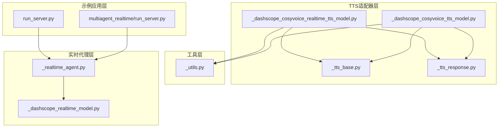
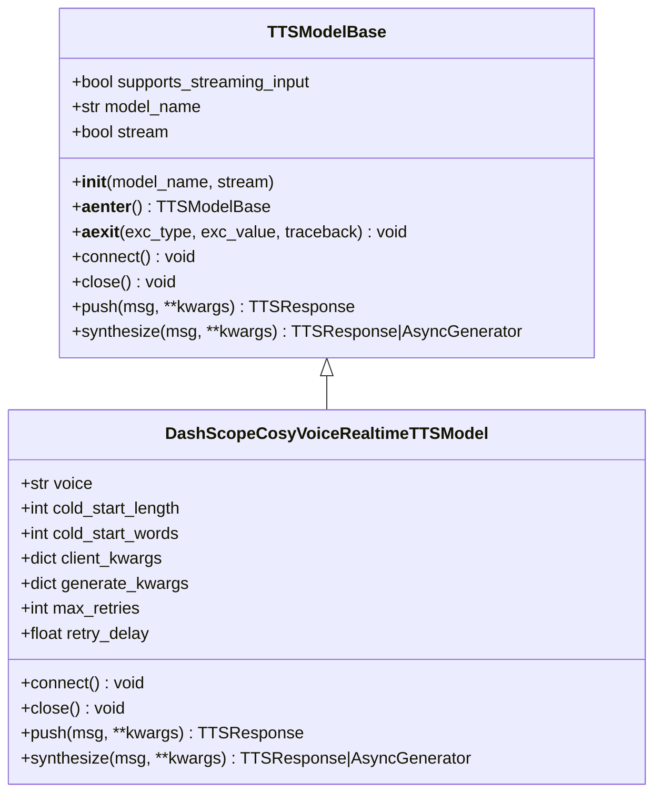
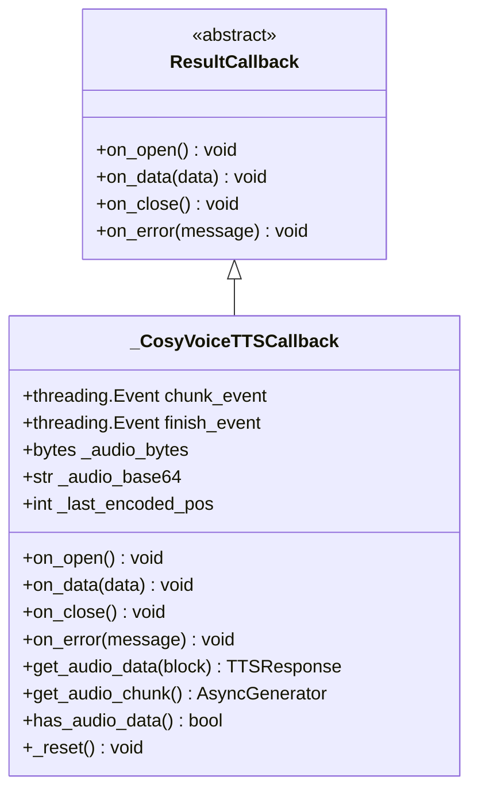
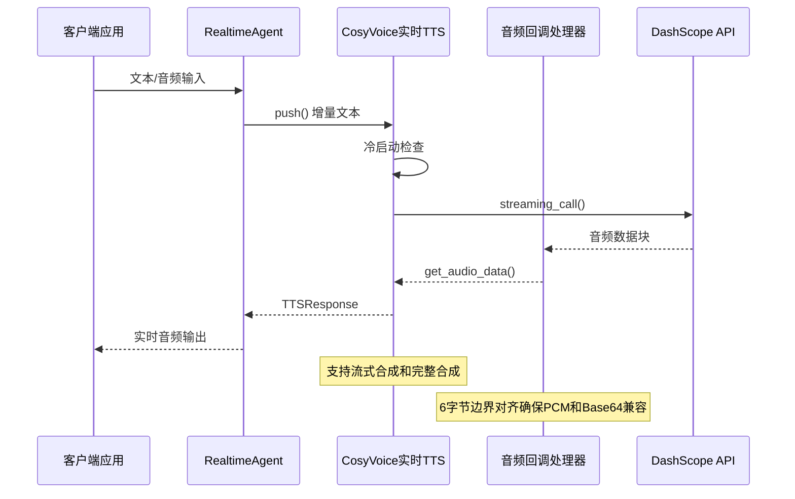
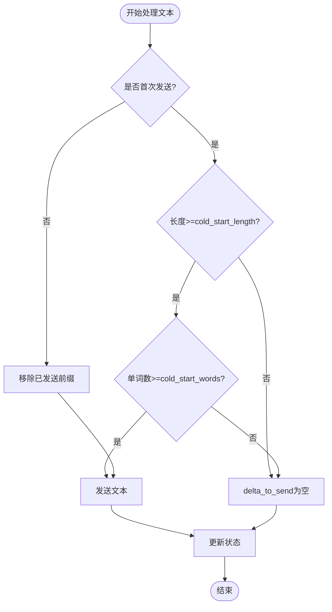
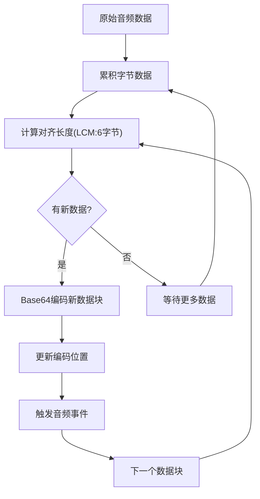
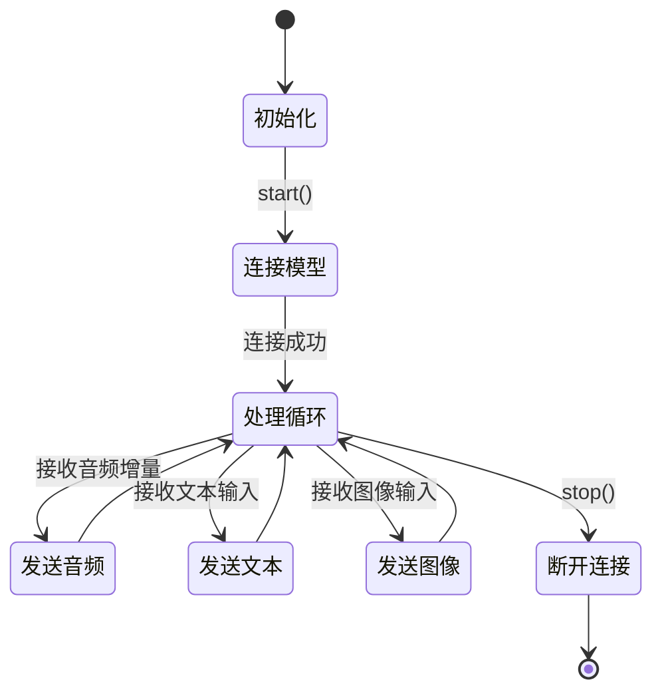
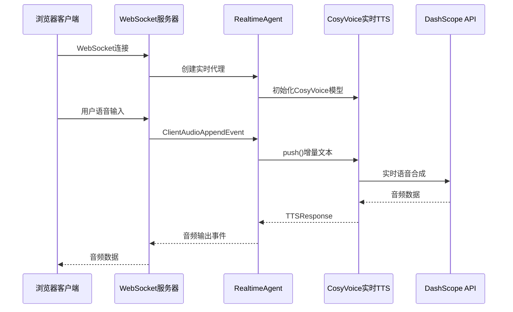
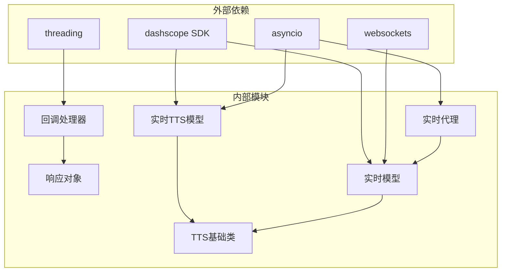
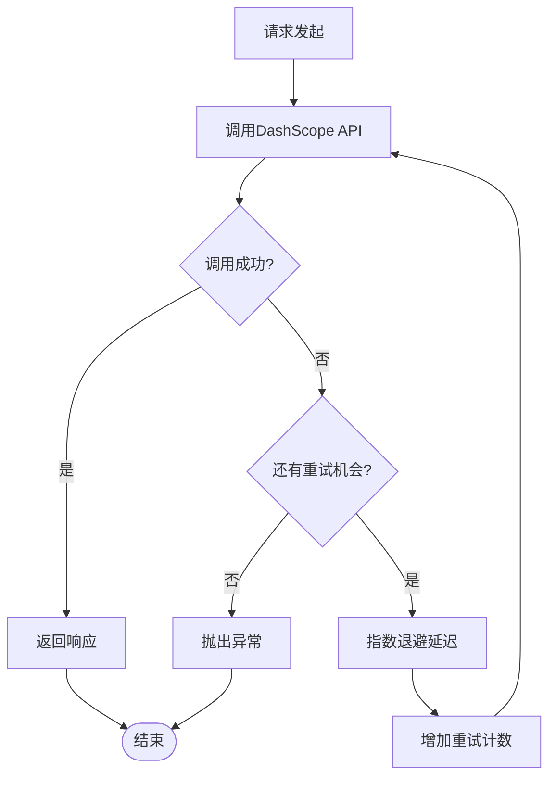

# CosyVoice实时TTS适配器

<cite>
**本文档引用的文件**
- [src/agentscope/tts/_dashscope_cosyvoice_realtime_tts_model.py](file://src/agentscope/tts/_dashscope_cosyvoice_realtime_tts_model.py)
- [src/agentscope/tts/_tts_base.py](file://src/agentscope/tts/_tts_base.py)
- [src/agentscope/tts/_utils.py](file://src/agentscope/tts/_utils.py)
- [src/agentscope/tts/_tts_response.py](file://src/agentscope/tts/_tts_response.py)
- [src/agentscope/tts/_dashscope_cosyvoice_tts_model.py](file://src/agentscope/tts/_dashscope_cosyvoice_tts_model.py)
- [src/agentscope/realtime/_dashscope_realtime_model.py](file://src/agentscope/realtime/_dashscope_realtime_model.py)
- [src/agentscope/agent/_realtime_agent.py](file://src/agentscope/agent/_realtime_agent.py)
- [examples/agent/realtime_voice_agent/run_server.py](file://examples/agent/realtime_voice_agent/run_server.py)
- [examples/workflows/multiagent_realtime/run_server.py](file://examples/workflows/multiagent_realtime/run_server.py)
- [tests/tts_dashscope_cosyvoice_test.py](file://tests/tts_dashscope_cosyvoice_test.py)
</cite>

## 目录
1. [简介](#简介)
2. [项目结构](#项目结构)
3. [核心组件](#核心组件)
4. [架构概览](#架构概览)
5. [详细组件分析](#详细组件分析)
6. [依赖关系分析](#依赖关系分析)
7. [性能考虑](#性能考虑)
8. [故障排除指南](#故障排除指南)
9. [结论](#结论)
10. [附录](#附录)

## 简介

CosyVoice实时TTS适配器是基于阿里云DashScope平台的实时语音合成解决方案，专为AgentScope框架设计。该适配器实现了边说边听的实时语音处理机制，支持流式文本输入和音频输出，提供低延迟的语音交互体验。

该系统的核心特性包括：
- 实时流式语音合成，支持增量文本输入
- 边说边听的语音交互模式
- 智能冷启动机制，避免短文本导致的停顿
- 多种音色选择和参数配置
- 完整的错误处理和重试机制
- 与AgentScope实时代理系统的无缝集成

## 项目结构

CosyVoice实时TTS适配器位于AgentScope项目的TTS模块中，采用清晰的分层架构设计：



**图表来源**
- [src/agentscope/tts/_dashscope_cosyvoice_realtime_tts_model.py:1-280](file://src/agentscope/tts/_dashscope_cosyvoice_realtime_tts_model.py#L1-L280)
- [src/agentscope/tts/_tts_base.py:1-144](file://src/agentscope/tts/_tts_base.py#L1-L144)
- [src/agentscope/agent/_realtime_agent.py:1-361](file://src/agentscope/agent/_realtime_agent.py#L1-L361)

**章节来源**
- [src/agentscope/tts/_dashscope_cosyvoice_realtime_tts_model.py:1-280](file://src/agentscope/tts/_dashscope_cosyvoice_realtime_tts_model.py#L1-L280)
- [src/agentscope/tts/_tts_base.py:1-144](file://src/agentscope/tts/_tts_base.py#L1-L144)

## 核心组件

### 实时TTS模型基类

所有TTS模型都继承自抽象基类，提供了统一的接口规范：



**图表来源**
- [src/agentscope/tts/_tts_base.py:12-144](file://src/agentscope/tts/_tts_base.py#L12-L144)
- [src/agentscope/tts/_dashscope_cosyvoice_realtime_tts_model.py:13-280](file://src/agentscope/tts/_dashscope_cosyvoice_realtime_tts_model.py#L13-L280)

### 实时回调处理器

实时音频数据处理的核心组件，负责音频数据的累积和边界对齐：



**图表来源**
- [src/agentscope/tts/_utils.py:31-197](file://src/agentscope/tts/_utils.py#L31-L197)

**章节来源**
- [src/agentscope/tts/_tts_base.py:12-144](file://src/agentscope/tts/_tts_base.py#L12-L144)
- [src/agentscope/tts/_utils.py:18-197](file://src/agentscope/tts/_utils.py#L18-L197)

## 架构概览

CosyVoice实时TTS适配器采用异步事件驱动架构，实现了完整的实时语音处理流水线：



**图表来源**
- [src/agentscope/agent/_realtime_agent.py:134-306](file://src/agentscope/agent/_realtime_agent.py#L134-L306)
- [src/agentscope/tts/_dashscope_cosyvoice_realtime_tts_model.py:144-280](file://src/agentscope/tts/_dashscope_cosyvoice_realtime_tts_model.py#L144-L280)
- [src/agentscope/tts/_utils.py:100-197](file://src/agentscope/tts/_utils.py#L100-L197)

## 详细组件分析

### 实时TTS模型实现

#### 初始化配置参数

| 参数名称 | 类型 | 默认值 | 描述 |
|---------|------|--------|------|
| api_key | str | 必需 | DashScope API密钥 |
| model_name | str | "cosyvoice-v3-plus" | TTS模型名称 |
| voice | str | "longanyang" | 音色选择 |
| stream | bool | True | 是否启用流式合成 |
| cold_start_length | int | None | 冷启动字符阈值 |
| cold_start_words | int | None | 冷启动单词阈值 |
| client_kwargs | dict | None | 客户端初始化参数 |
| generate_kwargs | dict | None | 生成参数 |
| max_retries | int | 3 | 最大重试次数 |
| retry_delay | float | 5.0 | 重试延迟秒数 |

#### 冷启动机制

冷启动机制确保首次语音合成不会产生不必要的停顿：



**图表来源**
- [src/agentscope/tts/_dashscope_cosyvoice_realtime_tts_model.py:180-205](file://src/agentscope/tts/_dashscope_cosyvoice_realtime_tts_model.py#L180-L205)

#### 流式音频处理

音频数据通过6字节边界对齐确保PCM格式和Base64编码的兼容性：



**图表来源**
- [src/agentscope/tts/_utils.py:63-78](file://src/agentscope/tts/_utils.py#L63-L78)

**章节来源**
- [src/agentscope/tts/_dashscope_cosyvoice_realtime_tts_model.py:31-118](file://src/agentscope/tts/_dashscope_cosyvoice_realtime_tts_model.py#L31-L118)
- [src/agentscope/tts/_utils.py:49-197](file://src/agentscope/tts/_utils.py#L49-L197)

### 实时代理集成

#### 代理生命周期管理

RealtimeAgent负责协调实时语音交互的完整生命周期：



**图表来源**
- [src/agentscope/agent/_realtime_agent.py:102-133](file://src/agentscope/agent/_realtime_agent.py#L102-L133)

#### 事件处理机制

代理系统支持多种实时事件类型：

| 事件类型 | 描述 | 数据内容 |
|---------|------|----------|
| AgentResponseAudioDeltaEvent | 音频增量响应 | 音频数据块 |
| AgentResponseAudioDoneEvent | 音频响应完成 | 结束标记 |
| ClientAudioAppendEvent | 客户端音频输入 | 音频数据 |
| ClientTextAppendEvent | 客户端文本输入 | 文本内容 |
| ClientImageAppendEvent | 客户端图像输入 | 图像数据 |

**章节来源**
- [src/agentscope/agent/_realtime_agent.py:134-306](file://src/agentscope/agent/_realtime_agent.py#L134-L306)

### 示例应用集成

#### 单代理实时语音服务

示例服务器展示了如何集成CosyVoice实时TTS到Web应用中：



**图表来源**
- [examples/agent/realtime_voice_agent/run_server.py:66-178](file://examples/agent/realtime_voice_agent/run_server.py#L66-L178)

**章节来源**
- [examples/agent/realtime_voice_agent/run_server.py:1-188](file://examples/agent/realtime_voice_agent/run_server.py#L1-L188)
- [examples/workflows/multiagent_realtime/run_server.py:1-221](file://examples/workflows/multiagent_realtime/run_server.py#L1-L221)

## 依赖关系分析

### 组件依赖图



**图表来源**
- [src/agentscope/tts/_dashscope_cosyvoice_realtime_tts_model.py:100-101](file://src/agentscope/tts/_dashscope_cosyvoice_realtime_tts_model.py#L100-L101)
- [src/agentscope/realtime/_dashscope_realtime_model.py:146-147](file://src/agentscope/realtime/_dashscope_realtime_model.py#L146-L147)

### 错误处理和重试机制

系统实现了多层次的错误处理和重试策略：



**图表来源**
- [src/agentscope/tts/_dashscope_cosyvoice_realtime_tts_model.py:47-48](file://src/agentscope/tts/_dashscope_cosyvoice_realtime_tts_model.py#L47-L48)

**章节来源**
- [src/agentscope/tts/_dashscope_cosyvoice_realtime_tts_model.py:47-48](file://src/agentscope/tts/_dashscope_cosyvoice_realtime_tts_model.py#L47-L48)
- [src/agentscope/tts/_utils.py:92-98](file://src/agentscope/tts/_utils.py#L92-L98)

## 性能考虑

### 实时性能优化策略

1. **音频缓冲区优化**
   - 使用6字节边界对齐确保PCM和Base64编码兼容
   - 实现事件驱动的数据传输，避免轮询开销
   - 采用异步I/O操作提升并发处理能力

2. **内存管理**
   - 实现音频数据的增量累积和清理机制
   - 使用弱引用避免循环引用问题
   - 及时释放不再使用的音频数据

3. **网络优化**
   - 实现指数退避重试机制
   - 支持连接池复用
   - 优化WebSocket连接管理

### 延迟控制机制

系统通过以下机制实现低延迟语音合成：

- **冷启动阈值**：避免短文本导致的停顿
- **增量处理**：实时处理用户输入，无需等待完整文本
- **并行处理**：音频合成和网络传输并行进行
- **智能缓存**：重用已合成的音频片段

## 故障排除指南

### 常见问题及解决方案

#### 连接问题
- **症状**：无法连接到DashScope API
- **原因**：API密钥无效或网络连接失败
- **解决**：检查API密钥配置和网络连接状态

#### 音频质量问题
- **症状**：音频断断续续或质量下降
- **原因**：缓冲区不足或网络延迟过高
- **解决**：调整缓冲区大小和重试参数

#### 实时同步问题
- **症状**：语音与文本不同步
- **原因**：音频采样率不匹配
- **解决**：确保输入输出采样率一致

**章节来源**
- [tests/tts_dashscope_cosyvoice_test.py:207-390](file://tests/tts_dashscope_cosyvoice_test.py#L207-L390)

## 结论

CosyVoice实时TTS适配器为AgentScope框架提供了完整的实时语音合成解决方案。通过精心设计的架构和优化的性能策略，该适配器能够实现高质量的边说边听语音交互体验。

主要优势包括：
- 完整的实时流式处理能力
- 智能的冷启动机制
- 灵活的配置选项
- 稳健的错误处理机制
- 良好的扩展性和维护性

该适配器为构建下一代智能语音助手和实时对话系统奠定了坚实的基础。

## 附录

### 配置示例

#### 基础配置
```python
# 创建CosyVoice实时TTS模型
tts_model = DashScopeCosyVoiceRealtimeTTSModel(
    api_key="your_dashscope_api_key",
    model_name="cosyvoice-v3-plus",
    voice="longanyang",
    stream=True
)
```

#### 高级配置
```python
# 配置冷启动参数
advanced_tts = DashScopeCosyVoiceRealtimeTTSModel(
    api_key="your_api_key",
    model_name="cosyvoice-v3-plus",
    voice="longanyang",
    stream=True,
    cold_start_length=10,
    cold_start_words=3,
    max_retries=5,
    retry_delay=2.0
)
```

#### 实时代理集成
```python
# 创建实时代理
agent = RealtimeAgent(
    name="VoiceAssistant",
    sys_prompt="You are a helpful voice assistant.",
    model=DashScopeRealtimeModel(
        model_name="qwen3-omni-flash-realtime",
        api_key="your_api_key",
        voice="Cherry"
    )
)
```

### 部署建议

1. **硬件要求**
   - CPU：多核处理器，推荐4核以上
   - 内存：至少4GB RAM
   - 存储：足够的磁盘空间用于音频缓存

2. **网络配置**
   - 稳定的网络连接
   - 低延迟的DNS解析
   - 防火墙允许WebSocket连接

3. **性能监控**
   - 监控音频延迟指标
   - 跟踪API调用成功率
   - 分析内存使用情况