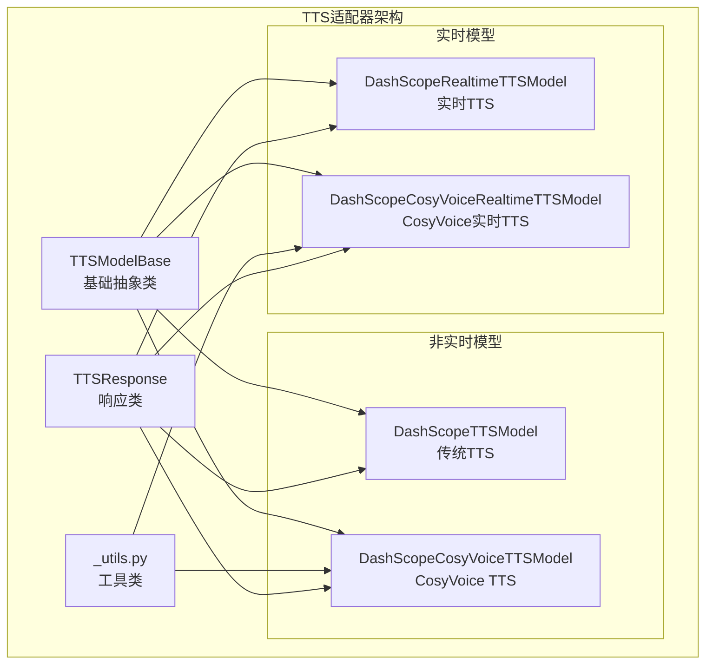
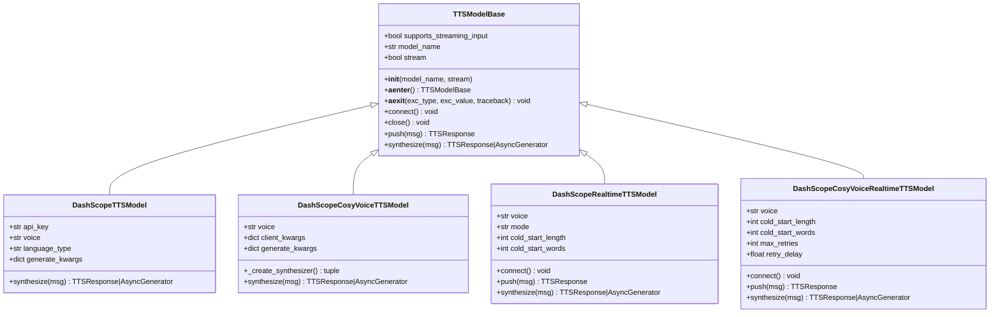
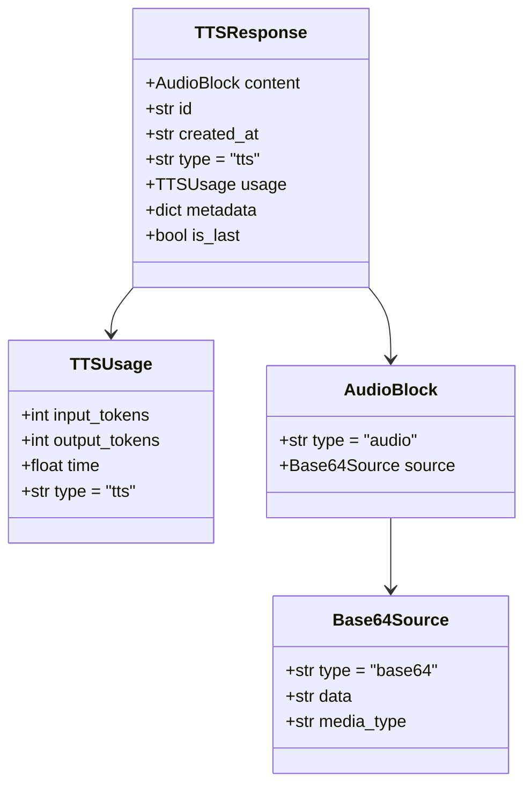
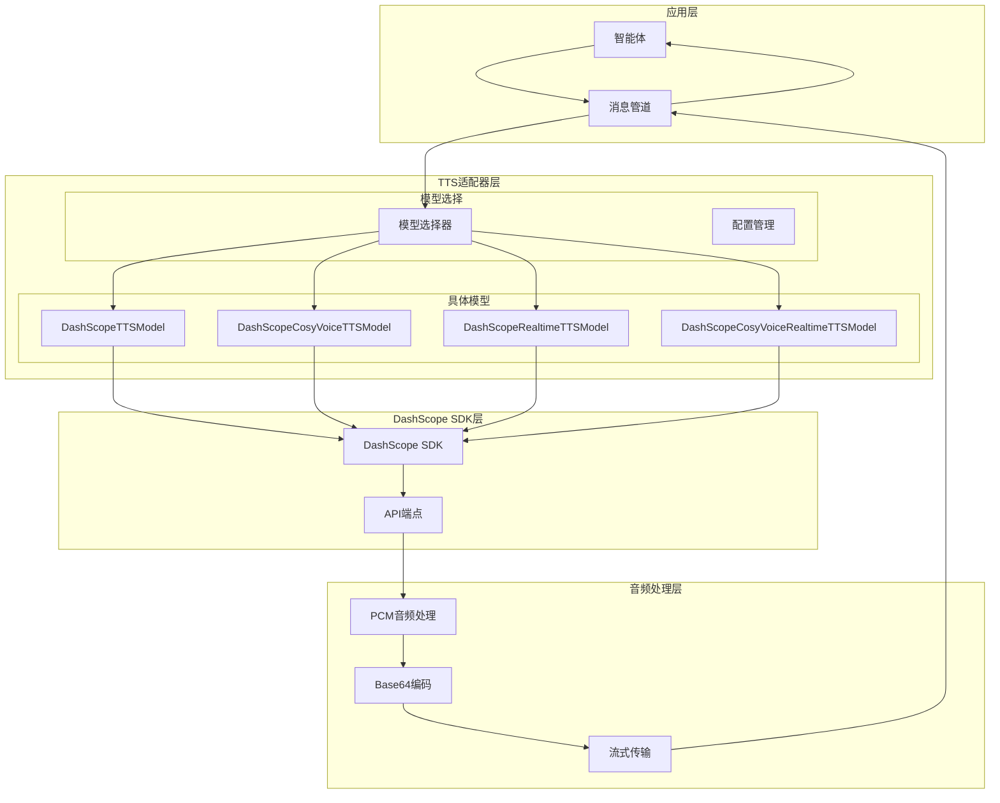
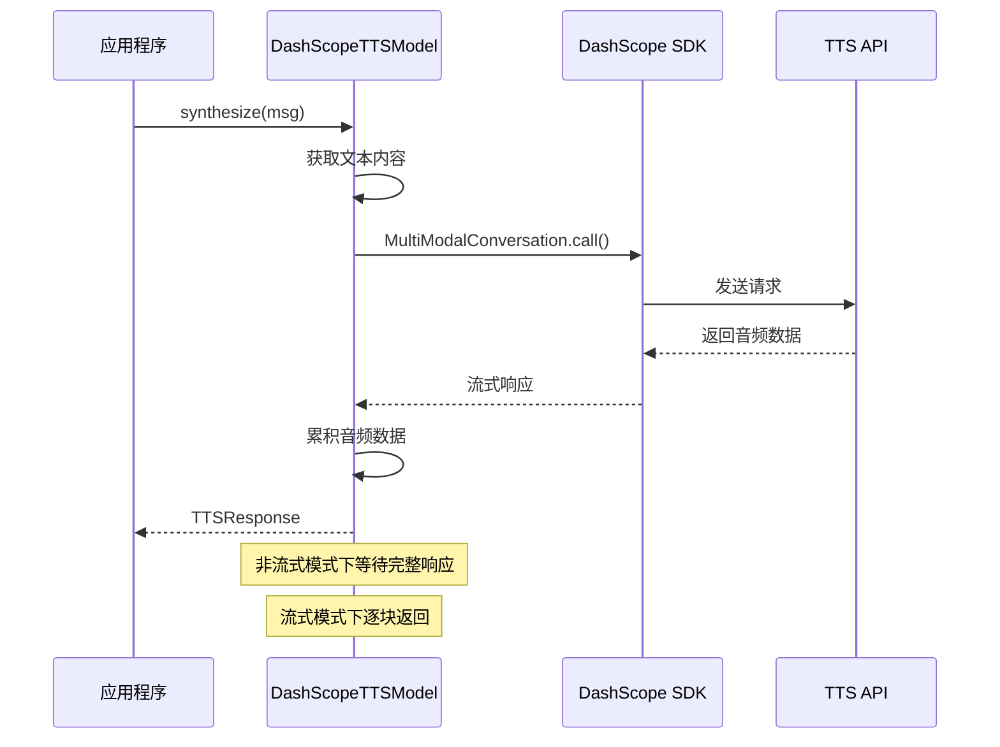
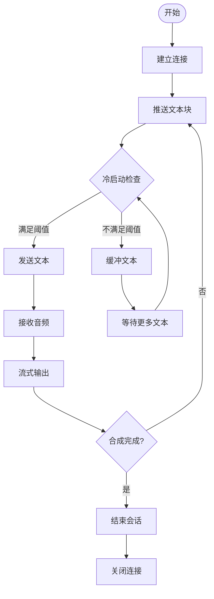
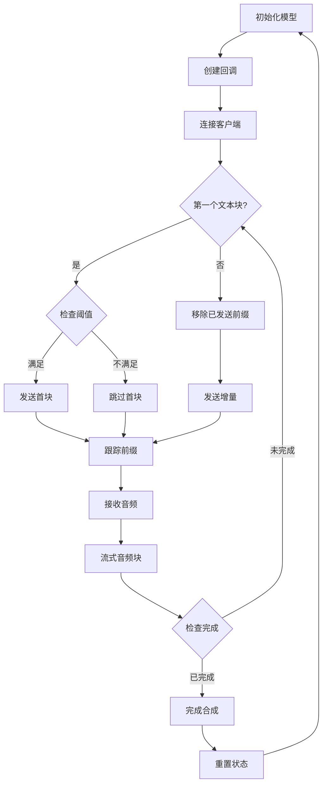
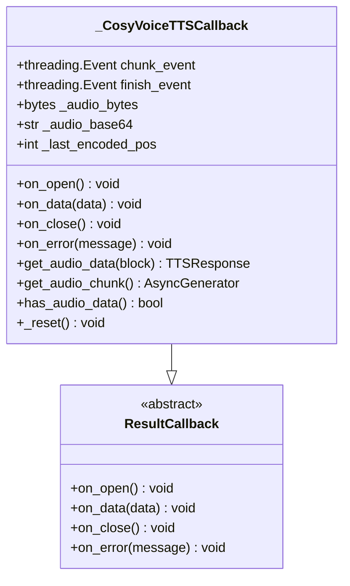
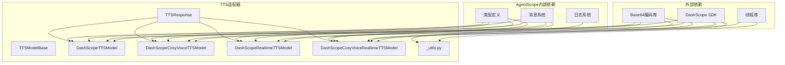
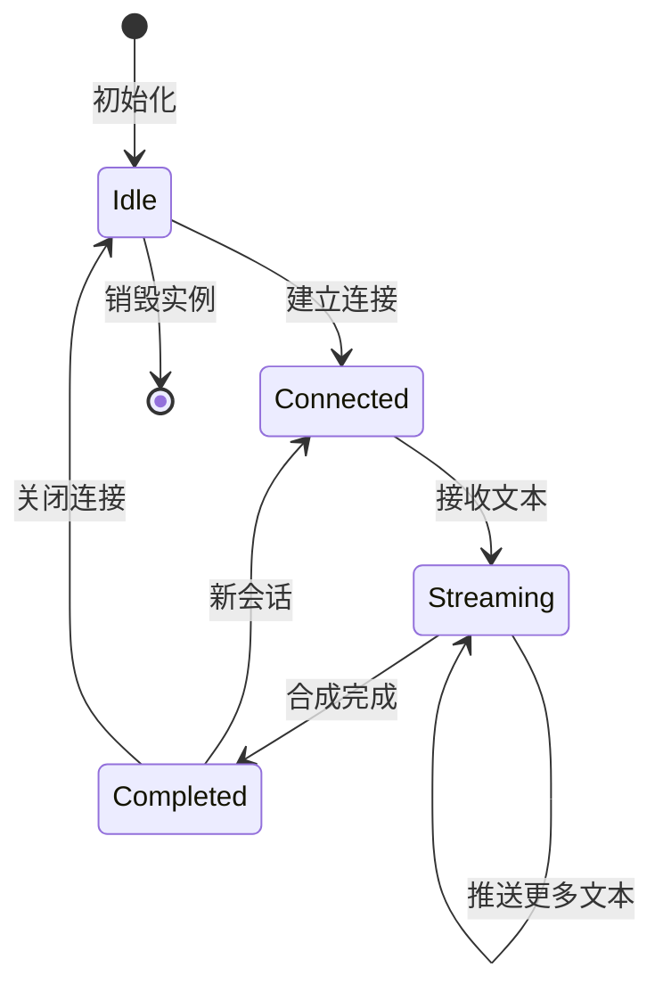

# DashScope TTS适配器

<cite>
**本文档引用的文件**
- [src/agentscope/tts/_dashscope_tts_model.py](file://src/agentscope/tts/_dashscope_tts_model.py)
- [src/agentscope/tts/_dashscope_cosyvoice_tts_model.py](file://src/agentscope/tts/_dashscope_cosyvoice_tts_model.py)
- [src/agentscope/tts/_dashscope_cosyvoice_realtime_tts_model.py](file://src/agentscope/tts/_dashscope_cosyvoice_realtime_tts_model.py)
- [src/agentscope/tts/_dashscope_realtime_tts_model.py](file://src/agentscope/tts/_dashscope_realtime_tts_model.py)
- [src/agentscope/tts/_tts_base.py](file://src/agentscope/tts/_tts_base.py)
- [src/agentscope/tts/_tts_response.py](file://src/agentscope/tts/_tts_response.py)
- [src/agentscope/tts/_utils.py](file://src/agentscope/tts/_utils.py)
- [tests/tts_dashscope_test.py](file://tests/tts_dashscope_test.py)
- [tests/tts_dashscope_cosyvoice_test.py](file://tests/tts_dashscope_cosyvoice_test.py)
- [docs/tutorial/zh_CN/src/task_tts.py](file://docs/tutorial/zh_CN/src/task_tts.py)
</cite>

## 目录
1. [简介](#简介)
2. [项目结构](#项目结构)
3. [核心组件](#核心组件)
4. [架构概览](#架构概览)
5. [详细组件分析](#详细组件分析)
6. [依赖关系分析](#依赖关系分析)
7. [性能考虑](#性能考虑)
8. [故障排除指南](#故障排除指南)
9. [结论](#结论)
10. [附录](#附录)

## 简介

DashScope TTS适配器是AgentScope框架中用于集成阿里云DashScope平台文本转语音服务的核心组件。该适配器提供了多种TTS模型实现，包括传统的非实时TTS、实时TTS以及专门针对中文优化的CosyVoice模型。

该适配器的主要特点：
- 支持多种DashScope TTS模型，包括qwen系列和cosyvoice系列
- 提供非实时和实时两种合成模式
- 专为中文语音合成优化，支持多方言和情感语音
- 完整的流式音频输出支持
- 统一的API接口，便于在AgentScope框架中使用

## 项目结构

DashScope TTS适配器位于AgentScope项目的tts模块中，采用清晰的分层架构设计：



**图表来源**
- [src/agentscope/tts/_tts_base.py:12-144](file://src/agentscope/tts/_tts_base.py#L12-L144)
- [src/agentscope/tts/_dashscope_tts_model.py:28-178](file://src/agentscope/tts/_dashscope_tts_model.py#L28-L178)
- [src/agentscope/tts/_dashscope_cosyvoice_tts_model.py:14-166](file://src/agentscope/tts/_dashscope_cosyvoice_tts_model.py#L14-L166)
- [src/agentscope/tts/_dashscope_realtime_tts_model.py:170-446](file://src/agentscope/tts/_dashscope_realtime_tts_model.py#L170-L446)
- [src/agentscope/tts/_dashscope_cosyvoice_realtime_tts_model.py:13-280](file://src/agentscope/tts/_dashscope_cosyvoice_realtime_tts_model.py#L13-L280)

**章节来源**
- [src/agentscope/tts/_tts_base.py:12-144](file://src/agentscope/tts/_tts_base.py#L12-L144)
- [src/agentscope/tts/_dashscope_tts_model.py:28-178](file://src/agentscope/tts/_dashscope_tts_model.py#L28-L178)
- [src/agentscope/tts/_dashscope_cosyvoice_tts_model.py:14-166](file://src/agentscope/tts/_dashscope_cosyvoice_tts_model.py#L14-L166)
- [src/agentscope/tts/_dashscope_realtime_tts_model.py:170-446](file://src/agentscope/tts/_dashscope_realtime_tts_model.py#L170-L446)
- [src/agentscope/tts/_dashscope_cosyvoice_realtime_tts_model.py:13-280](file://src/agentscope/tts/_dashscope_cosyvoice_realtime_tts_model.py#L13-L280)

## 核心组件

### TTS模型基类

TTSModelBase是所有DashScope TTS模型的抽象基类，定义了统一的接口规范：



**图表来源**
- [src/agentscope/tts/_tts_base.py:12-144](file://src/agentscope/tts/_tts_base.py#L12-L144)
- [src/agentscope/tts/_dashscope_tts_model.py:28-178](file://src/agentscope/tts/_dashscope_tts_model.py#L28-L178)
- [src/agentscope/tts/_dashscope_cosyvoice_tts_model.py:14-166](file://src/agentscope/tts/_dashscope_cosyvoice_tts_model.py#L14-L166)
- [src/agentscope/tts/_dashscope_realtime_tts_model.py:170-446](file://src/agentscope/tts/_dashscope_realtime_tts_model.py#L170-L446)
- [src/agentscope/tts/_dashscope_cosyvoice_realtime_tts_model.py:13-280](file://src/agentscope/tts/_dashscope_cosyvoice_realtime_tts_model.py#L13-L280)

### TTS响应类

TTSResponse类封装了TTS模型的输出结果，提供了统一的数据结构：



**图表来源**
- [src/agentscope/tts/_tts_response.py:13-56](file://src/agentscope/tts/_tts_response.py#L13-L56)

**章节来源**
- [src/agentscope/tts/_tts_base.py:12-144](file://src/agentscope/tts/_tts_base.py#L12-L144)
- [src/agentscope/tts/_tts_response.py:13-56](file://src/agentscope/tts/_tts_response.py#L13-L56)

## 架构概览

DashScope TTS适配器采用了模块化的架构设计，支持多种TTS模型和合成模式：



**图表来源**
- [src/agentscope/tts/_dashscope_tts_model.py:78-134](file://src/agentscope/tts/_dashscope_tts_model.py#L78-L134)
- [src/agentscope/tts/_dashscope_cosyvoice_tts_model.py:115-166](file://src/agentscope/tts/_dashscope_cosyvoice_tts_model.py#L115-L166)
- [src/agentscope/tts/_dashscope_realtime_tts_model.py:379-446](file://src/agentscope/tts/_dashscope_realtime_tts_model.py#L379-L446)
- [src/agentscope/tts/_dashscope_cosyvoice_realtime_tts_model.py:215-280](file://src/agentscope/tts/_dashscope_cosyvoice_realtime_tts_model.py#L215-L280)

## 详细组件分析

### DashScope传统TTS模型

DashScopeTTSModel是基于MultiModalConversation API的传统TTS实现，适用于完整的文本输入场景：

#### 核心特性
- 支持流式和非流式输出
- 自动语言类型检测
- 多种预设音色选择
- 24kHz采样率输出

#### 配置参数详解

| 参数名称 | 类型 | 默认值 | 描述 |
|---------|------|--------|------|
| api_key | str | 必需 | DashScope API密钥 |
| model_name | str | "qwen3-tts-flash" | TTS模型名称 |
| voice | str | "Cherry" | 预设音色名称 |
| language_type | str | "Auto" | 语言类型设置 |
| stream | bool | True | 是否启用流式输出 |
| generate_kwargs | dict | None | 生成参数 |

#### 数据流处理



**图表来源**
- [src/agentscope/tts/_dashscope_tts_model.py:78-134](file://src/agentscope/tts/_dashscope_tts_model.py#L78-L134)

**章节来源**
- [src/agentscope/tts/_dashscope_tts_model.py:28-178](file://src/agentscope/tts/_dashscope_tts_model.py#L28-L178)

### DashScope CosyVoice TTS模型

DashScopeCosyVoiceTTSModel是专门为中文优化的TTS实现，支持更丰富的音色选择：

#### 支持的音色
- longanyang（男声）
- longanhuan（女声）
- longhuhu_v3（童声）
- longyingmu_v3（特殊音色）

#### 核心优势
- 更高的中文语音质量
- 支持多方言识别
- 优化的情感表达
- 更好的韵律控制

#### 音频格式
- PCM格式，24kHz采样率
- 单声道16位深度
- Base64编码传输

**章节来源**
- [src/agentscope/tts/_dashscope_cosyvoice_tts_model.py:14-166](file://src/agentscope/tts/_dashscope_cosyvoice_tts_model.py#L14-L166)

### 实时TTS模型

实时TTS模型专为流式文本生成场景设计，支持边生成边合成：

#### DashScope实时TTS模型



**图表来源**
- [src/agentscope/tts/_dashscope_realtime_tts_model.py:304-377](file://src/agentscope/tts/_dashscope_realtime_tts_model.py#L304-L377)

#### CosyVoice实时TTS模型

CosyVoice实时TTS模型具有更复杂的流式处理逻辑：



**图表来源**
- [src/agentscope/tts/_dashscope_cosyvoice_realtime_tts_model.py:144-213](file://src/agentscope/tts/_dashscope_cosyvoice_realtime_tts_model.py#L144-L213)

**章节来源**
- [src/agentscope/tts/_dashscope_realtime_tts_model.py:170-446](file://src/agentscope/tts/_dashscope_realtime_tts_model.py#L170-L446)
- [src/agentscope/tts/_dashscope_cosyvoice_realtime_tts_model.py:13-280](file://src/agentscope/tts/_dashscope_cosyvoice_realtime_tts_model.py#L13-L280)

### 工具类和回调机制

#### CosyVoice回调类

CosyVoice回调类实现了复杂的音频数据对齐和边界处理：



**图表来源**
- [src/agentscope/tts/_utils.py:18-198](file://src/agentscope/tts/_utils.py#L18-L198)

**章节来源**
- [src/agentscope/tts/_utils.py:18-198](file://src/agentscope/tts/_utils.py#L18-L198)

## 依赖关系分析

DashScope TTS适配器的依赖关系相对简洁，主要依赖于DashScope SDK和AgentScope内部组件：



**图表来源**
- [src/agentscope/tts/_dashscope_tts_model.py:1-25](file://src/agentscope/tts/_dashscope_tts_model.py#L1-L25)
- [src/agentscope/tts/_dashscope_cosyvoice_tts_model.py:1-11](file://src/agentscope/tts/_dashscope_cosyvoice_tts_model.py#L1-L11)
- [src/agentscope/tts/_dashscope_realtime_tts_model.py:1-11](file://src/agentscope/tts/_dashscope_realtime_tts_model.py#L1-L11)
- [src/agentscope/tts/_dashscope_cosyvoice_realtime_tts_model.py:1-10](file://src/agentscope/tts/_dashscope_cosyvoice_realtime_tts_model.py#L1-L10)
- [src/agentscope/tts/_utils.py:1-10](file://src/agentscope/tts/_utils.py#L1-L10)

**章节来源**
- [src/agentscope/tts/_dashscope_tts_model.py:1-25](file://src/agentscope/tts/_dashscope_tts_model.py#L1-L25)
- [src/agentscope/tts/_dashscope_cosyvoice_tts_model.py:1-11](file://src/agentscope/tts/_dashscope_cosyvoice_tts_model.py#L1-L11)
- [src/agentscope/tts/_dashscope_realtime_tts_model.py:1-11](file://src/agentscope/tts/_dashscope_realtime_tts_model.py#L1-L11)
- [src/agentscope/tts/_dashscope_cosyvoice_realtime_tts_model.py:1-10](file://src/agentscope/tts/_dashscope_cosyvoice_realtime_tts_model.py#L1-L10)
- [src/agentscope/tts/_utils.py:1-10](file://src/agentscope/tts/_utils.py#L1-L10)

## 性能考虑

### 流式处理优化

实时TTS模型通过以下机制优化性能：

1. **冷启动阈值**：避免短文本导致的音频中断
2. **增量发送**：只发送新增的文本部分
3. **事件驱动**：基于线程事件的异步处理
4. **内存管理**：及时清理音频缓冲区

### 音频处理优化

- **字节对齐**：确保PCM和Base64编码的边界对齐
- **批量处理**：按6字节块进行编码，提高效率
- **缓存策略**：合理管理音频数据的累积和传输

### 并发处理

实时TTS模型支持单个会话的并发处理，但不支持多个并发会话：



**图表来源**
- [src/agentscope/tts/_dashscope_realtime_tts_model.py:278-293](file://src/agentscope/tts/_dashscope_realtime_tts_model.py#L278-L293)

## 故障排除指南

### 常见问题及解决方案

#### API密钥问题
- **症状**：认证失败或权限不足
- **解决方案**：验证API密钥格式和权限范围

#### 模型选择问题
- **症状**：模型不可用或参数错误
- **解决方案**：检查模型名称和音色兼容性

#### 流式处理问题
- **症状**：音频断断续续或延迟过高
- **解决方案**：调整冷启动阈值和网络配置

#### 内存泄漏问题
- **症状**：长时间运行后内存占用持续增长
- **解决方案**：确保正确调用close()方法和资源清理

**章节来源**
- [tests/tts_dashscope_test.py:1-322](file://tests/tts_dashscope_test.py#L1-L322)
- [tests/tts_dashscope_cosyvoice_test.py:1-403](file://tests/tts_dashscope_cosyvoice_test.py#L1-L403)

## 结论

DashScope TTS适配器提供了完整的中文语音合成解决方案，具有以下优势：

1. **全面的模型支持**：涵盖传统和实时两种模式
2. **中文优化**：专门针对中文语音合成进行优化
3. **灵活的配置**：支持多种参数和音色选择
4. **统一的接口**：与AgentScope框架无缝集成
5. **完善的测试**：包含全面的单元测试覆盖

该适配器特别适合需要高质量中文语音合成的应用场景，如智能客服、语音助手、教育软件等。

## 附录

### 配置示例

#### 基础配置
```python
# 非实时TTS配置
tts_model = DashScopeTTSModel(
    api_key="your_api_key",
    model_name="qwen3-tts-flash",
    voice="Cherry",
    stream=False
)

# 实时TTS配置
realtime_model = DashScopeRealtimeTTSModel(
    api_key="your_api_key",
    model_name="qwen3-tts-flash-realtime",
    voice="Cherry",
    stream=True,
    cold_start_length=5,
    cold_start_words=2
)
```

#### 中文文本处理
```python
# 中文文本合成
msg = Msg(
    name="assistant",
    content="你好，欢迎使用DashScope TTS服务。",
    role="assistant"
)

response = await tts_model.synthesize(msg)
```

#### 多音色切换
```python
# 不同音色的配置
voices = ["Cherry", "Serena", "Ethan", "Chelsie"]

for voice in voices:
    model = DashScopeTTSModel(
        api_key="your_api_key",
        voice=voice
    )
    # 使用不同音色合成
```

#### 流式音频输出
```python
# 流式输出处理
async for tts_response in await tts_model.synthesize(msg):
    audio_data = tts_response.content["source"]["data"]
    # 处理音频块
    play_audio(audio_data)
```

### 跨平台迁移指南

#### 从其他TTS服务迁移
1. **API接口映射**：将其他服务的API调用映射到DashScope接口
2. **参数转换**：将音色、采样率等参数转换为DashScope格式
3. **错误处理**：统一错误处理机制
4. **性能优化**：根据DashScope的特点优化配置

#### 最佳实践
- 合理设置冷启动阈值以避免音频中断
- 使用流式输出减少感知延迟
- 适当配置重试机制处理网络异常
- 监控音频质量和延迟指标