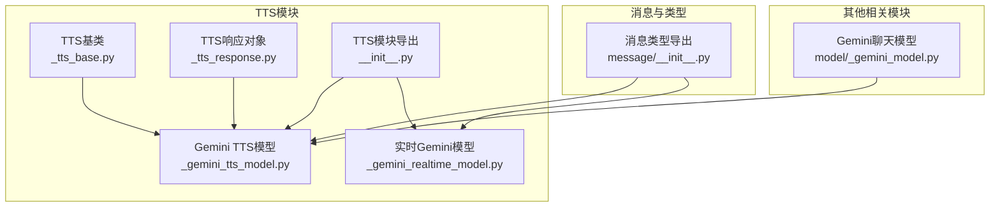
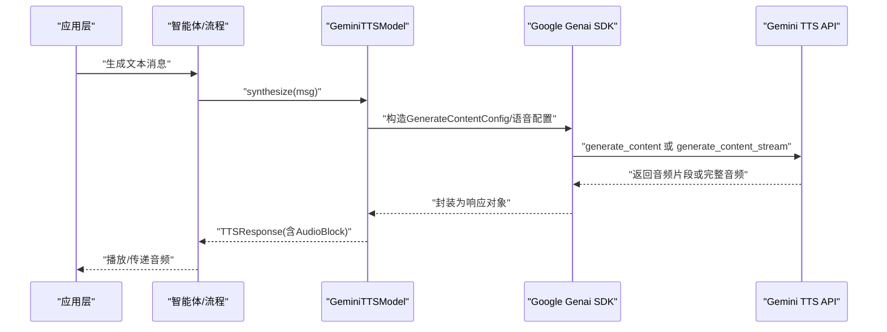
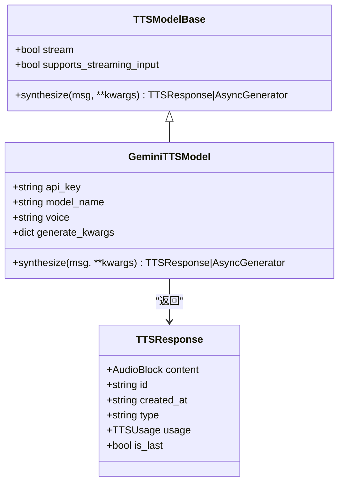
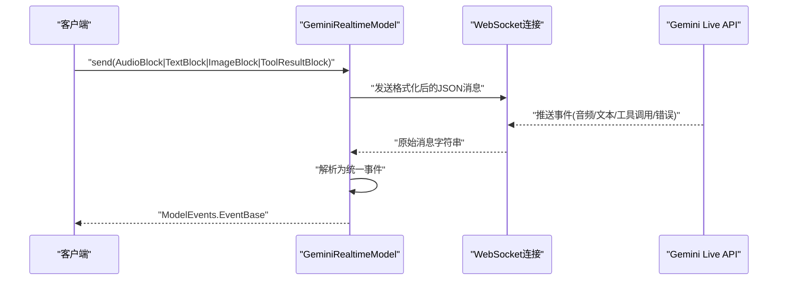
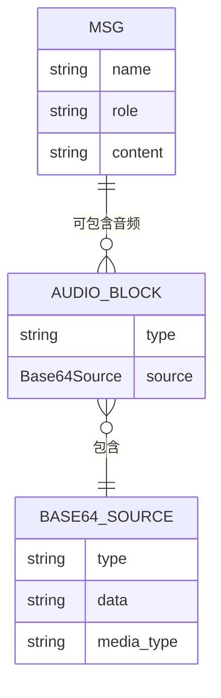
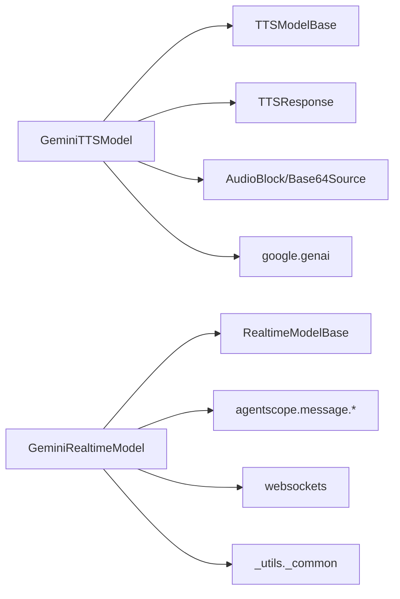

# Gemini TTS适配器

<cite>
**本文引用的文件列表**
- [GeminiTTSModel实现](file://src/agentscope/tts/_gemini_tts_model.py)
- [实时Gemini模型实现](file://src/agentscope/realtime/_gemini_realtime_model.py)
- [TTS基类](file://src/agentscope/tts/_tts_base.py)
- [TTS响应对象](file://src/agentscope/tts/_tts_response.py)
- [消息类型定义](file://src/agentscope/message/__init__.py)
- [Gemini聊天模型实现](file://src/agentscope/model/_gemini_model.py)
- [Gemini TTS单元测试](file://tests/tts_gemini_test.py)
- [TTS模块导出](file://src/agentscope/tts/__init__.py)
- [TTS使用示例（文档）](file://docs/tutorial/zh_CN/src/task_tts.py)
</cite>

## 目录
1. [简介](#简介)
2. [项目结构](#项目结构)
3. [核心组件](#核心组件)
4. [架构概览](#架构概览)
5. [详细组件分析](#详细组件分析)
6. [依赖关系分析](#依赖关系分析)
7. [性能考量](#性能考量)
8. [故障排查指南](#故障排查指南)
9. [结论](#结论)
10. [附录](#附录)

## 简介
本技术文档面向在AgentScope中使用Google Gemini平台TTS能力的开发者，系统性阐述Gemini TTS适配器的设计与实现，覆盖非实时语音合成、实时语音处理、多语言支持、配置参数、平台限制与性能优化等关键主题。文档同时提供可操作的配置示例与最佳实践，帮助读者快速集成并稳定运行。

## 项目结构
围绕Gemini TTS的相关代码主要位于agentscope/tts与agentscope/realtime两个子模块，并通过消息类型与响应对象进行数据流转。

图表来源
- [TTS基类:12-144](file://src/agentscope/tts/_tts_base.py#L12-L144)
- [TTS响应对象:13-56](file://src/agentscope/tts/_tts_response.py#L13-L56)
- [GeminiTTSModel实现:19-211](file://src/agentscope/tts/_gemini_tts_model.py#L19-L211)
- [实时Gemini模型实现:21-663](file://src/agentscope/realtime/_gemini_realtime_model.py#L21-L663)
- [消息类型定义:4-31](file://src/agentscope/message/__init__.py#L4-L31)
- [Gemini聊天模型实现:115-674](file://src/agentscope/model/_gemini_model.py#L115-L674)
- [TTS模块导出:4-25](file://src/agentscope/tts/__init__.py#L4-L25)

章节来源
- [TTS模块导出:4-25](file://src/agentscope/tts/__init__.py#L4-L25)
- [消息类型定义:4-31](file://src/agentscope/message/__init__.py#L4-L31)

## 核心组件
- GeminiTTSModel：非实时TTS模型，基于Google Genai SDK调用TTS API，支持流式与非流式输出，支持指定预置音色与额外生成参数。
- TTSModelBase：TTS抽象基类，定义了通用的生命周期与接口规范（synthesizer、push、connect、close等）。
- TTSResponse：封装TTS输出的响应对象，包含音频块、时间戳、类型标识与可选用量信息。
- GeminiRealtimeModel：实时Gemini模型，基于WebSocket与Live API实现双向交互，支持音频/文本/图像/工具结果输入，以及语音合成与转写事件解析。

章节来源
- [GeminiTTSModel实现:19-211](file://src/agentscope/tts/_gemini_tts_model.py#L19-L211)
- [TTS基类:12-144](file://src/agentscope/tts/_tts_base.py#L12-L144)
- [TTS响应对象:13-56](file://src/agentscope/tts/_tts_response.py#L13-L56)
- [实时Gemini模型实现:21-663](file://src/agentscope/realtime/_gemini_realtime_model.py#L21-L663)

## 架构概览
下图展示了Gemini TTS在AgentScope中的整体调用链路与数据流。

图表来源
- [GeminiTTSModel实现:79-173](file://src/agentscope/tts/_gemini_tts_model.py#L79-L173)
- [TTS响应对象:31-56](file://src/agentscope/tts/_tts_response.py#L31-L56)

## 详细组件分析

### GeminiTTSModel组件分析
- 角色定位：非实时TTS模型，适合一次性输入完整文本的场景；支持流式输出以降低感知延迟。
- 关键参数：
  - api_key：Google Gemini API密钥
  - model_name：TTS模型名称，默认“gemini-2.5-flash-preview-tts”，支持“gemini-2.5-pro-preview-tts”等
  - voice：预置音色，支持“Zephyr”、“Kore”、“Orus”、“Autonoe”
  - stream：是否启用流式合成
  - client_kwargs/generate_kwargs：传递给Genai客户端与生成调用的额外参数
- 合成流程：
  - 非流式：调用generate_content，解析候选内容中的inline_data，封装为AudioBlock
  - 流式：调用generate_content_stream，逐块拼接base64音频数据，持续产出TTSResponse
- 返回值：TTSResponse，content为AudioBlock，包含base64音频数据与媒体类型

图表来源
- [TTS基类:12-144](file://src/agentscope/tts/_tts_base.py#L12-L144)
- [GeminiTTSModel实现:19-211](file://src/agentscope/tts/_gemini_tts_model.py#L19-L211)
- [TTS响应对象:13-56](file://src/agentscope/tts/_tts_response.py#L13-L56)

章节来源
- [GeminiTTSModel实现:28-173](file://src/agentscope/tts/_gemini_tts_model.py#L28-L173)
- [TTS基类:12-144](file://src/agentscope/tts/_tts_base.py#L12-L144)
- [TTS响应对象:13-56](file://src/agentscope/tts/_tts_response.py#L13-L56)

### 实时Gemini模型组件分析
- 角色定位：实时语音模型，基于WebSocket与Live API，支持音频/文本/图像/工具结果输入，以及语音合成与转写事件解析。
- 关键参数：
  - model_name：实时模型名称，如“gemini-2.5-flash-native-audio-preview-09-2025”
  - api_key：认证密钥
  - voice：语音音色，支持“Puck”、“Charon”、“Kore”、“Fenrir”
  - enable_input_audio_transcription：是否启用输入音频转写
- 采样率约定：输入16kHz，输出24kHz
- 输入模态：audio、text、image、tool_result
- 事件解析：setupComplete、serverContent（含modelTurn、outputTranscription、inputTranscription、generationComplete、turnComplete）、toolCall、toolCallCancellation、error等

图表来源
- [实时Gemini模型实现:175-250](file://src/agentscope/realtime/_gemini_realtime_model.py#L175-L250)
- [实时Gemini模型实现:251-322](file://src/agentscope/realtime/_gemini_realtime_model.py#L251-L322)
- [实时Gemini模型实现:408-476](file://src/agentscope/realtime/_gemini_realtime_model.py#L408-L476)

章节来源
- [实时Gemini模型实现:50-150](file://src/agentscope/realtime/_gemini_realtime_model.py#L50-L150)
- [实时Gemini模型实现:175-322](file://src/agentscope/realtime/_gemini_realtime_model.py#L175-L322)
- [实时Gemini模型实现:408-516](file://src/agentscope/realtime/_gemini_realtime_model.py#L408-L516)

### 数据模型与消息类型
- AudioBlock/TextBlock/ImageBlock/ToolUseBlock/ToolResultBlock：统一的消息块类型，用于承载不同模态的数据。
- Base64Source/URLSource：音频数据的两种来源形式，便于在不同场景下传输。
- Msg：消息容器，TTS模型通过其文本内容驱动合成。

图表来源
- [消息类型定义:4-31](file://src/agentscope/message/__init__.py#L4-L31)
- [GeminiTTSModel实现:151-158](file://src/agentscope/tts/_gemini_tts_model.py#L151-L158)

章节来源
- [消息类型定义:4-31](file://src/agentscope/message/__init__.py#L4-L31)
- [GeminiTTSModel实现:151-158](file://src/agentscope/tts/_gemini_tts_model.py#L151-L158)

## 依赖关系分析
- GeminiTTSModel依赖：
  - TTSModelBase：继承抽象接口
  - TTSResponse/AudioBlock/Base64Source：封装输出
  - google.genai.Client/types：调用TTS API
- 实时Gemini模型依赖：
  - RealtimeModelBase：实时模型抽象
  - websockets.State：WebSocket状态管理
  - agentscope.message.*：统一消息块类型
  - agentscope._utils._common：网络资源下载辅助

图表来源
- [GeminiTTSModel实现:6-16](file://src/agentscope/tts/_gemini_tts_model.py#L6-L16)
- [实时Gemini模型实现:8-18](file://src/agentscope/realtime/_gemini_realtime_model.py#L8-L18)
- [TTS模块导出:4-25](file://src/agentscope/tts/__init__.py#L4-L25)

章节来源
- [GeminiTTSModel实现:6-16](file://src/agentscope/tts/_gemini_tts_model.py#L6-L16)
- [实时Gemini模型实现:8-18](file://src/agentscope/realtime/_gemini_realtime_model.py#L8-L18)
- [TTS模块导出:4-25](file://src/agentscope/tts/__init__.py#L4-L25)

## 性能考量
- 流式输出降低感知延迟：非实时模式下开启stream=True可提前返回音频片段，提升用户体验。
- 音频拼接与累积：流式模式下按块累积base64音频数据，最终yield空内容标记结束。
- 实时模型的采样率与事件节奏：输入16kHz、输出24kHz，需确保上游音频源与下游播放设备匹配。
- 错误与中断处理：实时模型对toolCallCancellation、turnComplete、interrupted等事件进行处理，保证会话一致性。

章节来源
- [GeminiTTSModel实现:126-173](file://src/agentscope/tts/_gemini_tts_model.py#L126-L173)
- [实时Gemini模型实现:408-476](file://src/agentscope/realtime/_gemini_realtime_model.py#L408-L476)

## 故障排查指南
- 初始化失败：确认已安装google-genai SDK并正确传入api_key与model_name。
- 未返回音频：检查GenerateContentResponse的candidates/content/parts结构是否存在inline_data。
- 流式异常：验证generate_content_stream返回迭代器是否被正确消费，注意最终yield空内容。
- 实时模型未连接：send前需确保WebSocket已connect且状态为OPEN。
- 不支持的输入类型：实时模型仅支持audio、text、image、tool_result四种模态。

章节来源
- [GeminiTTSModel实现:132-173](file://src/agentscope/tts/_gemini_tts_model.py#L132-L173)
- [实时Gemini模型实现:185-250](file://src/agentscope/realtime/_gemini_realtime_model.py#L185-L250)
- [GeminiTTSModel实现:174-210](file://src/agentscope/tts/_gemini_tts_model.py#L174-L210)

## 结论
Gemini TTS适配器在AgentScope中提供了简洁一致的接口，既支持非实时的高质量合成，也支持实时的低延迟交互。通过合理的参数配置与事件处理，可在多语言、多模态场景下稳定运行。建议优先采用流式输出以优化延迟，并在实时场景下严格遵循采样率与事件解析规范。

## 附录

### 配置参数与示例
- 非实时TTS（推荐）
  - 参数要点：api_key、model_name（如“gemini-2.5-flash-preview-tts”）、voice（如“Kore”）、stream（True/False）
  - 使用路径：[GeminiTTSModel实现:28-77](file://src/agentscope/tts/_gemini_tts_model.py#L28-L77)
- 实时TTS（推荐）
  - 参数要点：model_name（如“gemini-2.5-flash-native-audio-preview-09-2025”）、api_key、voice（如“Puck”）、enable_input_audio_transcription
  - 使用路径：[实时Gemini模型实现:50-82](file://src/agentscope/realtime/_gemini_realtime_model.py#L50-L82)
- 单元测试参考
  - 初始化与非流式/流式合成行为验证：[GeminiTTSModel实现:62-167](file://tests/tts_gemini_test.py#L62-L167)

章节来源
- [GeminiTTSModel实现:28-77](file://src/agentscope/tts/_gemini_tts_model.py#L28-L77)
- [实时Gemini模型实现:50-82](file://src/agentscope/realtime/_gemini_realtime_model.py#L50-L82)
- [GeminiTTSModel实现:62-167](file://tests/tts_gemini_test.py#L62-L167)