# OpenAI TTS适配器

<cite>
**本文档引用的文件**
- [src/agentscope/tts/_openai_tts_model.py](file://src/agentscope/tts/_openai_tts_model.py)
- [src/agentscope/tts/_tts_base.py](file://src/agentscope/tts/_tts_base.py)
- [src/agentscope/tts/_tts_response.py](file://src/agentscope/tts/_tts_response.py)
- [src/agentscope/tts/_gemini_tts_model.py](file://src/agentscope/tts/_gemini_tts_model.py)
- [src/agentscope/message/_message_block.py](file://src/agentscope/message/_message_block.py)
- [src/agentscope/model/_openai_model.py](file://src/agentscope/model/_openai_model.py)
- [tests/tts_openai_test.py](file://tests/tts_openai_test.py)
- [docs/tutorial/zh_CN/src/task_tts.py](file://docs/tutorial/zh_CN/src/task_tts.py)
</cite>

## 目录
1. [简介](#简介)
2. [项目结构](#项目结构)
3. [核心组件](#核心组件)
4. [架构概览](#架构概览)
5. [详细组件分析](#详细组件分析)
6. [配置参数详解](#配置参数详解)
7. [模型支持情况](#模型支持情况)
8. [功能特性](#功能特性)
9. [依赖关系分析](#依赖关系分析)
10. [性能考虑](#性能考虑)
11. [故障排除指南](#故障排除指南)
12. [结论](#结论)

## 简介

OpenAI TTS适配器是AgentScope框架中用于集成OpenAI语音合成服务的核心组件。该适配器实现了标准的TTS接口，支持非实时和流式语音合成，为智能体应用提供高质量的语音输出能力。

该适配器基于OpenAI的Audio API，支持多种语音模型和音色选择，能够将文本内容转换为自然流畅的语音输出。通过统一的接口设计，开发者可以轻松地在AgentScope项目中集成OpenAI的语音合成能力。

## 项目结构

OpenAI TTS适配器位于AgentScope项目的TTS模块中，采用清晰的分层架构设计：

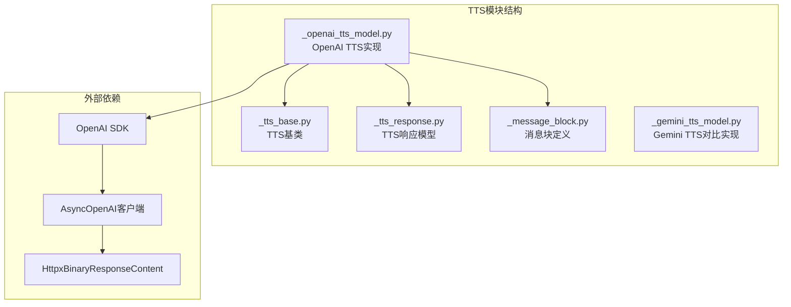

**图表来源**
- [src/agentscope/tts/_openai_tts_model.py:1-185](file://src/agentscope/tts/_openai_tts_model.py#L1-L185)
- [src/agentscope/tts/_tts_base.py:1-144](file://src/agentscope/tts/_tts_base.py#L1-L144)

**章节来源**
- [src/agentscope/tts/_openai_tts_model.py:1-185](file://src/agentscope/tts/_openai_tts_model.py#L1-L185)
- [src/agentscope/tts/_tts_base.py:1-144](file://src/agentscope/tts/_tts_base.py#L1-L144)

## 核心组件

OpenAI TTS适配器由以下几个核心组件构成：

### 主要类层次结构

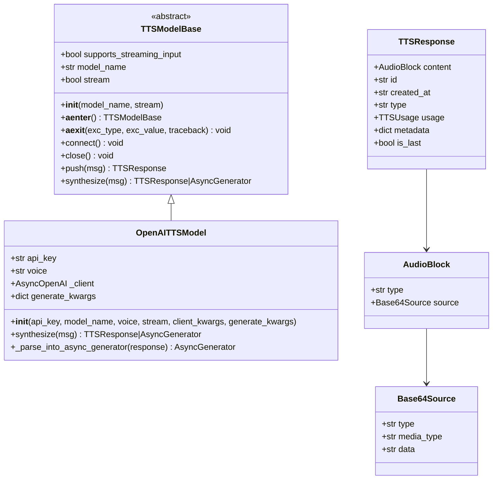

**图表来源**
- [src/agentscope/tts/_tts_base.py:12-144](file://src/agentscope/tts/_tts_base.py#L12-L144)
- [src/agentscope/tts/_openai_tts_model.py:17-185](file://src/agentscope/tts/_openai_tts_model.py#L17-L185)
- [src/agentscope/tts/_tts_response.py:13-56](file://src/agentscope/tts/_tts_response.py#L13-L56)
- [src/agentscope/message/_message_block.py:59-66](file://src/agentscope/message/_message_block.py#L59-L66)

### 关键特性

1. **异步流式处理**: 支持异步流式语音合成，提供低延迟的音频输出
2. **多模型支持**: 支持gpt-4o-mini-tts和tts-1等多种OpenAI语音模型
3. **音色选择**: 提供alloy、ash、ballad、coral等音色选项
4. **统一接口**: 遵循AgentScope的TTS接口规范，易于集成

**章节来源**
- [src/agentscope/tts/_openai_tts_model.py:17-185](file://src/agentscope/tts/_openai_tts_model.py#L17-L185)
- [src/agentscope/tts/_tts_base.py:12-144](file://src/agentscope/tts/_tts_base.py#L12-L144)

## 架构概览

OpenAI TTS适配器采用分层架构设计，确保了良好的可扩展性和可维护性：

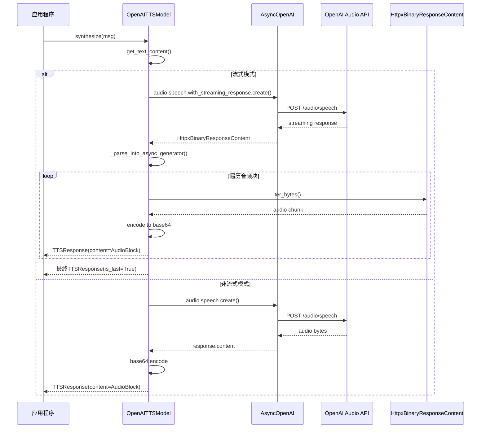

**图表来源**
- [src/agentscope/tts/_openai_tts_model.py:76-136](file://src/agentscope/tts/_openai_tts_model.py#L76-L136)
- [src/agentscope/tts/_openai_tts_model.py:138-185](file://src/agentscope/tts/_openai_tts_model.py#L138-L185)

## 详细组件分析

### OpenAITTSModel类实现

OpenAITTSModel是OpenAI TTS适配器的核心实现类，负责处理所有语音合成逻辑：

#### 初始化过程

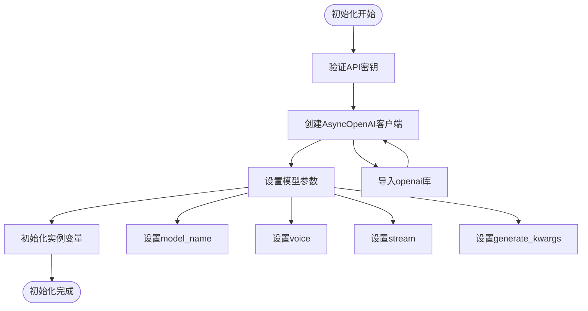

**图表来源**
- [src/agentscope/tts/_openai_tts_model.py:26-75](file://src/agentscope/tts/_openai_tts_model.py#L26-L75)

#### 语音合成流程

OpenAITTSModel的synthesize方法实现了完整的语音合成流程：

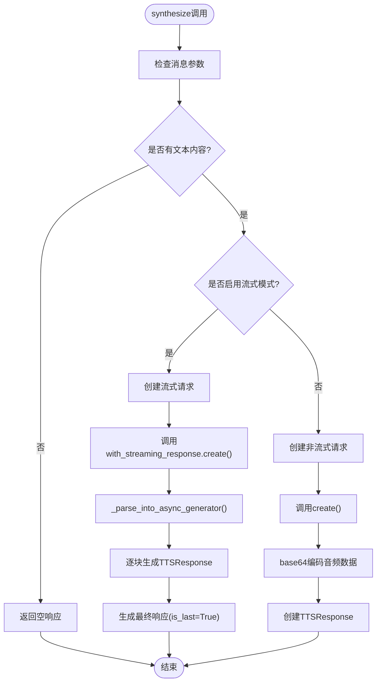

**图表来源**
- [src/agentscope/tts/_openai_tts_model.py:76-136](file://src/agentscope/tts/_openai_tts_model.py#L76-L136)

**章节来源**
- [src/agentscope/tts/_openai_tts_model.py:17-185](file://src/agentscope/tts/_openai_tts_model.py#L17-L185)

### TTSResponse数据结构

TTSResponse是TTS模型的标准响应对象，封装了语音合成的结果：

#### 数据结构定义

| 字段名 | 类型 | 描述 | 默认值 |
|--------|------|------|--------|
| content | AudioBlock \| None | 音频内容块 | None |
| id | str | 响应唯一标识符 | 时间戳生成 |
| created_at | str | 创建时间 | 当前时间 |
| type | Literal["tts"] | 响应类型 | "tts" |
| usage | TTSUsage \| None | 使用统计信息 | None |
| metadata | dict \| None | 元数据信息 | None |
| is_last | bool | 是否为最后响应 | True |

#### AudioBlock结构

AudioBlock用于封装音频数据，支持多种媒体类型：

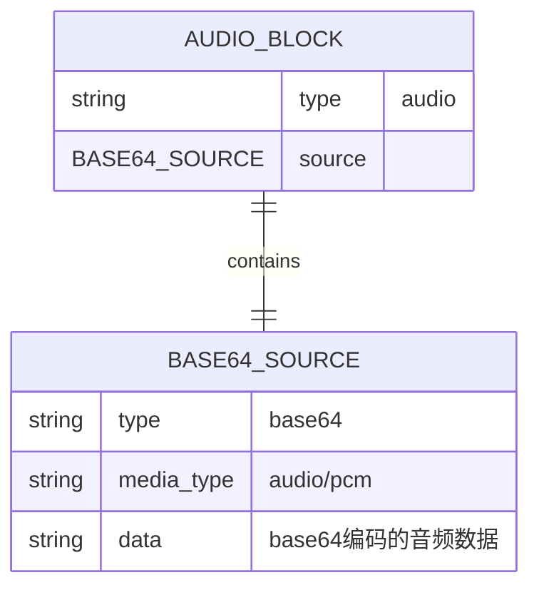

**图表来源**
- [src/agentscope/tts/_tts_response.py:30-56](file://src/agentscope/tts/_tts_response.py#L30-L56)
- [src/agentscope/message/_message_block.py:59-66](file://src/agentscope/message/_message_block.py#L59-L66)

**章节来源**
- [src/agentscope/tts/_tts_response.py:13-56](file://src/agentscope/tts/_tts_response.py#L13-L56)
- [src/agentscope/message/_message_block.py:26-66](file://src/agentscope/message/_message_block.py#L26-L66)

## 配置参数详解

OpenAI TTS适配器提供了丰富的配置参数，支持灵活的定制化需求：

### 基础配置参数

| 参数名 | 类型 | 必需 | 默认值 | 描述 |
|--------|------|------|--------|------|
| api_key | str | 是 | - | OpenAI API密钥 |
| model_name | str | 否 | "gpt-4o-mini-tts" | TTS模型名称 |
| voice | str | 否 | "alloy" | 语音音色选择 |
| stream | bool | 否 | True | 是否启用流式合成 |
| client_kwargs | dict \| None | 否 | None | 客户端初始化参数 |
| generate_kwargs | dict \| None | 否 | None | 生成参数配置 |

### 支持的音色选项

OpenAI TTS支持以下预定义音色：

| 音色名称 | 代码值 | 特点描述 |
|----------|--------|----------|
| alloy | "alloy" | 现代、清晰的男声 |
| ash | "ash" | 温暖、友好的人声 |
| ballad | "ballad" | 柔和、抒情的女声 |
| coral | "coral" | 明亮、活泼的儿童声音 |

### 生成参数配置

generate_kwargs支持传递给OpenAI API的各种参数：

| 参数名 | 类型 | 描述 | 示例值 |
|--------|------|------|--------|
| temperature | float | 采样温度 | 0.7 |
| seed | int | 随机种子 | 42 |
| response_format | str | 响应格式 | "pcm" |
| speed | float | 语速控制 | 1.0 |

**章节来源**
- [src/agentscope/tts/_openai_tts_model.py:26-75](file://src/agentscope/tts/_openai_tts_model.py#L26-L75)

## 模型支持情况

### 支持的OpenAI TTS模型

OpenAI TTS适配器支持以下主要模型：

#### gpt-4o-mini-tts模型
- **特点**: 专为语音合成优化的小型模型
- **优势**: 低延迟、高效率
- **适用场景**: 实时语音合成、嵌入式应用

#### tts-1模型
- **特点**: 标准质量的语音合成模型
- **优势**: 平衡的音质和性能
- **适用场景**: 通用语音合成应用

#### tts-1-hd模型
- **特点**: 高质量的语音合成模型
- **优势**: 更接近人类语音的自然度
- **适用场景**: 对音质要求较高的应用

### 模型选择指南

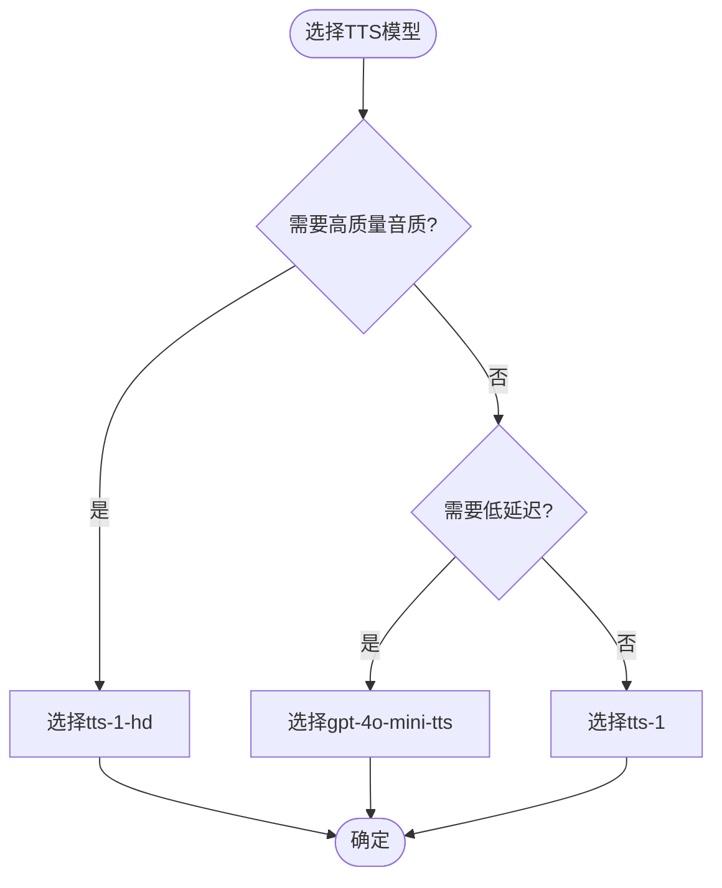

**图表来源**
- [src/agentscope/tts/_openai_tts_model.py:45-51](file://src/agentscope/tts/_openai_tts_model.py#L45-L51)

**章节来源**
- [src/agentscope/tts/_openai_tts_model.py:45-51](file://src/agentscope/tts/_openai_tts_model.py#L45-L51)

## 功能特性

### 异步流式处理

OpenAI TTS适配器实现了完整的异步流式处理机制：

#### 流式响应解析

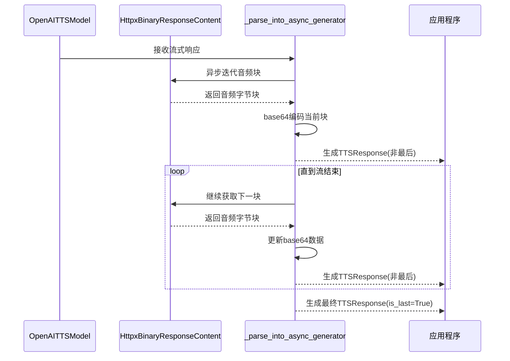

**图表来源**
- [src/agentscope/tts/_openai_tts_model.py:138-185](file://src/agentscope/tts/_openai_tts_model.py#L138-L185)

#### 流式处理优势

1. **低延迟**: 音频块到达即可播放，减少感知延迟
2. **内存效率**: 逐块处理，避免大文件缓存
3. **实时反馈**: 用户可以及时听到部分音频内容

### PCM音频格式输出

OpenAI TTS适配器默认输出PCM格式的音频数据：

#### PCM格式特性

| 特性 | 描述 |
|------|------|
| 编码格式 | Pulse Code Modulation |
| 采样率 | 24kHz |
| 位深度 | 16-bit |
| 声道数 | 单声道 |
| 文件扩展名 | .pcm |

#### PCM格式优势

1. **无损质量**: 保持原始音频质量
2. **兼容性强**: 支持各种音频播放设备
3. **处理效率**: 便于后续音频处理和转换

**章节来源**
- [src/agentscope/tts/_openai_tts_model.py:106-117](file://src/agentscope/tts/_openai_tts_model.py#L106-L117)
- [src/agentscope/tts/_openai_tts_model.py:177-181](file://src/agentscope/tts/_openai_tts_model.py#L177-L181)

## 依赖关系分析

### 外部依赖

OpenAI TTS适配器依赖以下外部库和组件：

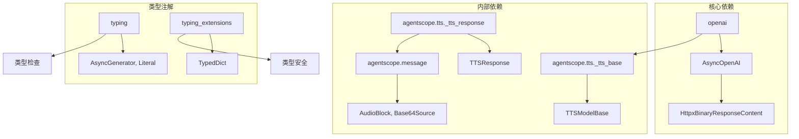

**图表来源**
- [src/agentscope/tts/_openai_tts_model.py:3-14](file://src/agentscope/tts/_openai_tts_model.py#L3-L14)

### 内部耦合关系

OpenAI TTS适配器与AgentScope框架的其他组件存在以下耦合关系：

1. **消息系统集成**: 通过Msg类和AudioBlock实现音频数据的封装
2. **响应格式标准化**: 遵循TTSResponse的标准格式
3. **异步处理框架**: 利用Python的异步I/O模型

**章节来源**
- [src/agentscope/tts/_openai_tts_model.py:6-8](file://src/agentscope/tts/_openai_tts_model.py#L6-L8)

## 性能考虑

### 流式处理性能优化

OpenAI TTS适配器在流式处理方面采用了多项性能优化策略：

#### 内存管理优化

1. **按块处理**: 仅缓存当前音频块，避免大文件内存占用
2. **增量编码**: 逐块进行base64编码，减少CPU开销
3. **异步I/O**: 使用异步流式处理，提高并发性能

#### 网络传输优化

1. **HTTP/2支持**: 利用现代HTTP协议的多路复用特性
2. **连接池管理**: 复用HTTP连接，减少握手开销
3. **超时控制**: 合理设置请求超时，避免资源泄露

### 并发处理能力

OpenAI TTS适配器支持高并发的语音合成请求：

#### 并发模型

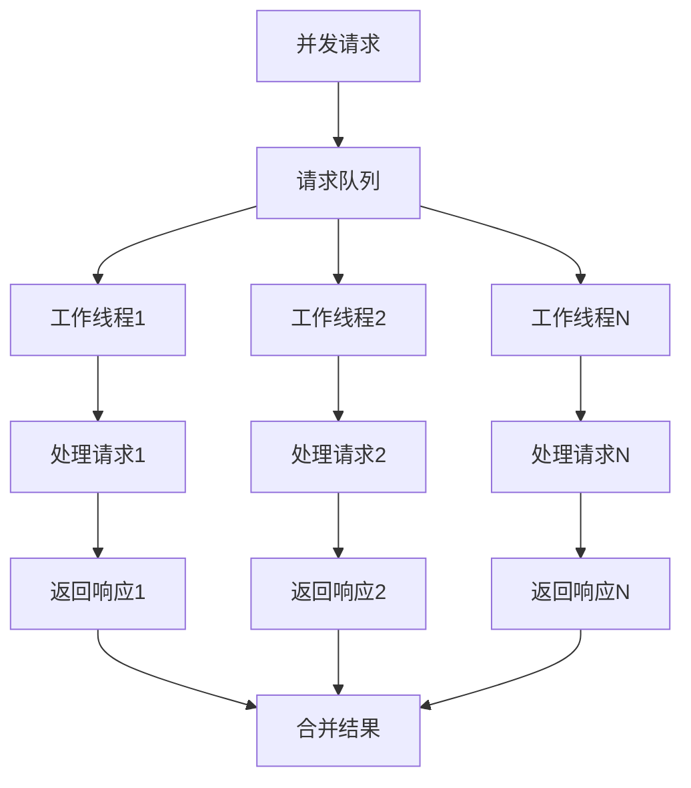

**图表来源**
- [src/agentscope/tts/_openai_tts_model.py:100-110](file://src/agentscope/tts/_openai_tts_model.py#L100-L110)

## 故障排除指南

### 常见问题及解决方案

#### API密钥相关问题

**问题**: `AuthenticationError` 或 `Invalid API Key`

**解决方案**:
1. 验证API密钥的有效性
2. 检查API密钥的权限范围
3. 确认API密钥未过期

#### 模型不支持问题

**问题**: `Invalid model name` 错误

**解决方案**:
1. 确认使用的模型名称正确
2. 检查模型是否在当前账户权限范围内
3. 验证模型名称拼写

#### 流式处理异常

**问题**: 流式响应中断或数据丢失

**解决方案**:
1. 检查网络连接稳定性
2. 增加请求超时时间
3. 实现重试机制

### 错误处理策略

OpenAI TTS适配器实现了完善的错误处理机制：

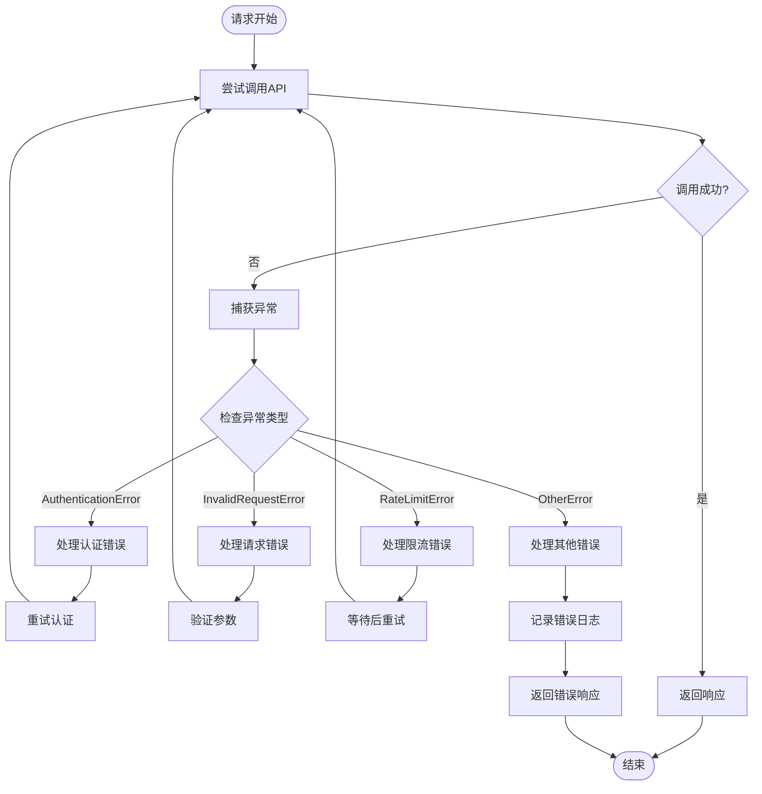

**图表来源**
- [tests/tts_openai_test.py:19-136](file://tests/tts_openai_test.py#L19-L136)

**章节来源**
- [tests/tts_openai_test.py:19-136](file://tests/tts_openai_test.py#L19-L136)

## 结论

OpenAI TTS适配器为AgentScope框架提供了强大而灵活的语音合成能力。通过其标准化的接口设计、高效的流式处理机制和丰富的配置选项，开发者可以轻松地在智能体应用中集成高质量的语音输出功能。

### 主要优势

1. **标准化接口**: 遵循AgentScope的统一TTS接口规范
2. **高性能处理**: 支持异步流式处理，提供低延迟音频输出
3. **灵活配置**: 支持多种模型和音色选择，满足不同应用场景需求
4. **健壮性**: 完善的错误处理和异常恢复机制

### 发展方向

未来可以在以下方面进一步改进：
1. **模型扩展**: 支持更多OpenAI语音模型
2. **性能优化**: 进一步提升流式处理的性能表现
3. **功能增强**: 添加更多音频处理和转换功能
4. **监控完善**: 增强使用统计和性能监控能力

通过持续的优化和改进，OpenAI TTS适配器将继续为AgentScope生态系统提供可靠的语音合成服务。