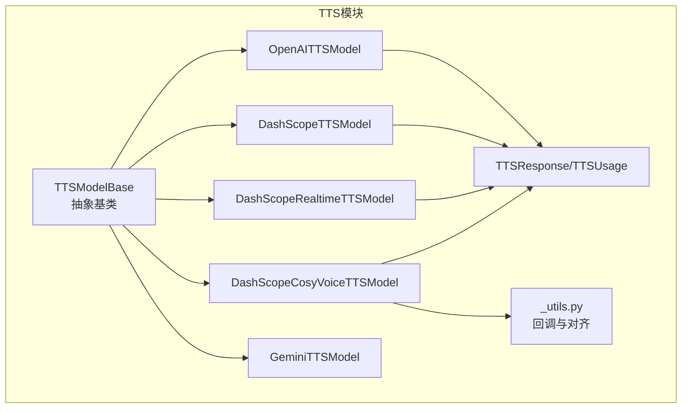
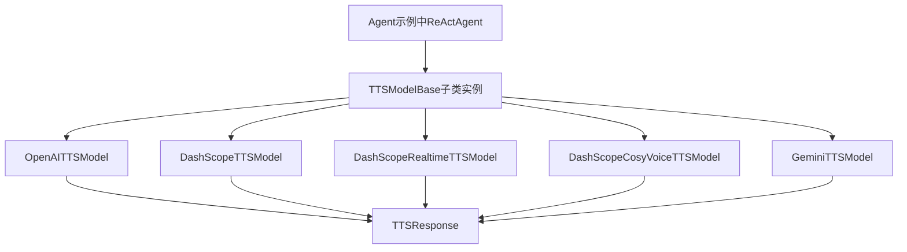
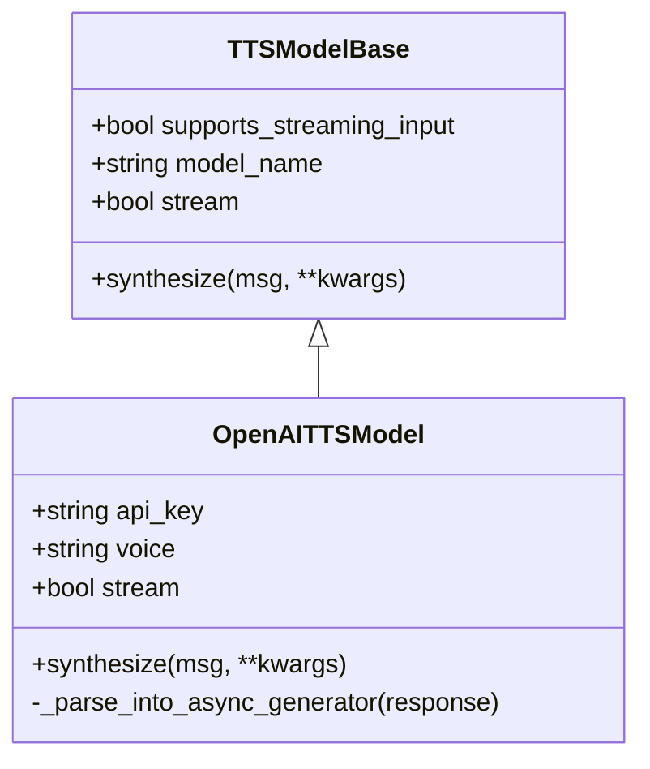
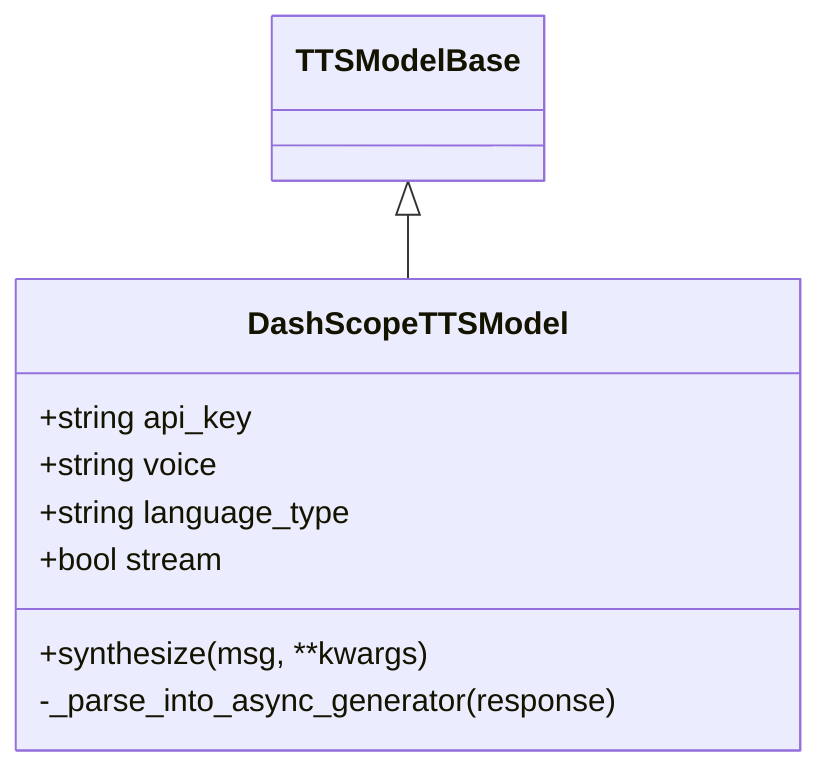
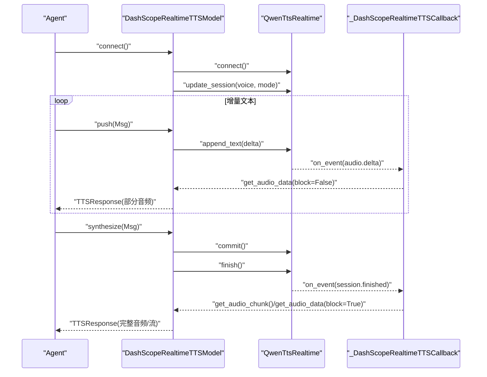
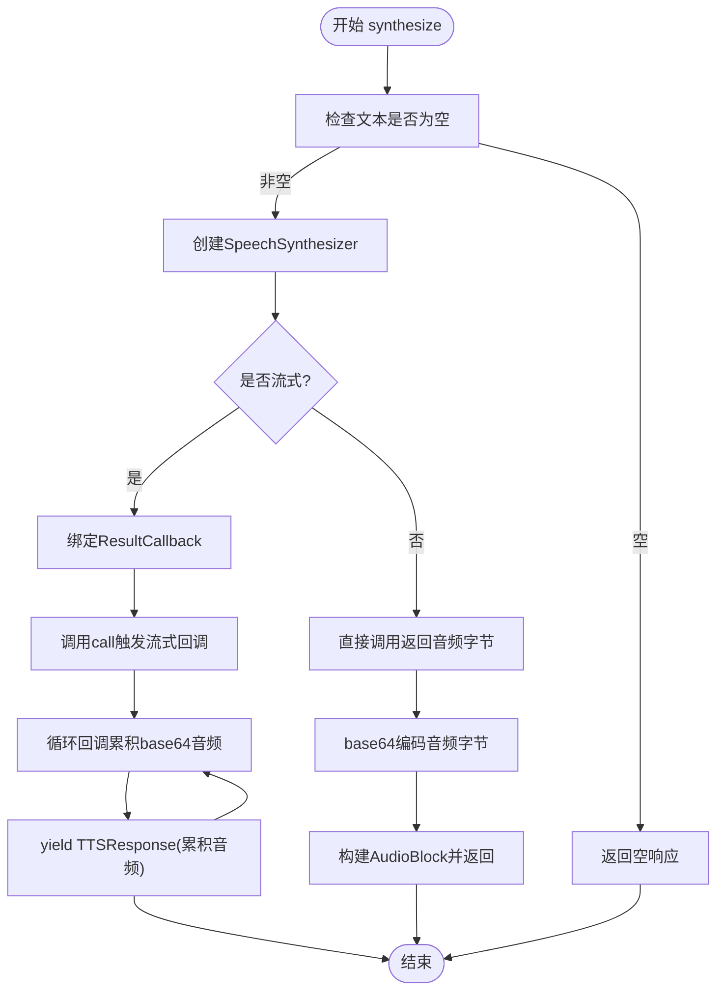
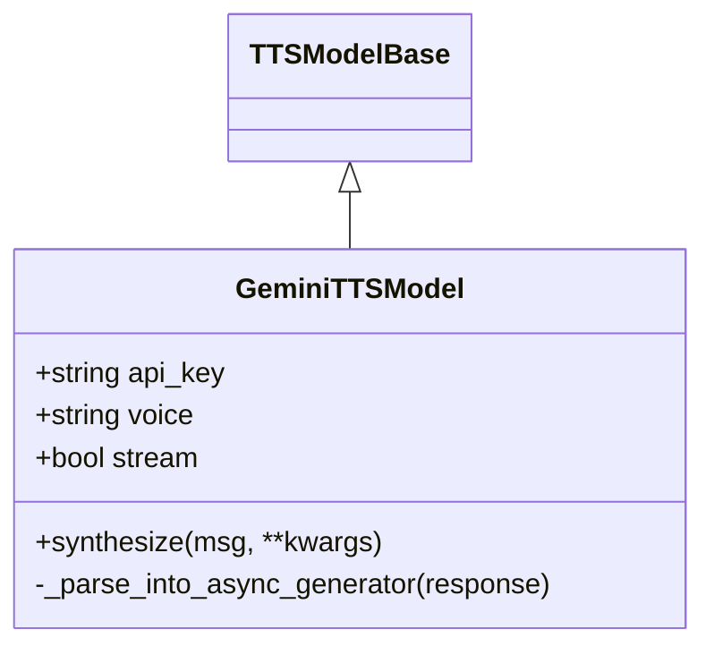
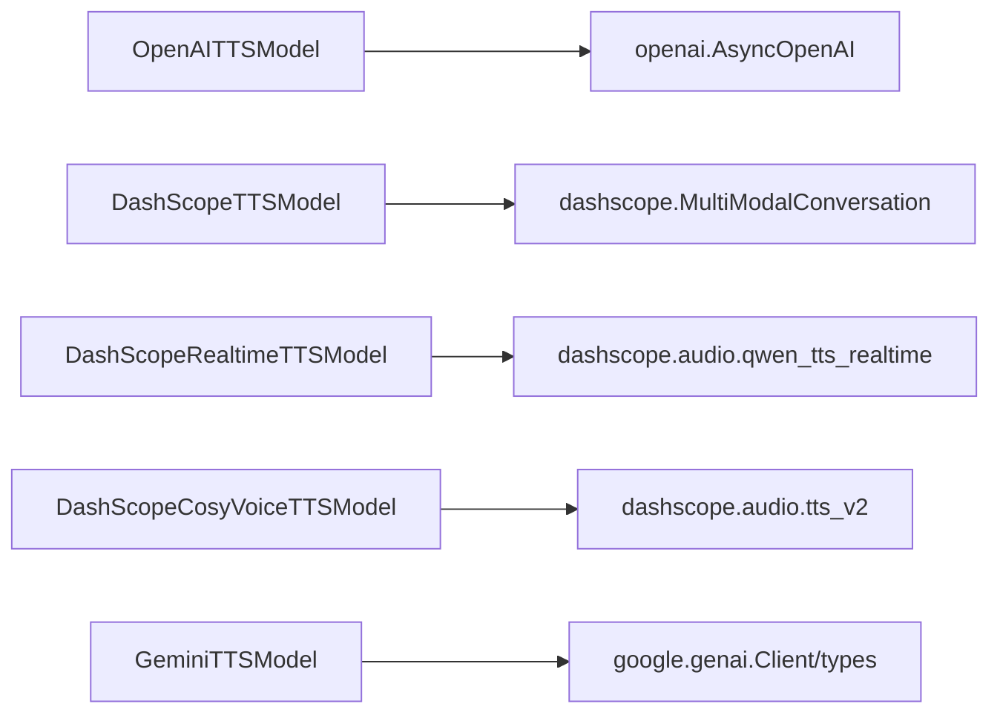

# 平台适配器

<cite>
**本文引用的文件**
- [tts/__init__.py](file://src/agentscope/tts/__init__.py)
- [tts/_tts_base.py](file://src/agentscope/tts/_tts_base.py)
- [tts/_openai_tts_model.py](file://src/agentscope/tts/_openai_tts_model.py)
- [tts/_dashscope_tts_model.py](file://src/agentscope/tts/_dashscope_tts_model.py)
- [tts/_dashscope_realtime_tts_model.py](file://src/agentscope/tts/_dashscope_realtime_tts_model.py)
- [tts/_dashscope_cosyvoice_tts_model.py](file://src/agentscope/tts/_dashscope_cosyvoice_tts_model.py)
- [_utils.py](file://src/agentscope/tts/_utils.py)
- [tts/_tts_response.py](file://src/agentscope/tts/_tts_response.py)
- [examples/functionality/tts/main.py](file://examples/functionality/tts/main.py)
- [tests/tts_openai_test.py](file://tests/tts_openai_test.py)
- [tests/tts_dashscope_test.py](file://tests/tts_dashscope_test.py)
- [tests/tts_gemini_test.py](file://tests/tts_gemini_test.py)
</cite>

## 目录
1. [简介](#简介)
2. [项目结构](#项目结构)
3. [核心组件](#核心组件)
4. [架构总览](#架构总览)
5. [详细组件分析](#详细组件分析)
6. [依赖关系分析](#依赖关系分析)
7. [性能与限制](#性能与限制)
8. [迁移与对比指南](#迁移与对比指南)
9. [故障排除](#故障排除)
10. [结论](#结论)
11. [附录：完整配置示例](#附录完整配置示例)

## 简介
本文件面向AgentScope平台的TTS（文本转语音）适配器，系统性梳理并对比三大平台适配器的实现差异与特性：
- OpenAI TTS：以自然语音合成见长，支持流式输出与非流式输出，具备灵活的音色与参数配置。
- DashScope TTS：覆盖多语言与中文优化，提供实时与非实时两种模式，支持CosyVoice系列专用模型。
- Gemini TTS：强调实时生成能力与高质量音色，支持流式与非流式响应。

文档将从架构设计、数据流、关键实现、配置参数、平台特性、限制约束、迁移与性能对比、故障排除等方面进行深入说明，并提供可直接参考的配置示例与测试用例路径。

## 项目结构
AgentScope的TTS模块采用“统一抽象 + 多平台适配”的分层设计：
- 抽象基类定义通用生命周期与接口规范；
- 各平台适配器实现具体API调用与流式解析；
- 工具类负责平台特定的回调与边界对齐逻辑；
- 响应对象封装统一的音频块与元信息。

图表来源
- [tts/__init__.py:1-26](file://src/agentscope/tts/__init__.py#L1-L26)
- [tts/_tts_base.py:12-144](file://src/agentscope/tts/_tts_base.py#L12-L144)
- [tts/_openai_tts_model.py:17-185](file://src/agentscope/tts/_openai_tts_model.py#L17-L185)
- [tts/_dashscope_tts_model.py:28-178](file://src/agentscope/tts/_dashscope_tts_model.py#L28-L178)
- [tts/_dashscope_realtime_tts_model.py:170-446](file://src/agentscope/tts/_dashscope_realtime_tts_model.py#L170-L446)
- [tts/_dashscope_cosyvoice_tts_model.py:14-166](file://src/agentscope/tts/_dashscope_cosyvoice_tts_model.py#L14-L166)
- [tts/_gemini_tts_model.py:19-211](file://src/agentscope/tts/_gemini_tts_model.py#L19-L211)
- [tts/_tts_response.py:13-56](file://src/agentscope/tts/_tts_response.py#L13-L56)
- [tts/_utils.py:18-198](file://src/agentscope/tts/_utils.py#L18-L198)

章节来源
- [tts/__init__.py:1-26](file://src/agentscope/tts/__init__.py#L1-L26)
- [tts/_tts_base.py:12-144](file://src/agentscope/tts/_tts_base.py#L12-L144)

## 核心组件
- TTSModelBase：定义统一的生命周期与接口，支持非实时与实时两类模型；非实时通过synthesize完成一次性合成；实时模型需显式连接/断开并支持push增量输入。
- TTSResponse/TTSUsage：标准化响应结构，包含音频块、时间戳、类型标识与用量统计。
- 平台适配器：
  - OpenAI：基于OpenAI AsyncOpenAI客户端，支持pcm格式流式输出与非流式输出。
  - DashScope：基于MultiModalConversation与Qwen实时SDK，支持多语言、中文优化、实时与非实时模式，以及CosyVoice专用模型。
  - Gemini：基于google.genai Client，支持流式与非流式内容生成，自动提取内联音频数据。

章节来源
- [tts/_tts_base.py:12-144](file://src/agentscope/tts/_tts_base.py#L12-L144)
- [tts/_tts_response.py:13-56](file://src/agentscope/tts/_tts_response.py#L13-L56)
- [tts/_openai_tts_model.py:17-185](file://src/agentscope/tts/_openai_tts_model.py#L17-L185)
- [tts/_dashscope_tts_model.py:28-178](file://src/agentscope/tts/_dashscope_tts_model.py#L28-L178)
- [tts/_dashscope_realtime_tts_model.py:170-446](file://src/agentscope/tts/_dashscope_realtime_tts_model.py#L170-L446)
- [tts/_dashscope_cosyvoice_tts_model.py:14-166](file://src/agentscope/tts/_dashscope_cosyvoice_tts_model.py#L14-L166)
- [tts/_gemini_tts_model.py:19-211](file://src/agentscope/tts/_gemini_tts_model.py#L19-L211)

## 架构总览
下图展示TTS模块在AgentScope中的角色与交互：

图表来源
- [examples/functionality/tts/main.py:19-57](file://examples/functionality/tts/main.py#L19-L57)
- [tts/_tts_base.py:12-144](file://src/agentscope/tts/_tts_base.py#L12-L144)
- [tts/_openai_tts_model.py:17-185](file://src/agentscope/tts/_openai_tts_model.py#L17-L185)
- [tts/_dashscope_tts_model.py:28-178](file://src/agentscope/tts/_dashscope_tts_model.py#L28-L178)
- [tts/_dashscope_realtime_tts_model.py:170-446](file://src/agentscope/tts/_dashscope_realtime_tts_model.py#L170-L446)
- [tts/_dashscope_cosyvoice_tts_model.py:14-166](file://src/agentscope/tts/_dashscope_cosyvoice_tts_model.py#L14-L166)
- [tts/_gemini_tts_model.py:19-211](file://src/agentscope/tts/_gemini_tts_model.py#L19-L211)

## 详细组件分析

### OpenAI TTS 模型
- 实现要点
  - 非实时：调用speech.create返回二进制音频，经base64编码封装为AudioBlock。
  - 流式：使用with_streaming_response.create，逐块读取字节并转换为base64片段，持续产出TTSResponse，最后is_last=True。
  - 参数：api_key、model_name、voice、stream、generate_kwargs等。
- 关键接口
  - synthesize：支持非流式与流式两种返回形态。
  - 内部解析：_parse_into_async_generator将流式响应切分为多个TTSResponse。
- 平台特性
  - 支持多种音色与模型名称；默认输出pcm格式。
- 适用场景
  - 对自然度要求高、需要灵活参数控制的场景。

图表来源
- [tts/_tts_base.py:12-144](file://src/agentscope/tts/_tts_base.py#L12-L144)
- [tts/_openai_tts_model.py:17-185](file://src/agentscope/tts/_openai_tts_model.py#L17-L185)

章节来源
- [tts/_openai_tts_model.py:17-185](file://src/agentscope/tts/_openai_tts_model.py#L17-L185)
- [tests/tts_openai_test.py:19-136](file://tests/tts_openai_test.py#L19-L136)

### DashScope TTS 模型（非实时）
- 实现要点
  - 使用MultiModalConversation.call进行合成，支持多语言与中文优化。
  - 流式模式下累积音频base64片段，逐步产出TTSResponse，最终is_last=True。
  - 参数：api_key、model_name、voice、language_type、stream、generate_kwargs。
- 平台特性
  - 支持Auto语言类型，自动匹配文本语言；适合多语言场景。
- 适用场景
  - 需要多语言与中文优化的通用TTS需求。

图表来源
- [tts/_tts_base.py:12-144](file://src/agentscope/tts/_tts_base.py#L12-L144)
- [tts/_dashscope_tts_model.py:28-178](file://src/agentscope/tts/_dashscope_tts_model.py#L28-L178)

章节来源
- [tts/_dashscope_tts_model.py:28-178](file://src/agentscope/tts/_dashscope_tts_model.py#L28-L178)
- [tests/tts_dashscope_test.py:202-322](file://tests/tts_dashscope_test.py#L202-L322)

### DashScope 实时 TTS 模型
- 实现要点
  - 基于QwenTtsRealtime SDK，支持增量文本推送与事件驱动回调。
  - 支持冷启动阈值（按字符或单词数）避免首段停顿；同一会话仅处理一个消息ID的增量输入。
  - 提供connect/close生命周期管理；synthesize在commit/finish后阻塞等待完整音频。
- 关键流程
  - 连接：connect建立会话并更新voice与模式。
  - 推送：push将增量文本发送至SDK，同时通过回调事件异步返回已合成音频。
  - 合成：synthesize提交并结束会话，返回音频流或完整音频。
- 平台特性
  - 强实时性，适合对话与低延迟语音交互。
- 适用场景
  - 实时语音对话、多轮增量合成。

图表来源
- [tts/_dashscope_realtime_tts_model.py:170-446](file://src/agentscope/tts/_dashscope_realtime_tts_model.py#L170-L446)
- [tts/_utils.py:18-198](file://src/agentscope/tts/_utils.py#L18-L198)

章节来源
- [tts/_dashscope_realtime_tts_model.py:170-446](file://src/agentscope/tts/_dashscope_realtime_tts_model.py#L170-L446)
- [tests/tts_dashscope_test.py:17-200](file://tests/tts_dashscope_test.py#L17-L200)

### DashScope CosyVoice TTS 模型
- 实现要点
  - 基于SpeechSynthesizer与ResultCallback，支持CosyVoice系列模型。
  - 流式输出采用6字节对齐策略，确保PCM采样与base64编码边界一致，避免解码错误。
  - 非流式直接返回二进制音频并base64编码。
- 关键流程
  - 创建合成器：根据stream选择是否绑定回调。
  - 流式：通过回调累积base64音频，异步生成TTSResponse。
  - 非流式：直接调用返回音频字节，封装为AudioBlock。
- 平台特性
  - 专用于CosyVoice模型族，适合高质量中文语音合成。
- 适用场景
  - 中文语音播报、客服语音、有质量要求的TTS应用。

图表来源
- [tts/_dashscope_cosyvoice_tts_model.py:14-166](file://src/agentscope/tts/_dashscope_cosyvoice_tts_model.py#L14-L166)
- [tts/_utils.py:18-198](file://src/agentscope/tts/_utils.py#L18-L198)

章节来源
- [tts/_dashscope_cosyvoice_tts_model.py:14-166](file://src/agentscope/tts/_dashscope_cosyvoice_tts_model.py#L14-L166)
- [tts/_utils.py:18-198](file://src/agentscope/tts/_utils.py#L18-L198)

### Gemini TTS 模型
- 实现要点
  - 使用google.genai Client，通过GenerateContentConfig与SpeechConfig配置音色与模态。
  - 非流式：一次性返回候选内容中的内联音频数据；流式：迭代chunks累积音频base64。
  - 自动提取mime_type，保证音频格式正确。
- 平台特性
  - 支持预置音色与高质量语音；流式接口便于实时播放。
- 适用场景
  - 高质量语音合成与实时流式播放。

图表来源
- [tts/_tts_base.py:12-144](file://src/agentscope/tts/_tts_base.py#L12-L144)
- [tts/_gemini_tts_model.py:19-211](file://src/agentscope/tts/_gemini_tts_model.py#L19-L211)

章节来源
- [tts/_gemini_tts_model.py:19-211](file://src/agentscope/tts/_gemini_tts_model.py#L19-L211)
- [tests/tts_gemini_test.py:14-168](file://tests/tts_gemini_test.py#L14-L168)

## 依赖关系分析
- 组件耦合
  - 所有适配器均继承自TTSModelBase，保持统一接口与生命周期管理。
  - DashScope CosyVoice适配器依赖内部回调工具类，确保流式输出的边界对齐。
- 外部依赖
  - OpenAI：openai.AsyncOpenAI。
  - DashScope：dashscope.MultiModalConversation、dashscope.audio.qwen_tts_realtime、dashscope.audio.tts_v2。
  - Gemini：google.genai.Client与types。
- 可能的循环依赖
  - 模块间通过导入时延迟绑定避免循环；回调类在运行时动态生成并注入。

图表来源
- [tts/_openai_tts_model.py:65-70](file://src/agentscope/tts/_openai_tts_model.py#L65-L70)
- [tts/_dashscope_tts_model.py:102-114](file://src/agentscope/tts/_dashscope_tts_model.py#L102-L114)
- [tts/_dashscope_realtime_tts_model.py:246-266](file://src/agentscope/tts/_dashscope_realtime_tts_model.py#L246-L266)
- [tts/_dashscope_cosyvoice_tts_model.py:84-98](file://src/agentscope/tts/_dashscope_cosyvoice_tts_model.py#L84-L98)
- [tts/_gemini_tts_model.py:70-75](file://src/agentscope/tts/_gemini_tts_model.py#L70-L75)

## 性能与限制
- 流式 vs 非流式
  - OpenAI与Gemini均支持流式与非流式；DashScope实时模型支持增量推送与事件驱动；CosyVoice流式输出采用6字节对齐策略提升稳定性。
- 延迟与吞吐
  - 实时模型（DashScope实时、CosyVoice流式）在增量文本到达后即可快速产出音频片段，适合低延迟交互。
- 资源占用
  - 实时模型需维护会话状态与回调事件，注意连接/断开时机与并发请求的隔离。
- 平台限制（依据实现与官方文档）
  - 文本长度与并发：不同平台对单次合成长度与并发请求数存在限制，建议结合业务场景评估。
  - 音频格式：默认输出pcm或由平台指定mime_type，注意播放端兼容性。
  - 费用：按调用次数与音频时长计费，建议在测试阶段开启用量统计并监控成本。

[本节为通用指导，不直接分析具体文件，故无章节来源]

## 迁移与对比指南
- 选择建议
  - 自然度优先：OpenAI TTS。
  - 多语言/中文优化：DashScope TTS。
  - 实时交互：DashScope实时或CosyVoice流式；Gemini流式亦可。
- 迁移步骤
  - 替换初始化参数：api_key、model_name、voice、stream等。
  - 调整生命周期：实时模型需connect/close；非实时仅调用synthesize。
  - 处理流式差异：根据平台特性调整音频拼接与is_last判断。
- 示例参考
  - 实时DashScope示例：[examples/functionality/tts/main.py:19-57](file://examples/functionality/tts/main.py#L19-L57)
  - 单测参考：OpenAI/ DashScope/ Gemini的单元测试分别验证了流式与非流式的典型行为。

章节来源
- [examples/functionality/tts/main.py:19-57](file://examples/functionality/tts/main.py#L19-L57)
- [tests/tts_openai_test.py:19-136](file://tests/tts_openai_test.py#L19-L136)
- [tests/tts_dashscope_test.py:17-322](file://tests/tts_dashscope_test.py#L17-L322)
- [tests/tts_gemini_test.py:14-168](file://tests/tts_gemini_test.py#L14-L168)

## 故障排除
- 常见问题
  - 连接未建立：实时模型在未connect时调用push/synthesize会抛出异常。请先调用connect并确保会话处于活跃状态。
  - 增量输入冲突：实时模型在同一会话中仅允许单一消息ID的增量输入，跨消息ID推送会触发错误。
  - 流式边界对齐：CosyVoice流式输出需遵循6字节对齐策略，避免base64解码失败。
  - 空文本或空音频：当输入文本为空或平台未返回音频数据时，返回空响应或空音频块。
- 定位方法
  - 查看响应is_last与content字段，确认流式是否结束与是否有音频数据。
  - 检查平台SDK回调事件与线程事件状态，确保事件被正确触发与清理。
- 参考测试
  - OpenAI：验证非流式与流式返回结构。
  - DashScope：验证实时模型的增量推送、流式生成与非流式聚合。
  - Gemini：验证流式累积与非流式一次性返回。

章节来源
- [tts/_dashscope_realtime_tts_model.py:327-445](file://src/agentscope/tts/_dashscope_realtime_tts_model.py#L327-L445)
- [tts/_utils.py:49-197](file://src/agentscope/tts/_utils.py#L49-L197)
- [tests/tts_openai_test.py:46-136](file://tests/tts_openai_test.py#L46-L136)
- [tests/tts_dashscope_test.py:74-200](file://tests/tts_dashscope_test.py#L74-L200)
- [tests/tts_gemini_test.py:75-168](file://tests/tts_gemini_test.py#L75-L168)

## 结论
AgentScope的TTS适配器通过统一抽象与平台特定实现，为多云平台提供了统一的接入体验。开发者可根据场景需求在自然度、多语言支持、实时性与质量之间进行权衡，并利用统一的响应结构与生命周期管理简化集成与运维。

[本节为总结性内容，不直接分析具体文件，故无章节来源]

## 附录：完整配置示例
以下为各平台适配器的关键配置项与示例路径，便于快速落地：
- OpenAI TTS
  - 关键参数：api_key、model_name、voice、stream、generate_kwargs。
  - 示例路径：[tts/_openai_tts_model.py:26-75](file://src/agentscope/tts/_openai_tts_model.py#L26-L75)
  - 行为验证：[tests/tts_openai_test.py:33-136](file://tests/tts_openai_test.py#L33-L136)
- DashScope TTS（非实时）
  - 关键参数：api_key、model_name、voice、language_type、stream、generate_kwargs。
  - 示例路径：[tts/_dashscope_tts_model.py:37-77](file://src/agentscope/tts/_dashscope_tts_model.py#L37-L77)
  - 行为验证：[tests/tts_dashscope_test.py:218-322](file://tests/tts_dashscope_test.py#L218-L322)
- DashScope 实时 TTS
  - 关键参数：api_key、model_name、voice、stream、cold_start_length、cold_start_words、client_kwargs、generate_kwargs。
  - 示例路径：[tts/_dashscope_realtime_tts_model.py:188-258](file://src/agentscope/tts/_dashscope_realtime_tts_model.py#L188-L258)
  - 使用示例：[examples/functionality/tts/main.py:39-44](file://examples/functionality/tts/main.py#L39-L44)
  - 行为验证：[tests/tts_dashscope_test.py:56-200](file://tests/tts_dashscope_test.py#L56-L200)
- DashScope CosyVoice TTS
  - 关键参数：api_key、model_name、voice、stream、client_kwargs、generate_kwargs。
  - 示例路径：[tts/_dashscope_cosyvoice_tts_model.py:29-83](file://src/agentscope/tts/_dashscope_cosyvoice_tts_model.py#L29-L83)
  - 回调对齐：[tts/_utils.py:18-198](file://src/agentscope/tts/_utils.py#L18-L198)
- Gemini TTS
  - 关键参数：api_key、model_name、voice、stream、client_kwargs、generate_kwargs。
  - 示例路径：[tts/_gemini_tts_model.py:28-78](file://src/agentscope/tts/_gemini_tts_model.py#L28-L78)
  - 行为验证：[tests/tts_gemini_test.py:62-168](file://tests/tts_gemini_test.py#L62-L168)

章节来源
- [tts/_openai_tts_model.py:26-75](file://src/agentscope/tts/_openai_tts_model.py#L26-L75)
- [tts/_dashscope_tts_model.py:37-77](file://src/agentscope/tts/_dashscope_tts_model.py#L37-L77)
- [tts/_dashscope_realtime_tts_model.py:188-258](file://src/agentscope/tts/_dashscope_realtime_tts_model.py#L188-L258)
- [tts/_dashscope_cosyvoice_tts_model.py:29-83](file://src/agentscope/tts/_dashscope_cosyvoice_tts_model.py#L29-L83)
- [tts/_gemini_tts_model.py:28-78](file://src/agentscope/tts/_gemini_tts_model.py#L28-L78)
- [examples/functionality/tts/main.py:39-44](file://examples/functionality/tts/main.py#L39-L44)
- [tests/tts_openai_test.py:33-136](file://tests/tts_openai_test.py#L33-L136)
- [tests/tts_dashscope_test.py:56-200](file://tests/tts_dashscope_test.py#L56-L200)
- [tests/tts_gemini_test.py:62-168](file://tests/tts_gemini_test.py#L62-L168)