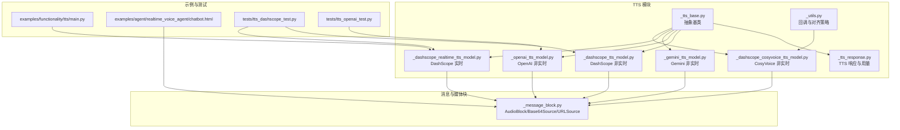
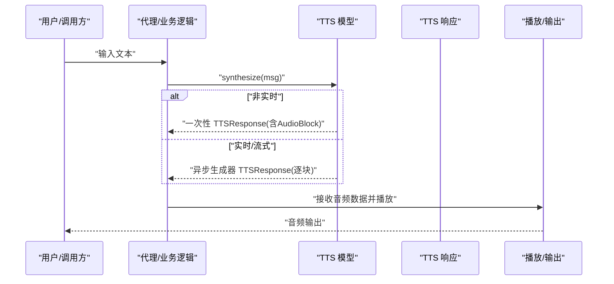
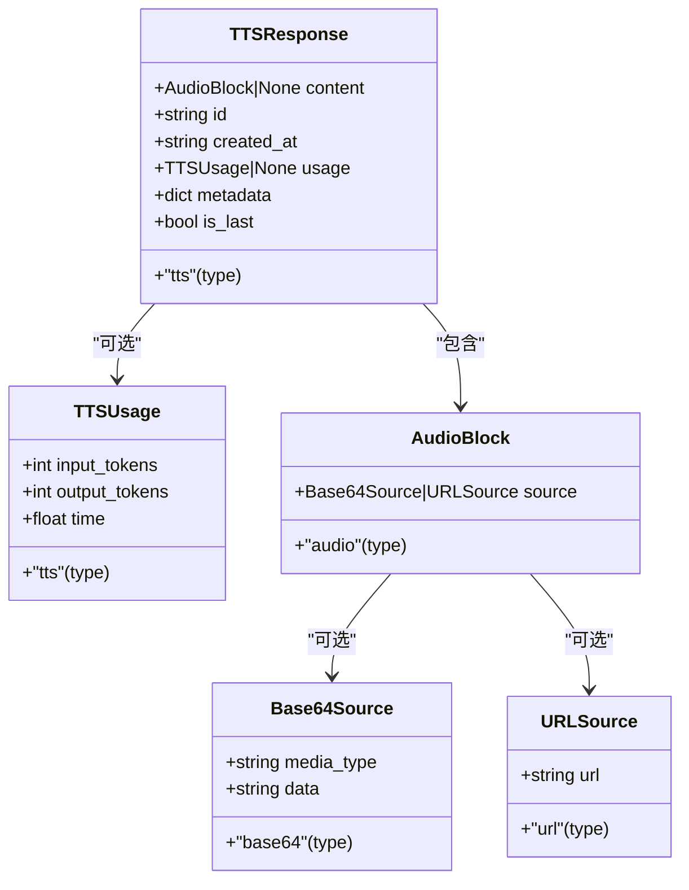
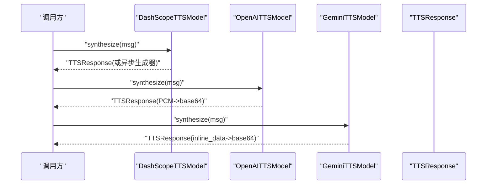
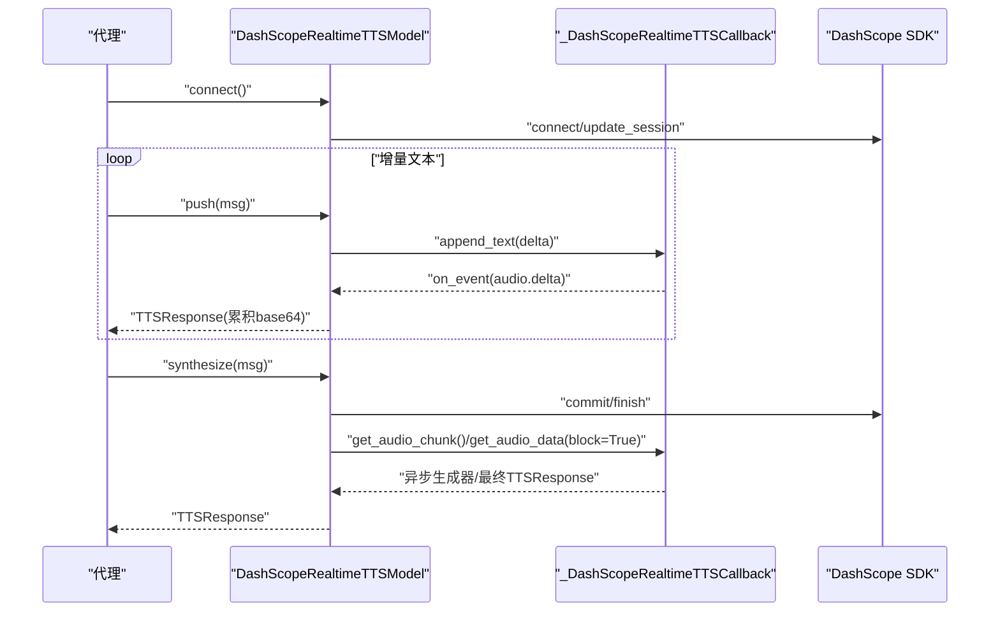
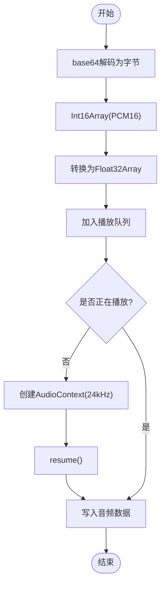
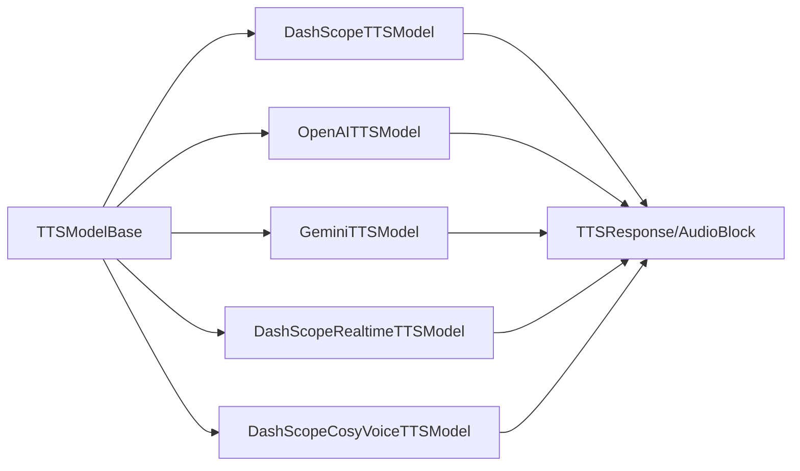

# 音频处理与格式

<cite>
**本文引用的文件**
- [src/agentscope/tts/_tts_response.py](file://src/agentscope/tts/_tts_response.py)
- [src/agentscope/message/_message_block.py](file://src/agentscope/message/_message_block.py)
- [src/agentscope/tts/_tts_base.py](file://src/agentscope/tts/_tts_base.py)
- [src/agentscope/tts/__init__.py](file://src/agentscope/tts/__init__.py)
- [src/agentscope/tts/_dashscope_tts_model.py](file://src/agentscope/tts/_dashscope_tts_model.py)
- [src/agentscope/tts/_openai_tts_model.py](file://src/agentscope/tts/_openai_tts_model.py)
- [src/agentscope/tts/_gemini_tts_model.py](file://src/agentscope/tts/_gemini_tts_model.py)
- [src/agentscope/tts/_dashscope_realtime_tts_model.py](file://src/agentscope/tts/_dashscope_realtime_tts_model.py)
- [src/agentscope/tts/_dashscope_cosyvoice_tts_model.py](file://src/agentscope/tts/_dashscope_cosyvoice_tts_model.py)
- [src/agentscope/tts/_utils.py](file://src/agentscope/tts/_utils.py)
- [src/agentscope/agent/_agent_base.py](file://src/agentscope/agent/_agent_base.py)
- [examples/functionality/tts/main.py](file://examples/functionality/tts/main.py)
- [examples/agent/realtime_voice_agent/chatbot.html](file://examples/agent/realtime_voice_agent/chatbot.html)
- [tests/tts_dashscope_test.py](file://tests/tts_dashscope_test.py)
- [tests/tts_openai_test.py](file://tests/tts_openai_test.py)
</cite>

## 目录
1. [简介](#简介)
2. [项目结构](#项目结构)
3. [核心组件](#核心组件)
4. [架构总览](#架构总览)
5. [详细组件分析](#详细组件分析)
6. [依赖关系分析](#依赖关系分析)
7. [性能考量](#性能考量)
8. [故障排查指南](#故障排查指南)
9. [结论](#结论)
10. [附录](#附录)

## 简介
本技术文档围绕 AgentScope 的音频处理与格式系统，聚焦 TTS（文本转语音）子系统的响应对象与数据结构、音频格式与编码、采样率与比特深度配置、从文本到音频的处理流程、二进制音频数据的组织方式、以及播放控制机制。文档同时覆盖多厂商 TTS 模型（DashScope、OpenAI、Gemini）在非实时与实时场景下的实现差异，并给出音频质量控制、播放方案（本地、流式、Web 集成）、性能优化与兼容性建议，以及完整示例与调试方法。

## 项目结构
AgentScope 将 TTS 能力以模块化方式组织，核心位于 src/agentscope/tts 下，消息体与媒体块定义位于 src/agentscope/message 下，示例与测试分别位于 examples 与 tests 目录中。

图表来源
- [src/agentscope/tts/_tts_base.py:12-144](file://src/agentscope/tts/_tts_base.py#L12-L144)
- [src/agentscope/tts/_tts_response.py:30-56](file://src/agentscope/tts/_tts_response.py#L30-L56)
- [src/agentscope/tts/_dashscope_tts_model.py:28-178](file://src/agentscope/tts/_dashscope_tts_model.py#L28-L178)
- [src/agentscope/tts/_openai_tts_model.py:17-185](file://src/agentscope/tts/_openai_tts_model.py#L17-L185)
- [src/agentscope/tts/_gemini_tts_model.py:19-211](file://src/agentscope/tts/_gemini_tts_model.py#L19-L211)
- [src/agentscope/tts/_dashscope_realtime_tts_model.py:170-446](file://src/agentscope/tts/_dashscope_realtime_tts_model.py#L170-L446)
- [src/agentscope/tts/_dashscope_cosyvoice_tts_model.py:14-166](file://src/agentscope/tts/_dashscope_cosyvoice_tts_model.py#L14-L166)
- [src/agentscope/tts/_utils.py:18-198](file://src/agentscope/tts/_utils.py#L18-L198)
- [src/agentscope/message/_message_block.py:26-77](file://src/agentscope/message/_message_block.py#L26-L77)
- [examples/functionality/tts/main.py:19-57](file://examples/functionality/tts/main.py#L19-L57)
- [examples/agent/realtime_voice_agent/chatbot.html:1052-1089](file://examples/agent/realtime_voice_agent/chatbot.html#L1052-L1089)
- [tests/tts_dashscope_test.py:17-322](file://tests/tts_dashscope_test.py#L17-L322)
- [tests/tts_openai_test.py:19-136](file://tests/tts_openai_test.py#L19-L136)

章节来源
- [src/agentscope/tts/__init__.py:1-26](file://src/agentscope/tts/__init__.py#L1-L26)

## 核心组件
- TTSResponse：封装 TTS 输出的统一响应对象，包含音频内容块、唯一标识、时间戳、类型标记、用量信息与元数据，支持 is_last 标记用于流式结束判断。
- AudioBlock/Base64Source/URLSource：音频内容块及其数据源，支持 base64 内联与 URL 外链两种形式；media_type 字段描述 MIME 类型及采样率等参数。
- TTSModelBase：所有 TTS 模型的抽象基类，定义 synthesize 接口与可选的 push/connect/close 生命周期管理，支持同步/异步生成器返回流式结果。
- 具体模型实现：DashScope（非实时/实时/CosyVoice）、OpenAI、Gemini，均遵循统一响应结构并按各自 API 特性进行数据拼接与流式解析。

章节来源
- [src/agentscope/tts/_tts_response.py:30-56](file://src/agentscope/tts/_tts_response.py#L30-L56)
- [src/agentscope/message/_message_block.py:26-77](file://src/agentscope/message/_message_block.py#L26-L77)
- [src/agentscope/tts/_tts_base.py:12-144](file://src/agentscope/tts/_tts_base.py#L12-L144)

## 架构总览
下图展示从文本到音频的端到端流程，涵盖非实时与实时两条路径，以及音频数据在内存中的累积与最终封装为 TTSResponse 的过程。

图表来源
- [src/agentscope/tts/_tts_base.py:124-144](file://src/agentscope/tts/_tts_base.py#L124-L144)
- [src/agentscope/tts/_dashscope_tts_model.py:78-134](file://src/agentscope/tts/_dashscope_tts_model.py#L78-L134)
- [src/agentscope/tts/_openai_tts_model.py:76-136](file://src/agentscope/tts/_openai_tts_model.py#L76-L136)
- [src/agentscope/tts/_gemini_tts_model.py:79-160](file://src/agentscope/tts/_gemini_tts_model.py#L79-L160)
- [src/agentscope/tts/_dashscope_realtime_tts_model.py:379-446](file://src/agentscope/tts/_dashscope_realtime_tts_model.py#L379-L446)

## 详细组件分析

### TTSResponse 响应对象与音频数据结构
- 结构要点
  - content：AudioBlock 或 None，承载音频数据。
  - id/created_at/type：唯一标识、创建时间与类型标记。
  - usage：TTSUsage 记录输入/输出 token 与耗时。
  - metadata：扩展元数据字典。
  - is_last：流式结束标志。
- 音频数据载体
  - AudioBlock.source 支持 Base64Source 与 URLSource。
  - Base64Source.media_type 描述 MIME 类型与采样率等参数（如 audio/pcm;rate=24000）。
- 数据累积与流式拼接
  - 流式模型通过累积已编码字符串（base64）形成增量音频块，最终以 is_last=True 标记结束。

图表来源
- [src/agentscope/tts/_tts_response.py:13-56](file://src/agentscope/tts/_tts_response.py#L13-L56)
- [src/agentscope/message/_message_block.py:26-77](file://src/agentscope/message/_message_block.py#L26-L77)

章节来源
- [src/agentscope/tts/_tts_response.py:30-56](file://src/agentscope/tts/_tts_response.py#L30-L56)
- [src/agentscope/message/_message_block.py:59-77](file://src/agentscope/message/_message_block.py#L59-L77)

### 文本到音频的处理流程（非实时）
- DashScope 非实时
  - 调用 MultiModalConversation API，开启流式返回后逐块拼接 base64 音频数据，最终封装为 TTSResponse。
  - 非流式模式下聚合所有音频片段，返回单个 TTSResponse。
- OpenAI 非实时
  - 使用 response_format="pcm" 获取 PCM 音频字节，再进行 base64 编码，封装为 TTSResponse。
- Gemini 非实时
  - 通过 generate_content 返回 inline_data，提取 data 与 mime_type，base64 编码后封装为 TTSResponse。

图表来源
- [src/agentscope/tts/_dashscope_tts_model.py:78-134](file://src/agentscope/tts/_dashscope_tts_model.py#L78-L134)
- [src/agentscope/tts/_openai_tts_model.py:76-136](file://src/agentscope/tts/_openai_tts_model.py#L76-L136)
- [src/agentscope/tts/_gemini_tts_model.py:79-160](file://src/agentscope/tts/_gemini_tts_model.py#L79-L160)

章节来源
- [src/agentscope/tts/_dashscope_tts_model.py:78-178](file://src/agentscope/tts/_dashscope_tts_model.py#L78-L178)
- [src/agentscope/tts/_openai_tts_model.py:76-185](file://src/agentscope/tts/_openai_tts_model.py#L76-L185)
- [src/agentscope/tts/_gemini_tts_model.py:79-211](file://src/agentscope/tts/_gemini_tts_model.py#L79-L211)

### 实时/流式处理（DashScope 实时）
- 连接与会话
  - 通过 connect 初始化客户端并更新会话参数（voice、mode 等）。
- 文本推送与冷启动
  - push 支持增量文本推送，结合冷启动阈值（字符数/单词数）避免首段静音。
  - 维护当前消息 ID 与前缀，确保同一请求内的连续性。
- 音频流式输出
  - commit/finsih 触发合成完成；根据 stream 参数返回异步生成器或阻塞等待全部音频。
  - 回调类负责事件分发、音频数据累积与边界对齐，保证 base64 对齐与线程安全。

图表来源
- [src/agentscope/tts/_dashscope_realtime_tts_model.py:278-446](file://src/agentscope/tts/_dashscope_realtime_tts_model.py#L278-L446)
- [src/agentscope/tts/_utils.py:24-198](file://src/agentscope/tts/_utils.py#L24-L198)

章节来源
- [src/agentscope/tts/_dashscope_realtime_tts_model.py:170-446](file://src/agentscope/tts/_dashscope_realtime_tts_model.py#L170-L446)
- [src/agentscope/tts/_utils.py:18-198](file://src/agentscope/tts/_utils.py#L18-L198)

### 音频格式、采样率与比特深度
- 常见 media_type 与参数
  - audio/pcm;rate=24000：常见 PCM 格式，采样率为 24kHz。
  - audio/pcm：未指定采样率时的通用 PCM。
  - 其他 MIME 类型由各模型返回（如 inline_data.mime_type），需按实际值处理。
- 比特深度与量化
  - CosyVoice 在非实时模式下明确使用 16bit 单声道 PCM（AudioFormat.PCM_24000HZ_MONO_16BIT）。
- 编码与解码
  - 所有模型以 base64 内联音频数据返回，前端或本地播放需先 base64 解码为字节，再按 PCM16/Float32 等格式进行后续处理。

章节来源
- [src/agentscope/tts/_dashscope_tts_model.py:124-134](file://src/agentscope/tts/_dashscope_tts_model.py#L124-L134)
- [src/agentscope/tts/_openai_tts_model.py:122-134](file://src/agentscope/tts/_openai_tts_model.py#L122-L134)
- [src/agentscope/tts/_gemini_tts_model.py:142-159](file://src/agentscope/tts/_gemini_tts_model.py#L142-L159)
- [src/agentscope/tts/_dashscope_cosyvoice_tts_model.py:90-98](file://src/agentscope/tts/_dashscope_cosyvoice_tts_model.py#L90-L98)

### 音频播放控制机制
- 本地播放（Python）
  - 代理层缓存 OutputStream 与前缀数据，按增量差分写入，采样率 24000，单声道，浮点格式，低延迟。
- Web 集成播放（HTML/JavaScript）
  - 将 PCM16 字节解码为 Float32Array，创建 AudioContext 并按 24000Hz 播放，支持队列与挂起恢复。

图表来源
- [src/agentscope/agent/_agent_base.py:331-364](file://src/agentscope/agent/_agent_base.py#L331-L364)
- [examples/agent/realtime_voice_agent/chatbot.html:1052-1089](file://examples/agent/realtime_voice_agent/chatbot.html#L1052-L1089)

章节来源
- [src/agentscope/agent/_agent_base.py:325-364](file://src/agentscope/agent/_agent_base.py#L325-L364)
- [examples/agent/realtime_voice_agent/chatbot.html:1052-1089](file://examples/agent/realtime_voice_agent/chatbot.html#L1052-L1089)

### 不同音频格式的支持情况
- DashScope
  - 非实时：返回 PCM 音频，media_type 通常为 audio/pcm;rate=24000。
  - CosyVoice：非实时模式返回 PCM，采样率 24kHz，比特深度 16bit。
  - 实时：通过回调事件累积音频，最终以 base64 形式返回。
- OpenAI
  - response_format="pcm"，返回 PCM 字节，media_type 为 audio/pcm。
- Gemini
  - inline_data.mime_type 可能为不同 MIME，需按实际值处理。
- 当前系统统一以 base64 内联音频返回，不直接提供 WAV/MP3/OGG 等容器格式；如需容器格式，可在应用侧进行二次封装或转码。

章节来源
- [src/agentscope/tts/_dashscope_tts_model.py:124-134](file://src/agentscope/tts/_dashscope_tts_model.py#L124-L134)
- [src/agentscope/tts/_openai_tts_model.py:122-134](file://src/agentscope/tts/_openai_tts_model.py#L122-L134)
- [src/agentscope/tts/_gemini_tts_model.py:142-159](file://src/agentscope/tts/_gemini_tts_model.py#L142-L159)
- [src/agentscope/tts/_dashscope_cosyvoice_tts_model.py:90-98](file://src/agentscope/tts/_dashscope_cosyvoice_tts_model.py#L90-L98)

### 音频质量控制参数
- 采样率与比特深度
  - 24kHz 采样率、16bit 比特深度在 CosyVoice 非实时模式下固定；其他模型以各自默认或返回值为准。
- 声音选择
  - DashScope/OpenAI/Gemini 提供多种预置声音选项，可通过初始化参数选择。
- 流式控制
  - DashScope 实时模型支持冷启动长度/单词阈值，避免短文本首段停顿。

章节来源
- [src/agentscope/tts/_dashscope_tts_model.py:37-77](file://src/agentscope/tts/_dashscope_tts_model.py#L37-L77)
- [src/agentscope/tts/_openai_tts_model.py:26-64](file://src/agentscope/tts/_openai_tts_model.py#L26-L64)
- [src/agentscope/tts/_gemini_tts_model.py:28-78](file://src/agentscope/tts/_gemini_tts_model.py#L28-L78)
- [src/agentscope/tts/_dashscope_realtime_tts_model.py:188-258](file://src/agentscope/tts/_dashscope_realtime_tts_model.py#L188-L258)

### 音频播放实现方案
- 本地播放（Python）
  - 使用 sounddevice OutputStream，设置采样率 24kHz、单声道、float32、低延迟，按增量差分写入。
- 流式播放（实时）
  - 代理层维护播放器与前缀数据，确保连续播放与无重复音频。
- Web 集成播放（HTML/JS）
  - 将 PCM16 字节转换为 Float32Array，创建 AudioContext 并按 24kHz 播放，支持队列与挂起恢复。

章节来源
- [src/agentscope/agent/_agent_base.py:331-364](file://src/agentscope/agent/_agent_base.py#L331-L364)
- [examples/agent/realtime_voice_agent/chatbot.html:1052-1089](file://examples/agent/realtime_voice_agent/chatbot.html#L1052-L1089)

## 依赖关系分析
- 模块内聚与耦合
  - TTSModelBase 定义统一接口，具体模型仅关注各自 SDK 的调用细节，保持良好内聚。
  - TTSResponse 与 AudioBlock/Base64Source/URLSource 解耦于具体模型，便于跨平台传输与播放。
- 外部依赖
  - DashScope、OpenAI、Google GenAI 官方 SDK；sounddevice（本地播放）；浏览器 AudioContext（Web 播放）。
- 循环依赖
  - 未发现循环导入；各模型通过公共响应对象与消息块进行交互。

图表来源
- [src/agentscope/tts/_tts_base.py:12-144](file://src/agentscope/tts/_tts_base.py#L12-L144)
- [src/agentscope/tts/_dashscope_tts_model.py:28-178](file://src/agentscope/tts/_dashscope_tts_model.py#L28-L178)
- [src/agentscope/tts/_openai_tts_model.py:17-185](file://src/agentscope/tts/_openai_tts_model.py#L17-L185)
- [src/agentscope/tts/_gemini_tts_model.py:19-211](file://src/agentscope/tts/_gemini_tts_model.py#L19-L211)
- [src/agentscope/tts/_dashscope_realtime_tts_model.py:170-446](file://src/agentscope/tts/_dashscope_realtime_tts_model.py#L170-L446)
- [src/agentscope/tts/_dashscope_cosyvoice_tts_model.py:14-166](file://src/agentscope/tts/_dashscope_cosyvoice_tts_model.py#L14-L166)
- [src/agentscope/tts/_tts_response.py:30-56](file://src/agentscope/tts/_tts_response.py#L30-L56)

章节来源
- [src/agentscope/tts/__init__.py:4-25](file://src/agentscope/tts/__init__.py#L4-L25)

## 性能考量
- 流式对齐与边界处理
  - CosyVoice 回调采用 6 字节对齐（LCM(2,3)）确保 PCM 与 base64 边界一致，减少额外拷贝与错误拼接。
- 增量播放
  - 本地与 Web 播放均采用增量差分写入/解码，降低延迟与内存峰值。
- 采样率与通道
  - 统一使用 24kHz、单声道，简化下游处理与兼容性问题。
- I/O 与网络
  - 非实时模式优先一次性返回，减少连接开销；实时模式通过事件驱动与回调累积，避免阻塞主线程。

章节来源
- [src/agentscope/tts/_utils.py:63-86](file://src/agentscope/tts/_utils.py#L63-L86)
- [src/agentscope/agent/_agent_base.py:348-356](file://src/agentscope/agent/_agent_base.py#L348-L356)
- [examples/agent/realtime_voice_agent/chatbot.html:1052-1089](file://examples/agent/realtime_voice_agent/chatbot.html#L1052-L1089)

## 故障排查指南
- 常见问题
  - 实时模型未连接：调用 push/synthesize 前必须执行 connect。
  - 多请求并发：DashScope 实时模型不支持并发多个消息 ID 的输入序列。
  - 冷启动阈值：短文本可能被忽略直至达到阈值，检查 cold_start_length/cold_start_words 设置。
  - 采样率不匹配：播放端需与返回 media_type 中的采样率一致（如 24kHz）。
- 调试工具与示例
  - 示例脚本：examples/functionality/tts/main.py 展示如何注入实时 TTS 模型到代理。
  - 测试用例：tests/tts_dashscope_test.py 与 tests/tts_openai_test.py 提供初始化、非实时与流式合成的断言与行为验证。
- 日志与状态
  - 回调类在异常时记录日志并释放阻塞事件，避免死锁；必要时检查 finish_event/chunk_event 的状态。

章节来源
- [src/agentscope/tts/_dashscope_realtime_tts_model.py:327-377](file://src/agentscope/tts/_dashscope_realtime_tts_model.py#L327-L377)
- [tests/tts_dashscope_test.py:74-200](file://tests/tts_dashscope_test.py#L74-L200)
- [tests/tts_openai_test.py:46-136](file://tests/tts_openai_test.py#L46-L136)
- [examples/functionality/tts/main.py:19-57](file://examples/functionality/tts/main.py#L19-L57)

## 结论
AgentScope 的音频处理与格式系统以统一的 TTSResponse 与 AudioBlock 为核心，屏蔽了不同 TTS 服务的差异，实现了跨平台的音频数据传输与播放。通过严格的流式对齐策略、增量播放与统一采样率，系统在实时性与兼容性之间取得平衡。对于需要容器格式（如 WAV/MP3/OGG）的应用，可在上层进行二次封装或转码；对于质量控制与播放体验，建议严格遵循 media_type 中的采样率与比特深度配置。

## 附录
- 快速开始（示例）
  - 在代理中注入 DashScope 实时 TTS 模型，实现实时语音对话。
- 关键实现路径
  - TTS 响应与媒体块：[src/agentscope/tts/_tts_response.py:30-56](file://src/agentscope/tts/_tts_response.py#L30-L56)，[src/agentscope/message/_message_block.py:59-77](file://src/agentscope/message/_message_block.py#L59-L77)
  - 模型实现：[src/agentscope/tts/_dashscope_tts_model.py:78-178](file://src/agentscope/tts/_dashscope_tts_model.py#L78-L178)，[src/agentscope/tts/_openai_tts_model.py:76-185](file://src/agentscope/tts/_openai_tts_model.py#L76-L185)，[src/agentscope/tts/_gemini_tts_model.py:79-211](file://src/agentscope/tts/_gemini_tts_model.py#L79-L211)，[src/agentscope/tts/_dashscope_realtime_tts_model.py:170-446](file://src/agentscope/tts/_dashscope_realtime_tts_model.py#L170-L446)，[src/agentscope/tts/_dashscope_cosyvoice_tts_model.py:115-166](file://src/agentscope/tts/_dashscope_cosyvoice_tts_model.py#L115-L166)
  - 回调与对齐：[src/agentscope/tts/_utils.py:18-198](file://src/agentscope/tts/_utils.py#L18-L198)
  - 播放实现：[src/agentscope/agent/_agent_base.py:331-364](file://src/agentscope/agent/_agent_base.py#L331-L364)，[examples/agent/realtime_voice_agent/chatbot.html:1052-1089](file://examples/agent/realtime_voice_agent/chatbot.html#L1052-L1089)
  - 示例与测试：[examples/functionality/tts/main.py:19-57](file://examples/functionality/tts/main.py#L19-L57)，[tests/tts_dashscope_test.py:202-322](file://tests/tts_dashscope_test.py#L202-L322)，[tests/tts_openai_test.py:19-136](file://tests/tts_openai_test.py#L19-L136)