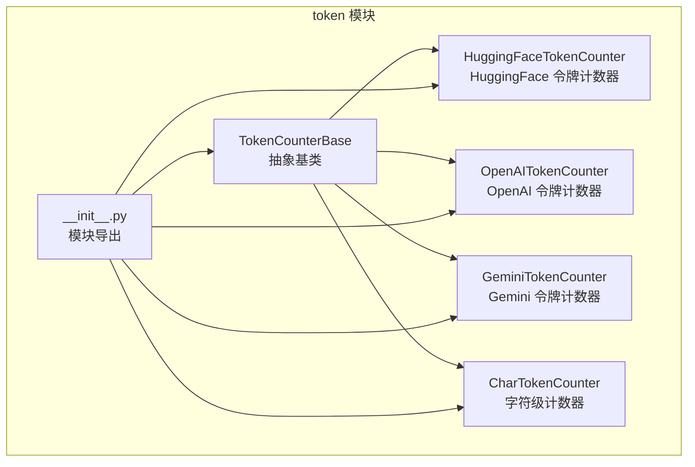
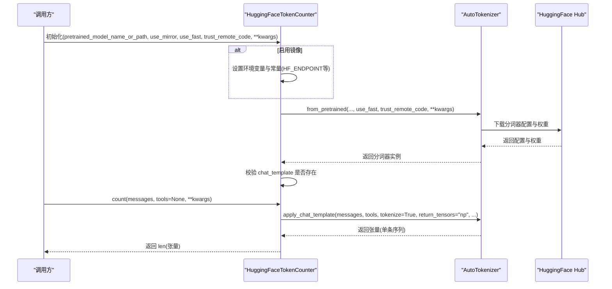
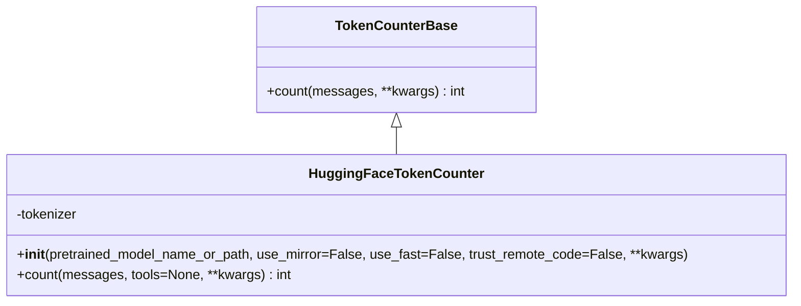
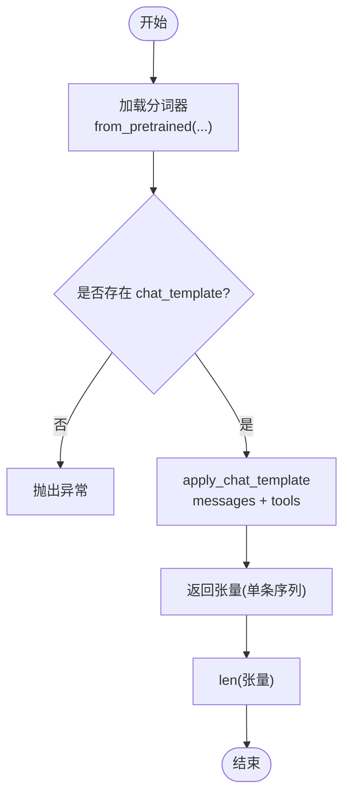
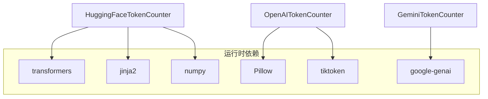

# HuggingFace令牌计数器

<cite>
**本文引用的文件**
- [src/agentscope/token/_huggingface_token_counter.py](file://src/agentscope/token/_huggingface_token_counter.py)
- [src/agentscope/token/_token_base.py](file://src/agentscope/token/_token_base.py)
- [src/agentscope/token/__init__.py](file://src/agentscope/token/__init__.py)
- [src/agentscope/token/_openai_token_counter.py](file://src/agentscope/token/_openai_token_counter.py)
- [src/agentscope/token/_gemini_token_counter.py](file://src/agentscope/token/_gemini_token_counter.py)
- [src/agentscope/token/_char_token_counter.py](file://src/agentscope/token/_char_token_counter.py)
- [pyproject.toml](file://pyproject.toml)
- [docs/tutorials/zh_CN/src/task_token.py](file://docs/tutorials/zh_CN/src/task_token.py)
</cite>

## 目录
1. [简介](#简介)
2. [项目结构](#项目结构)
3. [核心组件](#核心组件)
4. [架构概览](#架构概览)
5. [详细组件分析](#详细组件分析)
6. [依赖分析](#依赖分析)
7. [性能考虑](#性能考虑)
8. [故障排查指南](#故障排查指南)
9. [结论](#结论)
10. [附录](#附录)

## 简介
本技术文档围绕 AgentScope 的 HuggingFace 令牌计数器展开，系统性说明其模型集成实现（预训练模型加载、分词器配置、令牌化流程）、令牌计算特点（SentencePiece、BPE、词汇表映射）、支持的模型范围与版本兼容性、配置选项（模型选择、分词器参数、特殊令牌处理），并提供使用示例（不同模型计数差异、批量处理优化、内存管理策略）。同时，文档包含与 OpenAI 计数器的对比分析，帮助用户在开源与商业模型之间做出合理选择。

## 项目结构
HuggingFace 令牌计数器位于 token 子模块中，遵循统一的异步计数接口设计，并通过模块导出入口集中暴露给上层使用。

图表来源
- [src/agentscope/token/_huggingface_token_counter.py:1-95](file://src/agentscope/token/_huggingface_token_counter.py#L1-L95)
- [src/agentscope/token/_token_base.py:1-17](file://src/agentscope/token/_token_base.py#L1-L17)
- [src/agentscope/token/__init__.py:1-20](file://src/agentscope/token/__init__.py#L1-L20)

章节来源
- [src/agentscope/token/_huggingface_token_counter.py:1-95](file://src/agentscope/token/_huggingface_token_counter.py#L1-L95)
- [src/agentscope/token/_token_base.py:1-17](file://src/agentscope/token/_token_base.py#L1-L17)
- [src/agentscope/token/__init__.py:1-20](file://src/agentscope/token/__init__.py#L1-L20)

## 核心组件
- 抽象基类 TokenCounterBase：定义统一的异步计数接口，确保各厂商/开源计数器实现一致性。
- HuggingFaceTokenCounter：基于 transformers AutoTokenizer 的 HuggingFace 模型计数器，依赖聊天模板进行消息序列化与令牌化。
- 其他计数器作为对比参考：OpenAITokenCounter（本地 tiktoken 计算）、GeminiTokenCounter（官方 API）、CharTokenCounter（字符级近似）。

章节来源
- [src/agentscope/token/_token_base.py:1-17](file://src/agentscope/token/_token_base.py#L1-L17)
- [src/agentscope/token/_huggingface_token_counter.py:1-95](file://src/agentscope/token/_huggingface_token_counter.py#L1-L95)
- [src/agentscope/token/_openai_token_counter.py:1-385](file://src/agentscope/token/_openai_token_counter.py#L1-L385)
- [src/agentscope/token/_gemini_token_counter.py:1-51](file://src/agentscope/token/_gemini_token_counter.py#L1-L51)
- [src/agentscope/token/_char_token_counter.py:1-43](file://src/agentscope/token/_char_token_counter.py#L1-L43)

## 架构概览
HuggingFace 令牌计数器的运行时架构由“初始化阶段”和“计数阶段”组成。初始化阶段负责设置镜像源（可选）、加载分词器并校验聊天模板；计数阶段通过 apply_chat_template 将消息与工具描述序列化为张量，再统计长度得到令牌数量。

图表来源
- [src/agentscope/token/_huggingface_token_counter.py:12-94](file://src/agentscope/token/_huggingface_token_counter.py#L12-L94)

## 详细组件分析

### HuggingFaceTokenCounter 类设计
- 继承关系：实现 TokenCounterBase 异步计数接口。
- 关键职责：
  - 初始化阶段：根据 use_mirror/use_fast/trust_remote_code 以及额外 kwargs 加载 AutoTokenizer；若分词器缺少 chat_template 则抛出异常。
  - 计数阶段：使用 apply_chat_template 将消息与工具序列化为张量，返回长度作为令牌数。

图表来源
- [src/agentscope/token/_token_base.py:7-16](file://src/agentscope/token/_token_base.py#L7-L16)
- [src/agentscope/token/_huggingface_token_counter.py:9-94](file://src/agentscope/token/_huggingface_token_counter.py#L9-L94)

章节来源
- [src/agentscope/token/_huggingface_token_counter.py:12-94](file://src/agentscope/token/_huggingface_token_counter.py#L12-L94)
- [src/agentscope/token/_token_base.py:7-16](file://src/agentscope/token/_token_base.py#L7-L16)

### 模型集成与分词器配置
- 预训练模型加载：通过 transformers.AutoTokenizer.from_pretrained 加载指定模型的分词器，支持 use_fast 与 trust_remote_code 参数透传。
- 聊天模板校验：要求分词器具备 chat_template，否则抛出错误，确保消息序列化格式正确。
- 分词器参数：
  - use_fast：启用快速分词器（C++ 实现，速度更快）。
  - trust_remote_code：允许执行远程代码（谨慎开启）。
  - 其他 kwargs：传递给分词器构造函数，如特殊令牌映射、pad_token 等。

章节来源
- [src/agentscope/token/_huggingface_token_counter.py:37-63](file://src/agentscope/token/_huggingface_token_counter.py#L37-L63)
- [src/agentscope/token/_huggingface_token_counter.py:52-57](file://src/agentscope/token/_huggingface_token_counter.py#L52-L57)

### 令牌化过程与数据流
- 输入：messages（消息列表，含 role/content 等字段）、tools（可选，工具 JSON Schema）。
- 处理：apply_chat_template 将消息与工具序列化为张量；add_generation_prompt=False 避免附加生成前缀；return_tensors="np" 返回 numpy 张量；tokenize=True 直接输出编码后的 ID 序列。
- 输出：len(张量) 即为令牌数量。

图表来源
- [src/agentscope/token/_huggingface_token_counter.py:59-94](file://src/agentscope/token/_huggingface_token_counter.py#L59-L94)

章节来源
- [src/agentscope/token/_huggingface_token_counter.py:65-94](file://src/agentscope/token/_huggingface_token_counter.py#L65-L94)

### 令牌计算特点与算法背景
- SentencePiece：多数开源模型（如 LLaMA、Qwen 系列）采用 SentencePiece 作为子词分词基础，将文本切分为子词单元，适合多语言与未知词汇处理。
- BPE（Byte-Pair Encoding）：常见于 GPT 系列等模型，通过合并高频字节对逐步构建词汇表，适合英文文本。
- 词汇表映射：分词器内部维护词汇表与特殊令牌（如 pad_token、unk_token、sep_token、cls_token 等），HuggingFaceTokenCounter 通过 AutoTokenizer 自动加载这些映射。
- 特殊令牌处理：计数时由分词器自动处理 bos/eos/pad 等特殊令牌，无需手动干预。

章节来源
- [src/agentscope/token/_huggingface_token_counter.py:52-57](file://src/agentscope/token/_huggingface_token_counter.py#L52-L57)

### 支持的模型范围与版本兼容性
- 支持范围：任何能通过 AutoTokenizer.from_pretrained 正确加载且具备 chat_template 的 HuggingFace 模型均可使用。
- 兼容性要点：
  - 必须提供 chat_template，否则初始化失败。
  - 不同模型的特殊令牌与词汇表可能不同，导致相同文本的令牌数略有差异。
  - 使用 trust_remote_code 时需确保模型仓库可信，避免安全风险。

章节来源
- [src/agentscope/token/_huggingface_token_counter.py:59-63](file://src/agentscope/token/_huggingface_token_counter.py#L59-L63)

### 配置选项详解
- 模型选择：pretrained_model_name_or_path（模型名称或本地路径）。
- 分词器参数：
  - use_mirror：是否启用 HuggingFace 镜像（如 hf-mirror.com），便于国内网络访问。
  - use_fast：是否使用快速分词器。
  - trust_remote_code：是否信任并执行远程代码。
  - 其他 kwargs：透传至分词器构造函数，如 pad_token、add_special_tokens 等。
- 特殊令牌处理：由分词器内部逻辑决定，HuggingFaceTokenCounter 仅负责调用 apply_chat_template 并统计长度。

章节来源
- [src/agentscope/token/_huggingface_token_counter.py:12-36](file://src/agentscope/token/_huggingface_token_counter.py#L12-L36)
- [src/agentscope/token/_huggingface_token_counter.py:52-57](file://src/agentscope/token/_huggingface_token_counter.py#L52-L57)

### 使用示例与最佳实践
- 基本用法：传入 messages 与可选 tools，调用 count 获取令牌数。
- 不同模型计数差异：由于各模型的词汇表与 chat_template 差异，相同输入在不同模型上的令牌数可能不同。
- 批量处理优化：将多个对话历史拼接到 messages 中，一次性调用 count，减少重复加载分词器的开销。
- 内存管理策略：
  - 首次加载分词器后复用实例，避免重复下载与初始化。
  - 控制 messages 长度，避免过长上下文导致内存峰值过高。
  - 如需镜像加速，可在进程启动时设置镜像端点，避免频繁切换。

章节来源
- [src/agentscope/token/_huggingface_token_counter.py:65-94](file://src/agentscope/token/_huggingface_token_counter.py#L65-L94)
- [src/agentscope/token/_huggingface_token_counter.py:37-48](file://src/agentscope/token/_huggingface_token_counter.py#L37-L48)

### 与 OpenAI 计数器的对比分析
- 实现方式：
  - HuggingFaceTokenCounter：基于本地 transformers 分词器，速度快、离线可用。
  - OpenAITokenCounter：基于 tiktoken，严格遵循 OpenAI 官方计数规则，但不支持工具计数的官方指南，存在近似误差。
- 图像与多模态：
  - OpenAI 计数器对图像细节（low/auto/high）有明确规则；HuggingFace 计数器取决于具体模型的 chat_template 与分词器能力。
- 工具计数：
  - OpenAI 计数器对工具 JSON Schema 的计数为近似实现；HuggingFace 计数器通过 tools 参数参与 apply_chat_template，具体行为取决于模型分词器与模板。
- 适用场景：
  - 开源生态优先：HuggingFaceTokenCounter 更适合开源模型与私有部署。
  - 商业生态优先：OpenAITokenCounter 更贴近 OpenAI 官方计数策略。

章节来源
- [src/agentscope/token/_openai_token_counter.py:1-385](file://src/agentscope/token/_openai_token_counter.py#L1-L385)
- [src/agentscope/token/_huggingface_token_counter.py:85-92](file://src/agentscope/token/_huggingface_token_counter.py#L85-L92)

## 依赖分析
- 运行时依赖：
  - transformers：提供 AutoTokenizer 与 apply_chat_template。
  - jinja2：分词器模板渲染依赖。
  - numpy：返回张量类型为 np，便于统计长度。
- 可选依赖：
  - Pillow：用于图像处理（OpenAI/Gemini 计数器）。
  - tiktoken：OpenAI 计数器本地计算所需。
  - google-genai：Gemini 计数器官方 API 所需。
- 模块导出：
  - token/__init__.py 将 TokenCounterBase 与各计数器统一导出，便于上层按需导入。

图表来源
- [pyproject.toml:67-72](file://pyproject.toml#L67-L72)
- [pyproject.toml:22-45](file://pyproject.toml#L22-L45)
- [src/agentscope/token/_huggingface_token_counter.py:50-57](file://src/agentscope/token/_huggingface_token_counter.py#L50-L57)
- [src/agentscope/token/_openai_token_counter.py:327-332](file://src/agentscope/token/_openai_token_counter.py#L327-L332)
- [src/agentscope/token/_gemini_token_counter.py:23-28](file://src/agentscope/token/_gemini_token_counter.py#L23-L28)

章节来源
- [pyproject.toml:22-72](file://pyproject.toml#L22-L72)
- [src/agentscope/token/__init__.py:1-20](file://src/agentscope/token/__init__.py#L1-L20)

## 性能考虑
- 加载与缓存：首次 from_pretrained 会下载配置与权重，建议在应用启动时预热分词器实例，避免后续请求的冷启动开销。
- 快速分词器：启用 use_fast 可显著提升分词速度，适用于高吞吐场景。
- 张量类型：使用 return_tensors="np" 返回 numpy 张量，len 操作时间复杂度 O(n)，n 为令牌数。
- 批量优化：将多轮对话合并到 messages 中一次性计数，减少多次 apply_chat_template 的开销。
- 网络与镜像：在受限网络环境下启用 use_mirror，可降低下载延迟，提高初始化稳定性。

## 故障排查指南
- 缺少 chat_template：
  - 现象：初始化时报错，提示分词器不存在聊天模板。
  - 处理：更换具备 chat_template 的模型，或为当前模型提供自定义模板。
- 远程代码执行：
  - 现象：trust_remote_code 导致的安全问题或加载失败。
  - 处理：仅在可信仓库开启，或移除该参数。
- 镜像端点：
  - 现象：镜像设置后仍无法访问。
  - 处理：确认环境变量与常量已正确设置，且依赖库未提前导入覆盖默认值。
- 工具参数：
  - 现象：tools 未生效或报错。
  - 处理：确保 tools 为合法 JSON Schema，且模型分词器支持 tools 参数。

章节来源
- [src/agentscope/token/_huggingface_token_counter.py:59-63](file://src/agentscope/token/_huggingface_token_counter.py#L59-L63)
- [src/agentscope/token/_huggingface_token_counter.py:37-48](file://src/agentscope/token/_huggingface_token_counter.py#L37-L48)
- [src/agentscope/token/_huggingface_token_counter.py:85-92](file://src/agentscope/token/_huggingface_token_counter.py#L85-L92)

## 结论
HuggingFaceTokenCounter 通过 AutoTokenizer 与 apply_chat_template 提供了高效、灵活的开源模型令牌计数能力。其优势在于离线可用、可扩展性强、与多种开源模型兼容；劣势在于不同模型的分词策略差异可能导致计数不完全一致。结合 OpenAI 计数器与 Gemini 计数器，用户可在开源与商业模型之间按需选择，平衡性能、成本与准确性。

## 附录
- 模块导出与使用入口：token/__init__.py 统一导出各计数器类，便于上层直接按需导入与使用。
- 文档示例：教程中包含 token 计数的使用说明与对比表格，可作为快速参考。

章节来源
- [src/agentscope/token/__init__.py:1-20](file://src/agentscope/token/__init__.py#L1-L20)
- [docs/tutorials/zh_CN/src/task_token.py:1-77](file://docs/tutorials/zh_CN/src/task_token.py#L1-L77)