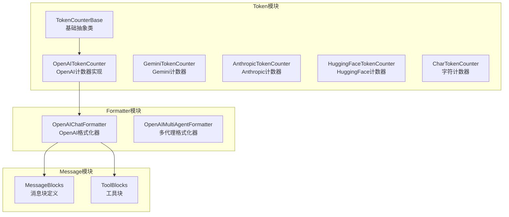
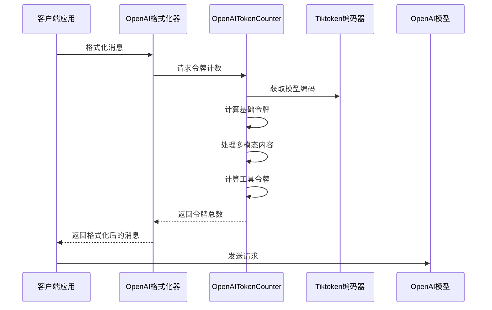
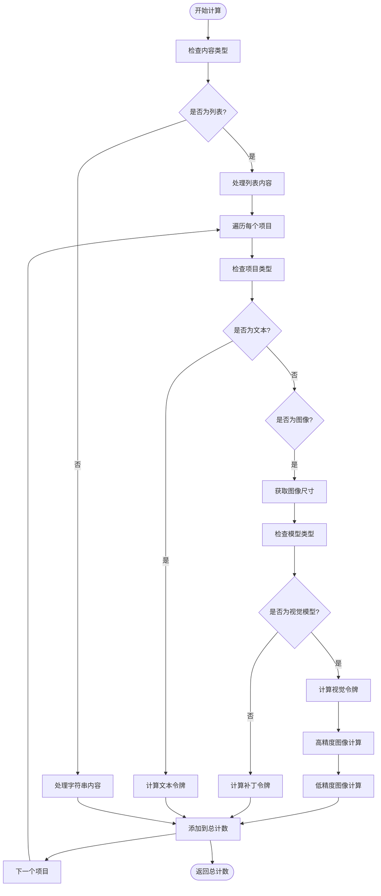
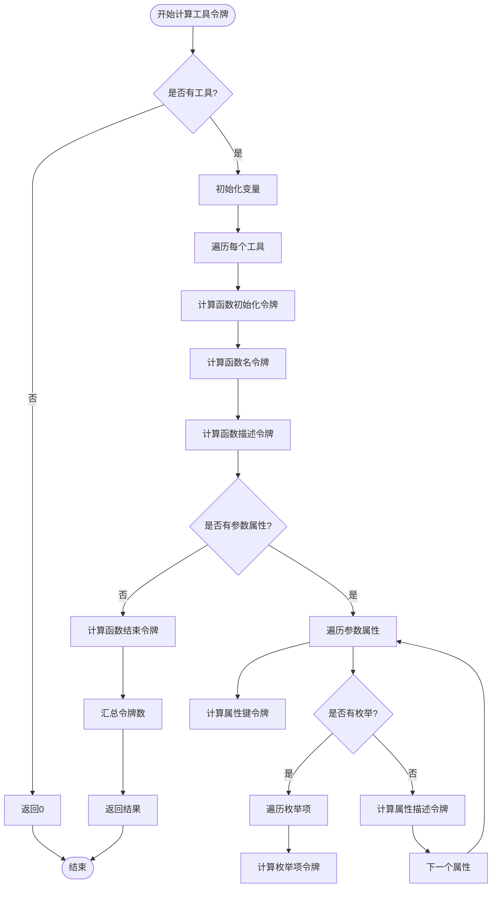
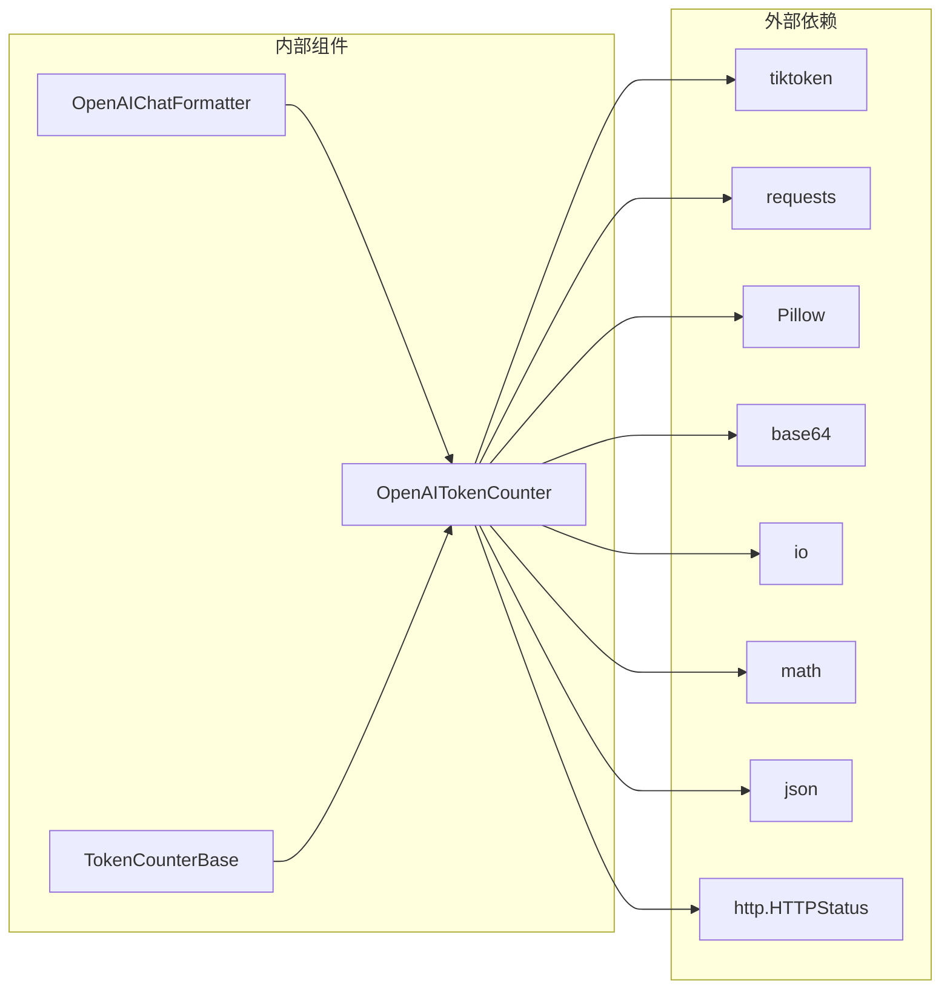

# OpenAI令牌计数器

<cite>
**本文档引用的文件**
- [src/agentscope/token/_openai_token_counter.py](file://src/agentscope/token/_openai_token_counter.py)
- [src/agentscope/token/_token_base.py](file://src/agentscope/token/_token_base.py)
- [src/agentscope/token/__init__.py](file://src/agentscope/token/__init__.py)
- [src/agentscope/formatter/_openai_formatter.py](file://src/agentscope/formatter/_openai_formatter.py)
- [src/agentscope/message/_message_block.py](file://src/agentscope/message/_message_block.py)
- [tests/token_openai_test.py](file://tests/token_openai_test.py)
- [docs/tutorial/en/src/task_token.py](file://docs/tutorial/en/src/task_token.py)
- [docs/tutorial/zh_CN/src/task_token.py](file://docs/tutorial/zh_CN/src/task_token.py)
</cite>

## 目录
1. [简介](#简介)
2. [项目结构](#项目结构)
3. [核心组件](#核心组件)
4. [架构概览](#架构概览)
5. [详细组件分析](#详细组件分析)
6. [依赖关系分析](#依赖关系分析)
7. [性能考虑](#性能考虑)
8. [故障排除指南](#故障排除指南)
9. [结论](#结论)
10. [附录](#附录)

## 简介
AgentScope的OpenAI令牌计数器是一个专门用于计算OpenAI模型（特别是GPT-3.5/Turbo系列）令牌数量的组件。该计数器基于tiktoken库，实现了精确的令牌计算算法，支持多种OpenAI模型的特殊处理，包括函数调用令牌、系统提示令牌、用户消息令牌的区分计算。

该组件的核心目标是为AgentScope框架提供准确的令牌计数能力，确保在使用OpenAI API时能够精确控制成本和资源使用。通过与OpenAI格式化器和消息块系统的深度集成，它能够处理复杂的多模态消息（文本、图像、音频等）并提供一致的计数结果。

## 项目结构
OpenAI令牌计数器位于AgentScope项目的token模块中，采用清晰的分层架构设计：



**图表来源**
- [src/agentscope/token/_openai_token_counter.py:297-385](file://src/agentscope/token/_openai_token_counter.py#L297-L385)
- [src/agentscope/token/_token_base.py:7-17](file://src/agentscope/token/_token_base.py#L7-L17)
- [src/agentscope/formatter/_openai_formatter.py:168-541](file://src/agentscope/formatter/_openai_formatter.py#L168-L541)

**章节来源**
- [src/agentscope/token/__init__.py:1-20](file://src/agentscope/token/__init__.py#L1-L20)
- [src/agentscope/token/_openai_token_counter.py:1-385](file://src/agentscope/token/_openai_token_counter.py#L1-L385)

## 核心组件
OpenAI令牌计数器由以下核心组件构成：

### 基础接口
TokenCounterBase提供了统一的令牌计数接口，定义了异步count方法，确保所有令牌计数器实现具有一致的API。

### 主要实现
OpenAITokenCounter是核心实现类，负责：
- 模型特定的令牌计算逻辑
- 多模态内容的令牌统计
- 工具调用的令牌计算
- 错误处理和边界情况管理

### 支持的模型
当前版本支持以下OpenAI模型：
- GPT-4o系列：gpt-4o、gpt-4.1、gpt-4.5
- O系列：o1、o1-pro、o3
- GPT-4o迷你版：gpt-4o-mini

**章节来源**
- [src/agentscope/token/_token_base.py:7-17](file://src/agentscope/token/_token_base.py#L7-L17)
- [src/agentscope/token/_openai_token_counter.py:297-385](file://src/agentscope/token/_openai_token_counter.py#L297-L385)

## 架构概览
OpenAI令牌计数器采用模块化设计，与AgentScope的其他组件紧密集成：



**图表来源**
- [src/agentscope/formatter/_openai_formatter.py:219-371](file://src/agentscope/formatter/_openai_formatter.py#L219-L371)
- [src/agentscope/token/_openai_token_counter.py:309-384](file://src/agentscope/token/_openai_token_counter.py#L309-L384)

## 详细组件分析

### OpenAITokenCounter类分析

#### 类结构图
```mermaid
classDiagram
class TokenCounterBase {
<<abstract>>
+count(messages, **kwargs) int
}
class OpenAITokenCounter {
-model_name : str
+__init__(model_name : str)
+count(messages : list, tools : list = None, **kwargs) int
-_count_content_tokens_for_openai_vision_model() int
-_calculate_tokens_for_tools() int
-_calculate_tokens_for_high_quality_image() int
}
class TokenCounterBase <|-- OpenAITokenCounter
```

**图表来源**
- [src/agentscope/token/_token_base.py:7-17](file://src/agentscope/token/_token_base.py#L7-L17)
- [src/agentscope/token/_openai_token_counter.py:297-385](file://src/agentscope/token/_openai_token_counter.py#L297-L385)

#### 核心算法实现

##### 基础令牌计算
OpenAITokenCounter使用tiktoken库进行精确的令牌编码，支持以下特性：
- 自动模型检测和回退机制
- 统一的消息格式处理
- 名称字段的额外令牌计算

##### 多模态内容处理
对于包含图像的内容，系统实现了OpenAI官方的视觉模型令牌计算算法：
- 图像尺寸缩放计算
- 瓦片分割算法
- 基础令牌和瓦片令牌的组合计算

##### 工具调用令牌计算
系统实现了基于OpenAI Cookbook的工具模式令牌计算：
- 函数初始化和结束令牌
- 参数属性的令牌计算
- 枚举类型的特殊处理

**章节来源**
- [src/agentscope/token/_openai_token_counter.py:297-385](file://src/agentscope/token/_openai_token_counter.py#L297-L385)

### 令牌计算算法详解

#### 视觉模型令牌计算流程


**图表来源**
- [src/agentscope/token/_openai_token_counter.py:177-294](file://src/agentscope/token/_openai_token_counter.py#L177-L294)

#### 工具模式令牌计算流程


**图表来源**
- [src/agentscope/token/_openai_token_counter.py:121-174](file://src/agentscope/token/_openai_token_counter.py#L121-L174)

**章节来源**
- [src/agentscope/token/_openai_token_counter.py:177-294](file://src/agentscope/token/_openai_token_counter.py#L177-L294)

### 数据结构和复杂度分析

#### 消息块类型定义
OpenAI格式化器支持多种消息块类型，每种类型都有特定的令牌计算规则：

| 消息块类型 | 描述 | 令牌计算方式 |
|-----------|------|-------------|
| TextBlock | 文本内容 | 使用tiktoken编码器直接计算 |
| ImageBlock | 图像内容 | 基于OpenAI视觉模型的瓦片计算 |
| AudioBlock | 音频内容 | 特殊格式处理，不直接计算令牌 |
| ToolUseBlock | 工具调用 | JSON序列化后计算令牌 |
| ToolResultBlock | 工具结果 | 文本化后计算令牌 |

#### 时间复杂度分析
- **基础令牌计算**：O(n)，其中n为消息数量
- **文本令牌计算**：O(m)，其中m为文本长度
- **图像令牌计算**：O(1)，固定时间复杂度
- **工具令牌计算**：O(k)，其中k为工具数量

**章节来源**
- [src/agentscope/message/_message_block.py:9-129](file://src/agentscope/message/_message_block.py#L9-L129)

## 依赖关系分析

### 外部依赖
OpenAI令牌计数器主要依赖以下外部库：



**图表来源**
- [src/agentscope/token/_openai_token_counter.py:6-15](file://src/agentscope/token/_openai_token_counter.py#L6-L15)
- [src/agentscope/formatter/_openai_formatter.py:1-25](file://src/agentscope/formatter/_openai_formatter.py#L1-L25)

### 内部耦合关系
- OpenAITokenCounter依赖TokenCounterBase接口
- OpenAIChatFormatter依赖OpenAITokenCounter进行令牌限制
- 消息块系统为令牌计算提供数据结构支持

**章节来源**
- [src/agentscope/token/_openai_token_counter.py:15-15](file://src/agentscope/token/_openai_token_counter.py#L15-L15)
- [src/agentscope/formatter/_openai_formatter.py:24-24](file://src/agentscope/formatter/_openai_formatter.py#L24-L24)

## 性能考虑

### 编码器选择策略
系统采用智能的编码器选择策略来平衡性能和准确性：

1. **优先使用模型特定编码器**：当tiktoken支持特定模型时，使用模型专用编码器
2. **回退到通用编码器**：当模型不受支持时，自动切换到o200k_base编码器
3. **缓存机制**：tiktoken库内置缓存，避免重复创建编码器实例

### 内存优化
- 图像令牌计算采用流式处理，避免加载整个图像到内存
- 工具令牌计算使用增量累加，减少中间变量创建
- 字符串处理使用生成器模式，提高内存效率

### 并发处理
- 异步计数器设计支持并发调用
- 图像尺寸获取使用异步HTTP请求
- 编码器操作在独立线程中执行

## 故障排除指南

### 常见问题和解决方案

#### 模型不支持错误
**问题**：当使用不受支持的OpenAI模型时
**解决方案**：系统会自动回退到o200k_base编码器，但可能影响准确性

#### 图像处理异常
**问题**：图像URL无法解析或下载失败
**解决方案**：系统提供重试机制，最多尝试3次下载

#### 工具模式令牌计算不准确
**问题**：工具JSON模式的令牌计算与实际API有差异
**解决方案**：这是已知限制，建议使用OpenAI官方计数器进行验证

#### 多模态内容处理错误
**问题**：包含多种内容类型的消息处理异常
**解决方案**：确保消息格式符合OpenAI API规范

**章节来源**
- [tests/token_openai_test.py:1-161](file://tests/token_openai_test.py#L1-L161)

## 结论
AgentScope的OpenAI令牌计数器提供了一个功能完整、性能优良的令牌计算解决方案。通过精确的算法实现和优雅的错误处理机制，它能够满足大多数应用场景的需求。

主要优势包括：
- **准确性**：基于tiktoken库和OpenAI官方算法
- **完整性**：支持多种OpenAI模型和多模态内容
- **易用性**：简洁的API设计和详细的文档
- **可扩展性**：模块化架构便于功能扩展

未来改进方向：
- 完善工具模式令牌计算的准确性
- 增加更多OpenAI模型的支持
- 实现更精细的缓存机制
- 提供更详细的性能监控和报告

## 附录

### 使用示例

#### 基础令牌计数
```python
from agentscope.token import OpenAITokenCounter

# 创建计数器实例
counter = OpenAITokenCounter(model_name="gpt-4o-mini")

# 准备消息
messages = [
    {"role": "user", "content": "Hello!"},
    {"role": "assistant", "content": "Hi, how can I help you?"}
]

# 计算令牌
n_tokens = await counter.count(messages)
print(f"令牌数量: {n_tokens}")
```

#### 多模态内容计数
```python
from agentscope.token import OpenAITokenCounter

counter = OpenAITokenCounter(model_name="gpt-4o")

# 包含图像的消息
messages = [
    {
        "role": "user",
        "content": [
            {"type": "text", "text": "描述这张图片"},
            {"type": "image_url", "image_url": {"url": "image_url"}}
        ]
    }
]

n_tokens = await counter.count(messages)
```

#### 工具模式计数
```python
from agentscope.token import OpenAITokenCounter

counter = OpenAITokenCounter(model_name="gpt-4o")

# 工具定义
tools = [
    {
        "type": "function",
        "function": {
            "name": "get_weather",
            "description": "获取天气信息",
            "parameters": {
                "type": "object",
                "properties": {
                    "city": {"type": "string"}
                }
            }
        }
    }
]

n_tokens = await counter.count(messages, tools)
```

### 配置选项和最佳实践

#### 模型选择
- **GPT-4o系列**：适用于高质量对话和复杂任务
- **GPT-4o-mini**：适用于成本敏感的任务
- **O系列**：适用于推理和思考密集型任务

#### 性能优化建议
1. **批量处理**：将多个消息合并处理以减少开销
2. **缓存策略**：复用计数器实例避免重复初始化
3. **预计算**：对静态内容进行预计算和缓存
4. **异步处理**：利用异步特性提高并发性能

#### 成本控制策略
1. **令牌限制**：设置合理的令牌上限防止过度消耗
2. **动态调整**：根据历史使用情况动态调整模型参数
3. **监控告警**：建立使用量监控和告警机制
4. **优化提示**：通过提示工程减少不必要的令牌消耗

**章节来源**
- [docs/tutorial/en/src/task_token.py:49-63](file://docs/tutorial/en/src/task_token.py#L49-L63)
- [docs/tutorial/zh_CN/src/task_token.py:55-69](file://docs/tutorial/zh_CN/src/task_token.py#L55-L69)