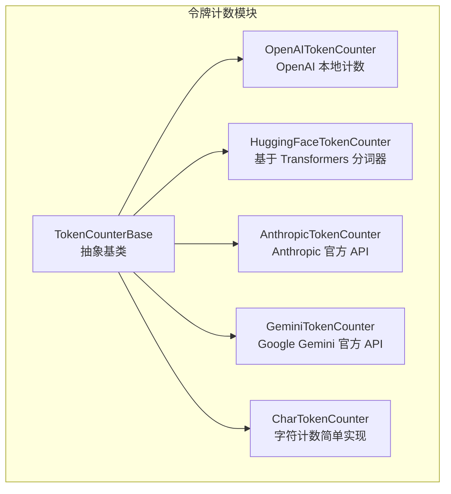
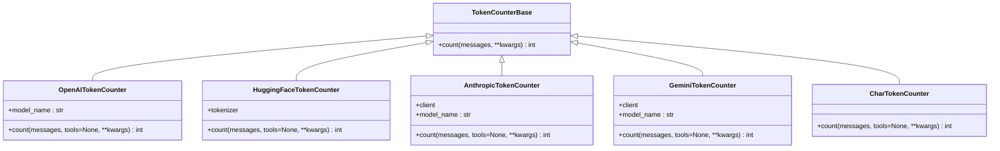
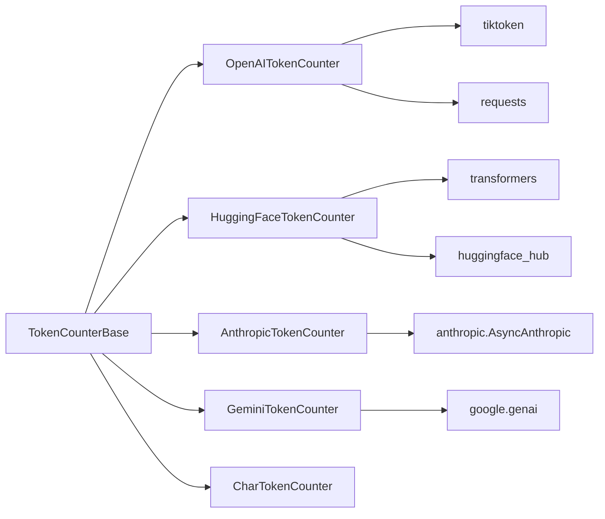

# 令牌计数

<cite>
**本文引用的文件**
- [src/agentscope/token/__init__.py](file://src/agentscope/token/__init__.py)
- [src/agentscope/token/_token_base.py](file://src/agentscope/token/_token_base.py)
- [src/agentscope/token/_openai_token_counter.py](file://src/agentscope/token/_openai_token_counter.py)
- [src/agentscope/token/_char_token_counter.py](file://src/agentscope/token/_char_token_counter.py)
- [src/agentscope/token/_huggingface_token_counter.py](file://src/agentscope/token/_huggingface_token_counter.py)
- [src/agentscope/token/_anthropic_token_counter.py](file://src/agentscope/token/_anthropic_token_counter.py)
- [src/agentscope/token/_gemini_token_counter.py](file://src/agentscope/token/_gemini_token_counter.py)
- [docs/tutorial/zh_CN/src/task_token.py](file://docs/tutorial/zh_CN/src/task_token.py)
- [examples/tuner/model_selection/example_token_usage.py](file://examples/tuner/model_selection/example_token_usage.py)
- [tests/token_openai_test.py](file://tests/token_openai_test.py)
- [tests/token_char_test.py](file://tests/token_char_test.py)
- [tests/token_anthropic_test.py](file://tests/token_anthropic_test.py)
</cite>

## 目录
1. [简介](#简介)
2. [项目结构](#项目结构)
3. [核心组件](#核心组件)
4. [架构总览](#架构总览)
5. [详细组件分析](#详细组件分析)
6. [依赖关系分析](#依赖关系分析)
7. [性能考量](#性能考量)
8. [故障排查指南](#故障排查指南)
9. [结论](#结论)
10. [附录](#附录)

## 简介
本技术文档围绕 AgentScope 的令牌计数系统展开，系统性说明令牌计数器基类的设计、计数算法、精度控制与性能优化；并深入解析各平台计数器的实现差异：OpenAI 本地精确计数、字符级简单计数、HuggingFace 基于模型分词器的计数、Anthropic 与 Gemini 的官方 API 计数。文档还覆盖令牌计数在成本估算、预算控制、性能监控中的应用场景，以及调用记录、费用计算与趋势分析的统计机制，并提供可配置的计数策略、精度与缓存选项，辅以使用示例、成本分析方法与优化建议，最后给出完整的 API 参考与最佳实践。

## 项目结构
AgentScope 的令牌计数模块位于 agentscope/token 下，采用“平台适配器”风格组织，统一通过抽象基类 TokenCounterBase 提供异步计数接口，具体平台由独立实现类负责对接官方库或本地分词器。

图表来源
- [src/agentscope/token/_token_base.py:7-16](file://src/agentscope/token/_token_base.py#L7-L16)
- [src/agentscope/token/_openai_token_counter.py:297-384](file://src/agentscope/token/_openai_token_counter.py#L297-L384)
- [src/agentscope/token/_huggingface_token_counter.py:9-94](file://src/agentscope/token/_huggingface_token_counter.py#L9-L94)
- [src/agentscope/token/_anthropic_token_counter.py:7-62](file://src/agentscope/token/_anthropic_token_counter.py#L7-L62)
- [src/agentscope/token/_gemini_token_counter.py:8-50](file://src/agentscope/token/_gemini_token_counter.py#L8-L50)
- [src/agentscope/token/_char_token_counter.py:8-43](file://src/agentscope/token/_char_token_counter.py#L8-L43)

章节来源
- [src/agentscope/token/__init__.py:1-19](file://src/agentscope/token/__init__.py#L1-L19)

## 核心组件
- 抽象基类 TokenCounterBase：定义统一的异步 count 接口，要求子类实现对消息列表的令牌计数。
- 平台计数器：
  - OpenAI：基于 tiktoken 的本地计数，支持多模态内容（文本、图片）、工具 schema 计数与不同模型的计数规则。
  - HuggingFace：通过 transformers AutoTokenizer 加载模型分词器，应用 chat_template 统一编码，支持工具 schema。
  - Anthropic：调用官方 AsyncAnthropic 的 count_tokens 接口，支持多模态与工具。
  - Gemini：调用 google genai 的 models.count_tokens 接口，返回 total_tokens。
  - 字符计数：将消息序列化后按字符长度计数，适合快速估算或非多模态场景。

章节来源
- [src/agentscope/token/_token_base.py:7-16](file://src/agentscope/token/_token_base.py#L7-L16)
- [src/agentscope/token/_openai_token_counter.py:297-384](file://src/agentscope/token/_openai_token_counter.py#L297-L384)
- [src/agentscope/token/_huggingface_token_counter.py:9-94](file://src/agentscope/token/_huggingface_token_counter.py#L9-L94)
- [src/agentscope/token/_anthropic_token_counter.py:7-62](file://src/agentscope/token/_anthropic_token_counter.py#L7-L62)
- [src/agentscope/token/_gemini_token_counter.py:8-50](file://src/agentscope/token/_gemini_token_counter.py#L8-L50)
- [src/agentscope/token/_char_token_counter.py:8-43](file://src/agentscope/token/_char_token_counter.py#L8-L43)

## 架构总览
以下类图展示了令牌计数器的继承与依赖关系，以及关键方法签名与职责边界。

图表来源
- [src/agentscope/token/_token_base.py:7-16](file://src/agentscope/token/_token_base.py#L7-L16)
- [src/agentscope/token/_openai_token_counter.py:297-384](file://src/agentscope/token/_openai_token_counter.py#L297-L384)
- [src/agentscope/token/_huggingface_token_counter.py:9-94](file://src/agentscope/token/_huggingface_token_counter.py#L9-L94)
- [src/agentscope/token/_anthropic_token_counter.py:7-62](file://src/agentscope/token/_anthropic_token_counter.py#L7-L62)
- [src/agentscope/token/_gemini_token_counter.py:8-50](file://src/agentscope/token/_gemini_token_counter.py#L8-L50)
- [src/agentscope/token/_char_token_counter.py:8-43](file://src/agentscope/token/_char_token_counter.py#L8-L43)

## 详细组件分析

### 抽象基类 TokenCounterBase
- 职责：定义统一的异步计数接口，确保所有平台计数器具备一致的调用形态。
- 关键点：异步设计便于在高并发或网络请求场景下提升吞吐；参数支持可变关键字，便于扩展工具 schema 等附加输入。

章节来源
- [src/agentscope/token/_token_base.py:7-16](file://src/agentscope/token/_token_base.py#L7-L16)

### OpenAI 令牌计数器（OpenAITokenCounter）
- 计数算法与精度
  - 使用 tiktoken 编码器，优先按模型名获取对应编码器；若失败则回退到 o200k_base。
  - 文本内容直接编码计数；多模态内容（vision）根据模型类型与图片尺寸采用不同计数规则，支持 low/auto/high 三种 detail 策略。
  - 工具 schema 计数遵循 OpenAI Cookbook 的经验公式，针对函数名、描述、属性等字段进行累加。
  - 消息头尾与角色名额外 token 常量计入，保证与官方格式一致。
- 性能优化
  - 仅在必要时加载编码器，避免重复初始化。
  - 多模态计数前先解析图片尺寸，减少不必要的网络请求。
- 错误处理
  - 不支持的模型或 detail 值会抛出异常，便于提前发现配置问题。
- 使用示例与测试
  - 单测覆盖了多模态与工具 schema 的计数结果，确保与预期一致。

```mermaid
flowchart TD
Start(["进入 count"]) --> TryEnc["尝试获取模型对应编码器"]
TryEnc --> EncOK{"获取成功？"}
EncOK --> |否| Fallback["回退到 o200k_base 编码器"]
EncOK --> |是| InitTokens["初始化基础 token 计数"]
InitTokens --> LoopMsg["遍历每条消息"]
LoopMsg --> KeyCheck{"键值类型检查"}
KeyCheck --> |content 为 list| Vision["多模态内容计数"]
KeyCheck --> |content 为 str| EncodeText["编码文本并累加"]
KeyCheck --> |tool_calls| JsonEncode["JSON 序列化并编码累加"]
KeyCheck --> |name| AddName["累加 name 常量 token"]
KeyCheck --> |其他| RaiseType["抛出类型错误"]
Vision --> DetailCheck{"detail 策略"}
DetailCheck --> |low| LowDetail["按 base tokens 计入"]
DetailCheck --> |auto/high| HighDetail["按 tiles 计算并累加"]
DetailCheck --> |其他| RaiseDetail["抛出 detail 错误"]
LowDetail --> NextMsg["下一条消息"]
HighDetail --> NextMsg
EncodeText --> NextMsg
JsonEncode --> NextMsg
AddName --> NextMsg
RaiseType --> EndErr["结束并抛错"]
RaiseDetail --> EndErr
NextMsg --> Done{"消息遍历完成？"}
Done --> |否| LoopMsg
Done --> |是| ToolsCheck{"存在 tools？"}
ToolsCheck --> |是| ToolCalc["按 Cookbook 公式累加工具 tokens"]
ToolsCheck --> |否| ReturnRes["返回最终 token 数"]
ToolCalc --> ReturnRes
```

图表来源
- [src/agentscope/token/_openai_token_counter.py:309-384](file://src/agentscope/token/_openai_token_counter.py#L309-L384)
- [src/agentscope/token/_openai_token_counter.py:177-294](file://src/agentscope/token/_openai_token_counter.py#L177-L294)
- [src/agentscope/token/_openai_token_counter.py:121-174](file://src/agentscope/token/_openai_token_counter.py#L121-L174)

章节来源
- [src/agentscope/token/_openai_token_counter.py:297-384](file://src/agentscope/token/_openai_token_counter.py#L297-L384)
- [tests/token_openai_test.py:142-161](file://tests/token_openai_test.py#L142-L161)

### 字符令牌计数器（CharTokenCounter）
- 设计理念：将消息与工具序列化为字符串后按字符长度计数，实现简单、无外部依赖，适合快速估算或非多模态场景。
- 适用场景：对精度要求不高、需要极简实现或临时替代的场合。
- 注意事项：对 base64 图片等会显著放大字符数，可能造成高估。

章节来源
- [src/agentscope/token/_char_token_counter.py:8-43](file://src/agentscope/token/_char_token_counter.py#L8-L43)
- [tests/token_char_test.py:9-35](file://tests/token_char_test.py#L9-L35)

### HuggingFace 令牌计数器（HuggingFaceTokenCounter）
- 模型集成：通过 transformers.AutoTokenizer 从 HuggingFace Hub 下载指定模型的分词器，要求模型具备 chat_template。
- 计数流程：使用 tokenizer.apply_chat_template 对消息与工具 schema 进行统一编码，返回 token 数组长度。
- 配置选项：支持 use_mirror（镜像加速）、use_fast、trust_remote_code 等参数传递给分词器。
- 错误处理：当模型无 chat_template 时抛出异常，提示用户更换模型或启用模板。

章节来源
- [src/agentscope/token/_huggingface_token_counter.py:9-94](file://src/agentscope/token/_huggingface_token_counter.py#L9-L94)

### Anthropic 令牌计数器（AnthropicTokenCounter）
- 官方 API：使用 AsyncAnthropic 的 messages.count_tokens 接口，支持多模态与工具 schema。
- 参数传递：将 model、messages、tools、system 等参数透传至客户端；若存在 system 消息需单独提取。
- 依赖准备：需要有效的 API Key；测试用例演示了在环境变量存在时的计数行为。

章节来源
- [src/agentscope/token/_anthropic_token_counter.py:7-62](file://src/agentscope/token/_anthropic_token_counter.py#L7-L62)
- [tests/token_anthropic_test.py:98-108](file://tests/token_anthropic_test.py#L98-L108)

### Gemini 令牌计数器（GeminiTokenCounter）
- 官方 API：使用 google genai 的 models.count_tokens 接口，返回 total_tokens。
- 参数传递：将 model、contents（即 messages）、tools 等参数透传至客户端。
- 依赖准备：需要有效的 API Key。

章节来源
- [src/agentscope/token/_gemini_token_counter.py:8-50](file://src/agentscope/token/_gemini_token_counter.py#L8-L50)

## 依赖关系分析
- 内部依赖：所有平台计数器均继承自 TokenCounterBase，确保统一接口与一致的异步行为。
- 外部依赖：
  - OpenAI：tiktoken（本地计数）、requests（图片尺寸探测）。
  - HuggingFace：transformers（AutoTokenizer）、huggingface_hub（镜像配置）。
  - Anthropic：anthropic.AsyncAnthropic（官方异步客户端）。
  - Gemini：google.genai（官方客户端）。
- 潜在耦合点：HuggingFace 计数器强依赖 chat_template；OpenAI 计数器依赖模型名与 tiktoken 编码器；Anthropic/Gemini 计数器依赖网络与 API Key。

图表来源
- [src/agentscope/token/_openai_token_counter.py:13-15](file://src/agentscope/token/_openai_token_counter.py#L13-L15)
- [src/agentscope/token/_huggingface_token_counter.py:50-57](file://src/agentscope/token/_huggingface_token_counter.py#L50-L57)
- [src/agentscope/token/_anthropic_token_counter.py:19-21](file://src/agentscope/token/_anthropic_token_counter.py#L19-L21)
- [src/agentscope/token/_gemini_token_counter.py:23-28](file://src/agentscope/token/_gemini_token_counter.py#L23-L28)

## 性能考量
- 编码器复用：OpenAI 计数器在首次调用时构建编码器，后续调用复用，避免重复开销。
- 多模态预处理：OpenAI 计数器在处理图片前解析尺寸，减少无效网络请求；HuggingFace 计数器一次性加载分词器，适合批量计数。
- 异步计数：基类统一异步设计，便于在高并发场景下提升吞吐；Anthropic/Gemini 计数器依赖异步客户端。
- 精度与代价权衡：字符计数最轻量但精度最低；OpenAI/HuggingFace 计数精度更高但有外部依赖与网络开销；官方 API 计数最权威但受网络与配额限制。

## 故障排查指南
- OpenAI 计数异常
  - 模型名不被识别：检查模型名是否在 tiktoken 支持范围内，或回退到 o200k_base。
  - detail 值非法：确认为 low/auto/high 之一。
  - 多模态内容类型错误：确保 content 中的项 type 为 text 或 image_url。
- HuggingFace 计数异常
  - 无 chat_template：更换具备 chat_template 的模型，或启用模板。
  - 镜像配置：在 use_mirror=True 时，确保环境变量与常量已正确设置。
- Anthropic/Gemini 计数异常
  - API Key 缺失：确保环境变量已配置有效密钥。
  - 系统消息处理：Anthropic 计数器会提取 system 消息作为独立参数，避免重复计数。
- 测试验证
  - 使用单测验证多模态与工具 schema 的计数结果，确保与预期一致。

章节来源
- [tests/token_openai_test.py:142-161](file://tests/token_openai_test.py#L142-L161)
- [tests/token_char_test.py:9-35](file://tests/token_char_test.py#L9-L35)
- [tests/token_anthropic_test.py:98-108](file://tests/token_anthropic_test.py#L98-L108)

## 结论
AgentScope 的令牌计数系统通过统一的抽象基类与多平台适配器，实现了对 OpenAI、HuggingFace、Anthropic、Gemini 与字符级计数的完整覆盖。OpenAI 与 HuggingFace 计数器在精度上更具权威性，而字符计数器提供了极简的估算方案。结合异步接口与合理的错误处理，系统能够在不同场景下满足成本估算、预算控制与性能监控的需求。建议在生产环境中优先使用官方 API 计数器以获得最准确的结果，并在开发与快速估算阶段采用字符计数器降低依赖与开销。

## 附录

### 使用示例与成本分析方法
- OpenAI 计数示例：参考教程脚本，构造消息列表并调用 OpenAITokenCounter 的 count 方法，即可得到 token 数量。
- 成本分析：结合模型的单价（按千 tokens 计价），将 token 数量换算为近似费用；注意不同模型单价不同，且多模态输入通常按图片数量与分辨率增加费用。
- 预算控制：在发送请求前调用计数器，设定阈值并在超过阈值时拒绝或降采样；结合历史统计进行趋势分析与预警。

章节来源
- [docs/tutorial/zh_CN/src/task_token.py:55-69](file://docs/tutorial/zh_CN/src/task_token.py#L55-L69)

### 配置选项与最佳实践
- 计数策略选择
  - 高精度：OpenAI（本地）或官方 API（Anthropic/Gemini）。
  - 快速估算：字符计数。
  - 自研模型：HuggingFace 计数器，需确保模型具备 chat_template。
- 精度设置
  - OpenAI：合理设置 detail（low/auto/high）以平衡精度与成本。
  - HuggingFace：选择与下游模型一致的分词器，确保 chat_template 正确。
- 缓存机制
  - 复用编码器/分词器实例，避免重复下载与初始化。
  - 对静态消息或工具 schema 进行内存缓存，减少重复计算。
- 最佳实践
  - 在请求前统一调用计数器，记录 token 数与费用预估。
  - 对多模态输入进行预处理与压缩，降低 token 数量。
  - 在高并发场景下使用异步计数器，配合限流与重试策略。

### API 参考
- TokenCounterBase
  - 方法：count(messages, **kwargs) -> int
- OpenAITokenCounter
  - 初始化：model_name: str
  - 方法：count(messages, tools=None, **kwargs) -> int
- HuggingFaceTokenCounter
  - 初始化：pretrained_model_name_or_path: str, use_mirror: bool=False, use_fast: bool=False, trust_remote_code: bool=False, **kwargs
  - 方法：count(messages, tools=None, **kwargs) -> int
- AnthropicTokenCounter
  - 初始化：model_name: str, api_key: str, **kwargs
  - 方法：count(messages, tools=None, **kwargs) -> int
- GeminiTokenCounter
  - 初始化：model_name: str, api_key: str, **kwargs
  - 方法：count(messages, tools=None, **kwargs) -> int
- CharTokenCounter
  - 方法：count(messages, tools=None, **kwargs) -> int

章节来源
- [src/agentscope/token/_token_base.py:7-16](file://src/agentscope/token/_token_base.py#L7-L16)
- [src/agentscope/token/_openai_token_counter.py:297-384](file://src/agentscope/token/_openai_token_counter.py#L297-L384)
- [src/agentscope/token/_huggingface_token_counter.py:9-94](file://src/agentscope/token/_huggingface_token_counter.py#L9-L94)
- [src/agentscope/token/_anthropic_token_counter.py:7-62](file://src/agentscope/token/_anthropic_token_counter.py#L7-L62)
- [src/agentscope/token/_gemini_token_counter.py:8-50](file://src/agentscope/token/_gemini_token_counter.py#L8-L50)
- [src/agentscope/token/_char_token_counter.py:8-43](file://src/agentscope/token/_char_token_counter.py#L8-L43)