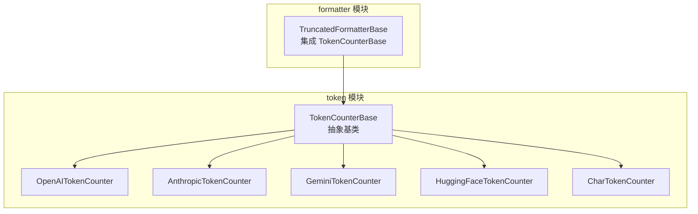
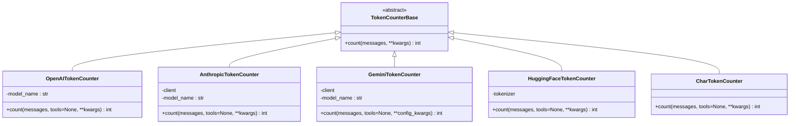
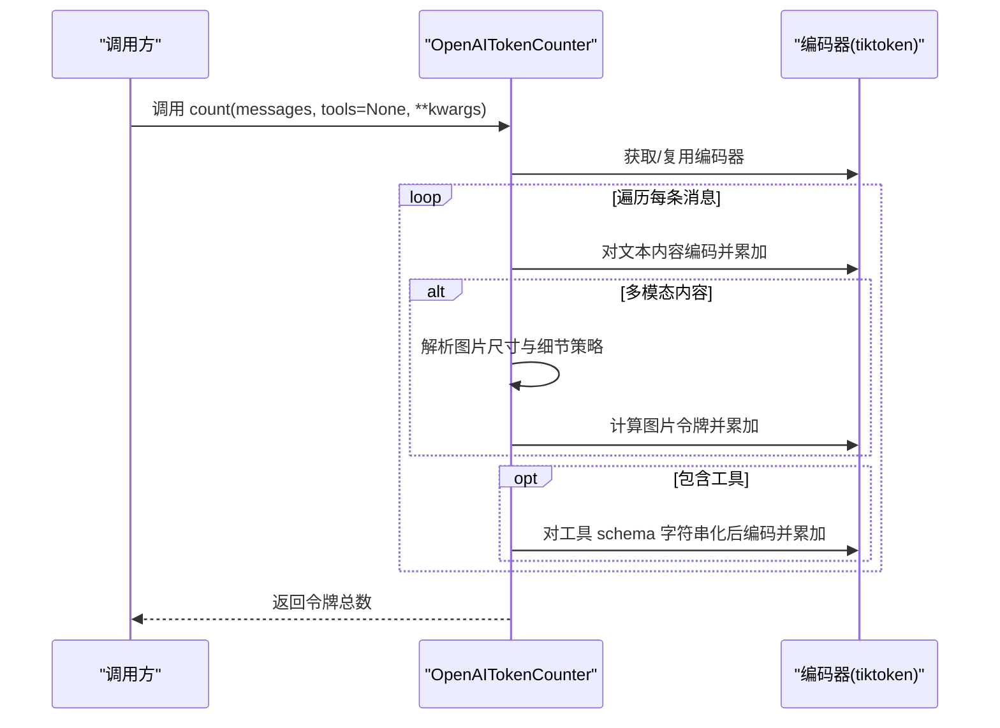
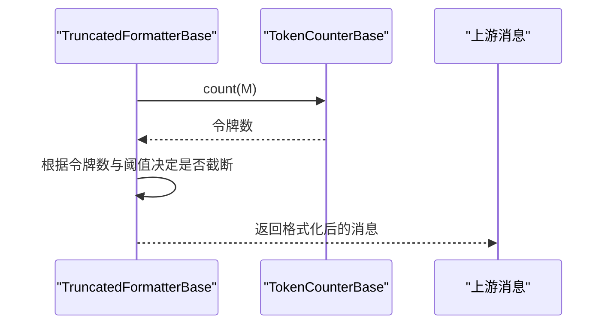
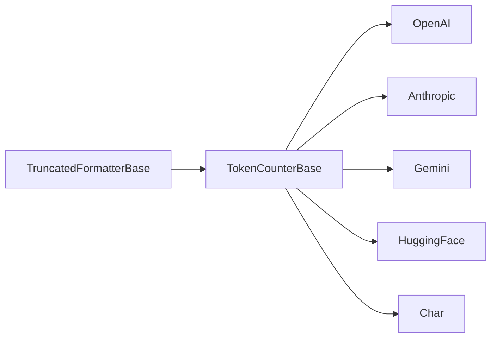

# 令牌计数器基类

<cite>
**本文引用的文件**
- [src/agentscope/token/_token_base.py](file://src/agentscope/token/_token_base.py)
- [src/agentscope/token/_openai_token_counter.py](file://src/agentscope/token/_openai_token_counter.py)
- [src/agentscope/token/_anthropic_token_counter.py](file://src/agentscope/token/_anthropic_token_counter.py)
- [src/agentscope/token/_gemini_token_counter.py](file://src/agentscope/token/_gemini_token_counter.py)
- [src/agentscope/token/_huggingface_token_counter.py](file://src/agentscope/token/_huggingface_token_counter.py)
- [src/agentscope/token/_char_token_counter.py](file://src/agentscope/token/_char_token_counter.py)
- [src/agentscope/token/__init__.py](file://src/agentscope/token/__init__.py)
- [src/agentscope/formatter/_truncated_formatter_base.py](file://src/agentscope/formatter/_truncated_formatter_base.py)
- [docs/tutorial/zh_CN/src/task_token.py](file://docs/tutorial/zh_CN/src/task_token.py)
- [tests/token_openai_test.py](file://tests/token_openai_test.py)
- [tests/token_char_test.py](file://tests/token_char_test.py)
- [examples/tuner/model_selection/example_token_usage.py](file://examples/tuner/model_selection/example_token_usage.py)
</cite>

## 目录
1. [简介](#简介)
2. [项目结构](#项目结构)
3. [核心组件](#核心组件)
4. [架构总览](#架构总览)
5. [详细组件分析](#详细组件分析)
6. [依赖分析](#依赖分析)
7. [性能考量](#性能考量)
8. [故障排查指南](#故障排查指南)
9. [结论](#结论)
10. [附录](#附录)

## 简介
本文件围绕 AgentScope 的令牌计数器基类 TokenCounterBase 展开，系统性说明其抽象设计、异步接口、消息格式要求、扩展性考虑，并给出继承实现规范、错误处理与性能优化建议。同时通过多个具体实现（如 OpenAI、Anthropic、Gemini、HuggingFace、字符计数）展示基类在实际系统中的角色与集成方式。

## 项目结构
与令牌计数器相关的核心代码位于 agentscope/token 模块，包含一个抽象基类与若干具体实现；formatter 模块通过 TruncatedFormatterBase 集成 TokenCounterBase，用于提示截断与令牌预算控制；教程与测试文件提供了使用示例与验证。

**图表来源**
- [src/agentscope/token/_token_base.py:7-16](file://src/agentscope/token/_token_base.py#L7-L16)
- [src/agentscope/token/_openai_token_counter.py:297-384](file://src/agentscope/token/_openai_token_counter.py#L297-L384)
- [src/agentscope/token/_anthropic_token_counter.py:7-62](file://src/agentscope/token/_anthropic_token_counter.py#L7-L62)
- [src/agentscope/token/_gemini_token_counter.py:8-50](file://src/agentscope/token/_gemini_token_counter.py#L8-L50)
- [src/agentscope/token/_huggingface_token_counter.py:9-94](file://src/agentscope/token/_huggingface_token_counter.py#L9-L94)
- [src/agentscope/token/_char_token_counter.py:8-43](file://src/agentscope/token/_char_token_counter.py#L8-L43)
- [src/agentscope/formatter/_truncated_formatter_base.py:19-42](file://src/agentscope/formatter/_truncated_formatter_base.py#L19-L42)

**章节来源**
- [src/agentscope/token/__init__.py:1-19](file://src/agentscope/token/__init__.py#L1-L19)
- [src/agentscope/formatter/_truncated_formatter_base.py:19-42](file://src/agentscope/formatter/_truncated_formatter_base.py#L19-L42)

## 核心组件
- TokenCounterBase 抽象基类：定义统一的异步计数接口 count，作为所有具体计数器的契约。
- 具体实现：
  - OpenAI：基于本地编码库进行计数，支持多模态内容与工具 schema。
  - Anthropic：调用官方 API 的计数能力，支持多模态与工具。
  - Gemini：调用官方 API 的计数能力，支持多模态与工具。
  - HuggingFace：基于 Transformers 的 tokenizer 计数，需具备聊天模板。
  - 字符计数：简单按字符长度估算，适合快速评估或兼容性场景。

这些实现均遵循基类的异步接口，确保在异步运行时环境（如 asyncio）中可被统一调度与复用。

**章节来源**
- [src/agentscope/token/_token_base.py:7-16](file://src/agentscope/token/_token_base.py#L7-L16)
- [src/agentscope/token/_openai_token_counter.py:297-384](file://src/agentscope/token/_openai_token_counter.py#L297-L384)
- [src/agentscope/token/_anthropic_token_counter.py:7-62](file://src/agentscope/token/_anthropic_token_counter.py#L7-L62)
- [src/agentscope/token/_gemini_token_counter.py:8-50](file://src/agentscope/token/_gemini_token_counter.py#L8-L50)
- [src/agentscope/token/_huggingface_token_counter.py:9-94](file://src/agentscope/token/_huggingface_token_counter.py#L9-L94)
- [src/agentscope/token/_char_token_counter.py:8-43](file://src/agentscope/token/_char_token_counter.py#L8-L43)

## 架构总览
TokenCounterBase 作为统一抽象，向上游格式化器与下游模型服务提供“令牌数量”这一关键指标，支撑提示截断、成本预算与资源规划等能力。

**图表来源**
- [src/agentscope/token/_token_base.py:7-16](file://src/agentscope/token/_token_base.py#L7-L16)
- [src/agentscope/token/_openai_token_counter.py:297-384](file://src/agentscope/token/_openai_token_counter.py#L297-L384)
- [src/agentscope/token/_anthropic_token_counter.py:7-62](file://src/agentscope/token/_anthropic_token_counter.py#L7-L62)
- [src/agentscope/token/_gemini_token_counter.py:8-50](file://src/agentscope/token/_gemini_token_counter.py#L8-L50)
- [src/agentscope/token/_huggingface_token_counter.py:9-94](file://src/agentscope/token/_huggingface_token_counter.py#L9-L94)
- [src/agentscope/token/_char_token_counter.py:8-43](file://src/agentscope/token/_char_token_counter.py#L8-L43)

## 详细组件分析

### 抽象基类 TokenCounterBase
- 设计理念
  - 统一异步接口：所有子类必须实现异步 count 方法，便于在异步框架中并行调度与资源管理。
  - 松耦合扩展：通过抽象方法约束输入输出，具体实现可针对不同模型生态采用本地计算或远程 API。
  - 参数最小化：基础签名仅包含 messages 与可变关键字参数，便于扩展工具 schema、配置项等。
- 接口规范
  - 方法名：count
  - 异步：是
  - 参数：
    - messages: list[dict]，消息列表，典型字段 role、content 等。
    - **kwargs: Any，扩展参数，如 tools、模型特定配置等。
  - 返回值：int，令牌总数。
- 错误处理与健壮性
  - 子类应明确抛出类型错误、值错误等异常，以便上层捕获与降级。
  - 对于外部 API 调用，应区分网络错误、鉴权失败、模型不支持等情况并给出清晰错误信息。
- 性能优化建议
  - 尽量避免重复初始化昂贵对象（如编码器、客户端）。
  - 对于本地计算型实现，优先使用批量编码与缓存策略。
  - 对于远程 API 型实现，合理设置超时与重试，避免阻塞事件循环。

**章节来源**
- [src/agentscope/token/_token_base.py:7-16](file://src/agentscope/token/_token_base.py#L7-L16)

### OpenAI 令牌计数器 OpenAITokenCounter
- 特点
  - 本地计算，依赖编码库；支持多模态文本与图片、工具 schema。
  - 针对不同模型（如 gpt-4o、o1 等）采用差异化计数规则。
- 消息格式要求
  - messages 中每个元素通常包含 role 与 content；多模态 content 为列表，包含 type、text 或 image_url 等。
  - 支持 tools 参数传入工具 schema，用于估算工具描述与参数占用。
- 错误处理
  - 编码器初始化失败时回退到默认编码；对不支持的模型名称抛出值错误。
  - 对非法字段类型与未知类型进行类型检查与异常抛出。
- 性能优化
  - 复用编码器实例；对工具 schema 使用字符串化后编码，减少重复解析。
  - 图片尺寸获取与瓦片计算按需执行，避免不必要的 I/O。

**图表来源**
- [src/agentscope/token/_openai_token_counter.py:297-384](file://src/agentscope/token/_openai_token_counter.py#L297-L384)

**章节来源**
- [src/agentscope/token/_openai_token_counter.py:297-384](file://src/agentscope/token/_openai_token_counter.py#L297-L384)
- [tests/token_openai_test.py:11-161](file://tests/token_openai_test.py#L11-L161)

### Anthropic 令牌计数器 AnthropicTokenCounter
- 特点
  - 调用官方异步客户端的计数 API；支持多模态与工具 schema。
  - 需要 API Key 初始化客户端。
- 消息格式要求
  - messages 为标准对话内容；tools 为可选工具 schema 列表。
  - 支持将 system 消息单独传入计数 API。
- 错误处理
  - 客户端初始化失败或 API 调用异常时抛出相应异常。
- 性能优化
  - 合理设置超时与重试；避免频繁重建客户端。

**章节来源**
- [src/agentscope/token/_anthropic_token_counter.py:7-62](file://src/agentscope/token/_anthropic_token_counter.py#L7-L62)

### Gemini 令牌计数器 GeminiTokenCounter
- 特点
  - 使用官方客户端的计数接口；支持多模态与工具。
- 消息格式要求
  - messages 直接作为 contents 传入计数 API；tools 通过 config 传递。
- 错误处理
  - 客户端初始化与 API 调用异常需明确区分与报告。
- 性能优化
  - 复用客户端；批量请求时注意并发与限流。

**章节来源**
- [src/agentscope/token/_gemini_token_counter.py:8-50](file://src/agentscope/token/_gemini_token_counter.py#L8-L50)

### HuggingFace 令牌计数器 HuggingFaceTokenCounter
- 特点
  - 基于 Transformers 的 AutoTokenizer；需要具备聊天模板。
  - 通过 apply_chat_template 生成编码序列并统计长度。
- 消息格式要求
  - messages 为标准对话格式；tools 作为额外参数传入模板。
- 错误处理
  - 若模型无聊天模板则直接抛出值错误，提示用户配置正确模型。
- 性能优化
  - 选择 fast tokenizer；必要时启用镜像加速下载。

**章节来源**
- [src/agentscope/token/_huggingface_token_counter.py:9-94](file://src/agentscope/token/_huggingface_token_counter.py#L9-L94)

### 字符计数器 CharTokenCounter
- 特点
  - 最简实现：将消息与工具序列化为字符串并统计字符数。
  - 不适合多模态与复杂模型，但可用于快速估算或兼容性场景。
- 错误处理
  - 对空消息列表返回 0；对非字符串字段进行显式转换。
- 性能优化
  - 使用换行拼接减少连接次数；避免重复序列化。

**章节来源**
- [src/agentscope/token/_char_token_counter.py:8-43](file://src/agentscope/token/_char_token_counter.py#L8-L43)
- [tests/token_char_test.py:6-35](file://tests/token_char_test.py#L6-L35)

### 在格式化器中的集成
TruncatedFormatterBase 通过组合 TokenCounterBase，在格式化消息时动态计算令牌数，以达到最大令牌限制的截断效果。

**图表来源**
- [src/agentscope/formatter/_truncated_formatter_base.py:19-42](file://src/agentscope/formatter/_truncated_formatter_base.py#L19-L42)

**章节来源**
- [src/agentscope/formatter/_truncated_formatter_base.py:19-42](file://src/agentscope/formatter/_truncated_formatter_base.py#L19-L42)

## 依赖分析
- 内聚性
  - TokenCounterBase 仅定义接口，内聚度高；各子类各自封装模型生态差异。
- 耦合性
  - 子类与第三方库（如 tiktoken、google、anthropic、transformers）存在直接耦合。
  - TruncatedFormatterBase 与 TokenCounterBase 存在组合关系，耦合度适中。
- 扩展性
  - 新增计数器只需继承 TokenCounterBase 并实现 count 即可无缝接入。
  - 通过 kwargs 与 tools 参数扩展不同模型生态的特性。

**图表来源**
- [src/agentscope/token/_token_base.py:7-16](file://src/agentscope/token/_token_base.py#L7-L16)
- [src/agentscope/formatter/_truncated_formatter_base.py:19-42](file://src/agentscope/formatter/_truncated_formatter_base.py#L19-L42)

**章节来源**
- [src/agentscope/token/__init__.py:1-19](file://src/agentscope/token/__init__.py#L1-L19)

## 性能考量
- 初始化成本
  - 编码器与客户端初始化应在模块加载或首次使用时完成，避免重复创建。
- 计算效率
  - 优先使用批量编码与向量化操作；对工具 schema 采用字符串化后一次性编码。
- I/O 与网络
  - 对于远程 API，合理设置超时、重试与并发上限；对图片等资源进行缓存与尺寸预估。
- 内存占用
  - 避免在计数过程中复制大量中间数据；及时释放临时对象。

## 故障排查指南
- 常见问题
  - 模型不支持：当模型名称不在支持列表或编码器不可用时，抛出值错误或类型错误。
  - 多模态格式错误：content 类型与字段不符合预期（如缺少 type、text 或 image_url），导致类型断言失败。
  - 工具 schema 缺失：tools 为空时仍需正确处理，避免漏计。
  - 外部 API 失败：网络异常、鉴权失败、配额不足等，需区分错误类型并记录上下文。
- 定位方法
  - 在调用前打印消息结构与工具 schema，核对字段完整性。
  - 分段计数：先统计文本部分，再叠加多模态与工具部分，定位异常区间。
  - 使用测试用例验证边界条件（空消息、空工具、单模态、多模态）。

**章节来源**
- [tests/token_openai_test.py:11-161](file://tests/token_openai_test.py#L11-L161)
- [tests/token_char_test.py:6-35](file://tests/token_char_test.py#L6-L35)
- [src/agentscope/token/_openai_token_counter.py:327-384](file://src/agentscope/token/_openai_token_counter.py#L327-L384)

## 结论
TokenCounterBase 以最小接口实现了跨模型生态的一致性计数能力，结合多种具体实现与格式化器集成，为 AgentScope 提供了灵活、可扩展且易于维护的令牌计数基础设施。遵循基类规范与本文的实现建议，可在保证正确性的前提下获得良好的性能与可维护性。

## 附录

### 使用示例与最佳实践
- 基础使用
  - 参考教程示例，创建计数器实例并调用异步 count 方法。
- 消息格式标准化
  - 确保 messages 中包含 role 与 content 字段；多模态 content 为列表，包含 type 与对应数据。
  - 如需工具计数，准备 tools JSON Schema 并传入 count。
- 结果验证
  - 使用单元测试或示例脚本验证计数结果；对边界条件（空消息、空工具、多模态）进行覆盖。
- 异常处理模式
  - 捕获类型错误与值错误，记录上下文信息；对外部 API 错误进行分类与重试策略设计。

**章节来源**
- [docs/tutorial/zh_CN/src/task_token.py:48-69](file://docs/tutorial/zh_CN/src/task_token.py#L48-L69)
- [examples/tuner/model_selection/example_token_usage.py:77-106](file://examples/tuner/model_selection/example_token_usage.py#L77-L106)