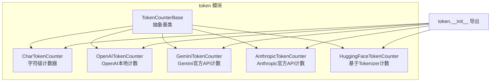
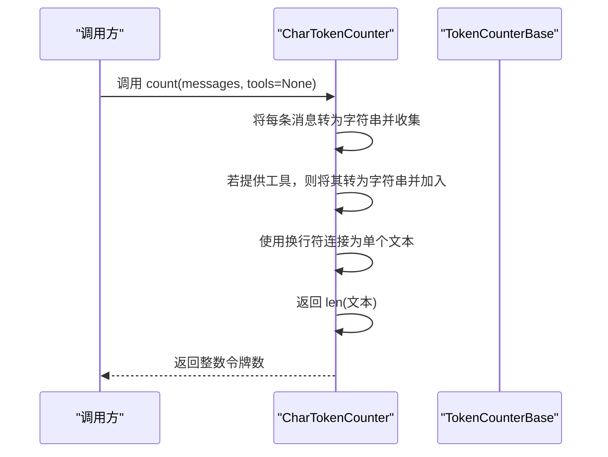
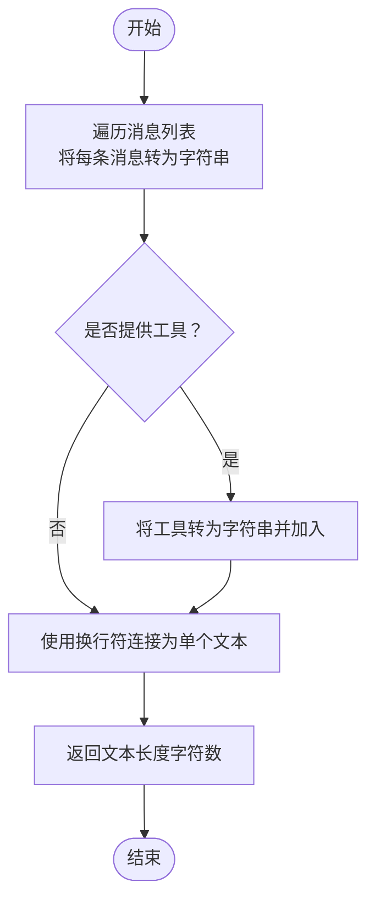
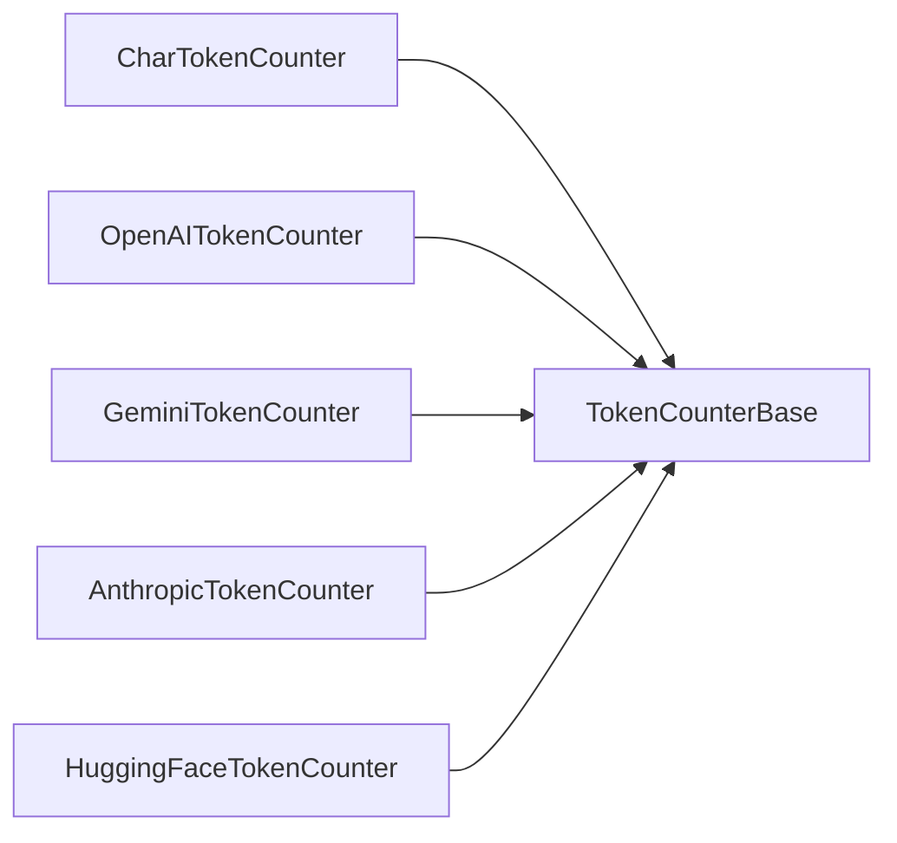

# 字符令牌计数器

<cite>
**本文引用的文件列表**
- [src/agentscope/token/_char_token_counter.py](file://src/agentscope/token/_char_token_counter.py)
- [src/agentscope/token/_token_base.py](file://src/agentscope/token/_token_base.py)
- [src/agentscope/token/__init__.py](file://src/agentscope/token/__init__.py)
- [src/agentscope/token/_openai_token_counter.py](file://src/agentscope/token/_openai_token_counter.py)
- [src/agentscope/token/_gemini_token_counter.py](file://src/agentscope/token/_gemini_token_counter.py)
- [src/agentscope/token/_anthropic_token_counter.py](file://src/agentscope/token/_anthropic_token_counter.py)
- [src/agentscope/token/_huggingface_token_counter.py](file://src/agentscope/token/_huggingface_token_counter.py)
- [tests/token_char_test.py](file://tests/token_char_test.py)
- [examples/functionality/short_term_memory/memory_compression/main.py](file://examples/functionality/short_term_memory/memory_compression/main.py)
- [docs/tutorial/en/src/task_agent.py](file://docs/tutorial/en/src/task_agent.py)
</cite>

## 目录
1. [简介](#简介)
2. [项目结构](#项目结构)
3. [核心组件](#核心组件)
4. [架构概览](#架构概览)
5. [详细组件分析](#详细组件分析)
6. [依赖分析](#依赖分析)
7. [性能考虑](#性能考虑)
8. [故障排查指南](#故障排查指南)
9. [结论](#结论)
10. [附录：使用示例与最佳实践](#附录使用示例与最佳实践)

## 简介
本技术文档聚焦于 AgentScope 中的字符令牌计数器（CharTokenCounter）。该计数器采用“字符级”策略进行令牌估算，即直接统计消息与工具描述的字符数量作为近似令牌数。其设计目标是提供一种实现简单、性能高效的快速估算手段，适用于对精度要求不高、需要即时反馈或资源受限的场景。文档将从实现原理、数据流、配置选项、优缺点、适用场景、与其他计数器的对比以及使用示例等方面进行全面阐述。

## 项目结构
与字符令牌计数器相关的核心文件位于 agentscope/token 模块中，并通过统一入口导出。下图展示了与计数器相关的模块组织与依赖关系。

图表来源
- [src/agentscope/token/_token_base.py:7-16](file://src/agentscope/token/_token_base.py#L7-L16)
- [src/agentscope/token/_char_token_counter.py:8-43](file://src/agentscope/token/_char_token_counter.py#L8-L43)
- [src/agentscope/token/_openai_token_counter.py:297-384](file://src/agentscope/token/_openai_token_counter.py#L297-L384)
- [src/agentscope/token/_gemini_token_counter.py:8-50](file://src/agentscope/token/_gemini_token_counter.py#L8-L50)
- [src/agentscope/token/_anthropic_token_counter.py:7-62](file://src/agentscope/token/_anthropic_token_counter.py#L7-L62)
- [src/agentscope/token/_huggingface_token_counter.py:9-94](file://src/agentscope/token/_huggingface_token_counter.py#L9-L94)
- [src/agentscope/token/__init__.py:4-19](file://src/agentscope/token/__init__.py#L4-L19)

章节来源
- [src/agentscope/token/__init__.py:4-19](file://src/agentscope/token/__init__.py#L4-L19)

## 核心组件
- 抽象基类 TokenCounterBase：定义异步计数接口 count，约束所有具体计数器的实现形态。
- CharTokenCounter：字符级计数器，将消息与工具序列化为字符串后拼接，返回字符长度作为令牌数。
- 其他计数器（OpenAI、Gemini、Anthropic、HuggingFace）：提供更精确的模型级计数，分别基于本地编码库、官方API或Tokenizer。

章节来源
- [src/agentscope/token/_token_base.py:7-16](file://src/agentscope/token/_token_base.py#L7-L16)
- [src/agentscope/token/_char_token_counter.py:8-43](file://src/agentscope/token/_char_token_counter.py#L8-L43)

## 架构概览
字符令牌计数器的调用流程非常简洁：接收消息列表与可选工具列表，将其转换为字符串并连接，最终返回字符串长度。该流程避免了复杂的编码解析与模型依赖，从而获得极高的执行效率。

图表来源
- [src/agentscope/token/_char_token_counter.py:17-43](file://src/agentscope/token/_char_token_counter.py#L17-L43)
- [src/agentscope/token/_token_base.py:10-16](file://src/agentscope/token/_token_base.py#L10-L16)

## 详细组件分析

### CharTokenCounter 实现原理
- 输入规范：messages 为字典列表；tools 为可选字典列表。
- 处理流程：
  - 遍历 messages，将每条消息转换为字符串并收集到列表。
  - 若提供 tools，则同样转换为字符串并追加到列表。
  - 使用换行符将所有字符串拼接为一个文本。
  - 返回该文本的字符长度。
- 关键点：
  - 字符计数等价于“UTF-8 字节长度”，因为 Python 的 len 对 str 返回 Unicode 码点数，而 UTF-8 编码下每个 ASCII 字符占 1 字节，非 ASCII 字符占多字节。对于英文文本，字符数与字节数近似相等；对于中文等多字节字符，字符数小于字节数，但该差异在估算场景中通常可接受。
  - 不处理多模态数据（如 base64 图像），因为 base64 编码会显著放大字符数，导致严重高估。

图表来源
- [src/agentscope/token/_char_token_counter.py:35-43](file://src/agentscope/token/_char_token_counter.py#L35-L43)

章节来源
- [src/agentscope/token/_char_token_counter.py:8-43](file://src/agentscope/token/_char_token_counter.py#L8-L43)

### 与其他计数器的对比
- 与 OpenAITokenCounter 对比
  - 实现方式：本地基于 tiktoken 编码器计算；CharTokenCounter 为字符级近似。
  - 精度：OpenAI 计数器更接近官方模型的实际 token 分配；CharTokenCounter 仅提供粗略估算。
  - 性能：CharTokenCounter 无外部依赖、无网络请求，速度更快。
  - 多模态支持：OpenAI 计数器内置图像尺寸与细节参数处理逻辑；CharTokenCounter 不处理多模态。
- 与 GeminiTokenCounter 对比
  - 实现方式：调用官方 Gemini API 的计数接口；CharTokenCounter 为本地计算。
  - 精度：官方 API 更可靠；CharTokenCounter 仅适合快速估算。
  - 性能：CharTokenCounter 无网络开销。
- 与 AnthropicTokenCounter 对比
  - 实现方式：调用官方 API；CharTokenCounter 为本地计算。
  - 多模态：Anthropic 计数器对 base64 数据有明确要求；CharTokenCounter 不处理多模态。
- 与 HuggingFaceTokenCounter 对比
  - 实现方式：加载指定模型的 tokenizer 并应用聊天模板；CharTokenCounter 为字符级近似。
  - 精度：Tokenizer 更贴近模型切词；CharTokenCounter 仅适合粗略估算。
  - 性能：CharTokenCounter 无需下载与初始化模型。

章节来源
- [src/agentscope/token/_openai_token_counter.py:297-384](file://src/agentscope/token/_openai_token_counter.py#L297-L384)
- [src/agentscope/token/_gemini_token_counter.py:8-50](file://src/agentscope/token/_gemini_token_counter.py#L8-L50)
- [src/agentscope/token/_anthropic_token_counter.py:7-62](file://src/agentscope/token/_anthropic_token_counter.py#L7-L62)
- [src/agentscope/token/_huggingface_token_counter.py:9-94](file://src/agentscope/token/_huggingface_token_counter.py#L9-L94)

### 配置选项与行为说明
- 编码方式：内部按 Python str 的字符长度计算，等价于 UTF-8 字节长度的近似值。
- 大小写敏感性：字符串拼接与长度计算不区分大小写，不影响结果。
- 特殊字符处理：所有字符（含标点、空格、换行）均计入；多字节字符按一个字符计数。
- 工具参数：tools 参数会被序列化为字符串并参与计数，但不会被解析为结构化 token。
- 多模态数据：不处理 base64 或二进制内容，可能导致高估。

章节来源
- [src/agentscope/token/_char_token_counter.py:17-43](file://src/agentscope/token/_char_token_counter.py#L17-L43)

### 优势与局限性
- 优势
  - 实现极其简单，易于理解与维护。
  - 性能高效，无外部依赖与网络请求。
  - 适合快速估算、临时测试与低精度需求。
- 局限性
  - 精度较低，无法反映真实模型的 token 切分规则。
  - 不支持多模态数据（如 base64 图像），可能产生显著偏差。
  - 对不同语言混合文本的估算误差随字符集变化而变化。

章节来源
- [src/agentscope/token/_char_token_counter.py:9-15](file://src/agentscope/token/_char_token_counter.py#L9-L15)

## 依赖分析
- 组件耦合
  - CharTokenCounter 仅依赖抽象基类 TokenCounterBase，耦合度低。
  - 与其他计数器相比，CharTokenCounter 不引入额外第三方库。
- 外部依赖
  - 无网络请求与外部模型依赖，运行时开销最小。
- 潜在循环依赖
  - 无循环依赖风险。

图表来源
- [src/agentscope/token/_char_token_counter.py:5-5](file://src/agentscope/token/_char_token_counter.py#L5-L5)
- [src/agentscope/token/_openai_token_counter.py:15-15](file://src/agentscope/token/_openai_token_counter.py#L15-L15)
- [src/agentscope/token/_gemini_token_counter.py:5-5](file://src/agentscope/token/_gemini_token_counter.py#L5-L5)
- [src/agentscope/token/_anthropic_token_counter.py:4-4](file://src/agentscope/token/_anthropic_token_counter.py#L4-L4)
- [src/agentscope/token/_huggingface_token_counter.py:6-6](file://src/agentscope/token/_huggingface_token_counter.py#L6-L6)

## 性能考虑
- 时间复杂度：O(N)，其中 N 为消息与工具的总字符数。
- 空间复杂度：O(N)，用于存储拼接后的文本。
- 优化建议
  - 对超长输入可考虑分段计数与缓存中间结果（视业务需求）。
  - 在高频调用场景下，避免重复序列化同一对象，可复用字符串表示。

[本节为通用性能讨论，不直接分析具体文件]

## 故障排查指南
- 计数结果异常偏大
  - 可能原因：包含 base64 图像或二进制数据，导致字符数被显著放大。
  - 解决方案：改用 OpenAI/Gemini/Anthropic/HuggingFace 计数器，或在调用前移除多模态字段。
- 计数结果异常偏小
  - 可能原因：消息中存在大量多字节字符（如中文），但模型实际切分可能更细。
  - 解决方案：使用更精确的计数器（如 OpenAI/HuggingFace）。
- 与官方计数不一致
  - 原因：字符计数器不模拟模型的切词规则，仅提供近似值。
  - 建议：在需要严格预算的场景使用官方计数器或模型自带的计数能力。

章节来源
- [src/agentscope/token/_char_token_counter.py:12-13](file://src/agentscope/token/_char_token_counter.py#L12-L13)

## 结论
CharTokenCounter 以极简实现提供字符级令牌估算，具备实现简单、性能高效的特点，适合快速估算、临时测试与低精度需求。但在需要高精度、多模态支持或严格预算控制的场景，应优先选择 OpenAI、Gemini、Anthropic 或 HuggingFace 计数器。根据实际业务需求选择合适的计数策略，可在保证效率的同时兼顾准确性。

[本节为总结性内容，不直接分析具体文件]

## 附录：使用示例与最佳实践

### 使用示例路径
- 单元测试示例
  - [tests/token_char_test.py:9-35](file://tests/token_char_test.py#L9-L35)
- 内存压缩示例（集成 CharTokenCounter）
  - [examples/functionality/short_term_memory/memory_compression/main.py:23-29](file://examples/functionality/short_term_memory/memory_compression/main.py#L23-L29)
- 文档教程示例（ReActAgent 压缩配置中使用 CharTokenCounter）
  - [docs/tutorial/en/src/task_agent.py:140-146](file://docs/tutorial/en/src/task_agent.py#L140-L146)

### 适用场景
- 快速估算：在开发调试阶段快速评估消息规模。
- 临时测试：不需要严格 token 数的临时脚本或演示。
- 低精度需求：对预算或长度控制要求不严格的场景。

### 最佳实践
- 估算与预算分离：先用 CharTokenCounter 做快速估算，再用更精确计数器做最终预算。
- 多模态数据规避：若消息包含 base64 图像，请改用 OpenAI/Gemini/Anthropic 计数器。
- 频繁调用优化：对重复输入可缓存字符串表示，减少重复序列化开销。

章节来源
- [tests/token_char_test.py:9-35](file://tests/token_char_test.py#L9-L35)
- [examples/functionality/short_term_memory/memory_compression/main.py:23-29](file://examples/functionality/short_term_memory/memory_compression/main.py#L23-L29)
- [docs/tutorial/en/src/task_agent.py:140-146](file://docs/tutorial/en/src/task_agent.py#L140-L146)