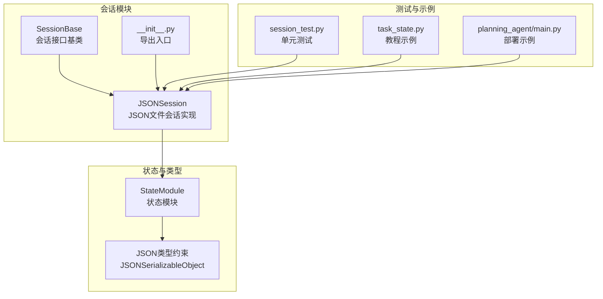
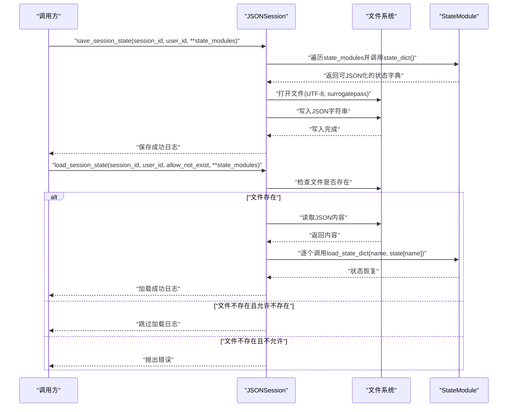
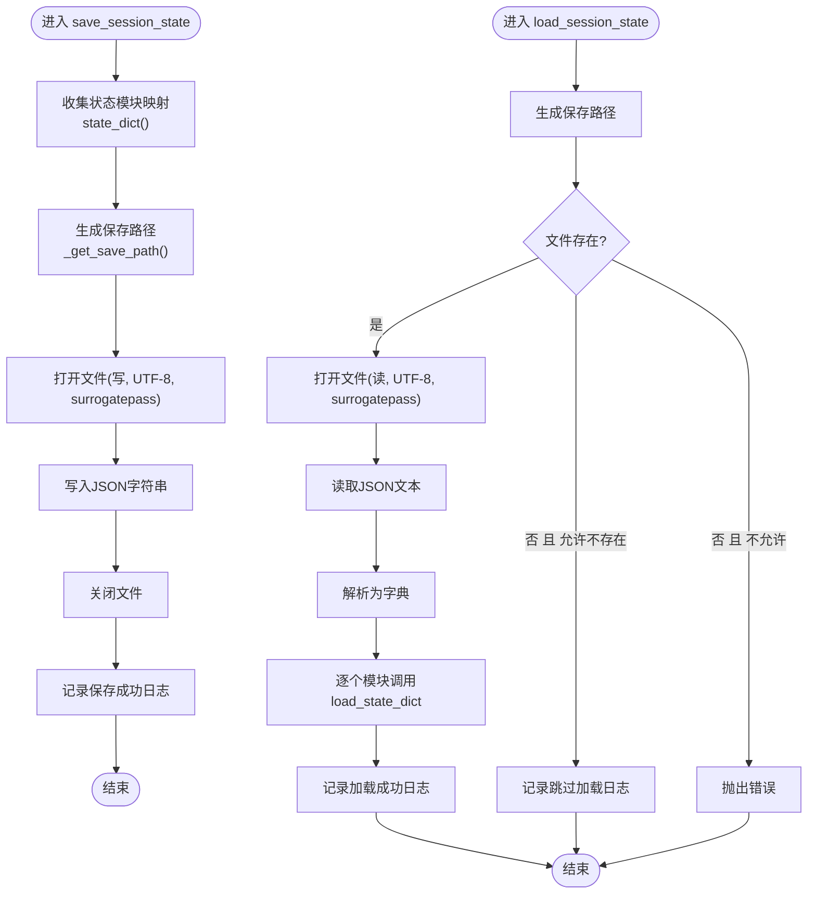
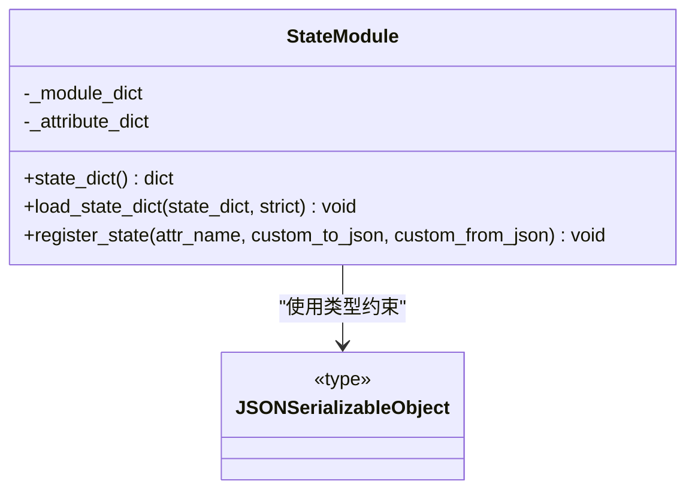
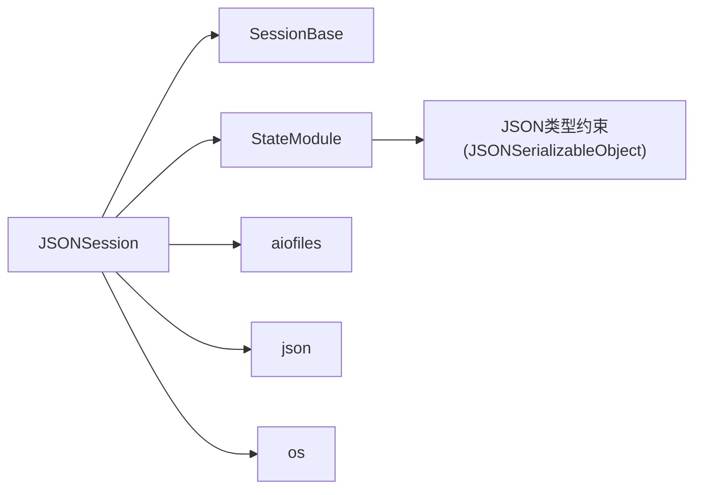

# JSON会话

<cite>
**本文引用的文件**
- [src/agentscope/session/_json_session.py](file://src/agentscope/session/_json_session.py)
- [src/agentscope/session/_session_base.py](file://src/agentscope/session/_session_base.py)
- [src/agentscope/module/_state_module.py](file://src/agentscope/module/_state_module.py)
- [src/agentscope/types/_json.py](file://src/agentscope/types/_json.py)
- [src/agentscope/session/__init__.py](file://src/agentscope/session/__init__.py)
- [tests/session_test.py](file://tests/session_test.py)
- [docs/tutorial/zh_CN/src/task_state.py](file://docs/tutorial/zh_CN/src/task_state.py)
- [examples/deployment/planning_agent/main.py](file://examples/deployment/planning_agent/main.py)
</cite>

## 目录
1. [简介](#简介)
2. [项目结构](#项目结构)
3. [核心组件](#核心组件)
4. [架构总览](#架构总览)
5. [详细组件分析](#详细组件分析)
6. [依赖分析](#依赖分析)
7. [性能考虑](#性能考虑)
8. [故障排查指南](#故障排查指南)
9. [结论](#结论)
10. [附录](#附录)

## 简介
本文件面向AgentScope的JSON会话实现，系统性阐述其文件存储机制、数据序列化与反序列化、并发控制现状与建议、会话状态持久化策略、配置参数、使用示例、性能优化与故障恢复，并提供与其他存储后端的对比与迁移指南。目标读者既包括需要快速上手的开发者，也包括希望深入理解实现细节的高级用户。

## 项目结构
JSON会话位于会话模块中，采用“接口基类 + 具体实现”的分层设计。核心文件如下：
- 会话接口基类：定义统一的异步保存/加载协议
- JSON会话实现：基于文件系统与JSON的持久化
- 状态模块：提供可序列化状态的注册、序列化与反序列化能力
- 类型定义：JSON可序列化对象的类型约束
- 单元测试：覆盖保存/加载、不存在文件行为、覆盖写入等场景
- 使用示例：教程与部署示例展示典型用法

**图表来源**
- [src/agentscope/session/_session_base.py:8-49](file://src/agentscope/session/_session_base.py#L8-L49)
- [src/agentscope/session/_json_session.py:12-131](file://src/agentscope/session/_json_session.py#L12-L131)
- [src/agentscope/module/_state_module.py:20-152](file://src/agentscope/module/_state_module.py#L20-L152)
- [src/agentscope/types/_json.py:6-22](file://src/agentscope/types/_json.py#L6-L22)
- [src/agentscope/session/__init__.py:4-14](file://src/agentscope/session/__init__.py#L4-L14)
- [tests/session_test.py:46-105](file://tests/session_test.py#L46-L105)
- [docs/tutorial/zh_CN/src/task_state.py:140-216](file://docs/tutorial/zh_CN/src/task_state.py#L140-L216)
- [examples/deployment/planning_agent/main.py:11-90](file://examples/deployment/planning_agent/main.py#L11-L90)

**章节来源**
- [src/agentscope/session/_session_base.py:8-49](file://src/agentscope/session/_session_base.py#L8-L49)
- [src/agentscope/session/_json_session.py:12-131](file://src/agentscope/session/_json_session.py#L12-L131)
- [src/agentscope/session/__init__.py:4-14](file://src/agentscope/session/__init__.py#L4-L14)

## 核心组件
- 会话接口基类：定义异步保存与加载的抽象方法，确保不同后端实现的一致调用方式
- JSON会话实现：负责文件路径生成、目录创建、JSON读写、日志记录
- 状态模块：提供状态注册、嵌套状态序列化、自定义编解码函数支持
- JSON类型约束：限定可直接被JSON序列化的数据结构，避免不兼容类型导致的异常

关键职责与交互：
- 调用方通过会话接口保存/加载状态
- JSON会话将状态模块映射转换为字典并写入/读取JSON文件
- 状态模块负责将复杂对象转换为JSON可表示形式

**章节来源**
- [src/agentscope/session/_session_base.py:11-48](file://src/agentscope/session/_session_base.py#L11-L48)
- [src/agentscope/session/_json_session.py:47-131](file://src/agentscope/session/_json_session.py#L47-L131)
- [src/agentscope/module/_state_module.py:49-152](file://src/agentscope/module/_state_module.py#L49-L152)
- [src/agentscope/types/_json.py:6-22](file://src/agentscope/types/_json.py#L6-L22)

## 架构总览
下图展示了JSON会话在系统中的位置与交互流程：

**图表来源**
- [src/agentscope/session/_json_session.py:47-131](file://src/agentscope/session/_json_session.py#L47-L131)
- [src/agentscope/module/_state_module.py:49-107](file://src/agentscope/module/_state_module.py#L49-L107)

## 详细组件分析

### JSON会话实现（JSONSession）
- 文件路径管理
  - 目录：初始化时确保保存目录存在
  - 命名：优先使用“user_id_session_id.json”，否则使用“session_id.json”
  - 组织：同一目录下按会话ID命名的独立JSON文件
- 数据序列化与反序列化
  - 序列化：将状态模块映射转换为字典后进行JSON编码
  - 反序列化：读取JSON文本并解析为字典，再逐个模块恢复状态
  - 编码：UTF-8，错误处理为surrogatepass，避免部分字符导致的写入失败
- 并发控制现状
  - 当前实现未显式加文件锁；读写为顺序执行
  - 建议在多进程/多实例场景下引入文件锁或原子写入策略
- 错误处理
  - 文件不存在时可选择跳过或抛错
  - 写入/读取异常由上层捕获与处理

**图表来源**
- [src/agentscope/session/_json_session.py:47-131](file://src/agentscope/session/_json_session.py#L47-L131)

**章节来源**
- [src/agentscope/session/_json_session.py:15-131](file://src/agentscope/session/_json_session.py#L15-L131)

### 状态模块（StateModule）
- 状态注册
  - 支持注册属性为状态变量，可提供自定义JSON编解码函数
  - 若未提供自定义函数，要求属性本身可被JSON序列化
- 嵌套状态
  - 自动递归序列化/反序列化子状态模块
- 严格模式
  - 可选择严格模式，缺失键将触发异常

**图表来源**
- [src/agentscope/module/_state_module.py:20-152](file://src/agentscope/module/_state_module.py#L20-L152)
- [src/agentscope/types/_json.py:6-22](file://src/agentscope/types/_json.py#L6-L22)

**章节来源**
- [src/agentscope/module/_state_module.py:49-152](file://src/agentscope/module/_state_module.py#L49-L152)
- [src/agentscope/types/_json.py:6-22](file://src/agentscope/types/_json.py#L6-L22)

### 会话接口基类（SessionBase）
- 抽象方法
  - 异步保存：接收session_id、user_id以及若干状态模块映射
  - 异步加载：支持allow_not_exist参数控制不存在时的行为

**章节来源**
- [src/agentscope/session/_session_base.py:11-48](file://src/agentscope/session/_session_base.py#L11-L48)

## 依赖分析
- 模块内依赖
  - JSONSession依赖SessionBase接口、StateModule状态模块、日志记录器
  - StateModule依赖JSON类型约束与JSON序列化工具
- 外部依赖
  - aiofiles：异步文件IO
  - json：标准库JSON编解码
  - os：路径与目录操作

**图表来源**
- [src/agentscope/session/_json_session.py:3-9](file://src/agentscope/session/_json_session.py#L3-L9)
- [src/agentscope/module/_state_module.py:4-9](file://src/agentscope/module/_state_module.py#L4-L9)
- [src/agentscope/types/_json.py:6-22](file://src/agentscope/types/_json.py#L6-L22)

**章节来源**
- [src/agentscope/session/_json_session.py:3-9](file://src/agentscope/session/_json_session.py#L3-L9)
- [src/agentscope/module/_state_module.py:4-9](file://src/agentscope/module/_state_module.py#L4-L9)
- [src/agentscope/types/_json.py:6-22](file://src/agentscope/types/_json.py#L6-L22)

## 性能考虑
- IO特性
  - 使用异步文件IO减少阻塞，适合高并发服务端场景
  - JSON读写为单文件I/O，大状态时注意内存占用与序列化开销
- 目录与命名
  - 同一目录下文件数量增长可能影响文件系统性能
  - 建议按用户维度拆分子目录或采用分片策略
- 编码与容错
  - UTF-8 + surrogatepass提升跨平台兼容性
  - 对于超大状态，可考虑压缩或分块存储
- 并发与原子性
  - 当前未实现文件锁，建议在多实例/多进程场景下：
    - 使用文件锁（如fcntl或平台特定锁）
    - 写入临时文件后rename原子替换
    - 或改用具备原子写入能力的后端（如SQLite）

[本节为通用性能建议，不直接分析具体文件，故无“章节来源”]

## 故障排查指南
- 保存/加载失败
  - 检查保存目录权限与磁盘空间
  - 确认状态模块已正确注册属性，避免不可序列化字段
- 文件不存在
  - 若allow_not_exist为True，将跳过加载；若为False，将抛出错误
- 日志定位
  - 保存/加载成功与跳过加载均有日志输出，便于定位问题
- 单元测试参考
  - 测试覆盖了保存/加载、不存在文件行为、覆盖写入等场景，可对照验证

**章节来源**
- [tests/session_test.py:49-105](file://tests/session_test.py#L49-L105)
- [src/agentscope/session/_json_session.py:76-131](file://src/agentscope/session/_json_session.py#L76-L131)

## 结论
JSON会话通过简洁的文件+JSON方案实现了会话状态的持久化，具备良好的易用性与可移植性。对于单实例、小中型状态场景，该实现足以满足需求。在多实例/高并发、对一致性与原子性有更高要求的场景，建议结合文件锁或迁移到具备更强一致性的后端（如SQLite/Redis/数据库）。

[本节为总结性内容，不直接分析具体文件，故无“章节来源”]

## 附录

### 配置参数说明
- 保存目录（save_dir）
  - 类型：字符串
  - 作用：指定JSON文件的保存根目录
  - 默认值：当前工作目录
  - 注意：需确保目录存在或允许自动创建
- 用户ID（user_id）
  - 类型：字符串
  - 作用：用于生成带用户前缀的文件名，便于多用户隔离
- 会话ID（session_id）
  - 类型：字符串
  - 作用：文件名的核心标识
- 允许不存在（allow_not_exist）
  - 类型：布尔
  - 作用：控制加载不存在文件时的行为
  - True：跳过加载并记录日志
  - False：抛出错误

**章节来源**
- [src/agentscope/session/_json_session.py:15-131](file://src/agentscope/session/_json_session.py#L15-L131)
- [src/agentscope/session/_session_base.py:11-48](file://src/agentscope/session/_session_base.py#L11-L48)

### 使用示例
- 教程示例
  - 展示如何保存与加载会话状态，文件名为“session_id.json”
- 部署示例
  - 在服务端每次请求前后加载/保存ReActAgent的状态，使用“user_id-session_id”作为会话ID

**章节来源**
- [docs/tutorial/zh_CN/src/task_state.py:164-216](file://docs/tutorial/zh_CN/src/task_state.py#L164-L216)
- [examples/deployment/planning_agent/main.py:46-88](file://examples/deployment/planning_agent/main.py#L46-L88)

### 与其他存储后端的对比与迁移指南
- 与Redis会话对比
  - 优势：无需额外服务，本地可读写，便于调试与迁移
  - 劣势：缺乏内置原子写入与分布式一致性，多实例需自行加锁
- 与SQLite会话对比
  - 优势：具备原子写入、事务与索引能力，适合结构化查询与版本管理
  - 劣势：需要数据库连接与维护成本
- 迁移步骤建议
  - 评估状态规模与并发需求，选择合适后端
  - 将状态模块映射转换为后端可接受的数据结构
  - 在新后端实现保存/加载逻辑，保持接口一致
  - 逐步切换流量并验证一致性与性能

[本节为概念性对比与迁移建议，不直接分析具体文件，故无“章节来源”]