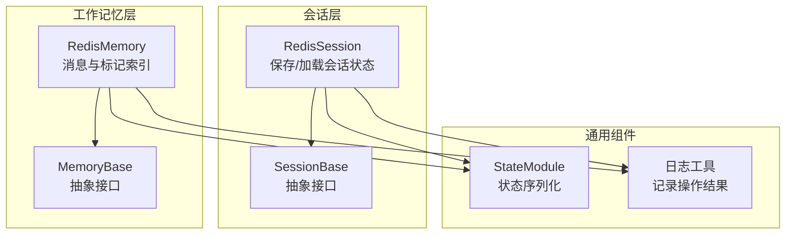
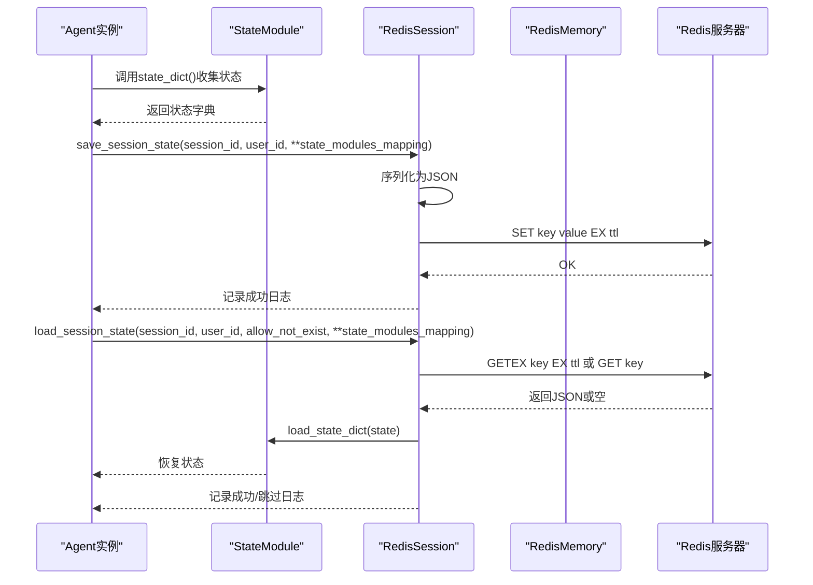
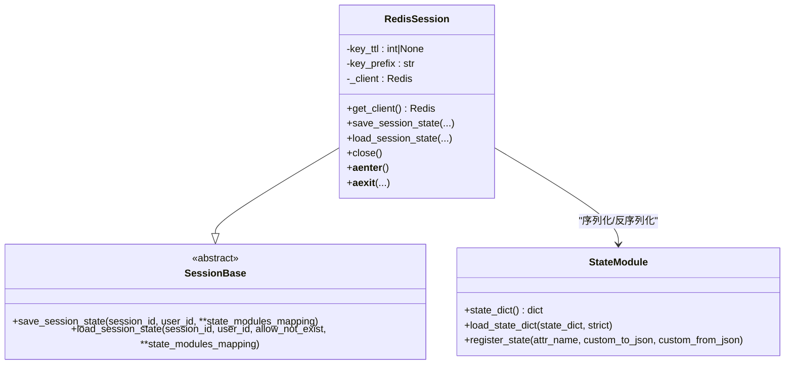
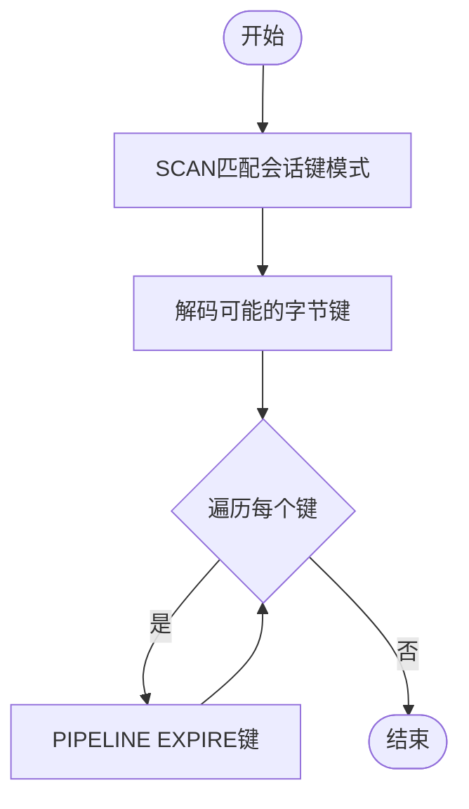
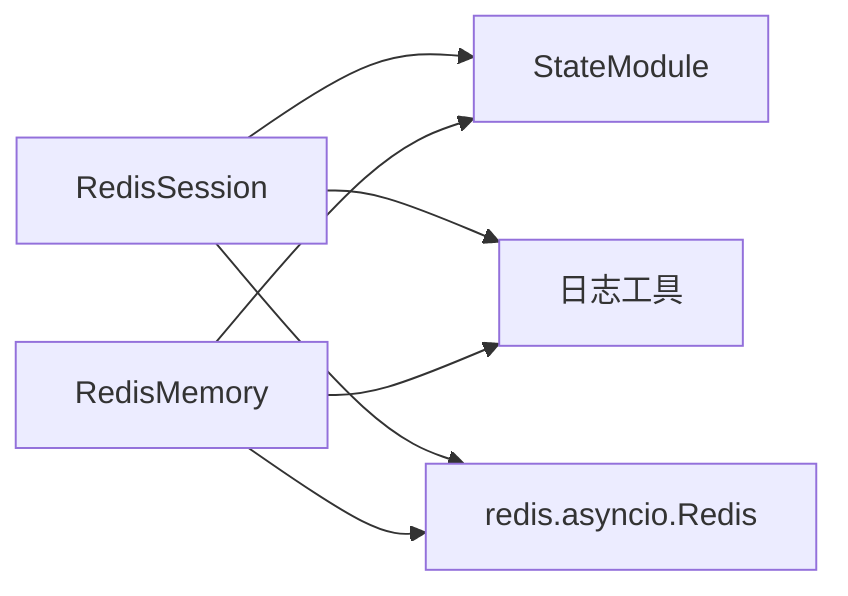

# Redis会话

<cite>
**本文引用的文件**
- [Redis会话实现](file://src/agentscope/session/_redis_session.py)
- [会话基类](file://src/agentscope/session/_session_base.py)
- [Redis工作记忆实现](file://src/agentscope/memory/_working_memory/_redis_memory.py)
- [状态模块](file://src/agentscope/module/_state_module.py)
- [会话单元测试](file://tests/session_test.py)
- [工作记忆单元测试](file://tests/memory_test.py)
- [日志工具](file://src/agentscope/_logging.py)
- [Redis内存教程示例](file://docs/tutorial/zh_CN/src/task_memory.py)
</cite>

## 目录
1. [简介](#简介)
2. [项目结构](#项目结构)
3. [核心组件](#核心组件)
4. [架构概览](#架构概览)
5. [详细组件分析](#详细组件分析)
6. [依赖关系分析](#依赖关系分析)
7. [性能考虑](#性能考虑)
8. [故障排查指南](#故障排查指南)
9. [结论](#结论)
10. [附录](#附录)

## 简介
本技术文档聚焦于AgentScope中的Redis会话实现，系统性阐述其分布式存储架构、连接池与集群配置、主从复制支持现状、Redis数据结构选择与使用策略、缓存策略（过期时间、内存淘汰、热数据管理）、分布式锁机制现状与替代方案、连接参数配置、性能优化建议以及监控与运维最佳实践。文档基于仓库中现有的Redis会话与Redis工作记忆实现进行分析，并结合测试与教程示例给出可操作的指导。

## 项目结构
AgentScope在会话与工作记忆两个层面提供了基于Redis的实现：
- 会话层：通过RedisSession将Agent的状态模块序列化后持久化到Redis，支持滑动过期与键前缀隔离。
- 工作记忆层：通过RedisMemory以列表、集合、字符串等多种Redis数据结构组织消息与标记索引，支持批量操作与滑动过期。

图表来源
- [Redis会话实现:17-210](file://src/agentscope/session/_redis_session.py#L17-L210)
- [会话基类:8-49](file://src/agentscope/session/_session_base.py#L8-L49)
- [Redis工作记忆实现:16-828](file://src/agentscope/memory/_working_memory/_redis_memory.py#L16-L828)
- [状态模块:20-152](file://src/agentscope/module/_state_module.py#L20-L152)
- [日志工具:12-48](file://src/agentscope/_logging.py#L12-L48)

章节来源
- [Redis会话实现:17-210](file://src/agentscope/session/_redis_session.py#L17-L210)
- [会话基类:8-49](file://src/agentscope/session/_session_base.py#L8-L49)
- [Redis工作记忆实现:16-828](file://src/agentscope/memory/_working_memory/_redis_memory.py#L16-L828)

## 核心组件
- RedisSession：继承自SessionBase，负责将状态模块映射序列化为JSON并写入Redis；支持滑动过期（GETEX）与键前缀隔离；提供异步上下文管理器与关闭方法。
- RedisMemory：继承自MemoryBase，使用列表、集合、字符串等Redis数据结构组织消息与标记索引；支持批量操作（pipeline）、滑动过期刷新、多租户隔离（key_prefix）。
- StateModule：提供嵌套状态的序列化/反序列化能力，支持注册属性的自定义JSON转换函数。
- 日志工具：统一的日志格式与级别设置，用于记录会话保存/加载等关键操作。

章节来源
- [Redis会话实现:17-210](file://src/agentscope/session/_redis_session.py#L17-L210)
- [Redis工作记忆实现:16-828](file://src/agentscope/memory/_working_memory/_redis_memory.py#L16-L828)
- [状态模块:20-152](file://src/agentscope/module/_state_module.py#L20-L152)
- [日志工具:12-48](file://src/agentscope/_logging.py#L12-L48)

## 架构概览
下图展示了Redis会话与工作记忆在AgentScope中的交互关系与数据流：

图表来源
- [Redis会话实现:101-178](file://src/agentscope/session/_redis_session.py#L101-L178)
- [状态模块:49-107](file://src/agentscope/module/_state_module.py#L49-L107)

## 详细组件分析

### RedisSession组件分析
- 连接与初始化
  - 支持通过主机、端口、数据库、密码与连接池参数初始化Redis客户端。
  - 可选的key_ttl与key_prefix分别控制键过期与多租户隔离。
  - 异步上下文管理器确保资源释放。
- 数据存储策略
  - 使用字符串类型存储序列化的状态字典，键采用“用户ID+会话ID”的模式，支持前缀隔离。
  - 读取时优先使用原子GETEX刷新过期时间，保证滑动过期语义。
- 错误处理
  - 当允许不存在且键为空时记录跳过日志；否则抛出异常。
- 性能与可靠性
  - 建议配合连接池复用连接，减少TCP握手开销。
  - 滑动过期适合短期会话，长期会话建议评估整体键扫描成本。

图表来源
- [Redis会话实现:17-210](file://src/agentscope/session/_redis_session.py#L17-L210)
- [会话基类:8-49](file://src/agentscope/session/_session_base.py#L8-L49)
- [状态模块:20-152](file://src/agentscope/module/_state_module.py#L20-L152)

章节来源
- [Redis会话实现:25-210](file://src/agentscope/session/_redis_session.py#L25-L210)
- [会话基类:8-49](file://src/agentscope/session/_session_base.py#L8-L49)
- [状态模块:20-152](file://src/agentscope/module/_state_module.py#L20-L152)

### RedisMemory组件分析
- 数据结构选择与使用
  - 会话消息ID列表：使用Redis列表存储消息ID，支持LRANGE、RPUSH、LREM等操作。
  - 消息体字符串：使用字符串键存储完整消息JSON，支持MGET批量读取。
  - 标记索引集合：使用Redis集合维护所有标记名称，避免全量扫描。
  - 标记列表：使用Redis列表存储特定标记下的消息ID。
- 关键键模式
  - 会话键：user_id:{user_id}:session:{session_id}:messages
  - 标记键：user_id:{user_id}:session:{session_id}:mark:{mark}
  - 消息键：user_id:{user_id}:session:{session_id}:msg:{msg_id}
  - 标记索引键：user_id:{user_id}:session:{session_id}:marks_index
- 批量与滑动过期
  - 多数写入/更新操作使用pipeline执行，保证原子性与降低RTT。
  - 读取时调用_refresh_session_ttl刷新会话相关键的过期时间。
- 兼容性与迁移
  - 旧版本缺少标记索引时，首次扫描并迁移至marks_index，后续直接使用索引。
- TTL与清理
  - 支持key_ttl滑动过期；通过SCAN遍历会话键并统一设置EXPIRE。

图表来源
- [Redis工作记忆实现:277-314](file://src/agentscope/memory/_working_memory/_redis_memory.py#L277-L314)

章节来源
- [Redis工作记忆实现:16-828](file://src/agentscope/memory/_working_memory/_redis_memory.py#L16-L828)

### 分布式锁机制现状与替代方案
- 现状
  - 代码库未发现Redlock算法实现或显式的分布式锁封装。
- 替代方案建议
  - 使用Redis SET命令的NX+EX选项实现简单互斥锁（注意单点故障与重试退避）。
  - 在需要强一致性的场景，建议引入外部协调服务（如Zookeeper、etcd）或事务型存储。
  - 对于会话与工作记忆的并发访问，优先通过业务层面的幂等设计与原子操作（pipeline）降低冲突概率。

[本节为概念性说明，不直接分析具体源码文件]

## 依赖关系分析
- 组件耦合
  - RedisSession依赖StateModule进行状态序列化，依赖日志工具输出操作结果。
  - RedisMemory依赖Msg消息模型与StateModule（内部使用），依赖Redis客户端的pipeline与SCAN等命令。
- 外部依赖
  - redis.asyncio作为Redis客户端，支持异步操作与连接池。
  - 测试中使用fakeredis.aioredis模拟Redis环境，便于本地验证。

图表来源
- [Redis会话实现:61-79](file://src/agentscope/session/_redis_session.py#L61-L79)
- [Redis工作记忆实现:112-134](file://src/agentscope/memory/_working_memory/_redis_memory.py#L112-L134)
- [状态模块:20-152](file://src/agentscope/module/_state_module.py#L20-L152)
- [日志工具:12-48](file://src/agentscope/_logging.py#L12-L48)

章节来源
- [Redis会话实现:61-79](file://src/agentscope/session/_redis_session.py#L61-L79)
- [Redis工作记忆实现:112-134](file://src/agentscope/memory/_working_memory/_redis_memory.py#L112-L134)

## 性能考虑
- 连接与连接池
  - 生产环境建议复用连接池，避免频繁建立/断开连接；参考教程示例中的连接池配置方式。
  - 合理设置最大连接数与编码，确保decode_responses开启以简化字符串处理。
- 批量与管道
  - 写入/更新操作尽量使用pipeline，减少网络往返；RedisMemory已广泛采用该策略。
  - 读取消息时使用MGET批量获取消息体，避免N+1查询。
- 过期与内存
  - key_ttl采用滑动过期，适合短期会话；对大型会话，定期刷新过期可能带来额外开销，需权衡。
  - 对热数据可考虑提升命中率（如使用更短的key_ttl与更频繁的访问），但需避免过度刷新导致CPU压力。
- 并发与一致性
  - 高并发场景下，优先使用原子操作与幂等设计；避免跨多个键的长事务。
  - 对于需要严格一致性的操作，建议引入外部协调或事务型存储。

[本节提供通用性能建议，不直接分析具体源码文件]

## 故障排查指南
- 常见问题与定位
  - 连接失败：检查主机、端口、密码与网络连通性；确认连接池参数合理。
  - 读取为空：若allow_not_exist为True，会记录跳过日志；否则抛出异常。可通过日志定位键是否存在。
  - TTL失效：确认key_ttl是否正确设置；对于RedisMemory，检查_refresh_session_ttl是否被调用。
  - 字符串解码：当decode_responses=False时可能出现字节数据，需手动解码；RedisSession默认开启decode_responses=True。
- 单元测试参考
  - 会话测试覆盖了RedisSession的保存/加载流程与异常分支。
  - 工作记忆测试覆盖了TTL功能、多租户与多会话场景等。
- 日志与可观测性
  - 使用统一日志格式记录保存/加载成功与跳过信息，便于快速定位问题。

章节来源
- [会话单元测试:107-164](file://tests/session_test.py#L107-L164)
- [工作记忆单元测试:744-839](file://tests/memory_test.py#L744-L839)
- [日志工具:12-48](file://src/agentscope/_logging.py#L12-L48)

## 结论
AgentScope的Redis会话与工作记忆实现以简洁高效为目标：会话层通过字符串键与滑动过期实现轻量级状态持久化；工作记忆层通过列表、集合、字符串等数据结构与pipeline批量操作实现高性能的消息与标记管理。当前实现未包含Redlock分布式锁，建议在需要强一致性的场景采用外部协调或事务型存储。生产部署建议启用连接池、合理设置TTL与批量操作，并结合日志与测试用例进行持续验证。

[本节为总结性内容，不直接分析具体源码文件]

## 附录

### 连接参数配置清单
- 主机地址与端口：host、port
- 数据库索引：db
- 认证信息：password
- 连接池：connection_pool
- 键前缀：key_prefix（用于多租户/多环境隔离）
- 过期时间：key_ttl（秒，滑动过期）

章节来源
- [Redis会话实现:25-59](file://src/agentscope/session/_redis_session.py#L25-L59)
- [Redis工作记忆实现:65-110](file://src/agentscope/memory/_working_memory/_redis_memory.py#L65-L110)

### 缓存策略设计要点
- 滑动过期：GETEX/EXPIRE组合，适合短期会话；对大型会话需评估刷新成本。
- 多租户隔离：通过key_prefix区分不同应用/环境。
- 热数据管理：结合业务访问模式调整TTL与批量刷新频率。

章节来源
- [Redis会话实现:150-154](file://src/agentscope/session/_redis_session.py#L150-L154)
- [Redis工作记忆实现:277-314](file://src/agentscope/memory/_working_memory/_redis_memory.py#L277-L314)

### 监控与运维最佳实践
- 监控指标建议：连接池利用率、命令耗时分布、键空间大小、过期键数量、错误率。
- 运维建议：定期巡检TTL与键空间增长趋势；对高并发场景进行压测与容量规划；使用连接池生命周期管理与优雅关闭。

[本节为通用运维建议，不直接分析具体源码文件]