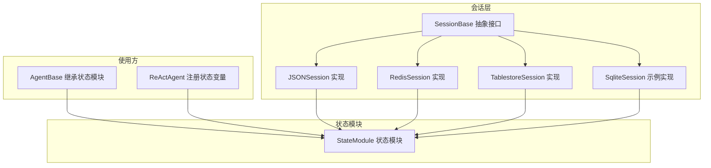
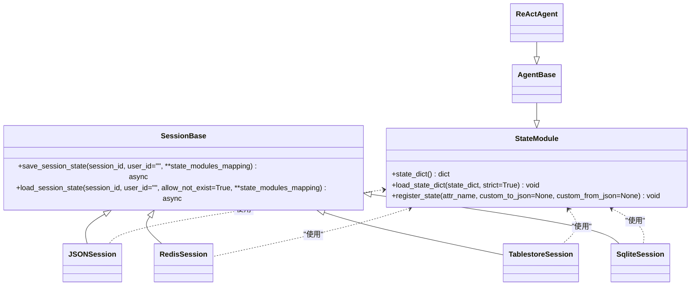
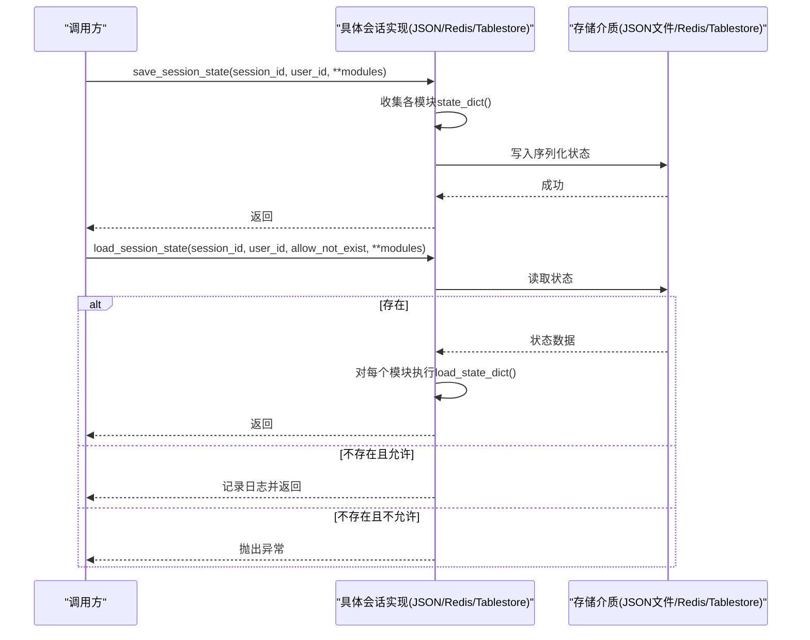
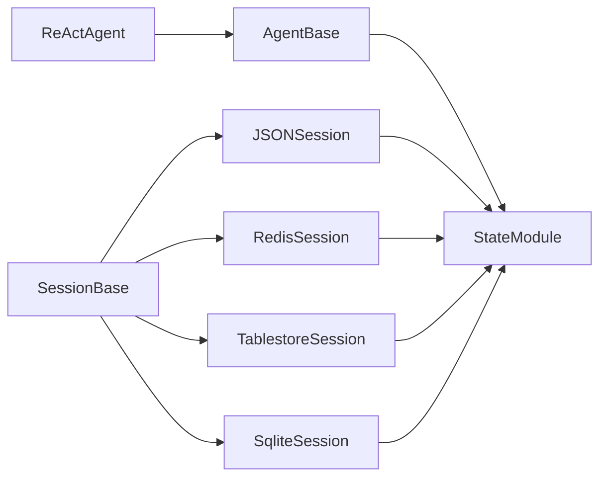

# 会话基类

<cite>
**本文引用的文件**
- [session/_session_base.py](file://src/agentscope/session/_session_base.py)
- [module/_state_module.py](file://src/agentscope/module/_state_module.py)
- [session/_json_session.py](file://src/agentscope/session/_json_session.py)
- [session/_redis_session.py](file://src/agentscope/session/_redis_session.py)
- [session/_tablestore_session.py](file://src/agentscope/session/_tablestore_session.py)
- [examples/functionality/session_with_sqlite/sqlite_session.py](file://examples/functionality/session_with_sqlite/sqlite_session.py)
- [examples/functionality/session_with_sqlite/main.py](file://examples/functionality/session_with_sqlite/main.py)
- [tests/session_test.py](file://tests/session_test.py)
- [agent/_agent_base.py](file://src/agentscope/agent/_agent_base.py)
- [agent/_react_agent.py](file://src/agentscope/agent/_react_agent.py)
</cite>

## 目录
1. [简介](#简介)
2. [项目结构](#项目结构)
3. [核心组件](#核心组件)
4. [架构总览](#架构总览)
5. [详细组件分析](#详细组件分析)
6. [依赖分析](#依赖分析)
7. [性能考虑](#性能考虑)
8. [故障排查指南](#故障排查指南)
9. [结论](#结论)
10. [附录：扩展与最佳实践](#附录扩展与最佳实践)

## 简介
本文件面向AgentScope的会话基类与状态模块，系统化阐述SessionBase抽象基类的设计理念、异步操作模式、状态模块映射机制，并深入解析save_session_state与load_session_state的参数规范、返回值与异常处理策略。同时说明会话ID与用户ID的作用机制、allow_not_exist参数的使用场景，给出StateModule状态模块的注册、状态同步与生命周期管理方法，并提供接口实现示例、错误处理策略与性能优化建议，最后总结扩展自定义会话存储后端的最佳实践。

## 项目结构
围绕会话与状态模块的关键文件组织如下：
- 会话基类与接口定义：session/_session_base.py
- 状态模块：module/_state_module.py
- 多种会话实现：session/_json_session.py、session/_redis_session.py、session/_tablestore_session.py
- 示例：examples/functionality/session_with_sqlite/sqlite_session.py、examples/functionality/session_with_sqlite/main.py
- 测试：tests/session_test.py
- 使用方（Agent）：agent/_agent_base.py、agent/_react_agent.py

图表来源
- [session/_session_base.py:8-49](file://src/agentscope/session/_session_base.py#L8-L49)
- [module/_state_module.py:20-152](file://src/agentscope/module/_state_module.py#L20-L152)
- [session/_json_session.py:12-131](file://src/agentscope/session/_json_session.py#L12-L131)
- [session/_redis_session.py:17-210](file://src/agentscope/session/_redis_session.py#L17-L210)
- [session/_tablestore_session.py:12-273](file://src/agentscope/session/_tablestore_session.py#L12-L273)
- [examples/functionality/session_with_sqlite/sqlite_session.py:12-168](file://examples/functionality/session_with_sqlite/sqlite_session.py#L12-L168)
- [agent/_agent_base.py:30](file://src/agentscope/agent/_agent_base.py#L30)
- [agent/_react_agent.py:362-364](file://src/agentscope/agent/_react_agent.py#L362-L364)

章节来源
- [session/_session_base.py:8-49](file://src/agentscope/session/_session_base.py#L8-L49)
- [module/_state_module.py:20-152](file://src/agentscope/module/_state_module.py#L20-L152)

## 核心组件
- SessionBase：定义异步保存与加载会话状态的抽象接口，支持多状态模块映射、用户隔离与容错控制。
- StateModule：提供嵌套状态序列化/反序列化能力，支持属性注册与自定义JSON转换函数。
- 具体实现：JSON、Redis、Tablestore、SQLite等存储后端均遵循SessionBase接口，统一以“状态模块名 -> 模块实例”的命名参数进行读写。

章节来源
- [session/_session_base.py:11-48](file://src/agentscope/session/_session_base.py#L11-L48)
- [module/_state_module.py:20-152](file://src/agentscope/module/_state_module.py#L20-L152)

## 架构总览
会话基类采用“抽象接口 + 多实现 + 状态模块”的分层设计：
- 接口层：SessionBase定义save_session_state与load_session_state两个异步方法。
- 存储层：各具体会话类负责将状态模块序列化后的字典持久化到目标介质。
- 状态层：StateModule负责递归收集/恢复模块及其属性的状态，支持严格/宽松加载策略。

图表来源
- [session/_session_base.py:8-49](file://src/agentscope/session/_session_base.py#L8-L49)
- [module/_state_module.py:20-152](file://src/agentscope/module/_state_module.py#L20-L152)
- [session/_json_session.py:12-131](file://src/agentscope/session/_json_session.py#L12-L131)
- [session/_redis_session.py:17-210](file://src/agentscope/session/_redis_session.py#L17-L210)
- [session/_tablestore_session.py:12-273](file://src/agentscope/session/_tablestore_session.py#L12-L273)
- [examples/functionality/session_with_sqlite/sqlite_session.py:12-168](file://examples/functionality/session_with_sqlite/sqlite_session.py#L12-L168)
- [agent/_agent_base.py:30](file://src/agentscope/agent/_agent_base.py#L30)
- [agent/_react_agent.py:362-364](file://src/agentscope/agent/_react_agent.py#L362-L364)

## 详细组件分析

### SessionBase 抽象基类
- 设计理念
  - 异步接口：save_session_state与load_session_state均为异步方法，适配多种I/O后端。
  - 多模块映射：通过命名参数将“状态模块名”与“模块实例”绑定，便于一次调用批量读写。
  - 用户隔离：user_id用于在共享存储中区分不同用户的数据，避免冲突。
  - 容错控制：allow_not_exist允许在数据不存在时优雅跳过或抛出异常。
- 关键方法
  - save_session_state(session_id, user_id="", **state_modules_mapping) -> None
  - load_session_state(session_id, user_id="", allow_not_exist=True, **state_modules_mapping) -> None

章节来源
- [session/_session_base.py:11-48](file://src/agentscope/session/_session_base.py#L11-L48)

### StateModule 状态模块
- 能力概述
  - 收集状态：state_dict递归遍历模块字典与属性字典，生成可序列化的状态字典。
  - 加载状态：load_state_dict支持严格模式（strict=True）与宽松模式（strict=False），前者缺失键即报错，后者忽略缺失键。
  - 属性注册：register_state为非模块属性注册JSON序列化/反序列化函数，确保可持久化。
- 关键点
  - 必须先调用父类构造器，再设置任何StateModule类型的子模块属性。
  - 若未提供自定义JSON函数，属性需原生可JSON序列化；否则需显式提供to_json/from_json。
  - 删除属性时会从内部记录中移除对应条目，避免残留。

章节来源
- [module/_state_module.py:20-152](file://src/agentscope/module/_state_module.py#L20-L152)

### JSONSession 实现
- 作用机制
  - 将多个状态模块的状态字典合并为单一JSON对象，按“user_id_session_id.json”或“session_id.json”命名规则写入文件。
  - 读取时若文件存在则解析并逐个模块恢复状态；若不存在且allow_not_exist为True则记录日志并跳过。
- 参数与行为
  - save_session_state：接收session_id、user_id与若干状态模块映射，写入文件并记录成功信息。
  - load_session_state：根据session_id与user_id定位文件，按allow_not_exist决定是否抛错。

章节来源
- [session/_json_session.py:12-131](file://src/agentscope/session/_json_session.py#L12-L131)

### RedisSession 实现
- 作用机制
  - 使用Redis键模板“user_id:{user_id}:session:{session_id}:state”，支持可选key前缀与TTL滑动过期。
  - 读取时优先GETEX原子获取并刷新TTL；若不存在且allow_not_exist为True则记录日志并返回。
- 参数与行为
  - save_session_state：序列化状态字典后SET，可选ex=key_ttl。
  - load_session_state：GET/GETEX获取数据，按allow_not_exist决定是否抛错。

章节来源
- [session/_redis_session.py:17-210](file://src/agentscope/session/_redis_session.py#L17-L210)

### TablestoreSession 实现
- 作用机制
  - 基于tablestore_for_agent_memory的AsyncMemoryStore，将状态序列化后存入会话表metadata字段的“__state__”键。
  - 首次使用时惰性初始化内存存储，使用互斥锁防止并发重复初始化。
- 参数与行为
  - save_session_state：构建Session模型并update_session。
  - load_session_state：get_session后读取metadata.__state__，按allow_not_exist决定是否抛错。

章节来源
- [session/_tablestore_session.py:12-273](file://src/agentscope/session/_tablestore_session.py#L12-L273)

### SqliteSession 示例实现
- 作用机制
  - 使用SQLite表as_session存储session_id到JSON状态字典的映射，支持ON CONFLICT更新。
  - 读取时对数据库文件、表存在性与具体session_id进行条件判断，结合allow_not_exist决定日志或抛错。
- 参数与行为
  - save_session_state：序列化状态字典并插入或替换。
  - load_session_state：查询并解析JSON，逐模块恢复状态。

章节来源
- [examples/functionality/session_with_sqlite/sqlite_session.py:12-168](file://examples/functionality/session_with_sqlite/sqlite_session.py#L12-L168)

### 使用方：AgentBase 与 ReActAgent 的状态注册
- AgentBase继承StateModule，具备状态模块能力。
- ReActAgent在构造阶段通过register_state注册关键状态变量，使其参与会话的保存/加载流程。

章节来源
- [agent/_agent_base.py:30](file://src/agentscope/agent/_agent_base.py#L30)
- [agent/_react_agent.py:362-364](file://src/agentscope/agent/_react_agent.py#L362-L364)

### 接口调用时序（以JSON/Redis/Tablestore为例）

图表来源
- [session/_json_session.py:47-131](file://src/agentscope/session/_json_session.py#L47-L131)
- [session/_redis_session.py:101-210](file://src/agentscope/session/_redis_session.py#L101-L210)
- [session/_tablestore_session.py:126-273](file://src/agentscope/session/_tablestore_session.py#L126-L273)

## 依赖分析
- SessionBase是所有会话实现的共同契约，约束了异步I/O与状态模块映射的约定。
- 各实现类依赖StateModule提供的state_dict/load_state_dict能力完成序列化与反序列化。
- 使用方（AgentBase/ReActAgent）通过继承StateModule并注册状态变量，无缝接入会话持久化。

图表来源
- [agent/_agent_base.py:30](file://src/agentscope/agent/_agent_base.py#L30)
- [agent/_react_agent.py:362-364](file://src/agentscope/agent/_react_agent.py#L362-L364)
- [module/_state_module.py:20-152](file://src/agentscope/module/_state_module.py#L20-L152)
- [session/_session_base.py:8-49](file://src/agentscope/session/_session_base.py#L8-L49)
- [session/_json_session.py:12-131](file://src/agentscope/session/_json_session.py#L12-L131)
- [session/_redis_session.py:17-210](file://src/agentscope/session/_redis_session.py#L17-L210)
- [session/_tablestore_session.py:12-273](file://src/agentscope/session/_tablestore_session.py#L12-L273)
- [examples/functionality/session_with_sqlite/sqlite_session.py:12-168](file://examples/functionality/session_with_sqlite/sqlite_session.py#L12-L168)

## 性能考虑
- 序列化开销
  - 多模块合并为单JSON对象可减少I/O次数，但单次序列化体积增大；建议按业务拆分模块，避免过度聚合。
- 并发与锁
  - TablestoreSession在首次使用时使用互斥锁保证初始化幂等，避免并发重复初始化带来的资源浪费。
- 缓存与TTL
  - RedisSession支持key_ttl与GETEX原子刷新，适合高并发场景下维持热数据；注意合理设置TTL以平衡内存占用与一致性。
- 文件系统
  - JSONSession写入采用异步文件库，建议在高并发写入场景下配合合适的文件系统与磁盘策略，避免频繁fsync导致延迟。
- 数据库
  - SqliteSession使用ON CONFLICT更新，避免多次查询；建议在高频读写场景下评估事务与索引策略。

## 故障排查指南
- 会话不存在
  - 当allow_not_exist为True时，实现通常记录INFO级别日志并返回；当为False时抛出异常。请根据业务需求选择合适策略。
- 状态模块缺失
  - load_state_dict(strict=True)时，若状态字典缺少模块键会抛出KeyError；建议在严格模式下确保保存与加载的模块集合一致。
- JSON序列化失败
  - register_state未提供自定义to_json时，属性需原生可JSON序列化；否则会抛TypeError。请为不可序列化类型提供自定义转换函数。
- Redis连接问题
  - 未安装redis.asyncio包会导致导入异常，请按提示安装依赖。
- Tablestore依赖缺失
  - 缺少tablestore或tablestore-for-agent-memory包会触发ImportError，请按要求安装。

章节来源
- [session/_json_session.py:120-131](file://src/agentscope/session/_json_session.py#L120-L131)
- [session/_redis_session.py:60-79](file://src/agentscope/session/_redis_session.py#L60-L79)
- [session/_redis_session.py:164-167](file://src/agentscope/session/_redis_session.py#L164-L167)
- [session/_tablestore_session.py:68-73](file://src/agentscope/session/_tablestore_session.py#L68-L73)
- [session/_tablestore_session.py:215-226](file://src/agentscope/session/_tablestore_session.py#L215-L226)
- [module/_state_module.py:134-141](file://src/agentscope/module/_state_module.py#L134-L141)
- [module/_state_module.py:86-101](file://src/agentscope/module/_state_module.py#L86-L101)

## 结论
SessionBase以统一的异步接口与状态模块映射机制，为AgentScope提供了可插拔的会话持久化能力。通过StateModule的递归序列化/反序列化与灵活的注册机制，Agent与各类状态组件可以无缝参与会话的保存与恢复。各存储后端在保持一致契约的前提下，针对自身特性（如Redis的TTL、Tablestore的分布式索引、SQLite的轻量部署）提供差异化能力。结合严格的错误处理与性能优化策略，可在复杂应用场景中稳定运行。

## 附录：扩展与最佳实践

### 扩展自定义会话存储后端
- 实现步骤
  - 继承SessionBase，实现save_session_state与load_session_state两个异步方法。
  - 在save中收集state_modules_mapping中各模块的state_dict，序列化为可存储的格式。
  - 在load中从存储介质读取对应数据，逐模块调用load_state_dict恢复状态。
  - 正确处理allow_not_exist分支，按需记录日志或抛出异常。
- 参数与命名
  - session_id与user_id用于唯一标识会话与用户空间；user_id为空时由实现自行决定默认值或忽略。
  - **state_modules_mapping的键为模块名字符串，值为StateModule实例。
- 错误处理
  - 对不存在、格式不匹配、依赖缺失等情况分别处理，保持与现有实现一致的日志与异常风格。
- 性能优化
  - 批量读写：尽量合并多次I/O为单次操作。
  - 增量更新：仅更新变化部分，减少全量序列化。
  - 连接池与超时：合理配置连接池、超时与重试策略。

### 接口实现示例参考路径
- JSON实现：[session/_json_session.py:47-131](file://src/agentscope/session/_json_session.py#L47-L131)
- Redis实现：[session/_redis_session.py:101-210](file://src/agentscope/session/_redis_session.py#L101-L210)
- Tablestore实现：[session/_tablestore_session.py:126-273](file://src/agentscope/session/_tablestore_session.py#L126-L273)
- SQLite示例：[examples/functionality/session_with_sqlite/sqlite_session.py:27-168](file://examples/functionality/session_with_sqlite/sqlite_session.py#L27-L168)

### 使用示例参考路径
- 会话与代理交互示例：[examples/functionality/session_with_sqlite/main.py:16-77](file://examples/functionality/session_with_sqlite/main.py#L16-L77)
- 单元测试覆盖save/load与异常分支：[tests/session_test.py:49-436](file://tests/session_test.py#L49-L436)