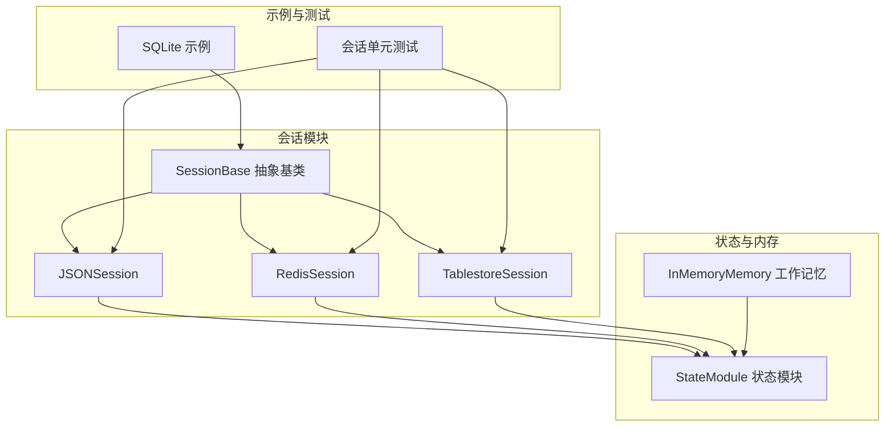
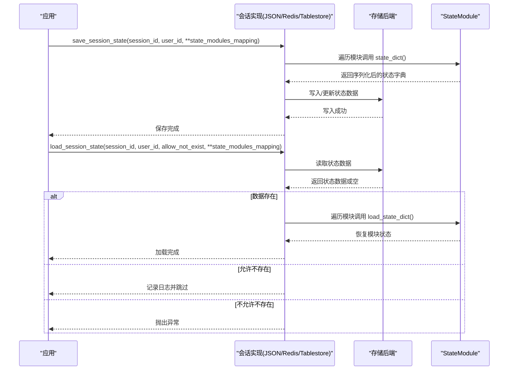
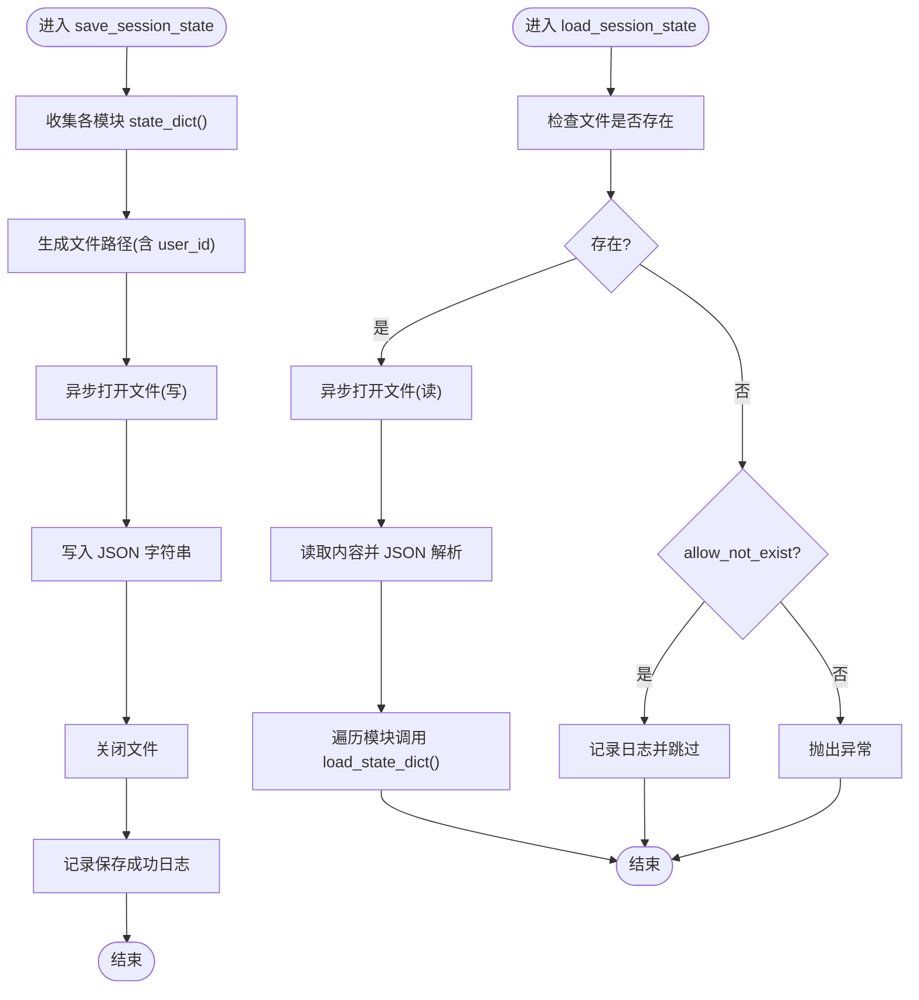
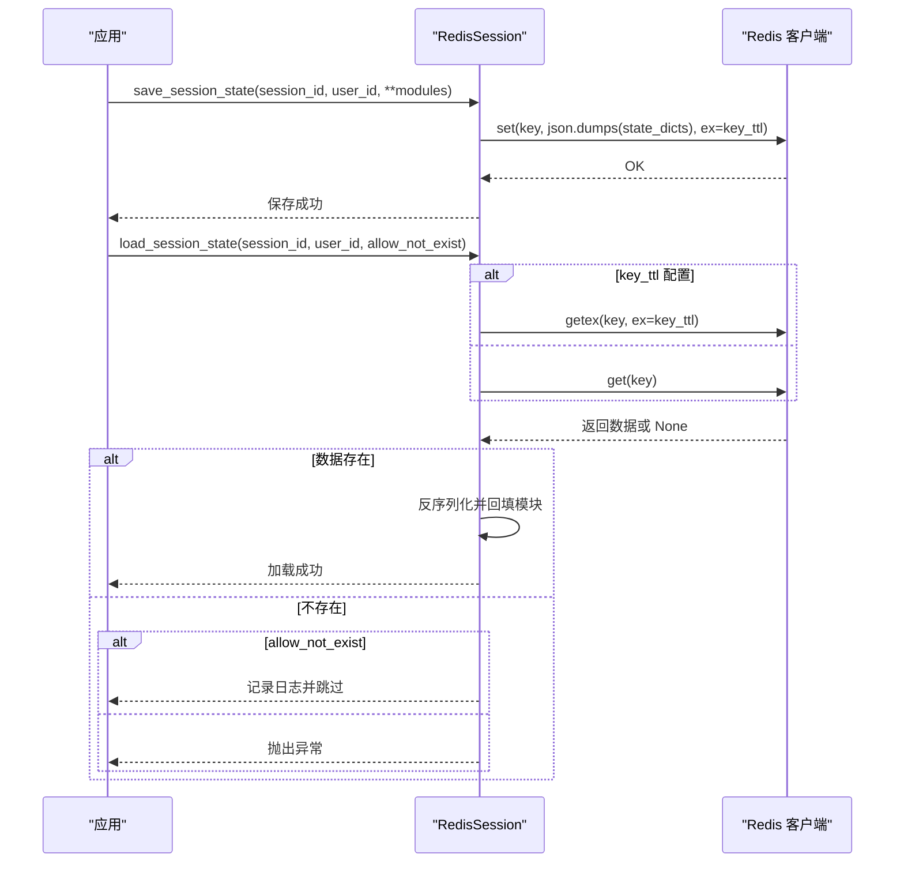
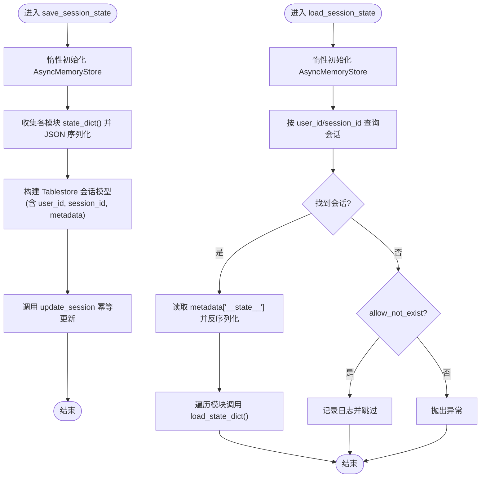
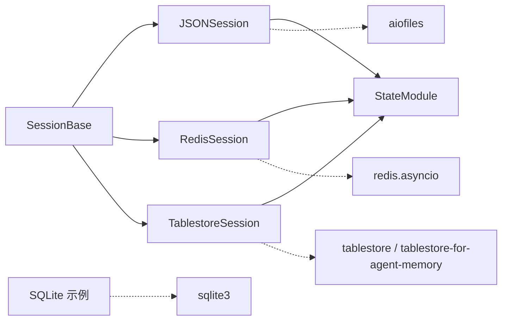

# 会话管理

<cite>
**本文引用的文件列表**
- [session/__init__.py](file://src/agentscope/session/__init__.py)
- [session/_session_base.py](file://src/agentscope/session/_session_base.py)
- [session/_json_session.py](file://src/agentscope/session/_json_session.py)
- [session/_redis_session.py](file://src/agentscope/session/_redis_session.py)
- [session/_tablestore_session.py](file://src/agentscope/session/_tablestore_session.py)
- [module/_state_module.py](file://src/agentscope/module/_state_module.py)
- [memory/_working_memory/_in_memory_memory.py](file://src/agentscope/memory/_working_memory/_in_memory_memory.py)
- [examples/functionality/session_with_sqlite/sqlite_session.py](file://examples/functionality/session_with_sqlite/sqlite_session.py)
- [examples/functionality/session_with_sqlite/main.py](file://examples/functionality/session_with_sqlite/main.py)
- [tests/session_test.py](file://tests/session_test.py)
- [tests/tablestore_session_test.py](file://tests/tablestore_session_test.py)
</cite>

## 目录
1. [简介](#简介)
2. [项目结构](#项目结构)
3. [核心组件](#核心组件)
4. [架构总览](#架构总览)
5. [组件详解](#组件详解)
6. [依赖关系分析](#依赖关系分析)
7. [性能与并发特性](#性能与并发特性)
8. [故障排查指南](#故障排查指南)
9. [结论](#结论)
10. [附录：API 参考与部署建议](#附录api-参考与部署建议)

## 简介
本技术文档围绕 AgentScope 的会话管理系统展开，系统性阐述会话基类设计、状态管理与生命周期控制、数据持久化策略，并对三种存储后端（JSON 文件、Redis 分布式缓存、Tablestore 结构化存储）进行深入解析。文档同时提供配置项说明、使用示例、性能对比与最佳实践，帮助开发者在不同场景下选择合适的会话存储方案并正确部署。

## 项目结构
会话管理位于 agentscope.session 包内，核心由抽象基类与三个具体实现组成；状态序列化能力来自 StateModule；内存工作记忆 InMemoryMemory 展示了如何注册状态以参与会话持久化；示例与测试覆盖了 JSON、Redis、Tablestore 三类后端的典型用法与行为验证。

图表来源
- [session/__init__.py:1-15](file://src/agentscope/session/__init__.py#L1-L15)
- [session/_session_base.py:8-49](file://src/agentscope/session/_session_base.py#L8-L49)
- [session/_json_session.py:12-131](file://src/agentscope/session/_json_session.py#L12-L131)
- [session/_redis_session.py:17-210](file://src/agentscope/session/_redis_session.py#L17-L210)
- [session/_tablestore_session.py:12-273](file://src/agentscope/session/_tablestore_session.py#L12-L273)
- [module/_state_module.py:20-152](file://src/agentscope/module/_state_module.py#L20-L152)
- [memory/_working_memory/_in_memory_memory.py:10-306](file://src/agentscope/memory/_working_memory/_in_memory_memory.py#L10-L306)
- [examples/functionality/session_with_sqlite/sqlite_session.py:12-168](file://examples/functionality/session_with_sqlite/sqlite_session.py#L12-L168)
- [tests/session_test.py:46-436](file://tests/session_test.py#L46-L436)

章节来源
- [session/__init__.py:1-15](file://src/agentscope/session/__init__.py#L1-L15)
- [session/_session_base.py:8-49](file://src/agentscope/session/_session_base.py#L8-L49)

## 核心组件
- 会话基类 SessionBase：定义统一的异步保存与加载接口，约定 session_id、user_id、状态模块映射等参数。
- 状态模块 StateModule：提供嵌套状态序列化/反序列化能力，支持注册属性与子模块，确保会话状态可完整持久化。
- 具体会话实现：
  - JSONSession：基于 aiofiles 的异步文件写入，适合本地开发与小规模应用。
  - RedisSession：基于 redis.asyncio 的键值存储，支持滑动过期与连接池，适合高并发与分布式场景。
  - TablestoreSession：基于阿里云 Tablestore 的结构化存储，支持二次索引与搜索索引，适合需要结构化查询与事务语义的场景。
- 示例与测试：SQLite 示例展示数据库持久化思路；单元测试覆盖生命周期、错误处理、上下文管理等关键行为。

章节来源
- [session/_session_base.py:8-49](file://src/agentscope/session/_session_base.py#L8-L49)
- [module/_state_module.py:20-152](file://src/agentscope/module/_state_module.py#L20-L152)
- [session/_json_session.py:12-131](file://src/agentscope/session/_json_session.py#L12-L131)
- [session/_redis_session.py:17-210](file://src/agentscope/session/_redis_session.py#L17-L210)
- [session/_tablestore_session.py:12-273](file://src/agentscope/session/_tablestore_session.py#L12-L273)
- [examples/functionality/session_with_sqlite/sqlite_session.py:12-168](file://examples/functionality/session_with_sqlite/sqlite_session.py#L12-L168)
- [tests/session_test.py:46-436](file://tests/session_test.py#L46-L436)

## 架构总览
会话管理采用“抽象基类 + 多后端实现”的分层设计。上层业务通过 SessionBase 接口操作，底层根据配置选择具体存储后端。状态序列化由 StateModule 提供，确保复杂对象（如 Agent、Memory）可被完整序列化与恢复。

图表来源
- [session/_session_base.py:11-48](file://src/agentscope/session/_session_base.py#L11-L48)
- [session/_json_session.py:47-131](file://src/agentscope/session/_json_session.py#L47-L131)
- [session/_redis_session.py:101-179](file://src/agentscope/session/_redis_session.py#L101-L179)
- [session/_tablestore_session.py:126-238](file://src/agentscope/session/_tablestore_session.py#L126-L238)
- [module/_state_module.py:49-107](file://src/agentscope/module/_state_module.py#L49-L107)

## 组件详解

### 会话基类 SessionBase
- 职责：定义统一的异步保存与加载接口，约束 session_id、user_id、状态模块映射等参数。
- 关键点：
  - 保存接口要求传入 session_id、user_id（可为空），以及若干 StateModule 实例映射。
  - 加载接口支持 allow_not_exist 控制“不存在时是否抛错”。
- 设计意义：屏蔽后端差异，使上层业务仅依赖抽象接口。

章节来源
- [session/_session_base.py:8-49](file://src/agentscope/session/_session_base.py#L8-L49)

### JSON 会话 JSONSession
- 存储机制：将状态字典序列化为 JSON，写入文件；读取时反序列化并回填到各模块。
- 文件命名：支持 user_id 前缀，避免同名冲突；默认保存目录可配置。
- 并发控制：使用异步文件库进行异步写入与读取，避免阻塞事件循环。
- 错误处理：当文件不存在且允许不存在时记录日志并跳过；否则抛出异常。
- 使用场景：本地开发、单机部署、小规模数据。

图表来源
- [session/_json_session.py:47-131](file://src/agentscope/session/_json_session.py#L47-L131)

章节来源
- [session/_json_session.py:12-131](file://src/agentscope/session/_json_session.py#L12-L131)

### Redis 会话 RedisSession
- 存储机制：将状态字典序列化为 JSON，作为字符串存储于 Redis；键名包含 user_id 与 session_id，支持前缀隔离。
- 过期策略：支持 key_ttl，每次读取使用原子 GETEX 刷新 TTL，实现滑动过期。
- 连接管理：支持外部连接池注入；提供异步上下文管理器，确保资源释放。
- 错误处理：不存在时按 allow_not_exist 行为处理；非 UTF-8 字节值自动解码。
- 使用场景：高并发、多实例共享状态、缓存优先的会话恢复。

图表来源
- [session/_redis_session.py:101-179](file://src/agentscope/session/_redis_session.py#L101-L179)

章节来源
- [session/_redis_session.py:17-210](file://src/agentscope/session/_redis_session.py#L17-L210)

### Tablestore 会话 TablestoreSession
- 存储机制：通过 AsyncMemoryStore 将状态序列化后写入会话表 metadata 字段的 "__state__" 键；读取时从该字段还原。
- 初始化策略：首次使用时惰性初始化 AsyncMemoryStore，并创建/校验表与搜索索引；使用 asyncio.Lock 防止并发重复初始化。
- 查询与事务：基于 Tablestore 的结构化存储，支持二次索引与搜索索引，便于按 user_id/session_id 查询；写入采用幂等更新。
- 生命周期：支持异步上下文管理器，退出时关闭连接并重置状态。
- 使用场景：需要结构化查询、二次索引、搜索索引与较复杂事务语义的分布式系统。

图表来源
- [session/_tablestore_session.py:126-238](file://src/agentscope/session/_tablestore_session.py#L126-L238)

章节来源
- [session/_tablestore_session.py:12-273](file://src/agentscope/session/_tablestore_session.py#L12-L273)

### 状态模块 StateModule
- 能力：提供 state_dict()/load_state_dict()，支持嵌套子模块与注册属性的序列化/反序列化。
- 注册机制：register_state 可指定自定义 JSON 序列化/反序列化函数，确保复杂类型可持久化。
- 严格模式：load_state_dict(strict) 控制缺失键时的行为，便于版本演进与兼容性管理。

章节来源
- [module/_state_module.py:20-152](file://src/agentscope/module/_state_module.py#L20-L152)

### 工作记忆 InMemoryMemory 与状态注册
- InMemoryMemory 继承 StateModule，注册内部状态字段，使其可被会话持久化。
- 与会话配合：在聊天过程中产生的消息、标记、压缩摘要等均可随会话一起保存与恢复。

章节来源
- [memory/_working_memory/_in_memory_memory.py:10-306](file://src/agentscope/memory/_working_memory/_in_memory_memory.py#L10-L306)

### 示例：SQLite 会话（扩展思路）
- SQLiteSession 展示了数据库持久化的通用思路：建表、插入/更新、查询、反序列化回填。
- 与 JSON/Redis/Tablestore 的区别在于：使用 SQL 语句与 JSON 文本字段，适合已有数据库基础设施的场景。

章节来源
- [examples/functionality/session_with_sqlite/sqlite_session.py:12-168](file://examples/functionality/session_with_sqlite/sqlite_session.py#L12-L168)
- [examples/functionality/session_with_sqlite/main.py:16-77](file://examples/functionality/session_with_sqlite/main.py#L16-L77)

## 依赖关系分析
- 低耦合：SessionBase 抽象隔离了上层与后端实现；各后端仅依赖自身外部库。
- 状态依赖：所有后端均依赖 StateModule 的序列化/反序列化能力。
- 外部依赖：
  - RedisSession 依赖 redis.asyncio。
  - TablestoreSession 依赖 tablestore 与 tablestore-for-agent-memory。
  - JSONSession 依赖 aiofiles。
  - SQLite 示例依赖 sqlite3（标准库）。

图表来源
- [session/_session_base.py:8-49](file://src/agentscope/session/_session_base.py#L8-L49)
- [session/_json_session.py:12-131](file://src/agentscope/session/_json_session.py#L12-L131)
- [session/_redis_session.py:17-210](file://src/agentscope/session/_redis_session.py#L17-L210)
- [session/_tablestore_session.py:12-273](file://src/agentscope/session/_tablestore_session.py#L12-L273)
- [examples/functionality/session_with_sqlite/sqlite_session.py:12-168](file://examples/functionality/session_with_sqlite/sqlite_session.py#L12-L168)

## 性能与并发特性
- 异步 I/O：JSONSession 与 RedisSession 均采用异步文件与异步客户端，避免阻塞事件循环，提升吞吐。
- 并发初始化：TablestoreSession 使用 asyncio.Lock 防止并发重复初始化，保证线程安全。
- 缓存与过期：RedisSession 支持滑动过期，结合连接池可降低网络开销；适合高频读写场景。
- 序列化成本：JSON 序列化/反序列化简单高效；对于大型对象建议评估字段粒度与自定义序列化函数。
- I/O 负载：JSON 文件存储在高并发下可能成为瓶颈；Redis 与 Tablestore 更适合分布式与高并发。

[本节为通用性能讨论，不直接分析特定文件]

## 故障排查指南
- JSON 文件不存在：
  - 若 allow_not_exist=True，记录日志并跳过；若 False，抛出异常。
- Redis 键不存在：
  - 同样遵循 allow_not_exist 行为；注意 key_ttl 与 GETEX 的组合使用。
- Tablestore 会话不存在：
  - 初始化失败或表/索引未就绪时需检查连接参数与权限。
- 状态模块缺失：
  - load_state_dict(strict=True) 时，若某模块未在持久化数据中出现则抛错；可改为 False 以跳过缺失键。
- 上下文管理：
  - RedisSession/ TablestoreSession 建议使用 async with 确保连接释放。

章节来源
- [tests/session_test.py:107-436](file://tests/session_test.py#L107-L436)
- [tests/tablestore_session_test.py:71-416](file://tests/tablestore_session_test.py#L71-L416)
- [session/_redis_session.py:184-210](file://src/agentscope/session/_redis_session.py#L184-L210)
- [session/_tablestore_session.py:246-273](file://src/agentscope/session/_tablestore_session.py#L246-L273)

## 结论
AgentScope 的会话管理以 SessionBase 为核心，通过 StateModule 提供统一的状态序列化能力，结合 JSON、Redis、Tablestore 三种后端满足不同场景需求。JSON 适合本地与小规模；Redis 适合高并发与分布式缓存；Tablestore 适合需要结构化查询与索引的复杂场景。配合严格的 allow_not_exist 与 strict 模式，可在版本演进与容错方面获得良好平衡。

[本节为总结性内容，不直接分析特定文件]

## 附录：API 参考与部署建议

### API 参考
- 会话基类
  - save_session_state(session_id: str, user_id: str = "", **state_modules_mapping: StateModule) -> None
  - load_session_state(session_id: str, user_id: str = "", allow_not_exist: bool = True, **state_modules_mapping: StateModule) -> None
- JSONSession
  - 构造参数：save_dir: str
  - 方法：save_session_state、load_session_state
- RedisSession
  - 构造参数：host, port, db, password, connection_pool, key_ttl, key_prefix, **kwargs
  - 方法：save_session_state、load_session_state、get_client、close、上下文管理器
- TablestoreSession
  - 构造参数：end_point, instance_name, access_key_id, access_key_secret, sts_token, session_table_name, message_table_name, **kwargs
  - 方法：save_session_state、load_session_state、close、上下文管理器
- StateModule
  - register_state(attr_name, custom_to_json, custom_from_json) -> None
  - state_dict() -> dict
  - load_state_dict(state_dict, strict: bool = True) -> None

章节来源
- [session/_session_base.py:11-48](file://src/agentscope/session/_session_base.py#L11-L48)
- [session/_json_session.py:15-131](file://src/agentscope/session/_json_session.py#L15-L131)
- [session/_redis_session.py:25-210](file://src/agentscope/session/_redis_session.py#L25-L210)
- [session/_tablestore_session.py:26-273](file://src/agentscope/session/_tablestore_session.py#L26-L273)
- [module/_state_module.py:108-152](file://src/agentscope/module/_state_module.py#L108-L152)

### 配置选项与部署建议
- 存储后端选择
  - 本地开发/小规模：JSONSession（save_dir 指向可写目录）
  - 高并发/分布式：RedisSession（配置连接池、key_ttl、key_prefix）
  - 结构化查询/索引：TablestoreSession（配置 endpoint、instance、认证信息、表名）
- 连接参数
  - Redis：host/port/db/password/connection_pool/key_ttl/key_prefix
  - Tablestore：end_point/instance_name/access_key_id/access_key_secret/sts_token/session_table_name/message_table_name
- 安全设置
  - Redis：启用密码认证、TLS、最小权限连接池
  - Tablestore：使用 AK/SK 或 STS 临时凭证，限制访问范围
- 最佳实践
  - 明确 session_id 与 user_id 的命名规范，避免冲突
  - 对大对象使用自定义序列化函数，减少 JSON 序列化体积
  - 使用 allow_not_exist 与 strict 模式控制容错与一致性
  - 在生产环境使用异步上下文管理器确保资源释放
  - 对 Redis 设置合理的 key_ttl 与过期策略，避免内存泄漏

[本节为通用指导，不直接分析特定文件]