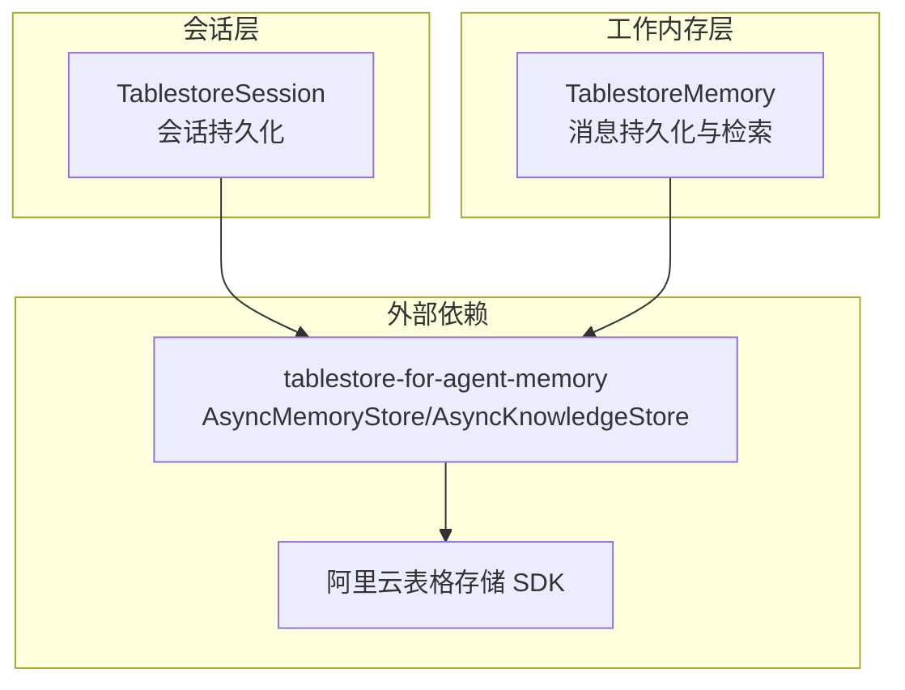
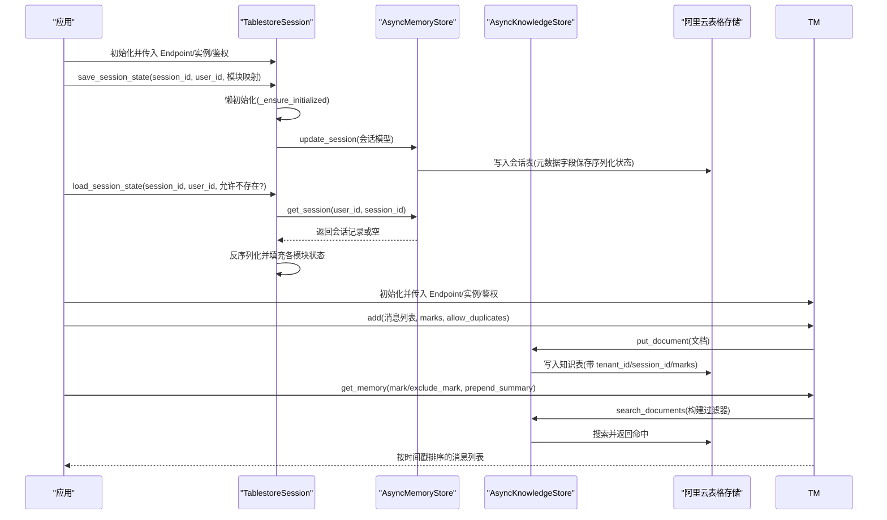
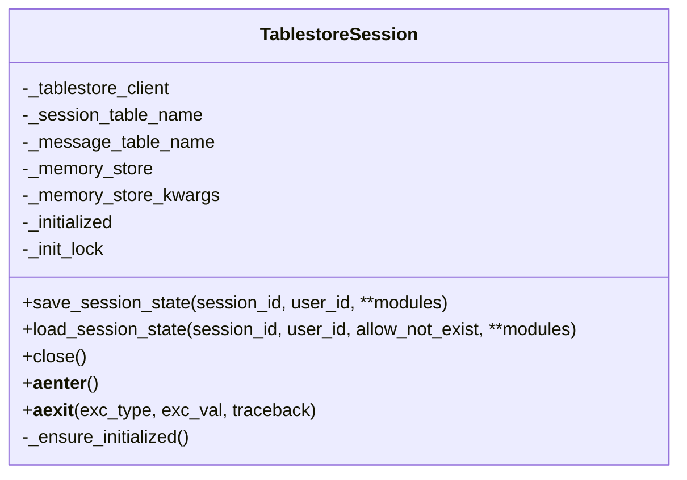
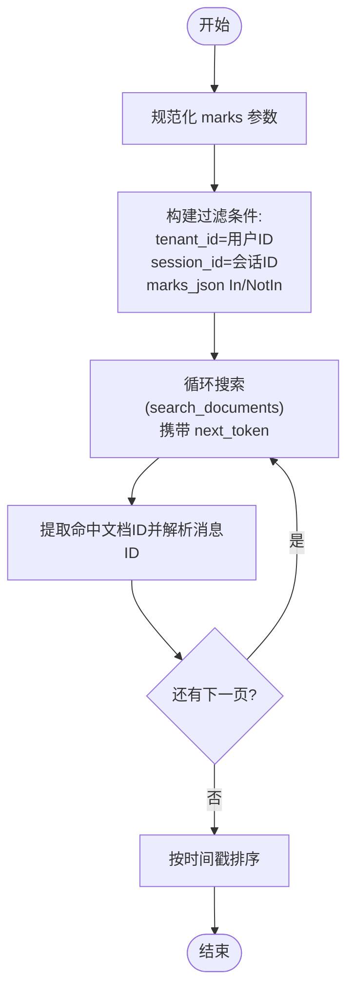
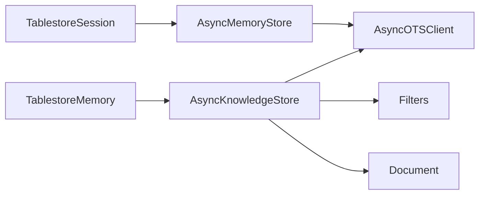

# 表格存储会话

<cite>
**本文引用的文件**
- [src/agentscope/session/_tablestore_session.py](file://src/agentscope/session/_tablestore_session.py)
- [src/agentscope/memory/_working_memory/_tablestore_memory.py](file://src/agentscope/memory/_working_memory/_tablestore_memory.py)
- [tests/tablestore_session_test.py](file://tests/tablestore_session_test.py)
- [tests/tablestore_memory_test.py](file://tests/tablestore_memory_test.py)
- [tests/tablestore_session_ft_test.py](file://tests/tablestore_session_ft_test.py)
- [tests/tablestore_memory_ft_test.py](file://tests/tablestore_memory_ft_test.py)
- [examples/functionality/session_with_sqlite/sqlite_session.py](file://examples/functionality/session_with_sqlite/sqlite_session.py)
</cite>

## 目录
1. [简介](#简介)
2. [项目结构](#项目结构)
3. [核心组件](#核心组件)
4. [架构总览](#架构总览)
5. [详细组件分析](#详细组件分析)
6. [依赖关系分析](#依赖关系分析)
7. [性能考量](#性能考量)
8. [故障排查指南](#故障排查指南)
9. [结论](#结论)
10. [附录](#附录)

## 简介
本技术文档围绕 AgentScope 的“表格存储会话”实现展开，系统性说明其在阿里云表格存储（Tablestore）上的集成方案与使用方式。文档重点覆盖以下方面：
- SDK 配置与连接建立、认证机制（含 STS 临时凭证）
- 数据模型设计（表结构、主键、索引策略）
- 查询接口实现（单行读取、批量写入、条件过滤、排序分页）
- 事务支持与并发控制（基于底层 SDK 重试策略）
- 配置参数说明（Endpoint、实例名、鉴权、网络参数等）
- CRUD 操作示例路径、性能优化策略与成本控制建议
- 与传统关系型数据库的对比分析、适用场景评估与迁移注意事项

## 项目结构
与“表格存储会话”直接相关的核心代码位于会话与工作内存两个模块中，配套有单元测试与端到端功能测试，以及一个 SQLite 会话示例用于对比。

图示来源
- [src/agentscope/session/_tablestore_session.py:12-89](file://src/agentscope/session/_tablestore_session.py#L12-L89)
- [src/agentscope/memory/_working_memory/_tablestore_memory.py:26-101](file://src/agentscope/memory/_working_memory/_tablestore_memory.py#L26-L101)

章节来源
- [src/agentscope/session/_tablestore_session.py:12-89](file://src/agentscope/session/_tablestore_session.py#L12-L89)
- [src/agentscope/memory/_working_memory/_tablestore_memory.py:26-101](file://src/agentscope/memory/_working_memory/_tablestore_memory.py#L26-L101)

## 核心组件
- TablestoreSession：基于表格存储的会话状态持久化组件，负责将状态模块序列化后存入会话表元数据字段，支持异步上下文管理与懒初始化。
- TablestoreMemory：基于表格存储的工作内存组件，负责消息的增删改查、标记管理、向量检索与多租户隔离。

章节来源
- [src/agentscope/session/_tablestore_session.py:12-273](file://src/agentscope/session/_tablestore_session.py#L12-L273)
- [src/agentscope/memory/_working_memory/_tablestore_memory.py:14-852](file://src/agentscope/memory/_working_memory/_tablestore_memory.py#L14-L852)

## 架构总览
下图展示了“表格存储会话”的整体调用链路与数据流：

图示来源
- [src/agentscope/session/_tablestore_session.py:91-164](file://src/agentscope/session/_tablestore_session.py#L91-L164)
- [src/agentscope/memory/_working_memory/_tablestore_memory.py:115-144](file://src/agentscope/memory/_working_memory/_tablestore_memory.py#L115-L144)
- [src/agentscope/memory/_working_memory/_tablestore_memory.py:261-315](file://src/agentscope/memory/_working_memory/_tablestore_memory.py#L261-L315)
- [src/agentscope/memory/_working_memory/_tablestore_memory.py:603-659](file://src/agentscope/memory/_working_memory/_tablestore_memory.py#L603-L659)

## 详细组件分析

### TablestoreSession 组件
- 职责：将状态模块的状态字典序列化后写入会话表元数据字段；按需加载并反序列化。
- 关键点：
  - 懒初始化：首次使用时创建 AsyncMemoryStore 并初始化表与搜索索引。
  - 异步上下文管理：进入时确保初始化，退出时关闭连接。
  - 用户 ID 默认值：空字符串时自动转为默认值，便于统一隔离。
  - 错误处理：允许不存在时跳过加载，严格模式抛出异常。

图示来源
- [src/agentscope/session/_tablestore_session.py:12-273](file://src/agentscope/session/_tablestore_session.py#L12-L273)

章节来源
- [src/agentscope/session/_tablestore_session.py:26-164](file://src/agentscope/session/_tablestore_session.py#L26-L164)
- [src/agentscope/session/_tablestore_session.py:166-237](file://src/agentscope/session/_tablestore_session.py#L166-L237)
- [src/agentscope/session/_tablestore_session.py:239-273](file://src/agentscope/session/_tablestore_session.py#L239-L273)

### TablestoreMemory 组件
- 职责：消息持久化、检索、标记管理、删除、清空、大小统计、更新标记等。
- 关键点：
  - 文档 ID 设计：采用“消息ID:::会话ID”格式，确保跨会话唯一性。
  - 多租户隔离：tenant_id 使用 user_id，session_id 用于会话级过滤。
  - 检索能力：通过 marks_json 字段进行 In/not_in 过滤，结合 session_id 与 tenant_id；最终按时间戳排序。
  - 批量写入：add 支持批量消息，内部并发提交。
  - 去重策略：allow_duplicates=False 时，先查询已存在 ID 再过滤。
  - 向量维度：可选配置，不启用时仅文本检索。

图示来源
- [src/agentscope/memory/_working_memory/_tablestore_memory.py:392-437](file://src/agentscope/memory/_working_memory/_tablestore_memory.py#L392-L437)
- [src/agentscope/memory/_working_memory/_tablestore_memory.py:758-823](file://src/agentscope/memory/_working_memory/_tablestore_memory.py#L758-L823)

章节来源
- [src/agentscope/memory/_working_memory/_tablestore_memory.py:146-190](file://src/agentscope/memory/_working_memory/_tablestore_memory.py#L146-L190)
- [src/agentscope/memory/_working_memory/_tablestore_memory.py:261-315](file://src/agentscope/memory/_working_memory/_tablestore_memory.py#L261-L315)
- [src/agentscope/memory/_working_memory/_tablestore_memory.py:392-493](file://src/agentscope/memory/_working_memory/_tablestore_memory.py#L392-L493)
- [src/agentscope/memory/_working_memory/_tablestore_memory.py:603-659](file://src/agentscope/memory/_working_memory/_tablestore_memory.py#L603-L659)
- [src/agentscope/memory/_working_memory/_tablestore_memory.py:661-756](file://src/agentscope/memory/_working_memory/_tablestore_memory.py#L661-L756)
- [src/agentscope/memory/_working_memory/_tablestore_memory.py:800-823](file://src/agentscope/memory/_working_memory/_tablestore_memory.py#L800-L823)

## 依赖关系分析
- 组件耦合：
  - TablestoreSession 依赖 AsyncMemoryStore 完成会话表的读写与索引初始化。
  - TablestoreMemory 依赖 AsyncKnowledgeStore 完成知识表的文档写入、检索与索引初始化。
- 外部依赖：
  - 阿里云表格存储 SDK（AsyncOTSClient、WriteRetryPolicy）
  - tablestore-for-agent-memory（AsyncMemoryStore、AsyncKnowledgeStore、Filters、Document 等）

图示来源
- [src/agentscope/session/_tablestore_session.py:60-82](file://src/agentscope/session/_tablestore_session.py#L60-L82)
- [src/agentscope/memory/_working_memory/_tablestore_memory.py:73-101](file://src/agentscope/memory/_working_memory/_tablestore_memory.py#L73-L101)
- [src/agentscope/memory/_working_memory/_tablestore_memory.py:127-141](file://src/agentscope/memory/_working_memory/_tablestore_memory.py#L127-L141)

章节来源
- [src/agentscope/session/_tablestore_session.py:60-82](file://src/agentscope/session/_tablestore_session.py#L60-L82)
- [src/agentscope/memory/_working_memory/_tablestore_memory.py:73-101](file://src/agentscope/memory/_working_memory/_tablestore_memory.py#L73-L101)
- [src/agentscope/memory/_working_memory/_tablestore_memory.py:127-141](file://src/agentscope/memory/_working_memory/_tablestore_memory.py#L127-L141)

## 性能考量
- 写入性能
  - 批量写入：add 支持批量消息，内部并发提交，减少往返次数。
  - 去重过滤：allow_duplicates=False 时先查询已存在 ID，避免重复写入。
- 检索性能
  - 搜索索引：初始化时创建二级索引与搜索索引，提升过滤与分页效率。
  - 分页迭代：search_documents 使用 next_token 循环拉取全部命中，避免一次性大结果集。
  - 排序：按时间戳排序，确保输出顺序稳定。
- 并发与一致性
  - 懒初始化使用 asyncio.Lock 防止并发初始化。
  - SDK 写入重试策略（WriteRetryPolicy）提升写入稳定性。
- 成本控制
  - 合理设置表与索引规模，避免冗余字段与索引。
  - 控制检索范围（tenant_id/session_id/marks），减少扫描数据量。
  - 对于不需要向量检索的场景，关闭向量维度以降低存储与索引开销。

## 故障排查指南
- 常见错误与定位
  - 缺少依赖包：导入失败时提示安装 tablestore 与 tablestore-for-agent-memory。
  - 会话不存在：load_session_state 在严格模式下抛出异常；允许不存在时记录日志并跳过。
  - 文档 ID 格式错误：_extract_msg_id 对不符合“消息ID:::会话ID”的 document_id 记录错误日志并返回原值。
  - 标记类型错误：add/get_memory/update_messages_mark/delete_by_mark 对非法 marks 类型抛出 TypeError。
- 单元测试参考
  - 会话：覆盖保存/覆盖加载、不存在会话行为、多模块加载、上下文管理、关闭行为等。
  - 工作内存：覆盖添加消息、去重、删除、按标记过滤、更新标记、清空、大小统计、文档转换等。

章节来源
- [src/agentscope/session/_tablestore_session.py:68-73](file://src/agentscope/session/_tablestore_session.py#L68-L73)
- [src/agentscope/session/_tablestore_session.py:168-211](file://src/agentscope/session/_tablestore_session.py#L168-L211)
- [src/agentscope/memory/_working_memory/_tablestore_memory.py:180-189](file://src/agentscope/memory/_working_memory/_tablestore_memory.py#L180-L189)
- [tests/tablestore_session_test.py:48-130](file://tests/tablestore_session_test.py#L48-L130)
- [tests/tablestore_session_test.py:168-212](file://tests/tablestore_session_test.py#L168-L212)
- [tests/tablestore_memory_test.py:527-538](file://tests/tablestore_memory_test.py#L527-L538)
- [tests/tablestore_memory_test.py:580-584](file://tests/tablestore_memory_test.py#L580-L584)

## 结论
“表格存储会话”通过 AsyncMemoryStore 与 AsyncKnowledgeStore 将会话状态与消息持久化至阿里云表格存储，具备如下优势：
- 异步与懒初始化提升资源利用率
- 多租户与会话级隔离满足分布式场景
- 搜索索引与过滤能力支撑复杂检索需求
- 批量写入与重试策略保障吞吐与稳定性

在实际部署中，建议结合业务规模合理配置 Endpoint、实例与索引，关注检索范围与数据量，以获得更优的成本与性能平衡。

## 附录

### 配置参数说明
- 连接与鉴权
  - end_point：表格存储实例访问地址
  - instance_name：实例名称
  - access_key_id / access_key_secret：长期密钥
  - sts_token：可选，STS 临时凭证（为空字符串时等同未提供）
- 表与索引
  - session_table_name / message_table_name：会话表与消息表名称（会话表用于保存状态）
  - table_name：知识表名称（工作内存使用）
  - text_field / embedding_field：文本字段与向量字段名
  - vector_dimension：向量维度（0 表示不启用向量）
  - search_index_name：搜索索引名称
- 其他
  - user_id / session_id：多租户与会话隔离标识
  - allow_duplicates：是否允许重复消息（add 时）
  - prepend_summary：获取消息时是否前置压缩摘要

章节来源
- [src/agentscope/session/_tablestore_session.py:26-59](file://src/agentscope/session/_tablestore_session.py#L26-L59)
- [src/agentscope/memory/_working_memory/_tablestore_memory.py:26-70](file://src/agentscope/memory/_working_memory/_tablestore_memory.py#L26-L70)

### CRUD 操作示例（路径指引）
- 保存会话状态
  - [save_session_state 调用路径:126-164](file://src/agentscope/session/_tablestore_session.py#L126-L164)
  - [单元测试示例:48-130](file://tests/tablestore_session_test.py#L48-L130)
  - [端到端测试示例:120-151](file://tests/tablestore_session_ft_test.py#L120-L151)
- 加载会话状态
  - [load_session_state 调用路径:171-237](file://src/agentscope/session/_tablestore_session.py#L171-L237)
  - [单元测试示例:131-241](file://tests/tablestore_session_test.py#L131-L241)
  - [端到端测试示例:199-206](file://tests/tablestore_session_ft_test.py#L199-L206)
- 添加消息
  - [add 调用路径:261-315](file://src/agentscope/memory/_working_memory/_tablestore_memory.py#L261-L315)
  - [单元测试示例:79-166](file://tests/tablestore_memory_test.py#L79-L166)
  - [端到端测试示例:168-197](file://tests/tablestore_memory_ft_test.py#L168-L197)
- 删除消息
  - [delete 调用路径:495-526](file://src/agentscope/memory/_working_memory/_tablestore_memory.py#L495-L526)
  - [单元测试示例:168-190](file://tests/tablestore_memory_test.py#L168-L190)
- 按标记过滤与更新
  - [get_memory 调用路径:603-659](file://src/agentscope/memory/_working_memory/_tablestore_memory.py#L603-L659)
  - [update_messages_mark 调用路径:661-756](file://src/agentscope/memory/_working_memory/_tablestore_memory.py#L661-L756)
  - [单元测试示例:216-265](file://tests/tablestore_memory_test.py#L216-L265)
  - [单元测试示例:356-422](file://tests/tablestore_memory_test.py#L356-L422)

### 与传统关系型数据库的对比
- 数据模型
  - 表格存储：宽表+JSON 元数据，适合非结构化/半结构化状态与消息；通过 tenant_id/session_id 实现多租户与会话隔离。
  - 关系型数据库：强结构化表，主外键约束明确，适合复杂关联与事务一致性。
- 查询与索引
  - 表格存储：通过二级索引与搜索索引支持过滤、分页与排序；适合高并发写入与灵活检索。
  - 关系型数据库：SQL 过滤、JOIN、子查询能力强，但写入与复杂查询可能受锁与索引影响。
- 事务与一致性
  - 表格存储：写入具备重试策略，单条记录更新语义明确；跨记录事务需自定义实现或借助外部协调。
  - 关系型数据库：原生 ACID 事务，支持多表原子性与强一致。
- 成本与扩展
  - 表格存储：按量计费、弹性扩展、适合海量非结构化数据；需要合理设计索引与字段。
  - 关系型数据库：成本与扩展性取决于引擎与架构，适合结构化强、读写混合场景。

章节来源
- [examples/functionality/session_with_sqlite/sqlite_session.py:12-168](file://examples/functionality/session_with_sqlite/sqlite_session.py#L12-L168)

### 适用场景与迁移注意事项
- 适用场景
  - 需要跨服务、跨节点共享的会话状态与消息持久化
  - 高并发写入与灵活检索（按标记、时间、会话）
  - 多租户隔离与会话级数据隔离
- 迁移注意事项
  - 数据模型映射：将状态模块的 state_dict 序列化到会话表元数据；消息映射为文档并维护 marks 与时间戳。
  - 索引设计：提前规划 tenant_id/session_id/marks 的索引，避免运行期慢查询。
  - 兼容性：从关系型迁移到表格存储时，注意 SQL JOIN 与事务逻辑需替换为多表/多索引组合或应用层协调。
  - 测试验证：利用单元测试与端到端测试覆盖关键路径，确保行为与预期一致。