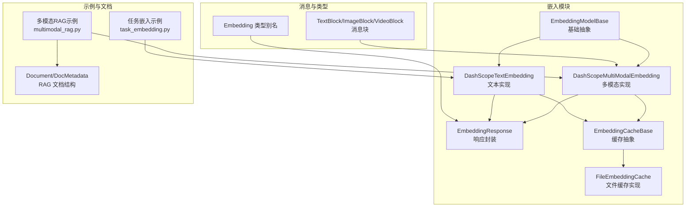
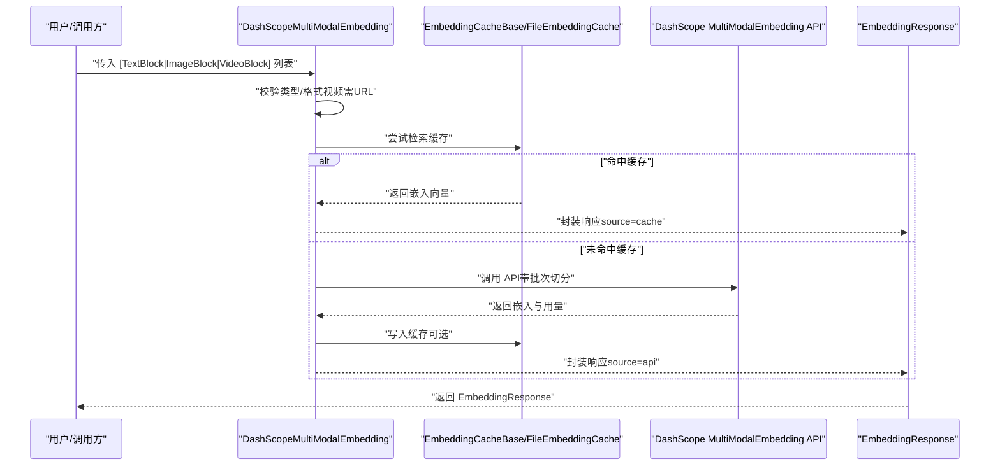
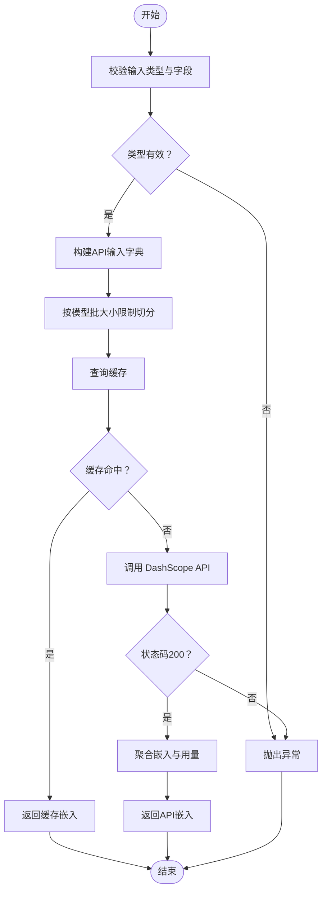
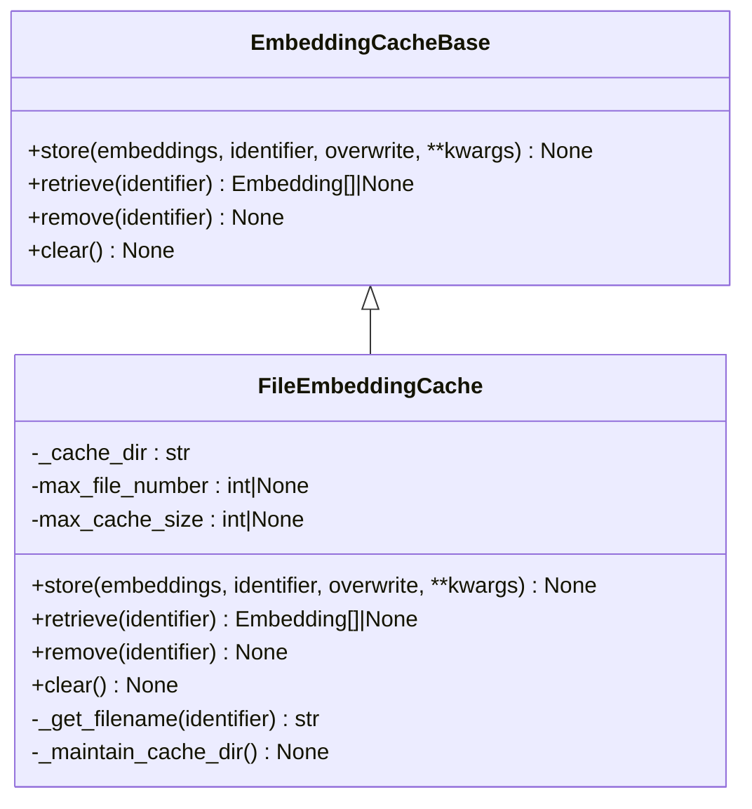
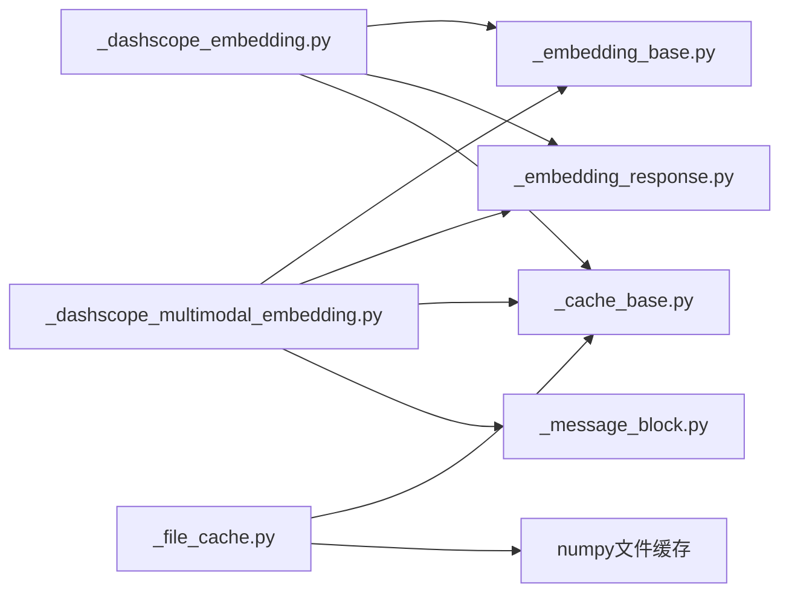

# 多模态嵌入

<cite>
**本文引用的文件**
- [embedding/__init__.py](file://src/agentscope/embedding/__init__.py)
- [_embedding_base.py](file://src/agentscope/embedding/_embedding_base.py)
- [_dashscope_multimodal_embedding.py](file://src/agentscope/embedding/_dashscope_multimodal_embedding.py)
- [_dashscope_embedding.py](file://src/agentscope/embedding/_dashscope_embedding.py)
- [_embedding_response.py](file://src/agentscope/embedding/_embedding_response.py)
- [_cache_base.py](file://src/agentscope/embedding/_cache_base.py)
- [_file_cache.py](file://src/agentscope/embedding/_file_cache.py)
- [_message_block.py](file://src/agentscope/message/_message_block.py)
- [_object.py](file://src/agentscope/types/_object.py)
- [task_embedding.py](file://docs/tutorial/zh_CN/src/task_embedding.py)
- [multimodal_rag.py](file://examples/functionality/rag/multimodal_rag.py)
- [_document.py](file://src/agentscope/rag/_document.py)
</cite>

## 目录
1. [引言](#引言)
2. [项目结构](#项目结构)
3. [核心组件](#核心组件)
4. [架构总览](#架构总览)
5. [详细组件分析](#详细组件分析)
6. [依赖分析](#依赖分析)
7. [性能考虑](#性能考虑)
8. [故障排查指南](#故障排查指南)
9. [结论](#结论)
10. [附录](#附录)

## 引言
本技术文档围绕 AgentScope 的多模态嵌入系统，聚焦于 DashScope 多模态嵌入能力的实现与使用，系统性阐述文本、图像、视频的统一编码机制、预处理流程、向量融合策略、应用场景、输入规范、处理流程与输出格式，并提供可操作的使用示例、性能优化技巧与最佳实践建议。

## 项目结构
与多模态嵌入直接相关的模块主要位于 embedding 子包，配合消息类型定义（消息块）、类型定义（向量类型）、缓存机制与示例文档，形成“模型抽象—具体实现—数据结构—缓存—示例”的完整链路。

图表来源
- [embedding/__init__.py:1-28](file://src/agentscope/embedding/__init__.py#L1-L28)
- [_embedding_base.py:8-46](file://src/agentscope/embedding/_embedding_base.py#L8-L46)
- [_dashscope_multimodal_embedding.py:17-245](file://src/agentscope/embedding/_dashscope_multimodal_embedding.py#L17-L245)
- [_dashscope_embedding.py:14-170](file://src/agentscope/embedding/_dashscope_embedding.py#L14-L170)
- [_embedding_response.py:12-33](file://src/agentscope/embedding/_embedding_response.py#L12-L33)
- [_cache_base.py:12-64](file://src/agentscope/embedding/_cache_base.py#L12-L64)
- [_file_cache.py:19-188](file://src/agentscope/embedding/_file_cache.py#L19-L188)
- [_message_block.py:9-77](file://src/agentscope/message/_message_block.py#L9-L77)
- [_object.py:5-6](file://src/agentscope/types/_object.py#L5-L6)
- [task_embedding.py:32-133](file://docs/tutorial/zh_CN/src/task_embedding.py#L32-L133)
- [multimodal_rag.py:25-73](file://examples/functionality/rag/multimodal_rag.py#L25-L73)
- [_document.py:17-52](file://src/agentscope/rag/_document.py#L17-L52)

章节来源
- [embedding/__init__.py:1-28](file://src/agentscope/embedding/__init__.py#L1-L28)
- [_embedding_base.py:8-46](file://src/agentscope/embedding/_embedding_base.py#L8-L46)
- [_dashscope_multimodal_embedding.py:17-245](file://src/agentscope/embedding/_dashscope_multimodal_embedding.py#L17-L245)
- [_dashscope_embedding.py:14-170](file://src/agentscope/embedding/_dashscope_embedding.py#L14-L170)
- [_embedding_response.py:12-33](file://src/agentscope/embedding/_embedding_response.py#L12-L33)
- [_cache_base.py:12-64](file://src/agentscope/embedding/_cache_base.py#L12-L64)
- [_file_cache.py:19-188](file://src/agentscope/embedding/_file_cache.py#L19-L188)
- [_message_block.py:9-77](file://src/agentscope/message/_message_block.py#L9-L77)
- [_object.py:5-6](file://src/agentscope/types/_object.py#L5-L6)
- [task_embedding.py:32-133](file://docs/tutorial/zh_CN/src/task_embedding.py#L32-L133)
- [multimodal_rag.py:25-73](file://examples/functionality/rag/multimodal_rag.py#L25-L73)
- [_document.py:17-52](file://src/agentscope/rag/_document.py#L17-L52)

## 核心组件
- 基础抽象与统一接口
  - EmbeddingModelBase：定义模型名称、维度、支持模态等元信息，以及异步调用接口。
  - EmbeddingResponse：封装嵌入结果、时间/Token用量、来源（缓存/API）等。
- DashScope 多模态嵌入实现
  - DashScopeMultiModalEmbedding：支持文本、图像、视频统一编码；内置批大小限制与缓存逻辑；严格校验输入格式（如视频仅URL）。
- DashScope 文本嵌入实现
  - DashScopeTextEmbedding：面向纯文本输入，具备批大小限制与缓存能力。
- 缓存体系
  - EmbeddingCacheBase：抽象缓存接口（存储、检索、删除、清空）。
  - FileEmbeddingCache：基于文件系统的缓存实现，支持按数量与容量维护。
- 数据结构与类型
  - TextBlock/ImageBlock/VideoBlock：消息块类型，作为多模态输入的标准化载体。
  - Embedding：向量类型别名（浮点数列表）。

章节来源
- [_embedding_base.py:8-46](file://src/agentscope/embedding/_embedding_base.py#L8-L46)
- [_embedding_response.py:12-33](file://src/agentscope/embedding/_embedding_response.py#L12-L33)
- [_dashscope_multimodal_embedding.py:17-245](file://src/agentscope/embedding/_dashscope_multimodal_embedding.py#L17-L245)
- [_dashscope_embedding.py:14-170](file://src/agentscope/embedding/_dashscope_embedding.py#L14-L170)
- [_cache_base.py:12-64](file://src/agentscope/embedding/_cache_base.py#L12-L64)
- [_file_cache.py:19-188](file://src/agentscope/embedding/_file_cache.py#L19-L188)
- [_message_block.py:9-77](file://src/agentscope/message/_message_block.py#L9-L77)
- [_object.py:5-6](file://src/agentscope/types/_object.py#L5-L6)

## 架构总览
下图展示多模态嵌入在 AgentScope 中的整体架构：消息块作为输入，经由 DashScope 多模态嵌入模型统一编码为向量，再通过缓存与响应封装返回；在 RAG 等场景中，文档对象承载嵌入与元数据，参与检索与推理。

图表来源
- [_dashscope_multimodal_embedding.py:91-196](file://src/agentscope/embedding/_dashscope_multimodal_embedding.py#L91-L196)
- [_cache_base.py:12-64](file://src/agentscope/embedding/_cache_base.py#L12-L64)
- [_file_cache.py:53-107](file://src/agentscope/embedding/_file_cache.py#L53-L107)
- [_embedding_response.py:12-33](file://src/agentscope/embedding/_embedding_response.py#L12-L33)

## 详细组件分析

### 组件一：DashScope 多模态嵌入模型
- 统一编码机制
  - 支持文本、图像、视频三类输入，内部统一转为 API 所需的字典结构。
  - 视频输入必须为URL；图像支持URL与Base64两种来源；文本必须包含text字段。
- 批次与维度
  - 不同模型名称对应不同的批大小限制与默认维度，构造时进行校验与修正。
  - 当前实现对“multimodal-embedding-v1”默认维度为1024；特定视觉模型有固定维度约束。
- 缓存与重试
  - 调用前先查缓存，命中则直接返回；未命中才发起API请求。
  - 返回的用量信息聚合自各批次调用。
- 错误处理
  - 输入类型不合法、视频非URL、图像来源非法等情况均抛出异常。
  - API状态码非200时抛出运行时错误。

图表来源
- [_dashscope_multimodal_embedding.py:91-196](file://src/agentscope/embedding/_dashscope_multimodal_embedding.py#L91-L196)
- [_dashscope_multimodal_embedding.py:198-244](file://src/agentscope/embedding/_dashscope_multimodal_embedding.py#L198-L244)

章节来源
- [_dashscope_multimodal_embedding.py:17-245](file://src/agentscope/embedding/_dashscope_multimodal_embedding.py#L17-L245)

### 组件二：DashScope 文本嵌入模型
- 输入与批处理
  - 接受字符串或文本块列表，自动提取文本内容。
  - 超过批大小限制时自动拆分为多次调用，并记录总耗时与Token用量。
- 缓存策略
  - 调用前查询缓存，命中则直接返回；未命中则调用API并将结果写入缓存。
- 错误处理
  - 非法输入类型抛出异常；API状态码非200抛出运行时错误。

章节来源
- [_dashscope_embedding.py:14-170](file://src/agentscope/embedding/_dashscope_embedding.py#L14-L170)

### 组件三：缓存体系
- 抽象接口
  - 支持存储、检索、删除、清空四类操作，参数包含标识符与覆盖策略。
- 文件缓存实现
  - 以标识符的哈希命名保存为 .npy 文件，支持按文件数量与目录大小上限进行维护。
  - 删除与清理时采用有序遍历与阈值判断，确保资源占用可控。

图表来源
- [_cache_base.py:12-64](file://src/agentscope/embedding/_cache_base.py#L12-L64)
- [_file_cache.py:19-188](file://src/agentscope/embedding/_file_cache.py#L19-L188)

章节来源
- [_cache_base.py:12-64](file://src/agentscope/embedding/_cache_base.py#L12-L64)
- [_file_cache.py:19-188](file://src/agentscope/embedding/_file_cache.py#L19-L188)

### 组件四：消息块与向量类型
- 消息块
  - TextBlock：包含type与text字段。
  - ImageBlock：包含type与source（支持URL与Base64）。
  - VideoBlock：包含type与source（支持URL与Base64）。
- 向量类型
  - Embedding：向量的类型别名，便于在响应与知识库中复用。

章节来源
- [_message_block.py:9-77](file://src/agentscope/message/_message_block.py#L9-L77)
- [_object.py:5-6](file://src/agentscope/types/_object.py#L5-L6)

### 组件五：响应与文档结构
- 响应封装
  - EmbeddingResponse：包含嵌入列表、唯一id、创建时间、类型、用量与来源。
- 文档结构
  - Document/DocMetadata：在RAG中承载内容块、文档/分块ID、嵌入与相关性分数等。

章节来源
- [_embedding_response.py:12-33](file://src/agentscope/embedding/_embedding_response.py#L12-L33)
- [_document.py:17-52](file://src/agentscope/rag/_document.py#L17-L52)

## 依赖分析
- 组件耦合
  - DashScope 多模态/文本嵌入均继承自 EmbeddingModelBase，统一了调用协议与响应格式。
  - 缓存接口与实现解耦，便于替换为内存/数据库等其他后端。
- 外部依赖
  - DashScope SDK：用于调用多模态与文本嵌入API。
  - NumPy：用于文件缓存的向量序列化与反序列化。
- 潜在循环依赖
  - 当前模块间为单向依赖（模型→缓存/响应），未见循环导入迹象。

图表来源
- [_dashscope_multimodal_embedding.py:1-14](file://src/agentscope/embedding/_dashscope_multimodal_embedding.py#L1-L14)
- [_dashscope_embedding.py:1-11](file://src/agentscope/embedding/_dashscope_embedding.py#L1-L11)
- [_cache_base.py:1-10](file://src/agentscope/embedding/_cache_base.py#L1-L10)
- [_file_cache.py:1-16](file://src/agentscope/embedding/_file_cache.py#L1-L16)
- [_embedding_base.py:1-6](file://src/agentscope/embedding/_embedding_base.py#L1-L6)
- [_embedding_response.py:1-9](file://src/agentscope/embedding/_embedding_response.py#L1-L9)
- [_message_block.py:1-6](file://src/agentscope/message/_message_block.py#L1-L6)

章节来源
- [_dashscope_multimodal_embedding.py:1-14](file://src/agentscope/embedding/_dashscope_multimodal_embedding.py#L1-L14)
- [_dashscope_embedding.py:1-11](file://src/agentscope/embedding/_dashscope_embedding.py#L1-L11)
- [_cache_base.py:1-10](file://src/agentscope/embedding/_cache_base.py#L1-L10)
- [_file_cache.py:1-16](file://src/agentscope/embedding/_file_cache.py#L1-L16)
- [_embedding_base.py:1-6](file://src/agentscope/embedding/_embedding_base.py#L1-L6)
- [_embedding_response.py:1-9](file://src/agentscope/embedding/_embedding_response.py#L1-L9)
- [_message_block.py:1-6](file://src/agentscope/message/_message_block.py#L1-L6)

## 性能考虑
- 批处理与并发
  - 多模态嵌入对不同模型设置了批大小限制，内部按批次切分调用，减少单次请求压力。
  - 文本嵌入同样按批处理，避免超限导致的API错误。
- 缓存命中率
  - 使用 FileEmbeddingCache 时，合理设置最大文件数与缓存大小，可显著降低重复调用成本。
  - 建议将输入标识符设计为可稳定序列化的结构，提高缓存键稳定性。
- I/O 与序列化
  - 文件缓存采用 .npy 序列化，读写效率高；注意磁盘空间与清理策略。
- API 调用开销
  - 统计响应中的时间与Token用量，有助于评估整体成本与优化策略。

## 故障排查指南
- 输入类型错误
  - 现象：抛出“无效数据/块”异常。
  - 排查：确认输入是否为 TextBlock/ImageBlock/VideoBlock 字典，且字段齐全。
- 视频输入限制
  - 现象：视频输入非URL时报错。
  - 排查：将视频改为URL或转换为图像帧序列后分别嵌入。
- 图像来源非法
  - 现象：图像块source类型不在允许范围时报错。
  - 排查：确保source为URL或Base64，并包含媒体类型。
- API 调用失败
  - 现象：状态码非200，抛出运行时错误。
  - 排查：检查API密钥、模型名称与维度配置、网络连通性。
- 缓存问题
  - 现象：缓存文件损坏或路径异常。
  - 排查：检查缓存目录权限、文件存在性与命名规则；必要时清空缓存后重试。

章节来源
- [_dashscope_multimodal_embedding.py:110-166](file://src/agentscope/embedding/_dashscope_multimodal_embedding.py#L110-L166)
- [_dashscope_multimodal_embedding.py:225-228](file://src/agentscope/embedding/_dashscope_multimodal_embedding.py#L225-L228)
- [_file_cache.py:76-87](file://src/agentscope/embedding/_file_cache.py#L76-L87)
- [_file_cache.py:121-124](file://src/agentscope/embedding/_file_cache.py#L121-L124)

## 结论
AgentScope 的多模态嵌入以统一抽象与清晰的数据结构为基础，结合严格的输入校验与缓存机制，实现了对文本、图像、视频的高效统一编码。通过批处理与用量统计，既满足了性能需求，也为后续的跨模态检索、内容理解与媒体分析提供了坚实支撑。

## 附录

### 输入规范与处理流程
- 输入规范
  - 文本：TextBlock 或字符串列表。
  - 图像：ImageBlock，支持URL或Base64（含媒体类型）。
  - 视频：VideoBlock，当前实现要求URL来源。
- 处理流程
  - 校验类型与字段完整性。
  - 构建API输入字典并按模型批大小限制切分。
  - 先查缓存，命中则直接返回；未命中则调用API并聚合结果。
- 输出格式
  - EmbeddingResponse：包含嵌入向量列表、唯一id、创建时间、类型、用量与来源。

章节来源
- [_message_block.py:9-77](file://src/agentscope/message/_message_block.py#L9-L77)
- [_dashscope_multimodal_embedding.py:91-196](file://src/agentscope/embedding/_dashscope_multimodal_embedding.py#L91-L196)
- [_embedding_response.py:12-33](file://src/agentscope/embedding/_embedding_response.py#L12-L33)

### 应用场景与示例
- 跨模态检索
  - 将图像/文本/视频统一编码为向量，存入向量库（如示例中的QdrantStore），实现跨模态相似度检索。
- 内容理解与媒体分析
  - 结合聊天模型与多模态嵌入，构建智能助手完成图文问答、媒体内容分析等任务。
- 使用示例
  - 文本嵌入与缓存示例参见任务嵌入教程脚本。
  - 多模态RAG示例展示了从图像读取到知识库构建再到Agent推理的完整流程。

章节来源
- [task_embedding.py:32-133](file://docs/tutorial/zh_CN/src/task_embedding.py#L32-L133)
- [multimodal_rag.py:25-73](file://examples/functionality/rag/multimodal_rag.py#L25-L73)

### 最佳实践建议
- 明确模型与维度
  - 根据业务选择合适模型，并在构造时指定维度；特定视觉模型需遵循固定维度约束。
- 控制批大小
  - 避免超过模型批大小限制，减少单次调用失败风险。
- 合理使用缓存
  - 设置合适的缓存上限与清理策略，平衡磁盘占用与命中率。
- 输入标准化
  - 统一使用消息块类型，确保字段完整与来源正确，降低错误概率。
- 成本与性能监控
  - 关注Token用量与调用耗时，结合缓存命中率评估整体成本。