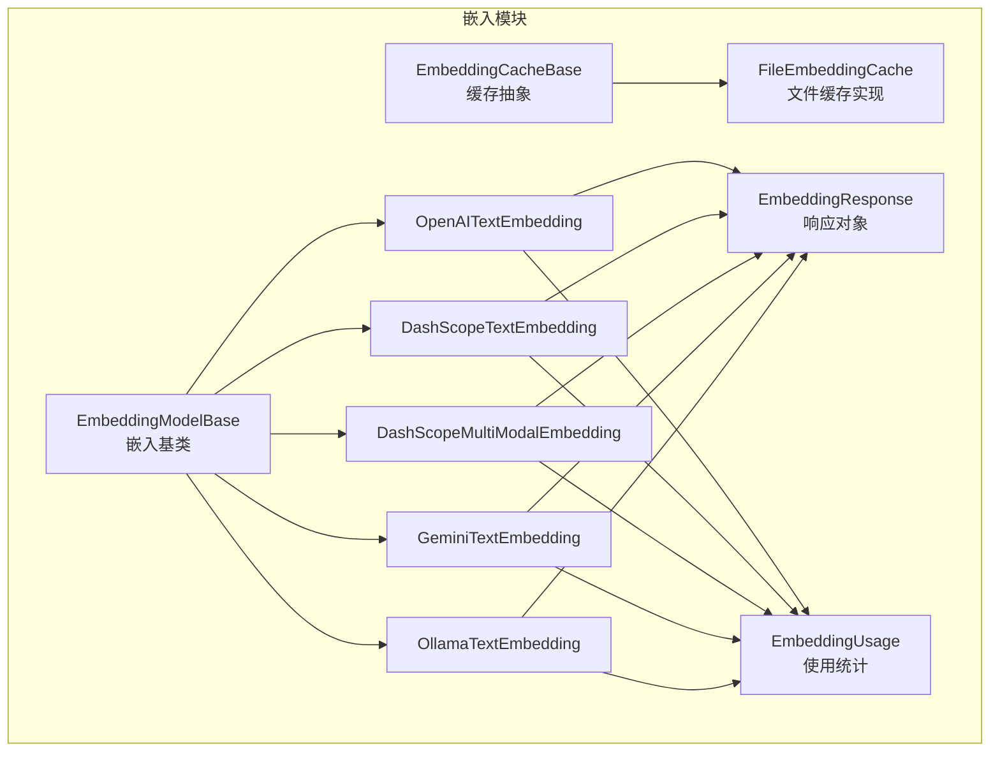
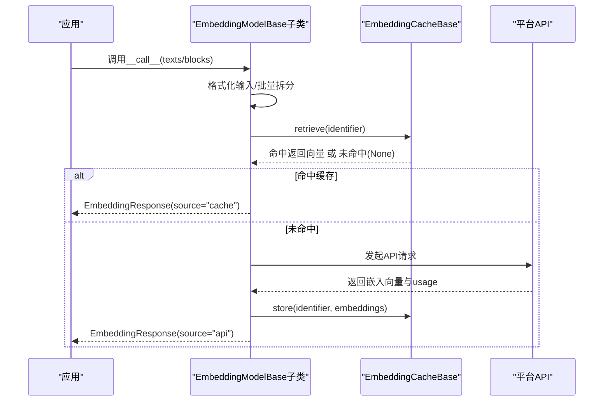
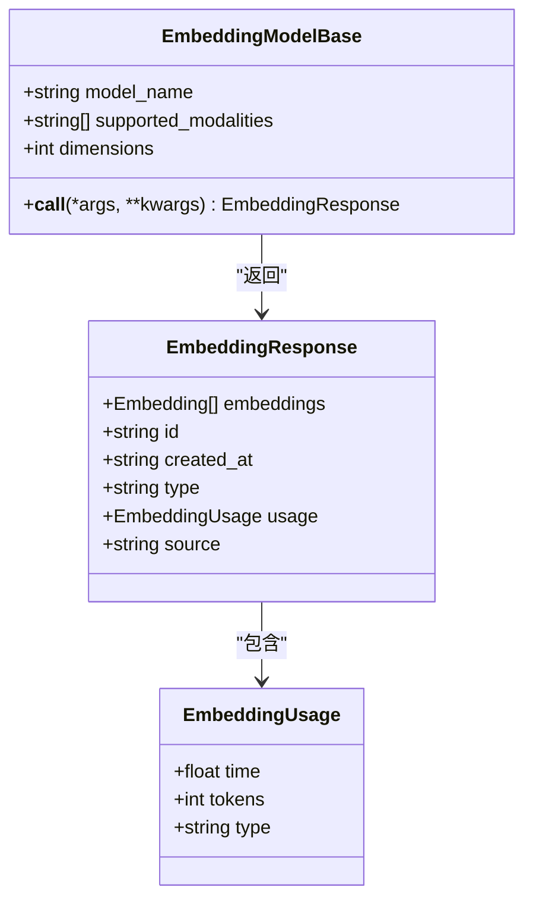
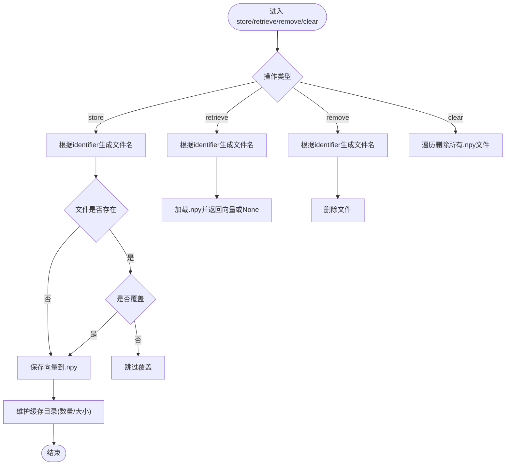
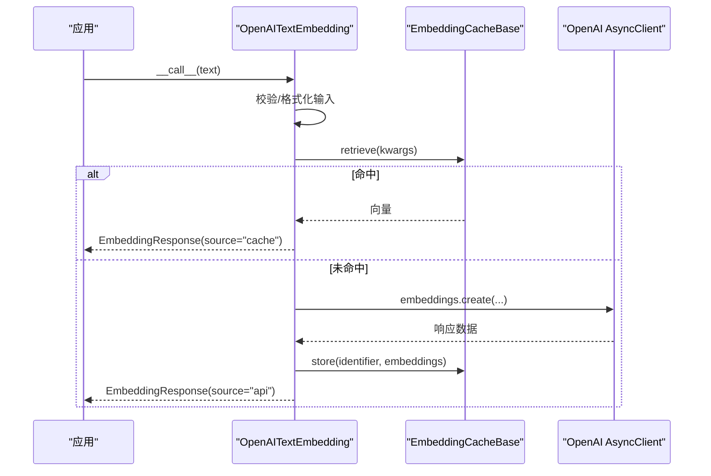
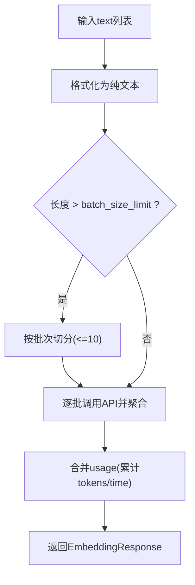
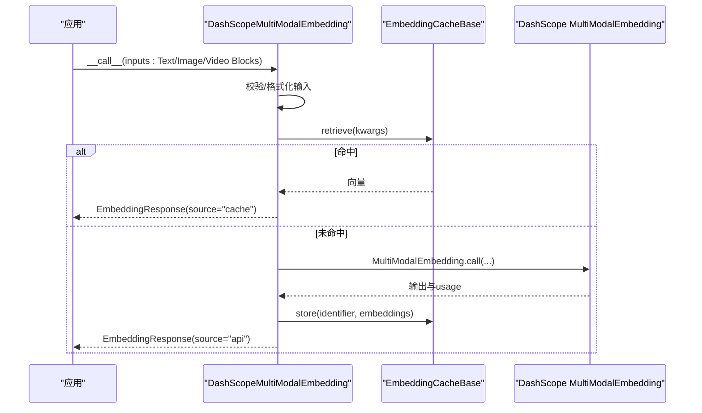
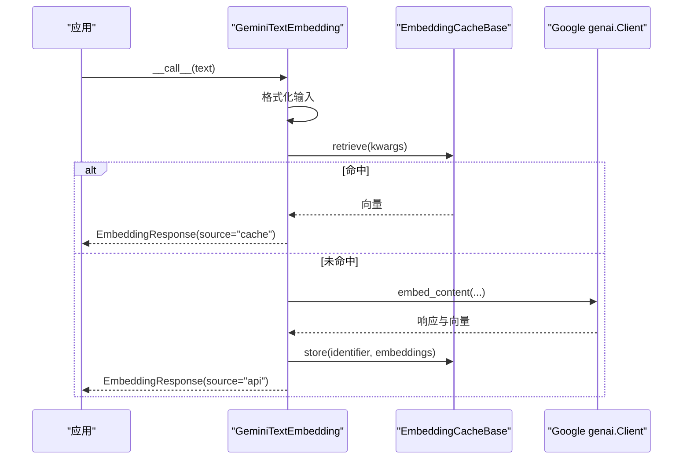
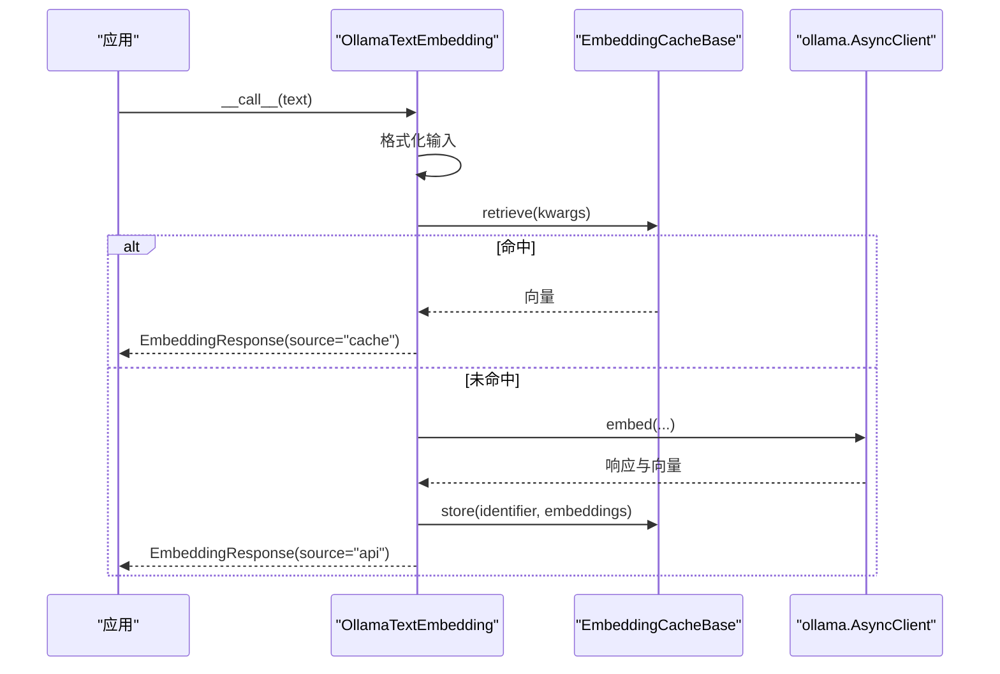
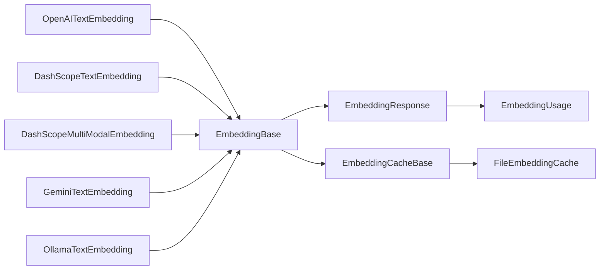

# 嵌入向量系统

<cite>
**本文引用的文件**
- [embedding/__init__.py](file://src/agentscope/embedding/__init__.py)
- [embedding/_embedding_base.py](file://src/agentscope/embedding/_embedding_base.py)
- [embedding/_embedding_response.py](file://src/agentscope/embedding/_embedding_response.py)
- [embedding/_embedding_usage.py](file://src/agentscope/embedding/_embedding_usage.py)
- [embedding/_cache_base.py](file://src/agentscope/embedding/_cache_base.py)
- [embedding/_file_cache.py](file://src/agentscope/embedding/_file_cache.py)
- [embedding/_openai_embedding.py](file://src/agentscope/embedding/_openai_embedding.py)
- [embedding/_dashscope_embedding.py](file://src/agentscope/embedding/_dashscope_embedding.py)
- [embedding/_dashscope_multimodal_embedding.py](file://src/agentscope/embedding/_dashscope_multimodal_embedding.py)
- [embedding/_gemini_embedding.py](file://src/agentscope/embedding/_gemini_embedding.py)
- [embedding/_ollama_embedding.py](file://src/agentscope/embedding/_ollama_embedding.py)
- [types/__init__.py](file://src/agentscope/types/__init__.py)
- [types/_object.py](file://src/agentscope/types/_object.py)
- [docs/tutorial/zh_CN/src/task_embedding.py](file://docs/tutorial/zh_CN/src/task_embedding.py)
- [tests/embedding_cache_test.py](file://tests/embedding_cache_test.py)
- [examples/functionality/vector_store/milvus_lite/main.py](file://examples/functionality/vector_store/milvus_lite/main.py)
</cite>

## 目录
1. [简介](#简介)
2. [项目结构](#项目结构)
3. [核心组件](#核心组件)
4. [架构总览](#架构总览)
5. [详细组件分析](#详细组件分析)
6. [依赖分析](#依赖分析)
7. [性能考虑](#性能考虑)
8. [故障排查指南](#故障排查指南)
9. [结论](#结论)
10. [附录](#附录)

## 简介
本技术文档面向AgentScope嵌入向量系统，系统性阐述嵌入基类设计、向量生成与批量处理流程、响应格式规范；详解各平台适配器（OpenAI、DashScope多模态、Gemini、Ollama）的实现差异与特性；说明缓存机制（文件缓存、内存缓存抽象、缓存策略与过期管理）；解释使用统计（调用次数、令牌消耗、耗时）的采集方式；并给出应用场景（相似度计算、聚类分析、检索增强）与最佳实践、性能优化技巧、缓存配置指南及完整API参考。

## 项目结构
嵌入子系统位于src/agentscope/embedding目录，采用“平台适配器 + 统一基类 + 缓存抽象 + 类型与响应”的分层组织方式。对外通过__init__.py导出统一入口，内部通过类型模块提供Embedding等基础类型定义。

图表来源
- [embedding/__init__.py:1-28](file://src/agentscope/embedding/__init__.py#L1-L28)
- [embedding/_embedding_base.py:8-46](file://src/agentscope/embedding/_embedding_base.py#L8-L46)
- [embedding/_embedding_response.py:12-33](file://src/agentscope/embedding/_embedding_response.py#L12-L33)
- [embedding/_embedding_usage.py:9-21](file://src/agentscope/embedding/_embedding_usage.py#L9-L21)
- [embedding/_cache_base.py:12-64](file://src/agentscope/embedding/_cache_base.py#L12-L64)
- [embedding/_file_cache.py:19-188](file://src/agentscope/embedding/_file_cache.py#L19-L188)
- [embedding/_openai_embedding.py:13-110](file://src/agentscope/embedding/_openai_embedding.py#L13-L110)
- [embedding/_dashscope_embedding.py:14-170](file://src/agentscope/embedding/_dashscope_embedding.py#L14-L170)
- [embedding/_dashscope_multimodal_embedding.py:17-245](file://src/agentscope/embedding/_dashscope_multimodal_embedding.py#L17-L245)
- [embedding/_gemini_embedding.py:13-110](file://src/agentscope/embedding/_gemini_embedding.py#L13-L110)
- [embedding/_ollama_embedding.py:13-107](file://src/agentscope/embedding/_ollama_embedding.py#L13-L107)

章节来源
- [embedding/__init__.py:1-28](file://src/agentscope/embedding/__init__.py#L1-L28)

## 核心组件
- 嵌入基类：统一模型名称、维度、支持模态声明，并定义异步__call__接口，便于扩展不同平台适配器。
- 响应对象：封装嵌入向量、响应标识、创建时间、类型、使用统计与来源标记（cache或api）。
- 使用统计：记录耗时与令牌用量，部分平台可提供令牌统计。
- 缓存抽象：定义存储、检索、移除、清空等接口，支持多种缓存后端。
- 文件缓存：基于二进制文件的持久化缓存，支持文件数量与目录大小上限维护。

章节来源
- [embedding/_embedding_base.py:8-46](file://src/agentscope/embedding/_embedding_base.py#L8-L46)
- [embedding/_embedding_response.py:12-33](file://src/agentscope/embedding/_embedding_response.py#L12-L33)
- [embedding/_embedding_usage.py:9-21](file://src/agentscope/embedding/_embedding_usage.py#L9-L21)
- [embedding/_cache_base.py:12-64](file://src/agentscope/embedding/_cache_base.py#L12-L64)
- [embedding/_file_cache.py:19-188](file://src/agentscope/embedding/_file_cache.py#L19-L188)

## 架构总览
下图展示嵌入系统的整体交互：上层业务调用适配器，适配器根据输入进行格式化与批量拆分，结合缓存逻辑决定是否命中缓存；若未命中则调用对应平台API，返回EmbeddingResponse并写入缓存；最终由上层消费响应中的向量与统计信息。

图表来源
- [embedding/_openai_embedding.py:49-110](file://src/agentscope/embedding/_openai_embedding.py#L49-L110)
- [embedding/_dashscope_embedding.py:107-170](file://src/agentscope/embedding/_dashscope_embedding.py#L107-L170)
- [embedding/_dashscope_multimodal_embedding.py:91-245](file://src/agentscope/embedding/_dashscope_multimodal_embedding.py#L91-L245)
- [embedding/_gemini_embedding.py:50-110](file://src/agentscope/embedding/_gemini_embedding.py#L50-L110)
- [embedding/_ollama_embedding.py:48-107](file://src/agentscope/embedding/_ollama_embedding.py#L48-L107)
- [embedding/_cache_base.py:12-64](file://src/agentscope/embedding/_cache_base.py#L12-L64)

## 详细组件分析

### 基类与响应/使用统计
- 嵌入基类：声明模型名、维度、支持模态列表，提供异步__call__接口，子类需实现具体调用逻辑。
- 响应对象：包含嵌入向量、响应id、创建时间、类型、使用统计与来源标记。
- 使用统计：记录耗时与令牌用量，类型字段固定为"embedding"。

图表来源
- [embedding/_embedding_base.py:8-46](file://src/agentscope/embedding/_embedding_base.py#L8-L46)
- [embedding/_embedding_response.py:12-33](file://src/agentscope/embedding/_embedding_response.py#L12-L33)
- [embedding/_embedding_usage.py:9-21](file://src/agentscope/embedding/_embedding_usage.py#L9-L21)

章节来源
- [embedding/_embedding_base.py:8-46](file://src/agentscope/embedding/_embedding_base.py#L8-L46)
- [embedding/_embedding_response.py:12-33](file://src/agentscope/embedding/_embedding_response.py#L12-L33)
- [embedding/_embedding_usage.py:9-21](file://src/agentscope/embedding/_embedding_usage.py#L9-L21)

### 缓存机制
- 抽象接口：定义store/retrieve/remove/clear四个方法，支持任意缓存后端。
- 文件缓存：基于identifier生成哈希文件名，使用numpy数组保存向量；支持最大文件数与缓存目录大小上限，自动清理最旧文件以维持容量约束。

图表来源
- [embedding/_file_cache.py:53-188](file://src/agentscope/embedding/_file_cache.py#L53-L188)
- [embedding/_cache_base.py:12-64](file://src/agentscope/embedding/_cache_base.py#L12-L64)

章节来源
- [embedding/_cache_base.py:12-64](file://src/agentscope/embedding/_cache_base.py#L12-L64)
- [embedding/_file_cache.py:19-188](file://src/agentscope/embedding/_file_cache.py#L19-L188)
- [tests/embedding_cache_test.py:13-169](file://tests/embedding_cache_test.py#L13-L169)

### OpenAI嵌入适配器
- 输入支持：字符串或TextBlock字典，统一抽取"text"字段。
- 批量与维度：直接透传至OpenAI API，支持指定维度；内部对输入进行校验与格式化。
- 缓存策略：先查缓存，命中则返回缓存向量且usage为零；未命中则调用API并将结果写入缓存。
- 使用统计：记录总令牌用量与耗时。

图表来源
- [embedding/_openai_embedding.py:49-110](file://src/agentscope/embedding/_openai_embedding.py#L49-L110)

章节来源
- [embedding/_openai_embedding.py:13-110](file://src/agentscope/embedding/_openai_embedding.py#L13-L110)

### DashScope文本嵌入适配器
- 输入支持：字符串或TextBlock字典，统一抽取"text"字段。
- 批量限制：内置batch_size_limit（默认10），超过则分批调用API并聚合结果；记录累计耗时与令牌。
- 缓存策略：先查缓存，命中则直接返回；未命中则调用API并将输出写入缓存。
- 使用统计：返回total_tokens与耗时。

图表来源
- [embedding/_dashscope_embedding.py:107-170](file://src/agentscope/embedding/_dashscope_embedding.py#L107-L170)

章节来源
- [embedding/_dashscope_embedding.py:14-170](file://src/agentscope/embedding/_dashscope_embedding.py#L14-L170)

### DashScope多模态嵌入适配器
- 支持模态：text、image、video；对输入进行严格校验，确保类型与source格式正确。
- 模型差异化：针对不同模型设置不同的batch_size_limit与维度约束；若不满足约束则抛出异常。
- 批量与缓存：按batch_size_limit逐批调用API，聚合结果与usage；缓存逻辑与文本版本一致。
- 使用统计：综合image_tokens与input_tokens（若存在）作为tokens计数。

图表来源
- [embedding/_dashscope_multimodal_embedding.py:91-245](file://src/agentscope/embedding/_dashscope_multimodal_embedding.py#L91-L245)

章节来源
- [embedding/_dashscope_multimodal_embedding.py:17-245](file://src/agentscope/embedding/_dashscope_multimodal_embedding.py#L17-L245)

### Gemini嵌入适配器
- 输入支持：字符串或TextBlock字典，统一抽取"text"字段。
- 调用方式：通过genai.Client调用embed_content接口；支持自定义config参数。
- 缓存策略：先查缓存，命中则返回；未命中则调用API并将结果写入缓存。
- 使用统计：记录耗时；令牌统计由平台返回值决定。

图表来源
- [embedding/_gemini_embedding.py:50-110](file://src/agentscope/embedding/_gemini_embedding.py#L50-L110)

章节来源
- [embedding/_gemini_embedding.py:13-110](file://src/agentscope/embedding/_gemini_embedding.py#L13-L110)

### Ollama嵌入适配器
- 输入支持：字符串或TextBlock字典，统一抽取"text"字段。
- 调用方式：通过ollama.AsyncClient调用embed接口；支持指定维度。
- 缓存策略：先查缓存，命中则返回；未命中则调用API并将结果写入缓存。
- 使用统计：记录耗时；令牌统计由平台返回值决定。

图表来源
- [embedding/_ollama_embedding.py:48-107](file://src/agentscope/embedding/_ollama_embedding.py#L48-L107)

章节来源
- [embedding/_ollama_embedding.py:13-107](file://src/agentscope/embedding/_ollama_embedding.py#L13-L107)

### 类型与导出
- 类型定义：Embedding为浮点数列表；JSONSerializableObject用于缓存identifier的序列化键。
- 模块导出：统一暴露基类、适配器、缓存类与响应/使用统计类，便于外部直接导入。

章节来源
- [types/_object.py:5](file://src/agentscope/types/_object.py#L5)
- [types/__init__.py:8-22](file://src/agentscope/types/__init__.py#L8-L22)
- [embedding/__init__.py:4-27](file://src/agentscope/embedding/__init__.py#L4-L27)

## 依赖分析
- 组件内聚：各适配器均继承自EmbeddingModelBase，共享统一接口与响应格式，降低上层调用复杂度。
- 组件耦合：适配器与缓存通过EmbeddingCacheBase解耦，可替换不同缓存实现；与平台SDK耦合仅限于__call__内部。
- 外部依赖：OpenAI、DashScope、Gemini、Ollama SDK；文件缓存依赖numpy与标准库os/json/hashlib。

图表来源
- [embedding/_openai_embedding.py:13-110](file://src/agentscope/embedding/_openai_embedding.py#L13-L110)
- [embedding/_dashscope_embedding.py:14-170](file://src/agentscope/embedding/_dashscope_embedding.py#L14-L170)
- [embedding/_dashscope_multimodal_embedding.py:17-245](file://src/agentscope/embedding/_dashscope_multimodal_embedding.py#L17-L245)
- [embedding/_gemini_embedding.py:13-110](file://src/agentscope/embedding/_gemini_embedding.py#L13-L110)
- [embedding/_ollama_embedding.py:13-107](file://src/agentscope/embedding/_ollama_embedding.py#L13-L107)
- [embedding/_embedding_base.py:8-46](file://src/agentscope/embedding/_embedding_base.py#L8-L46)
- [embedding/_embedding_response.py:12-33](file://src/agentscope/embedding/_embedding_response.py#L12-L33)
- [embedding/_embedding_usage.py:9-21](file://src/agentscope/embedding/_embedding_usage.py#L9-L21)
- [embedding/_cache_base.py:12-64](file://src/agentscope/embedding/_cache_base.py#L12-L64)
- [embedding/_file_cache.py:19-188](file://src/agentscope/embedding/_file_cache.py#L19-L188)

## 性能考虑
- 缓存优先：在相同输入条件下，缓存命中可显著降低延迟与令牌消耗；建议在稳定数据集上启用持久化缓存目录。
- 批量策略：DashScope文本嵌入默认batch_size_limit为10，合理分批可减少API调用次数；多模态嵌入按模型设定的batch限制执行。
- 维度选择：不同平台与模型支持不同维度，过高维度会增加存储与传输开销；应根据下游任务需求选择合适维度。
- I/O与压缩：文件缓存使用numpy二进制格式，读写效率高；可通过控制max_file_number与max_cache_size平衡磁盘占用。
- 异步并发：适配器均采用异步调用，适合高并发场景；注意平台SDK的并发限制与速率控制。

## 故障排查指南
- 输入格式错误：当输入既非字符串也非包含"text"字段的字典时，适配器会抛出异常；请检查消息块结构与字段命名。
- 多模态输入校验失败：视频必须为URL来源，图片支持base64或URL；不符合要求会抛出异常。
- 缓存文件异常：若缓存路径存在但非文件，或目标文件不存在将触发异常；请确认缓存目录权限与一致性。
- 平台API错误：DashScope返回状态码非200时会抛出运行时异常；请检查API密钥与网络连通性。
- 令牌统计缺失：部分平台可能不返回令牌统计，usage.tokens将为None；请在需要计费统计时关注平台返回。

章节来源
- [embedding/_openai_embedding.py:67](file://src/agentscope/embedding/_openai_embedding.py#L67)
- [embedding/_dashscope_embedding.py:125-127](file://src/agentscope/embedding/_dashscope_embedding.py#L125-L127)
- [embedding/_dashscope_multimodal_embedding.py:122-133](file://src/agentscope/embedding/_dashscope_multimodal_embedding.py#L122-L133)
- [embedding/_dashscope_embedding.py:86-89](file://src/agentscope/embedding/_dashscope_embedding.py#L86-L89)
- [embedding/_file_cache.py:77-87](file://src/agentscope/embedding/_file_cache.py#L77-L87)
- [embedding/_file_cache.py:121-124](file://src/agentscope/embedding/_file_cache.py#L121-L124)

## 结论
AgentScope嵌入向量系统通过统一基类与清晰的响应/统计模型，屏蔽了不同平台的差异；结合缓存机制与批量处理策略，在保证易用性的同时兼顾性能与成本控制。建议在生产环境中启用持久化文件缓存、合理设置批次与维度，并结合下游任务（相似度、聚类、检索增强）选择合适的适配器与距离度量。

## 附录

### API参考（关键类与方法）
- EmbeddingModelBase
  - 属性：model_name, supported_modalities, dimensions
  - 方法：__call__(*args, **kwargs) -> EmbeddingResponse
- EmbeddingResponse
  - 字段：embeddings, id, created_at, type, usage, source
- EmbeddingUsage
  - 字段：time, tokens, type
- EmbeddingCacheBase
  - 方法：store(embeddings, identifier, overwrite=False), retrieve(identifier), remove(identifier), clear()
- FileEmbeddingCache
  - 构造：cache_dir, max_file_number, max_cache_size
  - 方法：同上，支持目录维护与容量控制

章节来源
- [embedding/_embedding_base.py:8-46](file://src/agentscope/embedding/_embedding_base.py#L8-L46)
- [embedding/_embedding_response.py:12-33](file://src/agentscope/embedding/_embedding_response.py#L12-L33)
- [embedding/_embedding_usage.py:9-21](file://src/agentscope/embedding/_embedding_usage.py#L9-L21)
- [embedding/_cache_base.py:12-64](file://src/agentscope/embedding/_cache_base.py#L12-L64)
- [embedding/_file_cache.py:19-188](file://src/agentscope/embedding/_file_cache.py#L19-L188)

### 使用示例与最佳实践
- 基础使用：参考教程示例，初始化适配器并调用__call__获取EmbeddingResponse。
- 启用缓存：将FileEmbeddingCache实例传入适配器构造函数，设置缓存目录与容量限制。
- 性能优化：在稳定文本上启用缓存；合理分批（DashScope文本嵌入默认10）；选择合适维度；使用异步并发提高吞吐。
- 缓存配置：根据磁盘空间与访问频率设置max_file_number与max_cache_size；定期清理无效缓存文件。

章节来源
- [docs/tutorial/zh_CN/src/task_embedding.py:32-133](file://docs/tutorial/zh_CN/src/task_embedding.py#L32-L133)
- [tests/embedding_cache_test.py:54-169](file://tests/embedding_cache_test.py#L54-L169)

### 应用场景
- 相似度计算：将向量归一化后使用余弦相似度或内积计算；适合快速检索与语义匹配。
- 聚类分析：对文档向量进行KMeans等聚类，辅助主题发现与内容组织。
- 检索增强：结合向量存储（如Milvus Lite）进行相似度搜索，将高分片段回填至提示词构建RAG。

章节来源
- [examples/functionality/vector_store/milvus_lite/main.py:12-328](file://examples/functionality/vector_store/milvus_lite/main.py#L12-L328)