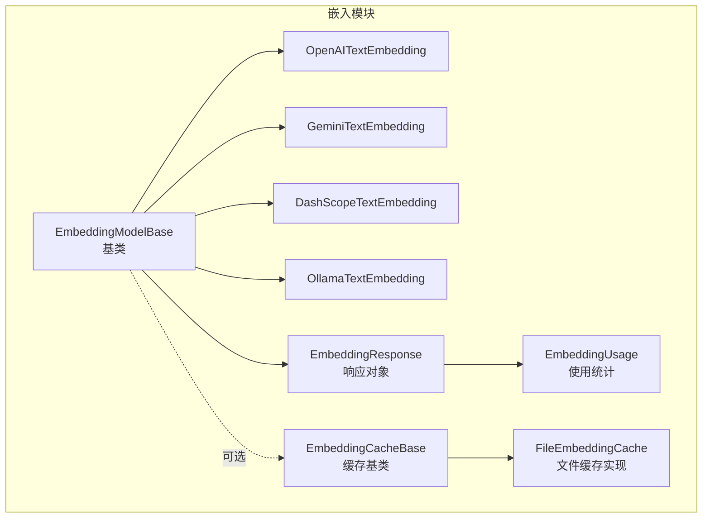
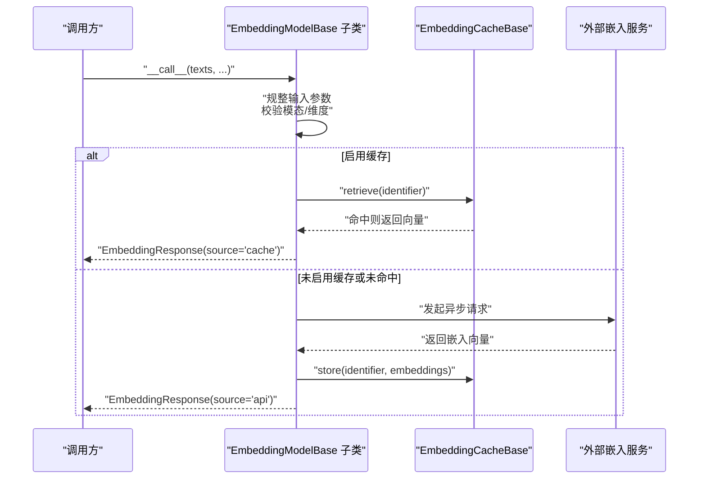
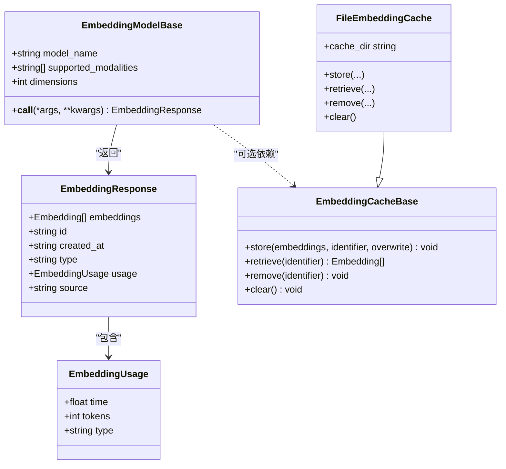
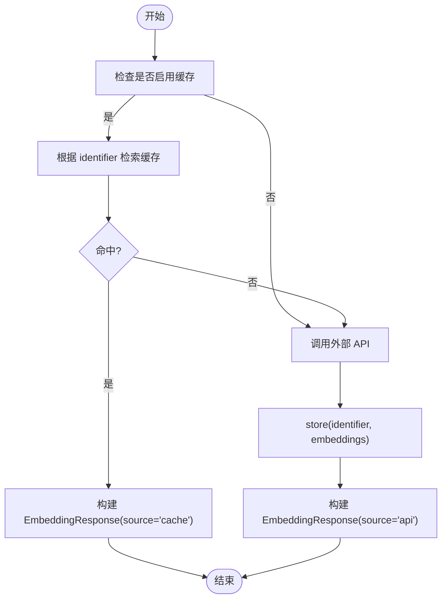
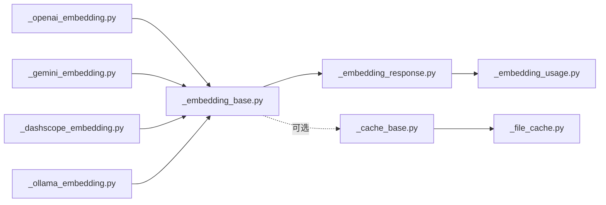

# 嵌入基类架构

<cite>
**本文引用的文件**
- [embedding/_embedding_base.py](file://src/agentscope/embedding/_embedding_base.py)
- [embedding/_embedding_response.py](file://src/agentscope/embedding/_embedding_response.py)
- [embedding/_embedding_usage.py](file://src/agentscope/embedding/_embedding_usage.py)
- [embedding/__init__.py](file://src/agentscope/embedding/__init__.py)
- [embedding/_cache_base.py](file://src/agentscope/embedding/_cache_base.py)
- [embedding/_file_cache.py](file://src/agentscope/embedding/_file_cache.py)
- [embedding/_openai_embedding.py](file://src/agentscope/embedding/_openai_embedding.py)
- [embedding/_gemini_embedding.py](file://src/agentscope/embedding/_gemini_embedding.py)
- [embedding/_dashscope_embedding.py](file://src/agentscope/embedding/_dashscope_embedding.py)
- [embedding/_ollama_embedding.py](file://src/agentscope/embedding/_ollama_embedding.py)
- [_utils/_common.py](file://src/agentscope/_utils/_common.py)
- [_utils/_mixin.py](file://src/agentscope/_utils/_mixin.py)
- [types/_object.py](file://src/agentscope/types/_object.py)
- [types/__init__.py](file://src/agentscope/types/__init__.py)
- [docs/tutorial/zh_CN/src/task_embedding.py](file://docs/tutorial/zh_CN/src/task_embedding.py)
- [tests/embedding_cache_test.py](file://tests/embedding_cache_test.py)
</cite>

## 目录
1. [引言](#引言)
2. [项目结构](#项目结构)
3. [核心组件](#核心组件)
4. [架构总览](#架构总览)
5. [详细组件分析](#详细组件分析)
6. [依赖分析](#依赖分析)
7. [性能考虑](#性能考虑)
8. [故障排查指南](#故障排查指南)
9. [结论](#结论)
10. [附录：API 参考与扩展指南](#附录api-参考与扩展指南)

## 引言
本文件系统性梳理 AgentScope 嵌入子系统的“基类架构”，重点围绕 EmbeddingModelBase 基类的设计理念与实现细节展开，覆盖模型名称管理、模态支持列表、维度配置等核心属性；深入解析异步调用接口的实现机制（参数处理、响应格式标准化、错误处理策略）；详解 EmbeddingResponse 响应对象与 EmbeddingUsage 使用统计类的数据结构与语义；并提供基类继承的最佳实践、性能优化建议与扩展指南。

## 项目结构
嵌入模块采用“基类 + 多提供商适配器 + 缓存”的分层设计：
- 基类与通用类型：EmbeddingModelBase、EmbeddingResponse、EmbeddingUsage、EmbeddingCacheBase、FileEmbeddingCache
- 具体提供商适配器：OpenAI、Gemini、DashScope、Ollama 等文本嵌入模型
- 工具与类型：DictMixin、时间戳生成、Embedding 类型别名等

图表来源
- [embedding/_embedding_base.py:8-45](file://src/agentscope/embedding/_embedding_base.py#L8-L45)
- [embedding/_embedding_response.py:12-32](file://src/agentscope/embedding/_embedding_response.py#L12-L32)
- [embedding/_embedding_usage.py:9-20](file://src/agentscope/embedding/_embedding_usage.py#L9-L20)
- [embedding/_cache_base.py:12-63](file://src/agentscope/embedding/_cache_base.py#L12-L63)
- [embedding/_file_cache.py:19-187](file://src/agentscope/embedding/_file_cache.py#L19-L187)
- [embedding/_openai_embedding.py:13-109](file://src/agentscope/embedding/_openai_embedding.py#L13-L109)
- [embedding/_gemini_embedding.py:13-109](file://src/agentscope/embedding/_gemini_embedding.py#L13-L109)
- [embedding/_dashscope_embedding.py:14-169](file://src/agentscope/embedding/_dashscope_embedding.py#L14-L169)
- [embedding/_ollama_embedding.py:13-106](file://src/agentscope/embedding/_ollama_embedding.py#L13-L106)

章节来源
- [embedding/__init__.py:4-27](file://src/agentscope/embedding/__init__.py#L4-L27)

## 核心组件
- EmbeddingModelBase：统一的异步嵌入调用入口，定义 model_name、supported_modalities、dimensions 等关键属性，并约定 __call__ 的异步签名与返回值类型（EmbeddingResponse）。
- EmbeddingResponse：标准化响应对象，包含 embeddings、id、created_at、type、usage、source 等字段。
- EmbeddingUsage：标准化使用统计，包含 time、tokens、type。
- EmbeddingCacheBase/FileEmbeddingCache：缓存抽象与文件实现，支持标识符到向量的持久化读写与容量维护。
- 具体适配器：OpenAITextEmbedding、GeminiTextEmbedding、DashScopeTextEmbedding、OllamaTextEmbedding，均继承自 EmbeddingModelBase，实现 __call__ 并返回 EmbeddingResponse。

章节来源
- [embedding/_embedding_base.py:8-45](file://src/agentscope/embedding/_embedding_base.py#L8-L45)
- [embedding/_embedding_response.py:12-32](file://src/agentscope/embedding/_embedding_response.py#L12-L32)
- [embedding/_embedding_usage.py:9-20](file://src/agentscope/embedding/_embedding_usage.py#L9-L20)
- [embedding/_cache_base.py:12-63](file://src/agentscope/embedding/_cache_base.py#L12-L63)
- [embedding/_file_cache.py:19-187](file://src/agentscope/embedding/_file_cache.py#L19-L187)

## 架构总览
下图展示嵌入调用的端到端流程：客户端调用 EmbeddingModelBase.__call__，内部进行参数规整、可选缓存命中检查、外部 API 调用、统计采集与响应封装。

图表来源
- [embedding/_openai_embedding.py:49-109](file://src/agentscope/embedding/_openai_embedding.py#L49-L109)
- [embedding/_gemini_embedding.py:50-109](file://src/agentscope/embedding/_gemini_embedding.py#L50-L109)
- [embedding/_dashscope_embedding.py:107-169](file://src/agentscope/embedding/_dashscope_embedding.py#L107-L169)
- [embedding/_ollama_embedding.py:48-106](file://src/agentscope/embedding/_ollama_embedding.py#L48-L106)
- [embedding/_cache_base.py:12-63](file://src/agentscope/embedding/_cache_base.py#L12-L63)
- [embedding/_file_cache.py:53-107](file://src/agentscope/embedding/_file_cache.py#L53-L107)

## 详细组件分析

### EmbeddingModelBase 基类
- 设计理念
  - 统一异步调用接口：通过 async def __call__ 规范化所有提供商的调用方式。
  - 配置驱动：model_name、dimensions、supported_modalities 作为运行期配置，便于在不同提供商间切换。
  - 明确职责边界：基类不直接依赖具体提供商 SDK，仅负责参数规整与响应封装。
- 关键属性
  - model_name：字符串，标识模型名称。
  - supported_modalities：字符串列表，如 ["text"] 或 ["text","image","video"]。
  - dimensions：整数，输出向量维度。
- 异步调用约定
  - 返回类型：EmbeddingResponse
  - 必须在子类中实现 __call__，否则抛出 NotImplementedError
- 参数处理与错误策略
  - 子类通常会将输入文本规整为统一格式（如字符串列表），并对非法输入抛出明确异常。
  - 对于批量输入，部分提供商存在批大小限制，需在子类中进行分批或截断处理。

图表来源
- [embedding/_embedding_base.py:8-45](file://src/agentscope/embedding/_embedding_base.py#L8-L45)
- [embedding/_embedding_response.py:12-32](file://src/agentscope/embedding/_embedding_response.py#L12-L32)
- [embedding/_embedding_usage.py:9-20](file://src/agentscope/embedding/_embedding_usage.py#L9-L20)
- [embedding/_cache_base.py:12-63](file://src/agentscope/embedding/_cache_base.py#L12-L63)
- [embedding/_file_cache.py:19-187](file://src/agentscope/embedding/_file_cache.py#L19-L187)

章节来源
- [embedding/_embedding_base.py:8-45](file://src/agentscope/embedding/_embedding_base.py#L8-L45)

### EmbeddingResponse 响应对象
- 数据结构
  - embeddings：向量数组，元素类型为 Embedding（float 数组）
  - id：响应唯一标识，通常由时间戳生成
  - created_at：响应创建时间
  - type：固定为 "embedding"
  - usage：EmbeddingUsage，可空
  - source：来源标记，"cache" 或 "api"
- 字段来源与默认值
  - id、created_at、type、source 通过工厂函数与字面量设置
  - usage 默认为空，表示未收集使用统计
- 与 DictMixin 的关系
  - 通过 DictMixin 支持属性式访问与字典序列化

章节来源
- [embedding/_embedding_response.py:12-32](file://src/agentscope/embedding/_embedding_response.py#L12-L32)
- [_utils/_mixin.py:5-10](file://src/agentscope/_utils/_mixin.py#L5-L10)
- [_utils/_common.py:106-114](file://src/agentscope/_utils/_common.py#L106-L114)
- [types/_object.py:5-5](file://src/agentscope/types/_object.py#L5-L5)
- [types/__init__.py:8-8](file://src/agentscope/types/__init__.py#L8-L8)

### EmbeddingUsage 使用统计类
- 字段语义
  - time：本次调用耗时（秒）
  - tokens：令牌用量（可能为空）
  - type：固定为 "embedding"
- 用途
  - 用于衡量调用成本与时延，便于埋点与计费统计

章节来源
- [embedding/_embedding_usage.py:9-20](file://src/agentscope/embedding/_embedding_usage.py#L9-L20)

### 缓存体系：EmbeddingCacheBase 与 FileEmbeddingCache
- 抽象接口
  - store：按标识符存储向量，支持覆盖
  - retrieve：按标识符检索向量，未命中返回 None
  - remove：移除指定标识符的缓存
  - clear：清空所有缓存
- 文件缓存实现要点
  - 以 JSON 序列化后的标识符生成 SHA-256 文件名，后缀 .npy
  - 通过 numpy 保存/加载二进制向量
  - 维护策略：按文件数量上限与缓存大小上限（MB）淘汰最旧文件
- 使用模式
  - 子类在调用前先尝试 retrieve，命中则直接返回 EmbeddingResponse（source="cache"）
  - 未命中则调用外部 API，得到向量后 store 并返回 EmbeddingResponse（source="api"）

图表来源
- [embedding/_cache_base.py:12-63](file://src/agentscope/embedding/_cache_base.py#L12-L63)
- [embedding/_file_cache.py:53-107](file://src/agentscope/embedding/_file_cache.py#L53-L107)
- [embedding/_file_cache.py:148-187](file://src/agentscope/embedding/_file_cache.py#L148-L187)

章节来源
- [embedding/_cache_base.py:12-63](file://src/agentscope/embedding/_cache_base.py#L12-L63)
- [embedding/_file_cache.py:19-187](file://src/agentscope/embedding/_file_cache.py#L19-L187)

### 具体适配器实现对比
- OpenAITextEmbedding
  - 输入规整：接受字符串或包含 "text" 键的字典
  - 统计：usage.tokens 来自 API 返回的 usage.total_tokens
  - 批量：注释提示需处理批大小与令牌限制
- GeminiTextEmbedding
  - 输入规整：同上
  - 统计：usage.tokens 为 0（本地缓存命中时）
- DashScopeTextEmbedding
  - 输入规整：同上
  - 批量：内置批大小限制与日志提示
  - 统计：usage.tokens 来自 response.usage["total_tokens"]
- OllamaTextEmbedding
  - 输入规整：同上
  - 统计：usage.tokens 为 0（本地缓存命中时）

章节来源
- [embedding/_openai_embedding.py:49-109](file://src/agentscope/embedding/_openai_embedding.py#L49-L109)
- [embedding/_gemini_embedding.py:50-109](file://src/agentscope/embedding/_gemini_embedding.py#L50-L109)
- [embedding/_dashscope_embedding.py:107-169](file://src/agentscope/embedding/_dashscope_embedding.py#L107-L169)
- [embedding/_ollama_embedding.py:48-106](file://src/agentscope/embedding/_ollama_embedding.py#L48-L106)

## 依赖分析
- 组件耦合
  - EmbeddingModelBase 与具体适配器之间为“依赖倒置”：基类不依赖具体 SDK，适配器依赖基类接口
  - EmbeddingResponse/EmbeddingUsage 与 DictMixin 解耦数据结构与序列化
  - 缓存接口与实现分离，便于替换存储介质
- 外部依赖
  - 各提供商 SDK（openai、google.genai、dashscope、ollama）
  - numpy（文件缓存）
  - 时间戳生成与随机后缀（_utils/_common.py）

图表来源
- [embedding/_openai_embedding.py:13-109](file://src/agentscope/embedding/_openai_embedding.py#L13-L109)
- [embedding/_gemini_embedding.py:13-109](file://src/agentscope/embedding/_gemini_embedding.py#L13-L109)
- [embedding/_dashscope_embedding.py:14-169](file://src/agentscope/embedding/_dashscope_embedding.py#L14-L169)
- [embedding/_ollama_embedding.py:13-106](file://src/agentscope/embedding/_ollama_embedding.py#L13-L106)
- [embedding/_embedding_base.py:8-45](file://src/agentscope/embedding/_embedding_base.py#L8-L45)
- [embedding/_embedding_response.py:12-32](file://src/agentscope/embedding/_embedding_response.py#L12-L32)
- [embedding/_embedding_usage.py:9-20](file://src/agentscope/embedding/_embedding_usage.py#L9-L20)
- [embedding/_cache_base.py:12-63](file://src/agentscope/embedding/_cache_base.py#L12-L63)
- [embedding/_file_cache.py:19-187](file://src/agentscope/embedding/_file_cache.py#L19-L187)

## 性能考虑
- 缓存优先
  - 启用 FileEmbeddingCache 并合理设置 max_file_number 与 max_cache_size，显著降低重复调用开销
  - 命中缓存时 source="cache"，usage.tokens≈0，time≈0
- 批量化与限流
  - DashScope 等提供商对批大小有限制，应在子类中进行分批或截断
  - 对 OpenAI/Gemini/Ollama，注意单次调用的令牌上限
- I/O 与序列化
  - 文件缓存使用 numpy 二进制存储，读写效率高；注意磁盘空间与淘汰策略
- 异步并发
  - 基类与适配器均为异步设计，适合高并发场景；注意外部 SDK 的并发连接池与速率限制

## 故障排查指南
- 常见问题与定位
  - __call__ 未实现：EmbeddingModelBase.__call__ 抛出 NotImplementedError，确认子类是否正确覆写
  - 输入格式错误：当输入既非字符串也非包含 "text" 键的字典时，适配器会抛出 ValueError
  - 缓存路径异常：FileEmbeddingCache 若目标路径存在但非文件，会抛出 RuntimeError
  - 缓存文件不存在：remove(identifier) 时若文件不存在，抛出 FileNotFoundError
- 排查步骤
  - 检查 model_name、dimensions 与 supported_modalities 是否匹配
  - 校验输入 texts 是否为字符串列表或包含 "text" 键的字典列表
  - 查看 EmbeddingResponse.source 与 usage.time/tokens，判断是否命中缓存与统计是否正常
  - 检查缓存目录权限与磁盘空间

章节来源
- [embedding/_embedding_base.py:42-45](file://src/agentscope/embedding/_embedding_base.py#L42-L45)
- [embedding/_openai_embedding.py:66-69](file://src/agentscope/embedding/_openai_embedding.py#L66-L69)
- [embedding/_gemini_embedding.py:69-72](file://src/agentscope/embedding/_gemini_embedding.py#L69-L72)
- [embedding/_dashscope_embedding.py:124-127](file://src/agentscope/embedding/_dashscope_embedding.py#L124-L127)
- [embedding/_ollama_embedding.py:65-68](file://src/agentscope/embedding/_ollama_embedding.py#L65-L68)
- [embedding/_file_cache.py:76-84](file://src/agentscope/embedding/_file_cache.py#L76-L84)
- [embedding/_file_cache.py:121-124](file://src/agentscope/embedding/_file_cache.py#L121-L124)

## 结论
EmbeddingModelBase 通过“配置 + 异步 + 标准化响应”的设计，为多提供商嵌入能力提供了统一抽象；配合 EmbeddingResponse/EmbeddingUsage 的规范化输出与可插拔缓存机制，既保证了易用性，又兼顾了性能与可观测性。遵循本文最佳实践，可在不改变上层调用方式的前提下快速接入新提供商或优化现有实现。

## 附录：API 参考与扩展指南

### API 参考
- EmbeddingModelBase
  - 属性
    - model_name: str
    - supported_modalities: list[str]
    - dimensions: int
  - 方法
    - __call__(*args, **kwargs) -> EmbeddingResponse
- EmbeddingResponse
  - 字段
    - embeddings: List[Embedding]
    - id: str
    - created_at: str
    - type: Literal["embedding"]
    - usage: EmbeddingUsage | None
    - source: Literal["cache","api"]
- EmbeddingUsage
  - 字段
    - time: float
    - tokens: int | None
    - type: Literal["embedding"]
- EmbeddingCacheBase
  - 方法
    - store(embeddings: List[Embedding], identifier: JSONSerializableObject, overwrite: bool = False) -> None
    - retrieve(identifier: JSONSerializableObject) -> List[Embedding] | None
    - remove(identifier: JSONSerializableObject) -> None
    - clear() -> None
- FileEmbeddingCache
  - 属性
    - cache_dir: str
  - 方法
    - store/retrieve/remove/clear（见上）

章节来源
- [embedding/_embedding_base.py:8-45](file://src/agentscope/embedding/_embedding_base.py#L8-L45)
- [embedding/_embedding_response.py:12-32](file://src/agentscope/embedding/_embedding_response.py#L12-L32)
- [embedding/_embedding_usage.py:9-20](file://src/agentscope/embedding/_embedding_usage.py#L9-L20)
- [embedding/_cache_base.py:12-63](file://src/agentscope/embedding/_cache_base.py#L12-L63)
- [embedding/_file_cache.py:19-187](file://src/agentscope/embedding/_file_cache.py#L19-L187)

### 扩展指南：如何新增一个嵌入提供商
- 步骤
  - 新建类继承 EmbeddingModelBase，声明 supported_modalities 与默认 dimensions
  - 实现 __call__：参数规整、可选缓存命中、调用外部 SDK、统计采集、封装 EmbeddingResponse
  - 如需缓存，将 EmbeddingCacheBase 实例注入构造函数并在 __call__ 中使用
- 最佳实践
  - 输入规整：统一接受字符串列表或包含 "text" 键的字典列表
  - 错误处理：对非法输入抛出明确异常；对外部调用失败记录日志并抛出可诊断异常
  - 统计采集：尽量从 SDK 返回值中提取 tokens；time 建议以调用前后时间差为准
  - 缓存策略：identifier 选择稳定且可 JSON 序列化的键集合，避免敏感信息
  - 性能优化：结合批大小限制与并发控制，必要时进行分批重试

章节来源
- [embedding/_embedding_base.py:8-45](file://src/agentscope/embedding/_embedding_base.py#L8-L45)
- [embedding/_cache_base.py:12-63](file://src/agentscope/embedding/_cache_base.py#L12-L63)
- [embedding/_file_cache.py:19-187](file://src/agentscope/embedding/_file_cache.py#L19-L187)
- [docs/tutorial/zh_CN/src/task_embedding.py:32-132](file://docs/tutorial/zh_CN/src/task_embedding.py#L32-L132)
- [tests/embedding_cache_test.py:13-168](file://tests/embedding_cache_test.py#L13-L168)