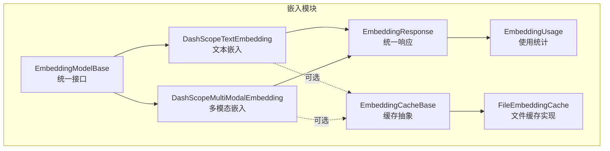
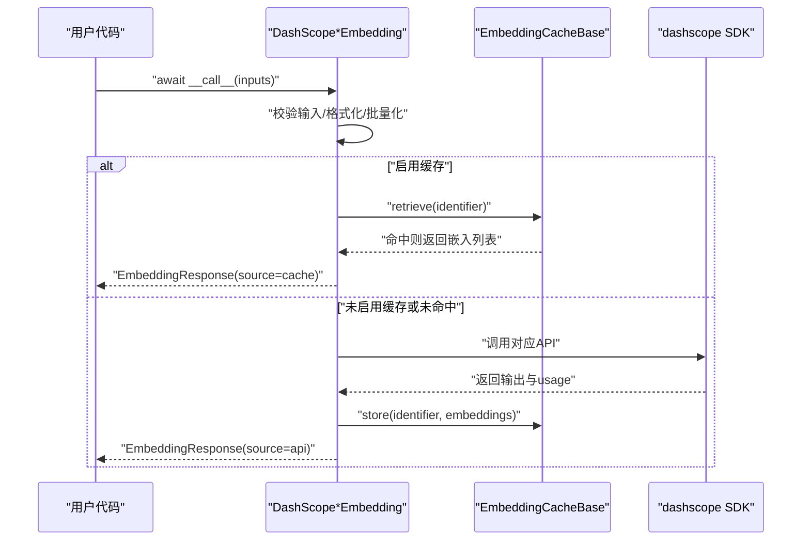
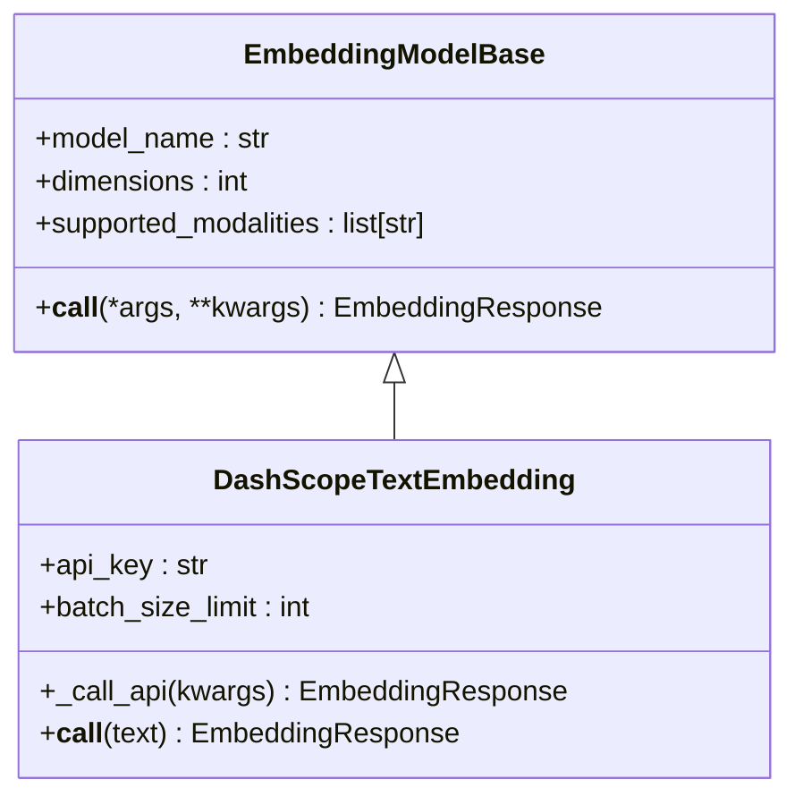
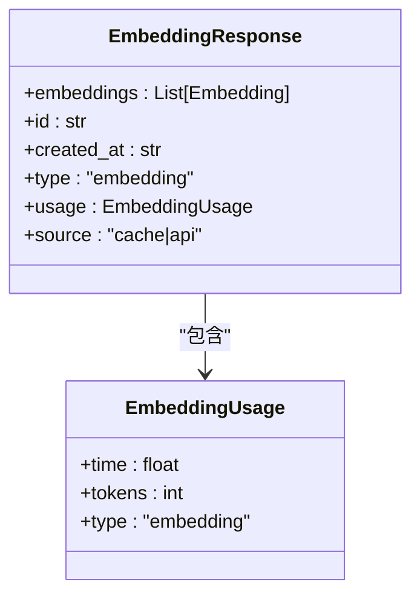
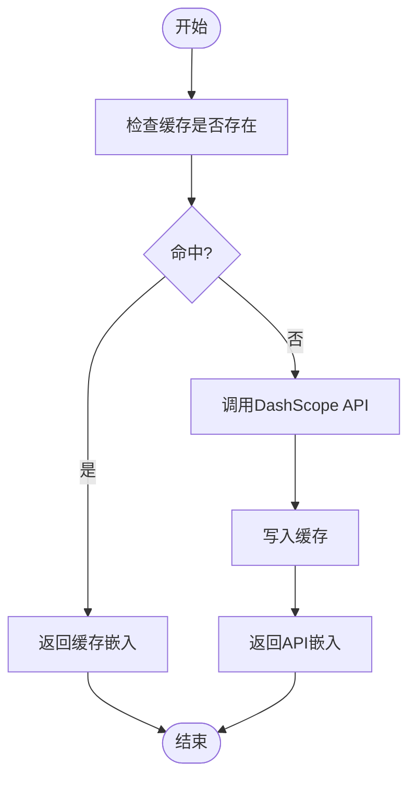
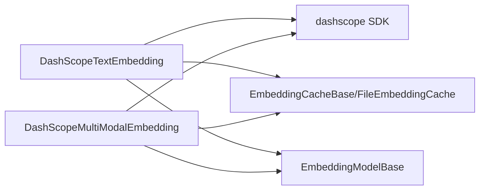

# DashScope嵌入适配器

<cite>
**本文引用的文件**
- [src/agentscope/embedding/_dashscope_embedding.py](file://src/agentscope/embedding/_dashscope_embedding.py)
- [src/agentscope/embedding/_dashscope_multimodal_embedding.py](file://src/agentscope/embedding/_dashscope_multimodal_embedding.py)
- [src/agentscope/embedding/_embedding_base.py](file://src/agentscope/embedding/_embedding_base.py)
- [src/agentscope/embedding/_embedding_response.py](file://src/agentscope/embedding/_embedding_response.py)
- [src/agentscope/embedding/_embedding_usage.py](file://src/agentscope/embedding/_embedding_usage.py)
- [src/agentscope/embedding/__init__.py](file://src/agentscope/embedding/__init__.py)
- [src/agentscope/embedding/_cache_base.py](file://src/agentscope/embedding/_cache_base.py)
- [src/agentscope/embedding/_file_cache.py](file://src/agentscope/embedding/_file_cache.py)
- [src/agentscope/message/_message_base.py](file://src/agentscope/message/_message_base.py)
- [docs/tutorial/zh_CN/src/task_embedding.py](file://docs/tutorial/zh_CN/src/task_embedding.py)
- [tests/embedding_cache_test.py](file://tests/embedding_cache_test.py)
</cite>

## 目录
1. [简介](#简介)
2. [项目结构](#项目结构)
3. [核心组件](#核心组件)
4. [架构总览](#架构总览)
5. [详细组件分析](#详细组件分析)
6. [依赖分析](#依赖分析)
7. [性能考虑](#性能考虑)
8. [故障排除指南](#故障排除指南)
9. [结论](#结论)
10. [附录](#附录)

## 简介
本技术文档面向DashScope嵌入适配器，系统性解析阿里云DashScope多模态嵌入模型在AgentScope中的实现与使用。重点涵盖：
- 文本嵌入与多模态嵌入的差异与适用场景
- DashScope API的认证机制、请求格式与响应处理
- 多模态支持的实现原理（文本、图像、视频）
- 集成示例（API密钥配置、模型选择、批量处理）
- 性能对比分析、使用场景建议、配置参数说明与故障排除

## 项目结构
DashScope嵌入适配器位于embedding子模块，采用“多类模型 + 统一响应 + 缓存”分层设计：
- 文本嵌入：DashScopeTextEmbedding
- 多模态嵌入：DashScopeMultiModalEmbedding
- 基类与统一响应：EmbeddingModelBase、EmbeddingResponse、EmbeddingUsage
- 缓存体系：EmbeddingCacheBase、FileEmbeddingCache
- 消息内容块：TextBlock、ImageBlock、VideoBlock（用于多模态输入）



图表来源
- [src/agentscope/embedding/_embedding_base.py:8-46](file://src/agentscope/embedding/_embedding_base.py#L8-L46)
- [src/agentscope/embedding/_embedding_response.py:12-33](file://src/agentscope/embedding/_embedding_response.py#L12-L33)
- [src/agentscope/embedding/_embedding_usage.py:9-21](file://src/agentscope/embedding/_embedding_usage.py#L9-L21)
- [src/agentscope/embedding/_cache_base.py:12-64](file://src/agentscope/embedding/_cache_base.py#L12-L64)
- [src/agentscope/embedding/_file_cache.py:19-188](file://src/agentscope/embedding/_file_cache.py#L19-L188)
- [src/agentscope/embedding/_dashscope_embedding.py:14-170](file://src/agentscope/embedding/_dashscope_embedding.py#L14-L170)
- [src/agentscope/embedding/_dashscope_multimodal_embedding.py:17-245](file://src/agentscope/embedding/_dashscope_multimodal_embedding.py#L17-L245)

章节来源
- [src/agentscope/embedding/__init__.py:1-28](file://src/agentscope/embedding/__init__.py#L1-L28)

## 核心组件
- EmbeddingModelBase：定义模型名称、维度、支持模态与统一异步调用接口
- DashScopeTextEmbedding：DashScope文本嵌入实现，支持批量与缓存
- DashScopeMultiModalEmbedding：DashScope多模态嵌入实现，支持文本/图像/视频
- EmbeddingResponse：封装嵌入结果、时间戳、类型与使用统计
- EmbeddingUsage：封装耗时与token用量
- EmbeddingCacheBase/FileEmbeddingCache：抽象与文件缓存实现，按请求标识哈希落盘

章节来源
- [src/agentscope/embedding/_embedding_base.py:8-46](file://src/agentscope/embedding/_embedding_base.py#L8-L46)
- [src/agentscope/embedding/_dashscope_embedding.py:14-170](file://src/agentscope/embedding/_dashscope_embedding.py#L14-L170)
- [src/agentscope/embedding/_dashscope_multimodal_embedding.py:17-245](file://src/agentscope/embedding/_dashscope_multimodal_embedding.py#L17-L245)
- [src/agentscope/embedding/_embedding_response.py:12-33](file://src/agentscope/embedding/_embedding_response.py#L12-L33)
- [src/agentscope/embedding/_embedding_usage.py:9-21](file://src/agentscope/embedding/_embedding_usage.py#L9-L21)
- [src/agentscope/embedding/_cache_base.py:12-64](file://src/agentscope/embedding/_cache_base.py#L12-L64)
- [src/agentscope/embedding/_file_cache.py:19-188](file://src/agentscope/embedding/_file_cache.py#L19-L188)

## 架构总览
DashScope嵌入适配器遵循“统一接口 + 多实现 + 可插拔缓存”的架构。调用链路如下：
- 用户代码构建模型实例（可选带缓存）
- 调用模型对象（异步），内部进行输入校验、批量化与缓存查询
- 若命中缓存则直接返回；否则调用dashscope SDK对应API
- 解析响应，封装为EmbeddingResponse并返回



图表来源
- [src/agentscope/embedding/_dashscope_embedding.py:60-105](file://src/agentscope/embedding/_dashscope_embedding.py#L60-L105)
- [src/agentscope/embedding/_dashscope_multimodal_embedding.py:198-244](file://src/agentscope/embedding/_dashscope_multimodal_embedding.py#L198-L244)
- [src/agentscope/embedding/_cache_base.py:16-47](file://src/agentscope/embedding/_cache_base.py#L16-L47)
- [src/agentscope/embedding/_file_cache.py:53-107](file://src/agentscope/embedding/_file_cache.py#L53-L107)

## 详细组件分析

### 文本嵌入：DashScopeTextEmbedding
- 支持模态：仅文本
- 批大小限制：默认10（受具体模型版本影响）
- 关键行为：
  - 输入归一化：接受字符串或TextBlock字典，提取text字段
  - 批量化：超过批大小时自动拆分多次调用
  - 缓存：命中则直接返回，未命中则调用SDK并写入缓存
  - 错误处理：非200状态抛出异常
  - 返回：EmbeddingResponse，包含嵌入向量、usage（tokens、time）与source



图表来源
- [src/agentscope/embedding/_embedding_base.py:8-46](file://src/agentscope/embedding/_embedding_base.py#L8-L46)
- [src/agentscope/embedding/_dashscope_embedding.py:14-170](file://src/agentscope/embedding/_dashscope_embedding.py#L14-L170)

章节来源
- [src/agentscope/embedding/_dashscope_embedding.py:14-170](file://src/agentscope/embedding/_dashscope_embedding.py#L14-L170)

### 多模态嵌入：DashScopeMultiModalEmbedding
- 支持模态：文本、图像、视频
- 模型差异化：
  - 多模态v系列：默认维度1024（若显式指定需为1024）
  - 视觉增强系列（如tongyi-embedding-vision-plus）：默认维度1152，批大小8
  - 视觉闪速系列（如tongyi-embedding-vision-flash）：默认维度768，批大小8
- 输入格式：
  - 文本：{"text": "..."}
  - 图像：支持URL或base64（含媒体类型前缀）
  - 视频：仅支持URL
- 批量化：按模型批大小逐批调用
- 缓存与返回：同文本嵌入

```mermaid
classDiagram
class DashScopeMultiModalEmbedding {
+api_key : str
+batch_size_limit : int
+__call__(inputs) EmbeddingResponse
+_call_api(kwargs) EmbeddingResponse
}
class ImageBlock {
+type : "image"
+source : {"type","url"|{"type","media_type","data"}}
}
class VideoBlock {
+type : "video"
+source : {"type" : "url","url" : "..."}
}
class TextBlock {
+type : "text"
+text : str
}
EmbeddingModelBase <|-- DashScopeMultiModalEmbedding
DashScopeMultiModalEmbedding --> ImageBlock : "使用"
DashScopeMultiModalEmbedding --> VideoBlock : "使用"
DashScopeMultiModalEmbedding --> TextBlock : "使用"
```

图表来源
- [src/agentscope/embedding/_dashscope_multimodal_embedding.py:17-245](file://src/agentscope/embedding/_dashscope_multimodal_embedding.py#L17-L245)
- [src/agentscope/message/_message_base.py:1-242](file://src/agentscope/message/_message_base.py#L1-L242)

章节来源
- [src/agentscope/embedding/_dashscope_multimodal_embedding.py:17-245](file://src/agentscope/embedding/_dashscope_multimodal_embedding.py#L17-L245)

### 统一响应与使用统计
- EmbeddingResponse：包含嵌入向量列表、唯一id、创建时间、类型、usage与数据来源（cache/api）
- EmbeddingUsage：包含耗时（秒）、token用量（可能为空）、类型



图表来源
- [src/agentscope/embedding/_embedding_response.py:12-33](file://src/agentscope/embedding/_embedding_response.py#L12-L33)
- [src/agentscope/embedding/_embedding_usage.py:9-21](file://src/agentscope/embedding/_embedding_usage.py#L9-L21)

章节来源
- [src/agentscope/embedding/_embedding_response.py:12-33](file://src/agentscope/embedding/_embedding_response.py#L12-L33)
- [src/agentscope/embedding/_embedding_usage.py:9-21](file://src/agentscope/embedding/_embedding_usage.py#L9-L21)

### 缓存机制
- 抽象：EmbeddingCacheBase定义store/retrieve/remove/clear四类方法
- 文件缓存：FileEmbeddingCache以JSON序列化identifier生成SHA256文件名，二进制保存向量数组
- 自动维护：可限制最大文件数与缓存目录大小，超出时按创建时间淘汰旧文件
- 与模型集成：模型在调用前先检索缓存，命中则直接返回；未命中则调用API并将结果写入缓存



图表来源
- [src/agentscope/embedding/_cache_base.py:12-64](file://src/agentscope/embedding/_cache_base.py#L12-L64)
- [src/agentscope/embedding/_file_cache.py:53-188](file://src/agentscope/embedding/_file_cache.py#L53-L188)
- [src/agentscope/embedding/_dashscope_embedding.py:60-105](file://src/agentscope/embedding/_dashscope_embedding.py#L60-L105)
- [src/agentscope/embedding/_dashscope_multimodal_embedding.py:198-244](file://src/agentscope/embedding/_dashscope_multimodal_embedding.py#L198-L244)

章节来源
- [src/agentscope/embedding/_cache_base.py:12-64](file://src/agentscope/embedding/_cache_base.py#L12-L64)
- [src/agentscope/embedding/_file_cache.py:19-188](file://src/agentscope/embedding/_file_cache.py#L19-L188)
- [tests/embedding_cache_test.py:13-169](file://tests/embedding_cache_test.py#L13-L169)

## 依赖分析
- 组件耦合
  - 模型类均继承EmbeddingModelBase，保证统一接口
  - 模型类依赖dashscope SDK（文本与多模态分别调用不同API）
  - 可选依赖EmbeddingCacheBase，实现缓存透明化
- 外部依赖
  - dashscope SDK：负责实际HTTP调用与响应解析
  - numpy：文件缓存中向量数组的二进制存储
- 潜在循环依赖
  - 无直接循环导入；消息块类型在多模态输入中被引用，但不反向依赖模型



图表来源
- [src/agentscope/embedding/_dashscope_embedding.py:77-83](file://src/agentscope/embedding/_dashscope_embedding.py#L77-L83)
- [src/agentscope/embedding/_dashscope_multimodal_embedding.py:217-222](file://src/agentscope/embedding/_dashscope_multimodal_embedding.py#L217-L222)
- [src/agentscope/embedding/_cache_base.py:12-64](file://src/agentscope/embedding/_cache_base.py#L12-L64)
- [src/agentscope/embedding/_file_cache.py:19-188](file://src/agentscope/embedding/_file_cache.py#L19-L188)
- [src/agentscope/embedding/_embedding_base.py:8-46](file://src/agentscope/embedding/_embedding_base.py#L8-L46)

## 性能考虑
- 批量化策略
  - 文本嵌入默认批大小10；多模态根据模型类型调整（如视觉增强/闪速系列为8）
  - 当输入数量超过批大小时，自动拆分为多次API调用，累计耗时与token用量
- 缓存收益
  - 相同输入重复调用可显著降低延迟与token消耗
  - FileEmbeddingCache支持文件数量与目录大小上限，避免磁盘膨胀
- 时间与token统计
  - EmbeddingUsage记录单次调用耗时与token用量，便于成本与性能分析
- 模型维度与批大小
  - 不同模型默认维度不同，需与模型文档保持一致，避免运行期错误
  - 批大小直接影响吞吐与并发，应结合业务QPS与资源约束选择

章节来源
- [src/agentscope/embedding/_dashscope_embedding.py:58-137](file://src/agentscope/embedding/_dashscope_embedding.py#L58-L137)
- [src/agentscope/embedding/_dashscope_multimodal_embedding.py:52-86](file://src/agentscope/embedding/_dashscope_multimodal_embedding.py#L52-L86)
- [src/agentscope/embedding/_embedding_usage.py:9-21](file://src/agentscope/embedding/_embedding_usage.py#L9-L21)
- [src/agentscope/embedding/_file_cache.py:148-188](file://src/agentscope/embedding/_file_cache.py#L148-L188)

## 故障排除指南
- 认证失败
  - 现象：API返回非200状态
  - 排查：确认DASHSCOPE_API_KEY环境变量正确设置；检查网络连通性
  - 参考：文本与多模态嵌入在调用后均对status_code进行校验
- 输入格式错误
  - 现象：抛出ValueError，提示输入类型或字段缺失
  - 排查：确保文本输入为字符串或包含"text"字段的字典；图像输入为URL或base64（含媒体类型）；视频输入必须为URL
  - 参考：多模态输入校验逻辑与断言
- 维度不匹配
  - 现象：抛出ValueError，提示特定模型维度必须为固定值
  - 排查：视觉增强/闪速系列模型有固定维度要求，不可随意修改
  - 参考：多模态初始化时的维度校验
- 缓存问题
  - 现象：缓存文件不存在或无法加载
  - 排查：确认缓存目录存在且可写；检查identifier是否可JSON序列化；必要时清理缓存
  - 参考：文件缓存的存储/读取/删除与维护逻辑
- 性能瓶颈
  - 现象：批量调用耗时过长
  - 排查：适当增大批大小（受模型限制）；开启缓存；评估并发与资源配额

章节来源
- [src/agentscope/embedding/_dashscope_embedding.py:86-89](file://src/agentscope/embedding/_dashscope_embedding.py#L86-L89)
- [src/agentscope/embedding/_dashscope_multimodal_embedding.py:122-166](file://src/agentscope/embedding/_dashscope_multimodal_embedding.py#L122-L166)
- [src/agentscope/embedding/_dashscope_multimodal_embedding.py:56-63](file://src/agentscope/embedding/_dashscope_multimodal_embedding.py#L56-L63)
- [src/agentscope/embedding/_dashscope_multimodal_embedding.py:66-73](file://src/agentscope/embedding/_dashscope_multimodal_embedding.py#L66-L73)
- [src/agentscope/embedding/_file_cache.py:76-87](file://src/agentscope/embedding/_file_cache.py#L76-L87)
- [src/agentscope/embedding/_file_cache.py:109-124](file://src/agentscope/embedding/_file_cache.py#L109-L124)
- [src/agentscope/embedding/_file_cache.py:148-188](file://src/agentscope/embedding/_file_cache.py#L148-L188)

## 结论
DashScope嵌入适配器通过统一接口与可插拔缓存，为AgentScope提供了稳定高效的文本与多模态嵌入能力。文本嵌入适合纯文本场景，多模态嵌入则覆盖文本、图像与视频，满足更丰富的RAG与检索需求。结合批量化与缓存策略，可在成本与性能之间取得良好平衡。

## 附录

### API与请求/响应要点
- 认证机制
  - 通过api_key参数传递至SDK调用
- 请求格式
  - 文本：{"input":[...],"model": "...","dimension": ...}
  - 多模态：{"input":[{"text/image/video": "..."}],"model": "..."}
- 响应处理
  - 成功：解析output.embeddings为向量列表，usage包含tokens/time
  - 失败：抛出异常，包含原始响应信息

章节来源
- [src/agentscope/embedding/_dashscope_embedding.py:80-105](file://src/agentscope/embedding/_dashscope_embedding.py#L80-L105)
- [src/agentscope/embedding/_dashscope_multimodal_embedding.py:222-244](file://src/agentscope/embedding/_dashscope_multimodal_embedding.py#L222-L244)

### 集成示例（步骤说明）
- 环境准备
  - 设置DASHSCOPE_API_KEY环境变量
- 文本嵌入
  - 构造DashScopeTextEmbedding，传入model_name与api_key
  - 调用await model([texts])，获取EmbeddingResponse
- 多模态嵌入
  - 构造DashScopeMultiModalEmbedding，传入model_name与api_key
  - 准备TextBlock/ImageBlock/VideoBlock列表，调用await model(inputs)
- 缓存启用
  - 传入FileEmbeddingCache实例，自动命中缓存并减少API调用

章节来源
- [docs/tutorial/zh_CN/src/task_embedding.py:42-133](file://docs/tutorial/zh_CN/src/task_embedding.py#L42-L133)
- [src/agentscope/embedding/_dashscope_embedding.py:107-170](file://src/agentscope/embedding/_dashscope_embedding.py#L107-L170)
- [src/agentscope/embedding/_dashscope_multimodal_embedding.py:91-196](file://src/agentscope/embedding/_dashscope_multimodal_embedding.py#L91-L196)