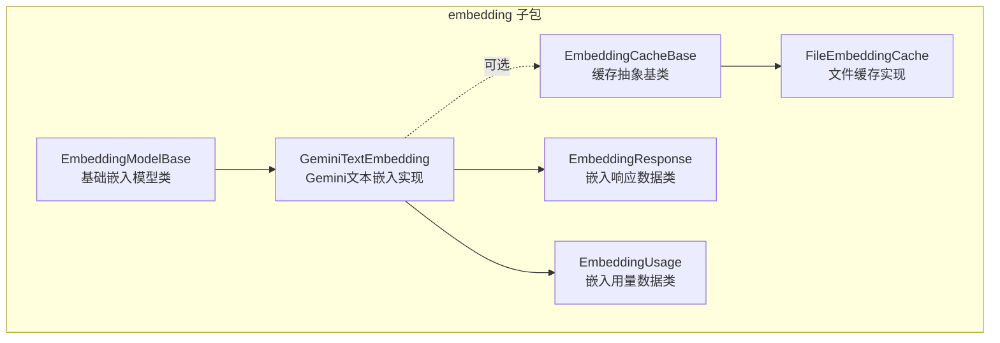
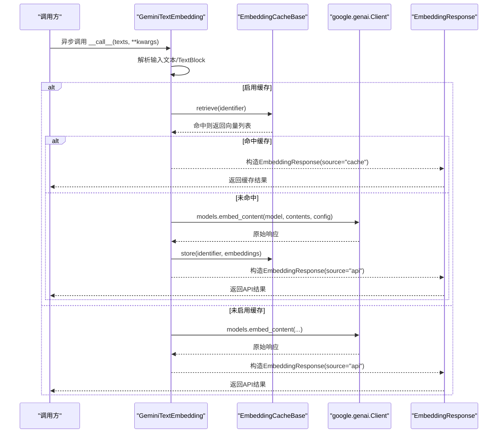
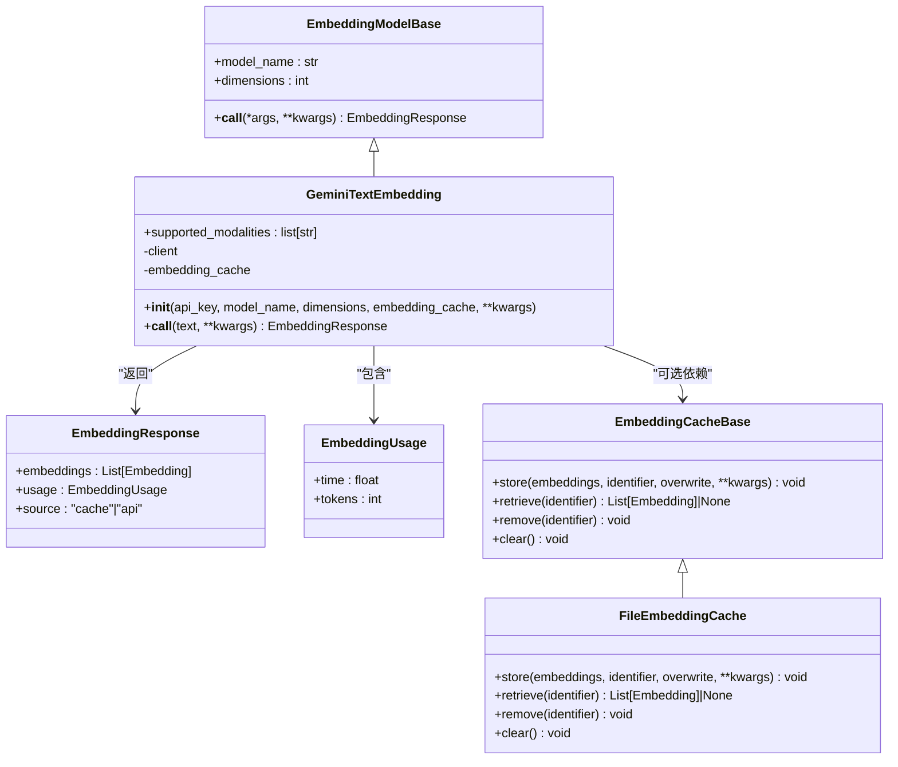
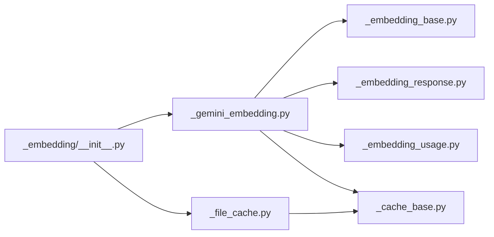

# Gemini嵌入适配器

<cite>
**本文引用的文件**
- [src/agentscope/embedding/_gemini_embedding.py](file://src/agentscope/embedding/_gemini_embedding.py)
- [src/agentscope/embedding/_embedding_base.py](file://src/agentscope/embedding/_embedding_base.py)
- [src/agentscope/embedding/_embedding_response.py](file://src/agentscope/embedding/_embedding_response.py)
- [src/agentscope/embedding/_embedding_usage.py](file://src/agentscope/embedding/_embedding_usage.py)
- [src/agentscope/embedding/_cache_base.py](file://src/agentscope/embedding/_cache_base.py)
- [src/agentscope/embedding/_file_cache.py](file://src/agentscope/embedding/_file_cache.py)
- [src/agentscope/embedding/__init__.py](file://src/agentscope/embedding/__init__.py)
- [src/agentscope/message/__init__.py](file://src/agentscope/message/__init__.py)
- [src/agentscope/types/__init__.py](file://src/agentscope/types/__init__.py)
- [docs/tutorials/zh_CN/src/task_embedding.py](file://docs/tutorials/zh_CN/src/task_embedding.py)
- [tests/tracing_extractor_test.py](file://tests/tracing_extractor_test.py)
</cite>

## 目录
1. [简介](#简介)
2. [项目结构](#项目结构)
3. [核心组件](#核心组件)
4. [架构概览](#架构概览)
5. [详细组件分析](#详细组件分析)
6. [依赖分析](#依赖分析)
7. [性能考虑](#性能考虑)
8. [故障排查指南](#故障排查指南)
9. [结论](#结论)
10. [附录](#附录)

## 简介
本技术文档面向Gemini嵌入适配器，系统性阐述其在AgentScope中的实现与使用方法。内容涵盖：
- Google AI Studio API的集成方式与认证机制
- 请求处理流程与异步调用实现
- 嵌入特性（模型类型、维度配置、批量处理）
- 错误处理与重试策略现状与建议
- 使用示例（API密钥配置、模型初始化、嵌入向量生成）
- 性能优化建议、使用限制说明、最佳实践与常见问题

## 项目结构
与Gemini嵌入适配器直接相关的模块位于embedding子包，核心文件包括：
- 基类与响应封装：EmbeddingModelBase、EmbeddingResponse、EmbeddingUsage
- 缓存抽象与文件缓存：EmbeddingCacheBase、FileEmbeddingCache
- 具体实现：GeminiTextEmbedding
- 导出入口：embedding/__init__.py

图表来源
- [src/agentscope/embedding/_embedding_base.py:8-46](file://src/agentscope/embedding/_embedding_base.py#L8-L46)
- [src/agentscope/embedding/_embedding_response.py:12-33](file://src/agentscope/embedding/_embedding_response.py#L12-L33)
- [src/agentscope/embedding/_embedding_usage.py:9-21](file://src/agentscope/embedding/_embedding_usage.py#L9-L21)
- [src/agentscope/embedding/_cache_base.py:12-64](file://src/agentscope/embedding/_cache_base.py#L12-L64)
- [src/agentscope/embedding/_file_cache.py:19-188](file://src/agentscope/embedding/_file_cache.py#L19-L188)
- [src/agentscope/embedding/_gemini_embedding.py:13-110](file://src/agentscope/embedding/_gemini_embedding.py#L13-L110)

章节来源
- [src/agentscope/embedding/__init__.py:1-28](file://src/agentscope/embedding/__init__.py#L1-L28)

## 核心组件
- EmbeddingModelBase：定义嵌入模型的统一接口，包含模型名、维度等属性，以及异步调用协议。
- EmbeddingResponse：封装嵌入结果、时间戳、类型标识、用量信息与来源标记。
- EmbeddingUsage：记录单次调用耗时与token用量（若可用）。
- EmbeddingCacheBase/FileEmbeddingCache：抽象与文件实现的缓存机制，支持基于标识符检索/存储/清理。
- GeminiTextEmbedding：基于google-genai客户端的Gemini文本嵌入实现，支持维度配置与可选缓存。

章节来源
- [src/agentscope/embedding/_embedding_base.py:8-46](file://src/agentscope/embedding/_embedding_base.py#L8-L46)
- [src/agentscope/embedding/_embedding_response.py:12-33](file://src/agentscope/embedding/_embedding_response.py#L12-L33)
- [src/agentscope/embedding/_embedding_usage.py:9-21](file://src/agentscope/embedding/_embedding_usage.py#L9-L21)
- [src/agentscope/embedding/_cache_base.py:12-64](file://src/agentscope/embedding/_cache_base.py#L12-L64)
- [src/agentscope/embedding/_file_cache.py:19-188](file://src/agentscope/embedding/_file_cache.py#L19-L188)
- [src/agentscope/embedding/_gemini_embedding.py:13-110](file://src/agentscope/embedding/_gemini_embedding.py#L13-L110)

## 架构概览
Gemini嵌入适配器遵循“模型基类 + 具体实现 + 响应封装 + 可选缓存”的分层设计。调用流程如下：

图表来源
- [src/agentscope/embedding/_gemini_embedding.py:50-110](file://src/agentscope/embedding/_gemini_embedding.py#L50-L110)
- [src/agentscope/embedding/_cache_base.py:16-64](file://src/agentscope/embedding/_cache_base.py#L16-L64)
- [src/agentscope/embedding/_embedding_response.py:12-33](file://src/agentscope/embedding/_embedding_response.py#L12-L33)

## 详细组件分析

### GeminiTextEmbedding 组件
- 角色定位：Gemini文本嵌入的具体实现，仅支持文本输入。
- 关键属性与参数
  - api_key：Gemini API密钥
  - model_name：嵌入模型名称
  - dimensions：嵌入向量维度，默认值与官方文档对齐
  - embedding_cache：可选缓存实例
- 输入处理
  - 接受字符串列表或包含"text"键的字典列表（兼容TextBlock）
  - 非法输入将抛出异常
- 请求构建
  - 将model、contents、config打包传递给genai.Client.embed_content
- 缓存策略
  - 若启用缓存：先检索，命中则直接返回；未命中则调用API并将结果写入缓存
  - 未启用缓存：直接调用API
- 输出封装
  - 使用EmbeddingResponse封装向量、时间、来源等信息

图表来源
- [src/agentscope/embedding/_gemini_embedding.py:13-110](file://src/agentscope/embedding/_gemini_embedding.py#L13-L110)
- [src/agentscope/embedding/_embedding_base.py:8-46](file://src/agentscope/embedding/_embedding_base.py#L8-L46)
- [src/agentscope/embedding/_embedding_response.py:12-33](file://src/agentscope/embedding/_embedding_response.py#L12-L33)
- [src/agentscope/embedding/_embedding_usage.py:9-21](file://src/agentscope/embedding/_embedding_usage.py#L9-L21)
- [src/agentscope/embedding/_cache_base.py:12-64](file://src/agentscope/embedding/_cache_base.py#L12-L64)
- [src/agentscope/embedding/_file_cache.py:19-188](file://src/agentscope/embedding/_file_cache.py#L19-L188)

章节来源
- [src/agentscope/embedding/_gemini_embedding.py:13-110](file://src/agentscope/embedding/_gemini_embedding.py#L13-L110)

### 缓存机制与文件存储
- 抽象接口：EmbeddingCacheBase定义了store/retrieve/remove/clear四个异步方法
- 文件缓存：FileEmbeddingCache基于文件系统与numpy数组存储向量，支持基于identifier的哈希命名与容量维护
- 使用建议：结合max_file_number与max_cache_size控制缓存规模，避免磁盘膨胀

章节来源
- [src/agentscope/embedding/_cache_base.py:12-64](file://src/agentscope/embedding/_cache_base.py#L12-L64)
- [src/agentscope/embedding/_file_cache.py:19-188](file://src/agentscope/embedding/_file_cache.py#L19-L188)

### 响应与用量封装
- EmbeddingResponse：统一输出结构，包含embeddings、id、created_at、type、usage、source
- EmbeddingUsage：记录time与tokens（若可用），便于性能监控与成本统计

章节来源
- [src/agentscope/embedding/_embedding_response.py:12-33](file://src/agentscope/embedding/_embedding_response.py#L12-L33)
- [src/agentscope/embedding/_embedding_usage.py:9-21](file://src/agentscope/embedding/_embedding_usage.py#L9-L21)

## 依赖分析
- 外部依赖：google.genai.Client（通过genai库访问Google AI Studio API）
- 内部依赖：消息与类型模块（TextBlock、Embedding等）用于输入解析与类型约束
- 模块导出：embedding/__init__.py集中导出各类嵌入模型与缓存工具

图表来源
- [src/agentscope/embedding/_gemini_embedding.py:1-110](file://src/agentscope/embedding/_gemini_embedding.py#L1-L110)
- [src/agentscope/embedding/_embedding_base.py:1-46](file://src/agentscope/embedding/_embedding_base.py#L1-L46)
- [src/agentscope/embedding/_embedding_response.py:1-33](file://src/agentscope/embedding/_embedding_response.py#L1-L33)
- [src/agentscope/embedding/_embedding_usage.py:1-21](file://src/agentscope/embedding/_embedding_usage.py#L1-L21)
- [src/agentscope/embedding/_cache_base.py:1-64](file://src/agentscope/embedding/_cache_base.py#L1-L64)
- [src/agentscope/embedding/_file_cache.py:1-188](file://src/agentscope/embedding/_file_cache.py#L1-L188)
- [src/agentscope/embedding/__init__.py:1-28](file://src/agentscope/embedding/__init__.py#L1-L28)

章节来源
- [src/agentscope/embedding/__init__.py:1-28](file://src/agentscope/embedding/__init__.py#L1-L28)

## 性能考虑
- 异步调用：模型以async def __call__实现，适合高并发场景
- 缓存命中：启用FileEmbeddingCache可显著降低重复请求与延迟
- 批量处理：当前实现未显式拆分批次，存在批量上限风险（见源码注释）
- 计时与用量：EmbeddingUsage记录耗时，可用于性能评估；token用量在某些后端可能不可用
- 磁盘管理：合理设置max_file_number与max_cache_size，避免缓存膨胀

## 故障排查指南
- 输入格式错误
  - 现象：抛出异常，提示输入必须为字符串或包含"text"键的字典
  - 处理：确保传入List[str | TextBlock]，且TextBlock为dict且包含"text"键
- 缓存读取/写入失败
  - 现象：缓存文件不存在或非文件路径
  - 处理：检查cache_dir权限与路径有效性；必要时清理缓存后重试
- API调用异常
  - 现象：网络或鉴权问题导致调用失败
  - 处理：确认api_key有效、网络连通、模型名称正确；在上层增加重试逻辑
- 批量上限
  - 现象：大批量文本触发服务端限制
  - 处理：在调用前进行分批切分（当前实现未内置分批逻辑）

章节来源
- [src/agentscope/embedding/_gemini_embedding.py:60-72](file://src/agentscope/embedding/_gemini_embedding.py#L60-L72)
- [src/agentscope/embedding/_file_cache.py:76-87](file://src/agentscope/embedding/_file_cache.py#L76-L87)

## 结论
Gemini嵌入适配器以简洁的异步接口与可选缓存机制，为AgentScope提供了稳定高效的文本嵌入能力。通过合理的维度配置、缓存策略与批量处理规划，可在保证性能的同时满足多样化的应用场景需求。

## 附录

### 使用示例（基于现有教程与实现）
- API密钥配置
  - 通过构造函数传入api_key；确保环境变量或配置文件安全存放
- 模型初始化
  - 指定model_name与dimensions；可选传入embedding_cache实例
- 嵌入向量生成
  - 调用异步__call__方法，传入文本列表；根据返回的EmbeddingResponse获取向量与用量信息
- 缓存使用
  - 传入FileEmbeddingCache实例，首次调用写入缓存，后续命中可显著提速

章节来源
- [docs/tutorials/zh_CN/src/task_embedding.py:83-132](file://docs/tutorials/zh_CN/src/task_embedding.py#L83-L132)
- [src/agentscope/embedding/_gemini_embedding.py:19-110](file://src/agentscope/embedding/_gemini_embedding.py#L19-L110)

### 与追踪/可观测性的集成
- 响应中包含类型标识与来源标记，便于在追踪系统中标注“embeddings”类型与“cache/api”来源
- 可结合SpanAttributes记录模型名与维度等元信息

章节来源
- [src/agentscope/embedding/_embedding_response.py:25-31](file://src/agentscope/embedding/_embedding_response.py#L25-L31)
- [tests/tracing_extractor_test.py:541-561](file://tests/tracing_extractor_test.py#L541-L561)