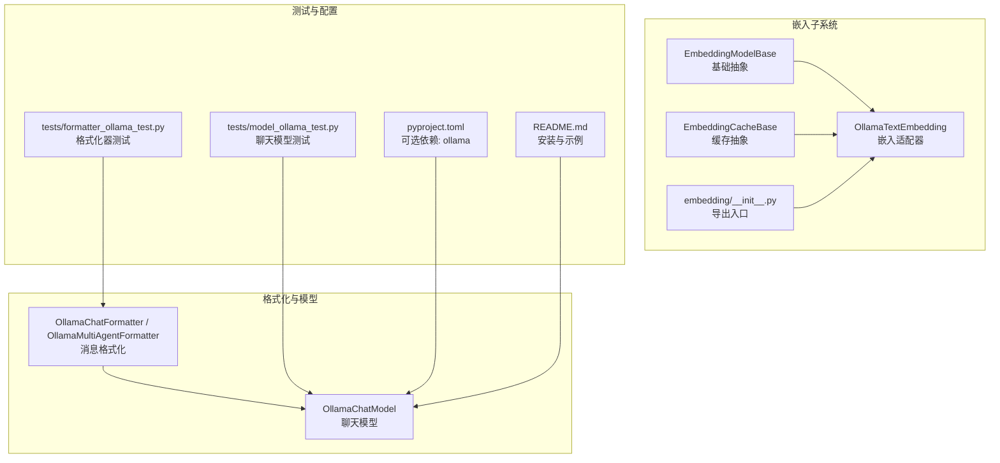
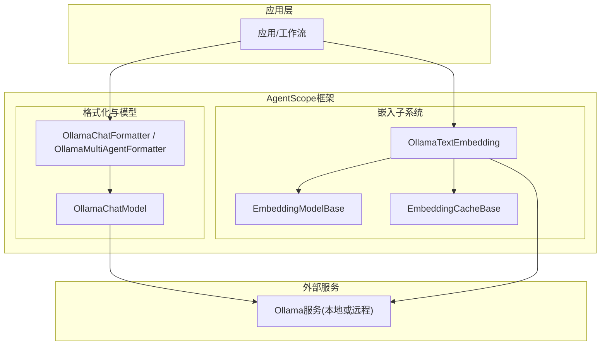
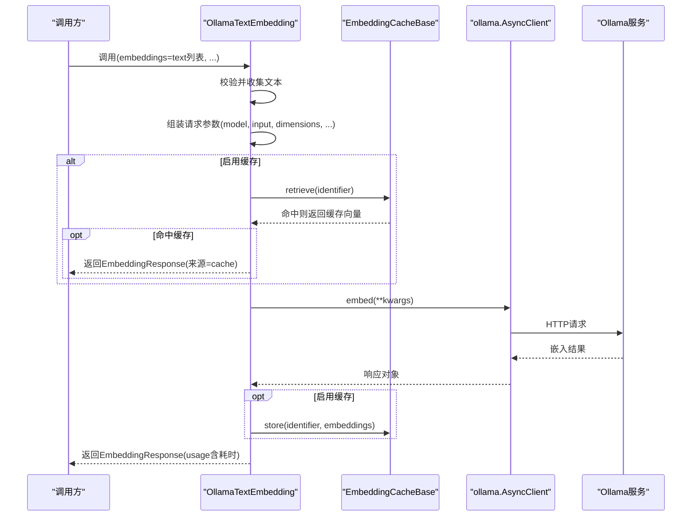
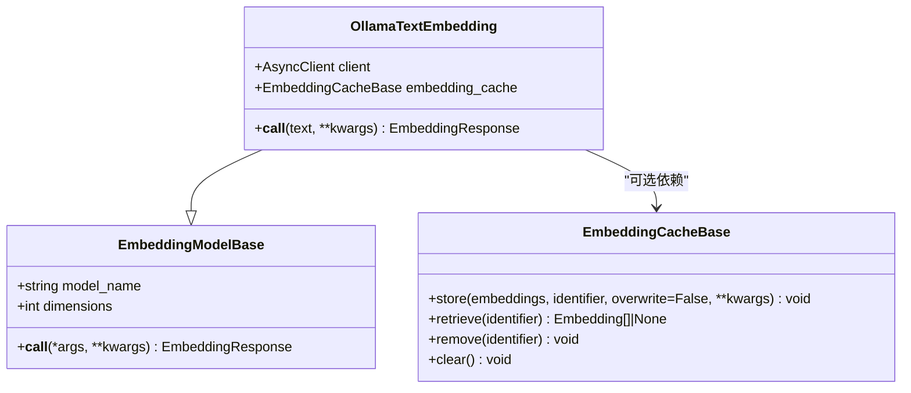
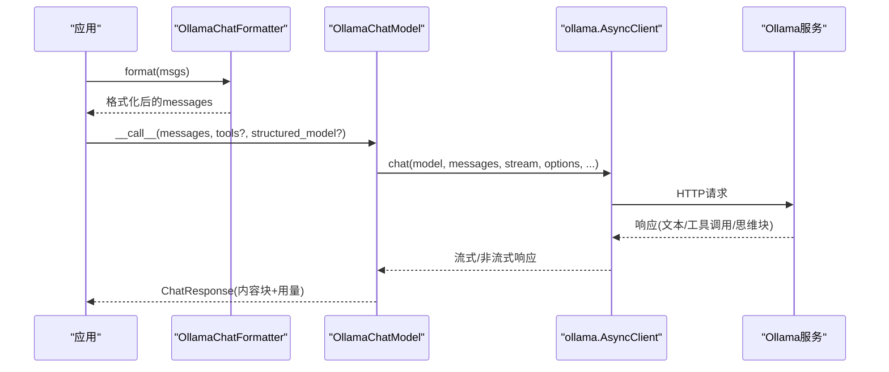
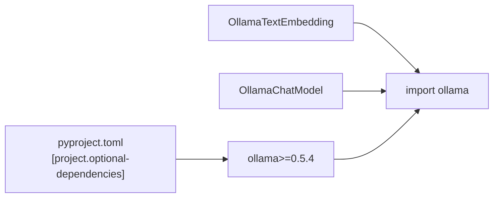

# Ollama嵌入适配器

<cite>
**本文引用的文件**
- [src/agentscope/embedding/_ollama_embedding.py](file://src/agentscope/embedding/_ollama_embedding.py)
- [src/agentscope/embedding/__init__.py](file://src/agentscope/embedding/__init__.py)
- [src/agentscope/embedding/_embedding_base.py](file://src/agentscope/embedding/_embedding_base.py)
- [src/agentscope/embedding/_cache_base.py](file://src/agentscope/embedding/_cache_base.py)
- [src/agentscope/formatter/_ollama_formatter.py](file://src/agentscope/formatter/_ollama_formatter.py)
- [src/agentscope/model/_ollama_model.py](file://src/agentscope/model/_ollama_model.py)
- [tests/model_ollama_test.py](file://tests/model_ollama_test.py)
- [tests/formatter_ollama_test.py](file://tests/formatter_ollama_test.py)
- [pyproject.toml](file://pyproject.toml)
- [README.md](file://README.md)
</cite>

## 目录
1. [简介](#简介)
2. [项目结构](#项目结构)
3. [核心组件](#核心组件)
4. [架构总览](#架构总览)
5. [组件详解](#组件详解)
6. [依赖关系分析](#依赖关系分析)
7. [性能考量](#性能考量)
8. [故障排除指南](#故障排除指南)
9. [结论](#结论)
10. [附录](#附录)

## 简介
本技术文档聚焦于AgentScope中Ollama嵌入适配器的设计与实现，系统性说明本地Ollama嵌入模型的连接方式、HTTP请求处理流程、响应解析策略，并结合项目内现有Ollama聊天模型与格式化器，给出统一的本地推理与嵌入能力集成方案。文档同时总结Ollama在离线使用、隐私保护、自定义模型支持等方面的优势，提供本地部署的安装与配置要点、使用示例（本地服务连接、模型选择、批量处理）、性能调优建议、资源管理策略以及与云端服务的对比分析。

## 项目结构
围绕嵌入适配器，本节梳理与之直接相关的模块与文件组织方式，帮助读者快速定位实现位置与扩展点。

**图表来源**
- [src/agentscope/embedding/_ollama_embedding.py:13-107](file://src/agentscope/embedding/_ollama_embedding.py#L13-L107)
- [src/agentscope/embedding/_embedding_base.py:8-46](file://src/agentscope/embedding/_embedding_base.py#L8-L46)
- [src/agentscope/embedding/_cache_base.py:12-64](file://src/agentscope/embedding/_cache_base.py#L12-L64)
- [src/agentscope/embedding/__init__.py:16-28](file://src/agentscope/embedding/__init__.py#L16-L28)
- [src/agentscope/formatter/_ollama_formatter.py:73-444](file://src/agentscope/formatter/_ollama_formatter.py#L73-L444)
- [src/agentscope/model/_ollama_model.py:33-366](file://src/agentscope/model/_ollama_model.py#L33-L366)
- [tests/model_ollama_test.py:78-370](file://tests/model_ollama_test.py#L78-L370)
- [tests/formatter_ollama_test.py:18-661](file://tests/formatter_ollama_test.py#L18-L661)
- [pyproject.toml:47-66](file://pyproject.toml#L47-L66)
- [README.md:137-166](file://README.md#L137-L166)

**章节来源**
- [src/agentscope/embedding/_ollama_embedding.py:13-107](file://src/agentscope/embedding/_ollama_embedding.py#L13-L107)
- [src/agentscope/embedding/__init__.py:16-28](file://src/agentscope/embedding/__init__.py#L16-L28)
- [src/agentscope/formatter/_ollama_formatter.py:73-444](file://src/agentscope/formatter/_ollama_formatter.py#L73-L444)
- [src/agentscope/model/_ollama_model.py:33-366](file://src/agentscope/model/_ollama_model.py#L33-L366)
- [pyproject.toml:47-66](file://pyproject.toml#L47-L66)
- [README.md:137-166](file://README.md#L137-L166)

## 核心组件
- 嵌入适配器：OllamaTextEmbedding
  - 继承EmbeddingModelBase，封装对ollama.AsyncClient.embed的调用，支持文本输入与维度参数，具备可选缓存能力。
- 嵌入基类与缓存基类
  - EmbeddingModelBase：定义模型名、维度、异步调用接口。
  - EmbeddingCacheBase：定义存储、检索、删除、清空等缓存操作的抽象。
- 导出入口
  - embedding/__init__.py导出OllamaTextEmbedding，便于外部按需导入。

**章节来源**
- [src/agentscope/embedding/_ollama_embedding.py:13-107](file://src/agentscope/embedding/_ollama_embedding.py#L13-L107)
- [src/agentscope/embedding/_embedding_base.py:8-46](file://src/agentscope/embedding/_embedding_base.py#L8-L46)
- [src/agentscope/embedding/_cache_base.py:12-64](file://src/agentscope/embedding/_cache_base.py#L12-L64)
- [src/agentscope/embedding/__init__.py:16-28](file://src/agentscope/embedding/__init__.py#L16-L28)

## 架构总览
下图展示Ollama嵌入适配器在AgentScope中的位置与交互关系，以及与聊天模型、格式化器的协同方式。

**图表来源**
- [src/agentscope/embedding/_ollama_embedding.py:13-107](file://src/agentscope/embedding/_ollama_embedding.py#L13-L107)
- [src/agentscope/formatter/_ollama_formatter.py:73-444](file://src/agentscope/formatter/_ollama_formatter.py#L73-L444)
- [src/agentscope/model/_ollama_model.py:33-366](file://src/agentscope/model/_ollama_model.py#L33-L366)

## 组件详解

### Ollama嵌入适配器（OllamaTextEmbedding）
- 输入规范
  - 支持字符串列表或包含"text"键的字典列表；内部会统一抽取为纯文本序列。
- 关键参数
  - model_name：嵌入模型名称。
  - dimensions：嵌入向量维度，需与所选模型一致。
  - host：Ollama服务地址，默认None表示使用默认本地地址。
  - embedding_cache：可选缓存实例，用于避免重复请求。
- 调用流程
  - 文本收集与校验 → 构造embed请求参数 → 可选缓存读取 → 发起异步请求 → 缓存写入 → 返回EmbeddingResponse。
- 异常处理
  - 非法输入类型时抛出错误，提示输入必须为字符串或带"text"键的字典。

**图表来源**
- [src/agentscope/embedding/_ollama_embedding.py:48-107](file://src/agentscope/embedding/_ollama_embedding.py#L48-L107)
- [src/agentscope/embedding/_cache_base.py:16-48](file://src/agentscope/embedding/_cache_base.py#L16-L48)

**章节来源**
- [src/agentscope/embedding/_ollama_embedding.py:19-107](file://src/agentscope/embedding/_ollama_embedding.py#L19-L107)

### 嵌入基类与缓存基类
- EmbeddingModelBase
  - 定义模型名、维度、异步调用接口，作为所有嵌入模型的抽象基类。
- EmbeddingCacheBase
  - 定义存储、检索、删除、清空等抽象方法，便于实现文件缓存、内存缓存等策略。

**图表来源**
- [src/agentscope/embedding/_embedding_base.py:8-46](file://src/agentscope/embedding/_embedding_base.py#L8-L46)
- [src/agentscope/embedding/_cache_base.py:12-64](file://src/agentscope/embedding/_cache_base.py#L12-L64)
- [src/agentscope/embedding/_ollama_embedding.py:13-47](file://src/agentscope/embedding/_ollama_embedding.py#L13-L47)

**章节来源**
- [src/agentscope/embedding/_embedding_base.py:8-46](file://src/agentscope/embedding/_embedding_base.py#L8-L46)
- [src/agentscope/embedding/_cache_base.py:12-64](file://src/agentscope/embedding/_cache_base.py#L12-L64)
- [src/agentscope/embedding/_ollama_embedding.py:13-47](file://src/agentscope/embedding/_ollama_embedding.py#L13-L47)

### 与Ollama聊天模型及格式化器的关系
- 聊天模型（OllamaChatModel）
  - 使用ollama.AsyncClient.chat发起请求，支持流式与非流式两种模式，解析响应为ChatResponse，支持工具调用、思维块、结构化输出等。
- 格式化器（OllamaChatFormatter / OllamaMultiAgentFormatter）
  - 将Msg消息转换为Ollama API所需的格式，支持文本、图像、工具调用与工具结果等多模态内容；支持将工具结果中的图片提升为用户消息以便兼容不同API限制。

**图表来源**
- [src/agentscope/formatter/_ollama_formatter.py:125-266](file://src/agentscope/formatter/_ollama_formatter.py#L125-L266)
- [src/agentscope/model/_ollama_model.py:101-173](file://src/agentscope/model/_ollama_model.py#L101-L173)

**章节来源**
- [src/agentscope/model/_ollama_model.py:33-366](file://src/agentscope/model/_ollama_model.py#L33-L366)
- [src/agentscope/formatter/_ollama_formatter.py:73-444](file://src/agentscope/formatter/_ollama_formatter.py#L73-L444)

## 依赖关系分析
- 可选依赖
  - pyproject.toml中定义了可选依赖agentscope[ollama]，其核心为ollama>=0.5.4，确保运行时可导入并使用ollama.AsyncClient。
- 运行时导入
  - OllamaTextEmbedding与OllamaChatModel均在构造函数中动态导入ollama，避免未安装时阻塞其他功能。
- 模块导出
  - embedding/__init__.py导出OllamaTextEmbedding，便于外部按需使用。

**图表来源**
- [pyproject.toml:47-66](file://pyproject.toml#L47-L66)
- [src/agentscope/embedding/_ollama_embedding.py:41-45](file://src/agentscope/embedding/_ollama_embedding.py#L41-L45)
- [src/agentscope/model/_ollama_model.py:80-94](file://src/agentscope/model/_ollama_model.py#L80-L94)

**章节来源**
- [pyproject.toml:47-66](file://pyproject.toml#L47-L66)
- [src/agentscope/embedding/_ollama_embedding.py:41-45](file://src/agentscope/embedding/_ollama_embedding.py#L41-L45)
- [src/agentscope/model/_ollama_model.py:80-94](file://src/agentscope/model/_ollama_model.py#L80-L94)

## 性能考量
- 批量处理
  - 嵌入适配器接收文本列表，内部统一为input数组提交给Ollama服务，适合批量嵌入场景，减少HTTP往返次数。
- 缓存策略
  - 通过EmbeddingCacheBase实现请求级缓存，避免重复计算相同输入的嵌入向量，显著降低延迟与资源消耗。
- 流式与非流式
  - 聊天模型支持流式响应，可在生成过程中逐步产出内容块，适用于实时交互；非流式适合批处理与稳定性优先的场景。
- 资源占用
  - keep_alive参数控制模型常驻内存时间，合理设置可减少加载开销；options参数（如温度、top_p）影响生成质量与速度的平衡。
- 结构化输出
  - 通过format/schema约束生成结构化内容，有助于下游解析与一致性保障。

[本节为通用性能建议，不直接分析具体文件，故无“章节来源”]

## 故障排除指南
- 无法导入ollama
  - 现象：初始化OllamaChatModel时报错提示未找到包。
  - 处理：安装可选依赖agentscope[ollama]或直接pip install "ollama>=0.5.4"。
  - 参考：[pyproject.toml](file://pyproject.toml#L61)。
- 本地服务不可达
  - 现象：调用嵌入或聊天接口超时或连接失败。
  - 处理：确认Ollama服务已启动且host参数正确；若使用默认地址，确保本地端口可用。
  - 参考：[src/agentscope/embedding/_ollama_embedding.py](file://src/agentscope/embedding/_ollama_embedding.py#L23)、[src/agentscope/model/_ollama_model.py:66-68](file://src/agentscope/model/_ollama_model.py#L66-L68)。
- 输入类型错误
  - 现象：嵌入调用抛出异常，提示输入必须为字符串或带"text"键的字典。
  - 处理：检查传入text列表元素类型，确保符合要求。
  - 参考：[src/agentscope/embedding/_ollama_embedding.py:66-68](file://src/agentscope/embedding/_ollama_embedding.py#L66-L68)。
- 工具调用不生效
  - 现象：Ollama当前版本不支持tool_choice参数，会被忽略。
  - 处理：移除tool_choice参数或在上层逻辑中自行处理工具调度。
  - 参考：[src/agentscope/model/_ollama_model.py](file://src/agentscope/model/_ollama_model.py#L151)。
- 图像处理问题
  - 现象：格式化器在处理图片URL或本地路径时出现异常。
  - 处理：确保URL为file://或有效Web URL；本地路径存在且可读；或使用base64数据。
  - 参考：[src/agentscope/formatter/_ollama_formatter.py:51-71](file://src/agentscope/formatter/_ollama_formatter.py#L51-L71)。

**章节来源**
- [pyproject.toml](file://pyproject.toml#L61)
- [src/agentscope/embedding/_ollama_embedding.py:23-68](file://src/agentscope/embedding/_ollama_embedding.py#L23-L68)
- [src/agentscope/model/_ollama_model.py](file://src/agentscope/model/_ollama_model.py#L151)
- [src/agentscope/formatter/_ollama_formatter.py:51-71](file://src/agentscope/formatter/_ollama_formatter.py#L51-L71)

## 结论
Ollama嵌入适配器在AgentScope中提供了简洁、可扩展的本地嵌入能力，结合缓存机制与统一的消息格式化体系，能够高效地支撑多模态对话与RAG等应用场景。通过合理的参数配置与缓存策略，可在保证性能的同时兼顾隐私与可控性。配合现有的Ollama聊天模型与格式化器，开发者可以构建从本地推理到嵌入检索的一体化解决方案。

[本节为总结性内容，不直接分析具体文件，故无“章节来源”]

## 附录

### 本地部署与配置要点
- 安装
  - 通过pip安装AgentScope并启用ollama可选依赖，或直接安装ollama Python包。
  - 参考：[README.md:137-166](file://README.md#L137-L166)、[pyproject.toml](file://pyproject.toml#L61)。
- 启动Ollama服务
  - 在本地启动Ollama服务，确保默认端口可用；如需自定义host，请在初始化时传入。
  - 参考：[src/agentscope/embedding/_ollama_embedding.py](file://src/agentscope/embedding/_ollama_embedding.py#L23)、[src/agentscope/model/_ollama_model.py:66-68](file://src/agentscope/model/_ollama_model.py#L66-L68)。
- 模型选择与维度
  - 根据所选嵌入模型设置dimensions参数，确保与模型输出维度一致。
  - 参考：[src/agentscope/embedding/_ollama_embedding.py:32-34](file://src/agentscope/embedding/_ollama_embedding.py#L32-L34)。

**章节来源**
- [README.md:137-166](file://README.md#L137-L166)
- [pyproject.toml](file://pyproject.toml#L61)
- [src/agentscope/embedding/_ollama_embedding.py:23-34](file://src/agentscope/embedding/_ollama_embedding.py#L23-L34)

### 使用示例（基于现有测试与实现）
- 嵌入调用（批量文本）
  - 步骤：准备文本列表或包含"text"键的字典列表；创建OllamaTextEmbedding实例；调用__call__获取EmbeddingResponse。
  - 参考：[src/agentscope/embedding/_ollama_embedding.py:48-107](file://src/agentscope/embedding/_ollama_embedding.py#L48-L107)。
- 聊天模型调用（工具与结构化输出）
  - 步骤：准备messages与可选tools；创建OllamaChatModel实例；调用__call__获取ChatResponse或流式迭代器。
  - 参考：[src/agentscope/model/_ollama_model.py:101-173](file://src/agentscope/model/_ollama_model.py#L101-L173)、[tests/model_ollama_test.py:115-262](file://tests/model_ollama_test.py#L115-L262)。
- 多模态消息格式化
  - 步骤：使用OllamaChatFormatter或OllamaMultiAgentFormatter将Msg消息转换为Ollama API所需格式。
  - 参考：[src/agentscope/formatter/_ollama_formatter.py:125-266](file://src/agentscope/formatter/_ollama_formatter.py#L125-L266)、[tests/formatter_ollama_test.py:369-573](file://tests/formatter_ollama_test.py#L369-L573)。

**章节来源**
- [src/agentscope/embedding/_ollama_embedding.py:48-107](file://src/agentscope/embedding/_ollama_embedding.py#L48-L107)
- [src/agentscope/model/_ollama_model.py:101-173](file://src/agentscope/model/_ollama_model.py#L101-L173)
- [tests/model_ollama_test.py:115-262](file://tests/model_ollama_test.py#L115-L262)
- [src/agentscope/formatter/_ollama_formatter.py:125-266](file://src/agentscope/formatter/_ollama_formatter.py#L125-L266)
- [tests/formatter_ollama_test.py:369-573](file://tests/formatter_ollama_test.py#L369-L573)

### 优势与对比分析
- 优势
  - 离线使用：无需网络依赖，适合内网或无外网环境。
  - 隐私保护：数据不出本地，满足高安全等级场景。
  - 自定义模型支持：可加载任意Ollama支持的嵌入与推理模型，灵活适配业务需求。
- 与云端服务对比
  - 成本：本地部署一次性投入，长期使用成本可控；云端按调用计费，适合弹性场景。
  - 延迟：本地通常更低，但受硬件与模型大小影响；云端可通过CDN优化边缘延迟。
  - 可控性：本地完全可控，模型更新与参数调整即时生效；云端版本升级可能有滞后。
  - 可靠性：本地需自管运维；云端具备SLA与自动扩缩容能力。

[本节为概念性对比，不直接分析具体文件，故无“章节来源”]