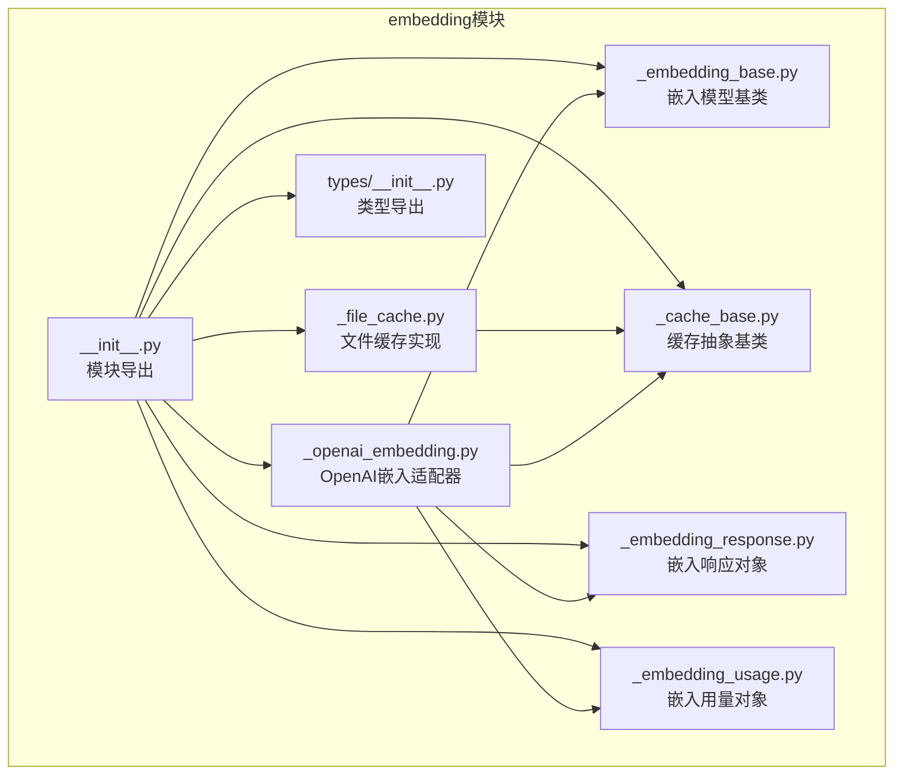
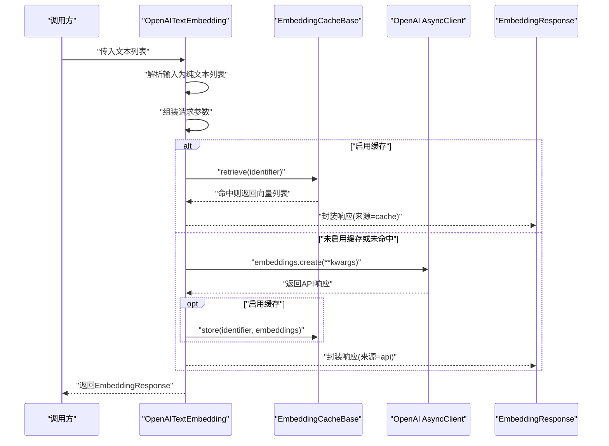
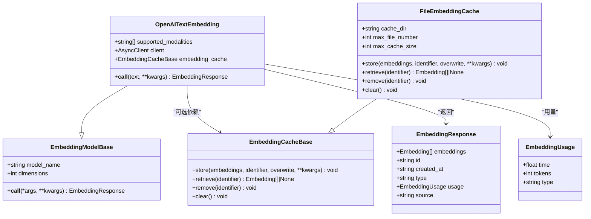
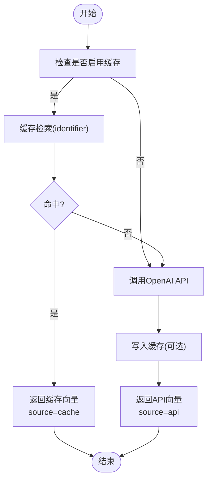
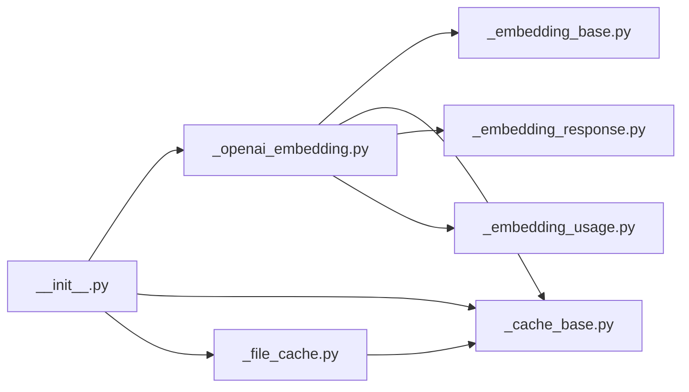

# OpenAI嵌入适配器

<cite>
**本文引用的文件**
- [src/agentscope/embedding/_openai_embedding.py](file://src/agentscope/embedding/_openai_embedding.py)
- [src/agentscope/embedding/_cache_base.py](file://src/agentscope/embedding/_cache_base.py)
- [src/agentscope/embedding/_file_cache.py](file://src/agentscope/embedding/_file_cache.py)
- [src/agentscope/embedding/_embedding_base.py](file://src/agentscope/embedding/_embedding_base.py)
- [src/agentscope/embedding/_embedding_response.py](file://src/agentscope/embedding/_embedding_response.py)
- [src/agentscope/embedding/_embedding_usage.py](file://src/agentscope/embedding/_embedding_usage.py)
- [src/agentscope/embedding/__init__.py](file://src/agentscope/embedding/__init__.py)
- [src/agentscope/types/__init__.py](file://src/agentscope/types/__init__.py)
- [tests/embedding_cache_test.py](file://tests/embedding_cache_test.py)
- [docs/tutorial/zh_CN/src/task_embedding.py](file://docs/tutorial/zh_CN/src/task_embedding.py)
</cite>

## 目录
1. [简介](#简介)
2. [项目结构](#项目结构)
3. [核心组件](#核心组件)
4. [架构总览](#架构总览)
5. [详细组件分析](#详细组件分析)
6. [依赖关系分析](#依赖关系分析)
7. [性能考量](#性能考量)
8. [故障排除指南](#故障排除指南)
9. [结论](#结论)
10. [附录](#附录)

## 简介
本文件面向需要在AgentScope中集成与使用OpenAI文本嵌入能力的开发者，系统性地阐述OpenAI嵌入适配器的实现原理与使用方法。内容涵盖：
- 异步客户端AsyncClient的使用与API密钥认证机制
- 请求参数配置与嵌入维度设置
- 缓存机制与EmbeddingCacheBase的缓存策略、性能优化效果
- 文本输入处理流程（支持字符串与TextBlock字典格式）
- 典型使用示例（初始化配置、批量嵌入处理、错误处理）
- API限制说明、最佳实践与故障排除建议

## 项目结构
围绕OpenAI嵌入适配器的相关代码主要位于embedding子模块，关键文件职责如下：
- OpenAI嵌入适配器：负责调用OpenAI Embeddings API，封装异步客户端、参数组装、缓存交互与响应封装
- 缓存抽象与实现：定义缓存接口与文件缓存实现，支持本地磁盘持久化与容量维护
- 基类与数据结构：统一的嵌入模型基类、响应对象与用量对象
- 导出入口：模块对外暴露的公共API

**图表来源**
- [src/agentscope/embedding/_openai_embedding.py:13-110](file://src/agentscope/embedding/_openai_embedding.py#L13-L110)
- [src/agentscope/embedding/_cache_base.py:12-64](file://src/agentscope/embedding/_cache_base.py#L12-L64)
- [src/agentscope/embedding/_file_cache.py:19-188](file://src/agentscope/embedding/_file_cache.py#L19-L188)
- [src/agentscope/embedding/_embedding_base.py:8-46](file://src/agentscope/embedding/_embedding_base.py#L8-L46)
- [src/agentscope/embedding/_embedding_response.py:12-33](file://src/agentscope/embedding/_embedding_response.py#L12-L33)
- [src/agentscope/embedding/_embedding_usage.py:9-21](file://src/agentscope/embedding/_embedding_usage.py#L9-L21)
- [src/agentscope/embedding/__init__.py:4-28](file://src/agentscope/embedding/__init__.py#L4-L28)
- [src/agentscope/types/__init__.py:8-23](file://src/agentscope/types/__init__.py#L8-L23)

**章节来源**
- [src/agentscope/embedding/__init__.py:4-28](file://src/agentscope/embedding/__init__.py#L4-L28)

## 核心组件
- OpenAITextEmbedding：OpenAI文本嵌入适配器，继承自EmbeddingModelBase，封装AsyncClient、参数组装、缓存交互与响应封装
- EmbeddingCacheBase：嵌入缓存抽象接口，定义store/retrieve/remove/clear等异步方法
- FileEmbeddingCache：基于文件系统的缓存实现，使用numpy二进制存储向量，支持文件数量与缓存大小上限维护
- EmbeddingModelBase：嵌入模型基类，统一管理model_name与dimensions
- EmbeddingResponse：嵌入响应对象，包含向量列表、时间戳、类型标识、用量与来源标记
- EmbeddingUsage：嵌入用量对象，记录耗时与token用量

**章节来源**
- [src/agentscope/embedding/_openai_embedding.py:13-110](file://src/agentscope/embedding/_openai_embedding.py#L13-L110)
- [src/agentscope/embedding/_cache_base.py:12-64](file://src/agentscope/embedding/_cache_base.py#L12-L64)
- [src/agentscope/embedding/_file_cache.py:19-188](file://src/agentscope/embedding/_file_cache.py#L19-L188)
- [src/agentscope/embedding/_embedding_base.py:8-46](file://src/agentscope/embedding/_embedding_base.py#L8-L46)
- [src/agentscope/embedding/_embedding_response.py:12-33](file://src/agentscope/embedding/_embedding_response.py#L12-L33)
- [src/agentscope/embedding/_embedding_usage.py:9-21](file://src/agentscope/embedding/_embedding_usage.py#L9-L21)

## 架构总览
OpenAI嵌入适配器采用“适配器+缓存”的分层设计：
- 适配器层：OpenAITextEmbedding负责将输入文本标准化为纯字符串列表，组装OpenAI API请求参数，并调用AsyncClient发起异步请求
- 缓存层：可选的EmbeddingCacheBase实现，用于在本地磁盘缓存嵌入结果，命中则直接返回，未命中则落盘
- 响应层：统一的EmbeddingResponse与EmbeddingUsage对象承载嵌入结果与用量统计

**图表来源**
- [src/agentscope/embedding/_openai_embedding.py:49-110](file://src/agentscope/embedding/_openai_embedding.py#L49-L110)
- [src/agentscope/embedding/_cache_base.py:16-63](file://src/agentscope/embedding/_cache_base.py#L16-L63)
- [src/agentscope/embedding/_embedding_response.py:12-33](file://src/agentscope/embedding/_embedding_response.py#L12-L33)

## 详细组件分析

### OpenAITextEmbedding组件
- 角色与职责
  - 继承EmbeddingModelBase，统一管理model_name与dimensions
  - 使用openai.AsyncClient进行异步调用
  - 支持可选的EmbeddingCacheBase缓存
  - 输入支持字符串与TextBlock字典格式，内部统一提取为字符串列表
  - 输出封装为EmbeddingResponse，包含向量、用量与来源标记

- 关键实现要点
  - 异步客户端初始化：通过api_key与kwargs传递给AsyncClient
  - 输入解析：遍历输入列表，若元素为字典且包含"text"键，则取其值；若为字符串则直接使用；否则抛出异常
  - 请求参数组装：固定包含input、model、dimensions、encoding_format等字段
  - 缓存交互：当启用缓存时，先尝试retrieve，命中则直接返回；未命中则调用API后store
  - 响应封装：根据是否命中缓存设置source字段；usage包含耗时与token用量

- 错误处理
  - 输入类型校验：非字符串且不含"text"键的字典会触发ValueError
  - 缓存文件存在但非文件路径的情况会触发运行时错误（由FileEmbeddingCache内部逻辑保证）

- 性能优化
  - 异步I/O：通过AsyncClient减少阻塞等待
  - 缓存命中：重复输入可直接返回缓存，显著降低API调用次数与延迟
  - 维度控制：通过dimensions参数限定输出向量维度，减少传输与存储开销

**章节来源**
- [src/agentscope/embedding/_openai_embedding.py:19-110](file://src/agentscope/embedding/_openai_embedding.py#L19-L110)

#### 类关系图

**图表来源**
- [src/agentscope/embedding/_openai_embedding.py:13-110](file://src/agentscope/embedding/_openai_embedding.py#L13-L110)
- [src/agentscope/embedding/_cache_base.py:12-64](file://src/agentscope/embedding/_cache_base.py#L12-L64)
- [src/agentscope/embedding/_file_cache.py:19-188](file://src/agentscope/embedding/_file_cache.py#L19-L188)
- [src/agentscope/embedding/_embedding_response.py:12-33](file://src/agentscope/embedding/_embedding_response.py#L12-L33)
- [src/agentscope/embedding/_embedding_usage.py:9-21](file://src/agentscope/embedding/_embedding_usage.py#L9-L21)

### 缓存机制与策略
- 接口设计
  - EmbeddingCacheBase定义了store/retrieve/remove/clear四个异步方法，便于替换不同存储介质
- 文件缓存实现
  - FileEmbeddingCache将identifier序列化为JSON后经SHA256生成稳定文件名，使用.npz/.npy保存向量
  - 支持两种容量维护策略：最大文件数量与最大缓存大小（MB），超出阈值按创建时间淘汰最旧文件
  - 支持覆盖写入，避免重复写入相同identifier导致的冲突
- 命中流程
  - 适配器在调用API前先查询缓存，命中则直接返回EmbeddingResponse且source标注为cache
  - 未命中时调用API并将结果写入缓存，随后返回EmbeddingResponse且source标注为api

**图表来源**
- [src/agentscope/embedding/_openai_embedding.py:79-101](file://src/agentscope/embedding/_openai_embedding.py#L79-L101)
- [src/agentscope/embedding/_file_cache.py:89-188](file://src/agentscope/embedding/_file_cache.py#L89-L188)

**章节来源**
- [src/agentscope/embedding/_cache_base.py:12-64](file://src/agentscope/embedding/_cache_base.py#L12-L64)
- [src/agentscope/embedding/_file_cache.py:19-188](file://src/agentscope/embedding/_file_cache.py#L19-L188)
- [tests/embedding_cache_test.py:70-164](file://tests/embedding_cache_test.py#L70-L164)

### 数据模型与类型
- EmbeddingResponse：封装嵌入向量、时间戳、类型标识、用量与来源
- EmbeddingUsage：封装耗时与token用量
- 类型导出：Embedding与JSONSerializableObject等类型在types模块中统一导出

**章节来源**
- [src/agentscope/embedding/_embedding_response.py:12-33](file://src/agentscope/embedding/_embedding_response.py#L12-L33)
- [src/agentscope/embedding/_embedding_usage.py:9-21](file://src/agentscope/embedding/_embedding_usage.py#L9-L21)
- [src/agentscope/types/__init__.py:8-23](file://src/agentscope/types/__init__.py#L8-L23)

## 依赖关系分析
- 模块导出
  - embedding/__init__.py集中导出适配器、缓存基类与文件缓存实现，便于外部按需导入
- 组件耦合
  - OpenAITextEmbedding对EmbeddingCacheBase为可选依赖，通过组合实现松耦合
  - FileEmbeddingCache对numpy有运行时依赖，用于高效存储向量
- 外部依赖
  - openai.AsyncClient用于异步调用OpenAI Embeddings API
  - numpy用于向量数组的二进制序列化与反序列化

**图表来源**
- [src/agentscope/embedding/__init__.py:4-28](file://src/agentscope/embedding/__init__.py#L4-L28)
- [src/agentscope/embedding/_openai_embedding.py:13-110](file://src/agentscope/embedding/_openai_embedding.py#L13-L110)
- [src/agentscope/embedding/_cache_base.py:12-64](file://src/agentscope/embedding/_cache_base.py#L12-L64)
- [src/agentscope/embedding/_file_cache.py:19-188](file://src/agentscope/embedding/_file_cache.py#L19-L188)

**章节来源**
- [src/agentscope/embedding/__init__.py:4-28](file://src/agentscope/embedding/__init__.py#L4-L28)

## 性能考量
- 异步I/O：使用AsyncClient减少阻塞，适合高并发场景
- 缓存命中：重复输入可直接返回缓存，显著降低API调用次数与网络延迟
- 维度控制：通过dimensions参数限定输出维度，减少带宽与存储占用
- 文件缓存维护：FileEmbeddingCache支持按文件数量与缓存大小上限自动清理，避免磁盘膨胀
- 批量限制：当前OpenAI适配器未显式拆分批次，如需处理大批量文本，建议在上层按批次切分或结合其他适配器的批处理策略

[本节为通用性能讨论，不直接分析具体文件]

## 故障排除指南
- 输入类型错误
  - 现象：抛出ValueError，提示输入必须为字符串或包含"text"键的字典
  - 处理：确保传入列表中的每个元素为字符串或形如{"text": "..."}的字典
- 缓存文件异常
  - 现象：当缓存路径存在但不是文件时触发运行时错误
  - 处理：检查缓存目录权限与路径配置，必要时清理异常文件
- 缓存未命中
  - 现象：首次调用正常，后续调用仍走API
  - 处理：确认传入的identifier完全一致（包括model、dimensions、encoding_format等），核对缓存目录与容量限制
- API调用失败
  - 现象：网络超时、鉴权失败或API限流
  - 处理：检查API密钥、网络连通性与OpenAI服务状态；必要时增加重试与退避策略

**章节来源**
- [src/agentscope/embedding/_openai_embedding.py:67-69](file://src/agentscope/embedding/_openai_embedding.py#L67-L69)
- [src/agentscope/embedding/_file_cache.py:76-87](file://src/agentscope/embedding/_file_cache.py#L76-L87)

## 结论
OpenAI嵌入适配器在保持与OpenAI Embeddings API一致的接口语义的同时，提供了可插拔的缓存机制与统一的响应封装，适用于需要稳定、可复用的文本向量化能力的场景。通过合理配置维度与缓存策略，可在保证准确性的同时显著降低API成本与延迟。

[本节为总结性内容，不直接分析具体文件]

## 附录

### 使用示例与最佳实践
- 初始化配置
  - 创建OpenAITextEmbedding实例，传入api_key、model_name与dimensions
  - 可选传入FileEmbeddingCache实例以启用缓存
- 批量嵌入处理
  - 支持字符串列表与TextBlock字典列表混合输入
  - 建议在上层按批次切分大批量文本，避免单次请求过大
- 错误处理机制
  - 对输入类型进行预校验
  - 对缓存操作进行异常捕获与日志记录
- API限制说明
  - 当前适配器未内置OpenAI Embeddings API的批次大小与token限制处理，建议在上层进行分批与限额控制
- 最佳实践建议
  - 启用缓存并合理设置max_file_number与max_cache_size
  - 固定dimensions以获得稳定的向量维度
  - 在生产环境使用持久化缓存目录，避免进程重启导致缓存失效

**章节来源**
- [docs/tutorial/zh_CN/src/task_embedding.py:83-133](file://docs/tutorial/zh_CN/src/task_embedding.py#L83-L133)
- [src/agentscope/embedding/_openai_embedding.py:49-110](file://src/agentscope/embedding/_openai_embedding.py#L49-L110)