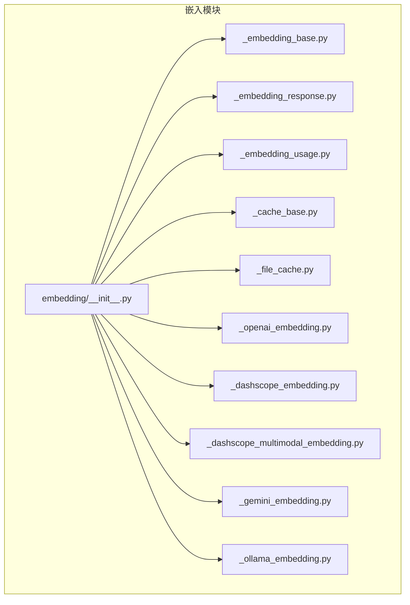
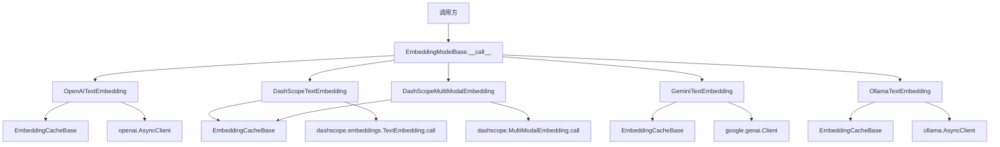
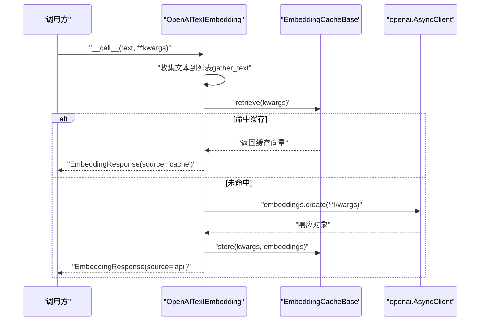
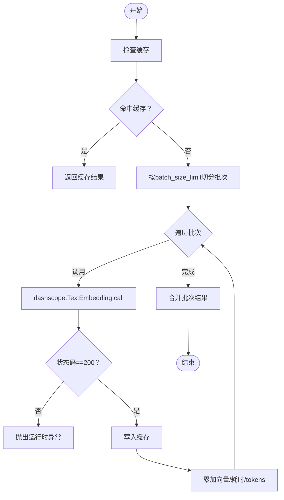
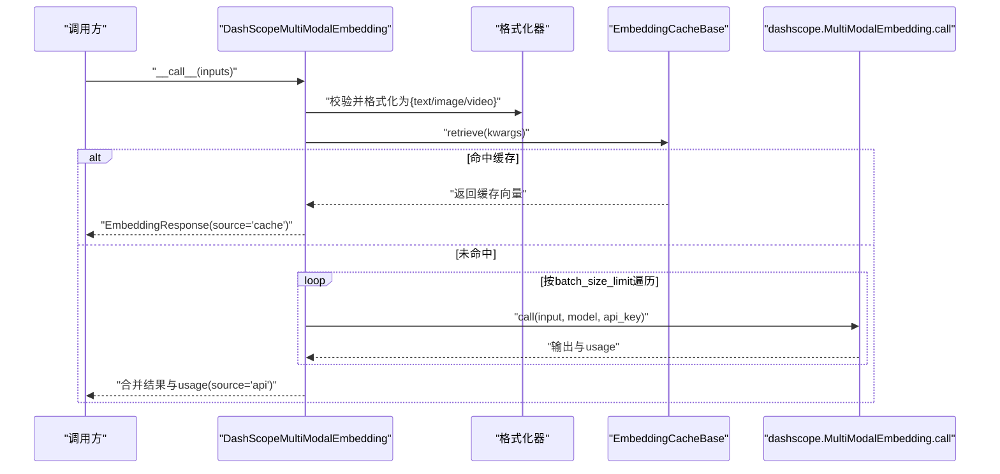
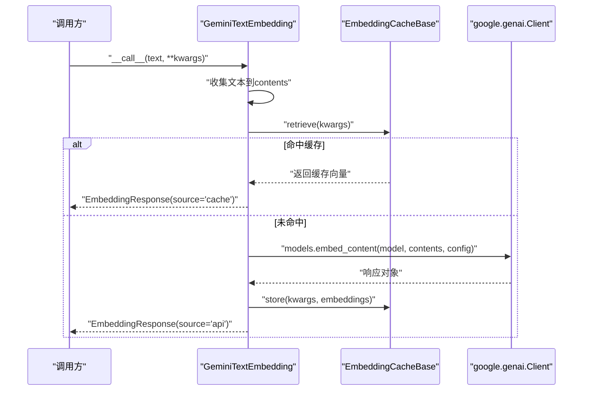
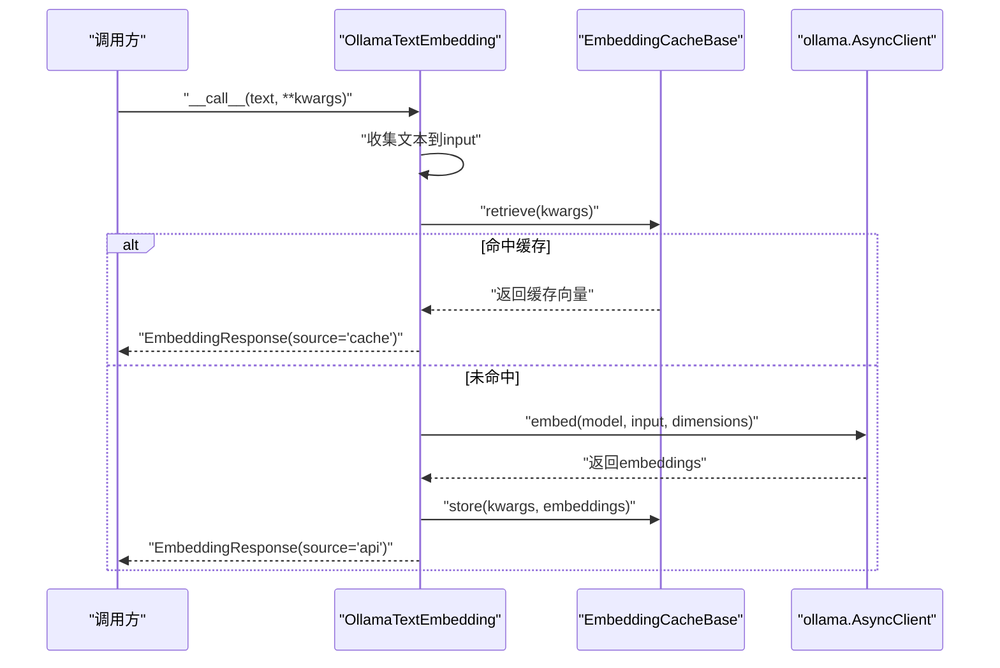
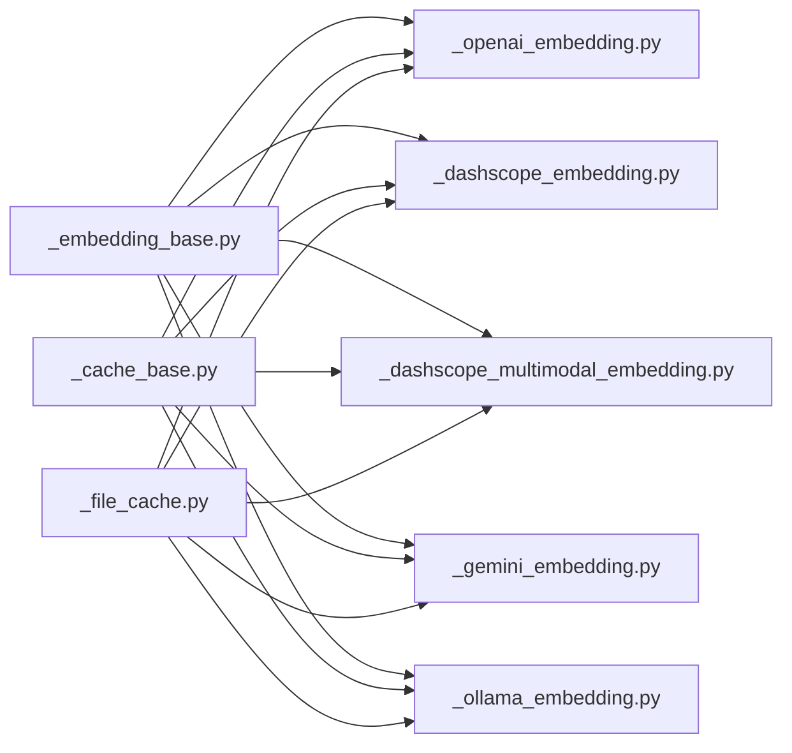

# 平台适配器

<cite>
**本文引用的文件**
- [embedding/__init__.py](file://src/agentscope/embedding/__init__.py)
- [_embedding_base.py](file://src/agentscope/embedding/_embedding_base.py)
- [_embedding_response.py](file://src/agentscope/embedding/_embedding_response.py)
- [_embedding_usage.py](file://src/agentscope/embedding/_embedding_usage.py)
- [_cache_base.py](file://src/agentscope/embedding/_cache_base.py)
- [_file_cache.py](file://src/agentscope/embedding/_file_cache.py)
- [_openai_embedding.py](file://src/agentscope/embedding/_openai_embedding.py)
- [_dashscope_embedding.py](file://src/agentscope/embedding/_dashscope_embedding.py)
- [_dashscope_multimodal_embedding.py](file://src/agentscope/embedding/_dashscope_multimodal_embedding.py)
- [_gemini_embedding.py](file://src/agentscope/embedding/_gemini_embedding.py)
- [_ollama_embedding.py](file://src/agentscope/embedding/_ollama_embedding.py)
- [task_embedding.py（教程）](file://docs/tutorial/zh_CN/src/task_embedding.py)
- [embedding_cache_test.py（测试）](file://tests/embedding_cache_test.py)
</cite>

## 目录
1. [简介](#简介)
2. [项目结构](#项目结构)
3. [核心组件](#核心组件)
4. [架构总览](#架构总览)
5. [详细组件分析](#详细组件分析)
6. [依赖分析](#依赖分析)
7. [性能考虑](#性能考虑)
8. [故障排除指南](#故障排除指南)
9. [结论](#结论)
10. [附录](#附录)

## 简介
本文件面向AgentScope平台的“嵌入模型”适配器模块，系统性梳理各平台嵌入实现：OpenAI文本嵌入的API集成与缓存、DashScope文本与多模态嵌入的批处理与多模态输入规范、Gemini文本嵌入的调用方式与维度控制、Ollama本地嵌入的异步客户端与参数传递。文档同时给出统一的数据结构、错误处理策略、性能优化建议与故障排除方法，并通过序列图与类图展示关键流程。

## 项目结构
嵌入适配器位于src/agentscope/embedding目录，采用“按平台分文件”的模块化组织，统一通过__init__.py导出，便于上层按需导入与替换。

图表来源
- [embedding/__init__.py:1-28](file://src/agentscope/embedding/__init__.py#L1-L28)
- [_embedding_base.py:1-46](file://src/agentscope/embedding/_embedding_base.py#L1-L46)
- [_embedding_response.py:1-33](file://src/agentscope/embedding/_embedding_response.py#L1-L33)
- [_embedding_usage.py:1-21](file://src/agentscope/embedding/_embedding_usage.py#L1-L21)
- [_cache_base.py:1-64](file://src/agentscope/embedding/_cache_base.py#L1-L64)
- [_file_cache.py:1-188](file://src/agentscope/embedding/_file_cache.py#L1-L188)
- [_openai_embedding.py:1-110](file://src/agentscope/embedding/_openai_embedding.py#L1-L110)
- [_dashscope_embedding.py:1-170](file://src/agentscope/embedding/_dashscope_embedding.py#L1-L170)
- [_dashscope_multimodal_embedding.py:1-245](file://src/agentscope/embedding/_dashscope_multimodal_embedding.py#L1-L245)
- [_gemini_embedding.py:1-110](file://src/agentscope/embedding/_gemini_embedding.py#L1-L110)
- [_ollama_embedding.py:1-107](file://src/agentscope/embedding/_ollama_embedding.py#L1-L107)

章节来源
- [embedding/__init__.py:1-28](file://src/agentscope/embedding/__init__.py#L1-L28)

## 核心组件
- 基类与数据结构
  - EmbeddingModelBase：定义模型名、维度、支持模态等通用属性，以及异步调用接口。
  - EmbeddingResponse：封装返回向量、时间戳、类型、用量与来源（缓存/API）。
  - EmbeddingUsage：封装耗时与token用量。
  - 缓存接口EmbeddingCacheBase与文件缓存FileEmbeddingCache：提供存储、检索、清理与容量维护能力。
- 平台适配器
  - OpenAI文本嵌入：支持文本列表输入，自动聚合请求，可选缓存。
  - DashScope文本嵌入：支持文本输入，内置批大小限制与日志提示。
  - DashScope多模态嵌入：支持文本、图片（base64或URL）、视频（URL），按模型动态批大小与维度约束。
  - Gemini文本嵌入：以genai客户端调用embed_content，支持维度配置与缓存。
  - Ollama文本嵌入：以ollama AsyncClient调用embed，支持host与维度参数。

章节来源
- [_embedding_base.py:8-46](file://src/agentscope/embedding/_embedding_base.py#L8-L46)
- [_embedding_response.py:12-33](file://src/agentscope/embedding/_embedding_response.py#L12-L33)
- [_embedding_usage.py:9-21](file://src/agentscope/embedding/_embedding_usage.py#L9-L21)
- [_cache_base.py:12-64](file://src/agentscope/embedding/_cache_base.py#L12-L64)
- [_file_cache.py:19-188](file://src/agentscope/embedding/_file_cache.py#L19-L188)

## 架构总览
统一的异步调用入口与平台特定实现解耦，通过EmbeddingCacheBase实现跨平台的缓存复用；DashScope多模态嵌入在内部对输入进行格式化与批处理，OpenAI/Gemini/Ollama则直接透传参数。

图表来源
- [_embedding_base.py:36-46](file://src/agentscope/embedding/_embedding_base.py#L36-L46)
- [_openai_embedding.py:42-47](file://src/agentscope/embedding/_openai_embedding.py#L42-L47)
- [_gemini_embedding.py:43-48](file://src/agentscope/embedding/_gemini_embedding.py#L43-L48)
- [_ollama_embedding.py:41-46](file://src/agentscope/embedding/_ollama_embedding.py#L41-L46)
- [_dashscope_embedding.py:77-84](file://src/agentscope/embedding/_dashscope_embedding.py#L77-L84)
- [_dashscope_multimodal_embedding.py:217-223](file://src/agentscope/embedding/_dashscope_multimodal_embedding.py#L217-L223)

## 详细组件分析

### OpenAI嵌入
- 认证与客户端
  - 使用openai.AsyncClient，构造时传入api_key与额外关键字参数。
- 请求格式
  - 输入：文本列表（字符串或TextBlock字典，含"text"键）。
  - 关键参数：model、dimensions、encoding_format=float。
- 缓存策略
  - 可选EmbeddingCacheBase实例；若命中缓存则直接返回，否则调用API并将结果写回缓存。
- 错误处理
  - 对非预期输入抛出异常；API调用异常由底层库处理。
- 性能与限制
  - 代码注释提示存在批量与token限制（待实现），当前未做显式分批。

图表来源
- [_openai_embedding.py:49-109](file://src/agentscope/embedding/_openai_embedding.py#L49-L109)

章节来源
- [_openai_embedding.py:13-110](file://src/agentscope/embedding/_openai_embedding.py#L13-L110)

### DashScope文本嵌入
- 认证与客户端
  - 通过dashscope.embeddings.TextEmbedding.call调用，需要传入api_key。
- 请求格式
  - 输入：文本列表；关键参数：model、dimension（注意与OpenAI的dimensions差异）。
- 批处理与限制
  - 内置batch_size_limit（默认10），超过时自动拆分为多次调用，并累加耗时与tokens。
- 缓存策略
  - 支持EmbeddingCacheBase；命中缓存直接返回。
- 错误处理
  - 非200状态码抛出运行时异常。

图表来源
- [_dashscope_embedding.py:60-169](file://src/agentscope/embedding/_dashscope_embedding.py#L60-L169)

章节来源
- [_dashscope_embedding.py:14-170](file://src/agentscope/embedding/_dashscope_embedding.py#L14-L170)

### DashScope多模态嵌入
- 支持模态
  - 文本、图片（base64或URL）、视频（仅URL）。
- 请求格式与校验
  - 输入为TextBlock/ImageBlock/VideoBlock的混合列表；内部统一格式化为{"text": "..."}、{"image": "..."}或{"video": "url"}。
- 模型与批大小
  - 不同模型具有不同batch_size_limit与默认维度约束（如tongyi-embedding-vision-plus默认1152维，flash默认768维，multimodal-embedding-vX默认1024维）。
- 调用流程
  - 逐批次调用dashscope.MultiModalEmbedding.call，累加向量、耗时与tokens（综合input_tokens与image_tokens）。

图表来源
- [_dashscope_multimodal_embedding.py:91-196](file://src/agentscope/embedding/_dashscope_multimodal_embedding.py#L91-L196)
- [_dashscope_multimodal_embedding.py:198-244](file://src/agentscope/embedding/_dashscope_multimodal_embedding.py#L198-L244)

章节来源
- [_dashscope_multimodal_embedding.py:17-245](file://src/agentscope/embedding/_dashscope_multimodal_embedding.py#L17-L245)

### Gemini嵌入
- 认证与客户端
  - 使用google.genai.Client，构造时传入api_key与额外关键字参数。
- 请求格式
  - 输入：文本列表；关键参数：model、contents（即文本数组）、config（透传给底层）。
- 缓存策略
  - 支持EmbeddingCacheBase；命中缓存直接返回。
- 注意事项
  - 当前未实现批大小限制处理（代码注释提示）。

图表来源
- [_gemini_embedding.py:50-109](file://src/agentscope/embedding/_gemini_embedding.py#L50-L109)

章节来源
- [_gemini_embedding.py:13-110](file://src/agentscope/embedding/_gemini_embedding.py#L13-L110)

### Ollama嵌入
- 客户端与参数
  - 使用ollama.AsyncClient，支持host参数；输入与返回均以文本列表与向量列表形式。
- 请求格式
  - 关键参数：model、input（文本列表）、dimensions。
- 缓存策略
  - 支持EmbeddingCacheBase；命中缓存直接返回。
- 本地部署支持
  - 通过host参数连接本地或远程Ollama服务；维度需与所选模型匹配。

图表来源
- [_ollama_embedding.py:48-106](file://src/agentscope/embedding/_ollama_embedding.py#L48-L106)

章节来源
- [_ollama_embedding.py:13-107](file://src/agentscope/embedding/_ollama_embedding.py#L13-L107)

## 依赖分析
- 组件内聚与耦合
  - 各平台适配器均继承EmbeddingModelBase，保持统一接口；与平台SDK耦合度高但职责单一。
  - 缓存接口EmbeddingCacheBase抽象良好，便于替换具体实现（如FileEmbeddingCache）。
- 外部依赖
  - OpenAI：openai.AsyncClient
  - Gemini：google.genai.Client
  - DashScope：dashscope（文本与多模态）
  - Ollama：ollama.AsyncClient
- 循环依赖
  - 未发现循环导入；模块间为单向依赖（适配器依赖基类与缓存接口）。

图表来源
- [_embedding_base.py:1-46](file://src/agentscope/embedding/_embedding_base.py#L1-L46)
- [_cache_base.py:1-64](file://src/agentscope/embedding/_cache_base.py#L1-L64)
- [_file_cache.py:1-188](file://src/agentscope/embedding/_file_cache.py#L1-L188)
- [_openai_embedding.py:1-110](file://src/agentscope/embedding/_openai_embedding.py#L1-L110)
- [_dashscope_embedding.py:1-170](file://src/agentscope/embedding/_dashscope_embedding.py#L1-L170)
- [_dashscope_multimodal_embedding.py:1-245](file://src/agentscope/embedding/_dashscope_multimodal_embedding.py#L1-L245)
- [_gemini_embedding.py:1-110](file://src/agentscope/embedding/_gemini_embedding.py#L1-L110)
- [_ollama_embedding.py:1-107](file://src/agentscope/embedding/_ollama_embedding.py#L1-L107)

章节来源
- [_embedding_base.py:1-46](file://src/agentscope/embedding/_embedding_base.py#L1-L46)
- [_cache_base.py:1-64](file://src/agentscope/embedding/_cache_base.py#L1-L64)
- [_file_cache.py:1-188](file://src/agentscope/embedding/_file_cache.py#L1-L188)
- [_openai_embedding.py:1-110](file://src/agentscope/embedding/_openai_embedding.py#L1-L110)
- [_dashscope_embedding.py:1-170](file://src/agentscope/embedding/_dashscope_embedding.py#L1-L170)
- [_dashscope_multimodal_embedding.py:1-245](file://src/agentscope/embedding/_dashscope_multimodal_embedding.py#L1-L245)
- [_gemini_embedding.py:1-110](file://src/agentscope/embedding/_gemini_embedding.py#L1-L110)
- [_ollama_embedding.py:1-107](file://src/agentscope/embedding/_ollama_embedding.py#L1-L107)

## 性能考虑
- 缓存优先
  - 所有适配器均支持EmbeddingCacheBase；建议在高频重复输入场景启用缓存，显著降低API调用次数与延迟。
- 批处理与分片
  - DashScope文本嵌入已内置批大小限制；多模态嵌入按模型动态批大小；OpenAI/Gemini/Ollama当前未显式分批，建议上层按平台限制自行切分。
- 维度与模型选择
  - 不同平台与模型的维度不同（如DashScope多模态默认1024，视觉plus为1152，flash为768；Gemini默认3072），应与下游向量库或检索策略匹配。
- 资源管理
  - Ollama本地部署需关注模型加载与内存占用；可通过host参数指向本地服务，避免网络抖动。
- 延迟优化
  - 使用缓存与合理的批大小；减少不必要的重复请求；在高并发场景下评估平台QPS与限流策略。

## 故障排除指南
- 常见问题定位
  - 输入类型错误：确保输入为字符串或包含"text"键的字典；多模态输入需符合TextBlock/ImageBlock/VideoBlock规范。
  - 认证失败：核对api_key或host配置是否正确。
  - 平台状态异常：DashScope返回非200状态会抛出异常；检查网络与配额。
- 缓存问题
  - 文件缓存路径不存在或非文件：初始化时会自动创建目录；若手动删除文件需重新生成。
  - 缓存清理：FileEmbeddingCache支持按文件数量上限与目录大小上限清理旧文件。
- 单元测试参考
  - 测试覆盖了文件缓存的存储、检索、覆盖、清理与容量维护逻辑，可作为集成验证的参考。

章节来源
- [_dashscope_embedding.py:86-89](file://src/agentscope/embedding/_dashscope_embedding.py#L86-L89)
- [_dashscope_multimodal_embedding.py:122-133](file://src/agentscope/embedding/_dashscope_multimodal_embedding.py#L122-L133)
- [_file_cache.py:76-87](file://src/agentscope/embedding/_file_cache.py#L76-L87)
- [embedding_cache_test.py:70-163](file://tests/embedding_cache_test.py#L70-L163)

## 结论
AgentScope嵌入适配器通过统一基类与缓存接口，实现了对OpenAI、DashScope（文本与多模态）、Gemini与Ollama的标准化接入。DashScope多模态嵌入在输入格式与批处理方面提供了较强约束与灵活性；OpenAI/Gemini/Ollama在易用性与本地化方面各有优势。建议结合业务场景选择合适平台与模型，并充分利用缓存与批处理策略提升整体性能与稳定性。

## 附录

### 配置参数与使用建议
- OpenAI文本嵌入
  - 必填：api_key、model_name、dimensions
  - 建议：开启缓存；根据平台限制进行分批
- DashScope文本嵌入
  - 必填：api_key、model_name、dimensions
  - 建议：遵循batch_size_limit；关注token上限
- DashScope多模态嵌入
  - 必填：api_key、model_name
  - 建议：按模型设置维度；图片支持base64或URL；视频仅支持URL
- Gemini文本嵌入
  - 必填：api_key、model_name、dimensions
  - 建议：开启缓存；关注批大小限制（代码注释）
- Ollama文本嵌入
  - 必填：model_name、dimensions
  - 建议：通过host连接本地服务；维度需与模型一致

### 集成示例（路径参考）
- 教程中的嵌入任务示例可参考：
  - [task_embedding.py（中文教程）](file://docs/tutorial/zh_CN/src/task_embedding.py)

### 性能对比与建议
- 缓存命中率：在重复文本/相同输入场景下显著降低延迟与成本。
- 批处理收益：DashScope多模态按模型批大小限制执行，合理分批可减少API调用次数。
- 本地化部署：Ollama适合低延迟与隐私敏感场景，需关注模型加载与资源占用。