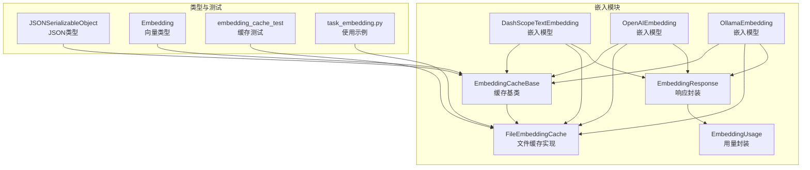
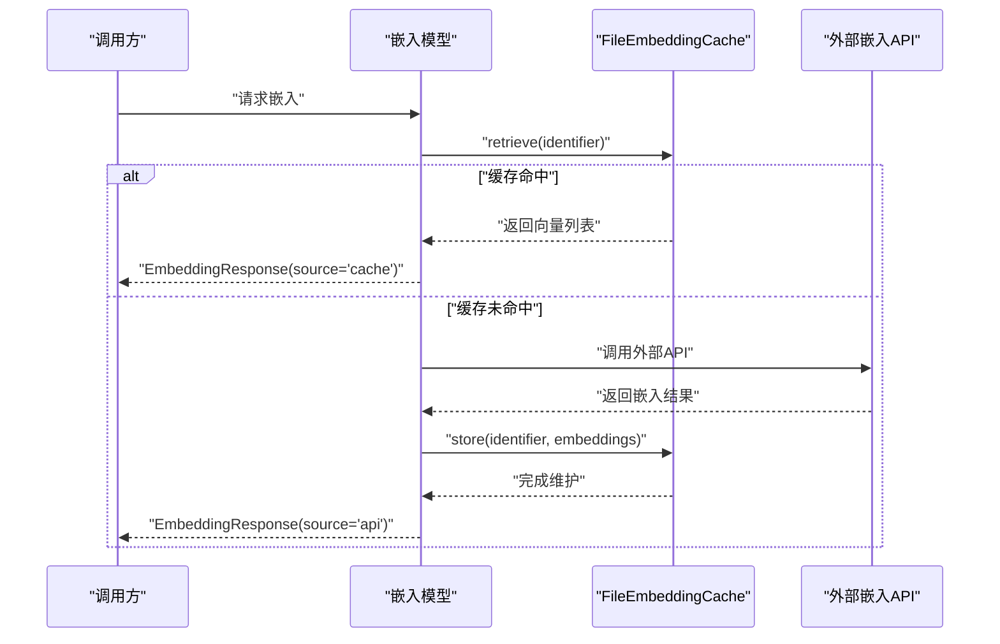
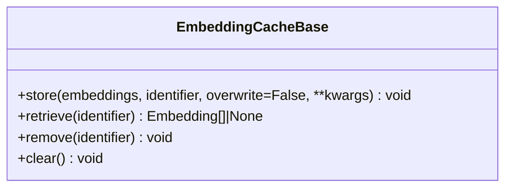
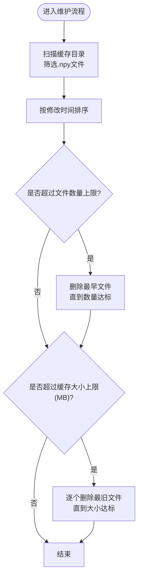
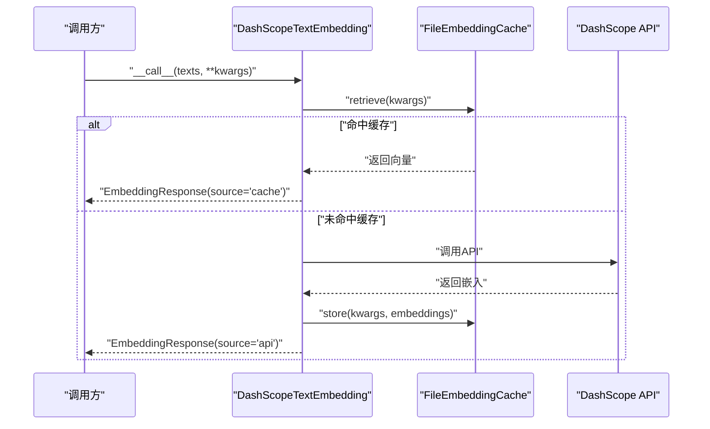
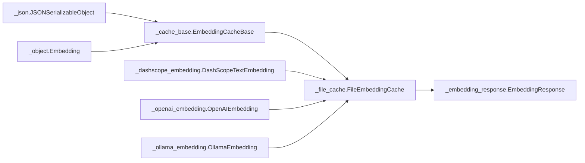

# 缓存机制

<cite>
**本文引用的文件**
- [embedding/_cache_base.py](file://src/agentscope/embedding/_cache_base.py)
- [embedding/_file_cache.py](file://src/agentscope/embedding/_file_cache.py)
- [embedding/_dashscope_embedding.py](file://src/agentscope/embedding/_dashscope_embedding.py)
- [embedding/_openai_embedding.py](file://src/agentscope/embedding/_openai_embedding.py)
- [embedding/_ollama_embedding.py](file://src/agentscope/embedding/_ollama_embedding.py)
- [embedding/_embedding_response.py](file://src/agentscope/embedding/_embedding_response.py)
- [embedding/_embedding_usage.py](file://src/agentscope/embedding/_embedding_usage.py)
- [types/_json.py](file://src/agentscope/types/_json.py)
- [types/_object.py](file://src/agentscope/types/_object.py)
- [embedding_cache_test.py](file://tests/embedding_cache_test.py)
- [task_embedding.py](file://docs/tutorial/zh_CN/src/task_embedding.py)
</cite>

## 目录
1. [简介](#简介)
2. [项目结构](#项目结构)
3. [核心组件](#核心组件)
4. [架构总览](#架构总览)
5. [详细组件分析](#详细组件分析)
6. [依赖分析](#依赖分析)
7. [性能考虑](#性能考虑)
8. [故障排除指南](#故障排除指南)
9. [结论](#结论)
10. [附录](#附录)

## 简介
本技术文档围绕 AgentScope 的嵌入向量缓存机制展开，重点解释缓存基类的设计与接口、文件缓存的实现原理（文件系统存储、哈希索引、过期与维护策略）、缓存策略选择与优化（命中率、内存与磁盘控制）、失效与清理策略（时间戳、大小限制、LRU 淘汰），并提供配置最佳实践、性能监控与故障排除建议。文档内容基于仓库中的嵌入缓存实现与测试用例进行深入分析，并辅以可视化图示帮助理解。

## 项目结构
与缓存机制直接相关的代码主要位于 embedding 子模块，核心文件包括：
- 缓存基类：定义统一的异步缓存接口
- 文件缓存实现：基于文件系统的持久化缓存
- 嵌入模型：在调用外部 API 前后使用缓存
- 类型定义：JSON 可序列化对象、Embedding 向量等
- 测试与教程：验证缓存行为与使用示例

图表来源
- [embedding/_cache_base.py:12-64](file://src/agentscope/embedding/_cache_base.py#L12-L64)
- [embedding/_file_cache.py:19-188](file://src/agentscope/embedding/_file_cache.py#L19-L188)
- [embedding/_dashscope_embedding.py:14-170](file://src/agentscope/embedding/_dashscope_embedding.py#L14-L170)
- [embedding/_openai_embedding.py:1-120](file://src/agentscope/embedding/_openai_embedding.py#L1-L120)
- [embedding/_ollama_embedding.py:1-120](file://src/agentscope/embedding/_ollama_embedding.py#L1-L120)
- [embedding/_embedding_response.py:12-32](file://src/agentscope/embedding/_embedding_response.py#L12-L32)
- [types/_json.py:14-21](file://src/agentscope/types/_json.py#L14-L21)
- [types/_object.py:5-6](file://src/agentscope/types/_object.py#L5-L6)
- [embedding_cache_test.py:13-169](file://tests/embedding_cache_test.py#L13-L169)
- [task_embedding.py:83-132](file://docs/tutorial/zh_CN/src/task_embedding.py#L83-L132)

章节来源
- [embedding/_cache_base.py:1-64](file://src/agentscope/embedding/_cache_base.py#L1-L64)
- [embedding/_file_cache.py:1-188](file://src/agentscope/embedding/_file_cache.py#L1-L188)
- [embedding/_dashscope_embedding.py:1-170](file://src/agentscope/embedding/_dashscope_embedding.py#L1-L170)
- [embedding/_openai_embedding.py:1-120](file://src/agentscope/embedding/_openai_embedding.py#L1-L120)
- [embedding/_ollama_embedding.py:1-120](file://src/agentscope/embedding/_ollama_embedding.py#L1-L120)
- [embedding/_embedding_response.py:1-32](file://src/agentscope/embedding/_embedding_response.py#L1-L32)
- [types/_json.py:1-22](file://src/agentscope/types/_json.py#L1-L22)
- [types/_object.py:1-6](file://src/agentscope/types/_object.py#L1-L6)
- [embedding_cache_test.py:1-169](file://tests/embedding_cache_test.py#L1-L169)
- [task_embedding.py:1-133](file://docs/tutorial/zh_CN/src/task_embedding.py#L1-L133)

## 核心组件
- 缓存基类：定义统一的异步接口，包括存储、检索、删除、清空等方法，确保不同缓存实现的一致性。
- 文件缓存实现：基于文件系统持久化，使用标识符的 JSON 字符串进行 SHA256 哈希生成稳定文件名，采用 NumPy 二进制格式保存向量，支持数量与大小上限的自动维护。
- 嵌入模型：在调用外部 API 前先尝试从缓存检索，命中则返回缓存结果；未命中则调用 API 并将结果写入缓存，同时返回响应封装对象。
- 类型系统：JSON 可序列化对象与 Embedding 向量类型，保证缓存键的可序列化与向量数据结构的稳定性。

章节来源
- [embedding/_cache_base.py:12-64](file://src/agentscope/embedding/_cache_base.py#L12-L64)
- [embedding/_file_cache.py:19-188](file://src/agentscope/embedding/_file_cache.py#L19-L188)
- [embedding/_dashscope_embedding.py:31-105](file://src/agentscope/embedding/_dashscope_embedding.py#L31-L105)
- [types/_json.py:14-21](file://src/agentscope/types/_json.py#L14-L21)
- [types/_object.py:5-6](file://src/agentscope/types/_object.py#L5-L6)

## 架构总览
下图展示了嵌入模型与缓存之间的交互流程：模型在每次调用前先查询缓存，命中则直接返回缓存结果；未命中则调用外部 API，再将结果写入缓存并返回。

图表来源
- [embedding/_dashscope_embedding.py:63-98](file://src/agentscope/embedding/_dashscope_embedding.py#L63-L98)
- [embedding/_file_cache.py:89-107](file://src/agentscope/embedding/_file_cache.py#L89-L107)
- [embedding/_embedding_response.py:12-32](file://src/agentscope/embedding/_embedding_response.py#L12-L32)

## 详细组件分析

### 缓存基类设计与接口
- 接口职责：定义异步的存储、检索、删除、清空方法，确保缓存实现与上层模型解耦。
- 参数约定：存储支持覆盖选项；检索返回向量列表或空；删除按标识符移除；清空清理全部缓存。
- 设计要点：抽象方法强制子类实现，便于扩展多种缓存后端（如内存、Redis、数据库等）。

图表来源
- [embedding/_cache_base.py:12-64](file://src/agentscope/embedding/_cache_base.py#L12-L64)

章节来源
- [embedding/_cache_base.py:12-64](file://src/agentscope/embedding/_cache_base.py#L12-L64)

### 文件缓存实现原理
- 文件系统存储：每个嵌入向量以独立文件形式持久化，文件名为标识符 JSON 字符串经 SHA256 哈希后的十六进制字符串加 .npy 扩展名。
- 数据结构：向量数组以 NumPy 数组格式保存，读取时转换为 Python 列表，保持与上层模型的数据一致性。
- 访问模式：存储时若同名文件存在且允许覆盖，则更新；否则仅在不存在时写入。检索时根据文件是否存在决定返回值。
- 维护策略：维护阶段对缓存目录内 .npy 文件按修改时间排序，优先移除最旧文件，直至满足数量上限与大小上限条件。

图表来源
- [embedding/_file_cache.py:148-188](file://src/agentscope/embedding/_file_cache.py#L148-L188)

章节来源
- [embedding/_file_cache.py:19-188](file://src/agentscope/embedding/_file_cache.py#L19-L188)

### 嵌入模型中的缓存集成
- DashScope 模型：在调用 API 前先检索缓存，命中则构造响应并标记来源为缓存；未命中则调用 API，成功后写入缓存。
- OpenAI/Ollama 模型：同样遵循“先查缓存、后调 API、再写缓存”的模式，返回统一的响应封装对象。
- 响应封装：包含嵌入向量、用量统计、创建时间、来源标识等字段，便于上层逻辑判断是否命中缓存及统计成本。

图表来源
- [embedding/_dashscope_embedding.py:63-98](file://src/agentscope/embedding/_dashscope_embedding.py#L63-L98)
- [embedding/_embedding_response.py:12-32](file://src/agentscope/embedding/_embedding_response.py#L12-L32)

章节来源
- [embedding/_dashscope_embedding.py:31-105](file://src/agentscope/embedding/_dashscope_embedding.py#L31-L105)
- [embedding/_openai_embedding.py:78-109](file://src/agentscope/embedding/_openai_embedding.py#L78-L109)
- [embedding/_ollama_embedding.py:74-106](file://src/agentscope/embedding/_ollama_embedding.py#L74-L106)
- [embedding/_embedding_response.py:12-32](file://src/agentscope/embedding/_embedding_response.py#L12-L32)

### 缓存策略选择与优化
- 命中率优化：通过合理设计标识符（如模型名、输入文本、维度、参数等）确保相同输入得到相同哈希文件名，从而最大化命中率。
- 内存使用控制：文件缓存以磁盘为主，避免将大量向量加载到内存；但需注意频繁 I/O 可能带来的延迟。
- 磁盘空间管理：通过文件数量上限与缓存大小上限双重约束，结合 LRU（按修改时间排序）策略，定期清理最旧文件，维持缓存目录规模可控。

章节来源
- [embedding/_file_cache.py:148-188](file://src/agentscope/embedding/_file_cache.py#L148-L188)
- [embedding/_dashscope_embedding.py:63-98](file://src/agentscope/embedding/_dashscope_embedding.py#L63-L98)

### 缓存失效策略
- 时间戳检查：维护阶段按文件修改时间排序，优先删除最旧文件，实现基于时间的 LRU 失效。
- 大小限制：当缓存目录总大小超过设定上限时，持续删除最旧文件直至达标，保障磁盘空间不超限。
- 覆盖策略：存储时支持覆盖选项，允许在必要时替换已有缓存文件，配合维护策略实现动态调整。

章节来源
- [embedding/_file_cache.py:132-188](file://src/agentscope/embedding/_file_cache.py#L132-L188)

### 配置最佳实践
- 缓存大小设置：根据可用磁盘空间与典型向量规模估算最大缓存大小（MB），避免频繁触发清理。
- 过期时间配置：文件缓存不直接支持基于时间的过期，可通过维护上限与定期清理策略间接实现“过期”效果。
- 清理策略：建议同时设置文件数量上限与缓存大小上限，平衡命中率与资源占用；在高并发场景下，注意维护过程的 I/O 开销。

章节来源
- [embedding/_file_cache.py:23-44](file://src/agentscope/embedding/_file_cache.py#L23-L44)
- [embedding/_dashscope_embedding.py:91-98](file://src/agentscope/embedding/_dashscope_embedding.py#L91-L98)
- [task_embedding.py:96-106](file://docs/tutorial/zh_CN/src/task_embedding.py#L96-L106)

## 依赖分析
- 基类依赖：文件缓存实现依赖缓存基类提供的统一接口，确保与上层模型解耦。
- 类型依赖：缓存接口使用 JSON 可序列化对象作为标识符，向量类型为浮点数列表，保证跨平台与跨语言兼容性。
- 响应封装：嵌入模型返回统一的响应封装对象，便于上层逻辑识别缓存来源与统计用量。

图表来源
- [embedding/_cache_base.py:12-64](file://src/agentscope/embedding/_cache_base.py#L12-L64)
- [embedding/_file_cache.py:19-188](file://src/agentscope/embedding/_file_cache.py#L19-L188)
- [types/_json.py:14-21](file://src/agentscope/types/_json.py#L14-L21)
- [types/_object.py:5-6](file://src/agentscope/types/_object.py#L5-L6)
- [embedding/_embedding_response.py:12-32](file://src/agentscope/embedding/_embedding_response.py#L12-L32)
- [embedding/_dashscope_embedding.py:31-57](file://src/agentscope/embedding/_dashscope_embedding.py#L31-L57)
- [embedding/_openai_embedding.py:1-120](file://src/agentscope/embedding/_openai_embedding.py#L1-L120)
- [embedding/_ollama_embedding.py:1-120](file://src/agentscope/embedding/_ollama_embedding.py#L1-L120)

章节来源
- [embedding/_cache_base.py:1-64](file://src/agentscope/embedding/_cache_base.py#L1-L64)
- [embedding/_file_cache.py:1-188](file://src/agentscope/embedding/_file_cache.py#L1-L188)
- [types/_json.py:1-22](file://src/agentscope/types/_json.py#L1-L22)
- [types/_object.py:1-6](file://src/agentscope/types/_object.py#L1-L6)
- [embedding/_embedding_response.py:1-32](file://src/agentscope/embedding/_embedding_response.py#L1-L32)
- [embedding/_dashscope_embedding.py:1-170](file://src/agentscope/embedding/_dashscope_embedding.py#L1-L170)
- [embedding/_openai_embedding.py:1-120](file://src/agentscope/embedding/_openai_embedding.py#L1-L120)
- [embedding/_ollama_embedding.py:1-120](file://src/agentscope/embedding/_ollama_embedding.py#L1-L120)

## 性能考虑
- I/O 成本：文件缓存以磁盘为主，频繁读写可能成为瓶颈；建议在高并发场景下评估磁盘吞吐能力与清理频率。
- 命中率：合理的标识符设计与稳定的输入特征有助于提高命中率，减少 API 调用次数与 token 消耗。
- 维护开销：维护阶段需要遍历与排序文件，建议在业务低峰时段执行或降低维护频率。
- 内存占用：文件缓存不将向量加载到内存，适合大规模向量存储；但需关注文件句柄与进程资源限制。

## 故障排除指南
- 文件路径异常：当缓存目录不存在时会自动创建；若路径非文件但已存在，将抛出运行时错误。请检查缓存目录权限与路径有效性。
- 文件不存在：删除操作要求目标文件存在，否则抛出文件未找到异常。请确认标识符与文件名映射正确。
- 维护失败：当缓存大小超过上限时，维护过程会逐个删除最旧文件直至达标；若仍无法满足上限，请检查磁盘空间与文件数量限制。
- 测试验证：通过测试用例可验证缓存行为，包括覆盖策略、LRU 淘汰顺序与清理结果。

章节来源
- [embedding/_file_cache.py:76-124](file://src/agentscope/embedding/_file_cache.py#L76-L124)
- [embedding_cache_test.py:70-163](file://tests/embedding_cache_test.py#L70-L163)

## 结论
AgentScope 的嵌入缓存机制通过抽象基类与文件缓存实现，提供了统一、可扩展的缓存接口与可靠的文件系统持久化方案。其基于标识符哈希与 LRU 维护策略，在命中率、内存与磁盘资源之间取得平衡。结合嵌入模型的缓存集成与响应封装，用户可在不改变上层调用方式的前提下显著降低 API 调用成本与延迟。建议在生产环境中根据数据规模与硬件条件合理配置缓存上限，并在高并发场景下关注 I/O 与维护开销。

## 附录
- 使用示例：教程中提供了完整的缓存使用示例，展示如何初始化文件缓存并在嵌入模型中启用缓存，验证缓存命中与性能提升。
- 配置参考：缓存目录、文件数量上限、缓存大小上限等参数均可在文件缓存构造函数中配置，建议结合实际业务需求进行调优。

章节来源
- [task_embedding.py:83-132](file://docs/tutorial/zh_CN/src/task_embedding.py#L83-L132)
- [embedding/_file_cache.py:23-44](file://src/agentscope/embedding/_file_cache.py#L23-L44)