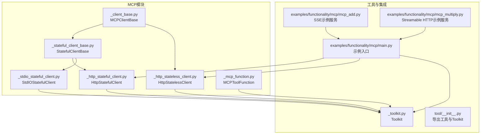
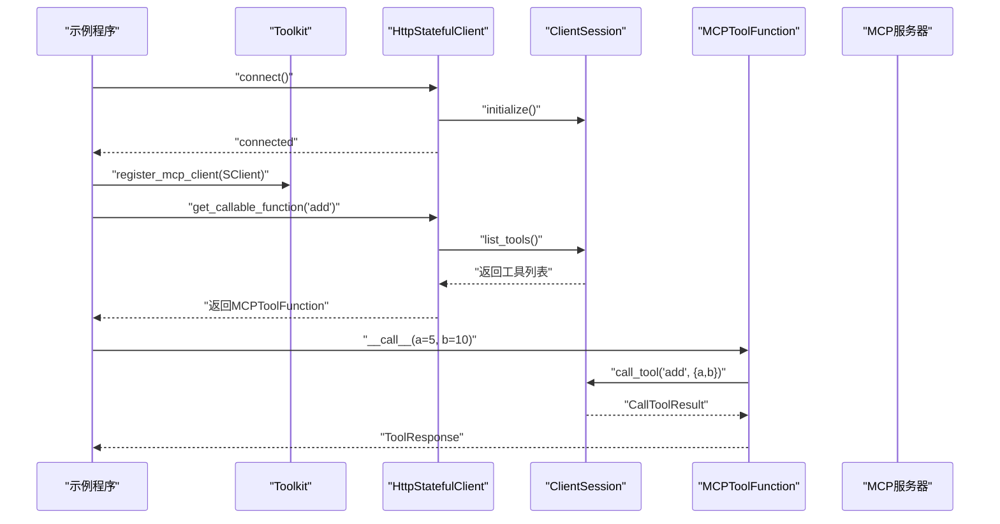
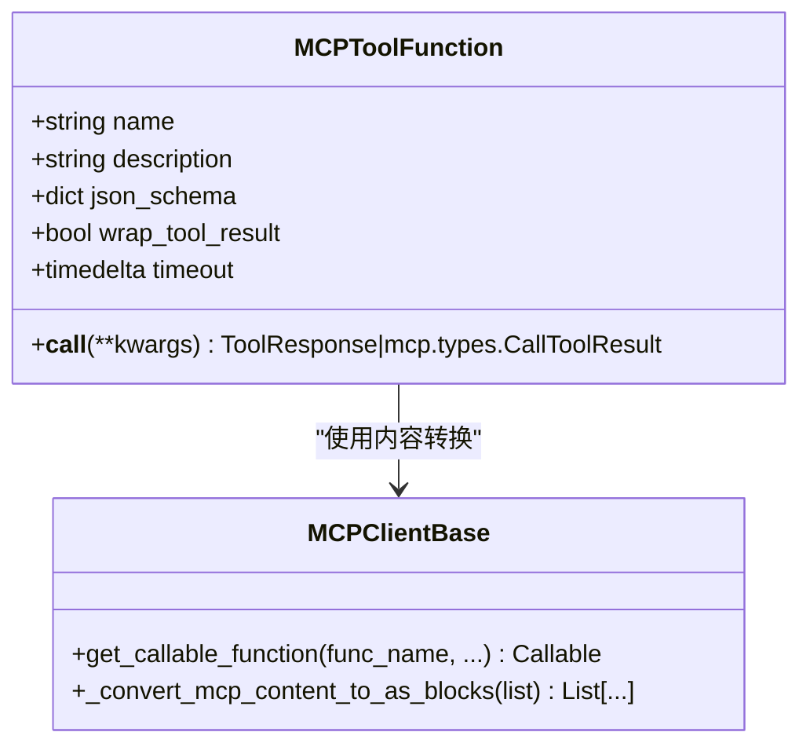
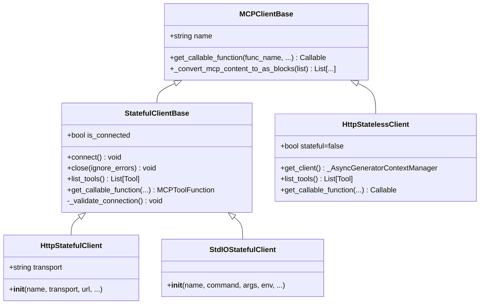
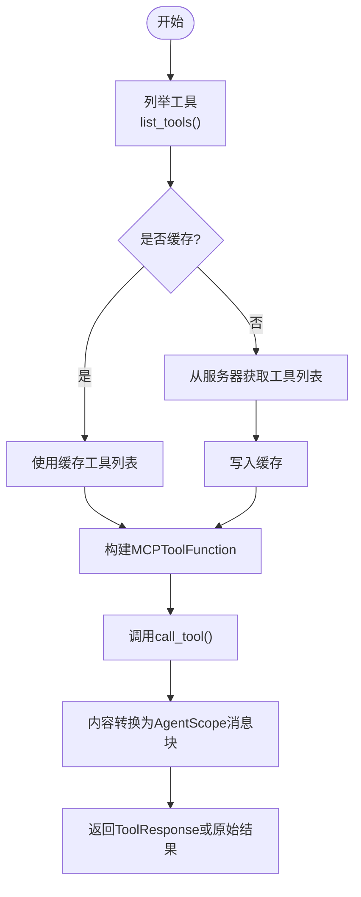
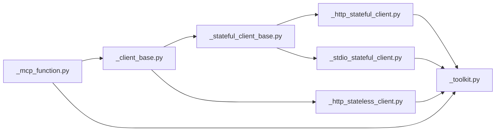

# MCP客户端集成

<cite>
**本文引用的文件**
- [mcp/__init__.py](file://src/agentscope/mcp/__init__.py)
- [_client_base.py](file://src/agentscope/mcp/_client_base.py)
- [_stateful_client_base.py](file://src/agentscope/mcp/_stateful_client_base.py)
- [_http_stateful_client.py](file://src/agentscope/mcp/_http_stateful_client.py)
- [_http_stateless_client.py](file://src/agentscope/mcp/_http_stateless_client.py)
- [_mcp_function.py](file://src/agentscope/mcp/_mcp_function.py)
- [_stdio_stateful_client.py](file://src/agentscope/mcp/_stdio_stateful_client.py)
- [_toolkit.py](file://src/agentscope/tool/_toolkit.py)
- [tool/__init__.py](file://src/agentscope/tool/__init__.py)
- [main.py（示例）](file://examples/functionality/mcp/main.py)
- [mcp_add.py（示例）](file://examples/functionality/mcp/mcp_add.py)
- [mcp_multiply.py（示例）](file://examples/functionality/mcp/mcp_multiply.py)
</cite>

## 目录
1. [简介](#简介)
2. [项目结构](#项目结构)
3. [核心组件](#核心组件)
4. [架构总览](#架构总览)
5. [详细组件分析](#详细组件分析)
6. [依赖分析](#依赖分析)
7. [性能考虑](#性能考虑)
8. [故障排除指南](#故障排除指南)
9. [结论](#结论)
10. [附录](#附录)

## 简介
本技术文档面向需要在AgentScope中集成MCP（Model Context Protocol）客户端的开发者，系统性阐述MCP协议在AgentScope中的实现方式与最佳实践。重点覆盖以下方面：
- MCPToolFunction的设计架构与职责边界
- 客户端基类的功能抽象与扩展点
- 状态管理机制：有状态与无状态客户端的差异、生命周期管理与资源回收
- HTTP有状态与HTTP无状态客户端的区别与适用场景：连接管理、会话保持、资源复用策略
- MCP工具函数的本地化封装过程：远程工具的发现、注册、调用流程
- 配置与使用指南：认证机制、超时设置、重试策略
- 具体的MCP集成示例、故障排除方法、性能监控技巧
- MCP与传统工具函数的差异与迁移策略

## 项目结构
AgentScope的MCP模块位于src/agentscope/mcp目录，围绕“客户端基类—具体客户端—工具函数封装”三层结构组织，配合工具箱（Toolkit）完成MCP工具的注册与统一调度。

图表来源
- [mcp/__init__.py:1-21](file://src/agentscope/mcp/__init__.py#L1-L21)
- [_client_base.py:1-103](file://src/agentscope/mcp/_client_base.py#L1-L103)
- [_stateful_client_base.py:1-177](file://src/agentscope/mcp/_stateful_client_base.py#L1-L177)
- [_http_stateful_client.py:1-85](file://src/agentscope/mcp/_http_stateful_client.py#L1-L85)
- [_http_stateless_client.py:1-153](file://src/agentscope/mcp/_http_stateless_client.py#L1-L153)
- [_stdio_stateful_client.py:1-78](file://src/agentscope/mcp/_stdio_stateful_client.py#L1-L78)
- [_mcp_function.py:1-116](file://src/agentscope/mcp/_mcp_function.py#L1-L116)
- [_toolkit.py:1-200](file://src/agentscope/tool/_toolkit.py#L1-L200)
- [tool/__init__.py:1-45](file://src/agentscope/tool/__init__.py#L1-L45)
- [main.py（示例）:1-111](file://examples/functionality/mcp/main.py#L1-L111)
- [mcp_add.py（示例）:1-17](file://examples/functionality/mcp/mcp_add.py#L1-L17)
- [mcp_multiply.py（示例）:1-17](file://examples/functionality/mcp/mcp_multiply.py#L1-L17)

章节来源
- [mcp/__init__.py:1-21](file://src/agentscope/mcp/__init__.py#L1-L21)
- [_client_base.py:1-103](file://src/agentscope/mcp/_client_base.py#L1-L103)
- [_stateful_client_base.py:1-177](file://src/agentscope/mcp/_stateful_client_base.py#L1-L177)
- [_http_stateful_client.py:1-85](file://src/agentscope/mcp/_http_stateful_client.py#L1-L85)
- [_http_stateless_client.py:1-153](file://src/agentscope/mcp/_http_stateless_client.py#L1-L153)
- [_stdio_stateful_client.py:1-78](file://src/agentscope/mcp/_stdio_stateful_client.py#L1-L78)
- [_mcp_function.py:1-116](file://src/agentscope/mcp/_mcp_function.py#L1-L116)
- [_toolkit.py:1-200](file://src/agentscope/tool/_toolkit.py#L1-L200)
- [tool/__init__.py:1-45](file://src/agentscope/tool/__init__.py#L1-L45)
- [main.py（示例）:1-111](file://examples/functionality/mcp/main.py#L1-L111)
- [mcp_add.py（示例）:1-17](file://examples/functionality/mcp/mcp_add.py#L1-L17)
- [mcp_multiply.py（示例）:1-17](file://examples/functionality/mcp/mcp_multiply.py#L1-L17)

## 核心组件
- MCPClientBase：MCP客户端的抽象基类，定义了获取可调用工具函数的标准接口，并提供MCP内容到AgentScope消息块的转换能力。
- StatefulClientBase：有状态客户端的抽象基类，负责生命周期管理（connect/close）、会话缓存与校验、工具列表缓存与查询。
- HttpStatefulClient：基于HTTP的有状态客户端，支持SSE与Streamable HTTP两种传输；维护跨多次工具调用的会话。
- HttpStatelessClient：基于HTTP的无状态客户端，每次工具调用创建/销毁会话，适合轻量、短任务场景。
- StdIOStatefulClient：通过标准输入输出启动并连接本地MCP服务器的有状态客户端，适用于本地开发与测试。
- MCPToolFunction：对单个MCP工具的本地化封装，负责参数Schema提取、调用执行、结果包装与内容转换。
- Toolkit：工具集管理器，负责注册MCP客户端、解析工具Schema、统一调度与中间件链路。

章节来源
- [_client_base.py:18-103](file://src/agentscope/mcp/_client_base.py#L18-L103)
- [_stateful_client_base.py:16-177](file://src/agentscope/mcp/_stateful_client_base.py#L16-L177)
- [_http_stateful_client.py:11-85](file://src/agentscope/mcp/_http_stateful_client.py#L11-L85)
- [_http_stateless_client.py:16-153](file://src/agentscope/mcp/_http_stateless_client.py#L16-L153)
- [_stdio_stateful_client.py:11-78](file://src/agentscope/mcp/_stdio_stateful_client.py#L11-L78)
- [_mcp_function.py:15-116](file://src/agentscope/mcp/_mcp_function.py#L15-L116)
- [_toolkit.py:117-200](file://src/agentscope/tool/_toolkit.py#L117-L200)

## 架构总览
下图展示了MCP客户端在AgentScope中的整体交互：客户端负责与远端MCP服务器建立会话、列举工具、封装为本地可调用函数；工具箱负责注册与统一调度；示例程序演示了ReAct智能体如何使用这些工具。

图表来源
- [main.py（示例）:34-108](file://examples/functionality/mcp/main.py#L34-L108)
- [_stateful_client_base.py:46-110](file://src/agentscope/mcp/_stateful_client_base.py#L46-L110)
- [_mcp_function.py:82-116](file://src/agentscope/mcp/_mcp_function.py#L82-L116)

## 详细组件分析

### MCPToolFunction设计与调用流程
MCPToolFunction是MCP工具的本地封装，承担以下职责：
- 从MCP工具元数据提取JSON Schema，供Agent与Toolkit进行参数校验与提示
- 支持两种调用路径：通过client生成器创建一次性会话，或直接使用已有会话
- 执行call_tool并按需将结果转换为AgentScope的ToolResponse，包含多模态内容块

图表来源
- [_mcp_function.py:15-116](file://src/agentscope/mcp/_mcp_function.py#L15-L116)
- [_client_base.py:31-103](file://src/agentscope/mcp/_client_base.py#L31-L103)

章节来源
- [_mcp_function.py:15-116](file://src/agentscope/mcp/_mcp_function.py#L15-L116)
- [_client_base.py:31-103](file://src/agentscope/mcp/_client_base.py#L31-L103)

### 客户端基类与状态管理
- MCPClientBase：定义统一接口与内容转换工具，屏蔽不同传输细节
- StatefulClientBase：引入连接生命周期管理（connect/close）、会话初始化、工具列表缓存、连接有效性校验
- HttpStatefulClient：选择SSE或Streamable HTTP作为传输，持有底层客户端实例，适合需要跨调用保持状态的场景
- HttpStatelessClient：每次调用创建/销毁会话，适合短任务、低延迟场景
- StdIOStatefulClient：通过进程启动本地MCP服务器，适合开发与测试

图表来源
- [_client_base.py:18-103](file://src/agentscope/mcp/_client_base.py#L18-L103)
- [_stateful_client_base.py:16-177](file://src/agentscope/mcp/_stateful_client_base.py#L16-L177)
- [_http_stateful_client.py:11-85](file://src/agentscope/mcp/_http_stateful_client.py#L11-L85)
- [_http_stateless_client.py:16-153](file://src/agentscope/mcp/_http_stateless_client.py#L16-L153)
- [_stdio_stateful_client.py:11-78](file://src/agentscope/mcp/_stdio_stateful_client.py#L11-L78)

章节来源
- [_client_base.py:18-103](file://src/agentscope/mcp/_client_base.py#L18-L103)
- [_stateful_client_base.py:16-177](file://src/agentscope/mcp/_stateful_client_base.py#L16-L177)
- [_http_stateful_client.py:11-85](file://src/agentscope/mcp/_http_stateful_client.py#L11-L85)
- [_http_stateless_client.py:16-153](file://src/agentscope/mcp/_http_stateless_client.py#L16-L153)
- [_stdio_stateful_client.py:11-78](file://src/agentscope/mcp/_stdio_stateful_client.py#L11-L78)

### HTTP有状态与无状态客户端对比与适用场景
- 连接管理
  - 有状态：connect建立持久会话，close释放资源；适合长生命周期任务与需要状态保持的交互式服务器
  - 无状态：每次调用创建/销毁会话，适合短任务、批处理、低延迟场景
- 会话保持
  - 有状态：同一会话贯穿多次工具调用，适合浏览器、聊天等需要上下文保持的场景
  - 无状态：每次调用独立会话，避免状态污染
- 资源复用
  - 有状态：连接池/会话复用，减少握手开销
  - 无状态：按需创建，资源占用更可控
- 传输类型
  - SSE：适合事件流推送、实时更新
  - Streamable HTTP：适合请求-响应式工具调用

章节来源
- [_http_stateful_client.py:11-85](file://src/agentscope/mcp/_http_stateful_client.py#L11-L85)
- [_http_stateless_client.py:16-153](file://src/agentscope/mcp/_http_stateless_client.py#L16-L153)

### 工具函数本地化封装流程
- 发现：HttpStatelessClient通过list_tools获取可用工具；StatefulClientBase缓存工具列表
- 注册：Toolkit注册MCP客户端，自动解析工具Schema并暴露给Agent
- 调用：通过MCPToolFunction封装后的可调用对象，传入参数并执行call_tool，最终返回ToolResponse或原始结果

图表来源
- [_http_stateless_client.py:139-153](file://src/agentscope/mcp/_http_stateless_client.py#L139-L153)
- [_stateful_client_base.py:97-110](file://src/agentscope/mcp/_stateful_client_base.py#L97-L110)
- [_mcp_function.py:82-116](file://src/agentscope/mcp/_mcp_function.py#L82-L116)
- [_client_base.py:40-103](file://src/agentscope/mcp/_client_base.py#L40-L103)

章节来源
- [_http_stateless_client.py:92-153](file://src/agentscope/mcp/_http_stateless_client.py#L92-L153)
- [_stateful_client_base.py:97-162](file://src/agentscope/mcp/_stateful_client_base.py#L97-L162)
- [_mcp_function.py:27-116](file://src/agentscope/mcp/_mcp_function.py#L27-L116)
- [_client_base.py:40-103](file://src/agentscope/mcp/_client_base.py#L40-L103)

### 配置与使用指南
- 认证机制
  - 可通过headers参数传递认证头（如Authorization），由底层SDK处理
- 超时设置
  - 请求超时：timeout（秒）
  - SSE读取超时：sse_read_timeout（秒）
  - 工具执行超时：MCPToolFunction构造时传入timeout（秒）
- 重试策略
  - SDK未内置重试；可在上层封装自定义重试逻辑（指数退避、幂等判断）
- 示例要点
  - 有状态客户端需先connect再使用，最后close
  - 无状态客户端每次调用自动创建/销毁会话
  - 可通过wrap_tool_result控制是否将结果包装为ToolResponse

章节来源
- [_http_stateful_client.py:31-85](file://src/agentscope/mcp/_http_stateful_client.py#L31-L85)
- [_http_stateless_client.py:30-91](file://src/agentscope/mcp/_http_stateless_client.py#L30-L91)
- [_mcp_function.py:27-68](file://src/agentscope/mcp/_mcp_function.py#L27-L68)
- [main.py（示例）:34-108](file://examples/functionality/mcp/main.py#L34-L108)

### MCP与传统工具函数的差异与迁移策略
- 差异
  - MCP工具通过远程服务器提供，具备标准化Schema与多模态内容返回；传统工具通常在本地执行
  - MCP工具调用涉及网络与会话管理，需要考虑超时、重连与状态保持
- 迁移策略
  - 将本地工具函数封装为MCPToolFunction，保持调用接口一致
  - 使用Toolkit统一注册MCP客户端与本地工具，实现平滑过渡
  - 逐步将关键工具迁移到MCP服务器，保留本地工具用于快速原型与离线场景

章节来源
- [_toolkit.py:117-200](file://src/agentscope/tool/_toolkit.py#L117-L200)
- [_mcp_function.py:15-116](file://src/agentscope/mcp/_mcp_function.py#L15-L116)

## 依赖分析
MCP模块内部依赖清晰，遵循“抽象基类—具体实现—封装”的分层设计；与工具箱（Toolkit）通过统一接口对接，形成松耦合。

图表来源
- [_client_base.py:1-103](file://src/agentscope/mcp/_client_base.py#L1-L103)
- [_stateful_client_base.py:1-177](file://src/agentscope/mcp/_stateful_client_base.py#L1-L177)
- [_http_stateful_client.py:1-85](file://src/agentscope/mcp/_http_stateful_client.py#L1-L85)
- [_http_stateless_client.py:1-153](file://src/agentscope/mcp/_http_stateless_client.py#L1-L153)
- [_stdio_stateful_client.py:1-78](file://src/agentscope/mcp/_stdio_stateful_client.py#L1-L78)
- [_mcp_function.py:1-116](file://src/agentscope/mcp/_mcp_function.py#L1-L116)
- [_toolkit.py:1-200](file://src/agentscope/tool/_toolkit.py#L1-L200)

章节来源
- [_client_base.py:1-103](file://src/agentscope/mcp/_client_base.py#L1-L103)
- [_stateful_client_base.py:1-177](file://src/agentscope/mcp/_stateful_client_base.py#L1-L177)
- [_http_stateful_client.py:1-85](file://src/agentscope/mcp/_http_stateful_client.py#L1-L85)
- [_http_stateless_client.py:1-153](file://src/agentscope/mcp/_http_stateless_client.py#L1-L153)
- [_stdio_stateful_client.py:1-78](file://src/agentscope/mcp/_stdio_stateful_client.py#L1-L78)
- [_mcp_function.py:1-116](file://src/agentscope/mcp/_mcp_function.py#L1-L116)
- [_toolkit.py:1-200](file://src/agentscope/tool/_toolkit.py#L1-L200)

## 性能考虑
- 有状态客户端
  - 复用会话降低握手成本，适合长时间运行的任务
  - 注意LIFO关闭顺序，避免资源竞争
- 无状态客户端
  - 每次调用开销小，适合短任务与批处理
  - 合理设置超时，避免长时间阻塞
- 结果转换
  - 多模态内容转换为消息块可能带来额外开销，建议在必要时才启用包装
- 并发与中间件
  - Toolkit支持中间件链路，注意异步生成器的正确使用与背压处理

[本节为通用指导，不直接分析具体文件]

## 故障排除指南
- 连接未建立
  - 有状态客户端：确保先connect再使用，否则会触发连接校验异常
  - 关闭未连接：close前需确认is_connected状态
- 工具未找到
  - list_tools失败或缓存为空：检查服务器可达性与工具声明
- 内容类型不支持
  - EmbeddedResource非文本资源：当前记录日志并跳过，需在上层处理或扩展支持
- SSE/Streamable HTTP差异
  - URL后缀不同：SSE以/sse结尾，Streamable HTTP以/mcp结尾
- LIFO关闭顺序
  - 多实例同时连接时，务必按后进先出顺序关闭，避免潜在错误

章节来源
- [_stateful_client_base.py:46-96](file://src/agentscope/mcp/_stateful_client_base.py#L46-L96)
- [_stateful_client_base.py:164-177](file://src/agentscope/mcp/_stateful_client_base.py#L164-L177)
- [_http_stateless_client.py:139-153](file://src/agentscope/mcp/_http_stateless_client.py#L139-L153)
- [_client_base.py:77-102](file://src/agentscope/mcp/_client_base.py#L77-L102)
- [_http_stateful_client.py:31-85](file://src/agentscope/mcp/_http_stateful_client.py#L31-L85)

## 结论
AgentScope的MCP客户端体系通过清晰的抽象与分层设计，实现了对多种传输与生命周期模式的支持。开发者可根据任务特性选择有状态或无状态客户端，结合Toolkit完成工具的统一注册与调度。通过合理配置超时与中间件，可进一步提升稳定性与可观测性。

[本节为总结性内容，不直接分析具体文件]

## 附录

### 快速开始与示例
- 示例程序展示了如何创建有状态与无状态客户端、注册到Toolkit、并手动调用MCP工具
- 示例服务分别提供SSE与Streamable HTTP传输，便于对照验证

章节来源
- [main.py（示例）:34-108](file://examples/functionality/mcp/main.py#L34-L108)
- [mcp_add.py（示例）:1-17](file://examples/functionality/mcp/mcp_add.py#L1-L17)
- [mcp_multiply.py（示例）:1-17](file://examples/functionality/mcp/mcp_multiply.py#L1-L17)