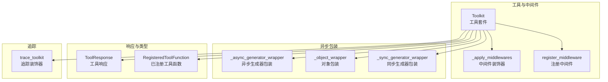
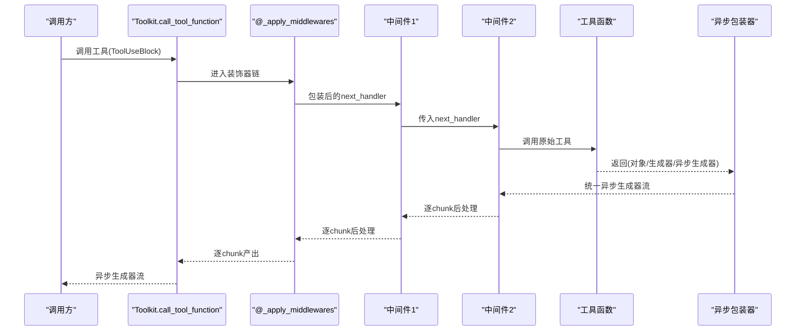
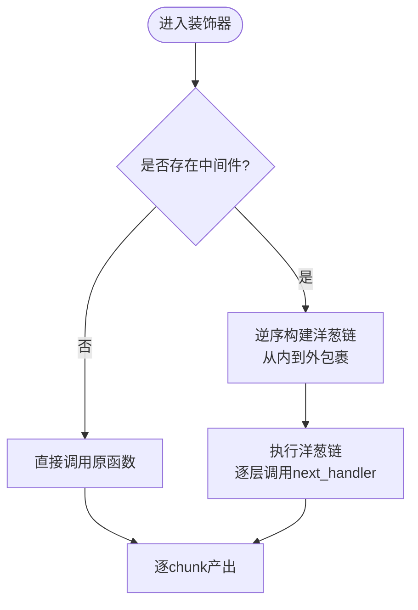
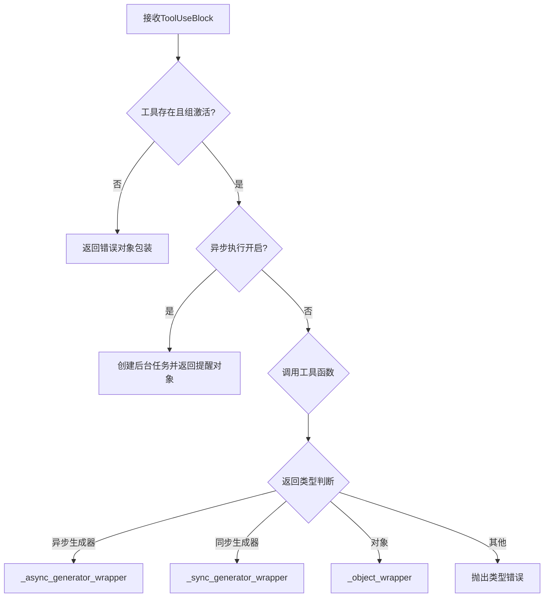
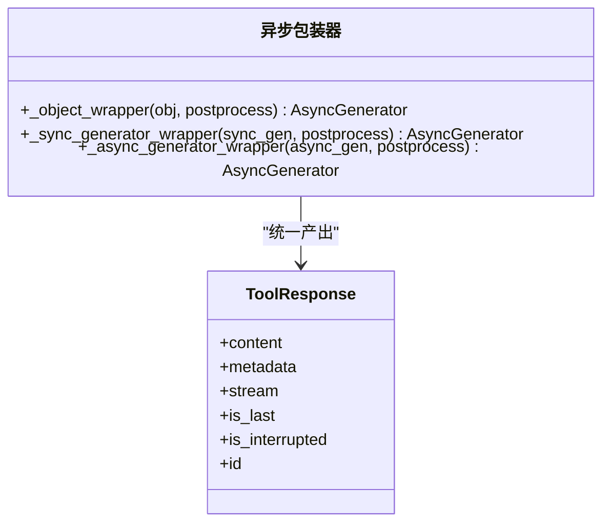
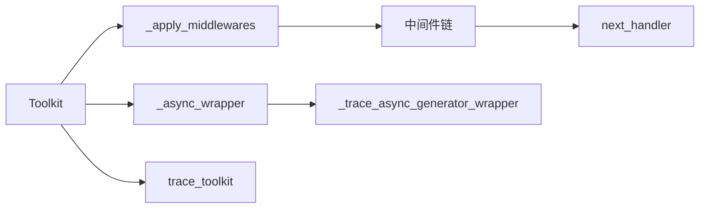

# 中间件系统

<cite>
**本文引用的文件**
- [src/agentscope/tool/_toolkit.py](file://src/agentscope/tool/_toolkit.py)
- [src/agentscope/tool/_async_wrapper.py](file://src/agentscope/tool/_async_wrapper.py)
- [src/agentscope/tool/_response.py](file://src/agentscope/tool/_response.py)
- [src/agentscope/tool/_types.py](file://src/agentscope/tool/_types.py)
- [src/agentscope/tracing/_trace.py](file://src/agentscope/tracing/_trace.py)
- [docs/tutorial/en/src/task_middleware.py](file://docs/tutorial/en/src/task_middleware.py)
- [tests/toolkit_middleware_test.py](file://tests/toolkit_middleware_test.py)
</cite>

## 目录
1. [简介](#简介)
2. [项目结构](#项目结构)
3. [核心组件](#核心组件)
4. [架构总览](#架构总览)
5. [详细组件分析](#详细组件分析)
6. [依赖分析](#依赖分析)
7. [性能考量](#性能考量)
8. [故障排查指南](#故障排查指南)
9. [结论](#结论)
10. [附录](#附录)

## 简介
本文件面向AgentScope工具中间件系统，系统性阐述中间件链的构建原理、执行顺序与异步处理机制，明确中间件实现规范（函数签名、参数传递、返回值处理），解析异步包装器对同步/异步生成器与对象的统一化封装策略，并提供中间件开发指南、调试技巧与常见问题解决方案。中间件当前聚焦于工具执行流程（Toolkit）中的“洋葱模型”拦截与增强。

## 项目结构
中间件系统主要由以下模块构成：
- 工具套件与中间件：Toolkit类负责工具注册、调用与中间件编排
- 中间件装饰器：_apply_middlewares动态构建洋葱链
- 异步包装器：统一处理同步/异步生成器与对象
- 响应与类型：ToolResponse数据结构与RegisteredToolFunction等类型
- 追踪装饰器：trace_toolkit确保可观测性位于最外层

图表来源
- [src/agentscope/tool/_toolkit.py:57-114](file://src/agentscope/tool/_toolkit.py#L57-L114)
- [src/agentscope/tool/_async_wrapper.py:38-110](file://src/agentscope/tool/_async_wrapper.py#L38-L110)
- [src/agentscope/tool/_response.py:11-33](file://src/agentscope/tool/_response.py#L11-L33)
- [src/agentscope/tool/_types.py:15-61](file://src/agentscope/tool/_types.py#L15-L61)
- [src/agentscope/tracing/_trace.py:321-382](file://src/agentscope/tracing/_trace.py#L321-L382)

章节来源
- [src/agentscope/tool/_toolkit.py:57-114](file://src/agentscope/tool/_toolkit.py#L57-L114)
- [src/agentscope/tool/_async_wrapper.py:38-110](file://src/agentscope/tool/_async_wrapper.py#L38-L110)
- [src/agentscope/tool/_response.py:11-33](file://src/agentscope/tool/_response.py#L11-L33)
- [src/agentscope/tool/_types.py:15-61](file://src/agentscope/tool/_types.py#L15-L61)
- [src/agentscope/tracing/_trace.py:321-382](file://src/agentscope/tracing/_trace.py#L321-L382)

## 核心组件
- 中间件装饰器_apply_middlewares：在每次工具调用时从实例读取中间件列表，按“从内到外”的顺序动态构建洋葱链，再逐层调用，最终产出统一的异步生成器流。
- Toolkit.call_tool_function：工具调用入口，负责参数准备、分组激活校验、异步任务管理、返回类型统一封装（同步/异步生成器/对象），并在装饰器链下执行。
- register_middleware：将中间件追加到实例列表，装饰器在运行时按注册顺序构建洋葱链。
- 异步包装器：_async_generator_wrapper/_sync_generator_wrapper/_object_wrapper分别处理异步生成器、同步生成器与对象，统一产出异步生成器流，并支持后处理函数。
- ToolResponse：工具执行结果的数据结构，支持流式标记、中断标记与元数据。
- RegisteredToolFunction：工具函数的注册信息，含JSON Schema、预设参数、后处理函数与异步执行开关等。

章节来源
- [src/agentscope/tool/_toolkit.py:57-114](file://src/agentscope/tool/_toolkit.py#L57-L114)
- [src/agentscope/tool/_toolkit.py:851-1033](file://src/agentscope/tool/_toolkit.py#L851-L1033)
- [src/agentscope/tool/_toolkit.py:1441-1539](file://src/agentscope/tool/_toolkit.py#L1441-L1539)
- [src/agentscope/tool/_async_wrapper.py:38-110](file://src/agentscope/tool/_async_wrapper.py#L38-L110)
- [src/agentscope/tool/_response.py:11-33](file://src/agentscope/tool/_response.py#L11-L33)
- [src/agentscope/tool/_types.py:15-61](file://src/agentscope/tool/_types.py#L15-L61)

## 架构总览
中间件在工具执行流程中的位置与影响范围如下：

图表来源
- [src/agentscope/tool/_toolkit.py:851-1033](file://src/agentscope/tool/_toolkit.py#L851-L1033)
- [src/agentscope/tool/_toolkit.py:57-114](file://src/agentscope/tool/_toolkit.py#L57-L114)
- [src/agentscope/tool/_async_wrapper.py:38-110](file://src/agentscope/tool/_async_wrapper.py#L38-L110)

章节来源
- [src/agentscope/tool/_toolkit.py:851-1033](file://src/agentscope/tool/_toolkit.py#L851-L1033)
- [src/agentscope/tool/_toolkit.py:57-114](file://src/agentscope/tool/_toolkit.py#L57-L114)
- [src/agentscope/tool/_async_wrapper.py:38-110](file://src/agentscope/tool/_async_wrapper.py#L38-L110)

## 详细组件分析

### 中间件装饰器_apply_middlewares
- 动态构建洋葱链：从Toolkit实例读取中间件列表，若为空则直接调用原函数；否则以“从内到外”的顺序包裹，形成层层嵌套的next_handler链。
- 执行顺序控制：注册顺序即洋葱内层优先执行，外层后执行；每个中间件可选择是否调用next_handler，从而实现前置处理、拦截与跳过执行。
- 返回值处理：始终返回异步生成器，保证上层统一消费。

图表来源
- [src/agentscope/tool/_toolkit.py:57-114](file://src/agentscope/tool/_toolkit.py#L57-L114)

章节来源
- [src/agentscope/tool/_toolkit.py:57-114](file://src/agentscope/tool/_toolkit.py#L57-L114)

### 中间件注册与执行顺序
- 注册：通过register_middleware将中间件追加到实例列表，装饰器在运行时按注册顺序构建洋葱链。
- 执行顺序：多中间件时，洋葱模型表现为“前处理按注册顺序，后处理逆序”，即先注册的在外层，最后执行。
- 跳过执行：中间件可不调用next_handler直接产出响应，实现授权检查、缓存命中等场景下的短路。

章节来源
- [src/agentscope/tool/_toolkit.py:1441-1539](file://src/agentscope/tool/_toolkit.py#L1441-L1539)
- [docs/tutorial/en/src/task_middleware.py:302-382](file://docs/tutorial/en/src/task_middleware.py#L302-L382)
- [tests/toolkit_middleware_test.py:60-87](file://tests/toolkit_middleware_test.py#L60-L87)

### 工具调用与返回类型统一封装
- 参数准备：合并预设参数与ToolUseBlock输入，绑定后处理函数（partial）。
- 分组激活：若工具属于非basic组且未激活，返回错误响应对象。
- 异步执行：当工具开启异步执行时，创建后台任务并返回提醒对象。
- 返回类型统一封装：根据工具函数返回类型，分别使用_object_wrapper/_sync_generator_wrapper/_async_generator_wrapper进行统一输出。

图表来源
- [src/agentscope/tool/_toolkit.py:851-1033](file://src/agentscope/tool/_toolkit.py#L851-L1033)
- [src/agentscope/tool/_async_wrapper.py:38-110](file://src/agentscope/tool/_async_wrapper.py#L38-L110)

章节来源
- [src/agentscope/tool/_toolkit.py:851-1033](file://src/agentscope/tool/_toolkit.py#L851-L1033)
- [src/agentscope/tool/_async_wrapper.py:38-110](file://src/agentscope/tool/_async_wrapper.py#L38-L110)

### 异步包装器（_async_wrapper模块）
- _object_wrapper：将单个ToolResponse对象包装为异步生成器，便于统一处理。
- _sync_generator_wrapper：将同步生成器逐chunk产出，同时应用后处理函数。
- _async_generator_wrapper：将异步生成器逐chunk产出，捕获CancelledError并在最后一个chunk中注入中断信息，确保异常传播与可观测性。

图表来源
- [src/agentscope/tool/_async_wrapper.py:38-110](file://src/agentscope/tool/_async_wrapper.py#L38-L110)
- [src/agentscope/tool/_response.py:11-33](file://src/agentscope/tool/_response.py#L11-L33)

章节来源
- [src/agentscope/tool/_async_wrapper.py:38-110](file://src/agentscope/tool/_async_wrapper.py#L38-L110)
- [src/agentscope/tool/_response.py:11-33](file://src/agentscope/tool/_response.py#L11-L33)

### 中间件实现规范
- 函数签名：接受kwargs（字典）与next_handler（可调用），返回异步生成器，逐chunk产出ToolResponse。
- 参数传递：kwargs当前包含tool_call（ToolUseBlock），可扩展用于上下文传递。
- 返回值处理：必须产出异步生成器，允许在yield前进行前置处理，在yield后进行后置处理；可选择不调用next_handler以跳过工具执行。
- 后处理函数：工具级postprocess_func与中间件均可对ToolResponse进行后处理，支持同步或异步。

章节来源
- [src/agentscope/tool/_toolkit.py:1441-1539](file://src/agentscope/tool/_toolkit.py#L1441-L1539)
- [src/agentscope/tool/_types.py:41-60](file://src/agentscope/tool/_types.py#L41-L60)
- [docs/tutorial/en/src/task_middleware.py:36-73](file://docs/tutorial/en/src/task_middleware.py#L36-L73)

### 追踪装饰器与中间件链位置
- trace_toolkit装饰器位于洋葱链最外层，确保中间件链内部的完整可观测性。
- 异步生成器包装器也提供对应的_trace_async_generator_wrapper，用于追踪异步流。

章节来源
- [src/agentscope/tracing/_trace.py:321-382](file://src/agentscope/tracing/_trace.py#L321-L382)
- [src/agentscope/tracing/_trace.py:133-190](file://src/agentscope/tracing/_trace.py#L133-L190)

## 依赖分析
- Toolkit对中间件装饰器的依赖：通过装饰器在调用入口处插入洋葱链。
- Toolkit对异步包装器的依赖：统一处理不同返回类型的工具函数。
- 中间件对next_handler的依赖：通过调用next_handler实现链式传递。
- 追踪装饰器对异步包装器的依赖：在异步生成器上进行span属性设置与状态结束。

图表来源
- [src/agentscope/tool/_toolkit.py:851-1033](file://src/agentscope/tool/_toolkit.py#L851-L1033)
- [src/agentscope/tool/_toolkit.py:57-114](file://src/agentscope/tool/_toolkit.py#L57-L114)
- [src/agentscope/tool/_async_wrapper.py:38-110](file://src/agentscope/tool/_async_wrapper.py#L38-L110)
- [src/agentscope/tracing/_trace.py:321-382](file://src/agentscope/tracing/_trace.py#L321-L382)

章节来源
- [src/agentscope/tool/_toolkit.py:851-1033](file://src/agentscope/tool/_toolkit.py#L851-L1033)
- [src/agentscope/tool/_toolkit.py:57-114](file://src/agentscope/tool/_toolkit.py#L57-L114)
- [src/agentscope/tool/_async_wrapper.py:38-110](file://src/agentscope/tool/_async_wrapper.py#L38-L110)
- [src/agentscope/tracing/_trace.py:321-382](file://src/agentscope/tracing/_trace.py#L321-L382)

## 性能考量
- 中间件链深度：每增加一个中间件都会引入一次await与一次迭代开销，建议仅在必要时注册中间件。
- 异步生成器与取消：_async_generator_wrapper对CancelledError进行捕获并注入中断信息，避免异常丢失，但需注意异常传播路径的清晰性。
- 后处理函数：工具级与中间件级后处理均可能带来额外计算，建议在必要时启用并尽量保持轻量。
- 异步任务：当工具开启异步执行时，后台任务会占用内存与资源，需配合view_task/wait_task/cancel_task进行管理。

[本节为通用指导，无需特定文件引用]

## 故障排查指南
- 中间件未生效：确认中间件通过register_middleware正确注册，且装饰器在调用入口处生效。
- 执行顺序不符合预期：检查中间件注册顺序，洋葱模型为“前处理按注册顺序，后处理逆序”。
- 返回类型错误：工具函数必须返回ToolResponse对象或生成器/异步生成器，否则抛出类型错误。
- 异步执行中断：CancelledError会被包装为带中断标记的ToolResponse，检查is_interrupted与is_last字段。
- 取消/等待/查看任务：使用cancel_task/view_task/wait_task接口管理异步任务状态。

章节来源
- [src/agentscope/tool/_toolkit.py:1019-1033](file://src/agentscope/tool/_toolkit.py#L1019-L1033)
- [src/agentscope/tool/_async_wrapper.py:85-110](file://src/agentscope/tool/_async_wrapper.py#L85-L110)
- [src/agentscope/tool/_toolkit.py:1541-1685](file://src/agentscope/tool/_toolkit.py#L1541-L1685)

## 结论
AgentScope中间件系统通过_apply_middlewares装饰器在工具调用入口构建洋葱链，结合异步包装器实现对同步/异步生成器与对象的统一输出，trace_toolkit确保可观测性位于最外层。中间件具备强大的前置处理、拦截与后置处理能力，支持跳过执行与条件授权等场景。开发者应遵循中间件签名与返回值规范，合理设计中间件顺序与后处理逻辑，以获得稳定、可观测且高性能的工具执行链路。

[本节为总结，无需特定文件引用]

## 附录

### 中间件开发指南
- 编写模板：接收kwargs与next_handler，按需修改tool_call，调用next_handler并逐chunk处理响应，最后yield。
- 错误处理模式：在中间件中捕获异常并返回错误响应，或在工具级后处理中统一处理。
- 性能考虑：减少不必要的后处理与IO操作，避免在中间件中阻塞事件循环。

章节来源
- [docs/tutorial/en/src/task_middleware.py:36-73](file://docs/tutorial/en/src/task_middleware.py#L36-L73)
- [src/agentscope/tool/_toolkit.py:1441-1539](file://src/agentscope/tool/_toolkit.py#L1441-L1539)

### 调试技巧
- 使用单元测试验证中间件顺序与行为，参考测试样例。
- 在中间件中打印tool_call与响应内容，观察洋葱模型的前后处理效果。
- 利用异步任务接口查看/取消/等待后台任务，定位长时间运行工具的问题。

章节来源
- [tests/toolkit_middleware_test.py:60-87](file://tests/toolkit_middleware_test.py#L60-L87)
- [docs/tutorial/en/src/task_middleware.py:302-382](file://docs/tutorial/en/src/task_middleware.py#L302-L382)