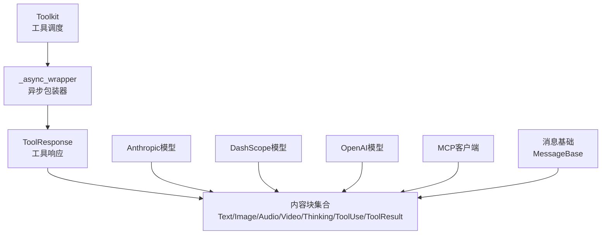
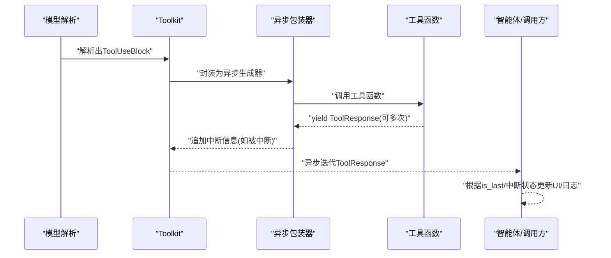
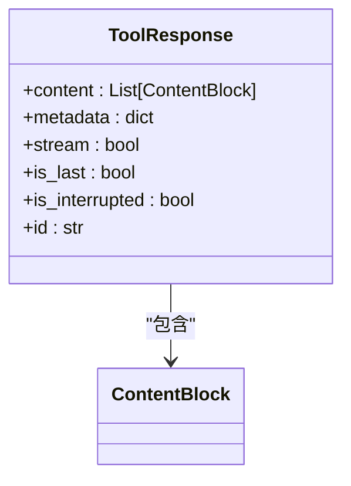
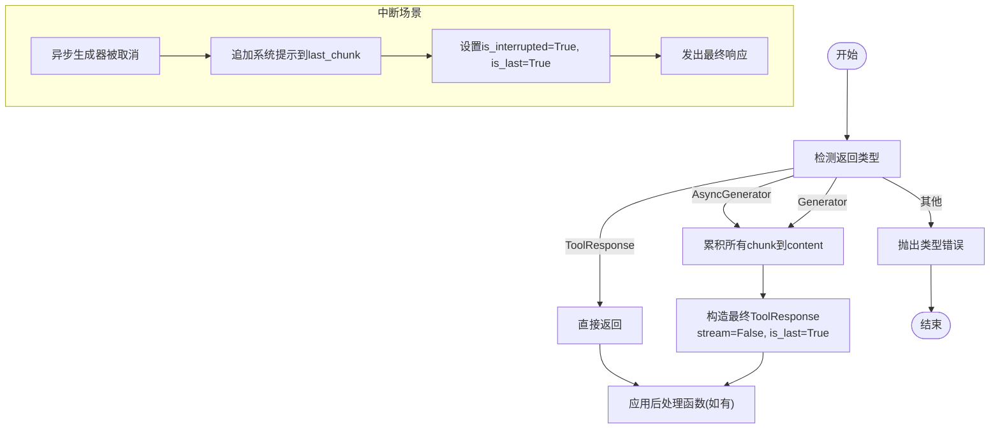
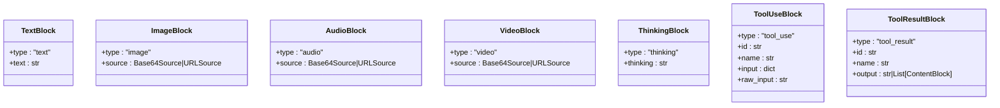
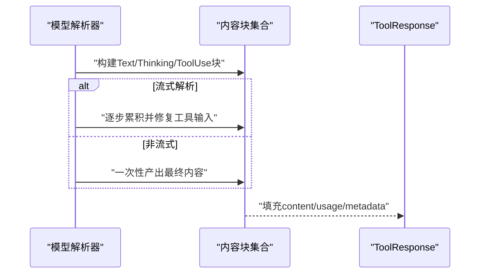
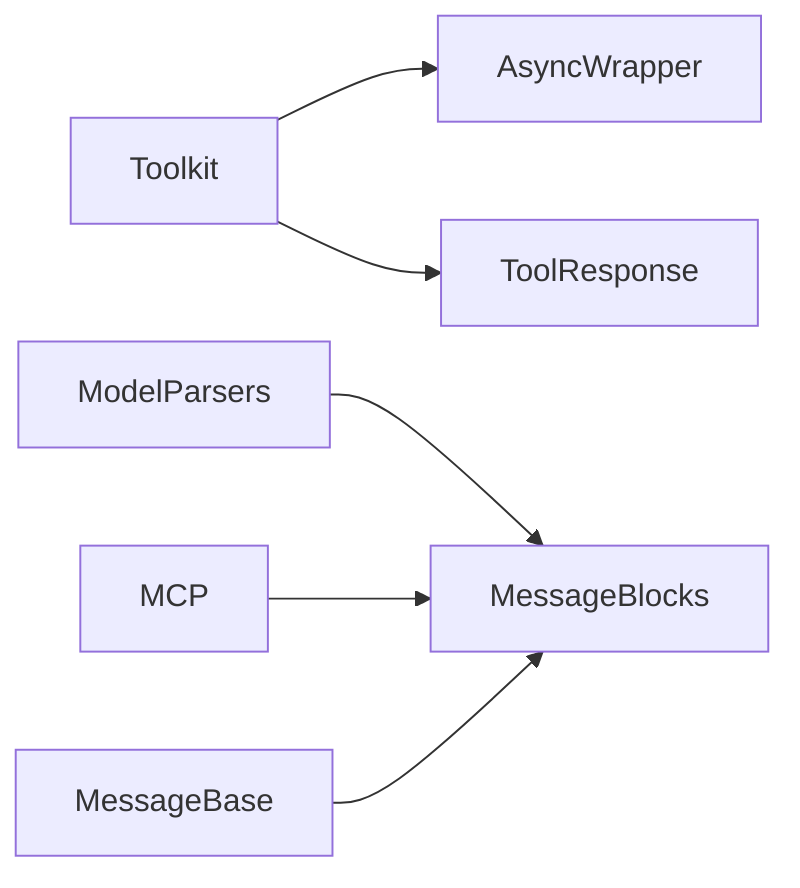

# 工具响应处理

<cite>
**本文引用的文件**
- [src/agentscope/tool/_response.py](file://src/agentscope/tool/_response.py)
- [src/agentscope/message/_message_block.py](file://src/agentscope/message/_message_block.py)
- [src/agentscope/tool/_toolkit.py](file://src/agentscope/tool/_toolkit.py)
- [src/agentscope/tool/_async_wrapper.py](file://src/agentscope/tool/_async_wrapper.py)
- [src/agentscope/model/_anthropic_model.py](file://src/agentscope/model/_anthropic_model.py)
- [src/agentscope/model/_dashscope_model.py](file://src/agentscope/model/_dashscope_model.py)
- [src/agentscope/model/_openai_model.py](file://src/agentscope/model/_openai_model.py)
- [src/agentscope/mcp/_client_base.py](file://src/agentscope/mcp/_client_base.py)
- [src/agentscope/message/_message_base.py](file://src/agentscope/message/_message_base.py)
- [src/agentscope/tool/__init__.py](file://src/agentscope/tool/__init__.py)
- [tests/tool_test.py](file://tests/tool_test.py)
- [tests/toolkit_basic_test.py](file://tests/toolkit_basic_test.py)
- [tests/toolkit_async_execution_test.py](file://tests/toolkit_async_execution_test.py)
- [docs/tutorial/en/src/task_tool.py](file://docs/tutorial/en/src/task_tool.py)
- [docs/tutorial/zh_CN/src/task_tool.py](file://docs/tutorial/zh_CN/src/task_tool.py)
- [examples/functionality/stream_printing_messages/single_agent.py](file://examples/functionality/stream_printing_messages/single_agent.py)
- [examples/functionality/stream_printing_messages/multi_agent.py](file://examples/functionality/stream_printing_messages/multi_agent.py)
</cite>

## 目录
1. [引言](#引言)
2. [项目结构](#项目结构)
3. [核心组件](#核心组件)
4. [架构总览](#架构总览)
5. [详细组件分析](#详细组件分析)
6. [依赖分析](#依赖分析)
7. [性能考虑](#性能考虑)
8. [故障排查指南](#故障排查指南)
9. [结论](#结论)
10. [附录](#附录)

## 引言
本技术文档围绕AgentScope的“工具响应处理”体系，系统阐述ToolResponse类的设计与使用，涵盖content属性的结构化设计、stream与is_last/is_interrupted标志位的语义、多模态内容块的组装与解析、响应的标准化与统一编码、以及在工具执行流程中的关键作用。文档同时提供最佳实践、示例路径、调试技巧与性能优化建议，帮助开发者在复杂工具链中实现稳定、可观察、可中断的响应处理。

## 项目结构
与工具响应处理直接相关的核心模块如下：
- 响应定义：ToolResponse（工具调用结果）
- 内容块定义：TextBlock、ImageBlock、AudioBlock、VideoBlock、ThinkingBlock、ToolUseBlock、ToolResultBlock
- 工具执行与封装：Toolkit（统一调度）、异步包装器（_async_wrapper）
- 模型侧集成：Anthropic/DashScope/OpenAI等模型对ToolUse/ToolResult的解析与组装
- MCP客户端：将外部协议内容转换为内部消息块
- 示例与测试：单/多智能体流式打印、工具中断示例、单元测试

图表来源
- [src/agentscope/tool/_response.py:11-33](file://src/agentscope/tool/_response.py#L11-L33)
- [src/agentscope/message/_message_block.py:9-129](file://src/agentscope/message/_message_block.py#L9-L129)
- [src/agentscope/tool/_toolkit.py:750-949](file://src/agentscope/tool/_toolkit.py#L750-L949)
- [src/agentscope/tool/_async_wrapper.py:16-110](file://src/agentscope/tool/_async_wrapper.py#L16-L110)
- [src/agentscope/model/_anthropic_model.py:485-520](file://src/agentscope/model/_anthropic_model.py#L485-L520)
- [src/agentscope/model/_dashscope_model.py:383-418](file://src/agentscope/model/_dashscope_model.py#L383-L418)
- [src/agentscope/model/_openai_model.py:522-558](file://src/agentscope/model/_openai_model.py#L522-L558)
- [src/agentscope/mcp/_client_base.py:48-83](file://src/agentscope/mcp/_client_base.py#L48-L83)
- [src/agentscope/message/_message_base.py:198-216](file://src/agentscope/message/_message_base.py#L198-L216)

章节来源
- [src/agentscope/tool/_response.py:11-33](file://src/agentscope/tool/_response.py#L11-L33)
- [src/agentscope/message/_message_block.py:9-129](file://src/agentscope/message/_message_block.py#L9-L129)
- [src/agentscope/tool/_toolkit.py:750-949](file://src/agentscope/tool/_toolkit.py#L750-L949)
- [src/agentscope/tool/_async_wrapper.py:16-110](file://src/agentscope/tool/_async_wrapper.py#L16-L110)
- [src/agentscope/model/_anthropic_model.py:485-520](file://src/agentscope/model/_anthropic_model.py#L485-L520)
- [src/agentscope/model/_dashscope_model.py:383-418](file://src/agentscope/model/_dashscope_model.py#L383-L418)
- [src/agentscope/model/_openai_model.py:522-558](file://src/agentscope/model/_openai_model.py#L522-L558)
- [src/agentscope/mcp/_client_base.py:48-83](file://src/agentscope/mcp/_client_base.py#L48-L83)
- [src/agentscope/message/_message_base.py:198-216](file://src/agentscope/message/_message_base.py#L198-L216)

## 核心组件
- ToolResponse：统一的工具调用响应载体，包含content（内容块列表）、metadata（元数据）、stream/is_last/is_interrupted（流式与终止语义）、id（唯一标识）。
- 内容块（ContentBlock）：文本、图像、音频、视频、思考、工具调用、工具结果等，用于结构化表达多模态输出。
- Toolkit：负责工具函数的注册、调度、后处理、异步执行与结果聚合；支持将同步/异步/生成器返回值统一封装为流式ToolResponse序列。
- 异步包装器：将对象、同步/异步生成器统一封装为异步生成器，并在中断时优雅注入“已中断”信息并标记is_interrupted/is_last。
- 模型侧集成：各模型在解析大模型输出时，将文本、思考、工具调用等片段组装为内容块，供ToolResponse承载。
- MCP客户端：将外部协议内容（文本/图片/音频/嵌入资源）转换为内部消息块，便于统一处理。

章节来源
- [src/agentscope/tool/_response.py:11-33](file://src/agentscope/tool/_response.py#L11-L33)
- [src/agentscope/message/_message_block.py:9-129](file://src/agentscope/message/_message_block.py#L9-L129)
- [src/agentscope/tool/_toolkit.py:750-949](file://src/agentscope/tool/_toolkit.py#L750-L949)
- [src/agentscope/tool/_async_wrapper.py:16-110](file://src/agentscope/tool/_async_wrapper.py#L16-L110)
- [src/agentscope/mcp/_client_base.py:48-83](file://src/agentscope/mcp/_client_base.py#L48-L83)

## 架构总览
工具响应处理贯穿“模型解析—工具调度—生成器封装—响应聚合—智能体消费”的全链路。模型侧将多模态与工具调用片段解析为内容块；Toolkit将工具函数的返回值统一封装为异步生成器；异步包装器在中断场景注入系统提示并设置is_interrupted/is_last；最终由智能体或上层流程消费ToolResponse。

图表来源
- [src/agentscope/tool/_toolkit.py:852-949](file://src/agentscope/tool/_toolkit.py#L852-L949)
- [src/agentscope/tool/_async_wrapper.py:63-110](file://src/agentscope/tool/_async_wrapper.py#L63-L110)
- [src/agentscope/model/_openai_model.py:522-558](file://src/agentscope/model/_openai_model.py#L522-L558)

## 详细组件分析

### ToolResponse类设计与语义
- content：内容块列表，支持TextBlock、ImageBlock、AudioBlock、VideoBlock、ThinkingBlock、ToolUseBlock、ToolResultBlock等。
- metadata：供智能体内部使用的元数据，避免重复解析。
- stream：是否为流式响应。
- is_last：是否为一次流式工具执行的最后一个响应。
- is_interrupted：工具执行是否被中断。
- id：唯一标识，便于追踪与去重。

图表来源
- [src/agentscope/tool/_response.py:11-33](file://src/agentscope/tool/_response.py#L11-L33)
- [src/agentscope/message/_message_block.py:109-129](file://src/agentscope/message/_message_block.py#L109-L129)

章节来源
- [src/agentscope/tool/_response.py:11-33](file://src/agentscope/tool/_response.py#L11-L33)
- [src/agentscope/message/_message_block.py:9-129](file://src/agentscope/message/_message_block.py#L9-L129)

### 流式处理机制与中断语义
- 流式生成：工具函数可返回异步/同步生成器，Toolkit将其累积为单个ToolResponse；异步包装器在中断时向最后一条响应追加系统提示，并设置is_interrupted与is_last。
- 中断注入：当工具生成器被取消时，包装器会构造一条包含系统提示的TextBlock并追加到last_chunk，随后发出is_interrupted=True且is_last=True的最终响应。
- 非流式：若工具直接返回ToolResponse，则直接透传；若返回其他类型则抛出类型错误。

图表来源
- [src/agentscope/tool/_toolkit.py:757-806](file://src/agentscope/tool/_toolkit.py#L757-L806)
- [src/agentscope/tool/_async_wrapper.py:75-110](file://src/agentscope/tool/_async_wrapper.py#L75-L110)

章节来源
- [src/agentscope/tool/_toolkit.py:757-806](file://src/agentscope/tool/_toolkit.py#L757-L806)
- [src/agentscope/tool/_async_wrapper.py:75-110](file://src/agentscope/tool/_async_wrapper.py#L75-L110)

### 多模态内容块与标准化
- 文本：TextBlock，包含type与text。
- 图像/音频/视频：ImageBlock/AudioBlock/VideoBlock，source支持Base64Source或URLSource，含media_type与data/url。
- 思考：ThinkingBlock，包含type与thinking。
- 工具调用/结果：ToolUseBlock（id/name/input/raw_input）与ToolResultBlock（id/name/output）。
- 统一转换：MessageBase提供按类型提取内容块的方法，字符串内容会被自动转换为TextBlock，便于下游统一处理。

图表来源
- [src/agentscope/message/_message_block.py:9-129](file://src/agentscope/message/_message_block.py#L9-L129)
- [src/agentscope/message/_message_base.py:198-216](file://src/agentscope/message/_message_base.py#L198-L216)

章节来源
- [src/agentscope/message/_message_block.py:9-129](file://src/agentscope/message/_message_block.py#L9-L129)
- [src/agentscope/message/_message_base.py:198-216](file://src/agentscope/message/_message_base.py#L198-L216)

### 模型侧响应组装与解析
- Anthropic：在流式解析中修复工具输入JSON，构建ToolUseBlock并加入内容列表；支持结构化模型时将输入作为metadata。
- DashScope：累积思考与文本内容，构建ThinkingBlock与TextBlock；对工具调用进行拼接与可选中间块插入。
- OpenAI：在工具调用解析中修复输入，构建ToolUseBlock；非流式模式下对最后一批内容块就地更新input字段。

图表来源
- [src/agentscope/model/_anthropic_model.py:485-520](file://src/agentscope/model/_anthropic_model.py#L485-L520)
- [src/agentscope/model/_dashscope_model.py:383-418](file://src/agentscope/model/_dashscope_model.py#L383-L418)
- [src/agentscope/model/_openai_model.py:522-558](file://src/agentscope/model/_openai_model.py#L522-L558)

章节来源
- [src/agentscope/model/_anthropic_model.py:485-520](file://src/agentscope/model/_anthropic_model.py#L485-L520)
- [src/agentscope/model/_dashscope_model.py:383-418](file://src/agentscope/model/_dashscope_model.py#L383-L418)
- [src/agentscope/model/_openai_model.py:522-558](file://src/agentscope/model/_openai_model.py#L522-L558)

### MCP客户端与外部协议内容转换
- 将MCP协议中的文本、图片、音频、嵌入资源转换为内部消息块（TextBlock/ImageBlock/AudioBlock），确保与ToolResponse的content保持一致的数据结构。

章节来源
- [src/agentscope/mcp/_client_base.py:48-83](file://src/agentscope/mcp/_client_base.py#L48-L83)

### 工具函数返回值的统一处理
- 返回对象：直接封装为异步生成器并应用后处理。
- 返回同步/异步生成器：Toolkit累积所有chunk的content，构造最终ToolResponse（stream=False, is_last=True），并继承最后一条chunk的is_interrupted。
- 返回ToolResponse：直接透传。
- 其他类型：抛出类型错误，提示必须返回ToolResponse或其生成器。

章节来源
- [src/agentscope/tool/_toolkit.py:757-806](file://src/agentscope/tool/_toolkit.py#L757-L806)

### 后处理与异步执行
- 后处理函数：支持同步/异步，可对ToolResponse进行修改或增强；Toolkit在最终结果上应用后处理。
- 异步执行：工具函数可声明异步执行，返回任务ID，后续可通过等待接口获取完整结果；期间流式结果会被累积为单个ToolResponse。

章节来源
- [src/agentscope/tool/_toolkit.py:808-850](file://src/agentscope/tool/_toolkit.py#L808-L850)
- [tests/toolkit_async_execution_test.py:174-209](file://tests/toolkit_async_execution_test.py#L174-L209)

## 依赖分析
- Toolkit依赖异步包装器以统一处理返回值与中断注入。
- 模型解析器依赖消息块类型以构建ToolResponse的content。
- MCP客户端依赖消息块类型以桥接外部协议。
- MessageBase提供内容块提取能力，便于统一处理不同来源的响应。

图表来源
- [src/agentscope/tool/_toolkit.py:750-949](file://src/agentscope/tool/_toolkit.py#L750-L949)
- [src/agentscope/tool/_async_wrapper.py:16-110](file://src/agentscope/tool/_async_wrapper.py#L16-L110)
- [src/agentscope/message/_message_block.py:9-129](file://src/agentscope/message/_message_block.py#L9-L129)
- [src/agentscope/mcp/_client_base.py:48-83](file://src/agentscope/mcp/_client_base.py#L48-L83)
- [src/agentscope/message/_message_base.py:198-216](file://src/agentscope/message/_message_base.py#L198-L216)

## 性能考虑
- 流式累积：Toolkit在累积生成器结果时，应避免过大的中间缓冲区；必要时分批处理或限制最大累积长度。
- 中断快速响应：异步包装器在捕获CancelledError后立即注入中断信息并发出最终响应，减少等待时间。
- 后处理开销：后处理函数应尽量轻量，避免阻塞事件循环；如需IO，优先采用异步实现。
- 元数据复用：通过metadata传递解析后的结构化数据，避免下游重复解析，降低CPU与内存开销。
- 编码与序列化：统一使用UTF-8编码，避免跨模块编码不一致导致的额外转换成本。

## 故障排查指南
- 类型错误：工具函数未返回ToolResponse或其生成器，Toolkit会抛出类型错误。请检查返回值类型与生成器yield的元素是否为ToolResponse。
- 中断未生效：确认工具函数在生成器中抛出CancelledError；异步包装器会在捕获异常后注入中断信息并设置is_interrupted/is_last。
- 输出为空或异常：参考单元测试中的工具函数行为，检查工具函数内部的异常处理与超时控制，确保异常信息被正确封装为TextBlock。
- 异步任务未完成：对于声明异步执行的工具，需通过等待接口获取最终结果；否则仅能看到任务ID。

章节来源
- [src/agentscope/tool/_toolkit.py:800-806](file://src/agentscope/tool/_toolkit.py#L800-L806)
- [src/agentscope/tool/_async_wrapper.py:85-110](file://src/agentscope/tool/_async_wrapper.py#L85-L110)
- [tests/tool_test.py:30-200](file://tests/tool_test.py#L30-L200)
- [tests/toolkit_async_execution_test.py:174-209](file://tests/toolkit_async_execution_test.py#L174-L209)

## 结论
ToolResponse及其内容块体系为AgentScope提供了统一、可扩展的工具响应抽象。通过Toolkit与异步包装器，系统实现了从多模态解析到工具执行、从流式累积到中断优雅降级的完整闭环。遵循本文的最佳实践与示例路径，可在保证稳定性的同时提升可观测性与用户体验。

## 附录

### 响应处理示例路径
- 单智能体流式打印示例：[examples/functionality/stream_printing_messages/single_agent.py](file://examples/functionality/stream_printing_messages/single_agent.py)
- 多智能体流式打印示例：[examples/functionality/stream_printing_messages/multi_agent.py](file://examples/functionality/stream_printing_messages/multi_agent.py)
- 工具中断示例（英文教程）：[docs/tutorial/en/src/task_tool.py:253-305](file://docs/tutorial/en/src/task_tool.py#L253-L305)
- 工具中断示例（中文教程）：[docs/tutorial/zh_CN/src/task_tool.py:257-316](file://docs/tutorial/zh_CN/src/task_tool.py#L257-L316)

### 调试技巧
- 使用单元测试验证工具函数的返回格式与异常处理：[tests/tool_test.py:30-200](file://tests/tool_test.py#L30-L200)
- 验证后处理函数的同步/异步行为：[tests/toolkit_basic_test.py:859-900](file://tests/toolkit_basic_test.py#L859-L900)
- 验证异步执行与结果累积：[tests/toolkit_async_execution_test.py:174-209](file://tests/toolkit_async_execution_test.py#L174-L209)

### 最佳实践清单
- 明确区分流式与非流式响应，合理设置stream/is_last/is_interrupted。
- 在工具函数中尽早产出首个chunk，以便用户获得进度反馈。
- 对可能被中断的流式工具，确保在取消时能注入系统提示并设置is_interrupted/is_last。
- 使用metadata传递结构化元数据，减少下游解析成本。
- 对后处理函数进行异步化改造，避免阻塞主事件循环。
- 在多模态场景中，优先使用Base64Source或URLSource，确保媒体资源可访问性与一致性。