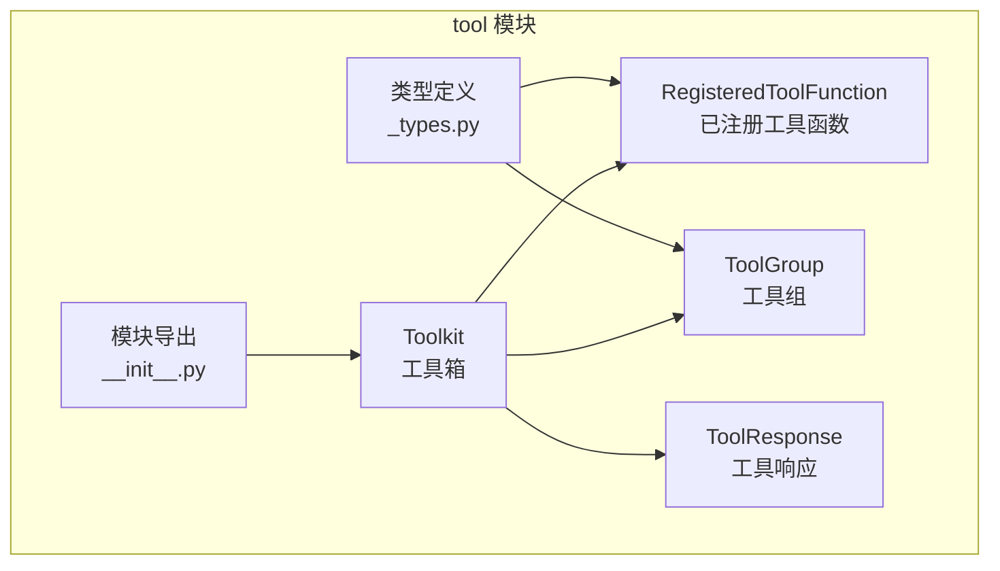
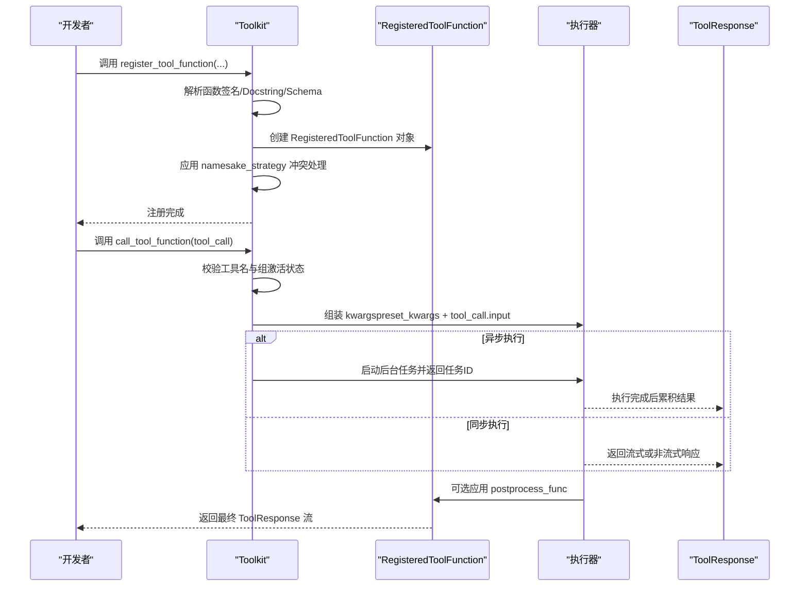
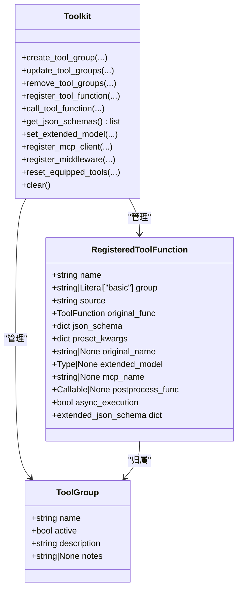
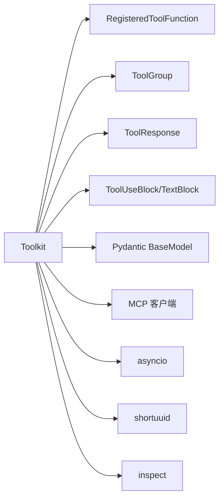

# 工具注册与管理

<cite>
**本文引用的文件列表**
- [toolkit.py](file://src/agentscope/tool/_toolkit.py)
- [types.py](file://src/agentscope/tool/_types.py)
- [tool模块导出](file://src/agentscope/tool/__init__.py)
- [toolkit_basic_test.py](file://tests/toolkit_basic_test.py)
- [toolkit_meta_tool_test.py](file://tests/toolkit_meta_tool_test.py)
- [mcp_sse_client_test.py](file://tests/mcp_sse_client_test.py)
- [task_tool.py（英文教程）](file://docs/tutorial/en/src/task_tool.py)
- [task_tool.py（中文教程）](file://docs/tutorial/zh_CN/src/task_tool.py)
</cite>

## 目录
1. [简介](#简介)
2. [项目结构](#项目结构)
3. [核心组件](#核心组件)
4. [架构总览](#架构总览)
5. [详细组件分析](#详细组件分析)
6. [依赖关系分析](#依赖关系分析)
7. [性能考量](#性能考量)
8. [故障排查指南](#故障排查指南)
9. [结论](#结论)
10. [附录](#附录)

## 简介
本技术文档围绕 AgentScope 的工具注册与管理系统，系统性阐述工具函数的注册机制、工具组管理、生命周期管理、元数据与 JSON Schema 自动生成、参数与后处理机制、以及最佳实践与常见用法。读者可据此快速掌握如何在 AgentScope 中安全、高效地组织与扩展工具能力，并通过工具组与动态 Schema 扩展实现灵活的智能体工具装配。

## 项目结构
与工具注册与管理直接相关的模块主要位于 tool 子包中：
- 工具核心类：Toolkit（工具箱），负责工具函数注册、执行、工具组管理、MCP 客户端集成等
- 工具类型定义：RegisteredToolFunction、ToolGroup 等数据结构
- 工具模块导出：统一对外暴露 Toolkit、常用内置工具函数等

图表来源
- [toolkit.py:117-186](file://src/agentscope/tool/_toolkit.py#L117-L186)
- [types.py:15-161](file://src/agentscope/tool/_types.py#L15-L161)
- [tool模块导出:25-44](file://src/agentscope/tool/__init__.py#L25-L44)

章节来源
- [toolkit.py:117-186](file://src/agentscope/tool/_toolkit.py#L117-L186)
- [types.py:15-161](file://src/agentscope/tool/_types.py#L15-L161)
- [tool模块导出:25-44](file://src/agentscope/tool/__init__.py#L25-L44)

## 核心组件
- Toolkit：工具箱核心，提供工具函数注册、执行、工具组管理、MCP 客户端接入、中间件链、异步任务管理、状态持久化等能力
- RegisteredToolFunction：封装单个工具函数的元信息、JSON Schema、预设参数、后处理函数、是否异步执行等
- ToolGroup：工具组实体，用于分组与激活控制，影响最终 JSON Schema 输出
- ToolResponse：工具调用返回的统一响应对象，支持流式累积与中断标记
- 类型与工具导出：统一对外暴露 Toolkit 与内置工具函数

章节来源
- [toolkit.py:117-186](file://src/agentscope/tool/_toolkit.py#L117-L186)
- [types.py:15-161](file://src/agentscope/tool/_types.py#L15-L161)
- [tool模块导出:25-44](file://src/agentscope/tool/__init__.py#L25-L44)

## 架构总览
下图展示工具注册与执行的关键流程：注册阶段完成元数据解析与 Schema 合并；执行阶段根据工具组激活状态、预设参数、后处理函数与异步执行策略进行统一处理。

图表来源
- [toolkit.py:274-535](file://src/agentscope/tool/_toolkit.py#L274-L535)
- [toolkit.py:853-1033](file://src/agentscope/tool/_toolkit.py#L853-L1033)
- [types.py:15-61](file://src/agentscope/tool/_types.py#L15-L61)

## 详细组件分析

### 工具函数注册机制 register_tool_function
- 功能概述
  - 支持普通函数、部分函数（partial）、MCP 工具函数三种输入
  - 自动从函数签名与 Docstring 提取 JSON Schema，或接受手动提供的 Schema
  - 支持预设参数（preset_kwargs）从 Schema 中剔除，避免暴露给模型
  - 支持命名冲突策略（raise/override/skip/rename）
  - 支持后处理函数（postprocess_func）对响应进行二次加工
  - 支持异步执行（async_execution），并提供任务查看/取消/等待接口

- 关键参数说明
  - tool_func：待注册的工具函数（支持同步/异步、生成器/非生成器）
  - group_name：所属工具组，默认“basic”，basic 组始终参与 Schema 输出
  - preset_kwargs：预设参数字典，不暴露给模型，且会从 Schema 中移除对应字段
  - func_name：自定义函数名，需与 Schema 中 name 一致
  - func_description：自定义函数描述，优先于 Docstring
  - json_schema：手动提供的完整 JSON Schema（必须符合 function 类型）
  - include_long_description/include_var_positional/include_var_keyword：控制 Docstring 解析细节
  - postprocess_func：后处理函数，可同步或异步，返回 None 表示保留原响应
  - namesake_strategy：重名处理策略（raise/override/skip/rename）
  - async_execution：是否以异步方式执行，实验特性

- 元数据与 Schema 生成
  - 若未提供 json_schema，则自动解析函数签名与 Docstring
  - 将 func_name 写入 Schema.function.name
  - 若提供 func_description 则覆盖默认描述
  - 预设参数从 Schema.parameters.properties 与 required 中移除
  - 最终存储 RegisteredToolFunction 并加入 Toolkit.tools

- 命名冲突处理策略
  - raise：抛出异常（默认）
  - override：覆盖已有同名工具
  - skip：记录警告并跳过注册
  - rename：追加随机后缀生成唯一新名称（最多尝试100次）

- 预设参数（preset_kwargs）作用机制
  - 仅在运行时生效，不暴露给模型
  - 从 JSON Schema 中剔除，避免模型感知到这些参数
  - 与调用输入合并时，调用输入优先级更高

- 后处理函数（postprocess_func）使用场景
  - 在工具执行完成后对 ToolResponse 进行二次加工
  - 可同步或异步，返回 None 保持原样，返回 ToolResponse 替换结果
  - 与工具绑定，随工具一起被调用

- 异步执行（async_execution）
  - 启用后立即返回任务ID提示，后台执行完成后累积为单一 ToolResponse
  - 提供 view_task/cancel_task/wait_task 接口管理任务

章节来源
- [toolkit.py:274-535](file://src/agentscope/tool/_toolkit.py#L274-L535)
- [toolkit.py:685-850](file://src/agentscope/tool/_toolkit.py#L685-L850)
- [toolkit.py:853-1033](file://src/agentscope/tool/_toolkit.py#L853-L1033)
- [types.py:15-61](file://src/agentscope/tool/_types.py#L15-L61)

### 工具组管理 create/update/remove
- create_tool_group
  - 创建新的工具组，支持设置 description、active、notes
  - 不允许重复创建或覆盖“basic”组
- update_tool_groups
  - 批量更新工具组激活状态
  - “basic”组始终激活，更新会被忽略并给出警告
- remove_tool_groups
  - 删除指定工具组及其包含的所有工具函数
  - 不允许删除“basic”组
  - 支持传入字符串或字符串列表

- 工具组激活与 JSON Schema 输出
  - get_json_schemas 仅输出“basic”组或当前激活组的工具 Schema
  - reset_equipped_tools 可一次性设置所有组的激活状态（绝对状态，非增量）

章节来源
- [toolkit.py:187-272](file://src/agentscope/tool/_toolkit.py#L187-L272)
- [toolkit.py:558-619](file://src/agentscope/tool/_toolkit.py#L558-L619)
- [toolkit.py:1250-1312](file://src/agentscope/tool/_toolkit.py#L1250-L1312)

### 工具函数生命周期管理
- 注册阶段
  - 解析/校验 Schema，应用预设参数剔除逻辑
  - 处理命名冲突策略
  - 创建 RegisteredToolFunction 并存入 Toolkit.tools
- 执行阶段
  - 校验工具名与组激活状态
  - 合并 preset_kwargs 与调用输入
  - 根据 async_execution 决定同步/异步执行路径
  - 流式/非流式响应统一包装
  - 应用 postprocess_func（如存在）
- 清理阶段
  - remove_tool_function：按名称移除工具
  - remove_tool_groups：按组移除工具
  - clear：清空所有工具与组
  - remove_mcp_clients：按 MCP 客户端名称批量移除工具

章节来源
- [toolkit.py:536-557](file://src/agentscope/tool/_toolkit.py#L536-L557)
- [toolkit.py:649-683](file://src/agentscope/tool/_toolkit.py#L649-L683)
- [toolkit.py:1314-1318](file://src/agentscope/tool/_toolkit.py#L1314-L1318)

### 元数据与 JSON Schema 管理
- 自动生成
  - 基于函数签名与 Docstring 自动生成 JSON Schema
  - 支持长描述、可变参数（*args/**kwargs）控制
- 手动 Schema
  - 若提供 json_schema，需满足 function 类型规范
- 动态扩展（set_extended_model）
  - 使用 Pydantic BaseModel 动态扩展工具 Schema
  - 合并 properties 与 $defs，冲突检测与去重
  - 仅允许扩展不存在的字段，避免覆盖原始参数

- Schema 输出
  - get_json_schemas 仅输出激活组的工具 Schema
  - reset_equipped_tools 会根据工具组动态生成元工具 Schema（布尔开关）

章节来源
- [toolkit.py:409-460](file://src/agentscope/tool/_toolkit.py#L409-L460)
- [toolkit.py:621-647](file://src/agentscope/tool/_toolkit.py#L621-L647)
- [toolkit.py:596-619](file://src/agentscope/tool/_toolkit.py#L596-L619)
- [types.py:62-132](file://src/agentscope/tool/_types.py#L62-L132)

### 工具函数执行与中间件
- 执行入口 call_tool_function
  - 统一流式接口（AsyncGenerator[ToolResponse]）
  - 支持同步/异步/生成器/非生成器返回
  - 错误处理与中断捕获（CancelledError）
- 中间件链
  - register_middleware 注册洋葱式中间件
  - 通过装饰器在执行前/后拦截与修改响应
  - 与 trace_toolkit 保持外层可观测性

章节来源
- [toolkit.py:853-1033](file://src/agentscope/tool/_toolkit.py#L853-L1033)
- [toolkit.py:1441-1539](file://src/agentscope/tool/_toolkit.py#L1441-L1539)

### MCP 客户端集成
- register_mcp_client
  - 从 MCP 客户端批量注册工具函数
  - 支持启用/禁用函数列表、预设参数映射、后处理函数、命名冲突策略
  - 支持超时设置与连接状态检查
- remove_mcp_clients
  - 按客户端名称移除其注册的工具函数

章节来源
- [toolkit.py:1035-1178](file://src/agentscope/tool/_toolkit.py#L1035-L1178)
- [toolkit.py:649-683](file://src/agentscope/tool/_toolkit.py#L649-L683)

### 类与关系图

图表来源
- [toolkit.py:117-186](file://src/agentscope/tool/_toolkit.py#L117-L186)
- [types.py:15-161](file://src/agentscope/tool/_types.py#L15-L161)

## 依赖关系分析
- 内部依赖
  - Toolkit 依赖 RegisteredToolFunction、ToolGroup、ToolResponse、Message（ToolUseBlock/TextBlock）
  - 依赖 Pydantic 用于 BaseModel 扩展与 Schema 合并
  - 依赖 mcp 模块用于 MCP 工具函数接入
- 外部依赖
  - asyncio：异步执行与任务管理
  - shortuuid：生成任务ID与重命名后缀
  - inspect：函数签名解析与协程判断

图表来源
- [toolkit.py:7-54](file://src/agentscope/tool/_toolkit.py#L7-L54)
- [types.py:1-12](file://src/agentscope/tool/_types.py#L1-L12)

章节来源
- [toolkit.py:7-54](file://src/agentscope/tool/_toolkit.py#L7-L54)
- [types.py:1-12](file://src/agentscope/tool/_types.py#L1-L12)

## 性能考量
- 流式累积
  - 流式工具函数在后台任务中累积为单一 ToolResponse，减少多次往返开销
- 异步执行
  - 异步执行可提升并发吞吐，但需谨慎使用实验特性，注意任务清理与内存占用
- Schema 合并与扩展
  - 动态扩展 BaseModel 时，合并 $defs 与 required 字段需遍历比较，复杂度与字段数量相关
- 中间件链
  - 中间件层层包裹，建议控制层数与每层处理逻辑，避免过度开销

[本节为通用性能讨论，无需特定文件来源]

## 故障排查指南
- 函数未找到
  - 症状：调用 call_tool_function 报错“无法找到函数”
  - 排查：确认工具名拼写、是否已被移除、是否在激活组内
- 组未激活
  - 症状：调用时报“工具组未激活”
  - 排查：使用 reset_equipped_tools 激活目标组，或检查 update_tool_groups 的调用
- 命名冲突
  - 症状：注册时报“已存在同名函数”
  - 排查：调整 namesake_strategy 或使用 func_name 指定新名称
- 预设参数未生效
  - 症状：模型仍看到预设参数
  - 排查：确认 preset_kwargs 是否正确传入，以及是否被 Schema 移除
- 异步任务异常
  - 症状：任务卡住或无法取消
  - 排查：使用 view_task/cancel_task/wait_task 管理任务；检查工具内部是否抛出异常
- 中间件导致阻塞
  - 症状：工具执行缓慢或无响应
  - 排查：检查中间件链长度与处理逻辑，必要时临时移除中间件定位问题

章节来源
- [toolkit.py:872-909](file://src/agentscope/tool/_toolkit.py#L872-L909)
- [toolkit.py:1541-1684](file://src/agentscope/tool/_toolkit.py#L1541-L1684)

## 结论
AgentScope 的工具注册与管理系统以 Toolkit 为核心，提供了完善的工具函数注册、执行、组管理、Schema 动态扩展与中间件链能力。通过合理的参数设计（预设参数、后处理函数、异步执行）、严格的命名冲突策略与工具组激活控制，可以构建高可维护、可扩展的智能体工具体系。结合 MCP 客户端集成与状态持久化，能够满足复杂场景下的工具装配与运行时管理需求。

[本节为总结性内容，无需特定文件来源]

## 附录

### 注册示例与最佳实践
- 基础注册
  - 使用 register_tool_function 注册同步/异步/生成器工具函数
  - 通过 func_name 与 func_description 明确函数标识与描述
- 工具组组织
  - 使用 create_tool_group 分类管理工具，通过 reset_equipped_tools 动态切换
  - 将通用工具置于“basic”组，业务工具置于独立组
- 动态 Schema 扩展
  - 使用 set_extended_model 为工具添加额外参数，避免破坏原有 Schema
  - 注意字段冲突与 $defs 合并规则
- 预设参数与后处理
  - 使用 preset_kwargs 隐藏敏感或固定参数
  - 使用 postprocess_func 对响应进行二次加工（如追加日志、格式化）
- 异步执行
  - 对耗时工具启用 async_execution，配合 view_task/cancel_task/wait_task 管理
- MCP 工具注册
  - 使用 register_mcp_client 批量注册，支持启用/禁用列表与预设参数映射

章节来源
- [toolkit_basic_test.py:1149-1182](file://tests/toolkit_basic_test.py#L1149-L1182)
- [toolkit_meta_tool_test.py:172-203](file://tests/toolkit_meta_tool_test.py#L172-L203)
- [mcp_sse_client_test.py:212-231](file://tests/mcp_sse_client_test.py#L212-L231)
- [task_tool.py（英文教程）:253-305](file://docs/tutorial/en/src/task_tool.py#L253-L305)
- [task_tool.py（中文教程）:265-316](file://docs/tutorial/zh_CN/src/task_tool.py#L265-L316)