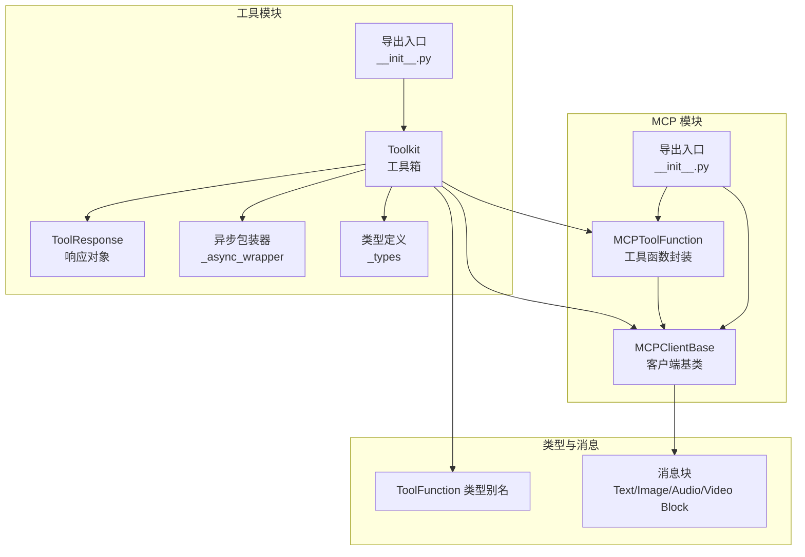
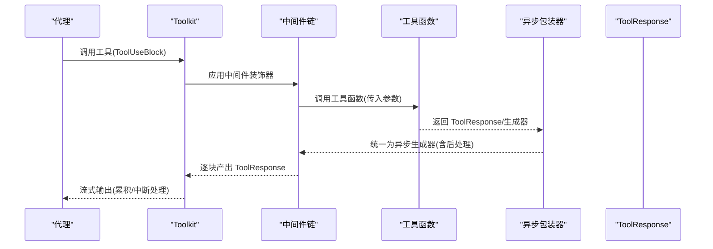
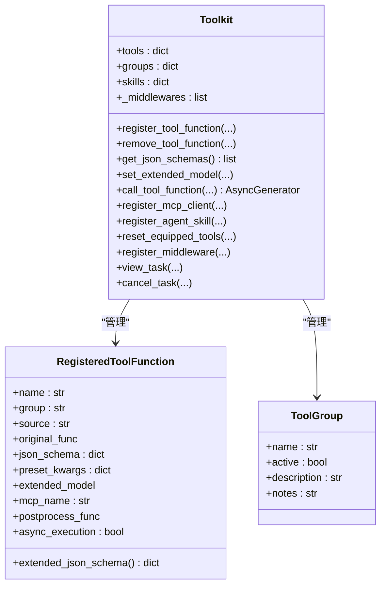
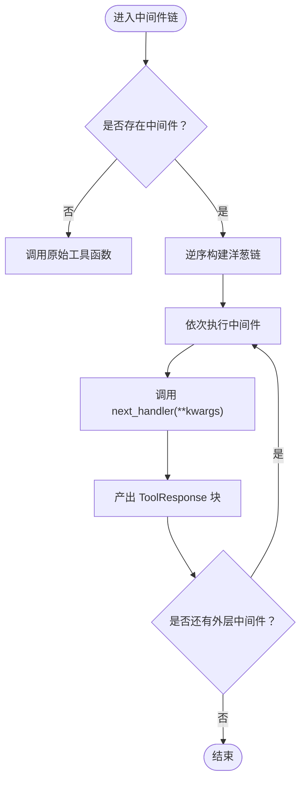
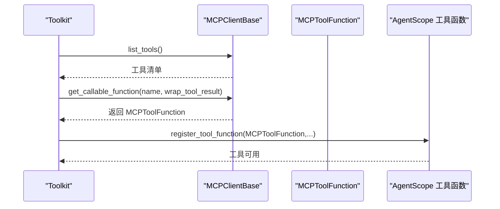
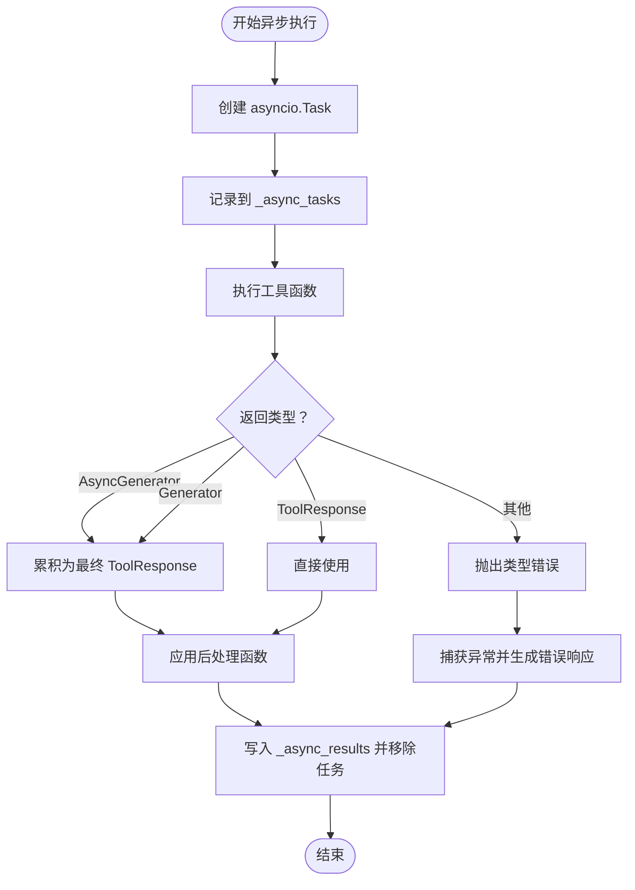
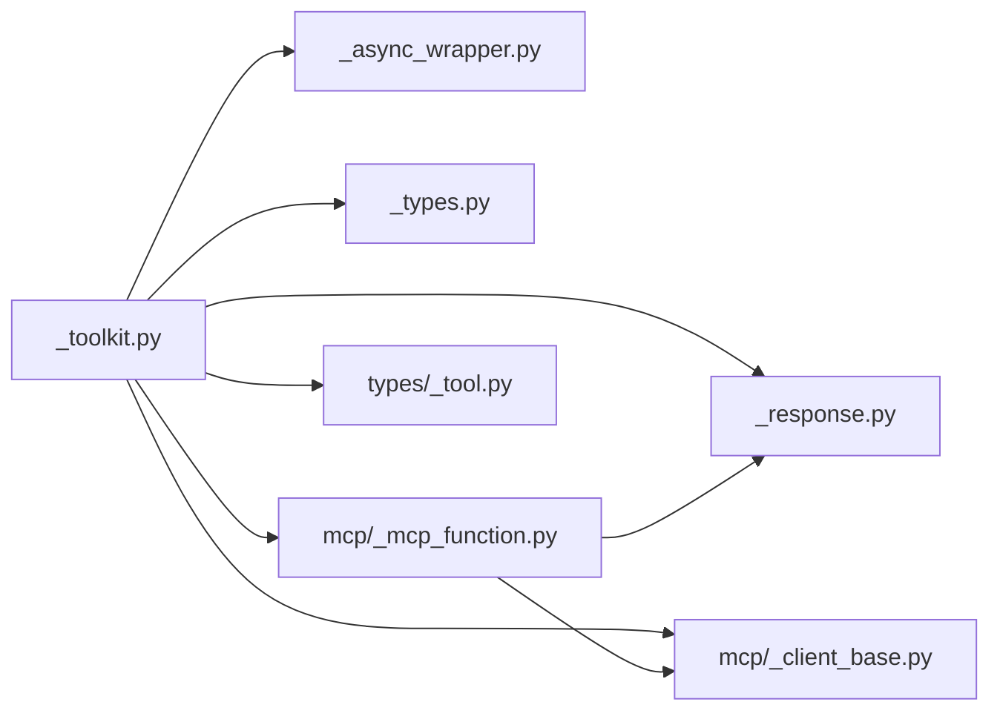

# 工具系统

<cite>
**本文引用的文件**
- [tool\__init__.py](file://src/agentscope/tool/__init__.py)
- [tool\_toolkit.py](file://src/agentscope/tool/_toolkit.py)
- [tool\_async_wrapper.py](file://src/agentscope/tool/_async_wrapper.py)
- [tool\_response.py](file://src/agentscope/tool/_response.py)
- [tool\_types.py](file://src/agentscope/tool/_types.py)
- [mcp\__init__.py](file://src/agentscope/mcp/__init__.py)
- [mcp\_client_base.py](file://src/agentscope/mcp/_client_base.py)
- [mcp\_mcp_function.py](file://src/agentscope/mcp/_mcp_function.py)
- [types\_tool.py](file://src/agentscope/types/_tool.py)
- [toolkit_basic_test.py](file://tests/toolkit_basic_test.py)
- [examples\functionality\mcp\main.py](file://examples/functionality/mcp/main.py)
- [examples\functionality\mcp\mcp_add.py](file://examples/functionality/mcp/mcp_add.py)
- [examples\functionality\mcp\mcp_multiply.py](file://examples/functionality/mcp/mcp_multiply.py)
</cite>

## 目录
1. [简介](#简介)
2. [项目结构](#项目结构)
3. [核心组件](#核心组件)
4. [架构总览](#架构总览)
5. [详细组件分析](#详细组件分析)
6. [依赖分析](#依赖分析)
7. [性能考虑](#性能考虑)
8. [故障排查指南](#故障排查指南)
9. [结论](#结论)
10. [附录](#附录)

## 简介
本技术文档围绕 AgentScope 的工具系统，系统性阐述 Toolkit 工具箱的设计与实现，包括：
- 工具注册机制与元数据管理（含扩展模型合并）
- 工具发现与调用流程（含流式输出与后处理）
- 工具中间件系统（洋葱模型、执行顺序与错误处理）
- MCP 客户端集成（协议封装、远程工具本地化、状态管理）
- 异步工具执行（协程管理、并发控制、资源调度）
- 工具函数最佳实践（参数校验、返回值处理、异常管理）
- 开发示例、中间件编写指南与 MCP 集成案例
- 完整 API 参考与性能优化建议

## 项目结构
工具系统主要位于 src/agentscope/tool 与 src/agentscope/mcp 两个子模块中，配合 types 与 message 模块进行类型定义与消息块转换。

图表来源
- [tool\_toolkit.py:117-186](file://src/agentscope/tool/_toolkit.py#L117-L186)
- [tool\_response.py:11-33](file://src/agentscope/tool/_response.py#L11-L33)
- [tool\_async_wrapper.py:16-110](file://src/agentscope/tool/_async_wrapper.py#L16-L110)
- [tool\_types.py:15-161](file://src/agentscope/tool/_types.py#L15-L161)
- [mcp\_client_base.py:18-103](file://src/agentscope/mcp/_client_base.py#L18-L103)
- [mcp\_mcp_function.py:15-116](file://src/agentscope/mcp/_mcp_function.py#L15-L116)
- [mcp\__init__.py:13-21](file://src/agentscope/mcp/__init__.py#L13-L21)
- [tool\__init__.py:27-45](file://src/agentscope/tool/__init__.py#L27-L45)
- [types\_tool.py:20-37](file://src/agentscope/types/_tool.py#L20-L37)

章节来源
- [tool\__init__.py:27-45](file://src/agentscope/tool/__init__.py#L27-L45)
- [mcp\__init__.py:13-21](file://src/agentscope/mcp/__init__.py#L13-L21)

## 核心组件
- Toolkit：工具注册、分组管理、激活控制、MCP 客户端接入、中间件链、异步任务管理、代理技能注册与提示生成。
- ToolResponse：统一的工具调用响应载体，支持多模态内容块与流式标记。
- 异步包装器：将同步/异步生成器与普通对象统一封装为异步生成器，并处理中断与后处理。
- 类型与元数据：RegisteredToolFunction、ToolGroup、AgentSkill 等，支撑工具元数据与扩展模型合并。
- MCP 客户端与工具函数：MCPClientBase 抽象、MCPToolFunction 封装、内容块转换。
- ToolFunction 类型别名：统一工具函数签名，覆盖同步/异步、生成器/协程等返回形态。

章节来源
- [tool\_toolkit.py:117-186](file://src/agentscope/tool/_toolkit.py#L117-L186)
- [tool\_response.py:11-33](file://src/agentscope/tool/_response.py#L11-L33)
- [tool\_async_wrapper.py:16-110](file://src/agentscope/tool/_async_wrapper.py#L16-L110)
- [tool\_types.py:15-161](file://src/agentscope/tool/_types.py#L15-L161)
- [mcp\_client_base.py:18-103](file://src/agentscope/mcp/_client_base.py#L18-L103)
- [mcp\_mcp_function.py:15-116](file://src/agentscope/mcp/_mcp_function.py#L15-L116)
- [types\_tool.py:20-37](file://src/agentscope/types/_tool.py#L20-L37)

## 架构总览
工具系统采用“工具箱 + 中间件 + MCP 客户端”的分层设计，统一通过 Toolkit 协调工具注册、元数据管理、调用与流式输出，并以洋葱模型的中间件链实现可插拔的预处理/后处理/拦截能力；MCP 客户端负责远程工具的本地化封装与状态管理。

图表来源
- [tool\_toolkit.py:852-1033](file://src/agentscope/tool/_toolkit.py#L852-L1033)
- [tool\_async_wrapper.py:63-110](file://src/agentscope/tool/_async_wrapper.py#L63-L110)
- [tool\_response.py:11-33](file://src/agentscope/tool/_response.py#L11-L33)

## 详细组件分析

### 工具箱 Toolkit 设计与实现
- 注册机制
  - 支持常规函数、部分函数、MCP 工具函数三种来源，自动解析 JSON Schema 并支持扩展模型合并。
  - 支持重名策略：抛错、覆盖、跳过、重命名。
  - 支持预设参数（不暴露给模型）与描述覆盖。
- 元数据管理
  - 工具分组（ToolGroup）与激活控制，动态生成 JSON Schema，支持“元工具”按当前激活组动态扩展参数。
  - 扩展模型合并时对 $defs 去标题字段并进行冲突检测。
- 工具发现与调用
  - 通过 ToolUseBlock 解析名称与输入，结合预设参数与调用输入合并。
  - 支持同步/异步、生成器/协程统一输出为异步生成器，内置后处理函数。
- 中间件系统
  - 洋葱模型：外层中间件包裹内层，支持预处理、拦截、后处理与跳过执行。
  - 通过装饰器在调用前构建链路，保证追踪装饰器在外层。
- 异步工具执行
  - 后台任务队列与结果缓存，支持查看、取消、等待任务。
  - 对 MCP 错误与通用异常进行捕获并转化为 ToolResponse。
- MCP 客户端集成
  - 列举工具、过滤启用/禁用列表、按映射设置预设参数、注册为本地工具函数。
  - 支持超时配置与连接状态检查。
- 代理技能管理
  - 从目录加载技能元数据（SKILL.md），生成系统提示模板。

图表来源
- [tool\_toolkit.py:117-186](file://src/agentscope/tool/_toolkit.py#L117-L186)
- [tool\_types.py:15-161](file://src/agentscope/tool/_types.py#L15-L161)

章节来源
- [tool\_toolkit.py:274-535](file://src/agentscope/tool/_toolkit.py#L274-L535)
- [tool\_toolkit.py:558-620](file://src/agentscope/tool/_toolkit.py#L558-L620)
- [tool\_toolkit.py:685-850](file://src/agentscope/tool/_toolkit.py#L685-L850)
- [tool\_toolkit.py:852-1033](file://src/agentscope/tool/_toolkit.py#L852-L1033)
- [tool\_toolkit.py:1035-1178](file://src/agentscope/tool/_toolkit.py#L1035-L1178)
- [tool\_toolkit.py:1441-1540](file://src/agentscope/tool/_toolkit.py#L1441-L1540)
- [tool\_toolkit.py:1541-1599](file://src/agentscope/tool/_toolkit.py#L1541-L1599)
- [tool\_types.py:15-161](file://src/agentscope/tool/_types.py#L15-L161)

### 工具中间件系统
- 中间件链构建
  - 通过装饰器在运行时读取中间件列表，自内而外构建洋葱链。
  - 每个中间件接收 kwargs 与 next_handler，可选择直接消费或委托给下一个处理器。
- 执行顺序控制
  - 逆序包裹，最内层为原始工具函数，最外层为最终中间件。
- 错误处理机制
  - 在中间件内部可拦截并返回错误响应，实现快速失败与授权控制。
  - 保持追踪装饰器在外层，确保可观测性。

图表来源
- [tool\_toolkit.py:57-114](file://src/agentscope/tool/_toolkit.py#L57-L114)
- [tool\_toolkit.py:1441-1540](file://src/agentscope/tool/_toolkit.py#L1441-L1540)

章节来源
- [tool\_toolkit.py:57-114](file://src/agentscope/tool/_toolkit.py#L57-L114)
- [tool\_toolkit.py:1441-1540](file://src/agentscope/tool/_toolkit.py#L1441-L1540)

### MCP 客户端集成
- 客户端抽象与工具封装
  - MCPClientBase 提供 get_callable_function 抽象，MCPToolFunction 将远程工具封装为本地可调用对象。
  - 内容块转换：将 MCP 的文本/图像/音频/嵌入资源转换为 AgentScope 的消息块。
- 远程工具本地化
  - Toolkit.register_mcp_client 自动列举工具、过滤启用/禁用列表、应用预设参数映射、注册为本地工具函数。
  - 支持超时配置与连接状态检查。
- 状态管理
  - 状态有状态客户端需先 connect，关闭时需显式 close；无状态客户端无需连接。

图表来源
- [tool\_toolkit.py:1035-1178](file://src/agentscope/tool/_toolkit.py#L1035-L1178)
- [mcp\_client_base.py:32-38](file://src/agentscope/mcp/_client_base.py#L32-L38)
- [mcp\_mcp_function.py:82-116](file://src/agentscope/mcp/_mcp_function.py#L82-L116)

章节来源
- [mcp\_client_base.py:18-103](file://src/agentscope/mcp/_client_base.py#L18-L103)
- [mcp\_mcp_function.py:15-116](file://src/agentscope/mcp/_mcp_function.py#L15-L116)
- [tool\_toolkit.py:1035-1178](file://src/agentscope/tool/_toolkit.py#L1035-L1178)

### 异步工具执行机制
- 协程管理
  - 使用 asyncio.create_task 创建后台任务，存储于 _async_tasks；完成后写入 _async_results。
- 并发控制
  - 通过任务字典与结果字典进行并发跟踪；提供 view_task/cancel_task 接口。
- 资源调度
  - 对 MCP 错误与通用异常进行捕获，统一转化为 ToolResponse；对生成器中断进行特殊处理并在最后块追加中断信息。

图表来源
- [tool\_toolkit.py:685-850](file://src/agentscope/tool/_toolkit.py#L685-L850)
- [tool\_async_wrapper.py:63-110](file://src/agentscope/tool/_async_wrapper.py#L63-L110)

章节来源
- [tool\_toolkit.py:685-850](file://src/agentscope/tool/_toolkit.py#L685-L850)
- [tool\_async_wrapper.py:63-110](file://src/agentscope/tool/_async_wrapper.py#L63-L110)

### 工具函数最佳实践
- 参数验证
  - 使用 JSON Schema 与 Pydantic 扩展模型进行参数约束与默认值声明；避免与扩展模型字段冲突。
- 返回值处理
  - 统一返回 ToolResponse 或生成器；生成器需保证最后一个块 is_last=True。
- 异常管理
  - 明确区分用户中断（CancelledError）与业务异常；对 MCP 错误进行捕获并友好提示。
- 后处理函数
  - 在注册时绑定 ToolUseBlock 与 ToolResponse 的后处理函数，支持同步/异步；可选择返回 None 或新的 ToolResponse。

章节来源
- [tool\_types.py:41-60](file://src/agentscope/tool/_types.py#L41-L60)
- [tool\_async_wrapper.py:16-36](file://src/agentscope/tool/_async_wrapper.py#L16-L36)
- [tool\_toolkit.py:852-1033](file://src/agentscope/tool/_toolkit.py#L852-L1033)

## 依赖分析
- 模块耦合
  - Toolkit 依赖 ToolResponse、消息块、中间件装饰器、MCP 客户端与工具类型。
  - MCPToolFunction 依赖 MCPClientBase 与内容块转换。
- 外部依赖
  - mcp、shortuuid、pydantic、asyncio 等。
- 循环依赖
  - 当前结构未见循环导入；类型别名通过字符串延迟解析避免循环。

图表来源
- [tool\_toolkit.py:31-54](file://src/agentscope/tool/_toolkit.py#L31-L54)
- [mcp\_mcp_function.py:10-12](file://src/agentscope/mcp/_mcp_function.py#L10-L12)
- [types\_tool.py:20-37](file://src/agentscope/types/_tool.py#L20-L37)

章节来源
- [tool\_toolkit.py:31-54](file://src/agentscope/tool/_toolkit.py#L31-L54)
- [mcp\_mcp_function.py:10-12](file://src/agentscope/mcp/_mcp_function.py#L10-L12)
- [types\_tool.py:20-37](file://src/agentscope/types/_tool.py#L20-L37)

## 性能考虑
- 流式输出与累积
  - 生成器返回时累积为单次 ToolResponse，减少多次小块传输开销。
- 异步执行
  - 后台任务池化，避免阻塞主线程；合理设置超时与取消策略。
- 模式匹配与转换
  - MCP 内容块转换尽量复用，避免重复序列化。
- JSON Schema 合并
  - 扩展模型合并时去标题字段并进行冲突检测，避免重复定义带来的额外开销。

## 故障排查指南
- 工具未找到或分组未激活
  - 确认工具名称正确且所属分组处于激活状态；可通过 reset_equipped_tools 动态切换。
- 重名冲突
  - 使用 namesake_strategy 控制行为（覆盖/跳过/重命名/抛错）。
- MCP 连接问题
  - 有状态客户端需先 connect，无状态客户端无需连接；检查 URL 与传输类型。
- 异步任务无效
  - 确认 task_id 存在；使用 view_task 查看状态，cancel_task 取消任务。
- 中间件导致的吞没
  - 检查中间件是否正确调用 next_handler 或在条件满足时直接返回错误响应。

章节来源
- [tool\_toolkit.py:873-909](file://src/agentscope/tool/_toolkit.py#L873-L909)
- [tool\_toolkit.py:1541-1599](file://src/agentscope/tool/_toolkit.py#L1541-L1599)
- [tool\_toolkit.py:1100-1107](file://src/agentscope/tool/_toolkit.py#L1100-L1107)

## 结论
AgentScope 工具系统通过 Toolkit 实现了工具注册、元数据管理、中间件链与异步执行的统一抽象，结合 MCP 客户端实现了远程工具的本地化封装与状态管理。其设计兼顾灵活性与可观测性，适合在复杂多模态场景下构建可扩展的智能体工具生态。

## 附录

### 开发示例与用法要点
- 工具函数注册与调用
  - 使用 register_tool_function 注册，支持预设参数、扩展模型与后处理函数。
  - 通过 call_tool_function 获取统一的异步生成器输出。
- 中间件编写
  - 采用洋葱模型，接收 kwargs 与 next_handler，可在任意阶段拦截或修改响应。
- MCP 集成
  - 使用 HttpStatefulClient/HttpStatelessClient 连接远程服务器，注册到 Toolkit 后即可像本地工具一样调用。
  - 可直接获取可调用的 MCPToolFunction 进行手动调用。

章节来源
- [toolkit_basic_test.py:150-200](file://tests/toolkit_basic_test.py#L150-L200)
- [examples\functionality\mcp\main.py:34-111](file://examples/functionality/mcp/main.py#L34-L111)
- [examples\functionality\mcp\mcp_add.py:10-17](file://examples/functionality/mcp/mcp_add.py#L10-L17)
- [examples\functionality\mcp\mcp_multiply.py:10-17](file://examples/functionality/mcp/mcp_multiply.py#L10-L17)

### API 参考（节选）
- Toolkit
  - register_tool_function(...): 注册工具函数
  - get_json_schemas(): 获取激活分组的 JSON Schema
  - call_tool_function(...): 调用工具并返回异步生成器
  - register_mcp_client(...): 注册 MCP 客户端
  - register_middleware(...): 注册中间件
  - reset_equipped_tools(...): 动态切换工具分组
  - view_task(task_id)/cancel_task(task_id): 异步任务管理
- MCPToolFunction
  - __call__(**kwargs): 调用远程工具并返回 ToolResponse 或原生结果
- ToolResponse
  - content/metadata/stream/is_last/is_interrupted/id: 响应属性

章节来源
- [tool\_toolkit.py:274-535](file://src/agentscope/tool/_toolkit.py#L274-L535)
- [tool\_toolkit.py:558-620](file://src/agentscope/tool/_toolkit.py#L558-L620)
- [tool\_toolkit.py:852-1033](file://src/agentscope/tool/_toolkit.py#L852-L1033)
- [tool\_toolkit.py:1035-1178](file://src/agentscope/tool/_toolkit.py#L1035-L1178)
- [tool\_toolkit.py:1441-1540](file://src/agentscope/tool/_toolkit.py#L1441-L1540)
- [mcp\_mcp_function.py:82-116](file://src/agentscope/mcp/_mcp_function.py#L82-L116)
- [tool\_response.py:11-33](file://src/agentscope/tool/_response.py#L11-L33)