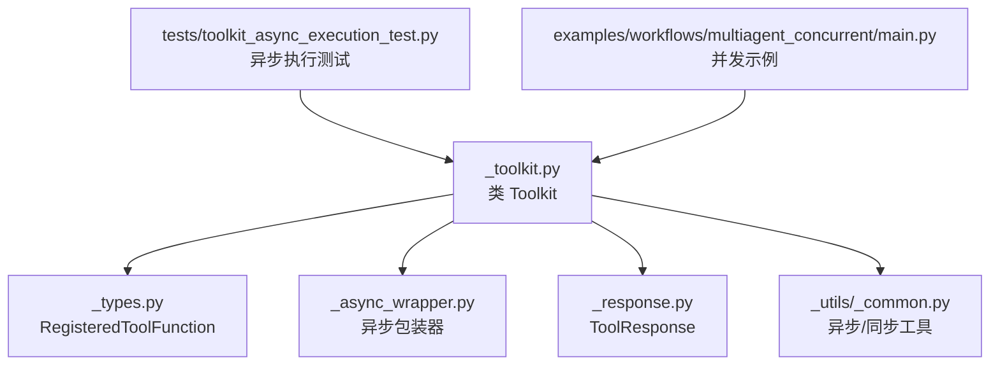
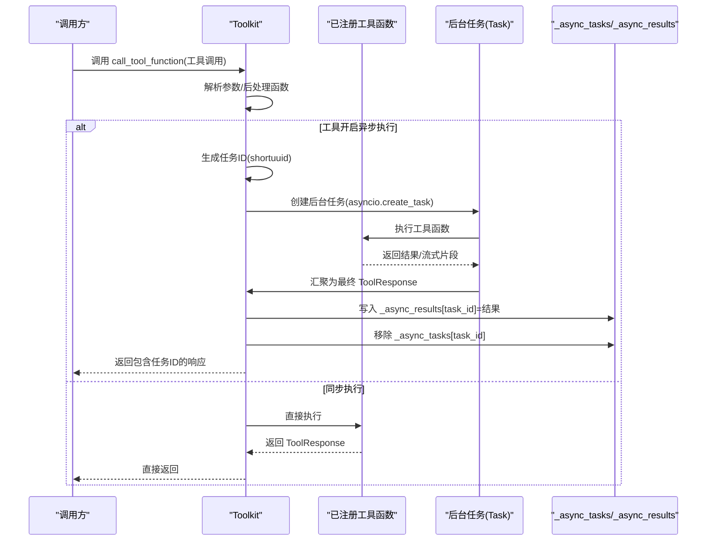
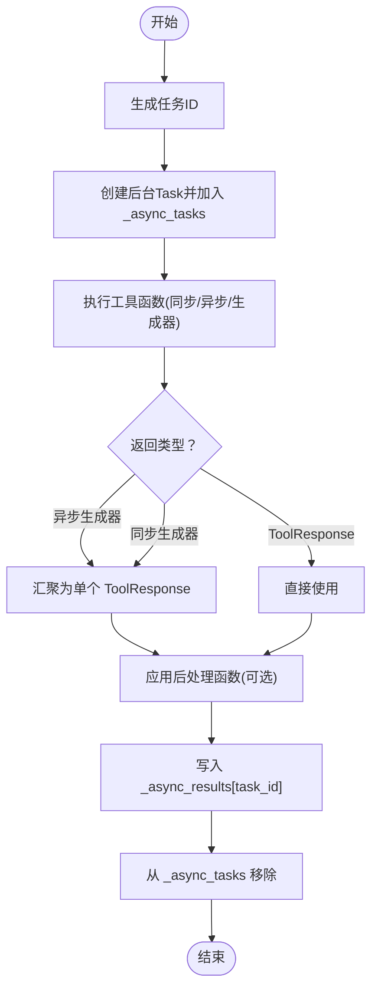
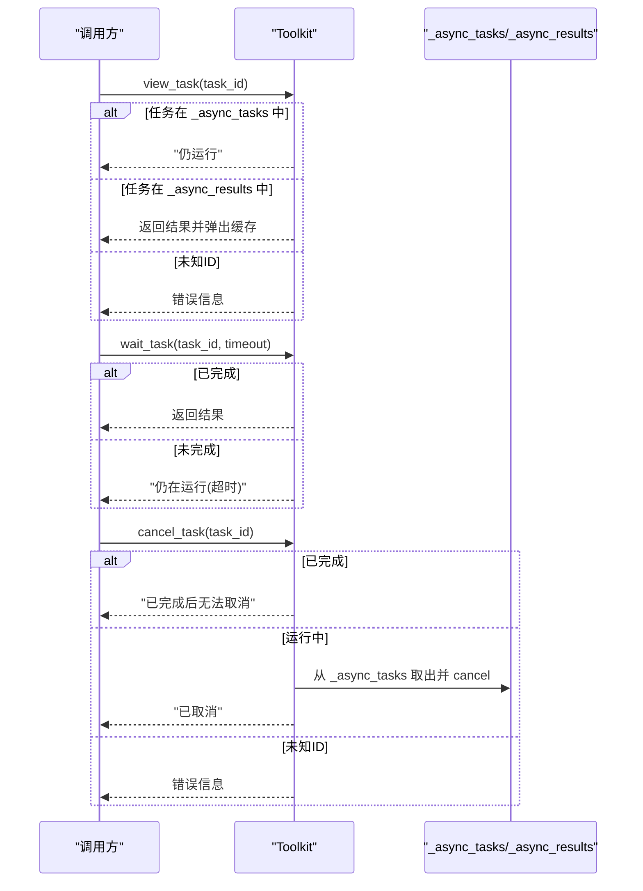
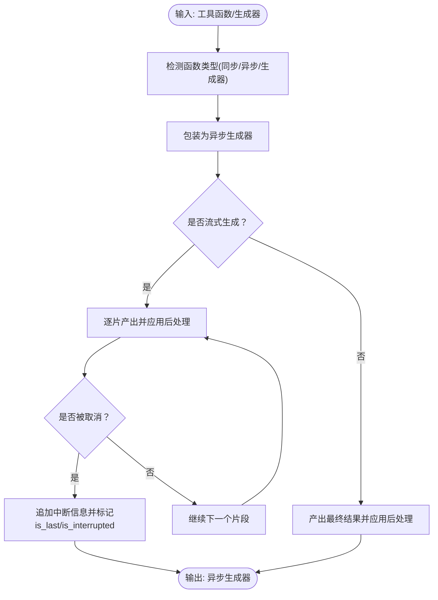
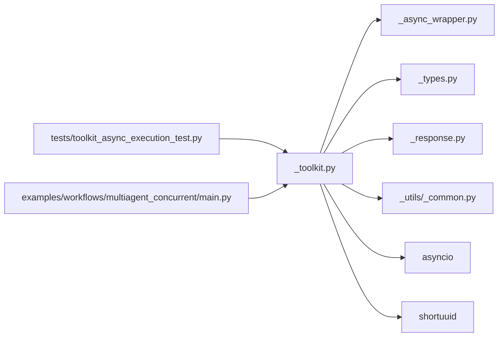

# 异步执行机制

<cite>
**本文引用的文件**
- [src/agentscope/tool/_toolkit.py](file://src/agentscope/tool/_toolkit.py)
- [src/agentscope/tool/_async_wrapper.py](file://src/agentscope/tool/_async_wrapper.py)
- [src/agentscope/tool/_types.py](file://src/agentscope/tool/_types.py)
- [src/agentscope/tool/_response.py](file://src/agentscope/tool/_response.py)
- [src/agentscope/_utils/_common.py](file://src/agentscope/_utils/_common.py)
- [tests/toolkit_async_execution_test.py](file://tests/toolkit_async_execution_test.py)
- [examples/workflows/multiagent_concurrent/main.py](file://examples/workflows/multiagent_concurrent/main.py)
</cite>

## 目录
1. [引言](#引言)
2. [项目结构](#项目结构)
3. [核心组件](#核心组件)
4. [架构总览](#架构总览)
5. [详细组件分析](#详细组件分析)
6. [依赖分析](#依赖分析)
7. [性能考虑](#性能考虑)
8. [故障排查指南](#故障排查指南)
9. [结论](#结论)
10. [附录：异步工具开发指南与最佳实践](#附录异步工具开发指南与最佳实践)

## 引言
本文件系统性阐述 AgentScope 的异步执行机制，围绕以下目标展开：
- 设计理念与数据结构：背景任务管理、任务状态跟踪、结果缓存机制
- 关键数据结构：_async_tasks 与 _async_results 的职责划分、任务 ID 生成、状态查询与取消
- 生命周期管理：任务启动、进度报告、完成通知、异常处理
- 开发指南：协程编写规范、并发控制策略、资源清理方法
- 实战示例：异步工具实现要点、性能优化技巧、调试方法
- 对比分析：异步与同步执行的差异与适用场景

## 项目结构
与异步执行直接相关的模块与文件如下：
- 工具套件 Toolkit：负责工具注册、调用、异步任务调度与状态管理
- 异步包装器 _async_wrapper：统一将同步/异步/生成器工具包装为异步生成器，并处理中断与后处理
- 类型定义 _types：RegisteredToolFunction 等，承载工具元信息与异步开关
- 响应模型 _response：统一的 ToolResponse 结构，支持流式与非流式输出
- 通用工具 _common：异步/同步函数识别与执行、时间戳等
- 测试用例 toolkit_async_execution_test：覆盖 view_task/wait_task/cancel_task 等行为
- 并发示例 multiagent_concurrent：展示事件循环与并发运行模式

**图表来源**
- [src/agentscope/tool/_toolkit.py](file://src/agentscope/tool/_toolkit.py)
- [src/agentscope/tool/_async_wrapper.py](file://src/agentscope/tool/_async_wrapper.py)
- [src/agentscope/tool/_types.py](file://src/agentscope/tool/_types.py)
- [src/agentscope/tool/_response.py](file://src/agentscope/tool/_response.py)
- [src/agentscope/_utils/_common.py](file://src/agentscope/_utils/_common.py)
- [tests/toolkit_async_execution_test.py](file://tests/toolkit_async_execution_test.py)
- [examples/workflows/multiagent_concurrent/main.py](file://examples/workflows/multiagent_concurrent/main.py)

**章节来源**
- [src/agentscope/tool/_toolkit.py](file://src/agentscope/tool/_toolkit.py)
- [src/agentscope/tool/_async_wrapper.py](file://src/agentscope/tool/_async_wrapper.py)
- [src/agentscope/tool/_types.py](file://src/agentscope/tool/_types.py)
- [src/agentscope/tool/_response.py](file://src/agentscope/tool/_response.py)
- [src/agentscope/_utils/_common.py](file://src/agentscope/_utils/_common.py)
- [tests/toolkit_async_execution_test.py](file://tests/toolkit_async_execution_test.py)
- [examples/workflows/multiagent_concurrent/main.py](file://examples/workflows/multiagent_concurrent/main.py)

## 核心组件
- Toolkit：工具注册与调用入口；在启用异步时，负责创建后台任务、维护 _async_tasks 与 _async_results、提供状态查询与取消能力
- RegisteredToolFunction：记录工具函数、分组、后处理函数、是否异步执行等元信息
- ToolResponse：统一的工具返回结构，支持流式标记、中断标记、内容块集合
- 异步包装器：将不同类型的工具（同步/异步/生成器）统一封装为异步生成器，处理中断与后处理
- 通用工具：识别异步/同步函数、执行函数、生成时间戳等

**章节来源**
- [src/agentscope/tool/_toolkit.py](file://src/agentscope/tool/_toolkit.py)
- [src/agentscope/tool/_types.py](file://src/agentscope/tool/_types.py)
- [src/agentscope/tool/_response.py](file://src/agentscope/tool/_response.py)
- [src/agentscope/tool/_async_wrapper.py](file://src/agentscope/tool/_async_wrapper.py)
- [src/agentscope/_utils/_common.py](file://src/agentscope/_utils/_common.py)

## 架构总览
下图展示了异步执行从“注册工具”到“后台执行”再到“状态查询/取消”的整体流程。

**图表来源**
- [src/agentscope/tool/_toolkit.py](file://src/agentscope/tool/_toolkit.py)
- [src/agentscope/tool/_async_wrapper.py](file://src/agentscope/tool/_async_wrapper.py)
- [src/agentscope/_utils/_common.py](file://src/agentscope/_utils/_common.py)

## 详细组件分析

### 数据结构设计：_async_tasks 与 _async_results
- _async_tasks：字典，键为任务ID，值为 asyncio.Task；用于跟踪正在运行的任务，支持取消
- _async_results：字典，键为任务ID，值为 ToolResponse；用于缓存已完成或出错的结果，支持一次性读取与消费
- 任务ID：使用短UUID生成，保证全局唯一且便于追踪
- 状态流转：
  - 启动：创建 Task 并写入 _async_tasks
  - 运行中：通过 view_task 查询仍运行
  - 完成/异常：在后台执行完成后写入 _async_results，并从 _async_tasks 中移除
  - 取消：从 _async_tasks 中取出 Task 并 cancel，后续状态查询会提示已取消

**图表来源**
- [src/agentscope/tool/_toolkit.py](file://src/agentscope/tool/_toolkit.py)

**章节来源**
- [src/agentscope/tool/_toolkit.py](file://src/agentscope/tool/_toolkit.py)

### 任务生命周期管理
- 启动：当工具函数开启异步执行时，Toolkit 为其创建后台任务并返回包含任务ID的响应
- 进度报告：通过 view_task 查询任务是否仍在运行
- 完成通知：wait_task 在超时前等待任务完成，或直接返回已缓存结果
- 异常处理：捕获工具执行过程中的异常，封装为 ToolResponse 的错误内容；对用户中断（CancelledError）进行特殊处理并在流末尾追加中断信息

**图表来源**
- [src/agentscope/tool/_toolkit.py](file://src/agentscope/tool/_toolkit.py)

**章节来源**
- [src/agentscope/tool/_toolkit.py](file://src/agentscope/tool/_toolkit.py)

### 异步包装器与中断处理
- 统一接口：无论工具是同步函数、同步生成器、异步生成器，均可被包装为异步生成器
- 中断处理：当异步生成器被取消时，在最后一个片段追加系统信息并标记 is_interrupted/is_last，确保调用方可感知中断
- 后处理：支持同步/异步后处理函数，对每个片段或最终结果进行转换

**图表来源**
- [src/agentscope/tool/_async_wrapper.py](file://src/agentscope/tool/_async_wrapper.py)
- [src/agentscope/_utils/_common.py](file://src/agentscope/_utils/_common.py)

**章节来源**
- [src/agentscope/tool/_async_wrapper.py](file://src/agentscope/tool/_async_wrapper.py)
- [src/agentscope/_utils/_common.py](file://src/agentscope/_utils/_common.py)

### 工具函数注册与异步开关
- RegisteredToolFunction：包含工具名称、分组、来源、原始函数、JSON Schema、预设参数、扩展模型、后处理函数、异步开关等
- 注册时可指定 async_execution=True，使该工具在调用时走异步路径
- 后处理函数：可绑定 ToolUseBlock 与 ToolResponse，支持同步/异步

**章节来源**
- [src/agentscope/tool/_types.py](file://src/agentscope/tool/_types.py)
- [src/agentscope/tool/_toolkit.py](file://src/agentscope/tool/_toolkit.py)

### 测试验证与行为边界
- 测试覆盖：
  - view_task：运行中/已完成两种状态
  - wait_task：超时返回“仍在运行”，否则返回结果
  - cancel_task：运行中可取消，已完成不可取消
  - 流式工具：多片段累积为单个 ToolResponse
  - 无效任务ID：返回错误信息
- 行为验证基于 Toolkit 的 view_task/wait_task/cancel_task 方法与内部缓存一致性

**章节来源**
- [tests/toolkit_async_execution_test.py](file://tests/toolkit_async_execution_test.py)
- [src/agentscope/tool/_toolkit.py](file://src/agentscope/tool/_toolkit.py)

## 依赖分析
- Toolkit 依赖：
  - _async_wrapper：统一异步生成器包装与中断处理
  - _types：RegisteredToolFunction 元信息与异步开关
  - _response：ToolResponse 统一输出
  - _utils._common：异步/同步函数识别与执行、时间戳
  - asyncio：后台任务创建与等待
  - shortuuid：任务ID生成
- 测试与示例：
  - toolkit_async_execution_test：验证异步生命周期与边界条件
  - multiagent_concurrent/main.py：展示事件循环与并发运行

**图表来源**
- [src/agentscope/tool/_toolkit.py](file://src/agentscope/tool/_toolkit.py)
- [src/agentscope/tool/_async_wrapper.py](file://src/agentscope/tool/_async_wrapper.py)
- [src/agentscope/tool/_types.py](file://src/agentscope/tool/_types.py)
- [src/agentscope/tool/_response.py](file://src/agentscope/tool/_response.py)
- [src/agentscope/_utils/_common.py](file://src/agentscope/_utils/_common.py)
- [tests/toolkit_async_execution_test.py](file://tests/toolkit_async_execution_test.py)
- [examples/workflows/multiagent_concurrent/main.py](file://examples/workflows/multiagent_concurrent/main.py)

**章节来源**
- [src/agentscope/tool/_toolkit.py](file://src/agentscope/tool/_toolkit.py)
- [src/agentscope/tool/_async_wrapper.py](file://src/agentscope/tool/_async_wrapper.py)
- [src/agentscope/tool/_types.py](file://src/agentscope/tool/_types.py)
- [src/agentscope/tool/_response.py](file://src/agentscope/tool/_response.py)
- [src/agentscope/_utils/_common.py](file://src/agentscope/_utils/_common.py)
- [tests/toolkit_async_execution_test.py](file://tests/toolkit_async_execution_test.py)
- [examples/workflows/multiagent_concurrent/main.py](file://examples/workflows/multiagent_concurrent/main.py)

## 性能考虑
- 任务聚合：流式工具的多个片段会被汇聚为单个 ToolResponse，减少上层处理复杂度
- 缓存命中：已完成任务直接从 _async_results 返回，避免重复计算
- 取消及时性：取消任务时立即从 _async_tasks 中移除并触发取消，防止僵尸任务
- 超时等待：wait_task 使用 asyncio.wait_for 配合 shield，避免长时间阻塞
- 并发运行：示例展示了多代理并发执行，结合事件循环提升吞吐

[本节为通用指导，不直接分析具体文件]

## 故障排查指南
- 无效任务ID：view_task/wait_task/cancel_task 对未知ID返回错误信息
- 任务仍在运行：wait_task 超时后返回“仍在运行”，可定期轮询
- 已完成后无法取消：cancel_task 对已完成任务返回提示
- 中断感知：异步生成器被取消时，最后片段会追加中断信息并标记 is_last/is_interrupted
- 异常捕获：工具执行异常会被封装为 ToolResponse 的错误内容，便于上层统一处理

**章节来源**
- [src/agentscope/tool/_toolkit.py](file://src/agentscope/tool/_toolkit.py)
- [src/agentscope/tool/_async_wrapper.py](file://src/agentscope/tool/_async_wrapper.py)
- [tests/toolkit_async_execution_test.py](file://tests/toolkit_async_execution_test.py)

## 结论
AgentScope 的异步执行机制以 Toolkit 为核心，通过后台任务与结果缓存实现“启动即返回、后续查询/取消”的交互模式。其关键优势在于：
- 统一的异步生成器包装与中断处理
- 明确的状态跟踪与缓存策略
- 清晰的生命周期管理与错误处理
- 与并发运行示例的良好契合

## 附录：异步工具开发指南与最佳实践
- 协程编写规范
  - 使用异步生成器时，确保在 finally 或异常分支中正确收尾，必要时追加中断信息
  - 对外暴露的工具函数应返回 ToolResponse 或异步生成器，保持输出一致
- 并发控制策略
  - 合理设置 wait_task 的超时，避免长时间阻塞
  - 对长耗时任务开启异步执行，并提供 view_task/cancel_task 接口
- 资源清理方法
  - 取消任务后及时从 _async_tasks 中移除
  - 完成任务后从 _async_tasks 移除并写入 _async_results，避免内存泄漏
- 性能优化技巧
  - 将流式片段汇聚为单个 ToolResponse，减少上层处理开销
  - 使用后处理函数在异步上下文中进行轻量级转换
- 调试方法
  - 利用测试用例覆盖“仍在运行/已完成/超时/取消/无效ID”等边界
  - 在异步生成器中打印关键节点日志，定位中断与异常发生点
- 与同步执行的对比
  - 同步：简单直接，适合短时任务；异步：提升吞吐，需处理状态与取消
  - 选择标准：任务耗时、是否需要进度反馈、是否允许中断、资源占用与并发需求

[本节为通用指导，不直接分析具体文件]