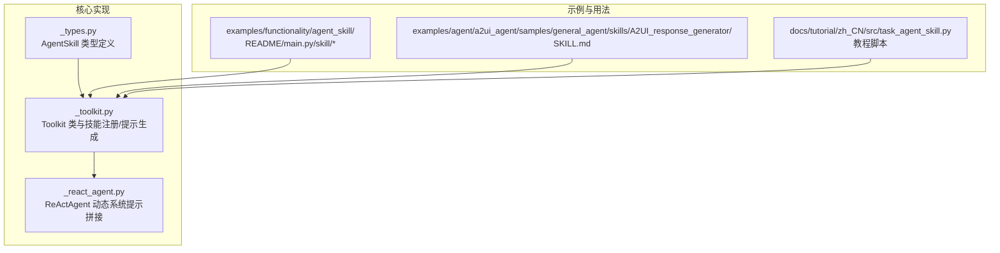
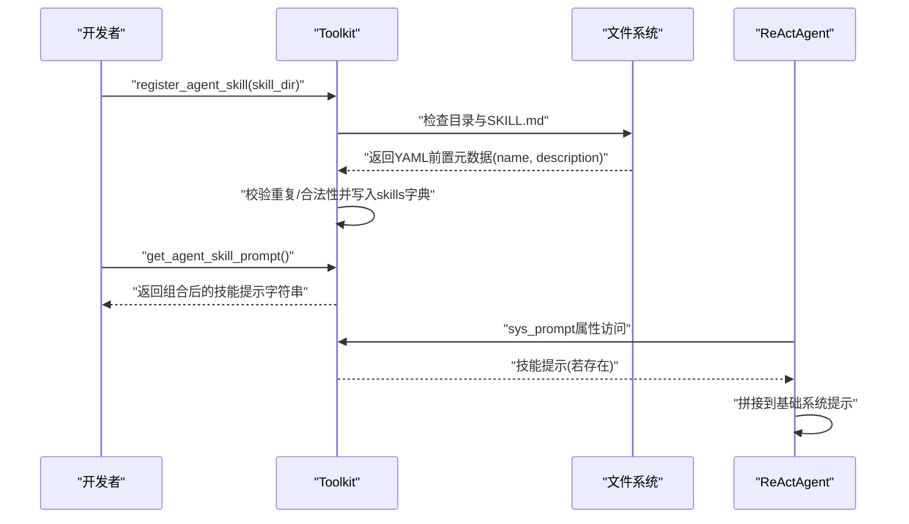
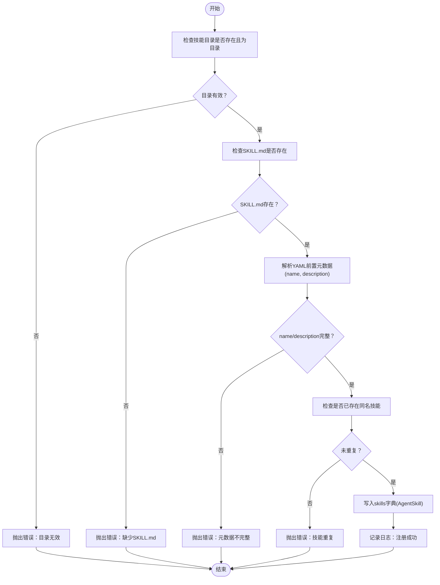
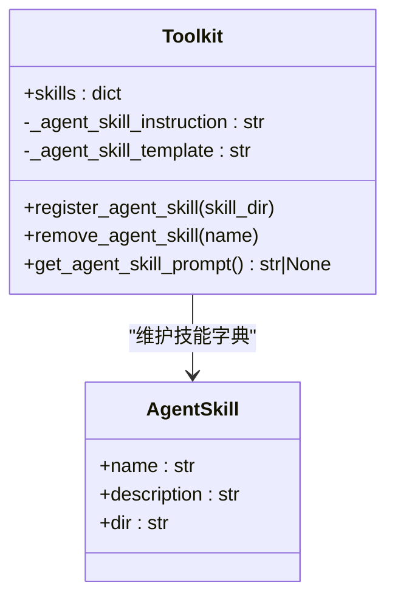
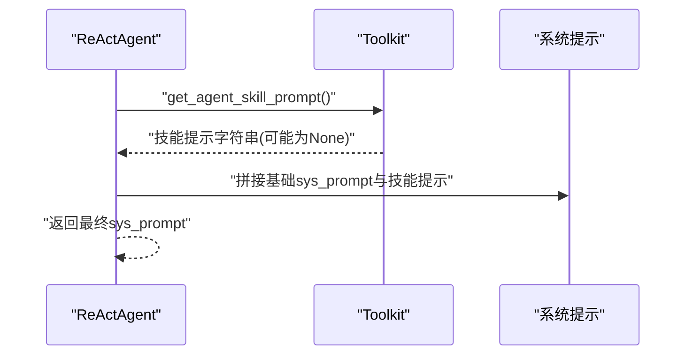
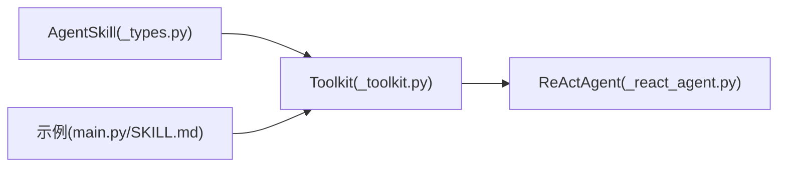

# 智能体技能系统

<cite>
**本文引用的文件**
- [src/agentscope/tool/_toolkit.py](file://src/agentscope/tool/_toolkit.py)
- [src/agentscope/tool/_types.py](file://src/agentscope/tool/_types.py)
- [src/agentscope/agent/_react_agent.py](file://src/agentscope/agent/_react_agent.py)
- [examples/functionality/agent_skill/README.md](file://examples/functionality/agent_skill/README.md)
- [examples/functionality/agent_skill/main.py](file://examples/functionality/agent_skill/main.py)
- [examples/functionality/agent_skill/skill/analyzing-agentscope-library/SKILL.md](file://examples/functionality/agent_skill/skill/analyzing-agentscope-library/SKILL.md)
- [examples/functionality/agent_skill/skill/analyzing-agentscope-library/view_agentscope_module.py](file://examples/functionality/agent_skill/skill/analyzing-agentscope-library/view_agentscope_module.py)
- [examples/agent/a2ui_agent/samples/general_agent/skills/A2UI_response_generator/SKILL.md](file://examples/agent/a2ui_agent/samples/general_agent/skills/A2UI_response_generator/SKILL.md)
- [examples/agent/a2ui_agent/samples/general_agent/setup_a2ui_server.py](file://examples/agent/a2ui_agent/samples/general_agent/setup_a2ui_server.py)
- [docs/tutorial/zh_CN/src/task_agent_skill.py](file://docs/tutorial/zh_CN/src/task_agent_skill.py)
</cite>

## 目录
1. [简介](#简介)
2. [项目结构](#项目结构)
3. [核心组件](#核心组件)
4. [架构总览](#架构总览)
5. [详细组件分析](#详细组件分析)
6. [依赖关系分析](#依赖关系分析)
7. [性能考量](#性能考量)
8. [故障排查指南](#故障排查指南)
9. [结论](#结论)
10. [附录](#附录)

## 简介
本文件面向使用者与开发者，系统性阐述 AgentScope 智能体技能系统的设计理念、目录结构、元数据规范、动态提示生成机制、注册与激活流程，以及在智能体中的应用方式与开发实践。同时，对比工具系统与技能系统的差异与联系，给出可操作的开发示例、集成案例与调试方法。

## 项目结构
围绕“智能体技能”的关键代码与示例分布于以下位置：
- 核心实现：工具箱 Toolkit（技能注册、提示生成）、类型定义 AgentSkill、ReActAgent（系统提示拼接技能提示）
- 示例与用法：功能示例 skill 目录、A2UI 技能示例、教程脚本

图表来源
- [src/agentscope/tool/_toolkit.py:117-185](file://src/agentscope/tool/_toolkit.py#L117-L185)
- [src/agentscope/tool/_types.py:152-161](file://src/agentscope/tool/_types.py#L152-L161)
- [src/agentscope/agent/_react_agent.py:366-374](file://src/agentscope/agent/_react_agent.py#L366-L374)
- [examples/functionality/agent_skill/main.py:19-50](file://examples/functionality/agent_skill/main.py#L19-L50)
- [examples/functionality/agent_skill/skill/analyzing-agentscope-library/SKILL.md:1-79](file://examples/functionality/agent_skill/skill/analyzing-agentscope-library/SKILL.md#L1-L79)
- [examples/agent/a2ui_agent/samples/general_agent/skills/A2UI_response_generator/SKILL.md:1-148](file://examples/agent/a2ui_agent/samples/general_agent/skills/A2UI_response_generator/SKILL.md#L1-L148)
- [docs/tutorial/zh_CN/src/task_agent_skill.py:36-124](file://docs/tutorial/zh_CN/src/task_agent_skill.py#L36-L124)

章节来源
- [src/agentscope/tool/_toolkit.py:117-185](file://src/agentscope/tool/_toolkit.py#L117-L185)
- [src/agentscope/tool/_types.py:152-161](file://src/agentscope/tool/_types.py#L152-L161)
- [src/agentscope/agent/_react_agent.py:366-374](file://src/agentscope/agent/_react_agent.py#L366-L374)
- [examples/functionality/agent_skill/README.md:1-34](file://examples/functionality/agent_skill/README.md#L1-L34)
- [examples/functionality/agent_skill/main.py:19-50](file://examples/functionality/agent_skill/main.py#L19-L50)
- [examples/functionality/agent_skill/skill/analyzing-agentscope-library/SKILL.md:1-79](file://examples/functionality/agent_skill/skill/analyzing-agentscope-library/SKILL.md#L1-L79)
- [examples/agent/a2ui_agent/samples/general_agent/skills/A2UI_response_generator/SKILL.md:1-148](file://examples/agent/a2ui_agent/samples/general_agent/skills/A2UI_response_generator/SKILL.md#L1-L148)
- [docs/tutorial/zh_CN/src/task_agent_skill.py:36-124](file://docs/tutorial/zh_CN/src/task_agent_skill.py#L36-L124)

## 核心组件
- Toolkit（工具箱）
  - 负责技能注册、删除、统一提示生成；维护技能字典与默认提示模板
  - 关键接口：register_agent_skill、remove_agent_skill、get_agent_skill_prompt
- AgentSkill（技能类型）
  - 保存技能名称、描述与目录路径，作为技能元数据
- ReActAgent（智能体）
  - 在系统提示中动态拼接技能提示，形成“技能增强”的上下文

章节来源
- [src/agentscope/tool/_toolkit.py:139-150](file://src/agentscope/tool/_toolkit.py#L139-L150)
- [src/agentscope/tool/_toolkit.py:152-185](file://src/agentscope/tool/_toolkit.py#L152-L185)
- [src/agentscope/tool/_toolkit.py:1328-1394](file://src/agentscope/tool/_toolkit.py#L1328-L1394)
- [src/agentscope/tool/_toolkit.py:1396-1409](file://src/agentscope/tool/_toolkit.py#L1396-L1409)
- [src/agentscope/tool/_toolkit.py:1411-1439](file://src/agentscope/tool/_toolkit.py#L1411-L1439)
- [src/agentscope/tool/_types.py:152-161](file://src/agentscope/tool/_types.py#L152-L161)
- [src/agentscope/agent/_react_agent.py:366-374](file://src/agentscope/agent/_react_agent.py#L366-L374)

## 架构总览
技能系统围绕“目录扫描—元数据提取—动态提示生成—智能体拼接”展开，形成“声明式技能目录 + 可执行提示”的闭环。

图表来源
- [src/agentscope/tool/_toolkit.py:1328-1394](file://src/agentscope/tool/_toolkit.py#L1328-L1394)
- [src/agentscope/tool/_toolkit.py:1411-1439](file://src/agentscope/tool/_toolkit.py#L1411-L1439)
- [src/agentscope/agent/_react_agent.py:366-374](file://src/agentscope/agent/_react_agent.py#L366-L374)

## 详细组件分析

### 组件一：技能目录与元数据（SKILL.md）
- 必备要求
  - 目录顶层必须包含 SKILL.md
  - SKILL.md 使用 YAML 前置元数据，包含 name 与 description
  - 目录内文件需共享同一根路径（用于统一提示中的 dir 占位）
- 元数据用途
  - name：技能唯一标识，用于去重与索引
  - description：技能概要，用于提示展示
  - dir：技能目录路径，用于提示中指引用户查看具体文件

章节来源
- [src/agentscope/tool/_toolkit.py:1337-1342](file://src/agentscope/tool/_toolkit.py#L1337-L1342)
- [src/agentscope/tool/_toolkit.py:1364-1375](file://src/agentscope/tool/_toolkit.py#L1364-L1375)
- [examples/functionality/agent_skill/skill/analyzing-agentscope-library/SKILL.md:1-79](file://examples/functionality/agent_skill/skill/analyzing-agentscope-library/SKILL.md#L1-L79)
- [examples/agent/a2ui_agent/samples/general_agent/skills/A2UI_response_generator/SKILL.md:1-148](file://examples/agent/a2ui_agent/samples/general_agent/skills/A2UI_response_generator/SKILL.md#L1-L148)

### 组件二：技能注册流程（目录扫描与元数据提取）
- 步骤
  - 校验目录存在性与可读性
  - 校验 SKILL.md 存在性
  - 解析 YAML 前置元数据，校验 name 与 description
  - 去重检查（同名技能不允许重复注册）
  - 写入 Toolkit.skills 字典，记录 AgentSkill
- 错误处理
  - 目录不存在、缺少 SKILL.md、元数据缺失或重复注册均抛出异常

图表来源
- [src/agentscope/tool/_toolkit.py:1347-1394](file://src/agentscope/tool/_toolkit.py#L1347-L1394)

章节来源
- [src/agentscope/tool/_toolkit.py:1347-1394](file://src/agentscope/tool/_toolkit.py#L1347-L1394)

### 组件三：技能提示动态生成
- 默认提示结构
  - 总体说明：技能集合的用途与使用原则
  - 每个技能条目：名称、描述、目录指引
- 模板与占位符
  - 支持自定义 agent_skill_instruction 与 agent_skill_template
  - 模板需包含 {name}、{description}、{dir} 三个占位符
- 输出
  - 若无技能注册，返回 None；否则返回拼接后的字符串

图表来源
- [src/agentscope/tool/_toolkit.py:152-185](file://src/agentscope/tool/_toolkit.py#L152-L185)
- [src/agentscope/tool/_toolkit.py:1411-1439](file://src/agentscope/tool/_toolkit.py#L1411-L1439)
- [src/agentscope/tool/_types.py:152-161](file://src/agentscope/tool/_types.py#L152-L161)

章节来源
- [src/agentscope/tool/_toolkit.py:139-150](file://src/agentscope/tool/_toolkit.py#L139-L150)
- [src/agentscope/tool/_toolkit.py:152-185](file://src/agentscope/tool/_toolkit.py#L152-L185)
- [src/agentscope/tool/_toolkit.py:1411-1439](file://src/agentscope/tool/_toolkit.py#L1411-L1439)
- [src/agentscope/tool/_types.py:152-161](file://src/agentscope/tool/_types.py#L152-L161)

### 组件四：技能在智能体中的应用（系统提示拼接）
- ReActAgent.sys_prompt 属性
  - 动态获取 Toolkit.get_agent_skill_prompt()
  - 若存在技能提示，则将其拼接到基础系统提示之后
- 使用前提
  - 智能体需具备读取文本文件或执行 shell 命令的能力，以便访问 SKILL.md 中的使用说明

图表来源
- [src/agentscope/agent/_react_agent.py:366-374](file://src/agentscope/agent/_react_agent.py#L366-L374)
- [src/agentscope/tool/_toolkit.py:1411-1439](file://src/agentscope/tool/_toolkit.py#L1411-L1439)

章节来源
- [src/agentscope/agent/_react_agent.py:366-374](file://src/agentscope/agent/_react_agent.py#L366-L374)
- [docs/tutorial/zh_CN/src/task_agent_skill.py:108-109](file://docs/tutorial/zh_CN/src/task_agent_skill.py#L108-L109)

### 组件五：技能开发指南与最佳实践
- 目录结构规范
  - 顶层必须包含 SKILL.md
  - 可包含脚本、资源文件等，但需保证路径一致性
- SKILL.md 编写模板
  - YAML 前置元数据：name、description
  - 正文：概述、快速开始、步骤说明、可用文件清单、故障排查等
- 技能实现最佳实践
  - 将“如何使用”的说明与“可调用脚本/工具”的入口清晰分离
  - 使用 shell 命令工具执行脚本，避免硬编码复杂逻辑
  - 保持 SKILL.md 与脚本的一致性，便于智能体按提示正确调用

章节来源
- [src/agentscope/tool/_toolkit.py:1337-1342](file://src/agentscope/tool/_toolkit.py#L1337-L1342)
- [examples/functionality/agent_skill/skill/analyzing-agentscope-library/SKILL.md:1-79](file://examples/functionality/agent_skill/skill/analyzing-agentscope-library/SKILL.md#L1-L79)
- [examples/agent/a2ui_agent/samples/general_agent/skills/A2UI_response_generator/SKILL.md:1-148](file://examples/agent/a2ui_agent/samples/general_agent/skills/A2UI_response_generator/SKILL.md#L1-L148)

### 组件六：技能系统与工具系统的区别与联系
- 区别
  - 技能系统：声明式技能目录 + 动态提示，强调“如何使用”与“使用场景”
  - 工具系统：函数/脚本级工具注册，强调“可执行能力”与“参数模式”
- 联系
  - 两者均通过 Toolkit 管理，可共同为智能体提供上下文与能力
  - 技能提示常指导智能体调用工具系统中的函数/脚本

章节来源
- [src/agentscope/tool/_toolkit.py:121-137](file://src/agentscope/tool/_toolkit.py#L121-L137)
- [examples/functionality/agent_skill/main.py:23-27](file://examples/functionality/agent_skill/main.py#L23-L27)

### 组件七：集成案例与调试方法
- 集成案例
  - ReActAgent + Toolkit + 技能目录：在系统提示中注入技能提示
  - A2UI 响应生成技能：通过 shell 执行脚本加载 schema 与模板，再输出 A2UI JSON
- 调试方法
  - 打印 Toolkit.get_agent_skill_prompt() 与 ReActAgent.sys_prompt，确认拼接结果
  - 确保智能体具备读取文本文件或执行 shell 命令的能力
  - 检查 SKILL.md 的 YAML 元数据完整性与目录路径一致性

章节来源
- [examples/functionality/agent_skill/main.py:19-80](file://examples/functionality/agent_skill/main.py#L19-L80)
- [examples/functionality/agent_skill/skill/analyzing-agentscope-library/view_agentscope_module.py:201-291](file://examples/functionality/agent_skill/skill/analyzing-agentscope-library/view_agentscope_module.py#L201-L291)
- [examples/agent/a2ui_agent/samples/general_agent/setup_a2ui_server.py:179-197](file://examples/agent/a2ui_agent/samples/general_agent/setup_a2ui_server.py#L179-L197)
- [examples/agent/a2ui_agent/samples/general_agent/skills/A2UI_response_generator/SKILL.md:136-148](file://examples/agent/a2ui_agent/samples/general_agent/skills/A2UI_response_generator/SKILL.md#L136-L148)

## 依赖关系分析
- Toolkit 对 AgentSkill 的依赖：以 TypedDict 形式存储技能元数据
- ReActAgent 对 Toolkit 的依赖：通过 sys_prompt 动态拼接技能提示
- 示例对 Toolkit 的依赖：通过 register_agent_skill 与 get_agent_skill_prompt 完成技能集成

图表来源
- [src/agentscope/tool/_types.py:152-161](file://src/agentscope/tool/_types.py#L152-L161)
- [src/agentscope/tool/_toolkit.py:117-185](file://src/agentscope/tool/_toolkit.py#L117-L185)
- [src/agentscope/agent/_react_agent.py:366-374](file://src/agentscope/agent/_react_agent.py#L366-L374)
- [examples/functionality/agent_skill/main.py:19-50](file://examples/functionality/agent_skill/main.py#L19-L50)
- [examples/functionality/agent_skill/skill/analyzing-agentscope-library/SKILL.md:1-79](file://examples/functionality/agent_skill/skill/analyzing-agentscope-library/SKILL.md#L1-L79)

章节来源
- [src/agentscope/tool/_types.py:152-161](file://src/agentscope/tool/_types.py#L152-L161)
- [src/agentscope/tool/_toolkit.py:117-185](file://src/agentscope/tool/_toolkit.py#L117-L185)
- [src/agentscope/agent/_react_agent.py:366-374](file://src/agentscope/agent/_react_agent.py#L366-L374)
- [examples/functionality/agent_skill/main.py:19-50](file://examples/functionality/agent_skill/main.py#L19-L50)
- [examples/functionality/agent_skill/skill/analyzing-agentscope-library/SKILL.md:1-79](file://examples/functionality/agent_skill/skill/analyzing-agentscope-library/SKILL.md#L1-L79)

## 性能考量
- 目录扫描与 YAML 解析成本较低，适合在初始化阶段完成
- 提示拼接为纯字符串拼接，开销极小
- 建议将大型资源文件拆分为按需加载的脚本，减少一次性上下文大小

## 故障排查指南
- 目录不存在或非目录：检查路径与权限
- 缺少 SKILL.md：确保顶层包含该文件
- YAML 元数据缺失：确保包含 name 与 description
- 技能重复注册：修改 name 或移除旧注册
- 智能体无法看到技能说明：确认已注册文本读取或 shell 命令工具

章节来源
- [src/agentscope/tool/_toolkit.py:1349-1382](file://src/agentscope/tool/_toolkit.py#L1349-L1382)
- [docs/tutorial/zh_CN/src/task_agent_skill.py:108-109](file://docs/tutorial/zh_CN/src/task_agent_skill.py#L108-L109)

## 结论
AgentScope 的智能体技能系统以“声明式目录 + 动态提示”为核心，通过 Toolkit 的统一管理与 ReActAgent 的系统提示拼接，实现了“可发现、可解释、可扩展”的技能增强能力。配合工具系统，开发者可在不同粒度上为智能体提供“能力”与“使用指南”，从而在复杂任务中取得更好的表现。

## 附录
- 快速开始（基于教程脚本）
  - 创建 sample_skill 目录并编写 SKILL.md
  - 使用 Toolkit.register_agent_skill 注册技能
  - 通过 Toolkit.get_agent_skill_prompt 获取技能提示
  - 在 ReActAgent 中直接使用 toolkit 参数，系统提示将自动拼接技能提示

章节来源
- [docs/tutorial/zh_CN/src/task_agent_skill.py:36-124](file://docs/tutorial/zh_CN/src/task_agent_skill.py#L36-L124)