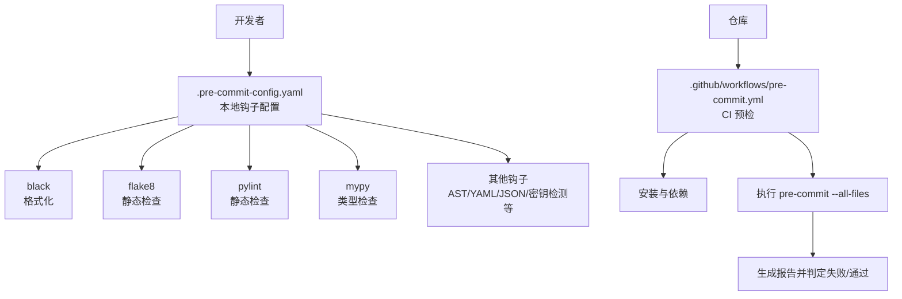
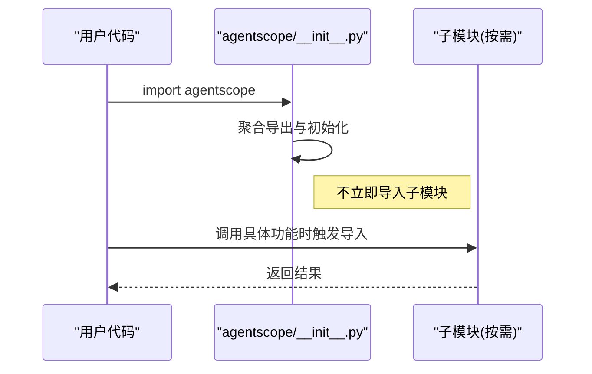
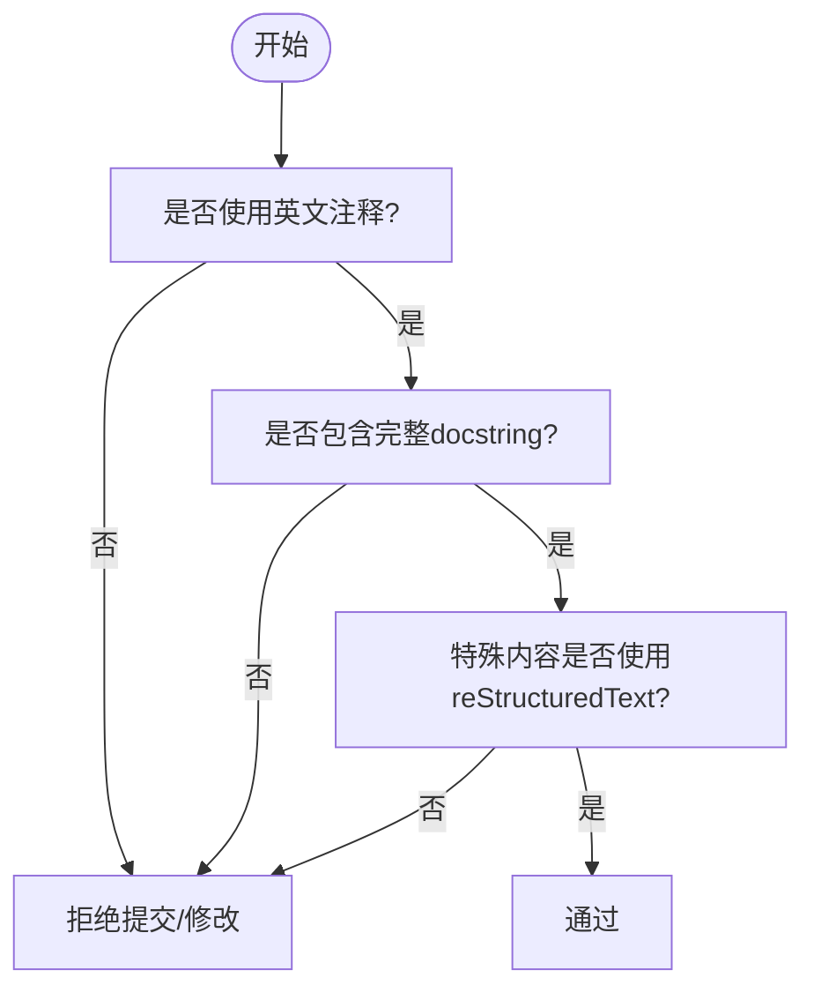
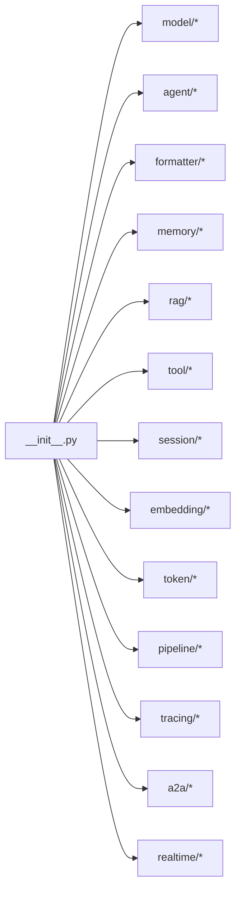

# 代码规范

<cite>
**本文引用的文件**
- [.pre-commit-config.yaml](file://.pre-commit-config.yaml)
- [pyproject.toml](file://pyproject.toml)
- [CONTRIBUTING.md](file://CONTRIBUTING.md)
- [CONTRIBUTING_zh.md](file://CONTRIBUTING_zh.md)
- [src/agentscope/__init__.py](file://src/agentscope/__init__.py)
- [src/agentscope/_logging.py](file://src/agentscope/_logging.py)
- [src/agentscope/model/_model_base.py](file://src/agentscope/model/_model_base.py)
- [src/agentscope/agent/_agent_base.py](file://src/agentscope/agent/_agent_base.py)
- [src/agentscope/formatter/_formatter_base.py](file://src/agentscope/formatter/_formatter_base.py)
- [.github/workflows/pre-commit.yml](file://.github/workflows/pre-commit.yml)
- [.gemini/styleguide.md](file://.gemini/styleguide.md)
- [.gitignore](file://.gitignore)
</cite>

## 目录
1. [引言](#引言)
2. [项目结构](#项目结构)
3. [核心组件](#核心组件)
4. [架构总览](#架构总览)
5. [详细组件分析](#详细组件分析)
6. [依赖分析](#依赖分析)
7. [性能考量](#性能考量)
8. [故障排查指南](#故障排查指南)
9. [结论](#结论)
10. [附录](#附录)

## 引言
本文件为 AgentScope 的代码规范指导文档，聚焦于代码风格、导入最佳实践、注释与文档字符串规范、代码审查清单、pre-commit 钩子规则、重构原则以及代码质量工具的使用方法。内容基于仓库中的配置与贡献指南提炼，旨在帮助贡献者与使用者在保持一致性的前提下提升代码质量与可维护性。

## 项目结构
AgentScope 采用分层模块化组织，核心包位于 src/agentscope 下，按功能域划分子模块（如 model、agent、formatter、memory、rag 等）。顶层入口模块负责聚合导出与初始化，日志模块提供统一的日志接口，版本信息集中管理。

```mermaid
graph TB
A["src/agentscope/__init__.py<br/>聚合导出与初始化"] --> B["src/agentscope/_logging.py<br/>日志配置与输出"]
A --> C["src/agentscope/model/_model_base.py<br/>模型抽象"]
A --> D["src/agentscope/agent/_agent_base.py<br/>智能体抽象"]
A --> E["src/agentscope/formatter/_formatter_base.py<br/>格式化抽象"]
A --> F["src/agentscope/memory/*<br/>内存实现"]
A --> G["src/agentscope/rag/*<br/>RAG实现"]
A --> H["src/agentscope/tool/*<br/>工具实现"]
A --> I["src/agentscope/session/*<br/>会话实现"]
A --> J["src/agentscope/embedding/*<br/>嵌入实现"]
A --> K["src/agentscope/token/*<br/>计数器实现"]
A --> L["src/agentscope/pipeline/*<br/>流水线实现"]
A --> M["src/agentscope/tracing/*<br/>追踪实现"]
A --> N["src/agentscope/a2a/*<br/>协议实现"]
A --> O["src/agentscope/realtime/*<br/>实时能力"]
```

图表来源
- [src/agentscope/__init__.py:1-183](file://src/agentscope/__init__.py#L1-L183)
- [src/agentscope/_logging.py:1-48](file://src/agentscope/_logging.py#L1-L48)
- [src/agentscope/model/_model_base.py:1-78](file://src/agentscope/model/_model_base.py#L1-L78)
- [src/agentscope/agent/_agent_base.py:1-775](file://src/agentscope/agent/_agent_base.py#L1-L775)
- [src/agentscope/formatter/_formatter_base.py:1-130](file://src/agentscope/formatter/_formatter_base.py#L1-L130)

章节来源
- [src/agentscope/__init__.py:1-183](file://src/agentscope/__init__.py#L1-L183)

## 核心组件
- 懒加载原则：顶层入口模块通过延迟导入各子模块，保证 import agentscope 的轻量化，避免不必要的依赖加载。
- 日志系统：统一的日志器与默认格式，支持控制台与文件输出，便于调试与生产环境输出控制。
- 抽象基类：模型、智能体、格式化器均提供抽象基类，约束实现契约，便于扩展与替换。

章节来源
- [src/agentscope/__init__.py:43-66](file://src/agentscope/__init__.py#L43-L66)
- [src/agentscope/_logging.py:15-48](file://src/agentscope/_logging.py#L15-L48)
- [src/agentscope/model/_model_base.py:13-78](file://src/agentscope/model/_model_base.py#L13-L78)
- [src/agentscope/agent/_agent_base.py:30-180](file://src/agentscope/agent/_agent_base.py#L30-L180)
- [src/agentscope/formatter/_formatter_base.py:11-130](file://src/agentscope/formatter/_formatter_base.py#L11-L130)

## 架构总览
AgentScope 的代码规范与质量保障由“配置 + 流水线 + 本地钩子”三部分构成：配置文件定义工具与规则；GitHub Actions 在 CI 中执行预检；本地 pre-commit 钩子在提交前强制校验。

图表来源
- [.pre-commit-config.yaml:1-108](file://.pre-commit-config.yaml#L1-L108)
- [.github/workflows/pre-commit.yml:1-38](file://.github/workflows/pre-commit.yml#L1-L38)

章节来源
- [.pre-commit-config.yaml:1-108](file://.pre-commit-config.yaml#L1-L108)
- [.github/workflows/pre-commit.yml:1-38](file://.github/workflows/pre-commit.yml#L1-L38)

## 详细组件分析

### 代码风格与命名约定
- 编码声明：文件顶部使用编码声明，确保跨平台一致性。
- 导入顺序与风格：遵循工具链统一的导入排序与格式化规则（见后续工具章节）。
- 命名约定：遵循项目内既有约定（如模块、类、函数命名），并在抽象基类中体现清晰的职责边界。

章节来源
- [src/agentscope/__init__.py:1-10](file://src/agentscope/__init__.py#L1-L10)
- [src/agentscope/model/_model_base.py:16-20](file://src/agentscope/model/_model_base.py#L16-L20)
- [src/agentscope/agent/_agent_base.py:33-44](file://src/agentscope/agent/_agent_base.py#L33-L44)

### 导入语句最佳实践与懒加载
- 懒加载原则：顶层入口模块延迟导入各子模块，避免 import agentscope 时加载大量依赖，提升启动速度与可用性。
- 局部导入：在具体函数或方法内部按需导入第三方库，减少全局依赖污染。
- 依赖隔离：通过可选依赖与 extras（见 pyproject.toml）将非核心能力隔离，按需安装。

图表来源
- [src/agentscope/__init__.py:43-66](file://src/agentscope/__init__.py#L43-L66)

章节来源
- [src/agentscope/__init__.py:43-66](file://src/agentscope/__init__.py#L43-L66)
- [pyproject.toml:47-194](file://pyproject.toml#L47-L194)

### 注释与文档字符串规范
- 统一英文注释：团队内部规范要求使用英文注释与文档字符串。
- 完整 docstring：类与方法需具备完整 docstring，遵循模板化格式，包含参数、返回值说明。
- 特殊内容格式：使用 reStructuredText 语法书写注意事项、提示、重要信息与代码块。
- 团队补充：允许在特定场景（如系统提示词参数）进行有限豁免，但需在评审中明确说明。

图表来源
- [.gemini/styleguide.md:42-96](file://.gemini/styleguide.md#L42-L96)

章节来源
- [.gemini/styleguide.md:42-96](file://.gemini/styleguide.md#L42-L96)
- [CONTRIBUTING.md:112-124](file://CONTRIBUTING.md#L112-L124)

### 代码审查检查清单
- 功能性
  - 是否覆盖新增/变更功能的单元测试？
  - 是否遵循懒加载原则，避免不必要的依赖加载？
  - 是否保持向后兼容或明确标注破坏性变更？
- 性能
  - 是否避免在热路径上进行昂贵的全局导入？
  - 是否合理使用缓存与异步机制？
- 安全性
  - 是否避免在日志中泄露敏感信息？
  - 是否对输入参数进行必要校验与异常处理？

章节来源
- [CONTRIBUTING.md:289-310](file://CONTRIBUTING.md#L289-L310)

### pre-commit 钩子自动检查内容与规则
- 静态检查
  - AST 合法性、YAML/JSON/XML/TOML 校验、文档字符串优先、空白字符清理、私钥检测。
- 格式化
  - black：行宽限制、统一缩进与空行策略。
- 静态分析
  - flake8：基础风格与常见问题检查（含忽略规则）。
  - pylint：针对 Python 代码的静态分析（含禁用规则列表）。
  - mypy：类型检查（含忽略缺失导入、跳转策略等配置）。
- 其他
  - pyroma：包质量评分。

章节来源
- [.pre-commit-config.yaml:1-108](file://.pre-commit-config.yaml#L1-L108)

### 代码质量工具使用
- black
  - 行宽：79 列；统一格式化。
- flake8
  - 基础风格检查；对特定规则进行扩展忽略。
- isort
  - 未在当前配置中启用；若引入，建议与 black 协同，统一导入排序。
- mypy
  - 类型检查；对缺失导入与跳转策略进行配置。
- pylint
  - 静态分析；对多项规则进行禁用以适配项目现状。
- pyroma
  - 包质量评分。

章节来源
- [.pre-commit-config.yaml:51-102](file://.pre-commit-config.yaml#L51-L102)

### 重构原则与时机
- 重构时机
  - 代码重复、可读性差、性能瓶颈、测试覆盖不足。
- 重构原则
  - 保持功能不变；逐步小步迭代；确保测试通过；必要时引入懒加载与抽象基类以增强可替换性。

章节来源
- [src/agentscope/model/_model_base.py:13-78](file://src/agentscope/model/_model_base.py#L13-L78)
- [src/agentscope/agent/_agent_base.py:30-180](file://src/agentscope/agent/_agent_base.py#L30-L180)
- [src/agentscope/formatter/_formatter_base.py:11-130](file://src/agentscope/formatter/_formatter_base.py#L11-L130)

## 依赖分析
- 顶层入口模块对各子模块采用延迟导入，降低启动成本。
- 可选依赖通过 extras 分离，避免核心库臃肿。
- CI 与本地钩子共同保障代码质量，形成闭环。

图表来源
- [src/agentscope/__init__.py:43-66](file://src/agentscope/__init__.py#L43-L66)

章节来源
- [src/agentscope/__init__.py:43-66](file://src/agentscope/__init__.py#L43-L66)
- [pyproject.toml:47-194](file://pyproject.toml#L47-L194)

## 性能考量
- 懒加载：减少 import 时的依赖解析与模块加载时间。
- 异步与事件循环：在智能体与实时能力中合理使用异步，避免阻塞。
- 日志输出：生产环境可关闭控制台输出，减少 I/O 影响。
- 缓存与队列：在需要流式输出与多模态处理时，注意缓存与队列的容量与清理策略。

章节来源
- [src/agentscope/_logging.py:15-48](file://src/agentscope/_logging.py#L15-L48)
- [src/agentscope/agent/_agent_base.py:172-183](file://src/agentscope/agent/_agent_base.py#L172-L183)

## 故障排查指南
- 提交被阻断
  - 检查本地是否安装并注册 pre-commit；运行全量检查以定位失败项。
  - 查看 CI 日志中的失败信息，逐条修复。
- 黑格式化冲突
  - 使用 black 自动格式化；确保编辑器保存时触发格式化。
- flake8/ pylint 报错
  - 遵循项目忽略规则；如确需调整，应在评审中说明。
- mypy 类型报错
  - 按需添加类型注解；必要时在 mypy 配置中显式处理跳转与缺失导入。
- 日志输出异常
  - 检查日志级别与输出目标；确认环境变量对输出控制的影响。

章节来源
- [.github/workflows/pre-commit.yml:24-38](file://.github/workflows/pre-commit.yml#L24-L38)
- [.pre-commit-config.yaml:51-102](file://.pre-commit-config.yaml#L51-L102)

## 结论
AgentScope 的代码规范围绕“懒加载、统一格式化、静态检查与类型检查、完备的文档字符串”展开，并通过 pre-commit 与 CI 形成闭环。遵循本文规范与检查清单，可在保证功能正确的同时显著提升代码质量与可维护性。

## 附录
- 提交信息与 PR 标题遵循 Conventional Commits 规范，确保变更可追溯。
- .gitignore 排除构建产物、虚拟环境与 IDE 临时文件，保持仓库整洁。

章节来源
- [CONTRIBUTING.md:28-91](file://CONTRIBUTING.md#L28-L91)
- [.gitignore:1-151](file://.gitignore#L1-L151)