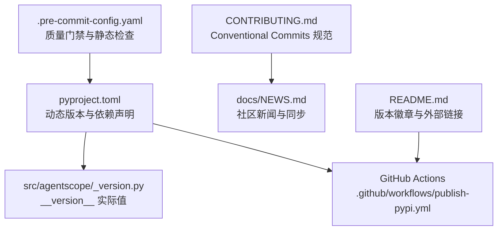
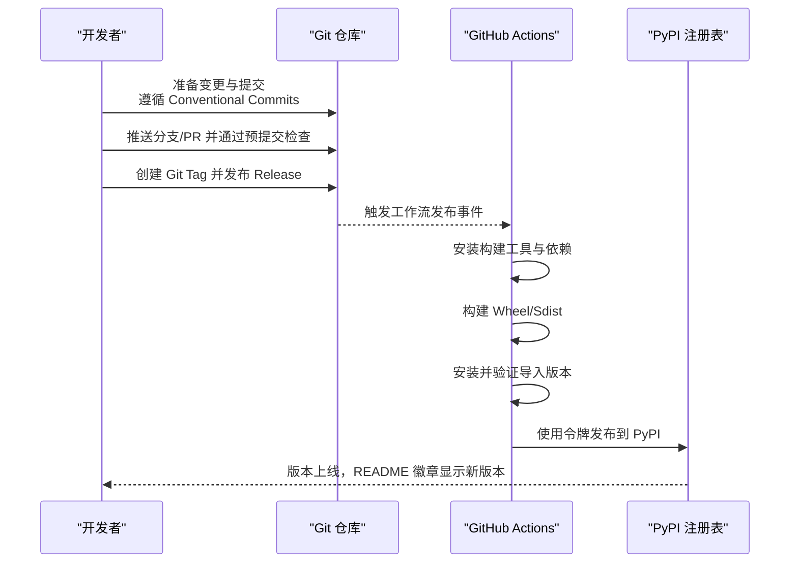
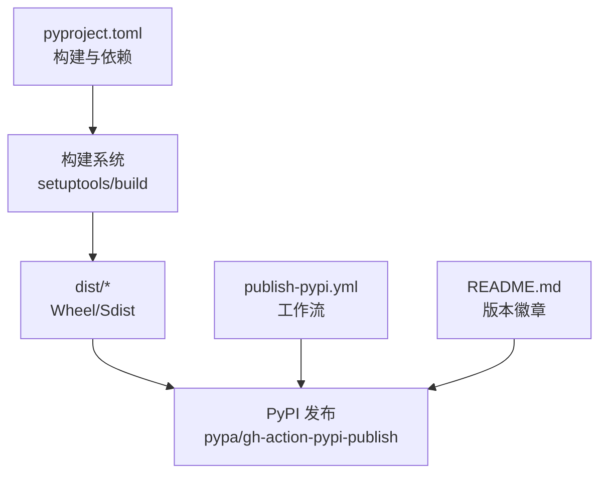

# 发布流程

<cite>
**本文引用的文件**
- [pyproject.toml](file://pyproject.toml)
- [_version.py](file://src/agentscope/_version.py)
- [README.md](file://README.md)
- [CONTRIBUTING.md](file://CONTRIBUTING.md)
- [.pre-commit-config.yaml](file://.pre-commit-config.yaml)
- [publish-pypi.yml](file://.github/workflows/publish-pypi.yml)
- [NEWS.md](file://docs/NEWS.md)
- [changelog.md](file://docs/changelog.md)
</cite>

## 目录
1. [简介](#简介)
2. [项目结构](#项目结构)
3. [核心组件](#核心组件)
4. [架构总览](#架构总览)
5. [详细组件分析](#详细组件分析)
6. [依赖分析](#依赖分析)
7. [性能考虑](#性能考虑)
8. [故障排查指南](#故障排查指南)
9. [结论](#结论)
10. [附录](#附录)

## 简介
本文件面向 AgentScope 的发布团队与贡献者，系统性地说明版本管理策略、变更日志维护、发布前检查清单、包发布流程（含 PyPI 发布、版本标签与发布说明）、回滚与紧急修复流程、不同发布类型（主版本、次版本、补丁版本）的注意事项，以及发布后的监控与问题处理建议。内容基于仓库中现有配置与文档进行归纳与提炼，确保可操作、可追溯。

## 项目结构
围绕发布相关的仓库关键位置如下：
- 版本号来源：动态版本由构建系统从模块属性读取，实际值在版本文件中定义
- 包元数据与依赖：集中在项目配置文件中
- 变更日志与新闻：位于文档目录，用于维护发布说明与社区公告
- 发布自动化：通过 GitHub Actions 工作流实现 PyPI 自动发布
- 质量门禁：预提交钩子与贡献指南约束提交与 PR 规范

图表来源
- [pyproject.toml:1-214](file://pyproject.toml#L1-L214)
- [_version.py:1-5](file://src/agentscope/_version.py#L1-L5)
- [publish-pypi.yml:1-44](file://.github/workflows/publish-pypi.yml#L1-L44)
- [CONTRIBUTING.md:28-91](file://CONTRIBUTING.md#L28-L91)
- [NEWS.md:1-25](file://docs/NEWS.md#L1-L25)
- [.pre-commit-config.yaml:1-108](file://.pre-commit-config.yaml#L1-L108)
- [README.md:20-32](file://README.md#L20-L32)

章节来源
- [pyproject.toml:1-214](file://pyproject.toml#L1-L214)
- [_version.py:1-5](file://src/agentscope/_version.py#L1-L5)
- [publish-pypi.yml:1-44](file://.github/workflows/publish-pypi.yml#L1-L44)
- [CONTRIBUTING.md:28-91](file://CONTRIBUTING.md#L28-L91)
- [NEWS.md:1-25](file://docs/NEWS.md#L1-L25)
- [.pre-commit-config.yaml:1-108](file://.pre-commit-config.yaml#L1-L108)
- [README.md:20-32](file://README.md#L20-L32)

## 核心组件
- 版本号管理
  - 动态版本：构建系统通过工具字段从模块属性读取版本
  - 实际版本：在版本文件中显式定义
- 包元数据与依赖
  - 项目名称、描述、许可证、Python 版本要求、核心依赖与可选分组
- 变更日志与新闻
  - NEWS 文档作为“事实来源”，自动同步至 README
  - changelog 提供版本级概要与变更条目
- 发布自动化
  - GitHub Actions 在发布事件触发时构建并发布到 PyPI
- 质量门禁
  - 预提交钩子覆盖语法、类型、风格与安全检查
  - 贡献指南强制 Conventional Commits 规范与 PR 标题校验

章节来源
- [pyproject.toml:2-45](file://pyproject.toml#L2-L45)
- [pyproject.toml:212-214](file://pyproject.toml#L212-L214)
- [_version.py:4](file://src/agentscope/_version.py#L4)
- [NEWS.md:1-25](file://docs/NEWS.md#L1-L25)
- [changelog.md:1-99](file://docs/changelog.md#L1-L99)
- [publish-pypi.yml:9-44](file://.github/workflows/publish-pypi.yml#L9-L44)
- [CONTRIBUTING.md:28-91](file://CONTRIBUTING.md#L28-L91)
- [.pre-commit-config.yaml:1-108](file://.pre-commit-config.yaml#L1-L108)

## 架构总览
以下序列图展示从本地准备到 PyPI 发布的关键步骤，映射到实际仓库配置与工作流。

图表来源
- [publish-pypi.yml:9-44](file://.github/workflows/publish-pypi.yml#L9-L44)
- [pyproject.toml:212-214](file://pyproject.toml#L212-L214)
- [README.md:20-32](file://README.md#L20-L32)
- [CONTRIBUTING.md:28-91](file://CONTRIBUTING.md#L28-L91)

## 详细组件分析

### 版本管理策略与语义化版本控制
- 版本号来源与动态解析
  - 构建系统通过工具字段从模块属性读取版本，实际值在版本文件中定义
- 版本号规则
  - 当前版本采用后继版本标记（post）标识开发迭代，遵循语义化版本的基本原则
- 发布周期
  - 建议以里程碑或功能完成为节点进行发布；结合变更日志与新闻进行版本说明

章节来源
- [pyproject.toml:212-214](file://pyproject.toml#L212-L214)
- [_version.py:4](file://src/agentscope/_version.py#L4)

### 变更日志维护方法
- 变更分类
  - 使用约定的类别前缀（如 FEAT、FIX、DOCS、INTG、COMM、RELS 等）标注变更类型
- 格式规范
  - Conventional Commits 规范用于提交与 PR 标题
  - 新闻条目采用统一格式，便于自动同步至 README
- 自动化生成
  - 新闻文件作为“事实来源”，通过工作流同步到 README
  - changelog 提供版本级概要，便于生成发布说明

章节来源
- [CONTRIBUTING.md:28-91](file://CONTRIBUTING.md#L28-L91)
- [NEWS.md:1-25](file://docs/NEWS.md#L1-L25)
- [changelog.md:1-99](file://docs/changelog.md#L1-L99)

### 发布前检查清单
- 测试通过验证
  - 运行单元测试，确保所有用例通过
- 文档更新检查
  - 更新 NEWS 与 changelog，确保与变更一致
  - README 中的版本徽章与链接指向最新版本
- 依赖版本确认
  - 核对核心依赖与可选分组，避免破坏性升级
- 质量门禁
  - 通过预提交钩子（语法、类型、风格、安全检查）
- 提交与 PR 规范
  - 遵循 Conventional Commits，PR 标题符合规范

章节来源
- [CONTRIBUTING.md:125-139](file://CONTRIBUTING.md#L125-L139)
- [CONTRIBUTING.md:28-91](file://CONTRIBUTING.md#L28-L91)
- [.pre-commit-config.yaml:1-108](file://.pre-commit-config.yaml#L1-L108)
- [README.md:20-32](file://README.md#L20-L32)

### 包发布的流程（PyPI、标签、发布说明）
- PyPI 发布
  - 工作流在发布事件触发时执行：安装构建工具、构建包、安装并验证、使用令牌发布
- 版本标签创建
  - 建议在 Git 上创建与版本匹配的标签，配合发布说明
- 发布说明编写
  - 基于 NEWS 与 changelog 生成发布说明，突出特性、修复与迁移提示

章节来源
- [publish-pypi.yml:9-44](file://.github/workflows/publish-pypi.yml#L9-L44)
- [NEWS.md:1-25](file://docs/NEWS.md#L1-L25)
- [changelog.md:1-99](file://docs/changelog.md#L1-L99)

### 回滚与紧急修复流程
- 回滚策略
  - 若发布存在问题，可回退到上一个稳定标签版本
  - 如需撤销已发布包，遵循 PyPI 官方回滚/移除政策
- 紧急修复
  - 通过补丁版本快速修复问题，同时更新 NEWS 与 changelog
  - 通过预提交与测试门禁保证修复质量

章节来源
- [publish-pypi.yml:9-44](file://.github/workflows/publish-pypi.yml#L9-L44)
- [NEWS.md:1-25](file://docs/NEWS.md#L1-L25)
- [.pre-commit-config.yaml:1-108](file://.pre-commit-config.yaml#L1-L108)

### 不同发布类型的处理方式
- 主版本（Major）
  - 引入破坏性变更，需在 NEWS 与 changelog 中明确标注迁移路径
- 次版本（Minor）
  - 新功能与向后兼容的变更，建议在 NEWS 中记录特性亮点
- 补丁版本（Patch）
  - 仅修复问题，保持 API 兼容，通过测试与预提交验证

章节来源
- [changelog.md:1-99](file://docs/changelog.md#L1-L99)
- [NEWS.md:1-25](file://docs/NEWS.md#L1-L25)
- [CONTRIBUTING.md:28-91](file://CONTRIBUTING.md#L28-L91)

### 发布后的监控与问题处理
- 监控
  - 关注 README 版本徽章是否更新，PyPI 页面是否可见
- 问题处理
  - 若用户反馈问题，依据 NEWS 与 changelog 快速定位影响范围
  - 通过补丁版本修复并同步更新发布说明

章节来源
- [README.md:20-32](file://README.md#L20-L32)
- [NEWS.md:1-25](file://docs/NEWS.md#L1-L25)
- [changelog.md:1-99](file://docs/changelog.md#L1-L99)

## 依赖分析
发布相关依赖与集成点：
- 构建与发布
  - 构建系统与打包工具链
  - GitHub Actions 工作流与 PyPI 发布令牌
- 版本与文档
  - 动态版本解析与 README 版本徽章联动
- 质量与合规
  - 预提交钩子与贡献指南共同保障提交质量与规范

图表来源
- [pyproject.toml:208-214](file://pyproject.toml#L208-L214)
- [publish-pypi.yml:20-44](file://.github/workflows/publish-pypi.yml#L20-L44)
- [README.md:20-32](file://README.md#L20-L32)

章节来源
- [pyproject.toml:208-214](file://pyproject.toml#L208-L214)
- [publish-pypi.yml:20-44](file://.github/workflows/publish-pypi.yml#L20-L44)
- [README.md:20-32](file://README.md#L20-L32)

## 性能考虑
- 发布流程性能
  - 使用最小化依赖安装与缓存策略，缩短构建时间
  - 将测试与验证步骤前置到本地与 PR 钩子，减少失败重试成本
- 版本解析与一致性
  - 统一从模块属性读取版本，避免多处不一致导致的发布错误

## 故障排查指南
- PyPI 发布失败
  - 检查工作流中的构建与安装步骤输出
  - 确认令牌权限与网络可达性
- 版本不一致
  - 核对版本文件与动态版本解析配置
- 预提交失败
  - 逐项修复语法、类型与风格问题，必要时调整钩子参数
- README 版本徽章未更新
  - 确认 NEWS 同步工作流已运行且成功

章节来源
- [publish-pypi.yml:20-44](file://.github/workflows/publish-pypi.yml#L20-L44)
- [pyproject.toml:212-214](file://pyproject.toml#L212-L214)
- [.pre-commit-config.yaml:1-108](file://.pre-commit-config.yaml#L1-L108)
- [NEWS.md:1-25](file://docs/NEWS.md#L1-L25)

## 结论
本发布流程文档基于仓库现有配置与规范，明确了版本管理、变更日志、发布前检查、PyPI 发布、回滚与紧急修复、不同发布类型注意事项以及发布后监控。建议在实际执行中严格遵循 Conventional Commits、预提交检查与工作流触发条件，确保发布过程可追溯、可重复、高质量。

## 附录
- 关键文件索引
  - 版本与构建：pyproject.toml、_version.py
  - 发布自动化：publish-pypi.yml
  - 质量门禁：.pre-commit-config.yaml
  - 变更与新闻：NEWS.md、changelog.md
  - 社区与文档：README.md、CONTRIBUTING.md